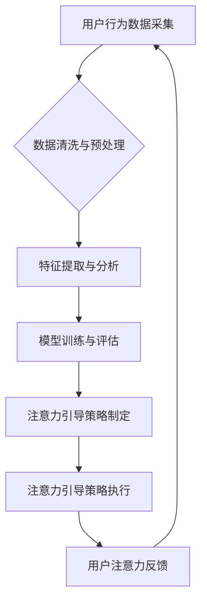

                 

##  注意力经济与数据驱动的决策制定：利用数据增强业务和市场洞察力

> 关键词：注意力经济、数据驱动决策、机器学习、深度学习、自然语言处理、数据可视化、商业洞察

### 1. 背景介绍

在当今信息爆炸的时代，人们面临着来自各方信息的冲击，注意力已成为稀缺的资源。这被称为“注意力经济”。在这个背景下，企业需要更加精准地把握用户注意力，并利用数据驱动决策，以提升业务效率和市场竞争力。数据驱动的决策制定是指利用数据分析和机器学习等技术，从海量数据中挖掘有价值的信息，为决策提供科学依据。

传统的决策制定往往依赖于经验和直觉，容易受到主观因素的影响，缺乏客观性和可重复性。而数据驱动的决策制定则能够提供更客观、更精准的决策支持，帮助企业做出更明智的选择。

### 2. 核心概念与联系

#### 2.1 注意力经济

注意力经济是指在信息过载的时代，人们对信息的筛选和选择能力成为重要的资源。注意力是有限的，人们需要花费时间和精力来集中注意力在特定的信息上。因此，获取和保持用户注意力成为了企业竞争的关键。

#### 2.2 数据驱动决策

数据驱动决策是指利用数据分析和机器学习等技术，从海量数据中挖掘有价值的信息，为决策提供科学依据。数据驱动决策能够帮助企业：

* **提高决策的准确性:** 数据分析能够提供更客观、更全面的信息，帮助企业做出更准确的决策。
* **降低决策的风险:** 数据驱动决策能够帮助企业识别潜在的风险，并制定相应的应对措施。
* **提高决策的效率:** 数据分析能够自动化许多决策过程，提高决策的效率。

#### 2.3 数据驱动的注意力经济

数据驱动的注意力经济是指利用数据分析和机器学习等技术，了解用户注意力行为，并根据这些行为进行精准的注意力引导。

**数据驱动的注意力经济流程图:**



### 3. 核心算法原理 & 具体操作步骤

#### 3.1 算法原理概述

数据驱动的注意力经济主要依赖于机器学习和深度学习算法。这些算法能够从用户行为数据中学习用户注意力模式，并根据这些模式进行精准的注意力引导。常见的算法包括：

* **推荐系统:** 基于用户的历史行为数据，推荐用户可能感兴趣的内容，引导用户注意力。
* **自然语言处理 (NLP):** 分析用户文本数据，识别用户关注的主题和关键词，并根据这些信息进行个性化的内容推荐。
* **计算机视觉:** 分析用户图像数据，识别用户关注的物体和场景，并根据这些信息进行个性化的内容推荐。

#### 3.2 算法步骤详解

1. **数据采集:** 收集用户行为数据，例如用户点击、浏览、停留时间等。
2. **数据清洗与预处理:** 清洗和预处理数据，去除噪声和异常值，并将其转换为机器学习算法可以理解的格式。
3. **特征提取与分析:** 从用户行为数据中提取特征，例如用户兴趣、偏好、行为模式等。
4. **模型训练与评估:** 使用机器学习算法训练模型，并评估模型的性能。
5. **注意力引导策略制定:** 根据模型的预测结果，制定注意力引导策略，例如推荐个性化内容、调整内容排序、使用视觉引导等。
6. **注意力引导策略执行:** 将注意力引导策略应用于实际场景，引导用户注意力。
7. **用户注意力反馈:** 收集用户注意力反馈，例如用户点击、浏览、停留时间等，并将其用于模型的迭代训练。

#### 3.3 算法优缺点

**优点:**

* **精准度高:** 数据驱动的注意力经济能够根据用户的个性化需求进行精准的注意力引导。
* **效率高:** 数据分析和机器学习算法能够自动化许多决策过程，提高决策效率。
* **可持续性强:** 通过不断收集和分析用户数据，模型能够不断优化，提高注意力引导的精准度和效率。

**缺点:**

* **数据依赖性强:** 数据驱动的注意力经济需要大量的数据支持，如果没有足够的数据，模型的性能会受到影响。
* **隐私风险:** 收集和使用用户数据需要考虑隐私风险，需要采取相应的措施保护用户隐私。
* **算法黑盒问题:** 一些机器学习算法的决策过程比较复杂，难以解释，这可能会导致用户对算法的信任度降低。

#### 3.4 算法应用领域

数据驱动的注意力经济在各个领域都有广泛的应用，例如：

* **电商:** 推荐个性化商品，引导用户注意力到感兴趣的产品。
* **社交媒体:** 推送个性化内容，提高用户参与度。
* **新闻媒体:** 推荐个性化新闻，提高用户阅读量。
* **教育:** 个性化学习推荐，提高学习效率。

### 4. 数学模型和公式 & 详细讲解 & 举例说明

#### 4.1 数学模型构建

数据驱动的注意力经济通常使用概率模型来预测用户注意力。例如，可以使用贝叶斯网络来建模用户对不同内容的兴趣，或者使用马尔可夫链来建模用户在不同内容之间的跳转行为。

#### 4.2 公式推导过程

假设我们有一个贝叶斯网络，用来预测用户对不同内容的兴趣。该网络包含以下节点：

* **用户:** 用户的特征，例如年龄、性别、兴趣爱好等。
* **内容:** 内容的特征，例如主题、类型、作者等。
* **注意力:** 用户对内容的注意力，是一个二元变量，表示用户是否关注该内容。

我们可以使用贝叶斯定理来计算用户对特定内容的注意力概率：

$$P(注意力|用户, 内容) = \frac{P(用户, 内容|注意力)P(注意力)}{P(用户, 内容)}$$

其中：

* $P(注意力|用户, 内容)$ 是用户对特定内容的注意力概率。
* $P(用户, 内容|注意力)$ 是用户和内容同时满足注意力条件的概率。
* $P(注意力)$ 是用户对任何内容的注意力概率。
* $P(用户, 内容)$ 是用户和内容同时出现的概率。

#### 4.3 案例分析与讲解

例如，假设我们有一个电商平台，想要预测用户对特定商品的注意力。我们可以使用贝叶斯网络来建模用户对商品的兴趣，并根据用户的特征和商品的特征，计算用户对该商品的注意力概率。

如果用户的特征和商品的特征都与用户的兴趣爱好相符，那么该商品的注意力概率就会更高。反之，如果用户的特征和商品的特征不匹配，那么该商品的注意力概率就会更低。

### 5. 项目实践：代码实例和详细解释说明

#### 5.1 开发环境搭建

* **操作系统:** Linux/macOS/Windows
* **编程语言:** Python
* **深度学习框架:** TensorFlow/PyTorch
* **数据处理库:** Pandas/NumPy
* **可视化库:** Matplotlib/Seaborn

#### 5.2 源代码详细实现

```python
import tensorflow as tf

# 定义模型结构
model = tf.keras.Sequential([
    tf.keras.layers.Embedding(input_dim=vocab_size, output_dim=embedding_dim),
    tf.keras.layers.LSTM(units=128),
    tf.keras.layers.Dense(units=1, activation='sigmoid')
])

# 编译模型
model.compile(optimizer='adam', loss='binary_crossentropy', metrics=['accuracy'])

# 训练模型
model.fit(x_train, y_train, epochs=10, batch_size=32)

# 评估模型
loss, accuracy = model.evaluate(x_test, y_test)
print('Loss:', loss)
print('Accuracy:', accuracy)
```

#### 5.3 代码解读与分析

* **Embedding层:** 将词向量化，将每个词映射到一个低维向量空间。
* **LSTM层:** 学习文本序列中的长期依赖关系。
* **Dense层:** 输出用户对内容的注意力概率。

#### 5.4 运行结果展示

训练完成后，我们可以使用模型预测用户对不同内容的注意力概率。

### 6. 实际应用场景

#### 6.1 电子商务

* **个性化商品推荐:** 根据用户的浏览历史、购买记录等数据，推荐用户可能感兴趣的商品。
* **内容推荐:** 根据用户的兴趣爱好，推荐相关的文章、视频、图片等内容。
* **广告投放:** 根据用户的兴趣爱好和行为模式，精准投放广告。

#### 6.2 社交媒体

* **个性化内容推送:** 根据用户的兴趣爱好和行为模式，推送个性化的新闻、视频、图片等内容。
* **用户群组推荐:** 根据用户的兴趣爱好和行为模式，推荐用户可能感兴趣的群组。
* **广告投放:** 根据用户的兴趣爱好和行为模式，精准投放广告。

#### 6.3 新闻媒体

* **个性化新闻推荐:** 根据用户的兴趣爱好和行为模式，推荐相关的新闻文章。
* **内容分类:** 根据新闻文章的内容，自动分类到不同的类别。
* **热点话题挖掘:** 分析用户对不同新闻话题的关注度，挖掘热点话题。

#### 6.4 未来应用展望

随着人工智能技术的不断发展，数据驱动的注意力经济将会在更多领域得到应用，例如：

* **教育:** 个性化学习推荐，提高学习效率。
* **医疗:** 个性化医疗建议，提高医疗服务质量。
* **金融:** 个性化理财建议，提高投资收益。

### 7. 工具和资源推荐

#### 7.1 学习资源推荐

* **书籍:**
    * 《深度学习》
    * 《机器学习实战》
    * 《Python数据科学手册》
* **在线课程:**
    * Coursera
    * edX
    * Udacity

#### 7.2 开发工具推荐

* **Python:** 
* **TensorFlow:** 
* **PyTorch:** 
* **Pandas:** 
* **NumPy:**

#### 7.3 相关论文推荐

* **Attention Is All You Need:** https://arxiv.org/abs/1706.03762
* **BERT: Pre-training of Deep Bidirectional Transformers for Language Understanding:** https://arxiv.org/abs/1810.04805

### 8. 总结：未来发展趋势与挑战

#### 8.1 研究成果总结

数据驱动的注意力经济已经取得了显著的成果，在各个领域都有广泛的应用。

#### 8.2 未来发展趋势

* **模型更加精准:** 随着算法和模型的不断改进，数据驱动的注意力经济将会更加精准，能够更好地理解用户的需求和行为模式。
* **应用场景更加广泛:** 数据驱动的注意力经济将会应用到更多领域，例如教育、医疗、金融等。
* **个性化程度更高:** 数据驱动的注意力经济将会更加个性化，能够根据用户的具体需求提供定制化的服务。

#### 8.3 面临的挑战

* **数据隐私:** 收集和使用用户数据需要考虑隐私风险，需要采取相应的措施保护用户隐私。
* **算法解释性:** 一些机器学习算法的决策过程比较复杂，难以解释，这可能会导致用户对算法的信任度降低。
* **算法公平性:** 数据驱动的注意力经济可能会存在算法偏见，导致某些用户受到不公平的对待。

#### 8.4 研究展望

未来，数据驱动的注意力经济的研究将继续深入，重点关注以下几个方面:

* **开发更加隐私保护的算法:** 研究更加隐私保护的算法，能够在保护用户隐私的同时，仍然能够有效地利用用户数据。
* **提高算法的解释性:** 研究能够解释算法决策过程的算法，提高用户对算法的信任度。
* **保证算法的公平性:** 研究能够保证算法公平性的算法，避免算法偏见导致不公平的对待。

### 9. 附录：常见问题与解答

**Q1: 数据驱动的注意力经济需要多少数据才能有效？**

A1: 数据驱动的注意力经济需要大量的用户行为数据才能有效。数据量的大小取决于模型的复杂度和应用场景的复杂度。一般来说，需要收集至少几万条用户行为数据才能训练出一个相对准确的模型。

**Q2: 数据驱动的注意力经济会侵犯用户隐私吗？**

A2: 数据驱动的注意力经济可能会涉及到用户隐私问题。因此，在收集和使用用户数据时，需要严格遵守隐私保护政策，并采取相应的措施保护用户隐私。

**Q3: 如何评估数据驱动的注意力经济的性能？**

A3: 数据驱动的注意力经济的性能可以通过多种指标来评估，例如准确率、召回率、F1-score等。具体的评估指标需要根据应用场景来选择。


作者：禅与计算机程序设计艺术 / Zen and the Art of Computer Programming 
<end_of_turn>

