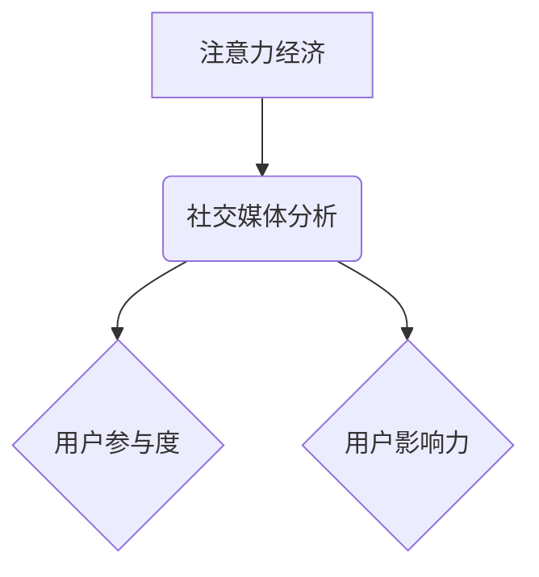

                 

## 1. 背景介绍

在当今数字时代，社交媒体已成为人们获取信息、交流互动和塑造个人形象的重要平台。对于企业和个人而言，理解社交媒体用户行为和影响力至关重要。注意力经济的概念应运而生，它强调了在信息过载的时代，用户对信息的筛选和选择能力日益重要。社交媒体平台上的用户注意力是宝贵的资源，掌握用户注意力可以帮助企业提升品牌知名度、促进产品销售和建立忠诚客户群体。

然而，社交媒体数据庞大复杂，如何有效地分析用户参与度和影响力是一个挑战。传统的分析方法难以捕捉到用户行为的细微变化和动态趋势。因此，需要借助先进的算法和技术手段，挖掘社交媒体数据中的隐藏价值，洞察用户行为模式和影响力机制。

## 2. 核心概念与联系

### 2.1 注意力经济

注意力经济是指在信息爆炸的时代，人们对信息的筛选和选择能力成为稀缺资源，而掌握用户注意力的企业或个人能够获得竞争优势。

### 2.2 社交媒体分析

社交媒体分析是指利用数据挖掘、机器学习等技术手段，从社交媒体平台上收集和分析用户数据，以洞察用户行为、趋势和影响力。

### 2.3 用户参与度和影响力

* **用户参与度**是指用户在社交媒体平台上的活跃程度，例如点赞、评论、转发、分享等行为。
* **用户影响力**是指用户在社交媒体平台上对其他用户的意见和行为产生影响的能力。

**核心概念关系图:**



## 3. 核心算法原理 & 具体操作步骤

### 3.1 算法原理概述

社交媒体分析中常用的算法包括：

* **PageRank算法:** 用于衡量用户影响力，类似于搜索引擎对网页排名。
* **中心性算法:** 用于识别社交网络中的关键节点，例如度中心性、接近中心性和介数中心性。
* **主题模型:** 用于分析用户发布的内容主题，例如LDA主题模型。
* **情感分析:** 用于识别用户评论和文本的情感倾向，例如积极、消极或中性。

### 3.2 算法步骤详解

以PageRank算法为例，其步骤如下：

1. **构建社交网络图:** 将用户视为节点，用户之间的互动关系（例如关注、点赞、评论）视为边，构建社交网络图。
2. **初始化PageRank值:** 为每个用户赋予初始PageRank值，通常设置为1/N，其中N为用户总数。
3. **迭代计算PageRank值:** 

    * 每个用户PageRank值等于其所有指向它的边的权重之和，除以指向该用户的边的总数。
    * 权重通常根据边类型和频率进行调整。
    * 迭代计算直到PageRank值收敛。

4. **排序用户:** 根据最终的PageRank值对用户进行排序，高PageRank值的用户具有更高的影响力。

### 3.3 算法优缺点

**优点:**

* 能够有效地衡量用户影响力。
* 算法原理简单易懂。

**缺点:**

* 难以捕捉到用户行为的动态变化。
* 对网络结构的假设较为简单，可能无法反映现实社交网络的复杂性。

### 3.4 算法应用领域

* **品牌营销:** 识别和与具有高影响力的用户合作，推广品牌产品和服务。
* **舆情监测:** 监测用户对特定事件或产品的评价，及时发现潜在风险。
* **用户画像:** 建立用户画像，了解用户兴趣爱好和行为模式。

## 4. 数学模型和公式 & 详细讲解 & 举例说明

### 4.1 数学模型构建

PageRank算法的数学模型可以表示为：

$$PR(u) = (1-d) + d \sum_{v \in \text{in}(u)} \frac{PR(v)}{out(v)}$$

其中：

* $PR(u)$ 表示用户u的PageRank值。
* $d$ 是阻尼因子，通常设置为0.85，表示用户在每次跳转时，有15%的概率随机跳转到其他页面。
* $in(u)$ 表示指向用户u的所有边。
* $out(v)$ 表示用户v指向的所有边的数量。

### 4.2 公式推导过程

PageRank值的计算基于迭代更新的过程。

1. 每个用户初始PageRank值设置为1/N。
2. 迭代计算每个用户PageRank值，公式如下：

$$PR(u)^{t+1} = (1-d) + d \sum_{v \in \text{in}(u)} \frac{PR(v)^{t}}{out(v)}$$

其中：

* $PR(u)^{t}$ 表示用户u在第t次迭代的PageRank值。
* $PR(u)^{t+1}$ 表示用户u在第t+1次迭代的PageRank值。

3. 迭代计算直到PageRank值收敛。

### 4.3 案例分析与讲解

假设有一个社交网络图，其中用户A、B、C、D四个用户之间存在着相互关注的关系。

* 用户A指向用户B、C，用户B指向用户C、D，用户C指向用户A、D，用户D指向用户A。

根据PageRank算法，我们可以计算每个用户的PageRank值。

* $PR(A) = (1-0.85) + 0.85 * (\frac{PR(B)}{out(B)} + \frac{PR(C)}{out(C)})$
* $PR(B) = (1-0.85) + 0.85 * (\frac{PR(A)}{out(A)} + \frac{PR(C)}{out(C)})$
* $PR(C) = (1-0.85) + 0.85 * (\frac{PR(A)}{out(A)} + \frac{PR(B)}{out(B)} + \frac{PR(D)}{out(D)})$
* $PR(D) = (1-0.85) + 0.85 * (\frac{PR(B)}{out(B)} + \frac{PR(C)}{out(C)})$

通过迭代计算，我们可以得到每个用户的最终PageRank值。

## 5. 项目实践：代码实例和详细解释说明

### 5.1 开发环境搭建

* Python 3.x
* NetworkX库
* Scikit-learn库

### 5.2 源代码详细实现

```python
import networkx as nx
from sklearn.metrics.pairwise import cosine_similarity

# 构建社交网络图
graph = nx.Graph()
graph.add_edges_from([(1, 2), (1, 3), (2, 3), (2, 4), (3, 1), (3, 4), (4, 1)])

# 计算PageRank值
pagerank = nx.pagerank(graph)

# 打印PageRank值
print(pagerank)

# 计算用户之间的相似度
adjacency_matrix = nx.to_numpy_array(graph)
similarity_matrix = cosine_similarity(adjacency_matrix)

# 打印相似度矩阵
print(similarity_matrix)
```

### 5.3 代码解读与分析

* 首先，我们使用NetworkX库构建社交网络图，并添加用户之间的互动关系。
* 然后，我们使用nx.pagerank()函数计算每个用户的PageRank值。
* 接着，我们使用Scikit-learn库的cosine_similarity()函数计算用户之间的相似度。

### 5.4 运行结果展示

运行上述代码，我们可以得到每个用户的PageRank值和用户之间的相似度矩阵。

## 6. 实际应用场景

### 6.1 品牌营销

* 识别和与具有高影响力的用户合作，推广品牌产品和服务。
* 通过分析用户兴趣爱好，精准投放广告，提高广告效果。

### 6.2 舆情监测

* 监测用户对特定事件或产品的评价，及时发现潜在风险。
* 分析用户情绪倾向，了解用户对品牌的认知和态度。

### 6.3 用户画像

* 建立用户画像，了解用户兴趣爱好和行为模式。
* 为用户提供个性化的产品和服务推荐。

### 6.4 未来应用展望

* 利用深度学习技术，更精准地分析用户行为和影响力。
* 将社交媒体分析与其他数据源结合，构建更全面的用户画像。
* 开发更智能的社交媒体营销工具，帮助企业更高效地进行营销活动。

## 7. 工具和资源推荐

### 7.1 学习资源推荐

* **书籍:**

    * 《社交网络分析》
    * 《数据挖掘导论》

* **在线课程:**

    * Coursera上的“社交网络分析”课程
    * edX上的“数据挖掘”课程

### 7.2 开发工具推荐

* **NetworkX:** Python库，用于构建和分析社交网络。
* **Scikit-learn:** Python库，用于机器学习和数据挖掘。
* **Gephi:** 用于可视化社交网络的开源软件。

### 7.3 相关论文推荐

* **PageRank: The Google Search Algorithm**
* **Topic Modeling for Social Media Analysis**
* **Sentiment Analysis of Social Media Text**

## 8. 总结：未来发展趋势与挑战

### 8.1 研究成果总结

社交媒体分析已经取得了显著的成果，为企业和个人提供了洞察用户行为和影响力的重要工具。

### 8.2 未来发展趋势

* 深度学习技术将进一步推动社交媒体分析的发展，实现更精准的用户行为预测和影响力分析。
* 多模态数据分析将成为新的研究方向，例如结合文本、图像、视频等多种数据源进行分析。
* 隐私保护将成为社交媒体分析面临的重要挑战，需要开发新的技术和方法来保护用户隐私。

### 8.3 面临的挑战

* 社交网络结构的复杂性，难以建模和分析。
* 用户行为的动态变化，需要开发更灵活的算法和模型。
* 数据质量问题，需要进行数据清洗和预处理。

### 8.4 研究展望

未来，社交媒体分析将继续朝着更精准、更智能、更隐私化的方向发展，为企业和个人提供更丰富的洞察和价值。

## 9. 附录：常见问题与解答

* **如何选择合适的社交媒体分析算法？**

    * 需要根据具体的分析目标和数据特点选择合适的算法。

* **如何处理社交媒体数据中的噪音和异常值？**

    * 需要进行数据清洗和预处理，去除噪音和异常值。

* **如何保证社交媒体分析的隐私性？**

    * 需要采用匿名化技术和差分隐私等方法来保护用户隐私。


作者：禅与计算机程序设计艺术 / Zen and the Art of Computer Programming 
<end_of_turn>

