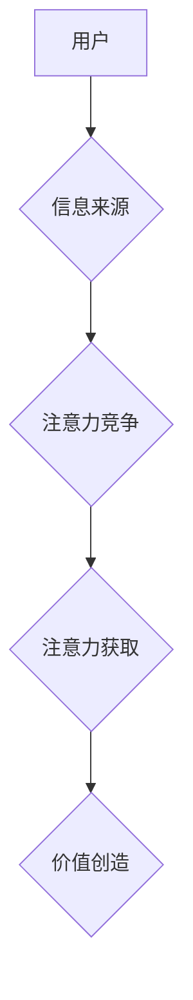

                 

##  注意力经济与社交媒体营销策略：在不牺牲用户体验的情况下有效吸引受众

> 关键词：注意力经济、社交媒体营销、用户体验、算法推荐、内容策略、数据分析、个性化推荐

## 1. 背景介绍

在当今数字时代，信息爆炸式增长，用户每天面临着海量信息的选择。如何有效地吸引用户的注意力，并将其转化为商业价值，成为企业和营销人员面临的重大挑战。 

注意力经济的概念应运而生，它强调了注意力是稀缺资源，而获取和保持用户注意力是至关重要的。社交媒体作为信息传播和用户互动的重要平台，在注意力经济中扮演着举足轻重的角色。 

然而，过度营销和信息轰炸会导致用户体验下降，甚至反效果。因此，如何在不牺牲用户体验的情况下，利用社交媒体平台的特性，有效地吸引用户注意力，成为社交媒体营销策略的关键。

## 2. 核心概念与联系

### 2.1 注意力经济

注意力经济是指在信息过载的时代，注意力成为一种稀缺资源，而获取和利用注意力是企业和个人获取价值的关键。 

**核心原理：**

* **注意力稀缺：** 用户每天只能集中精力处理有限的信息量。
* **注意力竞争：** 各种信息来源都在争夺用户的注意力。
* **注意力价值：** 获取和保持用户注意力具有商业价值。

**架构：**



### 2.2 社交媒体营销

社交媒体营销是指利用社交媒体平台进行营销推广，与目标用户建立互动关系，最终实现营销目标。

**核心目标：**

* **品牌认知度提升：** 通过社交媒体平台，扩大品牌知名度和影响力。
* **用户互动增强：** 与用户建立互动关系，提升用户参与度和忠诚度。
* **销售转化提升：** 通过社交媒体平台，引导用户进行购买行为。

**核心策略：**

* **内容营销：** 发布优质、有价值的内容，吸引用户关注。
* **社交互动：** 与用户积极互动，建立信任关系。
* **广告投放：** 利用社交媒体平台的广告功能，精准触达目标用户。

## 3. 核心算法原理 & 具体操作步骤

### 3.1 算法原理概述

社交媒体平台通常采用基于机器学习的推荐算法，来预测用户可能感兴趣的内容，并将其推荐给用户。 这些算法通常基于用户的历史行为数据，例如浏览记录、点赞、评论等，来构建用户画像，并推荐与用户兴趣相符的内容。

**常见推荐算法：**

* **协同过滤：** 基于用户的相似性，推荐用户可能感兴趣的内容。
* **内容过滤：** 基于内容的特征，推荐与用户兴趣相符的内容。
* **混合推荐：** 结合协同过滤和内容过滤，提高推荐效果。

### 3.2 算法步骤详解

1. **数据收集：** 收集用户的历史行为数据，例如浏览记录、点赞、评论等。
2. **数据预处理：** 对收集到的数据进行清洗、转换和特征提取。
3. **模型训练：** 使用机器学习算法，训练推荐模型。
4. **推荐生成：** 根据用户的特征和模型预测，生成推荐内容列表。
5. **结果评估：** 通过点击率、转化率等指标，评估推荐效果。

### 3.3 算法优缺点

**优点：**

* **个性化推荐：** 根据用户的兴趣和偏好，推荐个性化内容。
* **提高用户粘性：** 通过推荐感兴趣的内容，提高用户在平台上的停留时间。
* **提升商业价值：** 通过推荐商品或服务，促进销售转化。

**缺点：**

* **数据依赖：** 推荐算法依赖于用户的历史行为数据，对于新用户或数据稀疏的情况，推荐效果可能较差。
* **冷启动问题：** 新用户或新内容缺乏历史数据，难以进行推荐。
* **信息茧房效应：** 算法可能会过度推荐用户已经感兴趣的内容，导致用户视野狭窄。

### 3.4 算法应用领域

推荐算法广泛应用于各种领域，例如：

* **电商平台：** 推荐商品、优惠券、促销活动。
* **视频平台：** 推荐视频、电视剧、电影。
* **音乐平台：** 推荐歌曲、专辑、音乐人。
* **社交媒体平台：** 推荐好友、群组、话题。

## 4. 数学模型和公式 & 详细讲解 & 举例说明

### 4.1 数学模型构建

协同过滤推荐算法通常使用矩阵分解模型，将用户-物品交互矩阵分解成两个低维矩阵，分别表示用户特征和物品特征。

**用户-物品交互矩阵：**

$$
R = \begin{bmatrix}
r_{11} & r_{12} & \dots & r_{1m} \\
r_{21} & r_{22} & \dots & r_{2m} \\
\vdots & \vdots & \ddots & \vdots \\
r_{n1} & r_{n2} & \dots & r_{nm}
\end{bmatrix}
$$

其中，$r_{ij}$ 表示用户 $i$ 对物品 $j$ 的评分或交互行为。

**用户特征矩阵：**

$$
P = \begin{bmatrix}
p_{11} & p_{12} & \dots & p_{1k} \\
p_{21} & p_{22} & \dots & p_{2k} \\
\vdots & \vdots & \ddots & \vdots \\
p_{n1} & p_{n2} & \dots & p_{nk}
\end{bmatrix}
$$

**物品特征矩阵：**

$$
Q = \begin{bmatrix}
q_{11} & q_{12} & \dots & q_{1k} \\
q_{21} & q_{22} & \dots & q_{2k} \\
\vdots & \vdots & \ddots & \vdots \\
q_{m1} & q_{m2} & \dots & q_{mk}
\end{bmatrix}
$$

其中，$p_{ij}$ 表示用户 $i$ 的第 $j$ 个特征，$q_{ij}$ 表示物品 $j$ 的第 $i$ 个特征。

### 4.2 公式推导过程

目标是学习用户特征矩阵 $P$ 和物品特征矩阵 $Q$，使得预测的交互行为与实际交互行为尽可能接近。

常用的损失函数是均方误差：

$$
Loss = \frac{1}{2} \sum_{i=1}^{n} \sum_{j=1}^{m} (r_{ij} - \hat{r}_{ij})^2
$$

其中，$\hat{r}_{ij}$ 是预测的用户 $i$ 对物品 $j$ 的评分，$r_{ij}$ 是实际的评分。

通过梯度下降算法，最小化损失函数，学习出用户特征矩阵 $P$ 和物品特征矩阵 $Q$。

### 4.3 案例分析与讲解

假设我们有一个用户-物品交互矩阵，其中用户 $1$ 对物品 $1$ 的评分为 $5$，用户 $2$ 对物品 $1$ 的评分为 $3$，用户 $1$ 对物品 $2$ 的评分为 $4$，用户 $2$ 对物品 $2$ 的评分为 $2$。

我们可以使用矩阵分解模型，将这个交互矩阵分解成用户特征矩阵和物品特征矩阵。

通过学习用户特征矩阵和物品特征矩阵，我们可以预测用户 $3$ 对物品 $1$ 的评分，以及用户 $1$ 对物品 $3$ 的评分。

## 5. 项目实践：代码实例和详细解释说明

### 5.1 开发环境搭建

* Python 3.x
* TensorFlow 或 PyTorch 等深度学习框架
* Jupyter Notebook 或 VS Code 等代码编辑器

### 5.2 源代码详细实现

```python
import tensorflow as tf

# 定义用户-物品交互矩阵
ratings = tf.constant([[5, 4],
                       [3, 2]])

# 定义用户特征矩阵和物品特征矩阵
num_users = ratings.shape[0]
num_items = ratings.shape[1]
latent_dim = 10

user_embeddings = tf.Variable(tf.random.normal([num_users, latent_dim]))
item_embeddings = tf.Variable(tf.random.normal([num_items, latent_dim]))

# 计算预测评分
predictions = tf.matmul(user_embeddings, tf.transpose(item_embeddings))

# 定义损失函数
loss = tf.reduce_mean(tf.square(ratings - predictions))

# 定义优化器
optimizer = tf.keras.optimizers.Adam()

# 训练模型
for epoch in range(100):
    with tf.GradientTape() as tape:
        loss_value = loss
    gradients = tape.gradient(loss_value, [user_embeddings, item_embeddings])
    optimizer.apply_gradients(zip(gradients, [user_embeddings, item_embeddings]))

# 打印损失值
print(f"Epoch {epoch}, Loss: {loss_value.numpy()}")
```

### 5.3 代码解读与分析

* 代码首先定义了用户-物品交互矩阵，以及用户特征矩阵和物品特征矩阵的维度。
* 然后，使用 TensorFlow 库定义了用户特征矩阵和物品特征矩阵的变量，并使用随机数初始化。
* 计算预测评分，并定义损失函数，使用均方误差作为损失函数。
* 定义优化器，使用 Adam 优化器进行模型训练。
* 训练模型，并打印损失值。

### 5.4 运行结果展示

训练完成后，我们可以使用训练好的模型预测用户对物品的评分。

## 6. 实际应用场景

### 6.1 社交媒体内容推荐

社交媒体平台可以利用推荐算法，根据用户的兴趣和行为，推荐个性化的内容，例如新闻、视频、图片、文章等。

### 6.2 社交媒体广告投放

社交媒体平台可以利用推荐算法，精准地将广告投放给目标用户，提高广告的点击率和转化率。

### 6.3 社交媒体用户关系分析

社交媒体平台可以利用推荐算法，分析用户的社交关系，推荐潜在的朋友或群组，促进用户之间的互动。

### 6.4 未来应用展望

随着人工智能技术的不断发展，社交媒体营销策略将更加智能化和个性化。

* **更精准的推荐：** 利用更先进的机器学习算法，对用户的兴趣和偏好进行更精准的分析，推荐更符合用户需求的内容。
* **更个性化的体验：** 根据用户的个性化需求，定制化的内容和服务，提升用户体验。
* **更有效的互动：** 利用人工智能技术，实现更自然的用户与平台的互动，例如语音交互、视频聊天等。

## 7. 工具和资源推荐

### 7.1 学习资源推荐

* **书籍：**
    * 《深度学习》
    * 《推荐系统实践》
* **在线课程：**
    * Coursera: Machine Learning
    * Udacity: Deep Learning Nanodegree

### 7.2 开发工具推荐

* **Python:** 
    * TensorFlow
    * PyTorch
* **数据分析工具:**
    * Pandas
    * Scikit-learn

### 7.3 相关论文推荐

* **Collaborative Filtering for Implicit Feedback Datasets**
* **Deep Learning for Recommender Systems**

## 8. 总结：未来发展趋势与挑战

### 8.1 研究成果总结

注意力经济与社交媒体营销策略的结合，为企业提供了新的营销思路和方法。推荐算法在社交媒体营销中发挥着越来越重要的作用，帮助企业精准地触达目标用户，提升营销效果。

### 8.2 未来发展趋势

未来，社交媒体营销策略将更加智能化和个性化，人工智能技术将进一步推动社交媒体营销的发展。

* **更精准的推荐：** 利用更先进的机器学习算法，对用户的兴趣和偏好进行更精准的分析，推荐更符合用户需求的内容。
* **更个性化的体验：** 根据用户的个性化需求，定制化的内容和服务，提升用户体验。
* **更有效的互动：** 利用人工智能技术，实现更自然的用户与平台的互动，例如语音交互、视频聊天等。

### 8.3 面临的挑战

* **数据隐私保护：** 收集和使用用户数据需要谨慎，确保用户隐私的保护。
* **算法公平性：** 算法需要公平公正地对待所有用户，避免出现歧视或偏见。
* **用户信任问题：** 用户需要信任平台的推荐算法，否则可能会导致用户反感和抵触。

### 8.4 研究展望

未来，需要进一步研究如何提高推荐算法的精准度和个性化程度，同时也要关注算法的公平性、透明度和可解释性，确保算法的健康发展。


## 9. 附录：常见问题与解答

**Q1：如何评估推荐算法的效果？**

**A1：** 推荐算法的效果可以通过多种指标来评估，例如点击率、转化率、用户满意度等。

**Q2：如何解决推荐算法的冷启动问题？**

**A2：** 可以利用用户的其他信息，例如用户画像、社交关系等，来进行推荐。也可以使用协同过滤算法的变种，例如基于物品的协同过滤。

**Q3：如何避免推荐算法出现信息茧房效应？**

**A3：** 可以通过多样化推荐，推荐用户可能感兴趣但尚未接触过的内容，来打破信息茧房。


作者：禅与计算机程序设计艺术 / Zen and the Art of Computer Programming 
<end_of_turn>

