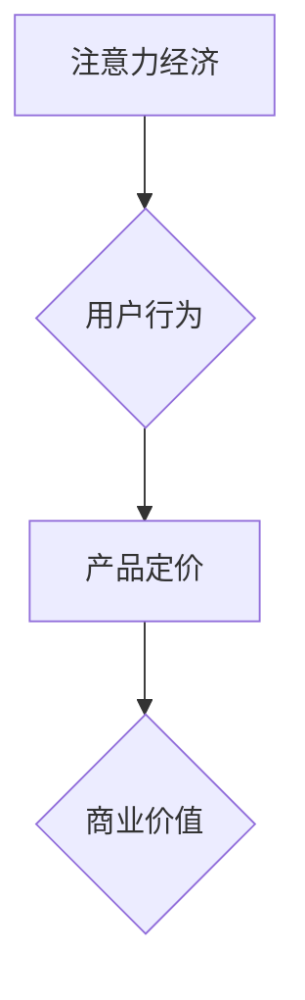

                 

##  注意力经济对企业产品定价的新要求

> 关键词：注意力经济、产品定价、用户行为、价值评估、算法模型、数据驱动

## 1. 背景介绍

在当今数字时代，信息爆炸和竞争日益激烈，用户面临着来自各方信息的冲击。如何有效地获取和利用信息，成为了一个关键问题。注意力经济应运而生，它强调了用户注意力是稀缺资源，而企业需要通过提供有价值的内容和服务，来吸引和留住用户的注意力。

传统的产品定价模型往往基于成本加成、市场竞争等因素，而忽略了用户注意力这一关键要素。随着注意力经济的兴起，企业产品定价需要进行新的思考和调整。

## 2. 核心概念与联系

### 2.1 注意力经济

注意力经济是指在信息过载的时代，用户注意力成为一种稀缺资源，而企业通过提供有价值的内容和服务，来吸引和留住用户的注意力，从而获取商业价值的经济模式。

### 2.2 产品定价

产品定价是指企业根据市场需求、成本、竞争等因素，为其产品设定价格的过程。

### 2.3 用户行为

用户行为是指用户在使用产品或服务时所采取的各种行动，例如浏览页面、点击链接、购买商品等。

**核心概念与联系流程图**



## 3. 核心算法原理 & 具体操作步骤

### 3.1 算法原理概述

注意力经济的产品定价算法，主要基于以下原理：

* **用户价值评估:** 通过分析用户行为数据，评估用户对产品的价值感知。
* **注意力成本:** 识别用户在使用产品时所花费的注意力成本，例如时间、精力、认知负担等。
* **注意力回报:** 衡量用户从产品中获得的注意力回报，例如信息获取、娱乐体验、情感满足等。
* **动态定价:** 根据用户行为和市场变化，动态调整产品价格，以最大化商业价值。

### 3.2 算法步骤详解

1. **数据收集:** 收集用户行为数据，例如浏览记录、点击行为、停留时间、购买记录等。
2. **用户画像:** 基于用户行为数据，构建用户画像，例如用户兴趣、偏好、消费习惯等。
3. **价值评估模型:** 建立用户价值评估模型，例如基于机器学习的推荐算法、用户参与度模型等。
4. **注意力成本模型:** 建立注意力成本模型，例如用户任务完成时间、用户注意力分散程度等。
5. **注意力回报模型:** 建立注意力回报模型，例如用户满意度、用户反馈、用户复购率等。
6. **动态定价策略:** 根据用户价值评估、注意力成本和注意力回报，制定动态定价策略，例如阶梯定价、个性化定价、限时优惠等。
7. **效果监控:** 持续监控产品定价策略的效果，并根据实际情况进行调整。

### 3.3 算法优缺点

**优点:**

* **数据驱动:** 基于用户行为数据，更精准地评估用户价值。
* **动态调整:** 根据市场变化和用户行为，动态调整产品价格，提高盈利能力。
* **个性化服务:** 为不同用户提供个性化的定价方案，提升用户体验。

**缺点:**

* **数据依赖:** 需要大量用户行为数据，才能训练出准确的模型。
* **算法复杂:** 建立用户价值评估、注意力成本和注意力回报模型，需要复杂的算法和技术。
* **伦理问题:** 动态定价可能会导致价格歧视，需要谨慎考虑伦理问题。

### 3.4 算法应用领域

注意力经济的产品定价算法，可以应用于各种领域，例如：

* **电商平台:** 为不同用户提供个性化的商品价格。
* **内容平台:** 根据用户阅读习惯，动态调整内容付费价格。
* **游戏平台:** 根据玩家游戏时长和付费意愿，调整游戏道具价格。
* **社交媒体平台:** 根据用户活跃度和互动程度，调整广告投放价格。

## 4. 数学模型和公式 & 详细讲解 & 举例说明

### 4.1 数学模型构建

用户价值评估模型可以采用以下数学模型：

$$
V = f(B, I, E)
$$

其中：

* $V$ 表示用户对产品的价值感知。
* $B$ 表示用户对产品的浏览行为，例如浏览次数、停留时间等。
* $I$ 表示用户对产品的互动行为，例如点击次数、评论次数等。
* $E$ 表示用户对产品的评价行为，例如评分、推荐等。

$f$ 是一个非线性函数，可以采用机器学习算法训练，以学习用户价值感知与行为之间的关系。

### 4.2 公式推导过程

注意力成本模型可以采用以下公式：

$$
C = g(T, D, F)
$$

其中：

* $C$ 表示用户在使用产品时所花费的注意力成本。
* $T$ 表示用户完成任务所需的时间。
* $D$ 表示用户注意力分散的程度。
* $F$ 表示用户认知负担的大小。

$g$ 是一个非线性函数，可以采用心理学模型或用户体验评估指标来构建。

### 4.3 案例分析与讲解

假设一个电商平台要对商品进行动态定价。

* 用户浏览商品的次数和停留时间较多，表示用户对该商品有较高的兴趣，可以将其视为高价值用户。
* 用户对商品进行了评论和评分，表示用户对该商品有较高的参与度，可以将其视为高价值用户。
* 用户购买了该商品，表示用户对该商品有较高的满意度，可以将其视为高价值用户。

根据以上分析，平台可以将高价值用户设定为更高的价格，而对低价值用户设定为更低的價格。

## 5. 项目实践：代码实例和详细解释说明

### 5.1 开发环境搭建

* Python 3.x
* Jupyter Notebook
* pandas
* scikit-learn
* TensorFlow

### 5.2 源代码详细实现

```python
# 导入必要的库
import pandas as pd
from sklearn.model_selection import train_test_split
from sklearn.linear_model import LinearRegression

# 加载用户行为数据
data = pd.read_csv('user_behavior.csv')

# 选择特征变量和目标变量
features = ['browse_count', 'stay_time', 'click_count', 'comment_count', 'rating']
target = 'purchase_price'

# 将数据分为训练集和测试集
X_train, X_test, y_train, y_test = train_test_split(data[features], data[target], test_size=0.2)

# 训练线性回归模型
model = LinearRegression()
model.fit(X_train, y_train)

# 对测试集进行预测
y_pred = model.predict(X_test)

# 评估模型性能
from sklearn.metrics import mean_squared_error
mse = mean_squared_error(y_test, y_pred)
print('模型均方误差:', mse)
```

### 5.3 代码解读与分析

* 代码首先导入必要的库，并加载用户行为数据。
* 然后选择特征变量和目标变量，并将数据分为训练集和测试集。
* 训练线性回归模型，并对测试集进行预测。
* 最后评估模型性能，例如使用均方误差来衡量模型的预测精度。

### 5.4 运行结果展示

运行以上代码，可以得到模型的均方误差值，以及对测试集的预测结果。

## 6. 实际应用场景

### 6.1 电商平台

电商平台可以根据用户的浏览记录、购买历史、评价行为等数据，为不同用户提供个性化的商品价格。例如，对经常购买高价商品的用户，可以提供更高的折扣；对经常购买低价商品的用户，可以提供更低的折扣。

### 6.2 内容平台

内容平台可以根据用户的阅读习惯、分享行为、点赞行为等数据，动态调整内容付费价格。例如，对经常阅读付费内容的用户，可以提供更优惠的价格；对偶尔阅读付费内容的用户，可以提供更高的价格。

### 6.3 游戏平台

游戏平台可以根据玩家的游戏时长、付费意愿、游戏等级等数据，调整游戏道具价格。例如，对经常付费的玩家，可以提供更优惠的价格；对偶尔付费的玩家，可以提供更高的价格。

### 6.4 未来应用展望

随着注意力经济的不断发展，产品定价算法将更加智能化、个性化和动态化。未来，产品定价将更加注重用户体验，并与其他技术，例如人工智能、大数据分析、区块链等，深度融合，形成更加完善的商业模式。

## 7. 工具和资源推荐

### 7.1 学习资源推荐

* **书籍:**

    * 《注意力经济》
    * 《数字营销》
    * 《数据驱动产品管理》

* **在线课程:**

    * Coursera: 数据科学
    * edX: 机器学习
    * Udacity: 人工智能

### 7.2 开发工具推荐

* **Python:** 

    * pandas
    * scikit-learn
    * TensorFlow

* **数据可视化工具:**

    * Tableau
    * Power BI

### 7.3 相关论文推荐

* **注意力经济的理论基础:**

    * "Attention is All You Need"

* **产品定价算法的研究:**

    * "Dynamic Pricing with Machine Learning"
    * "Personalized Pricing: A Survey"

## 8. 总结：未来发展趋势与挑战

### 8.1 研究成果总结

注意力经济的产品定价算法，为企业提供了新的思路和方法，可以帮助企业更好地理解用户价值，并制定更加精准的定价策略。

### 8.2 未来发展趋势

未来，注意力经济的产品定价算法将更加智能化、个性化和动态化。

* **更精准的用户价值评估:** 利用更先进的机器学习算法和数据分析技术，更加精准地评估用户价值。
* **更个性化的定价策略:** 根据用户的个性化需求和行为模式，制定更加个性化的定价策略。
* **更动态的定价机制:** 基于实时数据和市场变化，更加动态地调整产品价格。

### 8.3 面临的挑战

* **数据隐私保护:** 在收集和使用用户数据时，需要充分考虑数据隐私保护问题。
* **算法公平性:** 算法模型需要避免产生价格歧视等不公平现象。
* **用户信任:** 企业需要建立用户的信任，才能有效地实施注意力经济的产品定价策略。

### 8.4 研究展望

未来，注意力经济的产品定价算法将继续发展和完善，并与其他技术融合，为企业和用户带来更多价值。


## 9. 附录：常见问题与解答

**Q1: 注意力经济的产品定价算法是否会损害用户的利益？**

A1: 注意力经济的产品定价算法，如果合理应用，可以帮助企业提供更优质的产品和服务，并为用户带来更个性化的体验。但是，如果企业滥用算法，可能会导致价格歧视、信息不对称等问题，损害用户的利益。因此，需要制定相应的法律法规和伦理规范，引导企业合理应用注意力经济的产品定价算法。

**Q2: 如何评估用户对产品的价值感知？**

A2: 用户对产品的价值感知是一个复杂的概念，可以通过多种方式进行评估，例如：

* **用户行为数据:** 浏览记录、点击行为、停留时间、购买记录等。
* **用户评价数据:** 评分、评论、反馈等。
* **用户问卷调查:** 直接询问用户对产品的价值感知。

**Q3: 注意力经济的产品定价算法需要哪些技术支持？**

A3: 注意力经济的产品定价算法需要以下技术支持：

* **数据采集和处理:** 收集用户行为数据，并进行清洗、预处理等操作。
* **机器学习算法:** 建立用户价值评估、注意力成本和注意力回报模型。
* **数据可视化工具:** 可视化用户行为数据和模型结果。
* **云计算平台:** 提供数据存储、计算和分析能力。


作者：禅与计算机程序设计艺术 / Zen and the Art of Computer Programming 
<end_of_turn>

