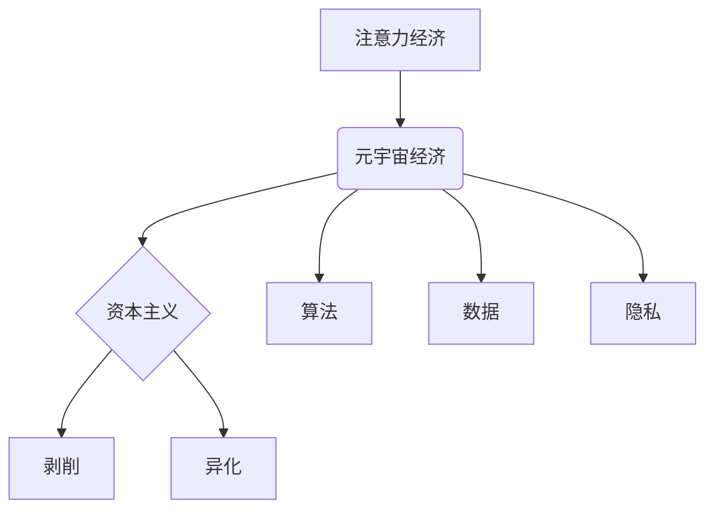

                 

## 注意力资本主义批判:元宇宙经济中的剥削与异化

> 关键词：元宇宙、注意力经济、资本主义、剥削、异化、算法、数据、隐私

## 1. 背景介绍

元宇宙概念的兴起，预示着人类社会进入一个全新的数字虚拟世界。这个虚拟世界将融合现实世界中的社交、娱乐、工作等多种活动，并通过沉浸式体验、虚拟身份和数字资产等特性，构建一个更加丰富多彩的虚拟生活。然而，元宇宙的构建和发展，也引发了人们对其潜在风险和伦理问题的担忧。

注意力经济是元宇宙经济的基础。在注意力经济中，人们的注意力被视为一种稀缺资源，而互联网平台通过各种手段，如个性化推荐、推送通知、社交互动等，来获取和利用用户的注意力。元宇宙将这一模式放大，通过虚拟现实、增强现实等技术，更加深入地介入用户的感知和行为，从而更加有效地获取和控制用户的注意力。

## 2. 核心概念与联系

**2.1 注意力经济**

注意力经济是指以获取和利用用户注意力为核心价值的经济模式。在这个模式下，用户注意力被视为一种稀缺资源，而互联网平台通过各种手段，如个性化推荐、推送通知、社交互动等，来获取和利用用户的注意力。

**2.2 元宇宙经济**

元宇宙经济是指在元宇宙环境中进行的经济活动。它将融合现实世界中的各种经济活动，如生产、消费、交易、投资等，并通过虚拟资产、数字身份等特性，构建一个更加虚拟化、去中心化的经济体系。

**2.3 资本主义**

资本主义是一种以私有制和市场机制为基础的经济制度。其核心特征是追求利润最大化，通过竞争和创新来推动经济发展。

**2.4 剥削与异化**

剥削是指资本家利用劳动力的剩余价值来获取利润的行为。异化是指在资本主义生产过程中，劳动者与劳动产品、自身和他人之间的关系被扭曲和 alienated。

**2.5 算法**

算法是指解决特定问题或完成特定任务的一系列步骤或规则。在注意力经济和元宇宙经济中，算法被广泛应用于用户行为分析、内容推荐、虚拟资产交易等领域。

**2.6 数据**

数据是注意力经济和元宇宙经济的基础。用户在元宇宙中产生的各种行为数据，如浏览记录、互动行为、虚拟资产交易等，都被收集和分析，以用于个性化推荐、广告投放、虚拟经济运营等。

**2.7 隐私**

隐私是指个人信息不被他人无权获取和利用的权利。在元宇宙经济中，用户的数据被广泛收集和利用，这引发了人们对隐私保护的担忧。

**核心概念与联系流程图**



## 3. 核心算法原理 & 具体操作步骤

**3.1 算法原理概述**

注意力经济的核心算法原理是通过分析用户行为数据，预测用户兴趣，并根据预测结果，推荐个性化内容和服务。这些算法通常基于机器学习和深度学习技术，通过训练大量的用户行为数据，学习用户行为模式，并根据模式预测用户未来的行为。

**3.2 算法步骤详解**

1. **数据收集:** 收集用户在元宇宙平台上的各种行为数据，如浏览记录、互动行为、虚拟资产交易等。
2. **数据预处理:** 对收集到的数据进行清洗、转换和格式化，以便于算法训练。
3. **特征提取:** 从用户行为数据中提取特征，如用户偏好、兴趣、行为模式等。
4. **模型训练:** 使用机器学习或深度学习算法，对提取的特征进行训练，构建用户行为预测模型。
5. **模型评估:** 使用测试数据评估模型的预测准确率，并根据评估结果进行模型优化。
6. **个性化推荐:** 根据用户行为预测模型的输出结果，为用户推荐个性化内容和服务。

**3.3 算法优缺点**

**优点:**

* **精准推荐:** 通过分析用户行为数据，算法可以精准地推荐用户感兴趣的内容和服务。
* **用户体验提升:** 个性化推荐可以提升用户体验，提高用户粘性。
* **商业价值:** 精准推荐可以帮助平台提高广告收入和销售额。

**缺点:**

* **数据隐私问题:** 用户行为数据收集和利用可能会侵犯用户隐私。
* **算法偏差:** 算法训练数据可能存在偏差，导致算法推荐结果存在偏见。
* **用户沉迷:** 个性化推荐可能会导致用户沉迷于元宇宙平台，影响现实生活。

**3.4 算法应用领域**

* **内容推荐:** 为用户推荐感兴趣的视频、文章、游戏等内容。
* **广告投放:** 根据用户兴趣，精准投放广告，提高广告效果。
* **虚拟商品交易:** 为用户推荐虚拟商品，促进虚拟商品交易。
* **社交互动:** 为用户推荐潜在的社交伙伴，促进用户互动。

## 4. 数学模型和公式 & 详细讲解 & 举例说明

**4.1 数学模型构建**

注意力经济中的核心数学模型是用户行为预测模型。该模型通常基于概率论和统计学原理，通过分析用户行为数据，预测用户未来的行为。

**4.2 公式推导过程**

用户行为预测模型的公式推导过程较为复杂，涉及到概率论、统计学、机器学习等多个领域。这里只列举一个简单的例子，以说明模型的基本原理。

假设我们想要预测用户是否会点击某个广告。我们可以使用逻辑回归模型，该模型将用户特征作为输入，输出用户点击广告的概率。

逻辑回归模型的公式如下：

$$P(click) = \frac{1}{1 + e^{-(w_0 + w_1 * x_1 + w_2 * x_2 + ... + w_n * x_n)}}$$

其中：

* $P(click)$ 是用户点击广告的概率。
* $w_0, w_1, w_2, ..., w_n$ 是模型参数，通过训练数据学习得到。
* $x_1, x_2, ..., x_n$ 是用户特征，如用户年龄、性别、兴趣等。

**4.3 案例分析与讲解**

假设我们有一个电商平台，想要预测用户是否会购买某个商品。我们可以收集用户浏览记录、购买历史、评价等数据，并使用逻辑回归模型进行训练。

训练完成后，我们可以将用户的特征输入到模型中，得到用户购买该商品的概率。如果概率大于某个阈值，则认为用户有购买意愿，平台可以向用户推送相关广告或优惠信息。

## 5. 项目实践：代码实例和详细解释说明

**5.1 开发环境搭建**

* 操作系统: Ubuntu 20.04
* Python 版本: 3.8
* 必要的库: pandas, numpy, scikit-learn

**5.2 源代码详细实现**

```python
import pandas as pd
from sklearn.linear_model import LogisticRegression

# 加载数据
data = pd.read_csv('user_data.csv')

# 划分训练集和测试集
X = data.drop('purchase', axis=1)
y = data['purchase']
from sklearn.model_selection import train_test_split
X_train, X_test, y_train, y_test = train_test_split(X, y, test_size=0.2, random_state=42)

# 创建逻辑回归模型
model = LogisticRegression()

# 训练模型
model.fit(X_train, y_train)

# 预测测试集结果
y_pred = model.predict(X_test)

# 评估模型性能
from sklearn.metrics import accuracy_score
accuracy = accuracy_score(y_test, y_pred)
print(f'模型准确率: {accuracy}')
```

**5.3 代码解读与分析**

* 首先，我们加载用户数据，并将其分为特征和目标变量。
* 然后，我们使用 train_test_split 函数将数据划分为训练集和测试集。
* 接下来，我们创建逻辑回归模型，并使用训练集进行模型训练。
* 训练完成后，我们使用测试集进行模型预测，并使用 accuracy_score 函数评估模型性能。

**5.4 运行结果展示**

运行上述代码后，会输出模型的准确率。

## 6. 实际应用场景

**6.1 元宇宙游戏**

在元宇宙游戏中，算法可以根据玩家的行为数据，推荐游戏任务、道具、装备等，提升玩家的游戏体验。

**6.2 元宇宙社交平台**

在元宇宙社交平台，算法可以根据用户的兴趣爱好，推荐潜在的社交伙伴，促进用户互动。

**6.3 元宇宙电商平台**

在元宇宙电商平台，算法可以根据用户的购买历史和浏览记录，推荐商品，提高商品销售额。

**6.4 未来应用展望**

随着元宇宙技术的不断发展，注意力经济和算法将发挥更加重要的作用。未来，我们可能会看到更加个性化、智能化的元宇宙体验，算法将更加深入地介入用户的虚拟生活，为用户提供更加精准、高效的服务。

## 7. 工具和资源推荐

**7.1 学习资源推荐**

* **书籍:**

    * 《注意力经济》
    * 《元宇宙》
    * 《深度学习》

* **在线课程:**

    * Coursera: 机器学习
    * Udacity: 深度学习

**7.2 开发工具推荐**

* **Python:** 

    * pandas
    * numpy
    * scikit-learn

* **Unity:** 

    * 构建元宇宙游戏

* **Unreal Engine:** 

    * 构建元宇宙游戏

**7.3 相关论文推荐**

* **Attention is All You Need**
* **Generative Pre-trained Transformer**
* **Metaverse: A New Paradigm for Human-Computer Interaction**

## 8. 总结：未来发展趋势与挑战

**8.1 研究成果总结**

注意力经济和元宇宙经济是数字时代的重要发展趋势，算法在其中发挥着关键作用。通过分析用户行为数据，算法可以精准地推荐内容和服务，提升用户体验，并为平台带来商业价值。

**8.2 未来发展趋势**

未来，注意力经济和元宇宙经济将更加深入地融入我们的生活，算法将更加智能化、个性化，并更加深入地介入用户的虚拟生活。

**8.3 面临的挑战**

注意力经济和元宇宙经济也面临着一些挑战，如数据隐私问题、算法偏差、用户沉迷等。我们需要积极探索解决方案，确保这些技术能够健康、可持续地发展。

**8.4 研究展望**

未来，我们需要更加深入地研究注意力经济和元宇宙经济的本质，探索算法的伦理边界，并制定相应的规范和政策，引导这些技术朝着更加健康、可持续的方向发展。

## 9. 附录：常见问题与解答

**9.1 如何保护用户隐私？**

在收集和利用用户数据时，需要严格遵守隐私保护政策，获得用户的明确同意，并采取必要的技术措施来保护用户的隐私。

**9.2 如何避免算法偏差？**

算法训练数据需要尽可能地全面、客观，并定期进行评估和优化，以避免算法偏差。

**9.3 如何防止用户沉迷？**

平台需要设置合理的限制机制，引导用户健康地使用元宇宙平台，并提供必要的帮助和支持。


作者：禅与计算机程序设计艺术 / Zen and the Art of Computer Programming 
<end_of_turn>

