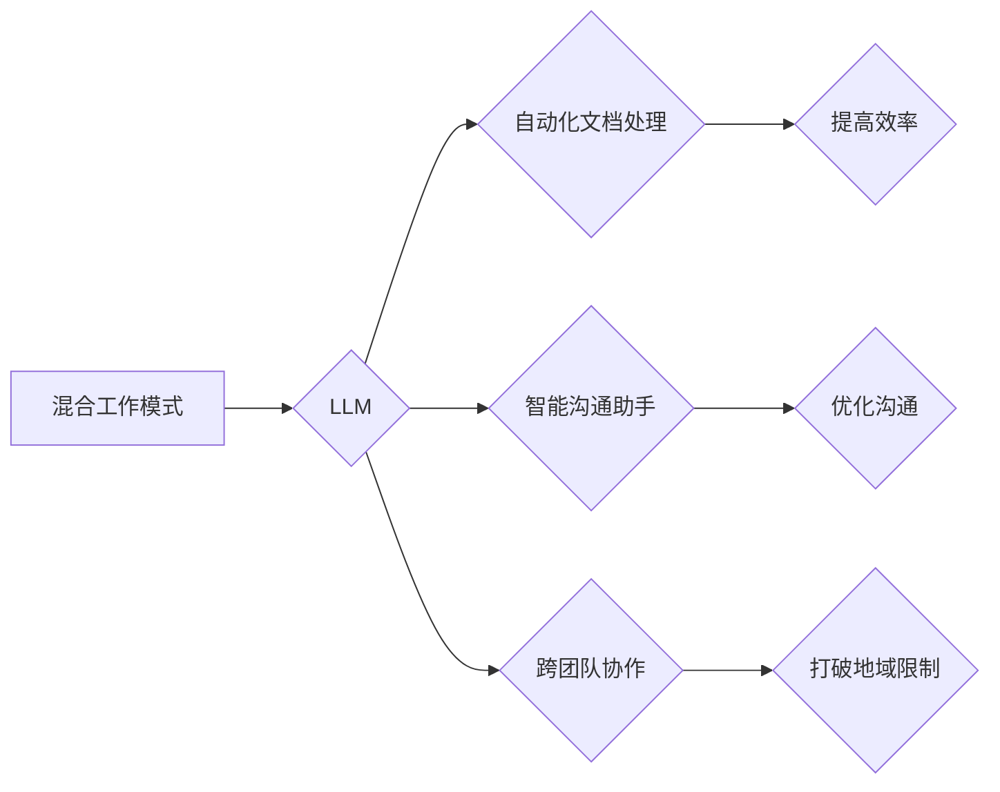

                 

## 混合工作模式与 LLM：高效的远程协作

> 关键词：混合工作模式、LLM、远程协作、人工智能、自然语言处理、协作工具、效率提升、沟通优化

## 1. 背景介绍

随着科技的飞速发展，工作模式也在不断演变。混合工作模式，即员工在办公室和远程办公之间灵活切换，逐渐成为主流趋势。这种模式为员工提供了更多工作选择，提高了工作生活平衡，但也带来了新的挑战，例如沟通效率低下、协作难度增加等。

大型语言模型（LLM）作为人工智能领域的一项突破性技术，拥有强大的文本生成、理解和翻译能力。它能够理解和响应自然语言指令，并生成高质量的文本内容。LLM的出现为解决混合工作模式下的协作难题提供了新的可能性。

## 2. 核心概念与联系

### 2.1 混合工作模式

混合工作模式是指员工在办公室和远程办公之间灵活切换的工作模式。它结合了办公室工作和远程工作的优势，为员工提供了更多工作选择，提高了工作生活平衡。

### 2.2 LLM

大型语言模型（LLM）是一种基于深度学习的强大人工智能模型，能够理解和生成人类语言。它通过训练海量文本数据，学习语言的语法、语义和上下文关系，从而能够执行各种自然语言处理任务，例如文本生成、翻译、问答、摘要等。

### 2.3 远程协作

远程协作是指团队成员在不同地理位置进行协作。随着混合工作模式的兴起，远程协作变得更加普遍。

**LLM与混合工作模式的协作关系**

LLM可以帮助提高混合工作模式下的协作效率，通过以下方式：

* **自动化文档处理:** LLM可以自动生成会议纪要、总结报告等文档，节省团队成员的时间和精力。
* **智能沟通助手:** LLM可以作为智能沟通助手，帮助团队成员快速查找信息、整理邮件、安排会议等。
* **跨团队协作:** LLM可以帮助不同团队成员跨越语言和地域障碍进行高效协作。

**Mermaid 流程图**



## 3. 核心算法原理 & 具体操作步骤

### 3.1 算法原理概述

LLM的核心算法原理是基于Transformer网络架构。Transformer网络是一种深度学习模型，能够有效处理序列数据，例如文本。它通过自注意力机制学习文本之间的上下文关系，从而能够理解和生成更准确、更流畅的文本内容。

### 3.2 算法步骤详解

LLM的训练过程主要包括以下步骤：

1. **数据预处理:** 收集和清洗大量文本数据，并将其转换为模型可以理解的格式。
2. **模型构建:** 根据Transformer网络架构构建LLM模型，并设定模型参数。
3. **模型训练:** 使用预处理后的文本数据训练LLM模型，通过反向传播算法不断调整模型参数，使其能够生成更准确的文本内容。
4. **模型评估:** 使用测试数据评估模型的性能，并根据评估结果进行模型调优。
5. **模型部署:** 将训练好的LLM模型部署到服务器或云平台，以便用户使用。

### 3.3 算法优缺点

**优点:**

* **强大的文本处理能力:** LLM能够理解和生成人类语言，并执行各种自然语言处理任务。
* **可扩展性强:** LLM模型可以根据需要调整大小，处理不同规模的文本数据。
* **持续学习:** LLM可以通过不断训练新的数据来提升其性能。

**缺点:**

* **训练成本高:** LLM的训练需要大量的计算资源和时间。
* **数据依赖性强:** LLM的性能取决于训练数据的质量和数量。
* **伦理风险:** LLM可能被用于生成虚假信息或进行恶意攻击。

### 3.4 算法应用领域

LLM在各个领域都有广泛的应用，例如：

* **自然语言处理:** 文本生成、翻译、问答、摘要等。
* **人工智能助手:** 智能聊天机器人、虚拟助理等。
* **教育:** 自动批改作业、个性化学习辅导等。
* **医疗:** 辅助诊断、生成医疗报告等。

## 4. 数学模型和公式 & 详细讲解 & 举例说明

### 4.1 数学模型构建

LLM的核心数学模型是Transformer网络，它基于注意力机制和多头注意力机制。

**注意力机制:**

注意力机制允许模型关注输入序列中与当前任务最相关的部分。

公式：

$$
Attention(Q, K, V) = softmax(\frac{QK^T}{\sqrt{d_k}})V
$$

其中：

* $Q$：查询矩阵
* $K$：键矩阵
* $V$：值矩阵
* $d_k$：键向量的维度

**多头注意力机制:**

多头注意力机制通过并行计算多个注意力头，学习到不同层次的文本关系。

公式：

$$
MultiHead(Q, K, V) = Concat(head_1, head_2, ..., head_h)W^O
$$

其中：

* $head_1, head_2, ..., head_h$：多个注意力头的输出
* $W^O$：最终输出层的权重矩阵

### 4.2 公式推导过程

注意力机制的公式推导过程可以参考相关文献，例如Vaswani et al. (2017)的论文《Attention Is All You Need》。

### 4.3 案例分析与讲解

例如，在机器翻译任务中，LLM可以使用注意力机制来关注源语言句子中与目标语言单词相关的部分，从而生成更准确的翻译结果。

## 5. 项目实践：代码实例和详细解释说明

### 5.1 开发环境搭建

使用Python语言开发LLM应用，需要安装以下软件包：

* TensorFlow或PyTorch深度学习框架
* HuggingFace Transformers库，用于加载预训练的LLM模型

### 5.2 源代码详细实现

以下是一个使用HuggingFace Transformers库加载预训练的GPT-2模型进行文本生成的代码示例：

```python
from transformers import pipeline

# 加载文本生成器
generator = pipeline("text-generation", model="gpt2")

# 生成文本
text = generator("你好，世界！", max_length=50, num_return_sequences=3)

# 打印结果
for i in range(len(text)):
    print(f"生成结果{i+1}: {text[i]['generated_text']}")
```

### 5.3 代码解读与分析

* `pipeline("text-generation", model="gpt2")`：使用HuggingFace Transformers库加载预训练的GPT-2模型，并创建一个文本生成器。
* `generator("你好，世界！", max_length=50, num_return_sequences=3)`：使用文本生成器生成文本，输入文本为"你好，世界！"，最大长度为50个词，生成3个不同的结果。
* `print(f"生成结果{i+1}: {text[i]['generated_text']}")`：打印生成的文本结果。

### 5.4 运行结果展示

运行以上代码，将输出3个不同的文本生成结果，例如：

```
生成结果1: 你好，世界！这是一个简单的例子，演示了如何使用GPT-2模型进行文本生成。
生成结果2: 你好，世界！今天天气真好，适合出去散步。
生成结果3: 你好，世界！我是一个大型语言模型，可以理解和生成人类语言。
```

## 6. 实际应用场景

### 6.1 协作文档编辑

LLM可以帮助团队成员协同编辑文档，例如自动生成会议纪要、总结报告等，提高文档编辑效率。

### 6.2 智能沟通助手

LLM可以作为智能沟通助手，帮助团队成员快速查找信息、整理邮件、安排会议等，优化沟通效率。

### 6.3 跨团队协作

LLM可以帮助不同团队成员跨越语言和地域障碍进行高效协作，例如自动翻译文档、生成跨语言会议记录等。

### 6.4 未来应用展望

随着LLM技术的不断发展，其在混合工作模式下的应用场景将更加广泛，例如：

* **个性化学习辅导:** LLM可以根据员工的学习需求提供个性化的学习辅导，帮助他们提升技能。
* **虚拟团队建设:** LLM可以帮助虚拟团队成员建立更紧密的联系，增强团队凝聚力。
* **远程办公体验优化:** LLM可以帮助优化远程办公体验，例如自动生成待办事项清单、提醒重要会议等。

## 7. 工具和资源推荐

### 7.1 学习资源推荐

* **HuggingFace Transformers库文档:** https://huggingface.co/docs/transformers/index
* **OpenAI GPT-3文档:** https://openai.com/api/
* **论文:** Attention Is All You Need (Vaswani et al., 2017)

### 7.2 开发工具推荐

* **Python:** https://www.python.org/
* **TensorFlow:** https://www.tensorflow.org/
* **PyTorch:** https://pytorch.org/

### 7.3 相关论文推荐

* Attention Is All You Need (Vaswani et al., 2017)
* BERT: Pre-training of Deep Bidirectional Transformers for Language Understanding (Devlin et al., 2018)
* GPT-3: Language Models are Few-Shot Learners (Brown et al., 2020)

## 8. 总结：未来发展趋势与挑战

### 8.1 研究成果总结

LLM在自然语言处理领域取得了显著的成果，为混合工作模式下的协作提供了新的可能性。

### 8.2 未来发展趋势

LLM技术将继续发展，朝着更强大、更安全、更可解释的方向发展。

* **模型规模扩大:** LLM模型的规模将继续扩大，从而提升其性能。
* **多模态学习:** LLM将学习处理多种数据类型，例如文本、图像、音频等。
* **可解释性增强:** 研究人员将致力于提高LLM的可解释性，使其决策过程更加透明。

### 8.3 面临的挑战

LLM技术也面临着一些挑战，例如：

* **数据安全:** LLM的训练需要大量数据，如何保证数据的安全和隐私是一个重要问题。
* **伦理风险:** LLM可能被用于生成虚假信息或进行恶意攻击，需要制定相应的伦理规范和监管机制。
* **计算资源:** 训练大型LLM模型需要大量的计算资源，如何降低训练成本是一个挑战。

### 8.4 研究展望

未来，LLM技术将继续推动混合工作模式的创新发展，为人们的工作生活带来更多便利和效率提升。

## 9. 附录：常见问题与解答

### 9.1 如何选择合适的LLM模型？

选择合适的LLM模型取决于具体的应用场景。例如，对于文本生成任务，GPT-2、GPT-3等模型效果较好；对于问答任务，BERT、RoBERTa等模型效果较好。

### 9.2 如何训练自己的LLM模型？

训练自己的LLM模型需要大量的计算资源和专业知识。可以参考HuggingFace Transformers库的文档，学习如何使用预训练模型进行微调。

### 9.3 LLM的安全性如何保障？

LLM的安全性需要从多个方面保障，例如：

* 数据安全: 使用加密技术保护训练数据和模型参数。
* 模型安全性: 避免模型被用于生成虚假信息或进行恶意攻击。
* 使用安全: 规范LLM的使用场景和应用范围。

作者：禅与计算机程序设计艺术 / Zen and the Art of Computer Programming


<end_of_turn>

