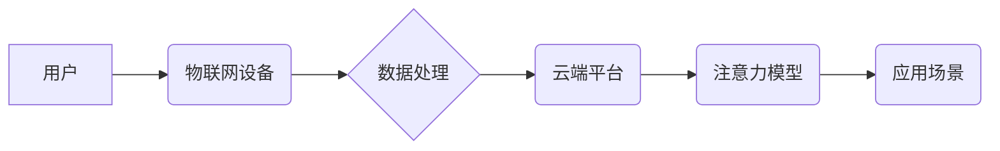

                 

## 物联网在注意力数据采集中的应用

> 关键词：物联网、注意力数据、数据采集、深度学习、人机交互、隐私保护、边缘计算

## 1. 背景介绍

随着物联网 (IoT) 技术的快速发展，海量数据从各种传感器、设备和网络中涌现。这些数据蕴含着丰富的用户行为和认知模式信息，为理解人类注意力提供了前所未有的机会。注意力，作为人类认知的核心机制，对学习、决策、记忆等认知功能至关重要。 

传统注意力研究主要依赖于实验室环境下的实验数据，受限于样本量和数据类型。而物联网时代，我们可以通过部署在日常环境中的传感器和设备，持续、动态地采集用户注意力数据，并结合其他用户行为数据，构建更全面、更真实的注意力模型。

## 2. 核心概念与联系

### 2.1 物联网 (IoT)

物联网是指将各种物理设备、传感器、软件和网络连接起来，形成一个互联互通的智能网络。物联网设备可以收集、处理和传输数据，实现对物理世界的感知、控制和优化。

### 2.2 注意力数据

注意力数据是指反映用户对特定信息或任务的关注程度的各种指标。这些指标可以包括：

* **眼动数据:**  记录用户的眼球运动轨迹，如注视时间、扫视方向、眨眼频率等。
* **生理数据:**  记录用户的生理反应，如心率、脑电波、皮肤电导等。
* **行为数据:**  记录用户的行为模式，如鼠标点击、键盘输入、页面停留时间等。

### 2.3 数据采集架构

物联网在注意力数据采集中的应用，通常采用以下架构：



**流程说明:**

1. 用户与物联网设备进行交互，例如使用智能手机、智能手表等设备。
2. 物联网设备收集用户注意力数据，例如眼动数据、生理数据、行为数据等。
3. 数据处理模块对收集到的数据进行预处理、清洗、特征提取等操作。
4. 处理后的数据传输到云端平台进行存储和分析。
5. 云端平台利用注意力模型对数据进行分析，提取用户注意力特征，并应用于各种场景。

## 3. 核心算法原理 & 具体操作步骤

### 3.1 算法原理概述

注意力机制是一种模仿人类注意力机制的机器学习算法，旨在学习哪些输入信息对目标任务更重要。在注意力数据采集中，常用的算法包括：

* **深度学习模型:**  例如卷积神经网络 (CNN)、循环神经网络 (RNN) 和 Transformer 等，可以学习用户注意力数据中的复杂模式和特征。
* **统计模型:**  例如贝叶斯网络、隐马尔可夫模型等，可以建模用户注意力数据的时序性和依赖关系。

### 3.2 算法步骤详解

**以深度学习模型为例，其注意力数据采集步骤如下:**

1. **数据采集:**  使用物联网设备收集用户注意力数据，例如眼动数据、生理数据、行为数据等。
2. **数据预处理:**  对收集到的数据进行清洗、格式转换、特征提取等操作，使其适合深度学习模型的训练。
3. **模型训练:**  使用深度学习模型对预处理后的数据进行训练，学习用户注意力数据的特征表示。
4. **模型评估:**  使用测试数据评估模型的性能，例如准确率、召回率、F1-score等。
5. **模型部署:**  将训练好的模型部署到物联网设备或云端平台，用于实时采集和分析用户注意力数据。

### 3.3 算法优缺点

**深度学习模型:**

* **优点:**  能够学习复杂的数据模式，具有较高的准确率。
* **缺点:**  训练数据量大，计算资源消耗高，模型解释性较差。

**统计模型:**

* **优点:**  模型解释性强，计算资源消耗低。
* **缺点:**  难以学习复杂的数据模式，准确率相对较低。

### 3.4 算法应用领域

注意力数据采集技术在以下领域具有广泛的应用前景:

* **教育:**  评估学生的学习状态，提供个性化学习建议。
* **医疗:**  监测患者的注意力状态，辅助诊断和治疗。
* **营销:**  分析用户的注意力偏好，优化广告投放策略。
* **人机交互:**  开发更智能、更人性化的交互系统。

## 4. 数学模型和公式 & 详细讲解 & 举例说明

### 4.1 数学模型构建

注意力机制的核心是计算每个输入元素对目标任务的权重，这些权重反映了每个元素的重要性。常用的数学模型包括：

* **加权求和模型:**  对每个输入元素乘以其权重，然后求和得到最终输出。

$$
\text{Output} = \sum_{i=1}^{n} w_i \cdot x_i
$$

其中，$x_i$ 是第 $i$ 个输入元素，$w_i$ 是其对应的权重，$n$ 是输入元素的总数。

* **注意力得分模型:**  使用一个注意力函数计算每个输入元素的注意力得分，然后将得分归一化得到权重。

$$
w_i = \frac{\exp(s_i)}{\sum_{j=1}^{n} \exp(s_j)}
$$

其中，$s_i$ 是第 $i$ 个输入元素的注意力得分，$n$ 是输入元素的总数。

### 4.2 公式推导过程

注意力得分模型的注意力得分通常使用一个神经网络计算，例如一个多层感知机 (MLP)。

$$
s_i = MLP(x_i, h)
$$

其中，$x_i$ 是第 $i$ 个输入元素，$h$ 是隐藏状态向量。

### 4.3 案例分析与讲解

例如，在机器翻译任务中，注意力机制可以帮助模型关注源语言中与目标语言单词相关的词语，从而提高翻译质量。

## 5. 项目实践：代码实例和详细解释说明

### 5.1 开发环境搭建

* 操作系统: Ubuntu 20.04
* Python 版本: 3.8
* 必要的库: TensorFlow, PyTorch, OpenCV

### 5.2 源代码详细实现

```python
# 使用 TensorFlow 实现注意力机制
import tensorflow as tf

# 定义输入数据
input_data = tf.random.normal(shape=(10, 5))

# 定义注意力权重
attention_weights = tf.keras.layers.Dense(units=5, activation='softmax')(input_data)

# 计算加权求和输出
output = tf.matmul(attention_weights, input_data)

# 打印输出
print(output)
```

### 5.3 代码解读与分析

* 使用 TensorFlow 库构建一个简单的注意力机制模型。
* 输入数据是一个 10 行 5 列的随机矩阵。
* 使用一个全连接层和 softmax 激活函数计算注意力权重。
* 使用注意力权重对输入数据进行加权求和，得到最终输出。

### 5.4 运行结果展示

运行代码后，会输出一个 10 行 5 列的矩阵，其中每个元素代表了输入数据中对应元素的加权求和结果。

## 6. 实际应用场景

### 6.1 教育领域

* **个性化学习:**  根据学生的注意力数据，提供个性化的学习内容和学习节奏。
* **学习状态监测:**  实时监测学生的注意力状态，及时提醒学生注意分散注意力。
* **教学效果评估:**  分析学生的注意力数据，评估教学效果，改进教学方法。

### 6.2 医疗领域

* **认知功能评估:**  评估患者的注意力、记忆力和执行功能等认知能力。
* **疾病诊断:**  注意力数据异常可能与某些疾病相关，例如注意力缺陷多动障碍 (ADHD)。
* **治疗效果监测:**  监测患者在接受治疗后的注意力状态变化，评估治疗效果。

### 6.3 营销领域

* **广告投放优化:**  分析用户的注意力偏好，优化广告投放策略，提高广告效果。
* **内容推荐:**  根据用户的注意力数据，推荐用户感兴趣的内容，提高用户粘性。
* **用户画像构建:**  利用注意力数据构建用户画像，更精准地了解用户需求。

### 6.4 未来应用展望

随着物联网技术的不断发展，注意力数据采集技术将应用于更多领域，例如：

* **智能家居:**  根据用户的注意力状态，自动调节家居环境，例如灯光、温度、音乐等。
* **自动驾驶:**  监测驾驶员的注意力状态，避免疲劳驾驶和事故发生。
* **虚拟现实 (VR) 和增强现实 (AR):**  根据用户的注意力状态，提供更沉浸式的体验。

## 7. 工具和资源推荐

### 7.1 学习资源推荐

* **书籍:**

    * Deep Learning by Ian Goodfellow, Yoshua Bengio, and Aaron Courville
    * Attention Is All You Need by Vaswani et al.

* **在线课程:**

    * TensorFlow 官方教程: https://www.tensorflow.org/tutorials
    * PyTorch 官方教程: https://pytorch.org/tutorials/

### 7.2 开发工具推荐

* **TensorFlow:**  开源深度学习框架，支持多种硬件平台。
* **PyTorch:**  开源深度学习框架，以其灵活性和易用性而闻名。
* **OpenCV:**  开源计算机视觉库，用于处理图像和视频数据。

### 7.3 相关论文推荐

* **Attention Is All You Need:** https://arxiv.org/abs/1706.03762
* **BERT: Pre-training of Deep Bidirectional Transformers for Language Understanding:** https://arxiv.org/abs/1810.04805

## 8. 总结：未来发展趋势与挑战

### 8.1 研究成果总结

物联网在注意力数据采集领域取得了显著进展，开发出多种有效的算法和模型，并应用于教育、医疗、营销等多个领域。

### 8.2 未来发展趋势

* **边缘计算:** 将注意力模型部署到物联网设备边缘，实现实时、低延迟的注意力数据分析。
* **联邦学习:**  利用联邦学习技术，在不泄露用户隐私的情况下，联合训练注意力模型。
* **多模态注意力:**  融合多种数据类型，例如眼动数据、生理数据、行为数据等，构建更全面的注意力模型。

### 8.3 面临的挑战

* **数据隐私保护:**  注意力数据包含用户的敏感信息，需要采取有效措施保护用户隐私。
* **模型解释性:**  深度学习模型的注意力机制难以解释，需要开发更可解释的模型。
* **数据质量:**  物联网设备采集的注意力数据可能存在噪声和偏差，需要开发有效的预处理和清洗方法。

### 8.4 研究展望

未来，物联网在注意力数据采集领域将继续发展，为我们提供更深入的认知理解，并推动人工智能技术在更多领域应用。


## 9. 附录：常见问题与解答

**1. 物联网设备如何采集注意力数据？**

物联网设备可以使用各种传感器和技术采集注意力数据，例如：

* **眼动追踪器:**  记录用户的眼球运动轨迹。
* **脑电波传感器:**  记录用户的脑电波信号。
* **生理传感器:**  记录用户的心率、呼吸频率、皮肤电导等生理反应。
* **行为传感器:**  记录用户的鼠标点击、键盘输入、页面停留时间等行为模式。

**2. 注意力数据如何进行分析？**

注意力数据可以利用深度学习模型、统计模型等进行分析，提取用户注意力特征，例如：

* **注视时间:**  用户注视某个元素的时间长度。
* **扫视方向:**  用户眼球运动的轨迹和方向。
* **眨眼频率:**  用户眨眼次数和频率。
* **心率变化:**  用户心率在不同任务或场景下的变化。

**3. 注意力数据如何保护用户隐私？**

注意力数据包含用户的敏感信息，需要采取有效措施保护用户隐私，例如：

* **数据匿名化:**  删除用户个人识别信息，避免直接关联用户身份。
* **数据加密:**  对注意力数据进行加密，防止未经授权的访问。
* **联邦学习:**  利用联邦学习技术，在不泄露用户隐私的情况下，联合训练注意力模型。


作者：禅与计算机程序设计艺术 / Zen and the Art of Computer Programming 
<end_of_turn>

