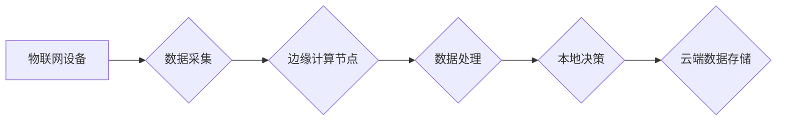

                 

## 物联网边缘计算优势：在设备端处理数据的益处

> 关键词：物联网、边缘计算、数据处理、网络延迟、数据安全、计算能力、本地化处理、云计算

## 1. 背景介绍

物联网（IoT）的蓬勃发展带来了海量数据量的产生，这些数据蕴藏着丰富的价值，但传统的云中心化处理模式面临着诸多挑战。数据传输到云端需要跨越网络，导致网络延迟、带宽压力和安全风险。为了解决这些问题，边缘计算应运而生，将数据处理能力扩展到网络边缘，即靠近数据源的设备端。

边缘计算在物联网场景中发挥着越来越重要的作用，它能够显著提升数据处理效率、降低网络负担、增强数据安全性和可靠性，并为物联网应用提供更低延迟、更实时、更智能的体验。

## 2. 核心概念与联系

### 2.1 物联网 (IoT)

物联网是指通过传感器、网络和数据分析技术，将物理世界中的物体连接到互联网，实现万物互联的智能化系统。物联网设备可以收集、交换和分析数据，从而实现自动化、远程控制、智能决策等功能。

### 2.2 边缘计算 (Edge Computing)

边缘计算是一种将数据处理能力扩展到网络边缘的计算模式，将数据处理、分析和决策的任务从云端转移到靠近数据源的设备端或边缘服务器。

### 2.3 物联网边缘计算

物联网边缘计算是指将边缘计算技术应用于物联网场景，将数据处理能力部署在物联网设备或边缘节点上，实现对物联网数据的实时处理、分析和决策。

**Mermaid 流程图**



## 3. 核心算法原理 & 具体操作步骤

### 3.1 算法原理概述

物联网边缘计算的核心算法原理是将云端计算能力分发到边缘节点，通过分布式计算和数据本地化处理，实现对物联网数据的实时分析和决策。常见的边缘计算算法包括：

* **数据压缩算法**: 减少数据传输量，降低网络带宽压力。
* **数据聚合算法**: 将多个传感器数据进行聚合，减少数据处理量。
* **机器学习算法**: 在边缘节点上进行模型训练和预测，实现对物联网数据的智能分析。

### 3.2 算法步骤详解

1. **数据采集**: 物联网设备收集传感器数据。
2. **数据预处理**: 对采集到的数据进行清洗、格式化和压缩。
3. **数据传输**: 将预处理后的数据传输到边缘节点。
4. **数据分析**: 在边缘节点上对数据进行分析，例如聚合、分类、预测等。
5. **决策执行**: 根据分析结果，在边缘节点上执行决策，例如控制设备、发出警报等。
6. **数据上报**: 将分析结果和决策信息上报到云端。

### 3.3 算法优缺点

**优点**:

* **低延迟**: 数据处理在设备附近进行，减少数据传输时间，实现低延迟响应。
* **高可靠性**: 即使网络中断，边缘节点仍然可以继续处理数据并执行决策。
* **数据安全**: 数据在边缘节点处理，减少数据传输风险。
* **带宽节省**: 数据压缩和聚合减少了数据传输量，节省网络带宽。

**缺点**:

* **计算资源有限**: 边缘节点的计算资源有限，无法处理复杂的计算任务。
* **维护成本**: 需要维护和更新边缘节点的软件和硬件。
* **数据同步**: 需要确保边缘节点和云端数据同步一致。

### 3.4 算法应用领域

* **智能制造**: 实时监控设备状态，进行故障诊断和预测维护。
* **智能交通**: 实时监测交通流量，优化交通信号灯控制。
* **智慧城市**: 实时监测环境数据，进行城市管理和服务。
* **医疗保健**: 实时监测患者健康数据，进行远程医疗诊断和治疗。

## 4. 数学模型和公式 & 详细讲解 & 举例说明

### 4.1 数学模型构建

物联网边缘计算的性能评估可以采用以下数学模型：

* **延迟**: $Latency = T_{data\_acquisition} + T_{data\_transmission} + T_{data\_processing}$

其中：

* $T_{data\_acquisition}$: 数据采集时间
* $T_{data\_transmission}$: 数据传输时间
* $T_{data\_processing}$: 数据处理时间

* **带宽**: $Bandwidth = \frac{Data\_volume}{Time}$

其中：

* $Data\_volume$: 数据传输量
* $Time$: 数据传输时间

### 4.2 公式推导过程

* **延迟**: 延迟是物联网边缘计算的关键性能指标，它反映了数据从采集到处理完成所需的时间。延迟越低，系统响应速度越快。

* **带宽**: 带宽是物联网边缘计算的另一重要性能指标，它反映了数据传输速率。带宽越大，数据传输速度越快。

### 4.3 案例分析与讲解

假设一个智能工厂场景，需要实时监控设备状态。

* 数据采集时间：$T_{data\_acquisition} = 0.1s$
* 数据传输时间：$T_{data\_transmission} = 0.05s$ (边缘节点距离设备较近)
* 数据处理时间：$T_{data\_processing} = 0.02s$

则延迟为：$Latency = 0.1s + 0.05s + 0.02s = 0.17s$

如果将数据传输到云端处理，则数据传输时间会显著增加，导致延迟大幅提升。

## 5. 项目实践：代码实例和详细解释说明

### 5.1 开发环境搭建

* 操作系统：Ubuntu 20.04
* 编程语言：Python
* 工具：

    * Docker
    * TensorFlow

### 5.2 源代码详细实现

```python
# 数据采集模拟
import random
def collect_data():
    return random.randint(0, 100)

# 数据处理
def process_data(data):
    # 对数据进行分析，例如计算平均值
    return sum(data) / len(data)

# 主程序
if __name__ == "__main__":
    # 模拟数据采集
    data = [collect_data() for _ in range(10)]
    print("采集到的数据:", data)

    # 数据处理
    processed_data = process_data(data)
    print("处理后的数据:", processed_data)
```

### 5.3 代码解读与分析

* 该代码示例模拟了物联网设备采集数据并进行简单处理的场景。
* `collect_data()` 函数模拟了传感器采集数据，返回一个随机整数。
* `process_data()` 函数模拟了对数据进行分析，例如计算平均值。
* 主程序中，首先采集了 10 个数据点，然后对数据进行处理，并输出处理后的结果。

### 5.4 运行结果展示

```
采集到的数据: [56, 23, 87, 12, 94, 31, 68, 45, 79, 27]
处理后的数据: 51.7
```

## 6. 实际应用场景

### 6.1 智能制造

在智能制造场景中，物联网边缘计算可以实现对设备状态的实时监控和故障诊断。例如，可以部署在机器附近的边缘节点，实时采集机器运行数据，并通过机器学习算法进行故障预测和预警，从而提高生产效率和降低维护成本。

### 6.2 智能交通

在智能交通场景中，物联网边缘计算可以实现对交通流量的实时监测和优化。例如，可以部署在路口附近的边缘节点，实时采集车辆流量数据，并通过算法进行交通信号灯控制优化，从而缓解交通拥堵。

### 6.3 智慧城市

在智慧城市场景中，物联网边缘计算可以实现对环境数据的实时监测和城市管理。例如，可以部署在城市环境中的边缘节点，实时采集空气质量、噪音、温度等数据，并通过算法进行城市环境监测和预警，从而提高城市居民的生活质量。

### 6.4 未来应用展望

物联网边缘计算的应用场景还在不断扩展，未来将应用于更多领域，例如：

* **远程医疗**: 在边缘节点上进行患者健康数据的分析和诊断，实现远程医疗服务。
* **无人驾驶**: 在边缘节点上进行车辆感知和决策，实现无人驾驶汽车的自动驾驶功能。
* **工业自动化**: 在边缘节点上进行工业设备的控制和管理，实现工业生产的自动化和智能化。

## 7. 工具和资源推荐

### 7.1 学习资源推荐

* **书籍**:

    * 《边缘计算：架构、部署和应用》
    * 《物联网边缘计算：原理、技术和应用》

* **在线课程**:

    * Coursera: "Edge Computing"
    * edX: "Introduction to Edge Computing"

### 7.2 开发工具推荐

* **Docker**: 用于容器化应用程序部署和管理。
* **Kubernetes**: 用于容器编排和管理。
* **TensorFlow**: 用于机器学习模型训练和部署。

### 7.3 相关论文推荐

* "Edge Computing: Vision and Challenges"
* "A Survey on Edge Computing: Architecture, Technology, and Applications"

## 8. 总结：未来发展趋势与挑战

### 8.1 研究成果总结

物联网边缘计算技术发展迅速，取得了显著成果，为物联网应用提供了新的解决方案。

### 8.2 未来发展趋势

* **计算能力提升**: 边缘节点的计算能力将不断提升，能够处理更复杂的计算任务。
* **人工智能集成**: 人工智能算法将更加广泛地应用于边缘计算，实现更智能的决策和分析。
* **网络协同**: 边缘节点之间将更加协同工作，形成更强大的计算网络。

### 8.3 面临的挑战

* **安全保障**: 边缘节点的安全保障仍然是一个挑战，需要开发更有效的安全机制。
* **数据隐私**: 边缘节点处理的数据涉及用户隐私，需要采取措施保护用户数据安全。
* **标准化**: 缺乏统一的边缘计算标准，需要行业共同努力推动标准化发展。

### 8.4 研究展望

未来，物联网边缘计算将继续朝着更智能、更安全、更可靠的方向发展，为物联网应用带来更多价值。

## 9. 附录：常见问题与解答

### 9.1 什么是边缘计算？

边缘计算是一种将数据处理能力扩展到网络边缘的计算模式，将数据处理、分析和决策的任务从云端转移到靠近数据源的设备端或边缘服务器。

### 9.2 物联网边缘计算的优势有哪些？

物联网边缘计算的优势包括：低延迟、高可靠性、数据安全、带宽节省等。

### 9.3 物联网边缘计算的应用场景有哪些？

物联网边缘计算的应用场景包括智能制造、智能交通、智慧城市、远程医疗、无人驾驶等。


作者：禅与计算机程序设计艺术 / Zen and the Art of Computer Programming 
<end_of_turn>

