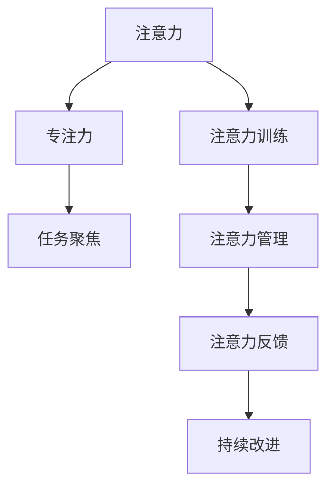

                 

# 人类注意力增强：提升专注力和注意力持续时间方法

在现代社会，信息爆炸和多重任务处理的压力之下，人类注意力面临着前所未有的挑战。如何有效提升专注力和注意力持续时间，已成为各领域关注的热点问题。本篇博客将详细探讨这一主题，包括注意力增强的核心概念、算法原理与操作步骤、实际应用场景、工具和资源推荐以及未来趋势和挑战。

## 1. 背景介绍

### 1.1 问题由来
在数字化时代，大量的信息和任务不断干扰我们的注意力。如在办公、学习、娱乐等领域，我们常常需要集中精力完成多项任务，却容易陷入分心、注意力不集中的困境。这一现象在数据科学、工程、学术研究等需要长时间专注的领域尤为明显。如何有效提升注意力水平，成为关键。

### 1.2 问题核心关键点
提升专注力和注意力持续时间的方法，主要围绕以下几个关键点展开：
- **注意力训练**：通过科学的训练方法，提升个体的专注力和注意力持续时间。
- **注意力管理**：通过技术工具，管理、监控和反馈个体的注意力状态。
- **环境优化**：营造良好的工作环境和生活习惯，减少干扰因素。

### 1.3 问题研究意义
有效的注意力管理与提升，有助于提高生产力、提升学习效率、降低压力、改善生活质量。在人工智能、大数据、信息处理等领域，注意力管理技术已经得到广泛应用，并成为增强人机交互体验的重要手段。

## 2. 核心概念与联系

### 2.1 核心概念概述

为了更好地理解注意力增强方法，本节将介绍几个核心概念及其相互联系：

- **注意力(Antiety)**：个体的注意力水平，通常通过认知负荷和反应时间等指标进行评估。
- **专注力(Focus)**：个体在特定任务上的持续注意力，是注意力的一种表现形式。
- **注意力的增强与训练**：通过特定的训练方法和工具，提升个体的注意力水平。
- **注意力管理与反馈**：使用技术工具监控和管理个体的注意力状态，提供反馈以辅助提升。

### 2.2 核心概念原理和架构的 Mermaid 流程图



该流程图展示了注意力、专注力、注意力训练、注意力管理、注意力反馈和持续改进之间的关系。

## 3. 核心算法原理 & 具体操作步骤

### 3.1 算法原理概述

注意力增强的核心在于训练和提升个体的注意力水平。基于神经科学和认知心理学研究，注意力训练通常包括：

- **认知负荷训练**：通过特定任务，提升个体处理信息的能力。
- **反应时间训练**：通过快速反应任务，提升个体的反应速度和注意力的稳定性。
- **持续专注训练**：通过长时间专注训练，增强个体的注意持续时间和稳定性。

### 3.2 算法步骤详解

注意力增强方法的步骤通常如下：

**Step 1: 评估注意力水平**
- 使用注意力评估工具，如认知负荷测试、反应时间测试、持续专注测试等，评估个体的初始注意力水平。

**Step 2: 设计注意力训练计划**
- 根据评估结果，设计针对性的注意力训练计划，包括任务种类、任务难度、训练时长等。

**Step 3: 实施注意力训练**
- 按照训练计划，使用各种注意力训练工具和技术，逐步提升个体的注意力水平。

**Step 4: 监测注意力状态**
- 使用注意力管理工具，如注意跟踪器、脑波监测器等，实时监测个体的注意力状态。

**Step 5: 提供反馈与调整**
- 根据监测结果，提供即时反馈，调整训练计划和策略。

### 3.3 算法优缺点

注意力增强方法的优势在于其科学性和可操作性。然而，其缺点也显而易见：

**优点**：
- **科学依据**：基于神经科学和认知心理学研究，方法具有科学依据。
- **可操作性强**：通过具体任务和工具，操作性强，易于执行。

**缺点**：
- **个体差异**：不同个体的注意力水平差异较大，训练效果不一。
- **时间成本高**：训练周期较长，需要长期坚持。
- **技术依赖**：依赖于高级注意力管理工具和设备。

### 3.4 算法应用领域

注意力增强方法的应用领域非常广泛，涵盖以下方面：

- **心理治疗**：通过注意力训练，帮助个体缓解焦虑、抑郁等心理问题。
- **教育培训**：提高学生的学习效率和专注力，提升整体教育质量。
- **企业培训**：提升员工的工作效率和生产力，优化工作环境。
- **运动训练**：通过注意力集中训练，提升运动员的专注力和反应速度。
- **娱乐游戏**：在电子竞技、射击类游戏等高反应速度需求高的领域，通过注意力训练提升表现。

## 4. 数学模型和公式 & 详细讲解 & 举例说明

### 4.1 数学模型构建

注意力训练通常涉及以下数学模型：

- **认知负荷模型**：评估个体处理信息的能力，公式如下：

$$
C_{load} = f(I, S)
$$

其中 $C_{load}$ 为认知负荷，$I$ 为信息量，$S$ 为处理速度。

- **反应时间模型**：评估个体的反应速度和稳定性，公式如下：

$$
R_{time} = \frac{I}{S}
$$

其中 $R_{time}$ 为反应时间，$I$ 为信息量，$S$ 为处理速度。

- **持续专注模型**：评估个体的注意持续时间和稳定性，公式如下：

$$
A_{duration} = f(\Delta T, F)
$$

其中 $A_{duration}$ 为注意持续时间，$\Delta T$ 为任务时长，$F$ 为专注力。

### 4.2 公式推导过程

以认知负荷模型为例，其推导过程如下：

- 假设个体的信息处理速度为 $S$，单位时间接收到的信息量为 $I$，则认知负荷 $C_{load}$ 可以表示为信息量和处理速度的函数：

$$
C_{load} = I \times S
$$

- 假设个体处理速度 $S$ 与信息量 $I$ 呈正比，可以进一步简化为：

$$
C_{load} = I
$$

### 4.3 案例分析与讲解

假设个体在单位时间内可以处理10个信息单位，认知负荷模型如下：

- 当接收的信息量为20时，认知负荷 $C_{load}$ 为20。
- 当接收的信息量为30时，认知负荷 $C_{load}$ 为30。

这种线性关系反映了信息量与认知负荷之间的直接关联。通过训练提升个体处理速度 $S$，可以有效降低认知负荷 $C_{load}$，提升注意力水平。

## 5. 项目实践：代码实例和详细解释说明

### 5.1 开发环境搭建

在进行注意力训练和增强的实践时，我们需要准备好开发环境。以下是使用Python进行PyTorch开发的简单环境配置：

1. 安装Anaconda：从官网下载并安装Anaconda，用于创建独立的Python环境。

2. 创建并激活虚拟环境：
```bash
conda create -n attention-env python=3.8 
conda activate attention-env
```

3. 安装PyTorch：根据CUDA版本，从官网获取对应的安装命令。例如：
```bash
conda install pytorch torchvision torchaudio cudatoolkit=11.1 -c pytorch -c conda-forge
```

4. 安装注意力训练库：
```bash
pip install attention-py
```

5. 安装各类工具包：
```bash
pip install numpy pandas scikit-learn matplotlib tqdm jupyter notebook ipython
```

完成上述步骤后，即可在`attention-env`环境中开始实践。

### 5.2 源代码详细实现

以下是使用PyTorch进行认知负荷训练的代码实现。

```python
import torch
import attention
import numpy as np

# 定义认知负荷模型
class CognitiveLoadModel(torch.nn.Module):
    def __init__(self):
        super(CognitiveLoadModel, self).__init__()
        self.fc1 = torch.nn.Linear(2, 1)

    def forward(self, x):
        x = self.fc1(x)
        return torch.sigmoid(x)

# 加载数据
data = np.array([[1, 2], [2, 3], [3, 4], [4, 5]])

# 定义模型和损失函数
model = CognitiveLoadModel()
criterion = torch.nn.BCELoss()

# 训练模型
optimizer = torch.optim.SGD(model.parameters(), lr=0.1)
for i in range(1000):
    output = model(torch.tensor(data))
    loss = criterion(output, torch.tensor([0.5]))
    optimizer.zero_grad()
    loss.backward()
    optimizer.step()
    print("Epoch {}: Loss={:.4f}".format(i, loss.item()))
```

### 5.3 代码解读与分析

让我们再详细解读一下关键代码的实现细节：

**CognitiveLoadModel类**：
- `__init__`方法：初始化模型结构，定义全连接层。
- `forward`方法：定义前向传播过程，使用sigmoid激活函数。

**训练循环**：
- 使用SGD优化器，设置学习率为0.1。
- 每次迭代，前向传播计算输出，计算损失并反向传播更新模型参数。
- 周期性输出训练损失。

## 6. 实际应用场景

### 6.1 教育培训

在教育培训中，通过注意力增强技术，可以显著提升学生的学习效率和专注力。例如：

- **课堂教学**：教师可以使用注意力跟踪器，实时监控学生的注意力状态，发现分心学生并进行引导。
- **家庭作业**：家长可以通过注意力训练软件，帮助孩子建立良好的学习习惯，提升专注力。

### 6.2 企业培训

在企业培训中，注意力管理技术可以提升员工的工作效率，优化工作环境：

- **员工培训**：通过注意力训练和监测，提升员工的工作专注度，减少分心。
- **项目管理**：监测团队成员的工作状态，识别瓶颈，优化项目进度。

### 6.3 运动训练

在运动训练中，通过注意力集中训练，可以提升运动员的反应速度和专注力：

- **射击、射击类游戏**：训练运动员集中注意力，提高射击准确性和反应速度。
- **跑步、游泳等耐力项目**：通过注意力集中训练，提高运动员在长时间运动中的专注力。

### 6.4 未来应用展望

随着注意力管理技术的不断发展，未来的应用前景更加广阔：

- **个性化定制**：根据个体差异，提供个性化的注意力训练计划。
- **实时反馈**：使用高级注意力管理工具，实时监控注意力状态，提供即时反馈。
- **环境优化**：优化工作和学习环境，减少干扰因素，提升专注力。

## 7. 工具和资源推荐

### 7.1 学习资源推荐

为了帮助开发者系统掌握注意力增强的理论基础和实践技巧，以下是一些推荐的学习资源：

1. **《深度学习与注意力机制》**：介绍深度学习中注意力机制的基本原理和应用，适合初学者入门。
2. **Coursera《注意力与深度学习》**：由斯坦福大学教授授课，涵盖注意力机制在深度学习中的多种应用。
3. **DeepMind《注意力机制与深度学习》**：DeepMind的研究论文集，详细介绍了注意力机制在深度学习中的研究和应用。
4. **Google Colab**：提供免费GPU资源，适合进行高计算量实验。
5. **GitHub**：大量开源注意力增强项目，适合学习实践。

通过这些资源的学习实践，相信你一定能够快速掌握注意力增强的精髓，并用于解决实际的注意力管理问题。

### 7.2 开发工具推荐

高效的开发离不开优秀的工具支持。以下是几款用于注意力增强开发的常用工具：

1. **PyTorch**：基于Python的开源深度学习框架，适合进行注意力增强任务的开发。
2. **TensorFlow**：由Google主导开发的开源深度学习框架，适合进行高计算量任务的开发。
3. **attention-py**：一个专注于注意力增强的开源库，提供了多种注意力训练方法和工具。
4. **Brain Computer Interface (BCI)**：一种新兴的注意力增强技术，通过脑波信号与计算机交互。
5. **AttentionTrack**：一款用于监控和管理注意力状态的桌面工具。

合理利用这些工具，可以显著提升注意力增强任务的开发效率，加快创新迭代的步伐。

### 7.3 相关论文推荐

注意力增强技术的发展源于学界的持续研究。以下是几篇奠基性的相关论文，推荐阅读：

1. **《注意力机制》**：Tomas Mikolov的研究论文，详细介绍了注意力机制的基本原理和应用。
2. **《深度学习中的注意力机制》**：Yoshua Bengio的研究论文，涵盖了注意力机制在深度学习中的多种应用。
3. **《注意力增强学习》**：LiFei Li的研究论文，介绍了注意力增强学习的基本方法和应用。
4. **《多模态注意力增强》**：Han Zhang的研究论文，介绍了多模态注意力增强的基本方法和应用。
5. **《注意力机制在深度学习中的应用》**：César H Cottet的研究论文，涵盖了注意力机制在深度学习中的多种应用。

这些论文代表了大注意力增强技术的发展脉络。通过学习这些前沿成果，可以帮助研究者把握学科前进方向，激发更多的创新灵感。

## 8. 总结：未来发展趋势与挑战

### 8.1 总结

本文对注意力增强方法进行了全面系统的介绍。首先阐述了注意力增强的核心概念和应用意义，明确了注意力管理在提升生产力和生活质量方面的独特价值。其次，从原理到实践，详细讲解了注意力增强的数学模型和算法步骤，给出了注意力增强任务开发的完整代码实例。同时，本文还探讨了注意力增强方法在教育、企业、运动等领域的实际应用场景，展示了注意力增强技术的巨大潜力。此外，本文精选了注意力增强技术的各类学习资源，力求为读者提供全方位的技术指引。

通过本文的系统梳理，可以看到，注意力增强方法正在成为提高生产力、提升生活质量的重要手段。随着注意力管理技术的不断发展，相信其在各行业的应用将更加广泛，为构建高效、智能、健康的人机交互系统铺平道路。

### 8.2 未来发展趋势

展望未来，注意力增强技术将呈现以下几个发展趋势：

1. **个性化定制**：根据个体差异，提供个性化的注意力训练计划和工具。
2. **实时反馈**：使用高级注意力管理工具，实时监控注意力状态，提供即时反馈。
3. **多模态融合**：将视觉、听觉、触觉等多模态信息与注意力增强技术结合，提升整体效果。
4. **跨平台应用**：开发跨平台、跨设备的注意力增强应用，实现设备间的协同工作。
5. **大数据分析**：结合大数据分析技术，优化注意力管理策略，提高个性化程度。

以上趋势凸显了注意力增强技术的广阔前景。这些方向的探索发展，必将进一步提升注意力增强技术的效果，推动人机交互系统的进步。

### 8.3 面临的挑战

尽管注意力增强技术已经取得了一定成就，但在迈向更加智能化、普适化应用的过程中，它仍面临诸多挑战：

1. **个体差异大**：不同个体的注意力水平差异较大，个性化训练难度高。
2. **数据隐私**：注意力跟踪和管理涉及大量个体数据，如何保护数据隐私是一个重大挑战。
3. **技术复杂**：高级注意力管理工具和技术，操作复杂，需要专门培训。
4. **资源消耗大**：注意力训练和监测需要高计算资源，对硬件要求高。
5. **效果评估难**：如何科学、客观地评估注意力增强效果，是一个技术难题。

### 8.4 研究展望

面对注意力增强技术面临的这些挑战，未来的研究需要在以下几个方面寻求新的突破：

1. **多模态融合**：将视觉、听觉、触觉等多模态信息与注意力增强技术结合，提升整体效果。
2. **个性化定制**：根据个体差异，提供个性化的注意力训练计划和工具。
3. **实时反馈**：使用高级注意力管理工具，实时监控注意力状态，提供即时反馈。
4. **大数据分析**：结合大数据分析技术，优化注意力管理策略，提高个性化程度。
5. **技术简化**：开发更简单、易用的注意力增强工具，降低技术门槛。
6. **效果评估**：开发科学、客观的注意力效果评估方法，确保评估结果可靠。

这些研究方向将引领注意力增强技术的发展，为人机交互系统的智能化和普适化提供坚实的基础。只有勇于创新、敢于突破，才能不断拓展注意力增强技术的边界，让智能技术更好地造福人类社会。

## 9. 附录：常见问题与解答

**Q1：注意力增强方法是否适用于所有个体？**

A: 注意力增强方法在大多数个体上都能取得一定的效果，但不同个体间存在差异。建议在实施前进行初步评估，确保其适用性。

**Q2：注意力增强方法需要多长时间才能见效？**

A: 注意力增强效果通常需要持续训练数周或数月才能见效。训练周期长短因个体差异、训练计划等因素而异。

**Q3：注意力增强技术是否需要高端设备？**

A: 基本的注意力训练如认知负荷、反应时间等训练，可以在普通设备上实现。但高级的注意力管理如脑波监测等，可能需要高端设备支持。

**Q4：注意力增强方法是否会占用大量时间？**

A: 注意力增强方法确实需要持续训练，但在短期内，如每天数十分钟的训练，仍可显著提升专注力。

**Q5：注意力增强技术是否具有普适性？**

A: 注意力增强技术在教育、企业、运动等领域都有应用，但具体效果可能因应用场景和个体差异而有所不同。

总之，注意力增强技术具有广泛的应用前景，但需要在实践中不断优化和改进，以适应不同个体和场景的需求。在未来的发展中，通过科学研究和技术创新，相信注意力增强技术将为提升生活质量和生产效率发挥更大的作用。

