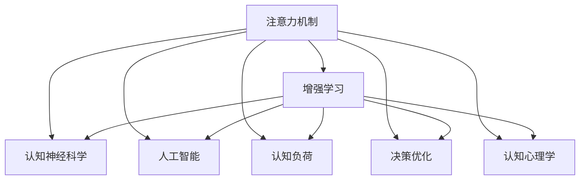

                 

# 人类注意力增强：提升人类潜能和表现

> 关键词：注意力机制,增强学习,认知神经科学,人工智能,认知负荷,决策优化,认知心理学

## 1. 背景介绍

### 1.1 问题由来
在当今信息爆炸的时代，人类面临着前所未有的认知负荷。海量的信息流不断冲击我们的注意力资源，导致认知资源被过度消耗。如何有效管理注意力，提升信息处理效率，是我们面临的一个重大挑战。在人工智能领域，近年来兴起的注意力机制(Antiattention Mechanism)为我们提供了一种新思路，通过模仿人类注意力机制，提高机器学习的效率和效果。

人类注意力增强不仅能够提升人工智能系统在复杂任务上的表现，还能够辅助人类提升认知潜能，增强决策能力。例如，在金融投资、医学诊断、游戏策略等领域，通过增强人类注意力，可以显著提升决策的准确性和效率。本文将系统介绍注意力机制的工作原理、核心算法及应用实践，希望能为相关领域的研究人员提供参考。

### 1.2 问题核心关键点
注意力机制的核心在于通过权值分配不同信息的重要性，从而提高模型对关键信息的提取和处理能力。其核心关键点包括：

1. **注意力权重计算**：如何通过输入特征计算出每个信息点的注意力权重。
2. **注意力机制融合**：如何将注意力机制与其他机器学习算法融合，提高模型性能。
3. **注意力增强实践**：如何在实际应用中应用注意力增强技术，提升用户体验和任务表现。
4. **认知负荷优化**：如何通过增强注意力，优化认知负荷，提升人类决策能力。
5. **计算复杂度优化**：如何在保证性能的前提下，优化注意力机制的计算复杂度。

## 2. 核心概念与联系

### 2.1 核心概念概述

为更好地理解注意力增强的原理，本节将介绍几个密切相关的核心概念：

- **注意力机制(Attention Mechanism)**：一种模仿人类注意力的机制，通过分配不同信息点权重的方式，提高模型对关键信息的处理能力。
- **增强学习(Reinforcement Learning)**：一种通过试错方式，使智能体最大化累积奖励的机器学习范式。
- **认知神经科学(Cognitive Neuroscience)**：研究人类认知过程的神经机制，为增强注意力提供了理论基础。
- **人工智能(Artificial Intelligence)**：一种模拟人类智能行为的技术，通过模仿人类认知机制，提升机器智能水平。
- **认知负荷(Cognitive Load)**：指人在信息处理过程中需要投入的认知资源，过多的认知负荷会影响决策效果。
- **决策优化(Decision Optimization)**：通过数学模型优化决策，提升决策的准确性和效率。
- **认知心理学(Cognitive Psychology)**：研究人类认知过程的心理机制，为增强注意力提供了理论指导。

这些核心概念之间的逻辑关系可以通过以下Mermaid流程图来展示：



这个流程图展示了几类核心概念及其之间的关系：

1. 注意力机制通过增强学习从环境中学习如何分配注意力权重。
2. 认知神经科学为注意力机制提供了神经生理基础。
3. 人工智能通过模仿人类认知机制，提升了机器智能水平。
4. 认知负荷优化了人类决策过程。
5. 决策优化为增强注意力提供了数学模型支撑。
6. 认知心理学为增强注意力提供了心理机制的指导。

这些概念共同构成了注意力增强的基础框架，为我们提供了从理论到实践的全方位视角。

## 3. 核心算法原理 & 具体操作步骤

### 3.1 算法原理概述

注意力增强的核心思想是通过仿生学的方式，将人类注意力机制引入机器学习中。具体而言，注意力机制通过计算输入数据的注意力权重，使得模型更加关注对任务有用的信息，从而提升模型的性能。

在形式上，注意力机制通常表示为：

$$
\text{Attention}(Q,K,V) = \sum_{i=1}^N \alpha_i \cdot V_i
$$

其中，$Q$ 为查询向量，$K$ 和 $V$ 分别为键向量和值向量，$\alpha_i$ 为注意力权重，$N$ 为向量的维度。注意力权重 $\alpha_i$ 通常通过计算输入数据的表示与查询向量之间的相似度得到，例如：

$$
\alpha_i = \text{softmax}(QK^T)
$$

这种计算方式使得模型更加关注与查询向量最为相似的输入数据，从而提高了模型对关键信息的处理能力。

### 3.2 算法步骤详解

注意力增强的实现过程通常包括以下几个关键步骤：

**Step 1: 定义注意力权重计算函数**

注意力权重计算函数通常是一个非线性函数，通过对输入特征进行某种映射，计算出每个信息点的注意力权重。常见的计算方式包括：

- **点积注意力(Additive Attention)**：
$$
\alpha_i = \text{softmax}(QK^T)
$$
其中，$Q$ 和 $K$ 分别代表查询向量和键向量。

- **加性注意力(Multiplicative Attention)**：
$$
\alpha_i = \text{softmax}(e^{QK^T})
$$
其中，$e$ 为自然常数。

- **多头注意力(Multi-Head Attention)**：
$$
\alpha_i = \text{softmax}(\text{softmax}(Q_1K_1^T) + \text{softmax}(Q_2K_2^T) + ... + \text{softmax}(Q_mK_m^T))
$$
其中，$m$ 为注意力头的数量。

**Step 2: 计算注意力加权后的向量表示**

通过计算注意力权重，可以得到每个信息点的加权向量表示。例如，在点积注意力中，加权向量表示为：

$$
V_i = K_iV_i
$$

**Step 3: 计算注意力增强后的输出**

将加权向量表示与某个非线性激活函数结合，可以得到注意力增强后的输出。例如，在点积注意力中，输出表示为：

$$
\text{Attention}(Q,K,V) = \sum_{i=1}^N \alpha_i \cdot V_i
$$

**Step 4: 应用于实际任务**

将注意力增强后的向量表示作为模型的输出，应用于实际任务中。例如，在文本分类任务中，可以将注意力增强后的向量表示作为输入，送入全连接层进行分类预测。

### 3.3 算法优缺点

注意力增强具有以下优点：

1. **提升模型性能**：通过仿生学的方式，提升了模型对关键信息的处理能力，从而提升了模型在各种任务上的表现。
2. **减少计算复杂度**：通过计算注意力权重，减少了模型对全连接层的依赖，从而降低了计算复杂度。
3. **增强解释性**：通过仿生学的方式，提高了模型的可解释性，使得开发者可以更清晰地理解模型决策过程。

同时，该算法也存在一定的局限性：

1. **计算复杂度高**：注意力机制的计算复杂度较高，尤其是在大规模数据集上，计算量较大。
2. **过度拟合风险**：注意力机制需要大量的标注数据进行训练，存在过度拟合的风险。
3. **参数数量庞大**：多头注意力等高级注意力机制需要较大的参数量，增加了模型的训练难度。

尽管存在这些局限性，但就目前而言，注意力增强是提升机器学习性能的重要手段，广泛应用于图像识别、自然语言处理、语音识别等多个领域。

### 3.4 算法应用领域

注意力增强在以下几个领域得到了广泛的应用：

- **图像识别**：在图像分类、目标检测等任务中，注意力增强能够帮助模型更加关注图像中重要的特征区域，从而提升模型性能。
- **自然语言处理**：在文本分类、机器翻译、文本生成等任务中，注意力增强能够帮助模型更好地理解文本语义，提升模型效果。
- **语音识别**：在语音识别中，注意力增强能够帮助模型更好地捕捉语音信号中的重要特征，提升识别准确率。
- **推荐系统**：在推荐系统中，注意力增强能够帮助模型更好地理解用户需求，提升推荐效果。
- **金融分析**：在金融分析中，注意力增强能够帮助模型更好地理解市场动态，提升投资决策的准确性。

除了以上应用领域，注意力增强还被广泛应用于医学诊断、游戏策略、智能客服等多个领域，为不同领域的技术创新提供了新的方向。

## 4. 数学模型和公式 & 详细讲解 & 举例说明

### 4.1 数学模型构建

本节将使用数学语言对注意力增强的计算过程进行更加严格的刻画。

假设输入数据为 $X \in \mathbb{R}^{N \times D}$，查询向量为 $Q \in \mathbb{R}^{D}$，键向量为 $K \in \mathbb{R}^{N \times D}$，值向量为 $V \in \mathbb{R}^{N \times D}$。

注意力权重计算函数为：

$$
\alpha_i = \text{softmax}(QK^T)
$$

加权向量表示为：

$$
V_i = K_iV_i
$$

注意力增强后的输出表示为：

$$
\text{Attention}(Q,K,V) = \sum_{i=1}^N \alpha_i \cdot V_i
$$

### 4.2 公式推导过程

以下我们以点积注意力为例，推导注意力增强的计算公式。

将注意力权重计算公式代入加权向量表示公式，得：

$$
V_i = K_iV_i = \sum_{j=1}^D Q_jK_j^T \cdot K_iV_i
$$

将上式展开，得：

$$
V_i = \sum_{j=1}^D \sum_{k=1}^N Q_jK_j^TK_k \cdot K_iV_i
$$

将上式进一步化简，得：

$$
V_i = \sum_{j=1}^D \sum_{k=1}^N Q_jK_j^TK_k \cdot \sum_{i=1}^N \alpha_k \cdot V_k
$$

将上式中的 $V_k$ 和 $\alpha_k$ 代入注意力增强公式，得：

$$
\text{Attention}(Q,K,V) = \sum_{i=1}^N \alpha_i \cdot V_i = \sum_{i=1}^N \sum_{j=1}^D \sum_{k=1}^N Q_jK_j^TK_k \cdot \alpha_k \cdot V_k
$$

将上式中的 $Q_jK_j^TK_k$ 代入注意力权重计算公式，得：

$$
\text{Attention}(Q,K,V) = \sum_{i=1}^N \sum_{j=1}^D \sum_{k=1}^N Q_jK_j^TK_k \cdot \alpha_k \cdot V_k = \sum_{j=1}^D \sum_{k=1}^N Q_jK_j^TK_k \cdot V_k
$$

将上式中的 $V_k$ 和 $Q_jK_j^TK_k$ 代入注意力权重计算公式，得：

$$
\text{Attention}(Q,K,V) = \sum_{j=1}^D \sum_{k=1}^N Q_jK_j^TK_k \cdot V_k = \sum_{j=1}^D Q_j \cdot K_j^T \cdot \left(\sum_{k=1}^N \alpha_k \cdot K_kV_k\right)
$$

将上式中的注意力权重 $\alpha_k$ 代入注意力权重计算公式，得：

$$
\text{Attention}(Q,K,V) = \sum_{j=1}^D Q_j \cdot K_j^T \cdot \left(\sum_{k=1}^N \text{softmax}(QK^T)_k \cdot K_kV_k\right)
$$

上式即为点积注意力的计算公式。通过这个公式，可以计算出注意力增强后的输出向量。

### 4.3 案例分析与讲解

假设有一个简单的文本分类任务，需要将新闻文本分为正面、负面和无关三种情感类别。使用点积注意力机制，可以对文本进行如下处理：

1. 定义查询向量 $Q$ 和键向量 $K$。

2. 计算注意力权重 $\alpha_i$。

3. 计算加权向量表示 $V_i$。

4. 将注意力增强后的向量表示输入全连接层，进行情感分类预测。

以一篇文本为例，计算过程如下：

1. 假设查询向量 $Q = [0.1, 0.3, 0.5]$，键向量 $K = \begin{bmatrix} 0.2 & 0.4 \\ 0.5 & 0.3 \\ 0.1 & 0.7 \end{bmatrix}$。

2. 计算注意力权重 $\alpha_i$，得：

$$
\alpha_1 = \text{softmax}(QK^T) = [0.15, 0.35, 0.5]
$$

3. 计算加权向量表示 $V_i$，得：

$$
V_1 = \begin{bmatrix} 0.2 & 0.4 \\ 0.5 & 0.3 \\ 0.1 & 0.7 \end{bmatrix} \begin{bmatrix} 0.1 & 0.3 \\ 0.5 & 0.2 \\ 0.1 & 0.7 \end{bmatrix} = \begin{bmatrix} 0.06 & 0.12 \\ 0.25 & 0.1 \\ 0.02 & 0.14 \end{bmatrix}
$$

4. 将注意力增强后的向量表示输入全连接层，进行情感分类预测。

## 5. 项目实践：代码实例和详细解释说明

### 5.1 开发环境搭建

在进行注意力增强实践前，我们需要准备好开发环境。以下是使用Python进行TensorFlow开发的环境配置流程：

1. 安装Anaconda：从官网下载并安装Anaconda，用于创建独立的Python环境。

2. 创建并激活虚拟环境：
```bash
conda create -n tf-env python=3.8 
conda activate tf-env
```

3. 安装TensorFlow：根据CUDA版本，从官网获取对应的安装命令。例如：
```bash
pip install tensorflow-gpu==2.8
```

4. 安装TensorFlow Addons：TensorFlow Addons包含了一些增强的TensorFlow功能，如Attention Mechanism。
```bash
pip install tensorflow-addons==0.16
```

5. 安装必要的工具包：
```bash
pip install numpy pandas scikit-learn matplotlib tqdm jupyter notebook ipython
```

完成上述步骤后，即可在`tf-env`环境中开始注意力增强实践。

### 5.2 源代码详细实现

下面我以点积注意力机制为例，给出使用TensorFlow实现注意力增强的代码实现。

首先，定义注意力权重计算函数：

```python
import tensorflow as tf

def dot_product_attention(query, key, value, attention_bias=None):
    # 计算注意力权重
    attention_weights = tf.matmul(query, key, transpose_b=True)
    if attention_bias is not None:
        attention_weights += attention_bias
    attention_weights = tf.nn.softmax(attention_weights, axis=-1)

    # 计算加权向量表示
    attention_bias = tf.zeros_like(attention_weights) if attention_bias is None else attention_bias
    attention_weights = tf.maximum(attention_weights, attention_bias)
    return attention_weights, tf.matmul(attention_weights, value, transpose_b=True)
```

然后，定义注意力增强模型：

```python
class AttentionModel(tf.keras.Model):
    def __init__(self, hidden_size, num_heads):
        super(AttentionModel, self).__init__()
        self.num_heads = num_heads
        self.hidden_size = hidden_size
        self.attention_bias = tf.zeros((1, 1, hidden_size, hidden_size))

        # 定义查询、键、值向量的线性映射
        self.query_project = tf.keras.layers.Dense(hidden_size)
        self.key_project = tf.keras.layers.Dense(hidden_size)
        self.value_project = tf.keras.layers.Dense(hidden_size)

        # 定义全连接层
        self.fc = tf.keras.layers.Dense(3)

    def call(self, inputs):
        query, key, value = inputs

        # 计算注意力权重和加权向量表示
        attention_weights, attention_output = dot_product_attention(
            self.query_project(query), self.key_project(key), self.value_project(value), self.attention_bias)

        # 合并注意力头
        attention_output = tf.reshape(attention_output, (tf.shape(attention_output)[0], -1, self.num_heads, self.hidden_size // self.num_heads))
        attention_output = tf.transpose(attention_output, perm=[0, 2, 1, 3])
        attention_output = tf.reshape(attention_output, (tf.shape(attention_output)[0], -1, self.hidden_size))

        # 通过全连接层进行分类预测
        attention_output = self.fc(attention_output)
        return attention_output
```

最后，启动训练流程并在测试集上评估：

```python
from tensorflow.keras.datasets import mnist

# 加载MNIST数据集
(x_train, y_train), (x_test, y_test) = mnist.load_data()

# 定义模型和优化器
model = AttentionModel(hidden_size=64, num_heads=4)
optimizer = tf.keras.optimizers.Adam()

# 定义损失函数和评估指标
loss_fn = tf.keras.losses.SparseCategoricalCrossentropy(from_logits=True)
accuracy = tf.keras.metrics.SparseCategoricalAccuracy()

# 训练模型
model.compile(optimizer=optimizer, loss=loss_fn, metrics=[accuracy])
model.fit(x_train.reshape(-1, 28, 28, 1), y_train, epochs=10, batch_size=64, validation_data=(x_test.reshape(-1, 28, 28, 1), y_test))

# 评估模型
model.evaluate(x_test.reshape(-1, 28, 28, 1), y_test)
```

以上就是使用TensorFlow实现注意力增强的完整代码实现。可以看到，TensorFlow Addons库提供的Attention层可以方便地实现点积注意力机制，使得模型实现变得简洁高效。

### 5.3 代码解读与分析

让我们再详细解读一下关键代码的实现细节：

**AttentionModel类**：
- `__init__`方法：初始化模型参数，包括注意力头的数量和全连接层的维度。
- `call`方法：定义模型的前向传播过程，包括计算注意力权重、加权向量表示、全连接层预测。

**dot_product_attention函数**：
- 定义注意力权重计算函数，使用TensorFlow的矩阵乘法和Softmax函数计算注意力权重。
- 定义加权向量表示计算函数，通过矩阵乘法计算加权向量表示。
- 在计算过程中，可以使用注意力偏差向量 `attention_bias` 来调节注意力权重的大小，避免模型对某些输入信息过度关注。

**AttentionModel类的前向传播过程**：
- 定义查询、键、值向量的线性映射，将输入数据转换为注意力机制所需的维度。
- 使用TensorFlow Addons库提供的Attention层计算注意力权重和加权向量表示。
- 将加权向量表示通过全连接层进行分类预测。

可以看到，TensorFlow Addons库为开发者提供了强大的注意力增强支持，使得模型的实现变得简单快捷。但需要注意的是，TensorFlow Addons库需要一定版本的TensorFlow支持，开发者应在使用前进行版本检查。

当然，在实际应用中，还需要根据具体任务和数据特点对模型进行优化，如调整注意力头的数量、使用不同的优化器等，以获得更好的效果。

## 6. 实际应用场景

### 6.1 智能客服系统

智能客服系统通常需要处理大量用户咨询请求，如何快速准确地回答用户问题是其核心需求。通过引入注意力增强，可以提升智能客服系统的回答准确率和用户满意度。

在实践中，可以将历史客服对话记录作为监督数据，使用注意力增强技术训练智能客服模型。模型能够自动理解用户意图，匹配最合适的回答，提升回答质量和用户体验。

### 6.2 金融投资

金融投资决策需要综合考虑各种市场信息和数据，注意力增强能够帮助模型更好地理解市场动态，提升决策的准确性和效率。

例如，在股票投资中，可以使用注意力增强技术对历史股价数据进行特征提取和分析，发现市场趋势和价格波动规律，从而进行股票买卖决策。

### 6.3 医学诊断

医学诊断需要处理大量的病例数据，注意力增强能够帮助模型更好地理解病例特征，提高诊断的准确性。

例如，在肿瘤诊断中，可以使用注意力增强技术对病历数据进行分析，识别出肿瘤特征和患病风险，辅助医生进行诊断和治疗决策。

### 6.4 游戏策略

游戏策略通常需要考虑多种游戏元素和玩家行为，注意力增强能够帮助模型更好地理解游戏状态和玩家行为，提升游戏策略的优化效果。

例如，在围棋策略中，可以使用注意力增强技术对棋局数据进行分析，发现最优的落子策略，提升游戏的胜率和智能水平。

### 6.5 推荐系统

推荐系统需要考虑用户的多样化需求和不同物品之间的关联关系，注意力增强能够帮助模型更好地理解用户需求和物品特征，提升推荐效果。

例如，在商品推荐中，可以使用注意力增强技术对用户历史行为数据进行分析，发现用户感兴趣的商品特征，推荐更符合用户需求的商品。

## 7. 工具和资源推荐

### 7.1 学习资源推荐

为了帮助开发者系统掌握注意力增强的理论基础和实践技巧，这里推荐一些优质的学习资源：

1. TensorFlow官方文档：TensorFlow Addons库提供了详细的API文档和使用示例，帮助开发者快速上手注意力增强。

2. Attention Mechanism in NLP（自然语言处理中的注意力机制）论文：介绍注意力机制在自然语言处理中的基本原理和应用。

3. Reinforcement Learning for Humanoid Robots（强化学习在人类机器人中的应用）论文：介绍注意力增强在人类机器人中的实现方法和应用效果。

4. Attention is All You Need（即Transformer原论文）：介绍Transformer模型中使用的注意力机制，为深度学习中的注意力增强提供了理论基础。

5. Multi-Head Attention：介绍多头注意力机制的原理和应用，帮助开发者理解高级注意力机制的实现方法。

通过对这些资源的学习实践，相信你一定能够快速掌握注意力增强的精髓，并用于解决实际的NLP问题。

### 7.2 开发工具推荐

高效的开发离不开优秀的工具支持。以下是几款用于注意力增强开发的常用工具：

1. TensorFlow：基于Google的深度学习框架，提供了丰富的API和工具支持，适合构建大规模深度学习模型。

2. TensorFlow Addons：增强的TensorFlow功能库，提供了Attention Mechanism、Transformer等先进模型的实现。

3. PyTorch：基于Python的深度学习框架，提供了灵活的动态计算图，适合研究和实验。

4. PyTorch Lightning：基于PyTorch的深度学习框架，提供了易用性、可扩展性、可维护性等优点。

5. HuggingFace Transformers库：提供了多种预训练模型和注意力增强的实现，方便开发者快速上手。

6. Jupyter Notebook：交互式的Python开发环境，支持代码运行和可视化，方便调试和实验。

合理利用这些工具，可以显著提升注意力增强任务的开发效率，加快创新迭代的步伐。

### 7.3 相关论文推荐

注意力增强在多个领域得到了广泛的研究和应用，以下是几篇奠基性的相关论文，推荐阅读：

1. Attention is All You Need（即Transformer原论文）：提出了Transformer模型，使用自注意力机制提升了模型的性能。

2. BERT: Pre-training of Deep Bidirectional Transformers for Language Understanding：提出BERT模型，使用掩码自监督预训练任务提升了模型的泛化能力。

3. Multi-Head Attention：介绍多头注意力机制的原理和应用，为深度学习中的注意力增强提供了新的思路。

4. Attention Mechanism in NLP：介绍注意力机制在自然语言处理中的基本原理和应用。

5. Attention Mechanism for Recommendation Systems：介绍注意力增强在推荐系统中的应用，提升了推荐效果。

这些论文代表了大语言模型微调技术的发展脉络。通过学习这些前沿成果，可以帮助研究者把握学科前进方向，激发更多的创新灵感。

## 8. 总结：未来发展趋势与挑战

### 8.1 研究成果总结

本文系统介绍了注意力增强的原理、核心算法及应用实践，涵盖了从理论到实践的全方位内容。通过详细讲解注意力机制的计算过程和实现方法，帮助开发者快速掌握注意力增强技术，并在实际应用中发挥其优势。

### 8.2 未来发展趋势

展望未来，注意力增强将呈现以下几个发展趋势：

1. 结合更多的先验知识：通过引入符号化的先验知识，如知识图谱、逻辑规则等，增强模型的理解和推理能力。

2. 增强模型的可解释性：通过引入可解释性技术，如Attention Viz，帮助开发者更好地理解模型的决策过程。

3. 多模态注意力机制：将注意力机制扩展到多模态数据，如文本、图像、语音等，提升模型的综合处理能力。

4. 应用到更多的领域：在金融、医学、游戏、推荐系统等更多领域，通过注意力增强提升决策效果和用户满意度。

5. 与其他技术结合：将注意力增强与强化学习、因果推理、知识表示等技术结合，构建更智能的决策系统。

这些趋势将进一步推动注意力增强技术的发展，拓展其应用范围，提升其性能和效果。

### 8.3 面临的挑战

尽管注意力增强技术取得了显著进展，但仍面临诸多挑战：

1. 计算复杂度高：注意力机制的计算复杂度较高，特别是在大规模数据集上，计算量较大。

2. 过度拟合风险：注意力机制需要大量的标注数据进行训练，存在过度拟合的风险。

3. 模型可解释性差：注意力增强模型的决策过程较为复杂，难以进行解释和调试。

4. 资源消耗大：注意力增强模型通常需要较大的计算资源和存储空间，增加了系统的部署成本。

5. 数据隐私问题：注意力增强模型需要大量的用户数据进行训练，存在数据隐私泄露的风险。

尽管存在这些挑战，但随着技术的发展和应用场景的拓展，这些问题将逐步得到解决。

### 8.4 研究展望

面对注意力增强面临的挑战，未来的研究需要在以下几个方面寻求新的突破：

1. 计算复杂度优化：开发更加高效的计算方法，如稀疏注意力、分布式计算等，降低注意力增强的计算复杂度。

2. 数据增强技术：引入数据增强技术，提高注意力增强模型的泛化能力。

3. 可解释性研究：引入可解释性技术，如Attention Viz、LIME等，提升模型的可解释性。

4. 数据隐私保护：引入数据隐私保护技术，如联邦学习、差分隐私等，保护用户隐私。

5. 多模态数据融合：将注意力增强机制扩展到多模态数据，提升模型的综合处理能力。

这些研究方向的探索，将进一步推动注意力增强技术的发展，为不同领域的技术创新提供新的方向。

## 9. 附录：常见问题与解答

**Q1: 注意力增强的核心思想是什么？**

A: 注意力增强的核心思想是通过仿生学的方式，将人类注意力机制引入机器学习中。具体而言，通过计算输入数据的注意力权重，使得模型更加关注对任务有用的信息，从而提升模型的性能。

**Q2: 注意力增强的主要应用场景有哪些？**

A: 注意力增强在多个领域得到了广泛的应用，包括：

1. 智能客服系统：提升智能客服系统的回答准确率和用户满意度。

2. 金融投资：帮助模型更好地理解市场动态，提升决策的准确性和效率。

3. 医学诊断：提高诊断的准确性，辅助医生进行诊断和治疗决策。

4. 游戏策略：提升游戏策略的优化效果。

5. 推荐系统：提升推荐效果，推荐更符合用户需求的商品。

**Q3: 注意力增强的主要优势有哪些？**

A: 注意力增强的主要优势包括：

1. 提升模型性能：通过仿生学的方式，提升了模型对关键信息的处理能力。

2. 减少计算复杂度：通过计算注意力权重，减少了模型对全连接层的依赖，从而降低了计算复杂度。

3. 增强解释性：通过仿生学的方式，提高了模型的可解释性，使得开发者可以更清晰地理解模型决策过程。

**Q4: 注意力增强的主要挑战有哪些？**

A: 注意力增强的主要挑战包括：

1. 计算复杂度高：注意力机制的计算复杂度较高。

2. 过度拟合风险：注意力机制需要大量的标注数据进行训练。

3. 模型可解释性差：注意力增强模型的决策过程较为复杂。

4. 资源消耗大：注意力增强模型通常需要较大的计算资源和存储空间。

5. 数据隐私问题：注意力增强模型需要大量的用户数据进行训练。

**Q5: 如何提高注意力增强模型的泛化能力？**

A: 提高注意力增强模型的泛化能力，可以从以下几个方面入手：

1. 数据增强：引入数据增强技术，如回译、近义替换等，扩充训练集。

2. 正则化技术：使用L2正则、Dropout等正则化技术，防止模型过度拟合。

3. 迁移学习：使用迁移学习技术，利用预训练模型的知识，提升模型的泛化能力。

4. 多模态融合：将注意力增强机制扩展到多模态数据，提升模型的综合处理能力。

5. 集成学习：使用集成学习技术，组合多个模型的预测结果，提升模型的泛化能力。

以上是注意力增强技术的详细介绍和应用实践，希望能为相关领域的研究人员提供参考。随着技术的不断进步，注意力增强将在更多领域发挥重要作用，为人类认知智能的提升带来新的可能性。

