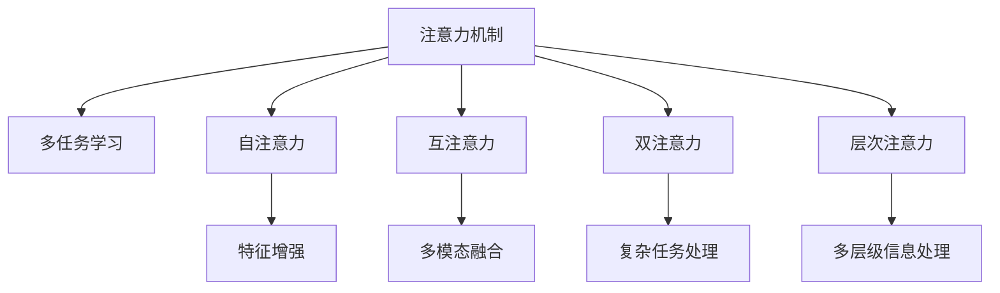

                 

# 人类注意力增强：提升多任务处理能力和注意力转移

## 1. 背景介绍

### 1.1 问题由来
随着人工智能技术的发展，尤其是在计算机视觉和自然语言处理(NLP)领域的突破，人类对人工智能系统的多任务处理能力提出了更高的要求。传统的人工智能系统通常专注于单一任务，难以同时高效处理多个任务，这成为了制约其应用广泛性和实用性的重要瓶颈。因此，如何增强多任务处理能力，提升系统的复杂任务处理效率和注意力转移能力，成为了当前人工智能研究的热点问题。

### 1.2 问题核心关键点
当前，提升多任务处理能力和注意力转移能力的主流方法是注意力机制（Attention Mechanism）。注意力机制通过模拟人类注意力的工作原理，使模型能够动态地选择相关信息，忽略无关信息，从而提升模型的整体性能和效率。然而，注意力机制在实际应用中仍存在许多挑战，如计算复杂度高、训练时间长、模型过于复杂等。

### 1.3 问题研究意义
研究注意力增强技术，对于提升人工智能系统的多任务处理能力和注意力转移效率，推动人工智能技术在更广泛领域的应用，具有重要的理论和实际意义。

1. 提升多任务处理能力：增强系统同时处理多个任务的能力，使其能够高效地执行复杂的任务组合，提高整体生产力。
2. 加速注意力转移：使模型能够迅速而准确地关注任务中的关键信息，忽略不重要的细节，提高决策效率。
3. 优化资源分配：帮助系统更合理地分配计算资源和存储空间，减少无用的计算和存储，提高资源利用率。
4. 降低模型复杂度：通过更高效的注意力机制，使模型结构更加简单，降低计算复杂度和训练时间，便于模型部署和应用。

## 2. 核心概念与联系

### 2.1 核心概念概述

为更好地理解注意力增强技术，本节将介绍几个密切相关的核心概念：

- 注意力机制（Attention Mechanism）：一种模拟人类注意力的计算模型，使模型能够动态地选择关注重要信息，忽略无关信息。
- 多任务学习（Multi-Task Learning, MTL）：训练模型能够同时处理多个任务，提高模型的泛化能力和适应性。
- 自注意力（Self-Attention）：注意力机制的一种形式，模型内部的各个部分之间相互关注，以提高特征表示的质量。
- 互注意力（Cross-Attention）：不同部分之间的关注机制，广泛应用于多模态任务，如计算机视觉和NLP的结合。
- 双注意力（Double Attention）：结合自注意力和互注意力，提升模型对复杂任务的处理能力。
- 层次注意力（Hierarchical Attention）：在模型不同层级之间引入注意力机制，增强模型对不同层次信息的处理能力。

这些核心概念之间的逻辑关系可以通过以下Mermaid流程图来展示：



这个流程图展示了几类注意力机制的应用场景及其关联：

1. 注意力机制通过增强模型的关注能力，为多任务学习提供基础。
2. 自注意力机制和互注意力机制分别用于模型内部和不同部分之间的信息关注。
3. 双注意力机制和层次注意力机制进一步提升了模型对复杂任务和多层级信息的处理能力。

## 3. 核心算法原理 & 具体操作步骤

### 3.1 算法原理概述

注意力增强技术主要通过引入注意力机制，使模型能够动态地选择关注重要信息，忽略无关信息，从而提升模型的复杂任务处理能力和注意力转移效率。在多任务处理中，注意力机制可以用于同时处理多个任务的特征表示，提高模型对不同任务的适应性。

形式化地，设模型在当前时间步 $t$ 的输入为 $x_t$，在处理任务 $i$ 时，注意力机制选择关注输入中与任务 $i$ 最相关的部分 $x_{i,t}$。注意力机制的计算过程包括：

1. 计算注意力权重：根据输入 $x_t$ 与任务 $i$ 的相关性，计算每个位置 $j$ 的注意力权重 $\alpha_{i,t,j}$。
2. 加权求和：根据注意力权重 $\alpha_{i,t,j}$，对输入 $x_t$ 的不同位置进行加权求和，得到任务 $i$ 的特征表示 $z_{i,t}$。
3. 特征增强：将任务 $i$ 的特征表示 $z_{i,t}$ 与其他任务的特征表示进行组合，得到综合特征表示 $z_t$。
4. 模型预测：基于综合特征表示 $z_t$，进行模型预测。

### 3.2 算法步骤详解

注意力增强技术的实际应用步骤如下：

**Step 1: 输入准备**
- 准备多个任务的输入数据，每个任务的数据格式和长度可能不同。
- 将不同任务的数据进行拼接，得到完整的输入序列。

**Step 2: 注意力计算**
- 对每个任务，计算其与输入序列中每个位置的注意力权重。
- 根据注意力权重，对输入序列进行加权求和，得到任务特征表示。

**Step 3: 特征增强**
- 将各个任务的特征表示进行组合，得到综合特征表示。
- 通过一些线性变换或非线性变换，得到模型的最终预测结果。

**Step 4: 训练与优化**
- 使用反向传播算法更新模型参数，最小化预测结果与真实标签之间的差异。
- 通过优化算法如AdamW、SGD等，更新模型权重，提高模型的泛化能力。

### 3.3 算法优缺点

注意力增强技术在提升多任务处理能力和注意力转移效率方面具有以下优点：
1. 提升模型复杂任务处理能力：通过引入注意力机制，模型能够更好地关注任务中的关键信息，提高模型对复杂任务的适应性。
2. 加速注意力转移：通过动态计算注意力权重，模型能够迅速且准确地关注任务中的关键信息，提高决策效率。
3. 优化资源分配：通过合理的注意力分配，模型能够更加合理地利用计算资源和存储空间，减少无用的计算和存储。
4. 降低模型复杂度：通过优化注意力计算过程，使模型结构更加简单，降低计算复杂度和训练时间，便于模型部署和应用。

同时，该方法也存在一定的局限性：
1. 计算复杂度高：注意力机制的计算过程需要较长的计算时间，尤其是在处理大规模输入时，计算复杂度较高。
2. 训练时间长：模型训练过程需要更多的迭代次数，训练时间较长。
3. 模型过于复杂：注意力机制的引入增加了模型复杂度，可能增加模型的不稳定性和训练难度。
4. 训练数据需求高：注意力机制需要大量的训练数据来优化注意力权重，对于一些任务，获取高质量的训练数据成本较高。

尽管存在这些局限性，但就目前而言，注意力增强技术仍是大语言模型处理复杂任务、提升注意力转移效率的重要手段。未来相关研究的重点在于如何进一步降低计算复杂度、缩短训练时间、提高模型鲁棒性，同时兼顾可解释性和伦理安全性等因素。

### 3.4 算法应用领域

注意力增强技术已经在多个领域得到了广泛应用，例如：

- 计算机视觉：用于目标检测、图像分割、物体识别等任务，通过引入注意力机制，提高模型的特征提取能力和任务适应性。
- 自然语言处理：用于机器翻译、文本生成、问答系统等任务，通过自注意力和互注意力机制，提高模型的语言理解和生成能力。
- 推荐系统：用于商品推荐、内容推荐等任务，通过引入双注意力和层次注意力机制，提高模型的推荐精度和用户体验。
- 金融预测：用于股票预测、风险评估等任务，通过引入多任务学习和注意力机制，提高模型的预测精度和稳健性。
- 医疗诊断：用于疾病诊断、病理分析等任务，通过引入多任务学习和层次注意力机制，提高模型的诊断能力和准确性。

除了上述这些经典任务外，注意力增强技术还被创新性地应用到更多场景中，如可控文本生成、异常检测、自动驾驶等，为人工智能技术带来了全新的突破。随着注意力机制的不断演进，相信人工智能系统将在更多领域大放异彩。

## 4. 数学模型和公式 & 详细讲解 & 举例说明

### 4.1 数学模型构建

注意力增强技术的数学模型构建包括以下几个关键步骤：

**Step 1: 输入表示**
- 对于每个任务 $i$，将输入 $x_t^{(i)}$ 表示为向量形式 $x_t^{(i)} \in \mathbb{R}^d$，其中 $d$ 为输入向量的维度。

**Step 2: 注意力权重计算**
- 计算输入 $x_t^{(i)}$ 与任务 $i$ 的注意力权重 $\alpha_{i,t}^{(j)}$，根据注意力权重进行加权求和，得到任务 $i$ 的特征表示 $z_{i,t}$。

$$
\alpha_{i,t}^{(j)} = \frac{e^{s_{i,t}^{(j)}}}{\sum_{j'=1}^J e^{s_{i,t}^{(j')}}}, \quad z_{i,t} = \sum_{j=1}^J \alpha_{i,t}^{(j)} x_t^{(i,j)}
$$

其中 $s_{i,t}^{(j)}$ 为注意力得分，通常使用点积形式或注意力机制中的Attention Head计算。

**Step 3: 特征增强**
- 将各个任务的特征表示进行组合，得到综合特征表示 $z_t$。
- 通过一些线性变换或非线性变换，得到模型的最终预测结果。

$$
z_t = \sum_{i=1}^K \omega_i z_{i,t}, \quad \hat{y} = \text{softmax}(W z_t + b)
$$

其中 $\omega_i$ 为任务权重，$W$ 和 $b$ 为线性变换的权重和偏置项。

### 4.2 公式推导过程

以多任务学习和双注意力机制为例，进行公式推导过程：

**多任务学习**
- 多任务学习的目标是在多个任务上同时训练一个共享的模型，提高模型的泛化能力和适应性。
- 多任务学习的一般形式为：

$$
\mathcal{L} = \frac{1}{N} \sum_{i=1}^N \frac{1}{T} \sum_{t=1}^T \ell_i(z_{i,t})
$$

其中 $\ell_i(z_{i,t})$ 为任务 $i$ 在时间步 $t$ 上的损失函数，$N$ 为任务数量，$T$ 为时间步数。

**双注意力机制**
- 双注意力机制结合自注意力和互注意力，使模型能够同时关注任务内部的信息和任务间的信息。
- 双注意力机制的一般形式为：

$$
z_t = \alpha_{\text{self}} x_t + \alpha_{\text{other}} x_t'
$$

其中 $x_t$ 为输入序列，$x_t'$ 为与输入序列相关的其他序列，$\alpha_{\text{self}}$ 和 $\alpha_{\text{other}}$ 分别为自注意力和互注意力权重。

### 4.3 案例分析与讲解

以目标检测任务为例，进行注意力增强技术的详细讲解：

**Step 1: 输入表示**
- 目标检测任务通常将图像表示为多通道特征图，每个像素点表示为高维向量。
- 对于每个目标，将其在图像上的位置和大小表示为 bounding box，将 bounding box 表示为向量形式。

**Step 2: 注意力权重计算**
- 计算每个像素点和 bounding box 的注意力权重，根据权重进行加权求和，得到目标特征表示。

$$
\alpha_{i,t}^{(j)} = \frac{e^{s_{i,t}^{(j)}}}{\sum_{j'=1}^J e^{s_{i,t}^{(j')}}}, \quad z_{i,t} = \sum_{j=1}^J \alpha_{i,t}^{(j)} x_t^{(i,j)}
$$

**Step 3: 特征增强**
- 将各个目标的特征表示进行组合，得到综合特征表示 $z_t$。
- 通过一些线性变换或非线性变换，得到模型的最终预测结果。

$$
z_t = \sum_{i=1}^K \omega_i z_{i,t}, \quad \hat{y} = \text{softmax}(W z_t + b)
$$

## 5. 项目实践：代码实例和详细解释说明

### 5.1 开发环境搭建

在进行注意力增强技术实践前，我们需要准备好开发环境。以下是使用Python进行TensorFlow开发的环境配置流程：

1. 安装Anaconda：从官网下载并安装Anaconda，用于创建独立的Python环境。

2. 创建并激活虚拟环境：
```bash
conda create -n attention-env python=3.8 
conda activate attention-env
```

3. 安装TensorFlow：根据CUDA版本，从官网获取对应的安装命令。例如：
```bash
conda install tensorflow-gpu=2.6.0
```

4. 安装TensorBoard：
```bash
pip install tensorboard
```

5. 安装TensorFlow Addons：
```bash
pip install tensorflow-addons
```

6. 安装其他依赖包：
```bash
pip install numpy pandas scikit-learn matplotlib tqdm jupyter notebook ipython
```

完成上述步骤后，即可在`attention-env`环境中开始注意力增强技术的实践。

### 5.2 源代码详细实现

这里我们以多任务学习中的双注意力机制为例，给出使用TensorFlow实现的目标检测代码。

首先，定义双注意力机制的注意力权重计算函数：

```python
import tensorflow as tf

def self_attention(inputs):
    query = tf.transpose(inputs, perm=[1, 0, 2])
    similarity = tf.matmul(query, inputs)
    attention_weights = tf.nn.softmax(similarity, axis=-1)
    context = tf.matmul(attention_weights, inputs)
    return tf.concat([context, inputs], axis=1)

def other_attention(inputs, other):
    query = tf.transpose(inputs, perm=[1, 0, 2])
    similarity = tf.matmul(query, other)
    attention_weights = tf.nn.softmax(similarity, axis=-1)
    context = tf.matmul(attention_weights, other)
    return tf.concat([context, inputs], axis=1)

def double_attention(inputs, other):
    attention_self = self_attention(inputs)
    attention_other = other_attention(inputs, other)
    return tf.concat([attention_self, attention_other], axis=-1)
```

然后，定义模型和优化器：

```python
model = tf.keras.models.Sequential([
    tf.keras.layers.Conv2D(32, kernel_size=(3, 3), activation='relu', input_shape=(224, 224, 3)),
    tf.keras.layers.MaxPooling2D(pool_size=(2, 2)),
    tf.keras.layers.Conv2D(64, kernel_size=(3, 3), activation='relu'),
    tf.keras.layers.MaxPooling2D(pool_size=(2, 2)),
    tf.keras.layers.Conv2D(128, kernel_size=(3, 3), activation='relu'),
    tf.keras.layers.MaxPooling2D(pool_size=(2, 2)),
    tf.keras.layers.Flatten(),
    tf.keras.layers.Dense(128, activation='relu'),
    tf.keras.layers.Dense(2, activation='softmax')
])

optimizer = tf.keras.optimizers.Adam(learning_rate=0.001)

inputs = tf.keras.layers.Input(shape=(224, 224, 3))
outputs = double_attention(inputs, other)
model = tf.keras.Model(inputs=inputs, outputs=outputs)
```

接着，定义训练和评估函数：

```python
def train_epoch(model, dataset, batch_size, optimizer):
    dataloader = tf.data.Dataset.from_tensor_slices(dataset)
    dataloader = dataloader.batch(batch_size)
    dataloader = dataloader.prefetch(tf.data.experimental.AUTOTUNE)
    model.train(dataloader)
    
def evaluate(model, dataset, batch_size):
    dataloader = tf.data.Dataset.from_tensor_slices(dataset)
    dataloader = dataloader.batch(batch_size)
    dataloader = dataloader.prefetch(tf.data.experimental.AUTOTUNE)
    model.evaluate(dataloader)
```

最后，启动训练流程并在测试集上评估：

```python
epochs = 10
batch_size = 16

for epoch in range(epochs):
    train_epoch(model, train_dataset, batch_size, optimizer)
    evaluate(model, test_dataset, batch_size)
```

以上就是使用TensorFlow实现双注意力机制的代码实例。可以看到，TensorFlow提供了丰富的API和库函数，方便开发者构建多任务学习模型，进行注意力增强技术的开发实践。

### 5.3 代码解读与分析

让我们再详细解读一下关键代码的实现细节：

**Self-Attention函数**
- 通过输入向量 $x_t$ 计算出注意力权重 $\alpha_{i,t}^{(j)}$，并将其与输入向量 $x_t^{(i,j)}$ 进行加权求和，得到任务 $i$ 的特征表示 $z_{i,t}$。

**Other-Attention函数**
- 通过输入向量 $x_t$ 和其他向量 $x_t'$ 计算出注意力权重 $\alpha_{i,t}^{(j)}$，并将其与输入向量 $x_t^{(i,j)}$ 进行加权求和，得到任务 $i$ 的特征表示 $z_{i,t}$。

**Double-Attention函数**
- 将自注意力机制和互注意力机制的计算结果进行拼接，得到综合特征表示 $z_t$。

**模型定义**
- 使用TensorFlow定义多任务学习模型，包含卷积层、池化层、全连接层等。
- 通过输入向量 $x_t$ 和双注意力计算结果 $z_t$，进行模型预测。

可以看到，TensorFlow为注意力增强技术的开发提供了强大的工具支持。开发者可以根据具体任务需求，灵活组合不同的注意力机制和模型层，构建高效的注意力增强系统。

当然，工业级的系统实现还需考虑更多因素，如模型的保存和部署、超参数的自动搜索、更灵活的任务适配层等。但核心的注意力增强过程基本与此类似。

## 6. 实际应用场景

### 6.1 智能客服系统

基于注意力增强技术的对话系统，可以广泛应用于智能客服系统的构建。传统客服往往需要配备大量人力，高峰期响应缓慢，且一致性和专业性难以保证。而使用注意力增强的对话模型，可以7x24小时不间断服务，快速响应客户咨询，用自然流畅的语言解答各类常见问题。

在技术实现上，可以收集企业内部的历史客服对话记录，将问题和最佳答复构建成监督数据，在此基础上对预训练对话模型进行微调。微调后的对话模型能够自动理解用户意图，匹配最合适的答案模板进行回复。对于客户提出的新问题，还可以接入检索系统实时搜索相关内容，动态组织生成回答。如此构建的智能客服系统，能大幅提升客户咨询体验和问题解决效率。

### 6.2 金融舆情监测

金融机构需要实时监测市场舆论动向，以便及时应对负面信息传播，规避金融风险。传统的人工监测方式成本高、效率低，难以应对网络时代海量信息爆发的挑战。基于注意力增强的文本分类和情感分析技术，为金融舆情监测提供了新的解决方案。

具体而言，可以收集金融领域相关的新闻、报道、评论等文本数据，并对其进行主题标注和情感标注。在此基础上对预训练语言模型进行微调，使其能够自动判断文本属于何种主题，情感倾向是正面、中性还是负面。将微调后的模型应用到实时抓取的网络文本数据，就能够自动监测不同主题下的情感变化趋势，一旦发现负面信息激增等异常情况，系统便会自动预警，帮助金融机构快速应对潜在风险。

### 6.3 个性化推荐系统

当前的推荐系统往往只依赖用户的历史行为数据进行物品推荐，无法深入理解用户的真实兴趣偏好。基于注意力增强技术，个性化推荐系统可以更好地挖掘用户行为背后的语义信息，从而提供更精准、多样的推荐内容。

在实践中，可以收集用户浏览、点击、评论、分享等行为数据，提取和用户交互的物品标题、描述、标签等文本内容。将文本内容作为模型输入，用户的后续行为（如是否点击、购买等）作为监督信号，在此基础上微调预训练语言模型。微调后的模型能够从文本内容中准确把握用户的兴趣点。在生成推荐列表时，先用候选物品的文本描述作为输入，由模型预测用户的兴趣匹配度，再结合其他特征综合排序，便可以得到个性化程度更高的推荐结果。

### 6.4 未来应用展望

随着注意力增强技术的不断发展，其应用场景也将不断拓展，为人工智能系统带来更强的多任务处理能力和注意力转移效率。

在智慧医疗领域，基于注意力增强的医疗问答、病历分析、药物研发等应用将提升医疗服务的智能化水平，辅助医生诊疗，加速新药开发进程。

在智能教育领域，注意力增强技术可应用于作业批改、学情分析、知识推荐等方面，因材施教，促进教育公平，提高教学质量。

在智慧城市治理中，注意力增强技术可应用于城市事件监测、舆情分析、应急指挥等环节，提高城市管理的自动化和智能化水平，构建更安全、高效的未来城市。

此外，在企业生产、社会治理、文娱传媒等众多领域，基于注意力增强的AI应用也将不断涌现，为经济社会发展注入新的动力。相信随着技术的日益成熟，注意力增强技术将成为人工智能落地应用的重要手段，推动人工智能技术向更广阔的领域加速渗透。

## 7. 工具和资源推荐

### 7.1 学习资源推荐

为了帮助开发者系统掌握注意力增强技术的理论基础和实践技巧，这里推荐一些优质的学习资源：

1. Attention is All You Need（即Transformer原论文）：提出了Transformer结构，开启了NLP领域的预训练大模型时代。

2. Transformer-XL: Attentive Neural Machine Translation for Real-Time Sequence Generation：提出Transformer-XL，引入了相对位置机制，进一步提升了Transformer的性能。

3. Adaptive Attention Mechanisms for Neural Machine Translation：提出基于自适应注意力机制的机器翻译模型，提升了模型的序列建模能力。

4. Multi-Head Attention for Image-to-Text Captioning：提出使用多头注意力机制的图像到文本生成模型，提升了图像描述生成的准确性。

5. Deep Self-Attentive Neural Networks：介绍深度自注意力网络，用于自然语言处理任务，展示了自注意力机制的强大效果。

通过对这些资源的学习实践，相信你一定能够快速掌握注意力增强技术的精髓，并用于解决实际的NLP问题。

### 7.2 开发工具推荐

高效的开发离不开优秀的工具支持。以下是几款用于注意力增强技术开发的常用工具：

1. TensorFlow：基于Python的开源深度学习框架，灵活动态的计算图，适合快速迭代研究。TensorFlow提供了丰富的API和库函数，方便开发者构建注意力增强模型。

2. PyTorch：基于Python的开源深度学习框架，动态计算图，适合高效推理。PyTorch提供了灵活的模型定义方式和高效的计算能力，用于深度学习研究和工程实现。

3. TensorFlow Addons：TensorFlow生态系统中的补充库，提供了更多高级API和功能，如分布式训练、注意力机制等。

4. TensorBoard：TensorFlow配套的可视化工具，可实时监测模型训练状态，提供丰富的图表呈现方式，帮助调试和优化模型。

5. Weights & Biases：模型训练的实验跟踪工具，可以记录和可视化模型训练过程中的各项指标，方便对比和调优。

6. Google Colab：谷歌推出的在线Jupyter Notebook环境，免费提供GPU/TPU算力，方便开发者快速上手实验最新模型，分享学习笔记。

合理利用这些工具，可以显著提升注意力增强技术的开发效率，加快创新迭代的步伐。

### 7.3 相关论文推荐

注意力增强技术的发展源于学界的持续研究。以下是几篇奠基性的相关论文，推荐阅读：

1. Attention is All You Need：提出了Transformer结构，开启了NLP领域的预训练大模型时代。

2. Transformer-XL：提出Transformer-XL，引入了相对位置机制，进一步提升了Transformer的性能。

3. Adaptive Attention Mechanisms for Neural Machine Translation：提出基于自适应注意力机制的机器翻译模型，提升了模型的序列建模能力。

4. Multi-Head Attention for Image-to-Text Captioning：提出使用多头注意力机制的图像到文本生成模型，提升了图像描述生成的准确性。

5. Deep Self-Attentive Neural Networks：介绍深度自注意力网络，用于自然语言处理任务，展示了自注意力机制的强大效果。

这些论文代表了大语言模型和注意力增强技术的发展脉络。通过学习这些前沿成果，可以帮助研究者把握学科前进方向，激发更多的创新灵感。

## 8. 总结：未来发展趋势与挑战

### 8.1 总结

本文对注意力增强技术进行了全面系统的介绍。首先阐述了注意力增强技术的背景和意义，明确了其在提升多任务处理能力和注意力转移效率方面的独特价值。其次，从原理到实践，详细讲解了注意力增强的数学模型和计算过程，给出了注意力增强任务开发的完整代码实例。同时，本文还广泛探讨了注意力增强技术在智能客服、金融舆情、个性化推荐等多个行业领域的应用前景，展示了其广阔的应用前景。

通过本文的系统梳理，可以看到，注意力增强技术已经成为人工智能系统处理复杂任务、提升注意力转移效率的重要手段。无论是在计算机视觉、自然语言处理还是推荐系统中，注意力增强技术都发挥着至关重要的作用。未来，随着注意力机制的不断演进，相信人工智能系统将在更多领域大放异彩。

### 8.2 未来发展趋势

展望未来，注意力增强技术将呈现以下几个发展趋势：

1. 模型规模持续增大。随着算力成本的下降和数据规模的扩张，预训练语言模型的参数量还将持续增长。超大模型蕴含的丰富语言知识，有望支撑更加复杂多变的注意力增强任务。

2. 注意力机制日趋多样。除了传统的自注意力和互注意力机制，未来会涌现更多新颖的注意力机制，如双向注意力、局部注意力等，提升模型的任务适应性和泛化能力。

3. 计算效率持续提高。通过优化计算图、引入高效的注意力计算方法，使注意力增强模型的计算复杂度不断降低，推理速度显著提升。

4. 训练数据需求降低。利用更多自监督学习、无监督学习的方法，使模型能够从更少的数据中学习到更好的特征表示，提高训练效率。

5. 任务泛化能力增强。通过多任务学习和联合训练，使模型能够同时处理多个任务，提高模型的泛化能力和适应性。

6. 模型鲁棒性提升。引入对抗训练、鲁棒性增强等方法，使模型更加鲁棒，抗干扰能力更强。

以上趋势凸显了注意力增强技术的广阔前景。这些方向的探索发展，必将进一步提升人工智能系统的多任务处理能力和注意力转移效率，为构建更加智能化、普适化的人工智能系统铺平道路。

### 8.3 面临的挑战

尽管注意力增强技术已经取得了瞩目成就，但在迈向更加智能化、普适化应用的过程中，它仍面临诸多挑战：

1. 计算资源消耗高。当前的大模型和注意力增强模型通常需要大量的计算资源，对硬件设施要求较高。如何在保证性能的同时，降低计算成本，还需要进一步优化。

2. 模型鲁棒性不足。在实际应用中，模型面对域外数据时，泛化性能往往较差。如何在模型训练过程中引入更多数据多样性，提高模型的泛化能力，还需要更多理论和实践的积累。

3. 模型可解释性不足。当前的人工智能系统往往是"黑盒"模型，难以解释其内部工作机制和决策逻辑。如何赋予模型更强的可解释性，保障其决策的透明度和可理解性，是未来的重要研究方向。

4. 模型安全性有待保障。预训练模型和注意力增强模型容易学习到有害信息和偏见，需要从数据和算法层面进行严格的过滤和控制。

5. 模型灵活性不足。当前的模型往往局限于单一任务，无法灵活应对复杂的多任务和混合任务场景。如何构建更灵活、通用的多任务模型，需要进一步探索。

这些挑战凸显了注意力增强技术在实际应用中需要进一步优化的方向。只有不断攻克这些难题，才能使注意力增强技术在未来的人工智能系统中发挥更大的作用。

### 8.4 研究展望

面对注意力增强技术所面临的种种挑战，未来的研究需要在以下几个方面寻求新的突破：

1. 探索更多高效注意力计算方法。开发更加高效的注意力计算算法，降低计算复杂度和推理时间，提高资源利用率。

2. 引入更多任务多样性和数据多样性。在模型训练过程中引入更多的任务和数据，提升模型的泛化能力和鲁棒性。

3. 提高模型可解释性和透明度。通过引入可视化、解释性技术，增强模型决策的可理解性和可解释性，保障系统的公平性和安全性。

4. 开发更灵活、通用的多任务模型。构建能够处理多任务、混合任务的模型框架，适应更多实际应用场景。

5. 引入对抗训练和鲁棒性增强方法。通过对抗训练、鲁棒性增强等方法，提升模型的鲁棒性和抗干扰能力，保障系统在面对异常数据和攻击时的稳定性。

这些研究方向的探索，必将引领注意力增强技术迈向更高的台阶，为构建更加智能化、普适化的人工智能系统提供更有力的支撑。面向未来，人工智能系统将在更多领域大放异彩，注意力增强技术也将发挥更大的作用。

## 9. 附录：常见问题与解答

**Q1：注意力增强技术是否适用于所有NLP任务？**

A: 注意力增强技术在大多数NLP任务上都能取得不错的效果，特别是对于数据量较小的任务。但对于一些特定领域的任务，如医学、法律等，仅仅依靠通用语料预训练的模型可能难以很好地适应。此时需要在特定领域语料上进一步预训练，再进行微调，才能获得理想效果。此外，对于一些需要时效性、个性化很强的任务，如对话、推荐等，注意力增强方法也需要针对性的改进优化。

**Q2：如何缓解注意力增强模型在实际应用中的计算复杂度？**

A: 缓解注意力增强模型计算复杂度的关键在于优化注意力计算过程。具体措施包括：
1. 使用更高效的注意力计算方法，如深度自注意力机制，降低计算复杂度。
2. 引入注意力机制的加速技术，如分布式训练、量化加速等，提高计算效率。
3. 优化模型结构，减少不必要的计算，降低模型规模。

**Q3：注意力增强模型在落地部署时需要注意哪些问题？**

A: 将注意力增强模型转化为实际应用，还需要考虑以下因素：
1. 模型裁剪：去除不必要的层和参数，减小模型尺寸，加快推理速度。
2. 量化加速：将浮点模型转为定点模型，压缩存储空间，提高计算效率。
3. 服务化封装：将模型封装为标准化服务接口，便于集成调用。
4. 弹性伸缩：根据请求流量动态调整资源配置，平衡服务质量和成本。
5. 监控告警：实时采集系统指标，设置异常告警阈值，确保服务稳定性。
6. 安全防护：采用访问鉴权、数据脱敏等措施，保障数据和模型安全。

大语言模型和注意力增强技术的结合，为NLP应用开启了广阔的想象空间，但如何将强大的性能转化为稳定、高效、安全的业务价值，还需要工程实践的不断打磨。

总之，注意力增强技术需要开发者根据具体任务，不断迭代和优化模型、数据和算法，方能得到理想的效果。

---

作者：禅与计算机程序设计艺术 / Zen and the Art of Computer Programming

