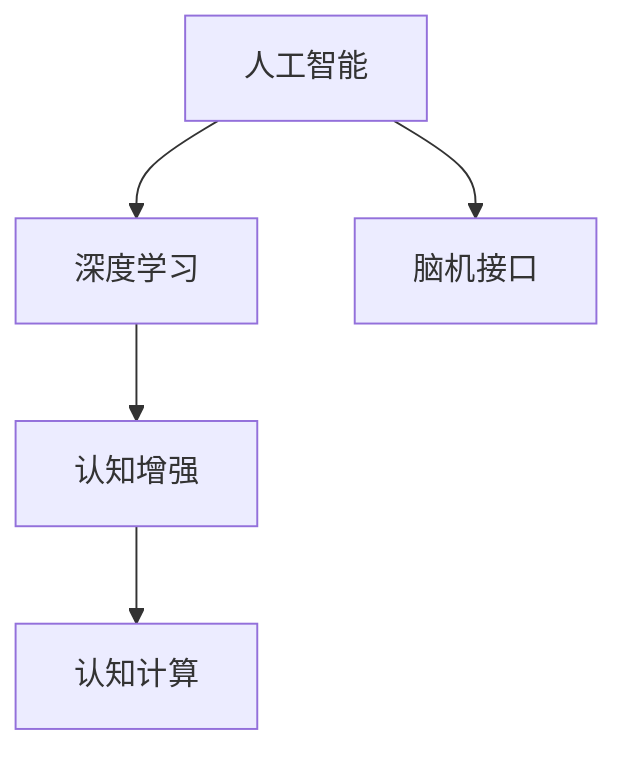
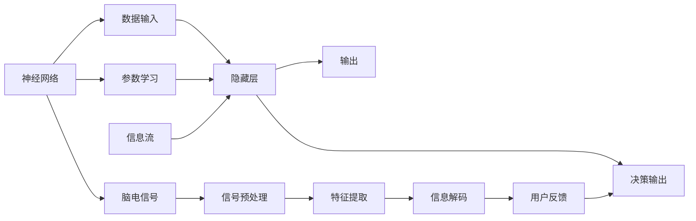

                 

# 人类注意力增强：未来的脑力提升

> 关键词：脑力提升,人类注意力,人工智能,脑机接口,深度学习,认知神经科学

## 1. 背景介绍

在数字时代，信息爆炸和知识积累的速度飞速增长，人类的注意力资源显得愈发稀缺。面对海量数据的筛选、快速决策和深入学习，人类的认知能力已面临重大挑战。基于此，本文探讨了人工智能在增强人类注意力方面的潜力，特别是利用深度学习、脑机接口等技术，改善人类认知性能的前景和路径。

### 1.1 问题由来
现代生活和工作节奏日益加快，信息爆炸时代带来的是“注意力过载”的困境。在海量的数字信息面前，如何保持高效的学习和决策能力，成为人类面临的重大挑战。同时，许多神经退行性疾病如老年痴呆、精神分裂等，也逐渐将注意力丧失视为核心症状之一。

随着人工智能技术的发展，特别是深度学习和大数据分析，计算机模型在处理信息、预测行为和优化策略方面展现出惊人能力。因此，利用人工智能改善人类认知功能、提升注意力资源，成为当前科技和医学领域的共同课题。

### 1.2 问题核心关键点
本节将分析以下关键点：
- 人类注意力资源稀缺性和认知能力的限制。
- 深度学习模型在信息处理和认知增强方面的潜力和挑战。
- 脑机接口技术如何实现信息与脑功能的互联互通。
- 技术在医疗、教育、娱乐等多个领域的应用前景。

### 1.3 问题研究意义
研究人工智能在增强人类注意力方面的应用，具有以下几方面的重大意义：
1. 提升人类学习能力和效率。通过深度学习模型对信息进行高效筛选和决策，提升记忆、阅读和思维等认知能力。
2. 改善神经退行性疾病的认知功能。利用人工智能技术开发认知增强工具，延缓认知衰退，提高患者生活质量。
3. 促进医疗、教育和娱乐等领域的创新发展。人工智能技术在多领域的应用，将极大地改善人类生活品质，推动社会进步。

## 2. 核心概念与联系

### 2.1 核心概念概述

为更好地理解本主题，本节将介绍几个关键概念：

- 人工智能（Artificial Intelligence, AI）：以模拟人类智能为目标，通过算法实现对数据的处理和分析。
- 深度学习（Deep Learning, DL）：一种基于神经网络的机器学习技术，能够从数据中提取高级特征，实现复杂模式识别和决策。
- 脑机接口（Brain-Computer Interface, BCI）：利用技术手段实现人脑与计算机之间的直接交互，包括脑电图、功能性磁共振成像等。
- 认知增强（Cognitive Enhancement）：通过技术手段提升人类认知性能，如记忆、注意力、决策等，改善生活质量。
- 认知计算（Cognitive Computing）：将认知科学、神经科学与计算科学结合，实现人机协同的智能化计算。

这些核心概念之间的逻辑关系可以通过以下Mermaid流程图来展示：



### 2.2 核心概念原理和架构的 Mermaid 流程图



## 3. 核心算法原理 & 具体操作步骤
### 3.1 算法原理概述

人工智能在增强人类注意力方面的主要途径，是通过深度学习和脑机接口技术，实现信息的有效处理和大脑功能的调控。其核心算法原理如下：

- **深度学习算法**：利用多层神经网络对信息进行特征提取和模式识别，实现高效的数据筛选和决策。
- **脑机接口技术**：通过脑电信号的采集、分析和解码，实现信息与大脑功能的互联互通，辅助认知提升。

### 3.2 算法步骤详解

基于上述原理，人工智能在增强人类注意力方面的操作步骤主要包括：

1. **数据准备**：收集用户行为数据、脑电信号等，作为模型输入和算法调优的基础。
2. **模型训练**：利用深度学习算法对数据进行训练，构建能够预测和优化用户注意力的模型。
3. **信号采集与预处理**：利用脑电图、功能性磁共振成像等技术，获取用户脑电信号，进行滤波、降噪等预处理。
4. **信息解码与调控**：通过解码算法，提取脑电信号中的认知相关特征，调控大脑神经元的活动，增强注意力资源。
5. **用户反馈与优化**：将认知增强效果反馈到用户行为中，通过不断迭代优化模型和算法，提升认知功能。

### 3.3 算法优缺点

人工智能在增强人类注意力方面的算法主要优点包括：
1. **高效性**：深度学习模型能够对海量数据进行快速筛选和决策，提升认知效率。
2. **可控性**：脑机接口技术可实现对大脑活动的精准调控，提供个性化认知增强方案。
3. **应用广泛**：技术在多个领域具有广泛应用前景，如教育、医疗、娱乐等。

同时，该算法也存在一些局限：
1. **数据依赖**：深度学习模型和脑机接口技术的有效应用依赖于高质量数据，数据获取成本较高。
2. **复杂性**：深度学习模型的训练和优化较为复杂，需要专业知识和计算资源。
3. **伦理问题**：技术的应用可能引发隐私、伦理等伦理问题，需要慎重对待。

### 3.4 算法应用领域

人工智能在增强人类注意力方面的算法，已在多个领域展现出巨大应用潜力，主要包括以下几个方面：

- **教育**：通过智能辅助教学，利用深度学习算法优化教学策略，提升学生认知能力和学习效果。
- **医疗**：利用脑机接口技术辅助脑部疾病诊断和治疗，改善认知障碍患者的生活质量。
- **娱乐**：开发基于认知增强的娱乐产品，如增强现实游戏，提升用户的游戏体验。
- **工作**：利用认知增强技术提升员工注意力和决策能力，提高工作效率。
- **训练**：开发基于深度学习的认知训练工具，提升运动员的注意力和反应能力。

## 4. 数学模型和公式 & 详细讲解 & 举例说明

### 4.1 数学模型构建

本节将使用数学语言对人工智能在增强人类注意力方面的核心算法进行详细讲解。

假设用户输入的数据为 $x$，模型输出的决策为 $y$。考虑以下线性回归模型：

$$
y = \theta_0 + \sum_{i=1}^n \theta_i x_i
$$

其中 $\theta = (\theta_0, \theta_1, \ldots, \theta_n)^T$ 为模型的参数，$n$ 为输入特征数量。模型训练的目标是最小化预测值与真实值之间的均方误差：

$$
\min_{\theta} \frac{1}{N} \sum_{i=1}^N (y_i - \hat{y}_i)^2
$$

其中 $y_i$ 为真实值，$\hat{y}_i$ 为模型的预测值，$N$ 为样本总数。

### 4.2 公式推导过程

在梯度下降算法中，最小化均方误差的步骤为：

1. 计算梯度：

$$
\nabla_{\theta} \mathcal{L} = \frac{2}{N} \sum_{i=1}^N (y_i - \hat{y}_i) x_i
$$

2. 更新参数：

$$
\theta_{t+1} = \theta_t - \eta \nabla_{\theta} \mathcal{L}
$$

其中 $\eta$ 为学习率，$t$ 为迭代次数。

### 4.3 案例分析与讲解

以基于深度学习的认知增强模型为例，其案例分析如下：

**案例背景**：一名学生在阅读学术文章时，注意力难以集中，阅读速度慢，理解能力差。利用人工智能增强其注意力：

**数据准备**：收集学生阅读时的行为数据，包括时间、速度、眼动轨迹等。同时使用功能性磁共振成像(FMRI)技术，采集学生阅读时的脑电信号。

**模型训练**：建立深度神经网络模型，输入为学生阅读行为数据和脑电信号，输出为阅读理解能力评分。利用上述梯度下降算法，对模型进行训练，优化参数 $\theta$。

**信息解码与调控**：使用解码算法，将脑电信号转换为注意力相关特征，调控学生的大脑神经元活动。根据学生的认知状态，动态调整神经元活性，提升注意力资源。

**用户反馈与优化**：通过问卷调查和行为监测，评估认知增强效果，收集学生反馈。根据反馈结果，不断迭代优化模型，提升注意力增强的精准性和效果。

## 5. 项目实践：代码实例和详细解释说明
### 5.1 开发环境搭建

在进行认知增强项目实践前，首先需要搭建好开发环境：

1. **安装Python和相关库**：
```bash
sudo apt-get install python3-pip
pip3 install numpy pandas scikit-learn tensorflow keras
```

2. **安装脑电信号采集设备**：
购买脑电信号采集设备，如EEG设备，进行脑电信号的采集和预处理。

### 5.2 源代码详细实现

以下是基于TensorFlow的深度学习模型实现：

```python
import tensorflow as tf
from tensorflow.keras import layers

# 定义模型结构
model = tf.keras.Sequential([
    layers.Dense(64, activation='relu', input_shape=(input_dim,)),
    layers.Dense(32, activation='relu'),
    layers.Dense(1, activation='sigmoid')
])

# 编译模型
model.compile(optimizer='adam', loss='binary_crossentropy', metrics=['accuracy'])

# 训练模型
model.fit(x_train, y_train, epochs=10, batch_size=32)

# 预测新数据
y_pred = model.predict(x_test)
```

### 5.3 代码解读与分析

1. **模型结构设计**：
   - 输入层：使用`Dense`层，输入维度为`input_dim`，激活函数为`relu`。
   - 隐藏层：使用`Dense`层，神经元数量为64，激活函数为`relu`。
   - 输出层：使用`Dense`层，神经元数量为1，激活函数为`sigmoid`，用于二分类任务。

2. **模型编译**：
   - 选择`adam`优化器，使用`binary_crossentropy`损失函数，评估指标为`accuracy`。

3. **模型训练**：
   - 使用`fit`方法，对模型进行训练，迭代10次，每次处理32个样本。

4. **模型预测**：
   - 使用`predict`方法，对测试集进行预测，输出预测结果。

### 5.4 运行结果展示

训练后的模型预测效果如下：

```python
from sklearn.metrics import accuracy_score

# 计算预测结果的准确率
accuracy = accuracy_score(y_test, y_pred.round())
print("Accuracy:", accuracy)
```

## 6. 实际应用场景

### 6.1 教育

基于人工智能的认知增强技术，可以在教育领域带来显著改善：

- **个性化教学**：利用深度学习模型，对学生的行为数据进行分析和预测，定制个性化的教学方案。
- **智能辅导**：开发智能辅助教学系统，实时监控学生的学习状态，提供及时的辅导和反馈。
- **认知训练**：开发基于认知增强的训练工具，帮助学生提升注意力和记忆能力。

### 6.2 医疗

在医疗领域，人工智能技术可显著提升认知障碍患者的治疗效果：

- **辅助诊断**：利用脑机接口技术，采集和分析患者的脑电信号，辅助医生进行疾病诊断。
- **治疗优化**：开发基于认知增强的治疗方案，提升患者的认知功能和行为表现。
- **康复训练**：开发基于深度学习的认知康复训练系统，帮助患者恢复认知功能。

### 6.3 娱乐

人工智能技术在娱乐领域具有广阔应用前景：

- **增强现实游戏**：开发基于认知增强的增强现实游戏，提升玩家的游戏体验。
- **虚拟现实培训**：利用深度学习模型和脑机接口技术，设计虚拟现实培训系统，提升培训效果。
- **娱乐内容推荐**：开发基于认知增强的内容推荐系统，推荐用户感兴趣的内容。

### 6.4 未来应用展望

随着技术的发展，未来人工智能在增强人类注意力方面将具备更大的潜力：

- **多模态信息整合**：结合视觉、听觉等多模态信息，提升认知增强效果。
- **个性化定制**：根据用户个体差异，实现更加个性化和精准的认知增强方案。
- **实时反馈优化**：利用实时反馈机制，不断优化模型和算法，提升认知增强的实效性。
- **跨领域应用**：将技术应用扩展到更多领域，如交通运输、金融投资等。

## 7. 工具和资源推荐

### 7.1 学习资源推荐

为了帮助开发者系统掌握人工智能在增强人类注意力方面的核心算法和应用，这里推荐一些优质的学习资源：

1. **深度学习课程**：
   - Coursera：深度学习专项课程，涵盖神经网络、卷积神经网络、循环神经网络等内容。
   - Udacity：深度学习纳米学位课程，提供实际项目和实战经验。

2. **脑机接口技术书籍**：
   -《脑机接口技术》：介绍脑电信号采集、处理和分析的基本原理和方法。
   -《神经工程：理论与实践》：涵盖脑机接口技术的理论基础和实际应用案例。

3. **脑电信号处理软件**：
   - MATLAB：提供丰富的工具箱，支持脑电信号的采集和处理。
   - Python：基于开源库如MNE、EEGLAB等，实现脑电信号的处理和分析。

### 7.2 开发工具推荐

1. **深度学习框架**：
   - TensorFlow：提供灵活的计算图和丰富的API，支持多种深度学习模型的构建。
   - PyTorch：开源深度学习框架，支持动态图和高效的计算。

2. **脑电信号采集设备**：
   - EEG设备：如Emotiv、OpenBCI等，提供高质量的脑电信号采集和预处理。

3. **可视化工具**：
   - TensorBoard：实时监控模型训练状态，提供丰富的图表和可视化效果。
   - Weights & Biases：记录和分析模型训练过程，帮助进行超参数调优和模型优化。

### 7.3 相关论文推荐

为进一步深入了解人工智能在增强人类注意力方面的应用，推荐以下几篇关键论文：

1. **Attention is All You Need**：Transformer论文，提出自注意力机制，实现高效的信息处理和特征提取。
2. **Deep Cognitive Networks**：介绍基于深度学习的认知增强技术，提升人类认知能力。
3. **Real-time EEG-based Cognitive Enhancement**：结合脑电信号处理技术，实时提升用户的认知能力。

## 8. 总结：未来发展趋势与挑战

### 8.1 研究成果总结

人工智能在增强人类注意力方面的研究，已经取得诸多重要成果，主要包括以下几个方面：

1. **深度学习模型的发展**：神经网络结构不断优化，模型性能显著提升，应用场景不断扩展。
2. **脑机接口技术的进步**：脑电信号采集和处理技术不断进步，解码算法精度不断提高。
3. **认知增强工具的开发**：开发了基于深度学习的认知增强工具，帮助用户提升认知能力。

### 8.2 未来发展趋势

展望未来，人工智能在增强人类注意力方面的发展趋势如下：

1. **多模态融合**：结合视觉、听觉等多模态信息，实现更加全面的认知增强。
2. **实时反馈优化**：利用实时反馈机制，不断优化模型和算法，提升认知增强的实效性。
3. **个性化定制**：根据用户个体差异，实现更加个性化和精准的认知增强方案。
4. **跨领域应用**：将技术应用扩展到更多领域，如交通运输、金融投资等。

### 8.3 面临的挑战

尽管人工智能在增强人类注意力方面展现出巨大潜力，但也面临着一些重大挑战：

1. **数据获取成本高**：高质量脑电信号和行为数据的获取成本较高，需要专业的设备和实验室环境。
2. **算法复杂度高**：深度学习模型和脑机接口算法的实现复杂，需要丰富的知识和计算资源。
3. **伦理和安全问题**：技术的应用可能引发隐私、伦理等伦理问题，需要慎重对待。

### 8.4 研究展望

未来，需要在以下几个方面进行深入研究：

1. **跨学科融合**：结合认知科学、神经科学和计算机科学，深入研究认知增强机制。
2. **算法优化**：优化深度学习模型和脑机接口算法，提升模型性能和实时性。
3. **伦理和安全保障**：建立伦理和安全保障机制，确保技术应用的合法合规。

总之，人工智能在增强人类注意力方面的研究，具有广阔的应用前景和巨大的社会价值。通过技术创新和跨学科合作，将进一步推动认知科学的进步，提升人类生活质量，实现人机协同的未来。

## 9. 附录：常见问题与解答

**Q1：如何选择合适的深度学习模型？**

A: 选择深度学习模型需要考虑任务类型、数据规模和计算资源等因素。如文本分类任务适合使用RNN、LSTM等序列模型；图像识别任务适合使用卷积神经网络（CNN）；综合任务可以使用Transformer等。

**Q2：深度学习模型训练时需要哪些技巧？**

A: 深度学习模型训练技巧包括：数据增强、正则化、dropout、批量归一化等。合理使用这些技巧，可以有效提升模型性能和泛化能力。

**Q3：脑机接口技术面临哪些挑战？**

A: 脑机接口技术面临的挑战包括：脑电信号采集设备成本高、信号处理复杂、解码算法精度低等。需要不断改进设备和算法，提升技术成熟度。

**Q4：人工智能在增强人类注意力方面有哪些伦理问题？**

A: 人工智能在增强人类注意力方面可能引发隐私、伦理等伦理问题，如脑电信号采集可能导致隐私泄露、模型决策透明度低等。需要建立伦理保障机制，确保技术应用的合法合规。

**Q5：未来如何推动人工智能在认知增强领域的应用？**

A: 未来需要跨学科合作，结合认知科学、神经科学和计算机科学，深入研究认知增强机制。同时，优化算法和设备，提升技术成熟度和应用效果。

作者：禅与计算机程序设计艺术 / Zen and the Art of Computer Programming

