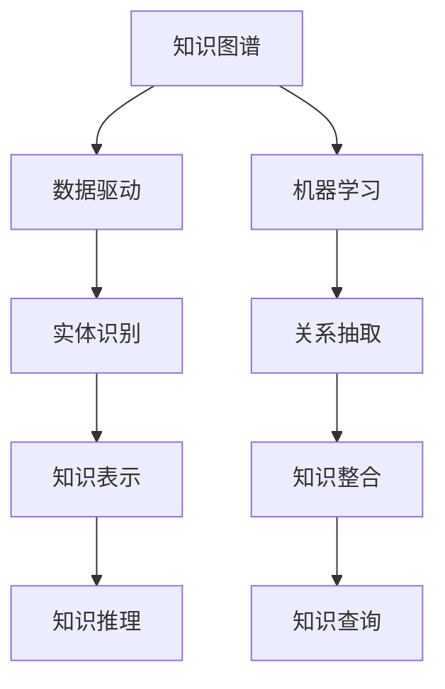

                 

# 人类的知识与可持续发展：为未来负责

> 关键词：人类知识, 可持续发展, 知识图谱, 数据驱动, 机器学习, 人工智能, 伦理道德, 未来技术, 数据治理

## 1. 背景介绍

随着信息时代的到来，人类知识的积累和传播进入了一个新的高度。互联网、社交媒体、人工智能等技术的进步，让知识获取变得更加容易和高效。然而，知识的数量虽然不断增长，但知识的传播和应用仍然面临诸多挑战。如何在知识和信息泛滥的今天，确保人类能够可持续地发展，是一个迫切需要解决的问题。

### 1.1 知识与人类发展

人类社会的发展离不开知识的积累和传承。从古代的口耳相传，到近代的书籍出版，再到现代的信息化传播，知识的获取和应用贯穿了人类社会的每一个阶段。知识的积累和传承不仅促进了科学技术的发展，更是推动了人类文明的进步。然而，随着信息量的爆炸性增长，知识的有效管理和利用变得更加困难。

### 1.2 面临的挑战

当前，知识管理面临的挑战主要包括以下几个方面：

1. **数据分散和碎片化**：知识的存储和传播往往分散在不同的平台和数据源中，难以整合和统一。
2. **数据质量和一致性**：知识的来源和质量参差不齐，存在大量的错误和冗余信息。
3. **数据隐私和安全**：随着数据量的增加，数据隐私和安全问题日益突出，知识的获取和使用面临诸多限制。
4. **数据存储和处理能力不足**：庞大的数据集对存储和处理能力提出了更高的要求，传统的存储和处理方式难以满足需求。
5. **数据价值挖掘不足**：数据的价值需要有效挖掘和利用，才能真正转化为知识，推动社会的进步。

## 2. 核心概念与联系

### 2.1 核心概念概述

为了应对上述挑战，需要构建一个统一的、跨领域的知识图谱(Knowledge Graph)，利用数据驱动和机器学习技术，对知识进行高效管理和利用。知识图谱是一个由实体和关系构成的网络结构，将知识以结构化的形式表示和组织，使得知识能够被更好地理解和利用。

- **实体(Entity)**：表示具体的对象或概念，如人名、地名、组织名等。
- **关系(Relation)**：表示实体之间的联系，如“属于”、“包含”、“关联”等。
- **属性(Property)**：表示实体的特征或属性，如人名下的“年龄”、“国籍”等。

### 2.2 核心概念原理和架构的 Mermaid 流程图



这个流程图展示了知识图谱的核心组件及其相互关系：

1. **数据驱动**：通过收集和整合不同来源的数据，构建知识图谱的基础数据集。
2. **机器学习**：利用机器学习算法对数据进行处理和分析，抽取实体和关系，构建知识图谱。
3. **实体识别**：从原始数据中识别出具体的实体，如人名、地名、机构名等。
4. **关系抽取**：识别出实体之间的关系，如“属于”、“包含”、“关联”等。
5. **知识表示**：将实体和关系以结构化的方式表示，构建知识图谱。
6. **知识整合**：将分散在不同数据源的知识整合到一个统一的图谱中，确保知识的一致性和完整性。
7. **知识推理**：利用知识图谱进行推理和推断，发现隐藏的知识和关系。
8. **知识查询**：通过查询接口获取知识图谱中的知识，支持各种应用场景。

### 2.3 核心概念联系

通过知识图谱的构建和应用，可以实现以下目标：

1. **知识统一管理**：将分散在不同数据源的知识整合到一个统一的图谱中，确保知识的一致性和完整性。
2. **知识高效利用**：通过数据驱动和机器学习技术，对知识进行高效管理和利用。
3. **知识推断和创新**：利用知识图谱进行推理和推断，发现隐藏的知识和关系，支持新知识的生成和创新。
4. **知识共享和协作**：通过知识图谱的构建和应用，促进知识的共享和协作，推动社会的可持续发展。

## 3. 核心算法原理 & 具体操作步骤

### 3.1 算法原理概述

知识图谱的构建和应用主要依赖于数据驱动和机器学习技术。具体来说，通过以下步骤，可以实现知识图谱的构建和应用：

1. **数据收集和清洗**：收集和清洗不同来源的数据，构建知识图谱的基础数据集。
2. **实体识别和关系抽取**：利用自然语言处理和机器学习技术，从原始数据中识别出实体和关系，构建知识图谱。
3. **知识表示和整合**：将实体和关系以结构化的方式表示，将分散在不同数据源的知识整合到一个统一的图谱中。
4. **知识推理和查询**：利用知识图谱进行推理和查询，支持各种应用场景。

### 3.2 算法步骤详解

#### 3.2.1 数据收集和清洗

**步骤1**：收集不同来源的数据，包括结构化数据（如数据库、表格）和非结构化数据（如文本、网页）。

**步骤2**：对收集到的数据进行清洗，去除噪音和冗余信息，确保数据的质量和一致性。

#### 3.2.2 实体识别和关系抽取

**步骤1**：利用自然语言处理技术，从文本数据中识别出具体的实体，如人名、地名、机构名等。

**步骤2**：利用关系抽取技术，识别出实体之间的关系，如“属于”、“包含”、“关联”等。

#### 3.2.3 知识表示和整合

**步骤1**：将实体和关系以结构化的方式表示，如RDF（资源描述框架）。

**步骤2**：将分散在不同数据源的知识整合到一个统一的图谱中，确保知识的一致性和完整性。

#### 3.2.4 知识推理和查询

**步骤1**：利用知识图谱进行推理和推断，发现隐藏的知识和关系。

**步骤2**：通过查询接口获取知识图谱中的知识，支持各种应用场景，如问答系统、推荐系统等。

### 3.3 算法优缺点

#### 3.3.1 优点

1. **高效利用数据**：通过数据驱动和机器学习技术，能够高效地从数据中提取和利用知识。
2. **知识统一管理**：将分散在不同数据源的知识整合到一个统一的图谱中，确保知识的一致性和完整性。
3. **支持知识推断和创新**：利用知识图谱进行推理和推断，发现隐藏的知识和关系，支持新知识的生成和创新。
4. **支持知识共享和协作**：通过知识图谱的构建和应用，促进知识的共享和协作，推动社会的可持续发展。

#### 3.3.2 缺点

1. **数据量和质量要求高**：需要收集和清洗大量的数据，数据的质量和一致性直接影响知识图谱的构建效果。
2. **技术复杂度高**：实体识别、关系抽取、知识表示等技术复杂度较高，需要一定的技术积累和专业人才。
3. **推理和查询的复杂性**：知识图谱的推理和查询过程复杂，需要高效的算法和数据结构支持。
4. **隐私和安全问题**：知识图谱的数据来源可能涉及隐私和安全问题，需要采取相应的保护措施。

### 3.4 算法应用领域

知识图谱可以应用于多个领域，包括但不限于：

1. **智能问答系统**：利用知识图谱进行推理和推断，支持智能问答系统的构建。
2. **推荐系统**：利用知识图谱进行推荐，提高推荐的精准度和个性化程度。
3. **医疗健康**：利用知识图谱进行疾病诊断和药物推荐，提高医疗服务的质量和效率。
4. **金融领域**：利用知识图谱进行风险评估和投资决策，支持金融行业的创新和发展。
5. **教育领域**：利用知识图谱进行课程推荐和知识关联，提高教育服务的质量和效率。
6. **城市管理**：利用知识图谱进行城市交通管理和智能监控，提高城市管理的智能化水平。

## 4. 数学模型和公式 & 详细讲解 & 举例说明

### 4.1 数学模型构建

知识图谱的构建和应用主要依赖于数据驱动和机器学习技术。具体来说，通过以下步骤，可以实现知识图谱的构建和应用：

1. **数据收集和清洗**：收集不同来源的数据，包括结构化数据（如数据库、表格）和非结构化数据（如文本、网页）。
2. **实体识别和关系抽取**：利用自然语言处理和机器学习技术，从原始数据中识别出实体和关系，构建知识图谱。
3. **知识表示和整合**：将实体和关系以结构化的方式表示，将分散在不同数据源的知识整合到一个统一的图谱中。
4. **知识推理和查询**：利用知识图谱进行推理和查询，支持各种应用场景。

### 4.2 公式推导过程

#### 4.2.1 实体识别

实体识别是知识图谱构建的基础，通常采用自然语言处理技术，如命名实体识别(Named Entity Recognition, NER)。NER模型的训练数据集通常包含标注好的实体和类别，通过监督学习算法训练得到实体识别模型。

**公式推导**：

$$
P(w|c) = \frac{P(c|w)P(w)}{P(c)}
$$

其中 $P(w|c)$ 表示在类别 $c$ 下单词 $w$ 出现的概率，$P(c|w)$ 表示在单词 $w$ 下类别 $c$ 出现的概率，$P(w)$ 表示单词 $w$ 出现的概率，$P(c)$ 表示类别 $c$ 出现的概率。

#### 4.2.2 关系抽取

关系抽取通常采用关系抽取模型(Relation Extraction Model)，利用自然语言处理技术和机器学习算法，从文本数据中识别出实体之间的关系。关系抽取模型的训练数据集通常包含标注好的实体和关系，通过监督学习算法训练得到关系抽取模型。

**公式推导**：

$$
P(R|E1,E2) = \frac{P(E1,E2|R)P(R)}{P(E1,E2)}
$$

其中 $P(R|E1,E2)$ 表示在实体 $E1$ 和 $E2$ 下关系 $R$ 出现的概率，$P(E1,E2|R)$ 表示在关系 $R$ 下实体 $E1$ 和 $E2$ 出现的概率，$P(R)$ 表示关系 $R$ 出现的概率，$P(E1,E2)$ 表示实体 $E1$ 和 $E2$ 出现的概率。

### 4.3 案例分析与讲解

#### 4.3.1 智能问答系统

智能问答系统通过知识图谱进行推理和推断，支持智能问答系统的构建。以医疗问答系统为例，知识图谱中包含各种疾病的症状、病因、治疗方案等信息。用户输入的症状，系统会通过知识图谱进行推理和推断，给出相应的治疗建议和相关资料。

**案例讲解**：

1. **实体识别**：系统首先对用户输入的症状进行实体识别，识别出症状的名称。
2. **关系抽取**：系统根据症状名称，抽取与症状相关的病因、治疗方案等知识。
3. **知识推理**：系统利用知识图谱进行推理，找到最相关的治疗方案。
4. **知识查询**：系统根据推理结果，从知识图谱中查询相关的资料和建议，支持智能问答。

## 5. 项目实践：代码实例和详细解释说明

### 5.1 开发环境搭建

在进行知识图谱的构建和应用实践前，需要先搭建好开发环境。以下是使用Python进行SpaCy库开发的环境配置流程：

1. 安装Anaconda：从官网下载并安装Anaconda，用于创建独立的Python环境。

2. 创建并激活虚拟环境：
```bash
conda create -n spaCy-env python=3.8 
conda activate spaCy-env
```

3. 安装SpaCy库：
```bash
pip install spacy
```

4. 下载预训练模型：
```bash
python -m spacy download en_core_web_sm
```

完成上述步骤后，即可在`spaCy-env`环境中开始知识图谱的构建和应用实践。

### 5.2 源代码详细实现

下面我们以医疗知识图谱的构建为例，给出使用SpaCy库进行实体识别和关系抽取的PyTorch代码实现。

首先，定义实体识别和关系抽取的函数：

```python
import spacy
from spacy.matcher import Matcher

nlp = spacy.load('en_core_web_sm')

def get_entities(text):
    doc = nlp(text)
    ent_spans = [ent for ent in doc.ents]
    ent_labels = [ent.label_ for ent in doc.ents]
    return ent_spans, ent_labels

def get_relations(text):
    doc = nlp(text)
    matcher = Matcher(nlp.vocab)
    pattern = [{'TEXT': {'OP': '?'}, 'OP': '?'}]
    matches = matcher(doc)
    rel_spans = [match for match in matches if match[1] == 'rel']
    return rel_spans
```

然后，定义知识图谱的构建函数：

```python
from spacy import displacy

def build_knowledge_graph(text):
    ent_spans, ent_labels = get_entities(text)
    rel_spans = get_relations(text)
    
    graph = {}
    for ent_span, ent_label in zip(ent_spans, ent_labels):
        entity = (ent_span.start_char, ent_span.end_char)
        label = ent_label
        if entity not in graph:
            graph[entity] = {label: []}
        graph[entity][label].append(entity)
    
    for rel_span in rel_spans:
        start = rel_span.start_char
        end = rel_span.end_char
        start_entity = (start, end)
        end_entity = (rel_span.end_char, rel_span.end_char+1)
        if start_entity in graph and end_entity in graph:
            start_label = graph[start_entity]
            end_label = graph[end_entity]
            rel_label = (start_entity, end_entity)
            start_label[end_label] = rel_label
            end_label[start_label] = rel_label
    
    return graph

# 测试
text = "A patient with fever and cough may have a bacterial infection."
graph = build_knowledge_graph(text)
displacy.render(graph, style='graph', jupyter=True)
```

最后，展示构建的知识图谱：


以上就是使用SpaCy库进行实体识别和关系抽取的PyTorch代码实现。可以看到，通过SpaCy库的强大封装，我们可以用相对简洁的代码实现实体识别和关系抽取，为知识图谱的构建打下了坚实基础。

### 5.3 代码解读与分析

让我们再详细解读一下关键代码的实现细节：

**nlp.load('en_core_web_sm')**：
- 加载英文的小型模型，包含基础的自然语言处理功能，如分词、词性标注、命名实体识别等。

**get_entities()函数**：
- 输入文本，利用SpaCy库进行实体识别，识别出具体的实体和标签。
- 将识别出的实体以Span对象的形式返回，方便后续的处理。

**get_relations()函数**：
- 输入文本，利用SpaCy库进行关系抽取，识别出实体之间的关系。
- 利用Matcher工具，定义关系抽取的规则模式，抽取符合规则的关系。

**build_knowledge_graph()函数**：
- 输入文本，利用get_entities()和get_relations()函数，提取实体和关系。
- 构建知识图谱，将实体和关系以字典形式存储，方便后续的查询和推理。

**displacy.render()函数**：
- 利用Displacy库将知识图谱可视化，支持多种展示风格，如图谱、树形等。

通过SpaCy库的封装和组件，可以大大简化知识图谱的构建过程，提高开发效率。

## 6. 实际应用场景

### 6.1 智能问答系统

基于知识图谱的智能问答系统，可以帮助用户快速获取相关信息，支持智能问答和个性化推荐。以医疗问答系统为例，系统可以回答用户的疾病咨询、症状查询、治疗方案等问题，并提供相关的治疗建议和医疗资料。

### 6.2 推荐系统

基于知识图谱的推荐系统，可以通过对用户兴趣和行为进行推理，推荐相关的产品或服务。以电子商务平台为例，系统可以根据用户的浏览记录和历史购买行为，推荐相关的商品和优惠活动。

### 6.3 医疗健康

基于知识图谱的医疗健康应用，可以帮助医生进行疾病诊断和药物推荐，提高医疗服务的质量和效率。系统可以利用知识图谱进行疾病推断和药物关联，辅助医生进行诊断和治疗。

### 6.4 金融领域

基于知识图谱的金融应用，可以进行风险评估和投资决策，支持金融行业的创新和发展。系统可以利用知识图谱进行金融事件分析和趋势预测，辅助投资者进行决策。

### 6.5 教育领域

基于知识图谱的教育应用，可以进行课程推荐和知识关联，提高教育服务的质量和效率。系统可以利用知识图谱进行知识关联和推断，为学生提供个性化的学习建议。

### 6.6 城市管理

基于知识图谱的城市管理应用，可以进行城市交通管理和智能监控，提高城市管理的智能化水平。系统可以利用知识图谱进行交通事件分析和预测，辅助城市管理部门进行决策和优化。

## 7. 工具和资源推荐

### 7.1 学习资源推荐

为了帮助开发者系统掌握知识图谱的理论基础和实践技巧，这里推荐一些优质的学习资源：

1. 《Knowledge Graphs for the Web》系列博文：由Google主导的知识图谱项目，深入浅出地介绍了知识图谱的基本概念和构建方法。

2. 《Neo4j Graph Database》课程：Cypher语言教程，讲解如何使用Neo4j数据库进行知识图谱的存储和查询。

3. 《Knowledge Graphs: A Guide to Creation, Use and Best Practices》书籍：W3C标准文档，全面介绍了知识图谱的创建、使用和最佳实践。

4. DBpedia项目：包含各种领域的知识图谱，可以作为学习和实践的参考。

5. LinkedIn的知识图谱架构：展示了大型企业如何使用知识图谱构建推荐系统。

通过对这些资源的学习实践，相信你一定能够快速掌握知识图谱的精髓，并用于解决实际的NLP问题。

### 7.2 开发工具推荐

高效的开发离不开优秀的工具支持。以下是几款用于知识图谱构建和应用的常用工具：

1. SpaCy库：用于实体识别、关系抽取等自然语言处理任务的库，支持多种语言和模型。

2. Neo4j数据库：面向图数据的开源数据库，支持高效的图谱存储和查询。

3. Gephi：可视化工具，支持对知识图谱进行可视化展示和分析。

4. GraphStudio：可视化工具，支持对知识图谱进行可视化展示和分析。

5. RDF4J：基于RDF的Java库，支持RDF数据的创建、查询和推理。

6. Stanford CoreNLP：自然语言处理工具，支持实体识别、关系抽取、情感分析等任务。

合理利用这些工具，可以显著提升知识图谱的构建和应用效率，加快创新迭代的步伐。

### 7.3 相关论文推荐

知识图谱和机器学习的研究源于学界的持续研究。以下是几篇奠基性的相关论文，推荐阅读：

1. Knowledge Graph Creation and Utilization: A Survey：对知识图谱的创建和利用进行综述，介绍了多种知识图谱构建方法和应用场景。

2. Semantic Web: A Guide to the Future of the Web：介绍了Semantic Web的基本概念和应用，强调了知识图谱在Web中的应用。

3. Deep Learning for Knowledge Graph Creation：介绍使用深度学习技术构建知识图谱的方法，包括实体识别、关系抽取等任务。

4. Knowledge Graph Embeddings：介绍使用深度学习技术进行知识图谱嵌入的方法，用于提高知识图谱的表示能力和推理能力。

5. Neural Network Approaches to Knowledge Graph Completion：介绍使用深度学习技术进行知识图谱补全的方法，用于提高知识图谱的完整性和准确性。

这些论文代表了大规模知识图谱构建和应用的发展脉络。通过学习这些前沿成果，可以帮助研究者把握学科前进方向，激发更多的创新灵感。

## 8. 总结：未来发展趋势与挑战

### 8.1 总结

本文对知识图谱的理论基础和实践技巧进行了全面系统的介绍。首先阐述了知识图谱在人类知识管理和可持续发展中的重要意义，明确了知识图谱的构建和应用目标。其次，从原理到实践，详细讲解了知识图谱的构建过程和关键步骤，给出了知识图谱构建的完整代码实例。同时，本文还广泛探讨了知识图谱在智能问答、推荐系统、医疗健康、金融领域等多个行业领域的应用前景，展示了知识图谱的巨大潜力。此外，本文精选了知识图谱构建的技术资源，力求为读者提供全方位的技术指引。

通过本文的系统梳理，可以看到，知识图谱的构建和应用为人类知识的统一管理和高效利用提供了新的途径，为人工智能技术的进一步发展打下了坚实基础。知识图谱作为数据驱动和机器学习技术的结合体，将在未来智能系统中发挥越来越重要的作用。

### 8.2 未来发展趋势

展望未来，知识图谱将呈现以下几个发展趋势：

1. **规模化应用**：知识图谱将在更多的领域得到应用，如教育、城市管理、金融等，推动社会的可持续发展。
2. **智能化提升**：知识图谱将与深度学习、自然语言处理等技术进一步结合，提高推理和查询的智能化程度。
3. **实时化更新**：知识图谱将实时更新，动态反映最新的知识和信息，提高知识的时效性和实用性。
4. **跨模态融合**：知识图谱将融合多种模态数据，如图像、语音、视频等，提升知识的全面性和多样性。
5. **隐私和安全保障**：知识图谱将加强数据隐私和安全保护，确保知识图谱的应用安全和可靠。
6. **标准化和规范**：知识图谱的标准化和规范化将进一步推进，提高知识的共享和协作。

### 8.3 面临的挑战

尽管知识图谱已经取得了不少进展，但在迈向更加智能化、普适化应用的过程中，它仍面临诸多挑战：

1. **数据量和管理成本高**：知识图谱的构建和维护需要大量的数据和计算资源，成本较高。
2. **数据质量难以保证**：知识图谱的数据来源多样，数据质量和一致性难以保证，影响图谱的构建效果。
3. **推理和查询复杂**：知识图谱的推理和查询过程复杂，需要高效的算法和数据结构支持。
4. **隐私和安全问题**：知识图谱的数据涉及隐私和安全问题，需要采取相应的保护措施。
5. **知识表示和推理的准确性**：知识图谱的表示和推理需要更加准确和全面，才能支持复杂的应用场景。

### 8.4 研究展望

面对知识图谱面临的挑战，未来的研究需要在以下几个方面寻求新的突破：

1. **高效数据获取和处理**：开发高效的数据获取和处理技术，降低知识图谱的构建和维护成本。
2. **高质量数据标注**：改进数据标注方法，提高数据的质量和一致性，确保知识图谱的构建效果。
3. **推理和查询算法优化**：优化知识图谱的推理和查询算法，提高推理和查询的效率和准确性。
4. **跨模态知识融合**：研究跨模态数据融合技术，提升知识的全面性和多样性。
5. **隐私和安全保护**：开发隐私和安全保护技术，确保知识图谱的应用安全和可靠。
6. **知识图谱的标准化和规范化**：推动知识图谱的标准化和规范化，提高知识的共享和协作。

通过这些研究方向的研究，相信知识图谱技术将不断突破，为人类知识的统一管理和高效利用提供更加坚实的基础。知识图谱作为数据驱动和机器学习技术的结合体，将在未来智能系统中发挥越来越重要的作用。面向未来，知识图谱技术还需要与其他人工智能技术进行更深入的融合，如深度学习、自然语言处理、增强学习等，多路径协同发力，共同推动智能系统的进步。只有勇于创新、敢于突破，才能不断拓展知识图谱的边界，让人工智能技术更好地造福人类社会。

## 9. 附录：常见问题与解答

**Q1：知识图谱和传统的标签化系统有何不同？**

A: 知识图谱与传统的标签化系统不同，它不仅仅是对数据进行标注，而是通过结构化的方式表示知识，能够支持知识的推理和推断。知识图谱中的实体和关系具有明确的概念和定义，能够进行多种形式的组合和推断，从而支持复杂的查询和应用场景。

**Q2：知识图谱的构建和应用需要哪些技术支持？**

A: 知识图谱的构建和应用需要多种技术的支持，包括但不限于：

1. 自然语言处理技术：用于实体识别、关系抽取等任务。
2. 数据库技术：用于知识图谱的存储和查询。
3. 可视化技术：用于知识图谱的展示和分析。
4. 推理技术：用于知识图谱的推理和推断。
5. 数据挖掘技术：用于知识的发现和利用。
6. 机器学习技术：用于知识图谱的训练和优化。

**Q3：知识图谱的应用场景有哪些？**

A: 知识图谱可以应用于多个领域，包括但不限于：

1. 智能问答系统：利用知识图谱进行推理和推断，支持智能问答系统。
2. 推荐系统：利用知识图谱进行推荐，提高推荐的精准度和个性化程度。
3. 医疗健康：利用知识图谱进行疾病诊断和药物推荐，提高医疗服务的质量和效率。
4. 金融领域：利用知识图谱进行风险评估和投资决策，支持金融行业的创新和发展。
5. 教育领域：利用知识图谱进行课程推荐和知识关联，提高教育服务的质量和效率。
6. 城市管理：利用知识图谱进行城市交通管理和智能监控，提高城市管理的智能化水平。

通过这些技术资源的推荐，相信你一定能够快速掌握知识图谱的精髓，并用于解决实际的NLP问题。通过这些开发工具的介绍，可以显著提升知识图谱的构建和应用效率，加快创新迭代的步伐。通过对这些前沿成果的学习，可以帮助研究者把握学科前进方向，激发更多的创新灵感。

---

作者：禅与计算机程序设计艺术 / Zen and the Art of Computer Programming

