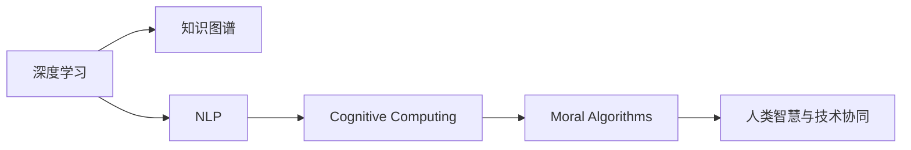

                 

# 人类的知识与智慧：在人工智能时代

## 1. 背景介绍

### 1.1 问题由来

人工智能（AI）技术正以前所未有的速度进步，其核心驱动之一是人类知识的数字化和网络化。知识库、百科全书、数据库等丰富的文本数据，为深度学习模型提供了海量的学习素材。AI能够通过学习这些文本数据，掌握语言规律、抽象概念，甚至具备一定的推理能力。

然而，即便是拥有最先进的深度学习模型，AI仍无法完全替代人类的智慧。人类的知识与智慧，不仅包括数理化、语言学等专业领域的知识，更包括了价值观、伦理观、社会文化等深层次的认知。这些难以用语言文字描述的内容，是人类智慧的核心，也是AI当前尚未完全理解和掌握的。

本文旨在探讨AI时代下，人类知识与智慧的数字化，以及如何通过深度学习模型来辅助人类智慧的提升。我们将从核心概念入手，解析AI的原理和架构，讨论算法与应用的细节，展望未来的发展趋势与挑战。

### 1.2 问题核心关键点

1. **知识与智慧的数字化**：如何通过文本数据和深度学习模型，有效地提取、存储和应用人类的知识与智慧？
2. **深度学习与认知的融合**：如何结合深度学习模型的模式识别能力和人类智慧的复杂推理能力，实现AI的认知突破？
3. **AI的伦理与责任**：在AI的广泛应用中，如何保障伦理道德，避免潜在风险，确保AI的公正与公平？
4. **智慧与技术的协同进化**：如何通过AI技术的发展，提升人类智慧，推动社会进步？

## 2. 核心概念与联系

### 2.1 核心概念概述

- **深度学习（Deep Learning）**：一种基于人工神经网络的机器学习技术，通过多层次的非线性映射，实现对复杂数据结构的抽象表示。
- **知识图谱（Knowledge Graph）**：一种图形化的知识表示方法，用于存储和表达实体、属性和关系等信息。
- **自然语言处理（NLP）**：涉及计算机如何处理和理解人类语言的技术，包括文本分类、机器翻译、语音识别等。
- **认知计算（Cognitive Computing）**：模拟人类大脑认知过程的计算模式，涵盖感知、学习、推理、决策等方面。
- **道德算法（Ethical Algorithms）**：设计和管理AI系统，确保其行为符合伦理道德标准，避免偏见和歧视。

这些核心概念构成了AI时代下人类知识与智慧数字化的基础框架，通过深度学习、知识图谱、NLP等技术，AI模型能够从文本数据中提取和应用人类知识，从而提升认知能力。

### 2.2 核心概念原理和架构的 Mermaid 流程图



这个流程图展示了深度学习、知识图谱、NLP、认知计算和道德算法之间的关系：

1. 深度学习模型通过大量文本数据进行训练，抽取语言和知识规律。
2. 知识图谱将这些规律存储为图形化的知识结构，便于查询和推理。
3. NLP技术将文本数据转化为结构化信息，支持深度学习和认知计算。
4. 认知计算模拟人类大脑的认知过程，实现复杂推理和决策。
5. 道德算法确保认知计算过程符合伦理道德，避免偏见和歧视。
6. 最终，这些技术共同作用，提升了人类智慧，推动技术与社会协同进步。

## 3. 核心算法原理 & 具体操作步骤

### 3.1 算法原理概述

AI时代下，深度学习模型通过文本数据的预训练和微调，不断提升其认知能力。核心算法包括：

- **自监督预训练（Self-Supervised Pre-training）**：在大规模无标签文本数据上，通过自监督任务训练模型，学习通用的语言和知识表示。
- **有监督微调（Supervised Fine-tuning）**：在预训练模型的基础上，利用少量有标签数据，微调模型以适应特定任务，提升其针对任务的性能。
- **知识图谱嵌入（Knowledge Graph Embedding）**：将知识图谱中的实体和关系映射为低维向量，支持推理和查询。
- **神经图灵机（Neural Turing Machine）**：结合神经网络和知识图谱，实现更高效的推理和决策。

### 3.2 算法步骤详解

**步骤1: 数据预处理**

1. **文本清洗**：去除无用字符、噪声文本，保证数据质量。
2. **分词与标注**：将文本转化为词汇序列，标注词性、命名实体等。
3. **数据增强**：通过回译、改写等方式扩充数据集，增加样本多样性。

**步骤2: 自监督预训练**

1. **构建预训练任务**：设计自监督学习任务，如掩码语言模型、句子相似度判断等。
2. **训练预训练模型**：在无标签文本数据上，使用深度神经网络进行训练，学习语言和知识规律。
3. **保存预训练模型**：将训练好的模型参数保存，用于后续的微调和推理。

**步骤3: 有监督微调**

1. **选择微调模型**：根据任务需求，选择合适的预训练模型。
2. **准备标注数据**：收集和标注特定任务的数据集。
3. **微调模型**：在标注数据上，使用有监督学习任务训练模型，调整部分参数以适应任务。
4. **评估和优化**：在验证集和测试集上评估模型性能，调整超参数，优化模型。

**步骤4: 推理与决策**

1. **输入预处理**：将用户输入文本转化为模型可处理的形式。
2. **模型推理**：将预处理后的文本输入模型，得到推理结果。
3. **后处理**：根据推理结果，输出结构化信息或直接提供答案。

### 3.3 算法优缺点

深度学习模型在AI时代下展现出了强大的数据处理能力，但也存在以下局限：

**优点**：

- **高效处理文本数据**：深度学习模型能够自动提取和应用语言规律，处理大规模文本数据。
- **通用性较强**：预训练模型在多种任务上表现优异，能够快速适应新任务。
- **推理能力**：通过知识图谱嵌入和神经图灵机，模型具备一定的推理和决策能力。

**缺点**：

- **泛化能力有限**：模型过于依赖数据，容易过拟合。
- **推理缺乏逻辑性**：深度学习模型缺乏符号化推理能力，推理过程难以解释。
- **伦理问题**：模型可能存在偏见和歧视，伦理问题难以完全解决。

### 3.4 算法应用领域

深度学习模型在多个领域展现了强大的应用潜力，如：

- **医疗诊断**：通过学习医疗知识图谱，辅助医生进行诊断和治疗决策。
- **金融预测**：利用金融数据，预测市场趋势和投资风险。
- **教育推荐**：根据学生的学习数据，推荐适合的课程和学习资源。
- **智能客服**：通过NLP技术和深度学习模型，实现智能问答和对话。
- **安全监控**：分析视频和音频数据，检测异常行为和事件。

## 4. 数学模型和公式 & 详细讲解 & 举例说明

### 4.1 数学模型构建

设文本数据集为 $D=\{x_1,x_2,\dots,x_N\}$，其中 $x_i$ 表示第 $i$ 条文本，每个词汇 $w$ 映射为向量 $w \in \mathbb{R}^d$。深度学习模型 $M_{\theta}$ 通过训练，学习到参数 $\theta$，用于处理和推理文本数据。

假设模型的输入为 $x$，输出为 $y$，损失函数为 $\ell(M_{\theta}(x),y)$。在训练过程中，最小化损失函数 $\mathcal{L}(\theta)=\frac{1}{N}\sum_{i=1}^N \ell(M_{\theta}(x_i),y_i)$，更新参数 $\theta$。

### 4.2 公式推导过程

以掩码语言模型（Masked Language Model）为例，推导其损失函数和梯度计算公式。

设文本 $x_i=\{w_1,w_2,\dots,w_n\}$，模型在文本 $x_i$ 上的损失函数为：

$$
\ell(x_i)=-\sum_{i=1}^n \log p_{\theta}(w_i|x_{\backslash i})
$$

其中 $p_{\theta}(w_i|x_{\backslash i})$ 表示在文本 $x_{\backslash i}$ 的掩码 $w_i$ 上的概率分布。

推导损失函数的梯度，使用链式法则：

$$
\frac{\partial \mathcal{L}(\theta)}{\partial \theta_k}=-\frac{1}{N}\sum_{i=1}^N \frac{\partial \ell(x_i)}{\partial \theta_k}
$$

其中 $\frac{\partial \ell(x_i)}{\partial \theta_k}$ 为损失函数对模型参数 $\theta_k$ 的梯度。

### 4.3 案例分析与讲解

假设有一个文本分类任务，输入为新闻文章，输出为新闻类别。使用BERT模型进行微调。

**输入预处理**：将新闻文章分词，构建词汇序列，并添加特殊标记。

**模型微调**：
1. **选择模型**：使用BERT-base模型。
2. **准备数据**：收集标注好的新闻数据集。
3. **微调模型**：
   - 定义输入特征 $x$ 和标签 $y$。
   - 加载预训练模型参数，定义分类器。
   - 定义损失函数和优化器。
   - 在训练集上训练模型，最小化损失函数。
4. **评估模型**：在验证集上评估模型性能，调整超参数。
5. **推理决策**：在测试集上测试模型性能，输出分类结果。

## 5. 项目实践：代码实例和详细解释说明

### 5.1 开发环境搭建

1. **安装Python和相关库**：
   - Python 3.8 或更高版本。
   - 安装TensorFlow、PyTorch、NLTK等库。

2. **设置虚拟环境**：
   ```bash
   conda create -n myenv python=3.8
   conda activate myenv
   ```

3. **安装深度学习框架**：
   ```bash
   pip install tensorflow
   pip install pytorch torchvision torchaudio
   ```

### 5.2 源代码详细实现

以下是一个简单的Python代码示例，用于微调BERT模型进行文本分类：

```python
import tensorflow as tf
from transformers import BertTokenizer, BertForSequenceClassification
import pandas as pd
import numpy as np
from sklearn.model_selection import train_test_split

# 加载数据集
data = pd.read_csv('news.csv')

# 分词和编码
tokenizer = BertTokenizer.from_pretrained('bert-base-uncased')
encoded_data = tokenizer.batch_encode_plus(data['news'], padding='max_length', truncation=True, return_tensors='tf')

# 划分训练集和测试集
train_data, test_data = train_test_split(data, test_size=0.2, random_state=42)

# 加载模型
model = BertForSequenceClassification.from_pretrained('bert-base-uncased', num_labels=2)

# 定义损失函数和优化器
loss_fn = tf.keras.losses.SparseCategoricalCrossentropy(from_logits=True)
optimizer = tf.keras.optimizers.Adam(learning_rate=2e-5)

# 定义训练函数
def train_epoch(model, data, batch_size):
    train_dataset = tf.data.Dataset.from_tensor_slices((data['input_ids'], data['attention_mask'], data['labels']))
    train_dataset = train_dataset.shuffle(10000).batch(batch_size)
    for batch in train_dataset:
        input_ids = batch[0]
        attention_mask = batch[1]
        labels = batch[2]
        with tf.GradientTape() as tape:
            outputs = model(input_ids, attention_mask=attention_mask, labels=labels)
            loss = loss_fn(labels, outputs.logits)
        grads = tape.gradient(loss, model.trainable_variables)
        optimizer.apply_gradients(zip(grads, model.trainable_variables))

# 训练模型
for epoch in range(10):
    train_epoch(model, train_data, batch_size=32)

# 评估模型
evaluation_loss = tf.keras.metrics.SparseCategoricalCrossentropy()(model.predict(test_data['input_ids'], attention_mask=test_data['attention_mask'], return_dict=True)['logits'], test_data['labels'])
print('Evaluation loss:', evaluation_loss)

# 推理
prediction = model.predict(test_data['input_ids'], attention_mask=test_data['attention_mask'], return_dict=True)['logits']
```

### 5.3 代码解读与分析

**数据预处理**：
1. **分词和编码**：使用BERT分词器对新闻文章进行分词，并转化为模型所需的输入格式。
2. **数据划分**：将数据集划分为训练集和测试集，确保模型在未见过的数据上进行评估。

**模型微调**：
1. **模型加载**：使用BertForSequenceClassification模型，指定标签数量。
2. **损失函数和优化器**：选择交叉熵损失函数和Adam优化器，学习率为2e-5。
3. **训练函数**：在训练集上进行梯度下降，更新模型参数。

**评估与推理**：
1. **评估损失**：在测试集上计算模型评估损失。
2. **推理预测**：使用模型对新文本数据进行推理预测。

## 6. 实际应用场景

### 6.1 智能医疗

在智能医疗领域，深度学习模型可以辅助医生进行疾病诊断和治疗决策。通过学习医学知识图谱，模型能够理解病历中的文本描述，提取关键信息，辅助医生进行诊断和制定治疗方案。例如，IBM的Watson Health系统，利用深度学习模型和知识图谱，成功应用于癌症诊断和治疗方案推荐。

### 6.2 金融预测

金融领域数据量大、复杂度高，深度学习模型可以用于金融预测和风险评估。通过学习历史金融数据，模型可以预测市场趋势、评估投资风险，提供金融决策支持。例如，Goldman Sachs和JP Morgan等公司，使用深度学习模型进行股票价格预测和风险评估。

### 6.3 教育推荐

教育领域需要根据学生的学习数据，推荐适合的课程和学习资源。深度学习模型可以通过学习学生的行为数据，推荐个性化的课程和学习路径。例如，Coursera和EdX等在线教育平台，使用深度学习模型进行课程推荐和个性化学习建议。

### 6.4 智能客服

智能客服系统可以提供24/7不间断服务，回答客户咨询。通过深度学习模型，系统能够理解客户意图，提供个性化的答案和解决方案。例如，阿里巴巴和腾讯等公司，使用深度学习模型构建智能客服系统，提升客户服务体验。

## 7. 工具和资源推荐

### 7.1 学习资源推荐

1. **深度学习教程**：Google TensorFlow、PyTorch等深度学习框架提供了丰富的教程和文档，适合初学者和进阶学习者。
2. **自然语言处理教程**：Stanford NLP、Coursera等平台提供了NLP相关的课程和资源，涵盖文本分类、序列标注、机器翻译等任务。
3. **知识图谱教程**：LinkedIn知识图谱、IBM Watson等平台提供了知识图谱的构建和查询教程，适合从事知识图谱相关工作的开发者。

### 7.2 开发工具推荐

1. **TensorFlow**：Google开发的深度学习框架，支持分布式训练和GPU加速，适合大规模工程应用。
2. **PyTorch**：Facebook开发的深度学习框架，灵活易用，适合研究和实验。
3. **NLTK**：自然语言处理工具包，提供了分词、标注、句法分析等工具，适合文本处理任务。
4. **Gensim**：主题模型和文本相似度计算工具，适合知识图谱构建和查询。

### 7.3 相关论文推荐

1. **自然语言处理**：《Attention is All You Need》、《BERT: Pre-training of Deep Bidirectional Transformers for Language Understanding》等论文，介绍了深度学习在NLP任务中的应用。
2. **认知计算**：《Neural Turing Machines》、《The Knowledge-Graph Neural Machine Translation》等论文，介绍了知识图谱和神经图灵机在推理和决策中的应用。
3. **伦理道德**：《On the Morality of Artificial Intelligence》、《AI Ethics and Governance》等论文，探讨了AI技术的伦理道德问题。

## 8. 总结：未来发展趋势与挑战

### 8.1 研究成果总结

本文介绍了深度学习在AI时代下，如何通过文本数据和知识图谱，辅助人类智慧的提升。通过自监督预训练和有监督微调，模型能够从大量文本数据中提取和应用知识，提升认知能力。通过神经图灵机和道德算法，模型具备了一定的推理和决策能力，能够辅助人类进行复杂任务。

### 8.2 未来发展趋势

1. **认知能力的提升**：未来的深度学习模型将具备更强的推理和决策能力，能够处理更加复杂的认知任务。
2. **多模态融合**：深度学习模型将结合视觉、听觉等多模态数据，提升对现实世界的理解能力。
3. **伦理道德的重视**：未来的AI系统将更加注重伦理道德问题，确保其行为公正和透明。
4. **与人类智慧的协同**：AI系统将与人类智慧进行更深入的融合，提升决策的准确性和可靠性。

### 8.3 面临的挑战

1. **数据质量和多样性**：高质量、多样化的数据是深度学习模型训练的前提，如何获取和处理这些数据是一个挑战。
2. **模型复杂度**：大模型往往具有复杂的结构和庞大的参数量，如何简化模型、提高计算效率是一个重要问题。
3. **伦理道德问题**：深度学习模型可能存在偏见和歧视，如何确保其行为公正是一个挑战。
4. **人机协同**：如何通过AI系统辅助人类智慧，提升决策的准确性和可靠性，是一个需要深入研究的课题。

### 8.4 研究展望

未来的研究将集中在以下几个方向：

1. **小样本学习**：研究如何在少量数据下训练深度学习模型，提升模型的泛化能力。
2. **可解释性**：提高深度学习模型的可解释性，帮助人们理解其决策过程。
3. **多模态融合**：研究如何将视觉、听觉等数据与文本数据结合，提升AI系统的认知能力。
4. **伦理道德**：建立深度学习模型的伦理道德标准，确保其行为公正和透明。

## 9. 附录：常见问题与解答

### Q1: 深度学习模型在文本处理中的优势是什么？

A: 深度学习模型具有以下优势：
1. **自动特征提取**：深度学习模型能够自动从文本中提取特征，无需手动设计特征工程。
2. **大规模数据处理**：深度学习模型可以处理大规模文本数据，提升模型的泛化能力。
3. **自监督学习**：深度学习模型可以通过自监督任务进行预训练，学习通用语言规律。

### Q2: 深度学习模型在推理决策中存在哪些局限？

A: 深度学习模型在推理决策中存在以下局限：
1. **缺乏符号推理**：深度学习模型缺乏符号化推理能力，推理过程难以解释。
2. **过拟合风险**：深度学习模型容易过拟合，泛化能力有限。
3. **伦理道德问题**：深度学习模型可能存在偏见和歧视，需要额外的伦理监管。

### Q3: 如何提高深度学习模型的可解释性？

A: 提高深度学习模型的可解释性，可以通过以下方法：
1. **注意力机制**：通过可视化模型的注意力权重，了解模型关注的信息。
2. **可解释性模型**：使用可解释性模型，如LIME、SHAP等，解释模型的决策过程。
3. **规则嵌入**：将符号化规则嵌入模型，提升模型的可解释性。

### Q4: 如何缓解深度学习模型的伦理道德问题？

A: 缓解深度学习模型的伦理道德问题，可以通过以下方法：
1. **公平性评估**：在模型训练过程中，加入公平性评估指标，过滤偏见样本。
2. **伦理约束**：在模型设计中加入伦理约束，确保其行为符合道德标准。
3. **人工干预**：通过人工审核和监督，确保模型的公正和透明。

### Q5: 深度学习模型在实际应用中面临的主要挑战是什么？

A: 深度学习模型在实际应用中面临的主要挑战包括：
1. **数据质量和多样性**：高质量、多样化的数据是深度学习模型训练的前提。
2. **模型复杂度**：大模型往往具有复杂的结构和庞大的参数量，如何简化模型、提高计算效率是一个重要问题。
3. **伦理道德问题**：深度学习模型可能存在偏见和歧视，需要额外的伦理监管。
4. **人机协同**：如何通过AI系统辅助人类智慧，提升决策的准确性和可靠性，是一个需要深入研究的课题。

---

作者：禅与计算机程序设计艺术 / Zen and the Art of Computer Programming

