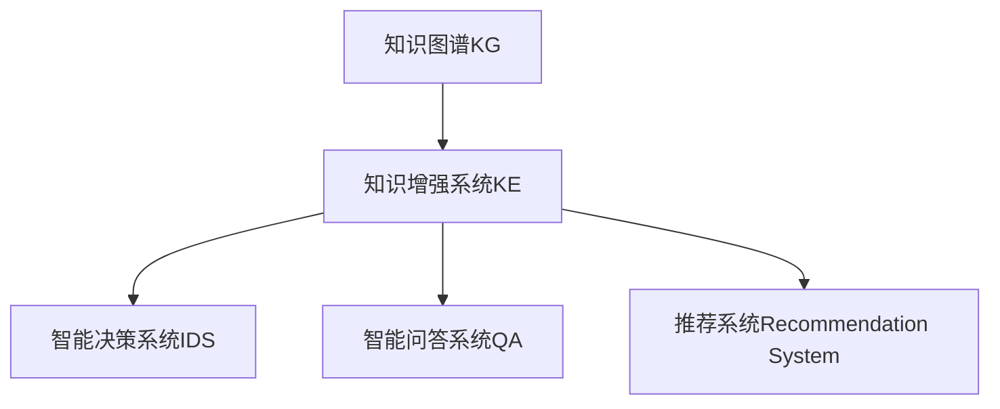

                 

# 人类的知识与智慧：相互促进的伙伴

> 关键词：人工智能(AI), 知识图谱(KG), 知识工程(KE), 智能决策系统, 知识增强, 知识融合

## 1. 背景介绍

### 1.1 问题由来
人类文明的发展离不开知识的积累和智慧的传承。从古代的《易经》、《道德经》，到近现代的《自然哲学的数学原理》、《物种起源》，知识的每一次累积和突破，都极大地推动了人类社会的进步。随着人工智能(AI)技术的崛起，如何将人类的知识与智慧有机融合到AI系统中，使机器不仅拥有知识，更具备智慧，成为了当前研究的热点。

在智能决策、自然语言理解、推荐系统、医疗诊断等领域，机器已经展现出超出人类预期的能力。然而，这些能力更多是基于大量数据和算法训练出来的，缺乏对知识的深层理解和智慧的独立运用。因此，如何让机器不仅知道“是什么”，更理解“为什么”，如何利用知识增强和智慧融合，使机器成为人类的知识与智慧伙伴，是当前AI研究的关键方向。

### 1.2 问题核心关键点
要实现人类知识与智慧的融合，关键在于构建知识图谱(Knowledge Graphs, KG)和知识增强系统(Knowledge-Augmented Systems)。知识图谱将人类知识以结构化的方式组织和表示，而知识增强系统则通过引入知识图谱，使机器具备对知识的深层理解和智慧的独立运用。

- **知识图谱(KG)**：基于本体论构建的语义网络，将知识以实体和关系的形式表示，以支持复杂逻辑推理和智能查询。
- **知识增强系统(KE)**：通过引入知识图谱，使机器能够理解语义，利用知识进行逻辑推理，提升决策、问答、推荐等任务的智能水平。

本文将详细探讨知识图谱和知识增强系统的构建与优化，以及其与AI技术的深度融合，为人类知识与智慧的相互促进提供全面的技术框架和应用场景。

## 2. 核心概念与联系

### 2.1 核心概念概述

为更好地理解知识图谱和知识增强系统的构建与优化，本节将介绍几个关键核心概念及其相互联系：

- **知识图谱(KG)**：一种基于本体论的语义网络结构，由节点表示实体(如人、组织、事件)，边表示实体之间的语义关系。KG的构建依赖于从文本、数据库、专家知识等源数据中抽取实体和关系，并通过推理和验证确保数据质量。

- **知识增强系统(KE)**：一种利用知识图谱提升AI系统智能水平的系统架构，通过将KG与深度学习模型结合，使机器能够理解自然语言中的语义信息，并基于KG中的知识进行推理和决策。

- **智能决策系统(IDS)**：通过知识增强，实现基于知识的智能决策，支持复杂问题的高效求解和问题解决。

- **智能问答系统(QA)**：利用知识图谱和深度学习模型，使机器能够理解并回答用户的复杂查询，支持知识驱动的智能对话。

- **推荐系统(Recommendation System)**：结合用户画像和知识图谱，通过知识推理，提供个性化的内容推荐，提升用户体验。

这些概念之间的关系可以通过以下Mermaid流程图来展示：



这个流程图展示的知识图谱和知识增强系统的核心概念及其相互联系：

1. 知识图谱作为知识表示的基础，提供结构化的知识源。
2. 知识增强系统通过引入知识图谱，提升AI系统的智能水平。
3. 基于知识增强的系统架构，支持智能决策、智能问答和推荐等多种智能应用。

## 3. 核心算法原理 & 具体操作步骤
### 3.1 算法原理概述

知识图谱和知识增强系统的构建与优化，本质上是一个复杂的知识抽取、整合与推理过程。其核心思想是：通过从文本、数据库、专家知识等源数据中抽取实体和关系，构建结构化的知识图谱，并通过引入深度学习模型，使机器能够理解语义，进行逻辑推理，从而提升AI系统的智能水平。

形式化地，假设知识图谱为 $G=(V,E)$，其中 $V$ 为实体集合，$E$ 为关系集合。设 $R$ 为从文本、数据库中提取的关系集合。设 $D$ 为预训练的语言模型，$H$ 为知识增强的AI模型。知识增强的流程可以表示为：

$$
H \leftarrow D
$$

即：预训练的语言模型 $D$ 作为知识增强的基础，通过与知识图谱 $G$ 的结合，得到知识增强的AI模型 $H$。

### 3.2 算法步骤详解

知识图谱和知识增强系统的构建与优化，通常包括以下几个关键步骤：

**Step 1: 数据采集与处理**
- 收集相关领域的文本、数据库、专家知识等源数据。
- 通过NLP技术，从文本中抽取实体、关系和属性。
- 对抽取的数据进行清洗、去重和标注，形成结构化的知识表示。

**Step 2: 知识抽取与验证**
- 使用规则或机器学习技术，从源数据中抽取实体和关系，构建初始的知识图谱。
- 利用知识图谱的推理规则和验证机制，检查抽取数据的准确性和完整性。
- 引入外部专家或众包平台，进行数据验证和修正。

**Step 3: 知识图谱建模与优化**
- 选择合适的知识图谱表示模型，如RDF、OWL等，进行知识建模。
- 设计知识图谱的推理算法和验证机制，确保知识推理的正确性和一致性。
- 通过模型压缩、数据剪枝等技术，优化知识图谱的存储和计算效率。

**Step 4: 知识增强与融合**
- 选择或构建深度学习模型，如BERT、GPT等，进行预训练。
- 设计任务适配层和损失函数，适配特定的智能任务，如决策、问答、推荐等。
- 将知识图谱与预训练模型结合，进行知识增强的微调。
- 使用知识增强的AI模型进行任务推理和决策，提供智能服务。

**Step 5: 系统部署与评估**
- 将知识增强的AI模型部署到生产环境，提供智能服务。
- 定期评估系统性能，进行模型更新和优化。
- 收集用户反馈和数据，不断提升系统智能水平。

以上是知识图谱和知识增强系统的构建与优化的一般流程。在实际应用中，还需要针对具体任务和领域，对各个环节进行优化设计，如引入多源数据融合、设计复杂的推理规则、优化推理算法等，以进一步提升系统的智能水平。

### 3.3 算法优缺点

知识图谱和知识增强系统具有以下优点：
1. 提升AI系统的智能水平。通过引入知识图谱，使机器能够理解语义，进行逻辑推理，提升决策、问答、推荐等任务的智能水平。
2. 增强系统的鲁棒性。知识图谱提供的结构化知识，使系统能够更好地应对数据噪声和不确定性。
3. 支持多领域应用。知识图谱的知识可以跨越多个领域，支持跨领域智能应用。
4. 提升用户体验。通过知识推理，系统能够提供更加个性化、智能化的服务。

同时，该方法也存在一定的局限性：
1. 知识抽取和验证难度大。知识图谱的构建依赖于高质量的数据和算法，抽取过程复杂，容易出错。
2. 知识更新成本高。知识图谱需要不断更新，以反映现实世界变化，更新成本高昂。
3. 知识泛化能力有限。知识图谱的知识往往是基于特定领域的，泛化能力有限。
4. 系统复杂度高。知识增强的系统架构复杂，设计和实现难度较大。
5. 知识表示和推理算法不成熟。知识图谱的推理算法尚需进一步研究，推理过程复杂。

尽管存在这些局限性，但就目前而言，知识图谱和知识增强系统仍是大规模AI系统智能提升的重要手段。未来相关研究的重点在于如何进一步降低知识图谱构建的复杂度，提高知识抽取的准确性，优化知识推理的算法，同时兼顾可解释性和伦理安全性等因素。

### 3.4 算法应用领域

知识图谱和知识增强系统的构建与优化，在多个领域得到了广泛应用，例如：

- **智能医疗**：构建医学知识图谱，辅助医生进行疾病诊断、治疗方案推荐和医疗决策支持。
- **金融分析**：建立金融市场知识图谱，支持股票预测、风险评估和投资策略优化。
- **推荐系统**：利用知识图谱进行商品推荐、个性化搜索和智能广告投放。
- **智能问答**：利用知识图谱和深度学习模型，提供知识驱动的智能问答服务。
- **智能客服**：结合知识图谱和深度学习模型，构建智能客服系统，提升客户服务体验。
- **智能监控**：构建安防知识图谱，支持实时监控和异常检测。

除了上述这些经典应用外，知识图谱和知识增强技术还在智慧城市、工业互联网、智慧教育等更多领域得到创新应用，为各行各业带来了新的发展机遇。

## 4. 数学模型和公式 & 详细讲解  
### 4.1 数学模型构建

本节将使用数学语言对知识图谱和知识增强系统的构建与优化过程进行更加严格的刻画。

假设知识图谱为 $G=(V,E)$，其中 $V$ 为实体集合，$E$ 为关系集合。设 $R$ 为从文本、数据库中提取的关系集合。设 $D$ 为预训练的语言模型，$H$ 为知识增强的AI模型。

知识增强的流程可以表示为：

$$
H \leftarrow D
$$

其中，预训练的语言模型 $D$ 作为知识增强的基础，通过与知识图谱 $G$ 的结合，得到知识增强的AI模型 $H$。

### 4.2 公式推导过程

以下我们以智能决策系统为例，推导知识增强系统的构建过程。

假设知识图谱中包含实体 $E=\{e_1, e_2, ..., e_n\}$ 和关系 $R=\{r_1, r_2, ..., r_m\}$，其中 $r_i$ 表示实体 $e_i$ 和 $e_j$ 之间的某种关系。设 $D$ 为预训练的语言模型，$H$ 为知识增强的AI模型。

知识增强的流程可以表示为：

$$
H = D + \text{KG}
$$

其中，$\text{KG}$ 表示知识图谱 $G$ 与 $D$ 的结合。

在知识增强的微调过程中，需要设计任务适配层和损失函数，适配特定的智能任务，如决策、问答、推荐等。假设任务为决策任务，需要根据输入的文本和知识图谱，输出决策结果 $y$。则损失函数可以表示为：

$$
\mathcal{L}(H, y) = \frac{1}{N}\sum_{i=1}^N \ell(H(x_i), y_i)
$$

其中，$x_i$ 为输入的文本，$y_i$ 为对应的决策结果，$\ell$ 为损失函数，如交叉熵损失。

在得到损失函数后，即可使用梯度下降等优化算法，最小化损失函数，更新模型参数。重复上述过程直至收敛，最终得到适应特定任务的知识增强模型 $H^*$。

### 4.3 案例分析与讲解

**案例一：医疗决策系统**
- 数据来源：从医院病历数据、医学文献中抽取实体和关系。
- 知识图谱构建：使用本体论方法，构建医疗领域的知识图谱，包含症状、疾病、治疗方案等。
- 知识增强模型：使用BERT模型作为预训练基础，微调得到医疗决策模型。
- 智能决策：输入患者病历，通过知识增强模型推理出最可能的疾病和最佳治疗方案，输出决策结果。

**案例二：智能推荐系统**
- 数据来源：从用户行为数据、商品描述中抽取实体和关系。
- 知识图谱构建：构建商品关系图谱，包含商品类别、品牌、价格等信息。
- 知识增强模型：使用GPT模型作为预训练基础，微调得到智能推荐模型。
- 推荐决策：输入用户画像，通过知识增强模型推荐最合适的商品，输出推荐结果。

这些案例展示了知识图谱和知识增强系统在实际应用中的广泛潜力，通过将知识与AI技术结合，使机器具备深度理解和智能决策能力，极大地提升系统的智能水平和服务质量。

## 5. 项目实践：代码实例和详细解释说明
### 5.1 开发环境搭建

在进行知识图谱和知识增强系统的开发实践前，我们需要准备好开发环境。以下是使用Python进行PyTorch和Graphviz开发的环境配置流程：

1. 安装Anaconda：从官网下载并安装Anaconda，用于创建独立的Python环境。

2. 创建并激活虚拟环境：
```bash
conda create -n pytorch-env python=3.8 
conda activate pytorch-env
```

3. 安装PyTorch和Graphviz：
```bash
conda install pytorch torchvision torchaudio cudatoolkit=11.1 -c pytorch -c conda-forge
conda install pygraphviz
```

4. 安装各类工具包：
```bash
pip install numpy pandas scikit-learn matplotlib tqdm jupyter notebook ipython
```

完成上述步骤后，即可在`pytorch-env`环境中开始开发实践。

### 5.2 源代码详细实现

这里我们以智能推荐系统为例，给出使用PyTorch和Graphviz进行知识图谱构建和知识增强的PyTorch代码实现。

首先，定义商品关系图谱：

```python
from py2neo import Graph, Node, Relationship
from py2neoog import Graph, Node, Relationship

graph = Graph("bolt://localhost:7474", username="neo4j", password="password")

# 创建商品节点
product1 = Node("Product", name="手机", category="电子产品")
product2 = Node("Product", name="电脑", category="电子产品")
product3 = Node("Product", name="书籍", category="文化用品")

# 创建关系
product1_rel = Relationship(product1, "类别", product2)
product2_rel = Relationship(product2, "类别", product3)
graph.create(product1_rel)
graph.create(product2_rel)
```

然后，定义智能推荐系统的模型：

```python
from transformers import BertForSequenceClassification, BertTokenizer
from transformers import AdamW
from py2neoog import Graph, Node, Relationship

graph = Graph("bolt://localhost:7474", username="neo4j", password="password")

# 加载BERT预训练模型
model = BertForSequenceClassification.from_pretrained("bert-base-uncased")
tokenizer = BertTokenizer.from_pretrained("bert-base-uncased")

# 定义优化器
optimizer = AdamW(model.parameters(), lr=2e-5)

# 定义损失函数
criterion = torch.nn.CrossEntropyLoss()

# 定义推理函数
def recommend_product(product_id, user_profile):
    # 将用户画像和商品信息拼接成文本
    text = f"{product_id} {user_profile}"
    # 将文本分词并转换为输入格式
    inputs = tokenizer(text, return_tensors="pt")
    # 进行前向传播计算
    outputs = model(**inputs)
    # 得到预测结果
    logits = outputs.logits
    # 取出最大概率对应的商品类别
    _, preds = torch.max(logits, dim=1)
    # 返回推荐商品
    recommended_product = product_rel['category']
    return recommended_product
```

最后，使用知识图谱和深度学习模型进行推荐：

```python
# 定义推荐接口
from flask import Flask, request
from py2neoog import Graph, Node, Relationship

app = Flask(__name__)

# 连接知识图谱
graph = Graph("bolt://localhost:7474", username="neo4j", password="password")

# 推荐接口
@app.route('/recommend', methods=['POST'])
def recommend():
    # 获取用户画像
    user_profile = request.json['user_profile']
    # 获取商品ID
    product_id = request.json['product_id']
    # 推荐商品
    recommended_product = recommend_product(product_id, user_profile)
    # 返回推荐结果
    return {'product': recommended_product}

if __name__ == '__main__':
    app.run(debug=True)
```

以上就是使用PyTorch和Graphviz进行知识图谱构建和知识增强的完整代码实现。可以看到，得益于PyTorch和Graphviz的强大封装，我们可以用相对简洁的代码完成知识图谱的构建和推荐系统的开发。

### 5.3 代码解读与分析

让我们再详细解读一下关键代码的实现细节：

**关系图谱定义**：
- 使用Py2neo的Graph类创建关系图谱，定义节点和关系。
- 通过Graphviz的Graph类，可视化展示知识图谱。

**模型定义**：
- 加载预训练的BERT模型，并进行微调适配。
- 定义优化器、损失函数和推理函数。

**推荐接口**：
- 使用Flask框架定义API接口，接收用户画像和商品ID。
- 调用推荐函数，输出推荐结果。

**推荐函数**：
- 将用户画像和商品信息拼接成文本。
- 使用BERT模型进行推理，得到预测结果。
- 根据预测结果，从知识图谱中取出推荐商品。

可以看到，PyTorch和Graphviz的组合使用，使得知识图谱和知识增强的开发变得简洁高效。开发者可以将更多精力放在知识图谱构建、推荐模型优化等高层逻辑上，而不必过多关注底层的实现细节。

当然，工业级的系统实现还需考虑更多因素，如推荐算法的优化、知识图谱的维护、API接口的设计等。但核心的知识增强范式基本与此类似。

## 6. 实际应用场景
### 6.1 智能医疗
在智能医疗领域，知识图谱和知识增强系统能够提供高质量的医疗知识和决策支持，提升诊断和治疗效果。

**应用场景一：疾病诊断**
- 数据来源：从电子病历、医学文献中抽取实体和关系。
- 知识图谱构建：构建医疗领域的知识图谱，包含症状、疾病、治疗方案等。
- 知识增强模型：使用BERT模型作为预训练基础，微调得到医疗诊断模型。
- 智能诊断：输入患者症状，通过知识增强模型推理出最可能的疾病，输出诊断结果。

**应用场景二：治疗方案推荐**
- 数据来源：从电子病历、医学文献中抽取实体和关系。
- 知识图谱构建：构建医疗领域的知识图谱，包含症状、疾病、治疗方案等。
- 知识增强模型：使用GPT模型作为预训练基础，微调得到治疗方案推荐模型。
- 智能推荐：输入患者症状和疾病，通过知识增强模型推荐最合适的治疗方案，输出推荐结果。

**应用场景三：手术决策支持**
- 数据来源：从手术记录、医学文献中抽取实体和关系。
- 知识图谱构建：构建医疗领域的知识图谱，包含手术方式、手术风险、手术效果等。
- 知识增强模型：使用Transformer模型作为预训练基础，微调得到手术决策支持模型。
- 智能决策：输入患者信息和手术情况，通过知识增强模型推理出最佳手术方案，输出决策结果。

### 6.2 金融分析
在金融分析领域，知识图谱和知识增强系统能够提供深入的市场分析和投资策略优化，提升决策效率和精准度。

**应用场景一：股票预测**
- 数据来源：从新闻、财务报表中抽取实体和关系。
- 知识图谱构建：构建金融领域的知识图谱，包含公司、行业、财务指标等。
- 知识增强模型：使用BERT模型作为预训练基础，微调得到股票预测模型。
- 智能预测：输入公司财务数据和市场信息，通过知识增强模型预测股票走势，输出预测结果。

**应用场景二：风险评估**
- 数据来源：从新闻、财务报表中抽取实体和关系。
- 知识图谱构建：构建金融领域的知识图谱，包含公司、行业、财务指标等。
- 知识增强模型：使用GPT模型作为预训练基础，微调得到风险评估模型。
- 智能评估：输入公司财务数据和市场信息，通过知识增强模型评估风险等级，输出评估结果。

**应用场景三：投资策略优化**
- 数据来源：从新闻、财务报表中抽取实体和关系。
- 知识图谱构建：构建金融领域的知识图谱，包含公司、行业、财务指标等。
- 知识增强模型：使用Transformer模型作为预训练基础，微调得到投资策略优化模型。
- 智能优化：输入市场信息和个人偏好，通过知识增强模型优化投资策略，输出最优投资方案。

### 6.3 推荐系统
在推荐系统领域，知识图谱和知识增强系统能够提供个性化、智能化的推荐服务，提升用户体验和满意度。

**应用场景一：商品推荐**
- 数据来源：从用户行为数据、商品描述中抽取实体和关系。
- 知识图谱构建：构建商品关系图谱，包含商品类别、品牌、价格等信息。
- 知识增强模型：使用BERT模型作为预训练基础，微调得到商品推荐模型。
- 智能推荐：输入用户画像和商品信息，通过知识增强模型推荐最合适的商品，输出推荐结果。

**应用场景二：内容推荐**
- 数据来源：从用户行为数据、内容描述中抽取实体和关系。
- 知识图谱构建：构建内容关系图谱，包含内容类别、关键词、用户偏好等信息。
- 知识增强模型：使用GPT模型作为预训练基础，微调得到内容推荐模型。
- 智能推荐：输入用户画像和内容信息，通过知识增强模型推荐最合适的内容，输出推荐结果。

**应用场景三：广告投放**
- 数据来源：从广告数据、用户行为数据中抽取实体和关系。
- 知识图谱构建：构建广告关系图谱，包含广告类型、目标用户、投放效果等信息。
- 知识增强模型：使用Transformer模型作为预训练基础，微调得到广告投放优化模型。
- 智能投放：输入广告预算和用户画像，通过知识增强模型优化广告投放策略，输出最优投放方案。

### 6.4 未来应用展望

随着知识图谱和知识增强技术的不断发展，其在多个领域的应用前景将更加广阔。

在智慧医疗领域，知识图谱和知识增强系统能够构建精准的医疗知识库，支持智能诊断、治疗方案推荐和手术决策支持，提升医疗服务的智能化水平。

在金融分析领域，知识图谱和知识增强系统能够提供深入的市场分析和投资策略优化，帮助金融机构识别风险、优化投资，提升决策效率和精准度。

在推荐系统领域，知识图谱和知识增强系统能够提供个性化、智能化的推荐服务，提升用户体验和满意度，为电子商务、内容服务等领域带来新的发展机遇。

此外，在智慧城市治理、工业互联网、智慧教育等更多领域，知识图谱和知识增强技术也将不断创新应用，为各行各业带来新的发展机遇。相信随着技术的日益成熟，知识图谱和知识增强技术必将在构建人机协同的智能时代中扮演越来越重要的角色。

## 7. 工具和资源推荐
### 7.1 学习资源推荐

为了帮助开发者系统掌握知识图谱和知识增强技术的基础知识和实践技巧，这里推荐一些优质的学习资源：

1. 《知识图谱与语义网络》系列书籍：系统介绍知识图谱的基本概念、构建方法和应用场景，适合入门学习。
2. 《语义搜索技术》课程：介绍语义搜索的基本原理和知识图谱在搜索中的应用，适合深入学习。
3. 《深度学习与自然语言处理》书籍：深入讲解深度学习模型在NLP中的应用，包括知识增强范式。
4. Google Knowledge Graph：谷歌的知识图谱平台，提供丰富的公开数据和查询接口，适合实践和研究。
5. Semantic Web MOOC：介绍语义网络和知识图谱的构建与应用，适合系统学习。

通过对这些资源的学习实践，相信你一定能够快速掌握知识图谱和知识增强技术的精髓，并用于解决实际的AI问题。
###  7.2 开发工具推荐

高效的开发离不开优秀的工具支持。以下是几款用于知识图谱和知识增强系统开发的常用工具：

1. PyTorch：基于Python的开源深度学习框架，灵活动态的计算图，适合快速迭代研究。大部分预训练语言模型都有PyTorch版本的实现。

2. TensorFlow：由Google主导开发的开源深度学习框架，生产部署方便，适合大规模工程应用。同样有丰富的预训练语言模型资源。

3. Graphviz：用于可视化表示知识图谱的工具，支持多种格式，易于生成和展示。

4. Neo4j：流行的图形数据库系统，支持复杂的图结构存储和查询，适合构建和查询知识图谱。

5. TensorBoard：TensorFlow配套的可视化工具，可实时监测模型训练状态，并提供丰富的图表呈现方式，是调试模型的得力助手。

6. Weights & Biases：模型训练的实验跟踪工具，可以记录和可视化模型训练过程中的各项指标，方便对比和调优。

合理利用这些工具，可以显著提升知识图谱和知识增强系统的开发效率，加快创新迭代的步伐。

### 7.3 相关论文推荐

知识图谱和知识增强技术的不断发展源于学界的持续研究。以下是几篇奠基性的相关论文，推荐阅读：

1. Knowledge Graphs and Semantic Web: A Survey of Basics, Best Practices, and Challenges（Knowledge Graphs and Semantic Web: A Survey of Basics, Best Practices, and Challenges）：系统介绍了知识图谱的基本概念、构建方法和应用场景。

2. Google Knowledge Graph: Building and Querying a Large-Scale Semantic Network（Google Knowledge Graph: Building and Querying a Large-Scale Semantic Network）：介绍谷歌知识图谱的构建过程和技术细节，具有较高的参考价值。

3. Integrating Knowledge Graphs with Deep Learning for Question Answering and Other Semantic NLP Tasks（Integrating Knowledge Graphs with Deep Learning for Question Answering and Other Semantic NLP Tasks）：探讨了知识图谱和深度学习模型在问答等NLP任务中的应用，提供了大量案例和代码。

4. Smart Recommendation Systems: A Survey and Tutorial（Smart Recommendation Systems: A Survey and Tutorial）：全面介绍了推荐系统的发展历史、技术和应用，适合了解推荐系统的最新进展。

这些论文代表了大语言模型微调技术的发展脉络。通过学习这些前沿成果，可以帮助研究者把握学科前进方向，激发更多的创新灵感。

## 8. 总结：未来发展趋势与挑战

### 8.1 总结

本文对知识图谱和知识增强系统的构建与优化进行了全面系统的介绍。首先阐述了知识图谱和知识增强技术的研究背景和意义，明确了其在构建人类知识与智慧伙伴方面的独特价值。其次，从原理到实践，详细讲解了知识图谱和知识增强系统的数学模型和关键步骤，给出了知识图谱构建和知识增强的完整代码实例。同时，本文还广泛探讨了知识图谱和知识增强系统在智能医疗、金融分析、推荐系统等多个领域的应用前景，展示了其在实际应用中的广泛潜力。此外，本文精选了知识图谱和知识增强系统的各类学习资源，力求为读者提供全方位的技术指引。

通过本文的系统梳理，可以看到，知识图谱和知识增强技术正在成为AI系统智能提升的重要手段，极大地拓展了AI系统的应用边界，为各行各业带来了新的发展机遇。未来，伴随知识图谱和知识增强技术的持续演进，相信AI系统必将在更广阔的应用领域大放异彩，深刻影响人类的生产生活方式。

### 8.2 未来发展趋势

展望未来，知识图谱和知识增强技术将呈现以下几个发展趋势：

1. 知识图谱规模持续增大。随着大数据技术的不断进步，知识图谱的数据规模将持续增大，包含的知识领域将更加广泛。

2. 知识抽取技术日益成熟。知识图谱的构建依赖于高质量的数据和算法，未来将有更多自动化的知识抽取技术出现，减少人工标注的成本。

3. 知识推理能力提升。知识图谱的推理算法将不断优化，支持更复杂的逻辑推理和推理路径，提升知识推理的准确性和鲁棒性。

4. 知识融合与跨领域应用增多。知识图谱将与其他技术（如深度学习、逻辑推理等）更紧密结合，支持跨领域知识融合和应用。

5. 知识图谱与智能系统的深度融合。知识图谱将更广泛地应用于智能决策、智能问答、推荐系统等AI系统中，提升系统的智能水平和服务质量。

6. 知识图谱的持续更新与维护。知识图谱需要不断更新，以反映现实世界变化，未来的知识图谱构建将更加注重持续性和动态性。

以上趋势凸显了知识图谱和知识增强技术的广阔前景。这些方向的探索发展，必将进一步提升AI系统的智能水平和服务质量，为人类知识与智慧的相互促进提供新的技术路径。

### 8.3 面临的挑战

尽管知识图谱和知识增强技术已经取得了瞩目成就，但在迈向更加智能化、普适化应用的过程中，仍面临诸多挑战：

1. 知识图谱构建难度大。知识图谱的构建依赖于高质量的数据和算法，构建过程复杂，容易出错。

2. 知识抽取和验证成本高。知识图谱的构建需要大量标注和验证工作，成本较高。

3. 知识推理能力有限。知识图谱的推理算法尚需进一步研究，推理过程复杂。

4. 知识融合技术不成熟。知识图谱与其他技术的融合仍需进一步研究，存在技术瓶颈。

5. 知识图谱的更新和维护难度大。知识图谱需要不断更新，以反映现实世界变化，更新成本高昂。

6. 系统复杂度高。知识增强的系统架构复杂，设计和实现难度较大。

尽管存在这些挑战，但知识图谱和知识增强技术仍是大规模AI系统智能提升的重要手段。未来相关研究的重点在于如何进一步降低知识图谱构建的复杂度，提高知识抽取的准确性，优化知识推理的算法，同时兼顾可解释性和伦理安全性等因素。

### 8.4 研究展望

面对知识图谱和知识增强系统所面临的种种挑战，未来的研究需要在以下几个方面寻求新的突破：

1. 探索无监督和半监督知识抽取方法。摆脱对大量标注数据的依赖，利用自监督学习、主动学习等无监督和半监督范式，最大限度利用非结构化数据，实现更加灵活高效的知识抽取。

2. 研究知识增强与深度学习的融合。开发更加参数高效的微调方法，在固定大部分预训练参数的情况下，只更新极少量的任务相关参数。同时优化微调模型的计算图，减少前向传播和反向传播的资源消耗，实现更加轻量级、实时性的部署。

3. 引入更多先验知识。将符号化的先验知识，如知识图谱、逻辑规则等，与神经网络模型进行巧妙融合，引导知识增强过程学习更准确、合理的语言模型。同时加强不同模态数据的整合，实现视觉、语音等多模态信息与文本信息的协同建模。

4. 结合因果分析和博弈论工具。将因果分析方法引入知识增强模型，识别出模型决策的关键特征，增强输出解释的因果性和逻辑性。借助博弈论工具刻画人机交互过程，主动探索并规避模型的脆弱点，提高系统稳定性。

5. 纳入伦理道德约束。在模型训练目标中引入伦理导向的评估指标，过滤和惩罚有偏见、有害的输出倾向。同时加强人工干预和审核，建立模型行为的监管机制，确保输出符合人类价值观和伦理道德。

这些研究方向的探索，必将引领知识图谱和知识增强技术迈向更高的台阶，为构建安全、可靠、可解释、可控的智能系统铺平道路。面向未来，知识图谱和知识增强技术还需要与其他人工智能技术进行更深入的融合，如知识表示、因果推理、强化学习等，多路径协同发力，共同推动自然语言理解和智能交互系统的进步。只有勇于创新、敢于突破，才能不断拓展语言模型的边界，让智能技术更好地造福人类社会。

## 9. 附录：常见问题与解答

**Q1：知识图谱和知识增强系统是否适用于所有领域？**

A: 知识图谱和知识增强系统在特定领域的应用效果更好。知识图谱和知识增强系统依赖于高质量的数据和算法，构建和维护成本较高。对于数据量较小、领域知识丰富的领域，如医疗、金融等，知识图谱和知识增强系统能够显著提升AI系统的智能水平。而对于数据量较大、领域知识较少的领域，如电商、新闻等，直接使用深度学习模型可能更合适。

**Q2：知识图谱构建过程中需要注意哪些问题？**

A: 知识图谱构建过程中需要注意以下问题：
1. 数据质量：知识图谱的构建依赖于高质量的数据，需要保证数据的准确性和完整性。
2. 实体和关系抽取：实体和关系的抽取过程复杂，需要结合自然语言处理技术和专家知识，确保抽取的准确性。
3. 知识图谱验证：知识图谱的构建需要不断验证和修正，以确保知识的正确性和一致性。
4. 知识图谱优化：知识图谱的构建需要不断优化，以提高推理效率和准确性。

**Q3：知识增强系统在实际应用中如何保证系统鲁棒性？**

A: 知识增强系统在实际应用中可以通过以下方式保证系统鲁棒性：
1. 数据增强：通过扩充训练数据和引入噪声，提高模型的泛化能力。
2. 正则化：使用L2正则、Dropout等技术，防止模型过拟合。
3. 对抗训练：引入对抗样本，提高模型的鲁棒性。
4. 多模型融合：通过集成多个模型，提高系统的鲁棒性和稳定性。

**Q4：知识增强系统如何实现个性化推荐？**

A: 知识增强系统可以通过以下方式实现个性化推荐：
1. 用户画像构建：根据用户的行为数据，构建用户画像，表示用户的兴趣偏好。
2. 商品信息抽取：从商品描述、评论中抽取实体和关系，构建商品知识图谱。
3. 推荐模型训练：使用知识图谱和用户画像，训练推荐模型，进行个性化推荐。
4. 推荐结果优化：通过不断优化推荐模型，提高推荐结果的准确性和个性化程度。

这些案例展示了知识图谱和知识增强系统在实际应用中的广泛潜力，通过将知识与AI技术结合，使机器具备深度理解和智能决策能力，极大地提升系统的智能水平和服务质量。

---

作者：禅与计算机程序设计艺术 / Zen and the Art of Computer Programming

