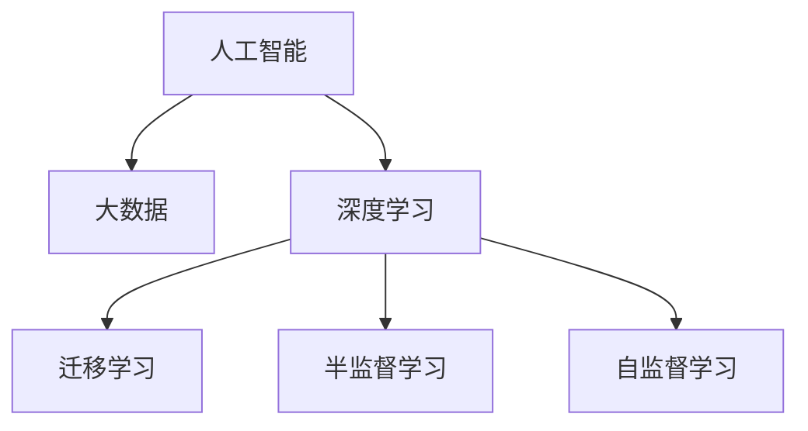

                 

# 人类的知识边界：无限的探索与追求

## 1. 背景介绍

### 1.1 问题由来

在人类文明的发展历程中，知识的探索与追求始终是推动社会进步的不竭动力。从古代的哲学思辨，到近代的科学革命，人类对于自然和自身的认知不断深化，不断拓展知识边界。随着信息时代的到来，尤其是人工智能（AI）和数据科学的飞速发展，人类的知识边界正以前所未有的速度扩展。

### 1.2 问题核心关键点

当前，人工智能和大数据技术正全面渗透到各个行业和领域，为人类知识的探索与追求带来了新的契机和挑战。AI和数据科学能够处理和分析海量数据，从中提取有用的信息和知识，加速科学研究、医疗诊断、金融分析等诸多领域的创新发展。然而，AI技术的快速发展也引发了诸如数据隐私、算法偏见、伦理道德等诸多问题，成为摆在我们面前的新课题。

### 1.3 问题研究意义

研究人类的知识边界，对于探索AI技术的潜在价值和局限性，提升AI系统的智能化水平，推动知识社会的构建，具有重要的理论和实践意义：

1. 加速知识积累与创新：AI和数据科学能够高效处理和分析海量数据，加速新知识的发现和验证，推动科学研究和技术创新的进程。
2. 提升决策质量：AI和大数据分析技术可以辅助决策者从数据中提取关键信息，提高决策的准确性和效率。
3. 促进智能应用：AI技术可以应用于智慧医疗、智能交通、智能制造等诸多领域，提升服务质量和用户体验。
4. 保护数据隐私与伦理：研究知识边界的探索与追求，需要探讨AI系统如何平衡数据利用与隐私保护，确保伦理道德的底线。

## 2. 核心概念与联系

### 2.1 核心概念概述

为更好地理解人类知识边界的探索与追求，本节将介绍几个密切相关的核心概念：

- **人工智能（Artificial Intelligence, AI）**：通过计算机模拟人类的智能行为，包括感知、学习、推理、自然语言处理等能力，以实现智能系统的目标。
- **大数据（Big Data）**：涉及数据的采集、存储、处理和分析，从海量数据中提取有用的信息和知识。
- **深度学习（Deep Learning）**：一种特殊的机器学习方法，通过多层神经网络实现对数据的复杂非线性建模，广泛应用于图像识别、语音识别、自然语言处理等领域。
- **迁移学习（Transfer Learning）**：利用在一个领域学习到的知识，迁移到另一个相关领域中进行学习，减少新领域学习的数据需求和成本。
- **半监督学习（Semi-Supervised Learning）**：利用少量标注数据和大量未标注数据进行学习，提升模型性能。
- **自监督学习（Self-Supervised Learning）**：通过自动设计的任务，让模型从无标签的数据中学习知识，无需标注数据。

这些核心概念之间的逻辑关系可以通过以下Mermaid流程图来展示：



这个流程图展示了一系列关键技术之间的相互关系：

1. 人工智能依托于大数据和深度学习技术，实现复杂的智能行为。
2. 迁移学习利用已有知识加速新领域的学习。
3. 半监督学习利用少量标注数据进行高效学习。
4. 自监督学习从无标签数据中自动学习知识。

这些概念共同构成了人工智能和数据科学的核心框架，推动着知识边界的不断拓展。

## 3. 核心算法原理 & 具体操作步骤

### 3.1 算法原理概述

人类知识边界的探索与追求，本质上是一个不断通过学习新知识、提取新模式、发现新规律的过程。这一过程可以类比于机器学习中的深度学习模型训练，通过不断迭代优化模型参数，使模型能够更好地理解和利用数据中的潜在知识。

在深度学习中，模型通过前向传播计算输出，然后通过反向传播更新参数。这一过程可以看作是知识提取和优化的循环。通过对大量标注数据的训练，模型能够学习到数据的特征和模式，从而实现对未知数据的预测和分类。

在实际应用中，深度学习模型往往被设计为多层结构，通过每一层的非线性变换，逐步抽象出数据的高级特征，最终输出预测结果。这一过程也正是知识边界的探索与追求过程，即通过多层抽象和推理，逐步拓展对数据和现实的认知。

### 3.2 算法步骤详解

深度学习模型的训练过程一般包括以下几个关键步骤：

**Step 1: 数据准备与预处理**
- 收集标注数据，确保数据的质量和多样性。
- 对数据进行清洗和预处理，如去除噪声、归一化、标准化等，以提升模型训练效果。

**Step 2: 模型构建与初始化**
- 选择合适的深度学习模型架构，如卷积神经网络（CNN）、循环神经网络（RNN）、变压器（Transformer）等。
- 初始化模型参数，通常采用随机初始化或预训练模型进行初始化。

**Step 3: 训练过程**
- 将数据划分为训练集、验证集和测试集，循环迭代训练过程。
- 对于每个训练样本，进行前向传播计算预测输出。
- 计算预测输出与真实标签之间的误差，通过反向传播算法计算梯度。
- 根据梯度更新模型参数，优化模型性能。

**Step 4: 模型评估与测试**
- 在验证集和测试集上评估模型性能，使用各种评估指标（如准确率、召回率、F1值等）评估模型效果。
- 根据评估结果，调整模型超参数，如学习率、批大小、迭代轮数等。
- 在最终的测试集上测试模型性能，确保模型在未知数据上的泛化能力。

### 3.3 算法优缺点

深度学习模型在知识边界的探索与追求中具有以下优点：

1. 高效性：能够处理大规模数据，通过迭代优化提升模型性能。
2. 泛化能力：能够从大量数据中学习规律，应用于新数据的泛化能力强。
3. 自动特征提取：通过多层网络自动学习数据的高级特征，无需手工提取特征。
4. 可解释性：通过可视化技术，如梯度图、热力图等，可以理解模型的内部工作机制。

然而，深度学习模型也存在一些缺点：

1. 计算资源需求高：模型参数量大，训练和推理需要大量计算资源。
2. 过拟合风险：模型容易在训练数据上过拟合，泛化能力下降。
3. 数据依赖性强：模型性能很大程度上依赖于训练数据的质量和多样性。
4. 黑盒性质：模型内部决策过程复杂，难以解释，可能出现不可预测的输出。

尽管存在这些缺点，但深度学习模型仍然在多个领域取得了显著的成果，如自然语言处理、计算机视觉、语音识别等，成为知识探索的重要工具。

### 3.4 算法应用领域

深度学习模型在多个领域的应用展示了其在知识边界探索与追求中的巨大潜力：

- **自然语言处理（NLP）**：用于机器翻译、文本分类、情感分析、命名实体识别等任务，通过处理和分析文本数据，提取语义信息。
- **计算机视觉（CV）**：用于图像识别、目标检测、图像分割等任务，通过处理和分析图像数据，提取视觉特征。
- **语音识别（ASR）**：用于语音识别、自动语音翻译等任务，通过处理和分析语音数据，提取语音特征。
- **医疗诊断**：用于医学影像分析、疾病预测、患者监控等任务，通过处理和分析医疗数据，提取健康信息。
- **金融分析**：用于风险评估、投资分析、欺诈检测等任务，通过处理和分析金融数据，提取经济信息。

除了上述这些经典领域，深度学习模型还在更多前沿领域展示了其潜力，如自动驾驶、智慧城市、智能制造等，为知识社会的构建提供了新的可能性。

## 4. 数学模型和公式 & 详细讲解 & 举例说明

### 4.1 数学模型构建

深度学习模型的训练过程可以形式化地表示为：

$$
\min_{\theta} \frac{1}{N} \sum_{i=1}^N \mathcal{L}(\theta; \text{data}_i)
$$

其中，$\theta$ 表示模型参数，$\mathcal{L}$ 表示损失函数，$\text{data}_i$ 表示第 $i$ 个训练样本。

深度学习模型通常采用梯度下降算法进行优化，具体步骤如下：

1. 选择优化算法，如随机梯度下降（SGD）、Adam、RMSprop等。
2. 设置学习率 $\eta$，控制参数更新的幅度。
3. 前向传播计算预测输出 $y_i = f(x_i; \theta)$。
4. 计算损失函数 $\mathcal{L}(\theta; \text{data}_i)$。
5. 计算梯度 $\nabla_{\theta}\mathcal{L}(\theta)$。
6. 更新参数 $\theta \leftarrow \theta - \eta \nabla_{\theta}\mathcal{L}(\theta)$。

### 4.2 公式推导过程

以二分类任务为例，假设有 $m$ 个训练样本 $\{(x_i, y_i)\}_{i=1}^m$，其中 $x_i$ 为输入，$y_i$ 为二分类标签（0或1），模型为 $f(x; \theta) = \text{sigmoid}(Wx + b)$，其中 $W$ 和 $b$ 为模型参数。

二分类交叉熵损失函数为：

$$
\mathcal{L}(\theta; (x_i, y_i)) = -(y_i \log f(x_i; \theta) + (1-y_i) \log (1-f(x_i; \theta)))
$$

则总损失函数为：

$$
\mathcal{L}(\theta) = \frac{1}{m} \sum_{i=1}^m \mathcal{L}(\theta; (x_i, y_i))
$$

通过反向传播算法，可以计算梯度：

$$
\frac{\partial \mathcal{L}(\theta)}{\partial W_{ij}} = -(y_i f(x_i; \theta) - (1-y_i)(1-f(x_i; \theta)) x_{ij}
$$

其中，$x_{ij}$ 表示输入 $x_i$ 中第 $j$ 个特征的值。

### 4.3 案例分析与讲解

以手写数字识别任务为例，使用深度学习模型（如卷积神经网络）进行训练。假设有 60000 个训练样本，每个样本为 28x28 的灰度图像。模型包含若干卷积层、池化层和全连接层，最终输出 10 个神经元，表示 0 到 9 的数字概率。

首先，对数据进行预处理和归一化，然后将数据划分为训练集、验证集和测试集。

在模型构建时，选择合适的深度学习架构，如 LeNet、AlexNet 等，并进行初始化。

在训练过程中，使用梯度下降算法，设置合适的学习率和批大小，进行迭代训练。在每个训练批次中，随机选择一个样本进行前向传播和反向传播，计算梯度并更新参数。

在模型评估时，使用测试集进行测试，计算模型在不同类别上的准确率、召回率和 F1 值，评估模型性能。

## 5. 项目实践：代码实例和详细解释说明

### 5.1 开发环境搭建

在进行深度学习项目实践前，我们需要准备好开发环境。以下是使用Python进行TensorFlow开发的环境配置流程：

1. 安装Anaconda：从官网下载并安装Anaconda，用于创建独立的Python环境。

2. 创建并激活虚拟环境：
```bash
conda create -n tf-env python=3.8 
conda activate tf-env
```

3. 安装TensorFlow：根据CUDA版本，从官网获取对应的安装命令。例如：
```bash
pip install tensorflow-gpu==2.7.0
```

4. 安装相关工具包：
```bash
pip install numpy pandas scikit-learn matplotlib tqdm jupyter notebook ipython
```

完成上述步骤后，即可在`tf-env`环境中开始深度学习项目实践。

### 5.2 源代码详细实现

这里我们以手写数字识别（MNIST）任务为例，给出使用TensorFlow进行卷积神经网络模型训练的代码实现。

首先，定义数据集处理函数：

```python
import tensorflow as tf
from tensorflow.keras.datasets import mnist
from tensorflow.keras.utils import to_categorical

(x_train, y_train), (x_test, y_test) = mnist.load_data()
x_train, x_test = x_train / 255.0, x_test / 255.0
y_train, y_test = to_categorical(y_train), to_categorical(y_test)
```

然后，定义模型：

```python
from tensorflow.keras.models import Sequential
from tensorflow.keras.layers import Conv2D, MaxPooling2D, Flatten, Dense

model = Sequential([
    Conv2D(32, kernel_size=(3, 3), activation='relu', input_shape=(28, 28, 1)),
    MaxPooling2D(pool_size=(2, 2)),
    Flatten(),
    Dense(128, activation='relu'),
    Dense(10, activation='softmax')
])
```

接着，定义训练和评估函数：

```python
def train(model, data, epochs, batch_size):
    model.compile(optimizer='adam', loss='categorical_crossentropy', metrics=['accuracy'])
    model.fit(data, epochs=epochs, batch_size=batch_size, validation_split=0.2)
    
def evaluate(model, test_data):
    loss, accuracy = model.evaluate(test_data)
    print(f'Test loss: {loss:.2f}, Test accuracy: {accuracy:.2f}')
```

最后，启动训练流程并在测试集上评估：

```python
epochs = 10
batch_size = 64

train(model, (x_train, y_train), epochs, batch_size)
evaluate(model, (x_test, y_test))
```

以上就是使用TensorFlow进行手写数字识别任务深度学习模型训练的完整代码实现。可以看到，得益于TensorFlow的强大封装，我们可以用相对简洁的代码完成深度学习模型的训练和评估。

### 5.3 代码解读与分析

让我们再详细解读一下关键代码的实现细节：

**数据集处理函数**：
- 使用`mnist.load_data()`函数加载MNIST数据集。
- 对数据进行归一化处理，将像素值从 [0, 255] 压缩到 [0, 1]。
- 使用`to_categorical()`函数将标签转换为one-hot编码，方便模型训练。

**模型定义**：
- 使用`Sequential`模型构建卷积神经网络，包含卷积层、池化层、全连接层等。
- 卷积层采用32个3x3的滤波器，激活函数为ReLU。
- 池化层采用2x2的池化窗口，减小特征图尺寸。
- 全连接层采用128个神经元，激活函数为ReLU。
- 输出层采用10个神经元，激活函数为softmax，输出每个类别的概率。

**训练和评估函数**：
- 使用`model.compile()`函数定义优化器、损失函数和评估指标。
- 使用`model.fit()`函数进行模型训练，设置迭代次数和批大小。
- 在每个epoch结束后，评估模型在验证集上的性能。
- 使用`model.evaluate()`函数在测试集上评估模型性能。

**训练流程**：
- 定义总的epoch数和批大小，开始循环迭代。
- 在训练集上训练模型，输出每个epoch的损失和准确率。
- 在测试集上评估模型，输出最终测试结果。

可以看到，TensorFlow提供了完整的工具链支持深度学习模型的构建、训练和评估，大大简化了深度学习项目开发的复杂度。

## 6. 实际应用场景

### 6.1 智能推荐系统

基于深度学习模型的智能推荐系统，能够根据用户的兴趣和行为，推荐符合其喜好的商品、内容或服务。通过学习用户的历史行为数据和偏好，推荐模型能够实时生成个性化的推荐结果，显著提升用户体验和转化率。

在技术实现上，可以使用深度学习模型对用户行为数据进行建模，学习用户的兴趣特征和行为规律。通过多轮交互，推荐模型能够不断调整预测结果，实现更加精准的推荐。

### 6.2 自然语言处理

深度学习模型在自然语言处理领域的应用极其广泛，涵盖了机器翻译、文本分类、情感分析、命名实体识别等任务。通过处理和分析文本数据，深度学习模型能够提取语义信息，实现智能问答、自动摘要、文本生成等功能。

在实际应用中，可以将用户输入的文本数据作为模型输入，通过前向传播计算输出。根据输出结果，推荐模型可以自动生成符合用户需求的回答或摘要，提升人机交互的效率和质量。

### 6.3 医疗影像分析

深度学习模型在医疗影像分析领域也展示了其巨大潜力。通过处理和分析医学影像数据，模型能够辅助医生进行疾病诊断、病变分析、手术规划等任务。

在技术实现上，可以使用深度学习模型对医学影像进行特征提取和分类，识别出异常区域和病变特征。通过结合医生的专业知识，模型能够生成诊断报告和建议，辅助医生做出更准确的诊断。

### 6.4 金融市场分析

深度学习模型在金融市场分析中也具有重要应用。通过处理和分析金融数据，模型能够预测市场趋势、评估投资风险、识别异常交易等。

在实际应用中，可以使用深度学习模型对股票价格、交易量等数据进行建模，预测市场走势和交易信号。通过实时监测市场动态，模型能够自动生成投资建议和风险预警，帮助投资者做出更加科学的决策。

## 7. 工具和资源推荐

### 7.1 学习资源推荐

为了帮助开发者系统掌握深度学习模型的理论基础和实践技巧，这里推荐一些优质的学习资源：

1. 《深度学习》系列书籍：由Ian Goodfellow等作者撰写，全面介绍了深度学习模型的原理和算法，是深度学习领域的经典教材。
2. CS231n《卷积神经网络》课程：斯坦福大学开设的计算机视觉课程，涵盖了卷积神经网络、图像识别等核心内容。
3. CS224n《自然语言处理》课程：斯坦福大学开设的自然语言处理课程，介绍了自然语言处理的基本原理和最新技术。
4. TensorFlow官方文档：TensorFlow的官方文档，提供了丰富的学习资源和代码示例，是深度学习开发者的必备工具。
5. PyTorch官方文档：PyTorch的官方文档，提供了详细的API接口和代码示例，方便开发者快速上手。

通过对这些资源的学习实践，相信你一定能够快速掌握深度学习模型的核心概念和实现技巧，并将其应用于实际问题中。

### 7.2 开发工具推荐

高效的开发离不开优秀的工具支持。以下是几款用于深度学习模型开发的常用工具：

1. TensorFlow：由Google主导开发的深度学习框架，支持分布式训练和部署，适合大规模工程应用。
2. PyTorch：由Facebook开发的深度学习框架，具有动态计算图和丰富的模型库，适合快速迭代研究。
3. Keras：由François Chollet开发的高级API，提供了简洁易用的API接口，方便模型构建和训练。
4. Jupyter Notebook：交互式开发环境，支持代码编写、可视化展示和协作开发，适合数据科学和机器学习项目。
5. Google Colab：谷歌提供的免费在线Jupyter Notebook环境，支持GPU和TPU计算，方便快速实验和分享。

合理利用这些工具，可以显著提升深度学习项目开发的效率和质量，加速知识探索与追求的步伐。

### 7.3 相关论文推荐

深度学习模型的发展源于学界的持续研究。以下是几篇奠基性的相关论文，推荐阅读：

1. AlexNet: ImageNet Classification with Deep Convolutional Neural Networks：提出卷积神经网络（CNN），开创了深度学习在图像识别领域的新纪元。
2. GoogleNet: Going Deeper with Convolutions：提出Inception模块，提升了深度神经网络的计算效率和表达能力。
3. ResNet: Deep Residual Learning for Image Recognition：提出残差网络（ResNet），解决了深度神经网络的退化问题，提高了模型训练效果。
4. Transformer: Attention is All You Need：提出Transformer模型，引入自注意力机制，提升了自然语言处理任务的性能。
5. GAN: Generative Adversarial Nets：提出生成对抗网络（GAN），实现了高质量的图像生成和图像修复，拓展了深度学习的应用领域。

这些论文代表了大数据和深度学习技术的发展脉络。通过学习这些前沿成果，可以帮助研究者把握学科前进方向，激发更多的创新灵感。

## 8. 总结：未来发展趋势与挑战

### 8.1 研究成果总结

本文对深度学习模型的探索与追求过程进行了全面系统的介绍。首先阐述了深度学习模型在知识探索与追求中的重要应用，明确了其在多个领域的巨大潜力。其次，从原理到实践，详细讲解了深度学习模型的训练过程和关键步骤，给出了模型构建和微调的具体代码实现。同时，本文还广泛探讨了深度学习模型在实际应用中的多种场景，展示了其在智能推荐、自然语言处理、医疗影像分析、金融市场分析等领域的应用前景。此外，本文精选了深度学习模型的各类学习资源，力求为读者提供全方位的技术指引。

通过本文的系统梳理，可以看到，深度学习模型在知识社会的构建中发挥了重要作用，推动了科学研究、技术创新和产业应用的多方位进步。未来，伴随深度学习模型的不断演进，其对知识边界的探索与追求也将更加深入和广泛。

### 8.2 未来发展趋势

展望未来，深度学习模型的探索与追求将呈现以下几个发展趋势：

1. 模型规模和复杂度增加。随着计算资源的提升和算法技术的进步，深度学习模型的参数量将持续增加，模型结构将更加复杂。
2. 自监督和无监督学习普及。随着自监督学习、半监督学习等技术的发展，深度学习模型将逐渐摆脱对大量标注数据的依赖，提高数据利用效率。
3. 跨模态学习崛起。未来的深度学习模型将更加注重跨模态数据的融合，提升对现实世界的理解和建模能力。
4. 模型训练效率提升。通过优化训练算法和模型结构，深度学习模型的训练速度将显著提高，缩短知识探索与追求的时间。
5. 模型解释性和可解释性加强。未来的深度学习模型将更加注重可解释性和可解释性，增强模型的透明度和可信度。
6. 伦理和社会责任。深度学习模型的开发与应用将更加注重伦理和社会责任，确保技术进步服务于人类社会的整体福祉。

以上趋势凸显了深度学习模型的广阔前景。这些方向的探索发展，必将进一步提升深度学习模型的智能化水平，推动知识社会的构建。

### 8.3 面临的挑战

尽管深度学习模型已经取得了显著的成果，但在迈向更加智能化、普适化应用的过程中，它仍面临诸多挑战：

1. 计算资源瓶颈。深度学习模型参数量大，训练和推理需要大量计算资源。超大规模模型的高昂计算成本，成为制约模型规模增长的瓶颈。
2. 数据依赖性强。深度学习模型的性能很大程度上依赖于训练数据的质量和多样性。如何获取高质量的数据，是模型训练的难点。
3. 模型泛化能力有限。当前深度学习模型在特定任务上表现优异，但在新领域和新数据的泛化能力仍然有待提升。
4. 可解释性不足。深度学习模型的内部工作机制复杂，难以解释其决策过程，限制了其在高风险应用中的应用。
5. 伦理道德问题。深度学习模型的输出可能带有偏见和歧视，引发伦理道德问题。如何确保模型的公平性和可信度，是重要的研究方向。

尽管存在这些挑战，但深度学习模型在多个领域已经展示了其巨大的潜力和应用前景，成为知识社会的核心工具。

### 8.4 研究展望

面对深度学习模型面临的挑战，未来的研究需要在以下几个方面寻求新的突破：

1. 开发更加高效的模型结构和算法。通过优化模型架构和训练算法，提高模型的泛化能力和可解释性。
2. 探索更多的数据获取和预处理技术。利用生成对抗网络（GAN）、自监督学习等技术，提高数据利用效率。
3. 发展跨模态学习和迁移学习技术。将视觉、语音、文本等多种模态数据融合，提升模型对现实世界的理解能力。
4. 研究模型的伦理和社会责任。建立模型的伦理评价和监督机制，确保技术进步服务于人类社会的整体福祉。
5. 推动模型解释性和可解释性研究。通过可视化技术和符号表示方法，增强模型的透明度和可信度。

这些研究方向的探索，必将引领深度学习模型迈向更高的台阶，为知识社会的构建提供新的可能性。面向未来，深度学习模型需要与其他人工智能技术进行更深入的融合，如知识表示、因果推理、强化学习等，多路径协同发力，共同推动知识社会的进步。只有勇于创新、敢于突破，才能不断拓展深度学习模型的边界，让人工智能技术更好地造福人类社会。

## 9. 附录：常见问题与解答

**Q1：深度学习模型是否适用于所有任务？**

A: 深度学习模型在处理大规模、高维、非线性数据方面具有显著优势，适用于图像、语音、文本等多种数据类型的任务。但对于一些需要精确解析和推理的任务，如医疗诊断、法律咨询等，深度学习模型可能需要进行适当的改进和优化，以提高模型的解释性和准确性。

**Q2：如何选择深度学习模型架构？**

A: 深度学习模型的选择应考虑任务的特征和数据类型。对于图像任务，卷积神经网络（CNN）是常用的模型架构。对于文本任务，循环神经网络（RNN）和Transformer模型较为适合。对于多模态任务，可以采用多任务学习（MUL）和跨模态学习（CM）等方法，融合不同模态的信息。

**Q3：如何优化深度学习模型的训练过程？**

A: 深度学习模型的训练过程可以通过以下几个方面进行优化：
1. 学习率调整：根据训练进度和学习效果，动态调整学习率，避免过拟合或欠拟合。
2. 正则化：引入L2正则、Dropout等技术，防止模型过拟合。
3. 数据增强：通过数据增强技术，如旋转、裁剪、噪声注入等，丰富数据集的多样性，提升模型的泛化能力。
4. 模型压缩：通过量化、剪枝等技术，减少模型参数量和计算资源消耗，提高模型训练和推理效率。
5. 分布式训练：利用多台计算机进行并行训练，提高训练速度，缩短模型探索与追求的时间。

这些优化技术可以帮助深度学习模型更好地适应不同任务和数据类型，提高模型的性能和效率。

**Q4：深度学习模型在实际应用中需要注意哪些问题？**

A: 深度学习模型在实际应用中需要注意以下问题：
1. 数据隐私保护：确保数据使用过程中遵循隐私保护政策，防止数据泄露。
2. 模型解释性：增强模型的透明度，提供可解释的输出，满足应用场景的合规需求。
3. 公平性：确保模型在各个数据集上表现均衡，避免因数据偏见导致的不公平现象。
4. 鲁棒性：通过对抗训练等技术，提高模型对攻击和噪声的鲁棒性，确保模型的稳定性和可靠性。
5. 可扩展性：确保模型在不同硬件平台和环境下的兼容性，支持大规模部署和应用。

合理解决这些问题，可以确保深度学习模型在实际应用中的效果和可信度，推动知识社会的建设。

---

作者：禅与计算机程序设计艺术 / Zen and the Art of Computer Programming

