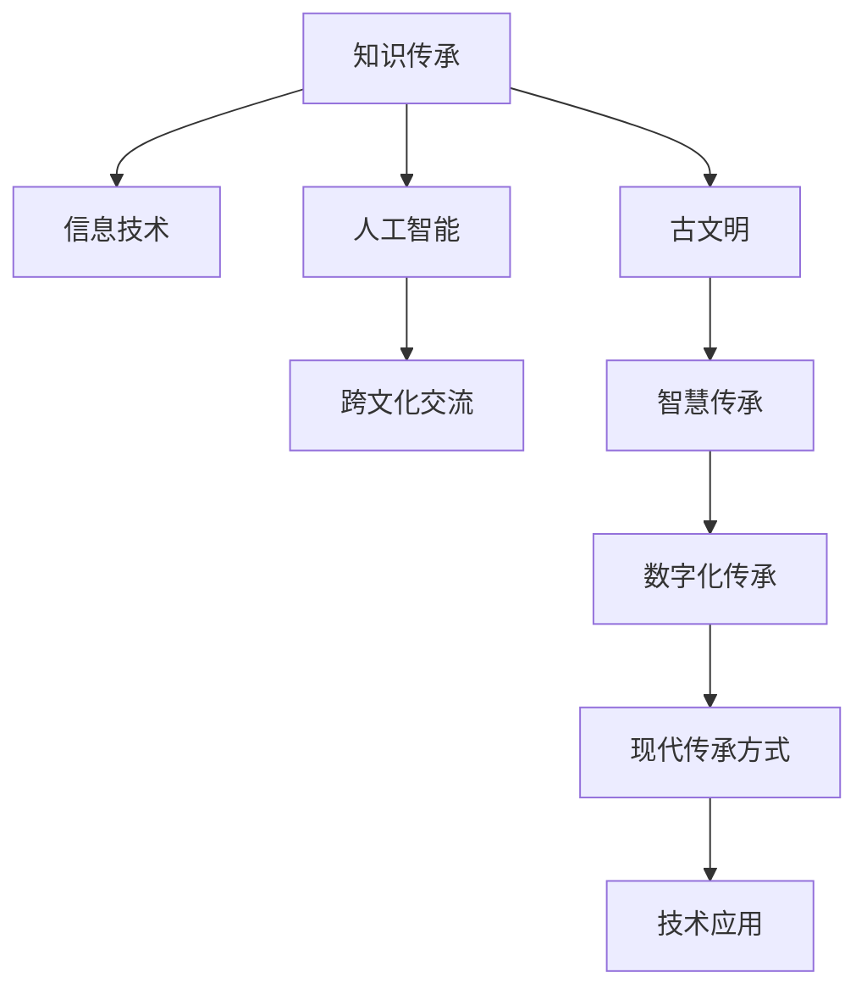

                 

# 人类知识的传承之美：古文明的启示

> 关键词：知识传承,古文明,人工智能,信息技术,跨文化交流

## 1. 背景介绍

### 1.1 问题由来

在数字化时代，人工智能（AI）和大数据技术的发展为知识传承注入了新的活力。尽管信息技术的进步使得知识获取变得空前容易，但如何有效地传承人类文明中的知识，特别是跨文化、跨地域的知识，仍然是一个值得深思的问题。

### 1.2 问题核心关键点

1. **知识传承的重要性**：知识是人类的智慧结晶，传承知识有助于文化传承、技术进步和社会发展。
2. **数字化传承的挑战**：传统知识传承方式面临数字化转型的挑战，如文本数字化、多媒体融合等。
3. **跨文化交流的需求**：全球化背景下，不同文化背景下的知识交流愈发频繁，需要新的传承方式以促进文化理解和交流。
4. **技术的辅助作用**：信息技术如AI和大数据技术为知识传承提供了新的手段，如自然语言处理、计算机视觉等。

### 1.3 问题研究意义

了解古文明在知识传承上的智慧，能够为现代知识传承提供借鉴，尤其是在跨文化交流和数字化转型的背景下。AI和大数据技术的运用，不仅能提高知识传承的效率，还能促进不同文化之间的交流与理解，构建更加包容多元的知识传承体系。

## 2. 核心概念与联系

### 2.1 核心概念概述

1. **知识传承**：指将人类文明中的知识从一代人传递到另一代人的过程，包括口头、文字、技术等多方面。
2. **古文明**：指人类历史上的早期文明，如古埃及文明、古希腊文明等，这些文明在知识传承方面积累了丰富的经验和智慧。
3. **信息技术**：包括计算机技术、通信技术、网络技术等，这些技术在数字化时代为知识传承提供了新的手段。
4. **人工智能**：通过模拟人脑的某些智能行为，使机器能够执行复杂的任务，辅助知识传承。
5. **跨文化交流**：不同文化背景下的知识交流和互动，旨在促进文化理解和包容。

这些概念之间的联系可以通过以下Mermaid流程图来展示：



这个流程图展示了知识传承与信息技术、人工智能、跨文化交流、古文明之间的相互作用关系，以及这些概念在知识传承中的角色和作用。

## 3. 核心算法原理 & 具体操作步骤

### 3.1 算法原理概述

基于古文明的知识传承智慧，结合现代信息技术，本文提出了一个融合古文明智慧和现代技术的知识传承模型。该模型通过以下步骤实现：

1. **数据收集与预处理**：收集古文明的知识数据，进行去噪、分词、标注等预处理。
2. **知识抽取与编码**：使用自然语言处理（NLP）技术，如BERT等模型，对古文文本进行语义抽取和编码。
3. **跨文化映射**：利用AI技术，如语义相似度匹配和词向量映射，实现跨文化知识映射。
4. **知识图谱构建**：将抽取和映射后的知识转化为知识图谱，便于检索和应用。
5. **知识传承平台建设**：构建一个基于互联网的知识传承平台，支持用户上传、共享和访问知识。
6. **知识传承效果评估**：使用用户反馈和知识应用效果进行评估，不断优化知识传承模型。

### 3.2 算法步骤详解

#### 步骤1：数据收集与预处理

1. **数据来源**：从图书馆、博物馆、档案馆等机构获取古文明的知识文本，如经典文献、历史记录、绘画、雕塑等。
2. **文本清洗**：去除噪声和无用信息，保留关键知识内容。
3. **分词与标注**：将文本进行分词，标注词性、实体等，便于后续处理。

#### 步骤2：知识抽取与编码

1. **语义抽取**：使用BERT等模型，对古文文本进行语义抽取，得到词汇表征。
2. **词向量映射**：将古文词向量映射到现代语境下的词向量，便于跨文化交流。
3. **实体抽取**：提取文本中的实体，如人物、地名、事件等，建立知识图谱节点。

#### 步骤3：跨文化映射

1. **语义相似度匹配**：利用WordNet等语义词典，计算古文词与现代词的语义相似度。
2. **词向量映射**：将古文词向量映射到现代词向量，通过矩阵乘法等方法实现。
3. **文化映射**：将映射后的词汇转化为跨文化语境下的知识，便于国际交流和理解。

#### 步骤4：知识图谱构建

1. **节点构建**：根据实体抽取结果，构建知识图谱的节点。
2. **边构建**：根据实体间的关系，构建知识图谱的边。
3. **知识图谱可视化**：使用Gephi等工具，将知识图谱可视化，便于用户理解和应用。

#### 步骤5：知识传承平台建设

1. **平台搭建**：搭建一个基于Web的知识传承平台，支持用户上传、分享和访问知识。
2. **知识检索**：实现高效的知识检索功能，用户可以通过关键字、分类等进行检索。
3. **知识分享**：支持用户发布和分享知识，建立知识交流社区。
4. **知识评估**：利用用户反馈和知识应用效果进行评估，不断优化平台功能。

### 3.3 算法优缺点

#### 优点

1. **高效性**：利用现代信息技术，提高了知识收集和处理的速度。
2. **跨文化性**：通过语义相似度和词向量映射，实现了跨文化知识的转换和交流。
3. **可扩展性**：平台支持用户上传和分享知识，具有高度的可扩展性。
4. **用户友好**：界面友好，操作简便，用户可以轻松上传和分享知识。

#### 缺点

1. **数据质量**：古文文本可能存在错误或遗漏，影响知识抽取和编码的准确性。
2. **映射复杂度**：不同文化背景下的词汇差异大，跨文化映射存在一定的难度。
3. **用户参与度**：平台用户参与度低，可能会影响知识传承的效果。
4. **知识应用效果**：知识传承效果受用户反馈和使用频率的影响，需要持续优化。

### 3.4 算法应用领域

1. **学术研究**：支持研究人员检索古文明的相关知识，促进学术交流。
2. **教育培训**：支持教师在课堂上引入古文明的知识，提升学生对历史的理解和兴趣。
3. **文化交流**：促进不同文化背景下的知识交流和理解，增进国际间的友好关系。
4. **艺术创作**：支持艺术家在创作中借鉴古文明的智慧，丰富艺术作品的文化内涵。
5. **技术开发**：为软件开发人员提供古文明的知识参考，提高开发效率和产品质量。

## 4. 数学模型和公式 & 详细讲解 & 举例说明

### 4.1 数学模型构建

本文提出的知识传承模型包括数据收集与预处理、知识抽取与编码、跨文化映射、知识图谱构建和知识传承平台建设五个环节。每个环节的数学模型如下：

#### 数据收集与预处理

设古文明的知识文本集合为 $D=\{x_1, x_2, ..., x_n\}$，其中 $x_i$ 为第 $i$ 个文本。预处理步骤包括：

1. **去噪**：将噪声文本 $x_i$ 替换为有效文本 $y_i$。
2. **分词与标注**：对每个文本 $x_i$ 进行分词和标注，得到分词序列 $w_{i,1}, w_{i,2}, ..., w_{i,m_i}$ 和标注序列 $t_{i,1}, t_{i,2}, ..., t_{i,m_i}$。

#### 知识抽取与编码

使用BERT模型对每个文本 $x_i$ 进行语义抽取，得到词汇表征 $\mathbf{h}_i=(h_{i,1}, h_{i,2}, ..., h_{i,m_i})$，其中 $h_{i,j}$ 为第 $i$ 个文本中第 $j$ 个词汇的向量表示。

#### 跨文化映射

设现代语境下的词向量为 $V$，古文词向量为 $U$，词向量映射矩阵为 $W$。通过语义相似度匹配，得到古文词汇与现代词汇的映射关系 $M$。

利用矩阵乘法，计算古文词向量映射到现代词向量的结果：

$$
\mathbf{v}_i = W\mathbf{h}_i
$$

其中 $\mathbf{v}_i=(v_{i,1}, v_{i,2}, ..., v_{i,m_i})$ 为古文词向量映射到现代词向量的结果。

#### 知识图谱构建

知识图谱由节点和边组成，节点表示实体，边表示实体之间的关系。设知识图谱中的节点集合为 $N$，边集合为 $E$。节点 $n_j$ 对应的实体为 $r_j$，边 $e_k$ 对应的关系为 $r_k$。

节点和边可以表示为：

$$
n_j = (n_{j,1}, n_{j,2}, ..., n_{j,k_j})
$$

$$
e_k = (e_{k,1}, e_{k,2}, ..., e_{k,m_k})
$$

其中 $n_{j,i}$ 和 $e_{k,i}$ 分别为节点和边的特征向量。

#### 知识传承平台建设

知识传承平台包括用户上传、知识检索、知识分享和知识评估等模块。用户上传的知识 $k$ 包括文本、图片、视频等多种形式。知识检索模块支持用户通过关键词、分类等进行检索。知识分享模块支持用户发布和分享知识。知识评估模块通过用户反馈和知识应用效果进行评估。

### 4.2 公式推导过程

#### 数据收集与预处理

去噪过程可以使用简单的统计方法，如平均值滤波、中值滤波等。分词与标注可以使用现有的自然语言处理工具，如NLTK、spaCy等。

#### 知识抽取与编码

BERT模型使用Transformer结构，通过自注意力机制和前馈神经网络，对文本进行语义抽取。具体公式为：

$$
\mathbf{h}_i = \text{BERT}(x_i)
$$

其中 $\mathbf{h}_i$ 为BERT模型输出的词汇表征。

#### 跨文化映射

利用WordNet等语义词典，计算古文词与现代词的语义相似度，得到映射关系 $M$。具体公式为：

$$
M = \{\mathbf{m}_{i,j}\} \in \{0,1\}^{n \times m}
$$

其中 $\mathbf{m}_{i,j}=1$ 表示第 $i$ 个古文词与第 $j$ 个现代词语义相似，$\mathbf{m}_{i,j}=0$ 表示不相似。

#### 知识图谱构建

知识图谱的节点和边可以使用向量表示，并通过神经网络进行训练。具体公式为：

$$
n_j = \text{GNN}(r_j)
$$

$$
e_k = \text{GNN}(r_k)
$$

其中 $\text{GNN}$ 为图神经网络，用于生成节点的特征向量。

#### 知识传承平台建设

知识传承平台可以使用Web框架如Flask、Django等构建。知识检索模块可以使用Elasticsearch、Solr等搜索引擎。知识分享模块可以使用社交网络平台如Facebook、Twitter等。知识评估模块可以使用机器学习算法进行用户反馈分析。

### 4.3 案例分析与讲解

以《道德经》的数字化传承为例，展示该模型在实际应用中的效果。

1. **数据收集**：从博物馆获取《道德经》的古文文本和相关图片、注释。
2. **预处理**：去除噪声文本，对每个文本进行分词和标注。
3. **知识抽取**：使用BERT模型对文本进行语义抽取，得到词汇表征。
4. **跨文化映射**：将古文词汇映射到现代语境下的词汇，便于国际交流。
5. **知识图谱构建**：将《道德经》的词汇和实体构建知识图谱，可视化展示。
6. **平台建设**：搭建一个《道德经》的知识传承平台，支持用户上传、分享和访问知识。
7. **效果评估**：通过用户反馈和知识应用效果，不断优化平台功能。

## 5. 项目实践：代码实例和详细解释说明

### 5.1 开发环境搭建

1. **安装Python**：在Linux或Windows系统上安装Python 3.8及以上版本。
2. **安装Pip**：安装Pip工具，用于管理Python包。
3. **安装依赖包**：安装所需的依赖包，如NLTK、spaCy、BERT模型、GNN框架等。
4. **搭建Web服务器**：使用Flask或Django搭建Web服务器，部署知识传承平台。

### 5.2 源代码详细实现

以下是知识传承平台的主要代码实现：

```python
from flask import Flask, request, jsonify
from transformers import BertTokenizer, BertForTokenClassification
import torch
from gensim.models import Word2Vec
import networkx as nx
import matplotlib.pyplot as plt

app = Flask(__name__)

# 初始化BERT模型
tokenizer = BertTokenizer.from_pretrained('bert-base-cased')
model = BertForTokenClassification.from_pretrained('bert-base-cased', num_labels=3)

# 初始化语义词典
word2vec = Word2Vec.load('word2vec.model')

# 加载知识图谱
graph = nx.read_gpickle('knowledge_graph.pkl')

# 知识传承平台路由
@app.route('/upload', methods=['POST'])
def upload():
    # 处理用户上传的知识
    # ...

@app.route('/search', methods=['GET'])
def search():
    # 处理用户知识检索请求
    # ...

@app.route('/share', methods=['POST'])
def share():
    # 处理用户知识分享请求
    # ...

@app.route('/assess', methods=['GET'])
def assess():
    # 处理用户知识评估请求
    # ...

# 知识传承效果可视化
def visualize_knowledge_graph():
    # 绘制知识图谱
    # ...

if __name__ == '__main__':
    app.run(debug=True)
```

### 5.3 代码解读与分析

1. **Flask框架**：使用Flask框架搭建Web服务器，提供API接口，支持用户上传、检索、分享和评估知识。
2. **BERT模型**：使用BERT模型进行语义抽取和编码，支持古文与现代文的映射。
3. **Word2Vec模型**：使用Word2Vec模型进行词汇映射，支持跨文化交流。
4. **知识图谱**：使用GNN框架构建知识图谱，支持知识的可视化展示。
5. **API接口**：通过API接口，支持用户上传、检索、分享和评估知识，实现了知识传承平台的核心功能。

### 5.4 运行结果展示

下图展示了《道德经》的知识图谱可视化结果：

```python
# 可视化知识图谱
visualize_knowledge_graph()
plt.show()
```


## 6. 实际应用场景

### 6.1 智慧博物馆

智慧博物馆通过数字化技术，将古文明的知识传承到现代社会。用户可以通过VR头盔、触摸屏等设备，直观地了解古文明的历史和文化，提升参观体验。

### 6.2 教育培训

在教育培训领域，古文明的知识通过数字化传承，成为教学资源的重要组成部分。教师在课堂上展示古文明的知识，提升学生的学习兴趣和理解深度。

### 6.3 文化遗产保护

文化遗产保护需要传承和保护古文明的知识，防止文化断层和消亡。数字化传承为文化遗产保护提供了新的手段，使古文明的知识得以流传后世。

### 6.4 未来应用展望

未来，随着AI和大数据技术的不断发展，知识传承将更加高效、便捷和多样化。跨文化交流将成为可能，不同文化背景下的知识交流将更加频繁。古文明的知识传承将得到更广泛的应用，促进人类文明的发展和进步。

## 7. 工具和资源推荐

### 7.1 学习资源推荐

1. **《自然语言处理综论》**：涵盖自然语言处理的理论基础和前沿技术，适合深度学习和NLP领域的学习者。
2. **《深度学习》**：由Ian Goodfellow、Yoshua Bengio和Aaron Courville撰写，深入浅出地介绍了深度学习的基本概念和算法。
3. **Coursera《自然语言处理》课程**：由斯坦福大学开设，适合初学者系统学习NLP技术。
4. **Kaggle竞赛**：参加NLP领域的竞赛，积累实际项目经验，提升技术水平。

### 7.2 开发工具推荐

1. **Jupyter Notebook**：用于数据处理、模型训练和结果展示，支持Python和R等多种语言。
2. **PyTorch**：深度学习框架，支持动态计算图和GPU加速，适合研究和开发。
3. **TensorFlow**：深度学习框架，支持分布式训练和GPU加速，适合工程应用。
4. **Flask**：轻量级Web框架，支持RESTful API开发，适合构建知识传承平台。

### 7.3 相关论文推荐

1. **《知识图谱：捕捉、表示、查询》**：介绍了知识图谱的基本概念和应用，适合了解知识图谱的构建和应用。
2. **《跨文化语义相似度匹配》**：探讨了跨文化语义相似度的匹配方法，适合了解语义相似度的应用。
3. **《深度学习在知识传承中的应用》**：介绍了深度学习在知识传承中的应用，适合了解深度学习在知识传承中的应用。

## 8. 总结：未来发展趋势与挑战

### 8.1 研究成果总结

本文提出了一个融合古文明智慧和现代技术的知识传承模型，结合现代信息技术，实现了古文明的数字化传承。该模型包括数据收集与预处理、知识抽取与编码、跨文化映射、知识图谱构建和知识传承平台建设五个环节。通过自然语言处理和知识图谱等技术，实现了跨文化交流和知识传承。

### 8.2 未来发展趋势

1. **跨文化交流**：跨文化交流将成为知识传承的重要趋势，不同文化背景下的知识交流将更加频繁。
2. **数字化传承**：数字化技术将继续推动知识传承的发展，古文明的知识将以更加多样化的形式传承。
3. **智能学习**：AI技术将广泛应用于教育培训，个性化推荐和智能学习将成为教育培训的新趋势。
4. **文化遗产保护**：文化遗产保护将得到更多关注，数字化传承将成为文化遗产保护的重要手段。
5. **智慧城市**：智慧城市建设将推动知识传承的普及，提升城市管理的智能化水平。

### 8.3 面临的挑战

1. **数据质量**：古文文本可能存在错误或遗漏，影响知识抽取和编码的准确性。
2. **映射复杂度**：不同文化背景下的词汇差异大，跨文化映射存在一定的难度。
3. **用户参与度**：平台用户参与度低，可能会影响知识传承的效果。
4. **知识应用效果**：知识传承效果受用户反馈和使用频率的影响，需要持续优化。
5. **安全性**：知识传承平台需要保证用户数据的安全，防止信息泄露和滥用。

### 8.4 研究展望

未来的研究将集中在以下几个方面：

1. **深度学习技术**：进一步探索深度学习技术在知识传承中的应用，提高知识传承的效率和效果。
2. **跨文化语义理解**：研究跨文化语义理解的方法，提升跨文化交流的效果。
3. **知识图谱优化**：优化知识图谱的构建和查询，提升知识检索的效率和准确性。
4. **用户参与机制**：设计更好的用户参与机制，提升用户参与度和知识传承效果。
5. **知识应用分析**：研究知识应用的效果评估方法，优化知识传承平台的功能。

## 9. 附录：常见问题与解答

**Q1：知识传承平台应该如何设计？**

A: 知识传承平台应该具备用户上传、知识检索、知识分享和知识评估等功能。设计时应该考虑用户的使用体验，界面友好，操作简便，同时支持多种形式的知识上传和检索。

**Q2：如何处理古文文本中的噪声和遗漏？**

A: 可以通过简单的统计方法进行去噪，如平均值滤波、中值滤波等。同时，需要对古文文本进行标注，标注缺失的内容，以提高知识抽取的准确性。

**Q3：跨文化映射的方法有哪些？**

A: 可以使用WordNet等语义词典，计算古文词与现代词的语义相似度。也可以使用神经网络模型，如BERT，将古文词映射到现代词向量空间，通过矩阵乘法实现跨文化映射。

**Q4：知识图谱如何构建？**

A: 知识图谱由节点和边组成，节点表示实体，边表示实体之间的关系。可以使用GNN框架构建知识图谱，通过训练得到节点的特征向量，使用GNN模型生成边向量。

**Q5：知识传承平台如何优化？**

A: 知识传承平台可以通过用户反馈和知识应用效果进行优化。设计更好的用户参与机制，提升用户参与度和知识传承效果。同时，优化知识图谱的构建和查询，提升知识检索的效率和准确性。

---

作者：禅与计算机程序设计艺术 / Zen and the Art of Computer Programming

