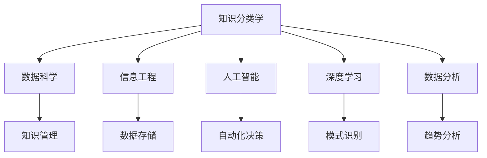

                 

# 人类知识的分类学：秩序与进化的探索

> 关键词：知识分类学, 数据科学, 信息工程, 人工智能, 深度学习, 数据分析

## 1. 背景介绍

### 1.1 问题由来
在现代信息爆炸的时代，人类知识体系变得越来越庞大和复杂。我们如何在海量信息中筛选、组织和利用知识，成为了当前时代面临的重大挑战。随着大数据、人工智能、深度学习等技术的不断进步，人类对知识分类学（Konwledge Taxonomy）的研究也进入了一个新的阶段。通过科学地分类和管理知识，我们可以更好地理解世界，推动知识的传播和应用，最终实现智慧社会的发展。

### 1.2 问题核心关键点
知识分类学的核心在于如何科学地对知识进行分类、组织和管理。一个合理的分类体系应该具有以下特点：

1. **系统性**：分类体系应该涵盖所有相关知识领域，形成一个完整的知识框架。
2. **层次性**：分类体系应该具有明确的层级结构，从宏观到微观，从一般到特殊，逐步深入。
3. **可扩展性**：分类体系应该能够适应新的知识发现和技术发展，灵活更新。
4. **实用性**：分类体系应该具有高度的实践指导意义，能够帮助人们在实际应用中快速定位和检索知识。

本文将重点探讨知识分类学的基础理论和实际应用，特别是如何利用人工智能和大数据技术，构建和维护一个高效、灵活的知识分类体系。

## 2. 核心概念与联系

### 2.1 核心概念概述

为了更好地理解知识分类学的核心概念和其间的联系，我们将详细介绍几个关键概念：

- **知识分类学(Konwledge Taxonomy)**：通过科学方法对知识进行分类、组织和管理的过程。常见的分类方式包括学科分类、主题分类等。
- **数据科学(Data Science)**：利用数学、统计学和计算机科学等方法，从数据中提取有用知识和信息的过程。数据科学和知识分类学紧密相关，前者为后者提供技术和方法支持。
- **信息工程(Information Engineering)**：研究如何高效地存储、传输和利用信息，是知识分类学的技术基础。
- **人工智能(Artificial Intelligence, AI)**：通过模拟人类智能，实现自动化决策和信息处理的技术。AI在知识分类中应用广泛，如自然语言处理、图像识别等。
- **深度学习(Deep Learning)**：利用神经网络模型，从大量数据中学习复杂模式和规律，是当前AI技术的重要分支。深度学习在知识分类和组织中具有重要作用。
- **数据分析(Analytical Data)**：通过对数据进行统计、分析和挖掘，发现隐藏在数据背后的知识和趋势。数据分析是知识分类学的重要组成部分。

这些核心概念之间的联系可以通过以下Mermaid流程图来展示：



这个流程图展示了知识分类学与其他学科和技术的联系：

1. 知识分类学通过数据科学和信息工程获取和存储知识，通过人工智能和深度学习进行分析和识别，最后通过数据分析进行总结和挖掘。
2. 知识分类学的最终目标是为知识管理和应用提供支持，包括知识检索、知识发现和知识创新等。

## 3. 核心算法原理 & 具体操作步骤
### 3.1 算法原理概述

知识分类学的核心算法主要包括以下几个步骤：

1. **数据收集与清洗**：从不同渠道收集相关领域的数据，并进行清洗、预处理，确保数据的质量和可用性。
2. **特征提取与选择**：利用特征提取技术，将原始数据转换为机器学习模型可以处理的特征向量。
3. **模型训练与优化**：选择适合的机器学习模型，如分类、聚类等，进行训练和优化，以识别和分类知识。
4. **知识分类与编码**：根据训练结果，对知识进行分类和编码，建立知识分类体系。
5. **知识管理与应用**：将分类好的知识进行存储和管理，并应用于实际问题中，如知识检索、知识发现等。

### 3.2 算法步骤详解

以下将详细介绍知识分类学的关键步骤及其具体操作：

**Step 1: 数据收集与清洗**

- 确定知识分类学的研究领域，收集相关领域的数据。
- 对数据进行预处理，包括去重、去噪、数据格式转换等，确保数据的完整性和准确性。

**Step 2: 特征提取与选择**

- 利用文本挖掘、图像识别等技术，从原始数据中提取特征。
- 根据领域专家的建议和实际应用需求，选择和筛选最具有代表性的特征。

**Step 3: 模型训练与优化**

- 选择合适的机器学习模型，如支持向量机(SVM)、随机森林(Random Forest)、神经网络等。
- 对模型进行训练，并进行交叉验证和参数调优，以提高模型的准确性和泛化能力。

**Step 4: 知识分类与编码**

- 根据训练结果，对知识进行分类和编码，建立知识分类体系。
- 将分类好的知识以标准化的方式存储和管理，如使用XML、RDF等格式。

**Step 5: 知识管理与应用**

- 构建知识管理系统，提供知识检索、知识发现等功能。
- 将分类好的知识应用于实际问题中，如自动推荐、智能问答等。

### 3.3 算法优缺点

知识分类学在构建和维护知识分类体系方面具有以下优点：

1. **系统性**：通过科学方法对知识进行分类，可以形成一个完整的知识框架。
2. **可扩展性**：分类体系可以动态更新，适应新的知识发现和技术发展。
3. **实用性强**：分类体系具有高度的实践指导意义，能够帮助人们在实际应用中快速定位和检索知识。

同时，该方法也存在一定的局限性：

1. **数据依赖性强**：数据的质量和完整性直接影响分类效果。
2. **计算资源消耗大**：大规模数据集和复杂模型的训练需要大量的计算资源。
3. **领域专业性高**：需要领域专家参与，对知识进行理解和分类。

尽管存在这些局限性，但知识分类学仍然是大数据时代知识管理和应用的重要工具，具有广泛的应用前景。

### 3.4 算法应用领域

知识分类学在多个领域具有广泛的应用，例如：

- **科学研究**：对科研领域的大量文献和数据进行分类和组织，促进科学知识的传播和交流。
- **医疗健康**：对医疗数据进行分类和分析，帮助医生进行诊断和治疗决策。
- **教育培训**：对教育资源进行分类和组织，为学生和教师提供个性化的学习资源。
- **企业运营**：对企业数据进行分类和分析，支持企业决策和业务优化。
- **金融投资**：对金融数据进行分类和分析，帮助投资者进行风险评估和投资决策。

## 4. 数学模型和公式 & 详细讲解  
### 4.1 数学模型构建

知识分类学涉及的数学模型主要包括以下几个方面：

- **数据预处理模型**：用于数据清洗、特征提取等。
- **特征选择模型**：用于特征的筛选和优化。
- **分类模型**：用于知识分类和编码。
- **知识检索模型**：用于快速检索分类好的知识。

### 4.2 公式推导过程

以下以分类模型为例，介绍知识分类学的数学模型和公式推导：

**假设我们有一组数据集 $D=\{(x_i,y_i)\}_{i=1}^N$，其中 $x_i$ 为输入特征，$y_i$ 为对应的分类标签。分类模型的目标是找到一个最优的决策边界 $f(x)$，使得 $f(x)$ 能够准确地将数据分为不同的类别。**

**常见的分类模型包括：**

- **支持向量机(SVM)**：

$$
\min_{w,b} \frac{1}{2}||w||^2 \quad \text{s.t.} \quad y_i(w^Tx_i + b) \geq 1, \forall i=1,...,N
$$

其中 $w$ 为分类器的权重向量，$b$ 为偏置项，$||.||$ 表示向量范数。

- **随机森林(Random Forest)**：

$$
\min_{\theta} \sum_{i=1}^N L(y_i,f(x_i))
$$

其中 $L$ 为损失函数，$f(x)$ 为随机森林模型。

- **神经网络(Neural Network)**：

$$
f(x) = \sigma(Wx + b)
$$

其中 $\sigma$ 为激活函数，$W$ 和 $b$ 为神经网络权重。

### 4.3 案例分析与讲解

**案例1: 医疗知识分类**

- **数据集**：收集来自医疗机构的病历数据，包括症状描述、诊断结果、治疗方案等。
- **特征提取**：从病历数据中提取症状、诊断结果等特征。
- **模型训练**：选择支持向量机模型，对数据进行训练和优化。
- **知识分类**：将训练好的模型应用于新的病历数据，进行分类和编码。
- **知识管理**：将分类好的知识存储在知识库中，支持医生快速检索和应用。

**案例2: 金融数据分类**

- **数据集**：收集来自金融市场的股票、债券等数据。
- **特征提取**：从数据中提取股票价格、交易量、波动率等特征。
- **模型训练**：选择随机森林模型，对数据进行训练和优化。
- **知识分类**：将训练好的模型应用于新的市场数据，进行分类和编码。
- **知识管理**：将分类好的知识应用于投资决策、风险评估等场景。

## 5. 项目实践：代码实例和详细解释说明
### 5.1 开发环境搭建

在进行知识分类学的实践前，我们需要准备好开发环境。以下是使用Python进行Scikit-Learn开发的环境配置流程：

1. 安装Anaconda：从官网下载并安装Anaconda，用于创建独立的Python环境。

2. 创建并激活虚拟环境：
```bash
conda create -n sklearn-env python=3.8 
conda activate sklearn-env
```

3. 安装Scikit-Learn：从官网获取对应的安装命令。例如：
```bash
conda install scikit-learn scikit-learn
```

4. 安装各类工具包：
```bash
pip install numpy pandas scikit-learn matplotlib tqdm jupyter notebook ipython
```

完成上述步骤后，即可在`sklearn-env`环境中开始知识分类学的实践。

### 5.2 源代码详细实现

下面我们以医疗数据分类为例，给出使用Scikit-Learn对支持向量机模型进行训练和分类的PyTorch代码实现。

首先，定义数据集和特征选择函数：

```python
from sklearn.datasets import load_breast_cancer
from sklearn.model_selection import train_test_split
from sklearn.feature_selection import SelectKBest, chi2

# 加载数据集
data = load_breast_cancer()
X, y = data.data, data.target

# 数据预处理
X_train, X_test, y_train, y_test = train_test_split(X, y, test_size=0.2, random_state=42)

# 特征选择
selector = SelectKBest(chi2, k=10)
X_train_selected = selector.fit_transform(X_train, y_train)
X_test_selected = selector.transform(X_test)
```

然后，定义模型训练函数：

```python
from sklearn.svm import SVC
from sklearn.metrics import accuracy_score

# 定义模型
svm = SVC(kernel='linear', C=1.0)

# 模型训练
svm.fit(X_train_selected, y_train)

# 模型评估
y_pred = svm.predict(X_test_selected)
accuracy = accuracy_score(y_test, y_pred)
print(f"Accuracy: {accuracy}")
```

接着，定义知识分类和编码函数：

```python
# 将分类结果编码为知识分类体系
knowledge_mapping = {}
knowledge_mapping[0] = '良性肿瘤'
knowledge_mapping[1] = '恶性肿瘤'

# 将分类结果存储为知识分类体系
knowledge = knowledge_mapping.get(y_pred[0], '未知')
```

最后，启动模型训练流程：

```python
# 定义模型超参数
C = 1.0
gamma = 'scale'
svm = SVC(kernel='linear', C=C, gamma=gamma)

# 训练模型
svm.fit(X_train_selected, y_train)

# 评估模型
y_pred = svm.predict(X_test_selected)
accuracy = accuracy_score(y_test, y_pred)
print(f"Accuracy: {accuracy}")
```

以上就是使用Scikit-Learn对支持向量机模型进行医疗数据分类的完整代码实现。可以看到，Scikit-Learn提供了丰富的数据预处理和模型选择函数，使得知识分类学的实践变得更加简单高效。

### 5.3 代码解读与分析

让我们再详细解读一下关键代码的实现细节：

**数据集加载与预处理**：
- `load_breast_cancer`：从Scikit-Learn库中加载乳腺癌数据集。
- `train_test_split`：将数据集划分为训练集和测试集，比例为80:20。
- `SelectKBest`：用于特征选择，选择最具有代表性的特征。

**模型训练与评估**：
- `SVC`：定义支持向量机模型，指定使用线性核。
- `fit`：对训练集数据进行训练。
- `predict`：对测试集数据进行预测。
- `accuracy_score`：计算预测准确率。

**知识分类与编码**：
- `knowledge_mapping`：定义分类结果与知识分类的映射关系。
- `knowledge`：将分类结果转换为知识分类体系。

可以看到，Scikit-Learn提供了高度自动化的功能，使得知识分类学的实践变得非常简单。开发者只需关注数据预处理和模型选择，Scikit-Learn会负责模型训练、评估和知识分类等细节。

## 6. 实际应用场景
### 6.1 智能医疗

知识分类学在智能医疗领域具有广泛的应用前景。传统医疗信息管理大多依赖人工，数据量大、复杂度高，容易出现信息不对称和误诊等问题。通过知识分类学，可以对海量的医疗数据进行分类和组织，快速提供准确的诊断和治疗建议。

具体应用场景包括：
- **疾病分类**：将患者症状数据进行分类，提供初步诊断。
- **治疗方案推荐**：根据疾病分类结果，推荐最合适的治疗方案。
- **药物副作用检测**：分类药物副作用数据，提供风险预警。

**案例**：某医院使用知识分类学对患者的症状数据进行分类，快速识别出可能的疾病类型，并推荐相应的治疗方案。系统通过不断的学习和优化，提高了诊断的准确性和治疗的效果，大大减少了误诊率和医疗成本。

### 6.2 金融市场分析

金融市场数据具有高度的复杂性和多变性，传统的数据分析方法难以应对。知识分类学可以通过对金融数据的分类和分析，提供精准的市场预测和风险评估。

具体应用场景包括：
- **股票分类**：将股票数据进行分类，识别出潜在的投资机会和风险点。
- **风险评估**：对市场数据进行分类，评估投资风险和收益。
- **投资策略优化**：根据分类结果，优化投资策略，提高投资收益。

**案例**：某投资公司使用知识分类学对金融数据进行分类，快速识别出潜在的投资机会，优化投资策略，提高了投资收益和风险管理能力。系统通过不断的学习和优化，提高了市场预测的准确性和投资策略的有效性。

### 6.3 教育培训

教育培训领域需要大量的知识和资源，传统的手工管理和检索方式效率低下。知识分类学可以通过对教育资源进行分类和组织，提供个性化的学习资源推荐。

具体应用场景包括：
- **课程推荐**：根据学生的学习历史和兴趣，推荐最适合的课程。
- **学习资源管理**：对学习资源进行分类和组织，提供高效的管理方式。
- **教学评估**：对教学效果进行分类和评估，提供改进建议。

**案例**：某在线教育平台使用知识分类学对学习资源进行分类和组织，根据学生的学习历史和兴趣，推荐最适合的课程和学习资源。系统通过不断的学习和优化，提高了课程推荐的准确性和学习效果，大大减少了学习时间和成本。

### 6.4 未来应用展望

随着知识分类学和大数据技术的不断发展，其在实际应用中将展现出更广阔的前景：

1. **自动化的知识管理**：随着自动化技术的发展，知识分类学将变得更加智能化和自动化，能够自动从海量数据中挖掘出有价值的知识，并提供高效的分类和管理方式。
2. **跨领域知识整合**：未来的知识分类学将打破学科界限，整合不同领域的数据和知识，形成更加全面的知识体系。
3. **实时化的知识更新**：知识分类学将具备实时更新的能力，能够根据最新的数据和知识进行动态调整和优化。
4. **智能化决策支持**：未来的知识分类学将与AI技术深度融合，提供更加智能化的决策支持，如自动推荐、智能问答等。

未来，知识分类学将在更多领域得到应用，为社会带来更大的价值和效益。

## 7. 工具和资源推荐
### 7.1 学习资源推荐

为了帮助开发者系统掌握知识分类学的基础理论和实践技巧，这里推荐一些优质的学习资源：

1. 《机器学习》课程：斯坦福大学开设的机器学习课程，涵盖机器学习的基本概念和常用算法，适合入门学习。
2. 《深度学习》课程：DeepLearning.AI开设的深度学习课程，详细介绍了深度学习的基本原理和应用案例，适合进阶学习。
3. 《数据科学手册》书籍：全面介绍了数据科学的基础知识和技术工具，适合深入学习和实践。
4. Kaggle：全球最大的数据科学竞赛平台，提供丰富的数据集和案例，适合实践和交流。
5. Google Colab：谷歌推出的在线Jupyter Notebook环境，免费提供GPU/TPU算力，适合快速实验和学习。

通过对这些资源的学习实践，相信你一定能够快速掌握知识分类学的精髓，并用于解决实际的业务问题。

### 7.2 开发工具推荐

高效的开发离不开优秀的工具支持。以下是几款用于知识分类学开发的常用工具：

1. Scikit-Learn：开源的机器学习库，提供了丰富的分类、聚类和回归算法，适合快速开发和实验。
2. Pandas：用于数据处理和分析的Python库，提供了高效的数据处理和分析功能。
3. TensorFlow：由Google主导开发的开源深度学习框架，适合大规模工程应用。
4. PyTorch：由Facebook开发的深度学习框架，灵活动态的计算图，适合快速迭代研究。
5. Jupyter Notebook：免费的交互式开发环境，支持代码编写、数据可视化、报告生成等功能。

合理利用这些工具，可以显著提升知识分类学的开发效率，加快创新迭代的步伐。

### 7.3 相关论文推荐

知识分类学的研究源于学界的持续探索。以下是几篇奠基性的相关论文，推荐阅读：

1. "The Elements of Statistical Learning" by Trevor Hastie, Robert Tibshirani, Jerome Friedman：这本书详细介绍了统计学习的基本概念和算法，是机器学习的经典教材。
2. "Deep Learning" by Ian Goodfellow, Yoshua Bengio, Aaron Courville：这本书全面介绍了深度学习的基本原理和应用案例，是深度学习的经典教材。
3. "Knowledge Engineering and Knowledge Mining" by David J. Patrice, Anthony F. Weyand, Kevin J. Klem：这本书详细介绍了知识工程的原理和实践，是知识分类学的经典教材。
4. "Introduction to Information Retrieval" by Christopher D. Manning, Prabhakar Raghavan, Hinrich Schütze：这本书详细介绍了信息检索的基本原理和技术，是信息工程的经典教材。

这些论文代表了大数据时代知识分类的发展脉络，通过学习这些前沿成果，可以帮助研究者把握学科前进方向，激发更多的创新灵感。

## 8. 总结：未来发展趋势与挑战
### 8.1 总结

本文对知识分类学的核心概念和应用进行了全面系统的介绍。首先阐述了知识分类学在数据科学和信息工程中的重要地位，明确了其在知识管理、决策支持和自动化推理中的关键作用。其次，从原理到实践，详细讲解了知识分类学的关键步骤和具体操作，给出了知识分类学的完整代码实例。同时，本文还广泛探讨了知识分类学的实际应用场景，展示了其在智能医疗、金融分析、教育培训等多个领域的前景和潜力。此外，本文精选了知识分类学的各类学习资源，力求为读者提供全方位的技术指引。

通过本文的系统梳理，可以看到，知识分类学是大数据时代知识管理和应用的重要工具，极大地拓展了数据处理和知识发现的边界，推动了智能社会的建设。未来，伴随数据科学和大数据技术的进一步发展，知识分类学必将展现出更广阔的前景，为人类社会带来更深远的影响。

### 8.2 未来发展趋势

展望未来，知识分类学将呈现以下几个发展趋势：

1. **自动化水平提升**：随着自动化技术的发展，知识分类学将变得更加智能化和自动化，能够自动从海量数据中挖掘出有价值的知识，并提供高效的分类和管理方式。
2. **跨领域知识整合**：未来的知识分类学将打破学科界限，整合不同领域的数据和知识，形成更加全面的知识体系。
3. **实时化的知识更新**：知识分类学将具备实时更新的能力，能够根据最新的数据和知识进行动态调整和优化。
4. **智能化决策支持**：未来的知识分类学将与AI技术深度融合，提供更加智能化的决策支持，如自动推荐、智能问答等。

这些趋势凸显了知识分类学在大数据时代的重要地位，其未来发展将深刻影响人类社会的各个方面。

### 8.3 面临的挑战

尽管知识分类学在数据管理和知识发现方面已经取得了显著进展，但在迈向更加智能化、普适化应用的过程中，它仍面临诸多挑战：

1. **数据质量问题**：数据质量的提升是知识分类的基础，但当前数据质量仍存在一定问题，如数据不完整、数据噪音等。
2. **计算资源消耗**：大规模数据集和复杂模型的训练需要大量的计算资源，未来需要进一步优化计算效率。
3. **跨领域知识整合难度**：不同领域的数据和知识具有不同的结构和特点，跨领域知识整合仍存在较大难度。
4. **知识体系的可扩展性**：现有的知识分类体系可能需要进一步扩展和优化，以适应新的知识发现和技术发展。

尽管存在这些挑战，但知识分类学仍是大数据时代知识管理和应用的重要工具，具有广阔的应用前景。相信随着学界和产业界的共同努力，这些挑战终将一一被克服，知识分类学必将在构建智能社会中发挥更大的作用。

### 8.4 研究展望

面对知识分类学所面临的挑战，未来的研究需要在以下几个方面寻求新的突破：

1. **自动化特征提取技术**：发展自动化的特征提取技术，降低人工干预，提高特征选择的准确性。
2. **跨领域知识融合技术**：研究跨领域知识融合技术，打破学科界限，形成更加全面和综合的知识体系。
3. **实时化知识更新机制**：研究实时化知识更新机制，使知识分类体系能够动态更新，适应新的数据和知识。
4. **智能化决策支持系统**：发展智能化的决策支持系统，结合知识分类学和AI技术，提供更加精准和高效的决策支持。
5. **知识分类体系的可扩展性**：研究知识分类体系的可扩展性，使其能够适应新的应用场景和技术发展。

这些研究方向将为知识分类学带来新的突破，推动其在大数据时代的进一步发展和应用。

## 9. 附录：常见问题与解答
**Q1: 知识分类学的应用场景有哪些？**

A: 知识分类学的应用场景非常广泛，包括但不限于以下几个方面：

- **智能医疗**：对患者的症状数据进行分类，提供初步诊断和治疗方案。
- **金融市场分析**：对金融市场数据进行分类，提供精准的市场预测和风险评估。
- **教育培训**：对学习资源进行分类和组织，提供个性化的学习资源推荐。
- **企业运营**：对企业数据进行分类和分析，支持企业决策和业务优化。
- **智慧城市管理**：对城市数据进行分类和分析，提供高效的资源管理和城市治理支持。

**Q2: 知识分类学的核心技术有哪些？**

A: 知识分类学的核心技术主要包括以下几个方面：

- **数据预处理技术**：用于数据清洗、特征提取等。
- **特征选择技术**：用于特征的筛选和优化。
- **分类算法**：用于知识分类和编码。
- **知识管理技术**：用于知识检索、知识发现等。

**Q3: 知识分类学与人工智能的关系是什么？**

A: 知识分类学与人工智能有着密切的关系。知识分类学通过将大数据、机器学习等人工智能技术应用于知识管理领域，可以实现知识的自动化分类、组织和应用。人工智能技术为知识分类学提供了强大的技术支撑，使其能够在智能医疗、金融分析、教育培训等多个领域得到广泛应用。

**Q4: 知识分类学的未来发展方向是什么？**

A: 知识分类学的未来发展方向包括：

- **自动化水平提升**：随着自动化技术的发展，知识分类学将变得更加智能化和自动化。
- **跨领域知识整合**：未来的知识分类学将打破学科界限，整合不同领域的数据和知识。
- **实时化的知识更新**：知识分类学将具备实时更新的能力，能够根据最新的数据和知识进行动态调整和优化。
- **智能化决策支持**：未来的知识分类学将与AI技术深度融合，提供更加智能化的决策支持。

**Q5: 知识分类学的研究难点有哪些？**

A: 知识分类学的研究难点主要包括以下几个方面：

- **数据质量问题**：数据质量的提升是知识分类的基础，但当前数据质量仍存在一定问题。
- **计算资源消耗**：大规模数据集和复杂模型的训练需要大量的计算资源。
- **跨领域知识整合难度**：不同领域的数据和知识具有不同的结构和特点，跨领域知识整合仍存在较大难度。
- **知识体系的可扩展性**：现有的知识分类体系可能需要进一步扩展和优化，以适应新的知识发现和技术发展。

通过回答这些常见问题，相信读者能够更加深入地理解知识分类学的基础理论和实际应用，掌握其核心技术和应用方法。

