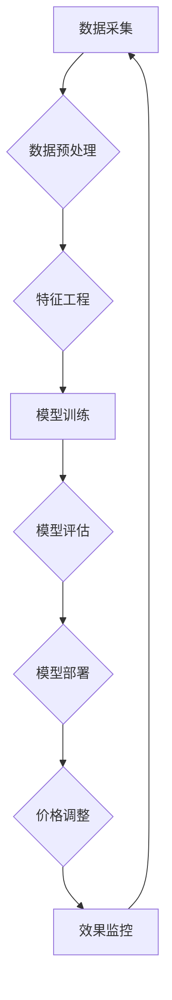

                 

## 电商平台中的AI智能定价策略优化

> 关键词：电商平台、智能定价、机器学习、预测模型、价格弹性、市场分析、优化算法

## 1. 背景介绍

在当今激烈的电商市场竞争中，定价策略是电商平台能否取得成功的重要因素之一。传统的定价方法往往依赖于经验和主观判断，难以适应市场变化的快速节奏和消费者需求的多样性。随着人工智能技术的快速发展，AI智能定价策略逐渐成为电商平台优化定价策略的热门方向。

AI智能定价策略利用机器学习算法和数据分析技术，从海量商品数据、市场趋势、消费者行为等多方面获取信息，并建立预测模型，从而实现动态调整商品价格，最大化平台利润和用户满意度。

## 2. 核心概念与联系

### 2.1 智能定价的核心概念

* **价格弹性:** 指商品价格变化对需求量变化的敏感度。价格弹性越大，需求量对价格变化的反应越敏感。
* **市场分析:** 通过收集和分析市场数据，如竞争对手价格、消费者偏好、季节性因素等，了解市场动态和趋势。
* **预测模型:** 利用机器学习算法，根据历史数据和市场分析结果，预测未来商品需求量和价格趋势。
* **优化算法:** 根据预测模型的结果，优化商品价格，最大化平台利润或用户满意度。

### 2.2 智能定价架构



**数据采集:** 从电商平台的销售数据、用户行为数据、市场数据等多个来源收集数据。

**数据预处理:** 对收集到的数据进行清洗、转换、整合等处理，使其适合模型训练。

**特征工程:** 从原始数据中提取有价值的特征，用于模型训练。

**模型训练:** 利用机器学习算法，训练预测模型，例如线性回归、决策树、神经网络等。

**模型评估:** 对训练好的模型进行评估，选择性能最好的模型。

**模型部署:** 将选定的模型部署到生产环境中，用于实时预测商品价格。

**价格调整:** 根据模型预测结果，动态调整商品价格。

**效果监控:** 持续监控模型的预测效果和价格调整的影响，并进行模型更新和优化。

## 3. 核心算法原理 & 具体操作步骤

### 3.1 算法原理概述

智能定价策略的核心算法通常基于机器学习，主要包括以下几种类型：

* **回归算法:** 用于预测商品价格，例如线性回归、逻辑回归、支持向量机等。
* **分类算法:** 用于分类商品，例如决策树、随机森林、神经网络等。
* **聚类算法:** 用于将商品进行分组，例如K-means聚类、层次聚类等。

### 3.2 算法步骤详解

1. **数据收集和预处理:** 收集电商平台的销售数据、用户行为数据、市场数据等，并进行清洗、转换、整合等预处理。
2. **特征工程:** 从原始数据中提取有价值的特征，例如商品属性、价格历史、用户评分、市场趋势等。
3. **模型选择和训练:** 根据具体业务需求选择合适的机器学习算法，并利用训练数据训练模型。
4. **模型评估和优化:** 对训练好的模型进行评估，选择性能最好的模型，并进行模型优化，例如调整超参数、增加训练数据等。
5. **模型部署和价格调整:** 将选定的模型部署到生产环境中，并根据模型预测结果，动态调整商品价格。
6. **效果监控和模型更新:** 持续监控模型的预测效果和价格调整的影响，并根据实际情况进行模型更新和优化。

### 3.3 算法优缺点

**优点:**

* **数据驱动:** 基于海量数据分析，能够更准确地预测商品需求和价格趋势。
* **动态调整:** 可以根据市场变化和用户行为实时调整商品价格，提高利润和用户满意度。
* **个性化推荐:** 可以根据用户的购买历史、浏览记录等信息，提供个性化的价格推荐。

**缺点:**

* **数据依赖:** 需要大量高质量的数据进行训练，否则模型预测效果会受到影响。
* **算法复杂:** 需要专业的机器学习知识和技术能力进行模型开发和维护。
* **解释性差:** 一些机器学习算法的决策过程难以解释，难以理解模型是如何得出预测结果的。

### 3.4 算法应用领域

* **电商平台:** 动态调整商品价格，提高利润和用户满意度。
* **旅游行业:** 根据市场需求和竞争对手价格，调整酒店和机票价格。
* **金融行业:** 根据风险评估和市场波动，调整贷款利率和投资收益率。
* **医疗行业:** 根据患者病情和治疗方案，调整医疗费用。

## 4. 数学模型和公式 & 详细讲解 & 举例说明

### 4.1 数学模型构建

智能定价策略通常采用以下数学模型进行预测：

* **线性回归模型:** 用于预测商品价格与其他因素之间的线性关系。

$$
P = \beta_0 + \beta_1 X_1 + \beta_2 X_2 + ... + \beta_n X_n + \epsilon
$$

其中:

* $P$ 是商品价格
* $X_1, X_2, ..., X_n$ 是影响商品价格的因素，例如商品属性、市场趋势、竞争对手价格等
* $\beta_0, \beta_1, ..., \beta_n$ 是模型参数
* $\epsilon$ 是误差项

* **决策树模型:** 用于根据商品属性和市场趋势，将商品分类到不同的价格区间。

### 4.2 公式推导过程

线性回归模型的 $\beta_0, \beta_1, ..., \beta_n$ 参数可以通过最小二乘法进行估计。最小二乘法旨在找到使得模型预测值与实际值之间的误差平方和最小的参数值。

### 4.3 案例分析与讲解

假设我们想要预测电商平台上某款商品的价格，并收集了以下数据:

* 商品属性: 品牌、类别、颜色、尺寸等
* 市场趋势: 竞争对手价格、季节性因素、促销活动等

我们可以使用线性回归模型来预测商品价格，并根据模型预测结果，动态调整商品价格。

## 5. 项目实践：代码实例和详细解释说明

### 5.1 开发环境搭建

* Python 3.x
* Jupyter Notebook
* scikit-learn

### 5.2 源代码详细实现

```python
import pandas as pd
from sklearn.linear_model import LinearRegression
from sklearn.model_selection import train_test_split

# 加载数据
data = pd.read_csv('product_data.csv')

# 特征工程
X = data[['brand', 'category', 'color', 'size', 'competitor_price', 'season', 'promotion']]
y = data['price']

# 数据分割
X_train, X_test, y_train, y_test = train_test_split(X, y, test_size=0.2, random_state=42)

# 模型训练
model = LinearRegression()
model.fit(X_train, y_train)

# 模型评估
y_pred = model.predict(X_test)
print('模型评估结果:', model.score(X_test, y_test))

# 价格调整
new_data = pd.DataFrame({
    'brand': ['A', 'B', 'C'],
    'category': ['电子产品', '服装', '食品'],
    'color': ['红色', '蓝色', '绿色'],
    'size': ['M', 'L', 'XL'],
    'competitor_price': [100, 200, 300],
    'season': ['春季', '夏季', '秋季'],
    'promotion': [True, False, True]
})
predicted_price = model.predict(new_data)
print('预测价格:', predicted_price)
```

### 5.3 代码解读与分析

* 首先，我们加载数据并进行特征工程，提取影响商品价格的因素。
* 然后，我们将数据分割成训练集和测试集，用于模型训练和评估。
* 我们使用线性回归模型进行训练，并评估模型的性能。
* 最后，我们使用训练好的模型预测新数据的商品价格。

### 5.4 运行结果展示

运行代码后，会输出模型评估结果和预测价格。

## 6. 实际应用场景

### 6.1 电商平台商品定价

* 根据商品属性、市场趋势、竞争对手价格等因素，动态调整商品价格，提高利润和用户满意度。
* 根据用户行为数据，提供个性化的价格推荐，提高转化率。

### 6.2 旅游行业酒店和机票定价

* 根据市场需求、季节性因素、竞争对手价格等因素，动态调整酒店和机票价格，提高收益。
* 根据用户预订时间、旅行目的地等信息，提供个性化的价格推荐，提高用户体验。

### 6.3 金融行业贷款利率和投资收益率

* 根据风险评估、市场波动、用户信用等因素，动态调整贷款利率和投资收益率，降低风险并提高收益。
* 根据用户投资需求、风险承受能力等信息，提供个性化的投资建议，帮助用户实现财富目标。

### 6.4 未来应用展望

随着人工智能技术的不断发展，AI智能定价策略将在更多领域得到应用，例如医疗、教育、制造业等。

## 7. 工具和资源推荐

### 7.1 学习资源推荐

* **书籍:**

* 《Python机器学习》
* 《机器学习实战》
* 《深度学习》

* **在线课程:**

* Coursera: 机器学习
* edX: 深度学习
* Udacity: 机器学习工程师

### 7.2 开发工具推荐

* **Python:** 强大的编程语言，广泛应用于机器学习领域。
* **scikit-learn:** Python机器学习库，提供各种机器学习算法和工具。
* **TensorFlow:** 开源深度学习框架，用于构建和训练深度神经网络。
* **PyTorch:** 开源深度学习框架，具有灵活性和易用性。

### 7.3 相关论文推荐

* **《基于深度学习的电商商品价格预测模型》**
* **《智能定价策略在电商平台中的应用研究》**
* **《机器学习在价格预测中的应用》**

## 8. 总结：未来发展趋势与挑战

### 8.1 研究成果总结

AI智能定价策略已经取得了显著的成果，能够有效提高电商平台的利润和用户满意度。

### 8.2 未来发展趋势

* **模型更加精准:** 利用更先进的机器学习算法和更丰富的训练数据，提高模型预测精度。
* **个性化推荐更加精准:** 利用用户行为数据和画像分析，提供更加个性化的价格推荐。
* **跨平台协同:** 将智能定价策略应用于多个平台，实现跨平台协同优化。

### 8.3 面临的挑战

* **数据质量:** 需要高质量的数据进行模型训练，否则模型预测效果会受到影响。
* **算法解释性:** 一些机器学习算法的决策过程难以解释，难以理解模型是如何得出预测结果的。
* **伦理问题:** 智能定价策略可能会导致价格歧视等伦理问题，需要谨慎考虑。

### 8.4 研究展望

未来，AI智能定价策略的研究将更加注重模型的解释性、公平性和可控性，并探索其在更多领域应用的可能性。

## 9. 附录：常见问题与解答

* **Q1: AI智能定价策略是否会取代人工定价？**

* **A1:** AI智能定价策略可以辅助人工定价，提高效率和准确性，但不会完全取代人工定价。人工定价仍然需要考虑一些无法用数据量化的因素，例如品牌形象、市场策略等。

* **Q2: AI智能定价策略是否会影响用户体验？**

* **A2:** 如果AI智能定价策略能够提供个性化的价格推荐，并确保价格合理，则可以提高用户体验。但如果价格调整过于频繁或不合理，则可能会影响用户体验。

* **Q3: 如何评估AI智能定价策略的有效性？**

* **A3:** 可以通过以下指标评估AI智能定价策略的有效性：
    * **利润增长:** AI智能定价策略是否能够提高平台利润。
    * **用户满意度:** AI智能定价策略是否能够提高用户满意度。
    * **转化率:** AI智能定价策略是否能够提高转化率。


作者：禅与计算机程序设计艺术 / Zen and the Art of Computer Programming 
<end_of_turn>

