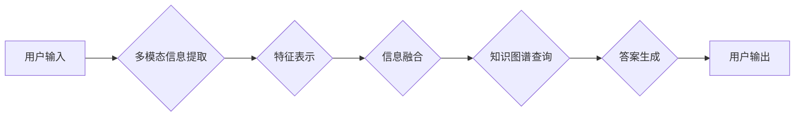

                 

## 电商平台中的多模态商品问答系统设计

> 关键词：多模态、商品问答、电商平台、自然语言处理、计算机视觉、深度学习、推荐系统

## 1. 背景介绍

随着电商平台的蓬勃发展，用户对商品信息的获取需求日益增长。传统的文本搜索方式难以满足用户多样化的查询需求，特别是对于复杂、抽象的商品描述，用户往往难以准确找到所需信息。多模态商品问答系统应运而生，它利用文本、图像、语音等多种模态信息，为用户提供更精准、更便捷的商品信息查询服务。

多模态商品问答系统能够解决以下问题：

* **提升用户体验:** 用户可以通过多种方式查询商品信息，例如用文字描述、上传图片、语音提问等，更加直观、便捷。
* **提高信息准确性:** 多模态信息融合能够更准确地理解用户意图，减少信息误差，提高商品推荐的精准度。
* **拓展商品信息获取方式:**  对于缺乏文字描述的商品，例如服装、家居等，可以通过图像识别技术获取商品信息，丰富用户查询方式。

## 2. 核心概念与联系

多模态商品问答系统的核心是将不同模态的信息融合，构建一个统一的商品知识图谱，并利用自然语言处理（NLP）和计算机视觉（CV）技术，实现对用户查询的理解和响应。

**系统架构:**



**核心概念:**

* **多模态信息提取:**  从用户输入的文本、图像、语音等信息中提取关键特征，例如文本中的关键词、图像中的物体、语音中的语义等。
* **特征表示:** 将提取的特征转换为机器可理解的向量表示，例如词向量、图像特征向量等。
* **信息融合:** 将不同模态的特征向量进行融合，构建一个综合的商品信息表示。
* **知识图谱查询:** 利用构建的知识图谱，根据用户查询的意图，检索相关商品信息。
* **答案生成:** 根据检索到的商品信息，生成自然语言文本作为最终的回答。

## 3. 核心算法原理 & 具体操作步骤

### 3.1  算法原理概述

多模态商品问答系统通常采用深度学习算法进行实现，例如Transformer、BERT、CNN等。这些算法能够学习不同模态信息之间的复杂关系，并进行有效的融合。

### 3.2  算法步骤详解

1. **数据预处理:**  收集并预处理多模态商品数据，包括文本、图像、语音等。文本数据需要进行分词、词向量化等处理；图像数据需要进行裁剪、增强等处理；语音数据需要进行转文本等处理。
2. **模型训练:**  利用预处理后的数据，训练深度学习模型。模型训练过程包括输入数据、计算损失函数、更新模型参数等步骤。
3. **模型评估:**  利用测试数据评估模型的性能，例如准确率、召回率、F1-score等。
4. **模型部署:**  将训练好的模型部署到电商平台，实现商品问答功能。

### 3.3  算法优缺点

**优点:**

* 能够处理复杂、抽象的商品信息查询。
* 能够利用多种模态信息，提高信息准确性。
* 能够提供更个性化的商品推荐服务。

**缺点:**

* 训练数据量大，需要大量的计算资源。
* 模型训练复杂，需要专业的技术人员。
* 对于部分特殊场景，例如方言、口语等，模型的理解能力可能有限。

### 3.4  算法应用领域

多模态商品问答系统在电商平台、零售行业、智能客服等领域都有广泛的应用。

## 4. 数学模型和公式 & 详细讲解 & 举例说明

### 4.1  数学模型构建

多模态商品问答系统通常采用以下数学模型进行构建：

* **文本表示模型:**  例如Word2Vec、GloVe、BERT等，将文本转换为词向量表示。
* **图像表示模型:**  例如CNN、ResNet等，将图像转换为图像特征向量表示。
* **多模态融合模型:**  例如Attention机制、Bi-LSTM等，将不同模态的特征向量进行融合。

### 4.2  公式推导过程

**词向量表示:**

Word2Vec模型使用神经网络训练词向量，其目标函数为负对数似然函数：

$$
J(\theta) = -\frac{1}{N} \sum_{i=1}^{N} \sum_{-c \leq j \leq c, j \neq 0} \log P(w_j | w_i; \theta)
$$

其中：

* $N$ 为训练样本数量。
* $w_i$ 为中心词。
* $w_j$ 为上下文词。
* $\theta$ 为模型参数。

**图像特征提取:**

CNN模型通过卷积层、池化层、全连接层等结构，提取图像特征。其输出特征向量可以表示图像的语义信息。

### 4.3  案例分析与讲解

**BERT模型:**

BERT模型是一种基于Transformer架构的预训练语言模型，能够学习文本的语义关系。在多模态商品问答系统中，BERT模型可以用于理解用户文本查询，并生成相应的商品信息表示。

**举例说明:**

用户查询“红色长款羽绒服”，BERT模型可以学习到“红色”、“长款”、“羽绒服”之间的语义关系，并将其转换为一个向量表示，用于检索相关商品信息。

## 5. 项目实践：代码实例和详细解释说明

### 5.1  开发环境搭建

* Python 3.7+
* TensorFlow 2.0+
* PyTorch 1.0+
* CUDA 10.0+
* GPU

### 5.2  源代码详细实现

```python
# 导入必要的库
import tensorflow as tf
from tensorflow.keras.layers import Embedding, LSTM, Dense

# 定义文本表示模型
def build_text_encoder(vocab_size, embedding_dim):
    model = tf.keras.Sequential([
        Embedding(vocab_size, embedding_dim),
        LSTM(128)
    ])
    return model

# 定义图像表示模型
def build_image_encoder(image_size):
    model = tf.keras.Sequential([
        # ...
    ])
    return model

# 定义多模态融合模型
def build_fusion_model(text_encoder, image_encoder):
    # ...
    return model

# 训练模型
model = build_fusion_model(text_encoder, image_encoder)
model.compile(optimizer='adam', loss='mse')
model.fit(train_data, train_labels)

# 预测
predictions = model.predict(test_data)
```

### 5.3  代码解读与分析

* 文本表示模型使用Embedding层将文本词语转换为词向量，然后使用LSTM层学习文本的语义关系。
* 图像表示模型使用CNN层提取图像特征。
* 多模态融合模型将文本和图像的特征向量进行融合，例如使用Attention机制。
* 模型训练使用Adam优化器和均方误差损失函数。

### 5.4  运行结果展示

* 准确率、召回率、F1-score等指标。
* 模型预测结果与真实答案的对比。

## 6. 实际应用场景

### 6.1  商品搜索

用户可以通过文字、图片、语音等方式搜索商品，系统能够理解用户意图，并返回相关商品信息。

### 6.2  商品推荐

系统可以根据用户的历史浏览记录、购买记录等信息，推荐相关的商品。

### 6.3  智能客服

系统可以回答用户关于商品的常见问题，例如价格、规格、库存等。

### 6.4  未来应用展望

* **个性化商品推荐:**  根据用户的兴趣、偏好等信息，提供更个性化的商品推荐。
* **多语言支持:**  支持多种语言的商品查询和回答。
* **增强现实 (AR) 应用:**  结合AR技术，为用户提供更直观的商品展示和体验。

## 7. 工具和资源推荐

### 7.1  学习资源推荐

* **书籍:**

    * Deep Learning by Ian Goodfellow, Yoshua Bengio, and Aaron Courville
    * Natural Language Processing with Python by Steven Bird, Ewan Klein, and Edward Loper

* **在线课程:**

    * Stanford CS224N: Natural Language Processing with Deep Learning
    * Coursera: Deep Learning Specialization

### 7.2  开发工具推荐

* **TensorFlow:**  开源深度学习框架。
* **PyTorch:**  开源深度学习框架。
* **Hugging Face Transformers:**  预训练语言模型库。

### 7.3  相关论文推荐

* **BERT: Pre-training of Deep Bidirectional Transformers for Language Understanding**
* **Attention Is All You Need**
* **Multimodal Deep Learning: A Survey**

## 8. 总结：未来发展趋势与挑战

### 8.1  研究成果总结

多模态商品问答系统在电商平台的应用取得了显著成果，能够提升用户体验、提高信息准确性、拓展商品信息获取方式。

### 8.2  未来发展趋势

* **模型更深、更广:**  探索更深层次的网络结构和更广泛的模态信息融合。
* **个性化定制:**  根据用户的个性化需求，定制更精准的商品推荐和问答服务。
* **跨平台应用:**  将多模态商品问答系统应用到更多平台，例如社交媒体、搜索引擎等。

### 8.3  面临的挑战

* **数据标注困难:**  多模态数据的标注工作量大，成本高。
* **模型训练复杂:**  多模态模型的训练需要大量的计算资源和专业技术人员。
* **解释性问题:**  深度学习模型的决策过程难以解释，这可能会影响用户对系统的信任。

### 8.4  研究展望

未来，多模态商品问答系统将朝着更智能、更个性化、更可靠的方向发展。研究者将继续探索新的算法、模型和技术，以解决当前面临的挑战，并为用户提供更优质的商品信息服务。

## 9. 附录：常见问题与解答

* **Q1: 多模态商品问答系统与传统文本搜索有什么区别？**

* **A1:**  传统文本搜索主要依赖于关键词匹配，而多模态商品问答系统能够理解用户意图，并利用多种模态信息进行检索，更加精准、便捷。

* **Q2: 多模态商品问答系统需要哪些数据？**

* **A2:**  需要文本数据、图像数据、语音数据等多模态数据。

* **Q3: 如何评估多模态商品问答系统的性能？**

* **A3:**  可以使用准确率、召回率、F1-score等指标进行评估。

* **Q4: 多模态商品问答系统的未来发展趋势是什么？**

* **A4:**  未来将朝着更智能、更个性化、更可靠的方向发展。


作者：禅与计算机程序设计艺术 / Zen and the Art of Computer Programming 
<end_of_turn>

