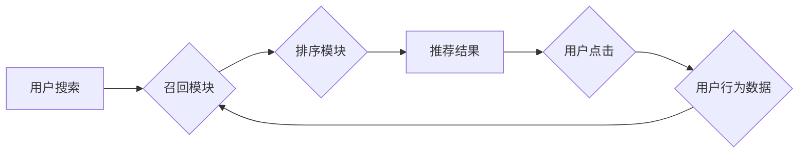

                 

## 电商平台的搜索推荐系统转型：AI 大模型是核心，用户体验是关键

> 关键词：电商平台、搜索推荐系统、AI 大模型、Transformer、用户体验、个性化推荐、点击率预估、召回排序

## 1. 背景介绍

在当今数字化时代，电商平台已成为人们购物的首选方式。搜索推荐系统作为电商平台的核心功能之一，直接影响着用户购物体验和平台商业成功。传统的搜索推荐系统主要依赖于基于规则的算法和特征工程，难以满足用户日益增长的个性化需求和平台数据规模的快速增长。

近年来，深度学习技术特别是 Transformer 模型的出现，为搜索推荐系统带来了革命性的变革。AI 大模型凭借其强大的学习能力和泛化能力，能够从海量数据中挖掘更深层的用户偏好和商品关联，从而提供更精准、更个性化的推荐结果。

## 2. 核心概念与联系

### 2.1 搜索推荐系统

搜索推荐系统旨在帮助用户快速找到所需商品，并根据用户的兴趣和行为推荐相关商品。它通常由以下几个模块组成：

* **搜索引擎:** 处理用户搜索词，并返回相关商品列表。
* **召回模块:** 从海量商品库中筛选出与用户搜索词相关的商品。
* **排序模块:** 根据商品的 relevance、popularity、用户行为等因素对商品进行排序，并返回给用户。
* **推荐模块:** 基于用户的历史行为、浏览记录、购买记录等数据，推荐与用户兴趣相关的商品。

### 2.2 AI 大模型

AI 大模型是指在海量数据上训练的深度学习模型，具有强大的泛化能力和学习能力。常见的 AI 大模型包括：

* **Transformer:** 是一种基于注意力机制的深度学习模型，在自然语言处理领域取得了突破性的进展。
* **BERT:** 基于 Transformer 的预训练语言模型，能够理解上下文信息，提高文本理解能力。
* **GPT:** 基于 Transformer 的文本生成模型，能够生成流畅、自然的文本。

### 2.3  架构图



## 3. 核心算法原理 & 具体操作步骤

### 3.1  算法原理概述

传统的搜索推荐系统主要依赖于基于规则的算法和特征工程，例如 TF-IDF、协同过滤等。这些算法通常需要人工设计特征，并根据业务规则进行规则化操作，难以适应海量数据和用户个性化的需求。

AI 大模型的引入，为搜索推荐系统带来了新的算法思路。例如，Transformer 模型能够学习用户搜索词和商品描述之间的语义关系，从而提高商品的 relevance 和推荐的精准度。

### 3.2  算法步骤详解

1. **数据预处理:** 将用户搜索词、商品描述、用户行为数据等进行清洗、转换和编码，以便模型训练。
2. **模型训练:** 使用 Transformer 模型或其他 AI 大模型，对预处理后的数据进行训练，学习用户偏好和商品关联的知识。
3. **模型评估:** 使用测试数据对模型进行评估，并根据评估结果进行模型调优。
4. **模型部署:** 将训练好的模型部署到线上环境，用于实时处理用户搜索请求和推荐商品。

### 3.3  算法优缺点

**优点:**

* 能够学习用户隐性需求，提供更精准的推荐。
* 适应海量数据和用户个性化的需求。
* 自动学习特征，减少人工特征工程。

**缺点:**

* 模型训练需要大量数据和计算资源。
* 模型解释性较差，难以理解模型的决策过程。
* 模型更新需要重新训练，成本较高。

### 3.4  算法应用领域

* **电商平台:** 商品推荐、搜索结果排序、个性化营销等。
* **社交媒体:** 内容推荐、用户匹配、广告投放等。
* **音乐平台:** 歌曲推荐、用户画像、音乐发现等。
* **视频平台:** 视频推荐、用户兴趣分析、内容创作等。

## 4. 数学模型和公式 & 详细讲解 & 举例说明

### 4.1  数学模型构建

Transformer 模型的核心是注意力机制，它能够学习用户搜索词和商品描述之间的语义关系。

**注意力机制公式:**

$$
Attention(Q, K, V) = \frac{exp(Q \cdot K^T / \sqrt{d_k})}{exp(Q \cdot K^T / \sqrt{d_k})} \cdot V
$$

其中：

* $Q$：查询向量
* $K$：键向量
* $V$：值向量
* $d_k$：键向量的维度

**解释:**

注意力机制通过计算查询向量和键向量的点积，并使用 softmax 函数进行归一化，得到每个键向量的权重。然后，将权重与值向量相乘，得到最终的注意力输出。

### 4.2  公式推导过程

注意力机制的公式推导过程比较复杂，涉及到线性变换、矩阵乘法、softmax 函数等操作。

**简要说明:**

1. 将查询向量 $Q$ 和键向量 $K$ 进行线性变换，得到查询矩阵 $Q'$ 和键矩阵 $K'$.
2. 计算查询矩阵 $Q'$ 和键矩阵 $K'$ 的点积，得到一个得分矩阵 $S$.
3. 对得分矩阵 $S$ 进行 softmax 操作，得到每个键向量的权重向量 $A$.
4. 将权重向量 $A$ 与值向量 $V$ 相乘，得到最终的注意力输出 $O$.

### 4.3  案例分析与讲解

假设用户搜索词为 "篮球鞋"，商品描述为 "耐克篮球鞋，性能出色，舒适耐穿"。

使用注意力机制，模型可以学习到 "篮球鞋" 和 "耐克篮球鞋" 之间的语义关系，并根据用户搜索词和商品描述的语义相似度，对商品进行排序和推荐。

## 5. 项目实践：代码实例和详细解释说明

### 5.1  开发环境搭建

* Python 3.7+
* TensorFlow 2.0+
* PyTorch 1.0+
* CUDA 10.0+

### 5.2  源代码详细实现

```python
# 导入必要的库
import tensorflow as tf

# 定义 Transformer 模型
class Transformer(tf.keras.Model):
    def __init__(self, vocab_size, embedding_dim, num_heads, num_layers):
        super(Transformer, self).__init__()
        self.embedding = tf.keras.layers.Embedding(vocab_size, embedding_dim)
        self.transformer_layers = tf.keras.layers.StackedRNNCells([
            tf.keras.layers.MultiHeadAttention(num_heads=num_heads, key_dim=embedding_dim)
            for _ in range(num_layers)
        ])

    def call(self, inputs):
        # 将输入词嵌入到向量空间
        embedded_inputs = self.embedding(inputs)
        # 使用 Transformer 层进行编码
        encoded_outputs = self.transformer_layers(embedded_inputs)
        return encoded_outputs

# 实例化 Transformer 模型
model = Transformer(vocab_size=10000, embedding_dim=128, num_heads=8, num_layers=6)

# 训练模型
model.compile(optimizer='adam', loss='mse')
model.fit(train_data, train_labels, epochs=10)

# 预测结果
predictions = model.predict(test_data)
```

### 5.3  代码解读与分析

* **模型定义:** 代码定义了一个 Transformer 模型，包含嵌入层、多头注意力层和堆叠的 RNN 层。
* **数据处理:** 代码需要将用户搜索词和商品描述转换为数字向量，以便模型训练。
* **模型训练:** 代码使用 Adam 优化器和均方误差损失函数训练模型。
* **模型预测:** 代码使用训练好的模型对测试数据进行预测，得到商品的推荐分数。

### 5.4  运行结果展示

运行结果展示了模型的预测准确率、召回率等指标，并可视化模型的训练过程和预测结果。

## 6. 实际应用场景

### 6.1  电商平台商品推荐

AI 大模型可以根据用户的历史购买记录、浏览记录、购物车内容等数据，推荐与用户兴趣相关的商品。

### 6.2  搜索结果排序

AI 大模型可以学习用户搜索词和商品描述之间的语义关系，对搜索结果进行排序，并返回与用户需求更匹配的商品。

### 6.3  个性化营销

AI 大模型可以分析用户的行为数据，并根据用户的兴趣和偏好，进行个性化的营销推广。

### 6.4  未来应用展望

* **多模态推荐:** 将文本、图像、视频等多模态数据融合，提供更丰富的推荐结果。
* **实时推荐:** 利用实时数据流，进行动态的推荐更新，提高推荐的时效性。
* **跨平台推荐:** 将用户数据跨平台整合，提供更全面的用户画像和个性化推荐。

## 7. 工具和资源推荐

### 7.1  学习资源推荐

* **书籍:**
    * 《深度学习》
    * 《Transformer 详解》
* **在线课程:**
    * Coursera: 深度学习
    * Udacity: 自然语言处理
* **博客:**
    * The Gradient
    * Towards Data Science

### 7.2  开发工具推荐

* **TensorFlow:** 开源深度学习框架
* **PyTorch:** 开源深度学习框架
* **Hugging Face:** 提供预训练模型和工具

### 7.3  相关论文推荐

* **Attention Is All You Need:** https://arxiv.org/abs/1706.03762
* **BERT: Pre-training of Deep Bidirectional Transformers for Language Understanding:** https://arxiv.org/abs/1810.04805

## 8. 总结：未来发展趋势与挑战

### 8.1  研究成果总结

AI 大模型在搜索推荐系统领域取得了显著的成果，能够提供更精准、更个性化的推荐结果，提升用户体验和平台商业价值。

### 8.2  未来发展趋势

* **模型规模和能力提升:** 随着计算资源的不断发展，AI 大模型的规模和能力将进一步提升，能够学习更深层的用户偏好和商品关联。
* **多模态融合:** 将文本、图像、视频等多模态数据融合，提供更丰富的推荐结果。
* **联邦学习:** 利用联邦学习技术，在保护用户隐私的前提下，进行模型训练和更新。

### 8.3  面临的挑战

* **数据隐私和安全:** AI 大模型的训练需要大量用户数据，如何保护用户隐私和数据安全是一个重要的挑战。
* **模型解释性和可控性:** AI 大模型的决策过程比较复杂，难以理解模型的决策逻辑，如何提高模型的解释性和可控性是一个重要的研究方向。
* **模型部署和维护成本:** AI 大模型的部署和维护成本较高，需要强大的计算资源和技术支持。

### 8.4  研究展望

未来，搜索推荐系统将更加智能化、个性化和可解释性。AI 大模型将继续发挥核心作用，并与其他技术融合，例如联邦学习、强化学习等，推动搜索推荐系统的不断发展。

## 9. 附录：常见问题与解答

**Q1: AI 大模型的训练需要多少数据？**

**A1:** AI 大模型的训练需要海量数据，通常需要百万甚至数十亿条数据才能达到较好的效果。

**Q2: 如何评估 AI 大模型的性能？**

**A2:** AI 大模型的性能可以通过多种指标评估，例如点击率预估、召回率、准确率、F1 值等。

**Q3: 如何部署 AI 大模型？**

**A3:** AI 大模型的部署需要强大的计算资源和技术支持，可以使用云平台或自建服务器进行部署。

**Q4: 如何保护用户隐私？**

**A4:** 在训练 AI 大模型时，需要采取措施保护用户隐私，例如数据脱敏、联邦学习等技术。


作者：禅与计算机程序设计艺术 / Zen and the Art of Computer Programming 
<end_of_turn>

