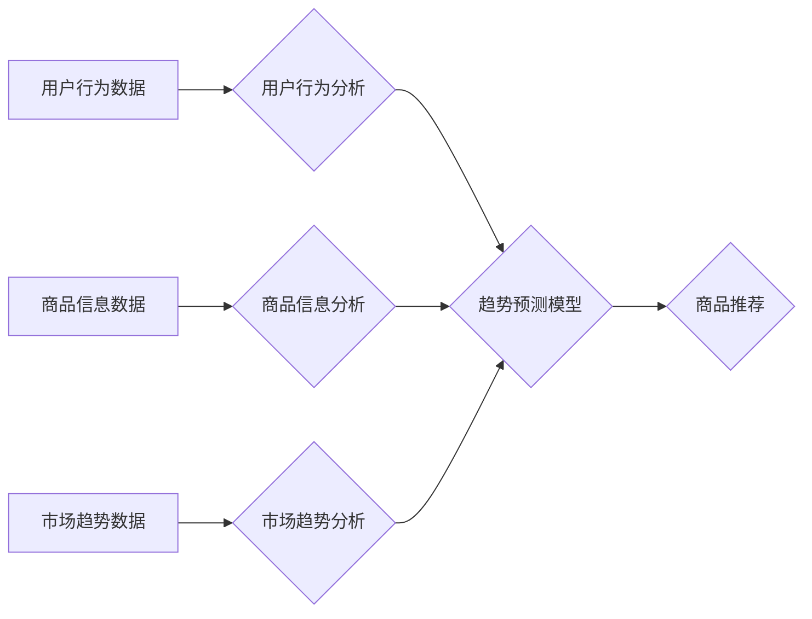

                 

## 电商搜索中的AI趋势预测技术

> 关键词：电商搜索、AI预测、趋势分析、机器学习、深度学习、推荐系统、用户行为

## 1. 背景介绍

随着电商行业的蓬勃发展，用户对商品的搜索需求日益增长。传统的基于关键词匹配的搜索方式已难以满足用户个性化、多样化的需求。为了提升用户搜索体验，电商平台纷纷探索新的搜索技术，其中AI趋势预测技术成为一个重要的研究方向。

AI趋势预测技术通过分析用户行为、商品信息、市场趋势等数据，预测未来一段时间内用户可能感兴趣的商品，并将其推荐给用户。这种技术能够帮助电商平台：

* **提升商品推荐精准度:**  精准推荐用户感兴趣的商品，提高转化率。
* **挖掘潜在需求:**  预测未来流行趋势，帮助平台提前备货，降低库存风险。
* **个性化用户体验:**  根据用户的搜索历史、购买记录等信息，提供个性化的商品推荐，提升用户粘性。

## 2. 核心概念与联系

**2.1 核心概念**

* **趋势预测:** 指通过分析历史数据，预测未来某个事件或现象的发展方向。
* **用户行为分析:**  通过分析用户的搜索、浏览、购买等行为，了解用户的兴趣爱好和需求。
* **商品信息分析:**  通过分析商品的属性、价格、评价等信息，了解商品的特征和受欢迎程度。
* **市场趋势分析:**  通过分析市场数据，了解行业发展趋势和用户需求变化。

**2.2 架构图**



**2.3 联系**

电商搜索中的AI趋势预测技术是一个多学科交叉的领域，需要结合用户行为分析、商品信息分析、市场趋势分析等多个方面的数据，并利用机器学习、深度学习等算法进行趋势预测。最终的目标是通过预测用户未来的需求，提供更精准、更个性化的商品推荐，提升用户体验。

## 3. 核心算法原理 & 具体操作步骤

**3.1 算法原理概述**

电商搜索中的AI趋势预测技术主要采用机器学习和深度学习算法。这些算法能够从海量数据中学习用户行为模式和商品趋势，并预测未来用户可能感兴趣的商品。常见的算法包括：

* **协同过滤:**  根据用户的历史行为，推荐与用户兴趣相似的其他用户购买的商品。
* **内容过滤:**  根据商品的属性和描述，推荐与用户搜索历史或购买记录相似的商品。
* **深度学习:**  利用神经网络模型，从用户行为、商品信息、市场趋势等多方面数据中学习更复杂的特征，进行更精准的趋势预测。

**3.2 算法步骤详解**

以深度学习算法为例，其具体操作步骤如下：

1. **数据收集:** 收集用户行为数据、商品信息数据、市场趋势数据等。
2. **数据预处理:** 对数据进行清洗、转换、特征工程等处理，使其适合深度学习模型训练。
3. **模型构建:** 选择合适的深度学习模型，例如循环神经网络（RNN）、长短期记忆网络（LSTM）等，并进行模型参数设置。
4. **模型训练:** 利用训练数据训练深度学习模型，并通过评估指标（例如准确率、召回率等）评估模型性能。
5. **模型部署:** 将训练好的模型部署到线上环境，用于实时预测用户可能感兴趣的商品。

**3.3 算法优缺点**

**优点:**

* 能够学习用户行为模式和商品趋势，进行更精准的预测。
* 可以处理海量数据，并从数据中挖掘更复杂的特征。
* 能够不断学习和优化，随着数据量的增加，预测精度会不断提高。

**缺点:**

* 需要大量的训练数据，否则模型性能会下降。
* 模型训练过程复杂，需要专业的技术人员进行操作。
* 模型解释性较差，难以理解模型是如何进行预测的。

**3.4 算法应用领域**

* **电商商品推荐:**  预测用户可能感兴趣的商品，并进行个性化推荐。
* **市场趋势预测:**  预测未来一段时间内市场上流行的商品或服务。
* **新产品开发:**  根据市场趋势预测，开发符合用户需求的新产品。

## 4. 数学模型和公式 & 详细讲解 & 举例说明

**4.1 数学模型构建**

深度学习模型的构建通常基于神经网络结构。一个典型的深度学习模型包含多个层，每层包含多个神经元。神经元之间通过权重连接，并进行加权求和和激活函数处理。

**4.2 公式推导过程**

深度学习模型的训练过程本质上是一个参数优化过程。目标是通过调整模型参数，使得模型的预测结果与实际结果尽可能接近。常用的优化算法包括梯度下降法、Adam算法等。

梯度下降法的核心思想是通过迭代更新模型参数，逐步降低模型的损失函数值。损失函数衡量模型预测结果与实际结果之间的差异。

**损失函数公式:**

$$L(w) = \frac{1}{N} \sum_{i=1}^{N} (y_i - \hat{y}_i)^2$$

其中：

* $L(w)$ 是损失函数值
* $w$ 是模型参数
* $N$ 是样本数量
* $y_i$ 是第 $i$ 个样本的真实值
* $\hat{y}_i$ 是第 $i$ 个样本的预测值

**梯度公式:**

$$\frac{\partial L(w)}{\partial w} = \frac{1}{N} \sum_{i=1}^{N} 2(y_i - \hat{y}_i) \frac{\partial \hat{y}_i}{\partial w}$$

**参数更新公式:**

$$w = w - \eta \frac{\partial L(w)}{\partial w}$$

其中：

* $\eta$ 是学习率

**4.3 案例分析与讲解**

假设我们有一个电商平台，想要预测用户可能感兴趣的手机型号。我们可以收集用户浏览历史、购买记录、商品属性等数据，并构建一个深度学习模型。

模型的输入数据包括用户浏览过的手机型号、用户的年龄、性别、收入等信息，以及手机型号的品牌、价格、配置等属性。模型的输出数据是预测用户对每个手机型号的购买概率。

通过训练模型，我们可以发现用户购买手机型号的因素包括价格、品牌、配置等，以及用户的年龄、性别、收入等个人信息。

## 5. 项目实践：代码实例和详细解释说明

**5.1 开发环境搭建**

* 操作系统：Ubuntu 20.04
* Python 版本：3.8
* 框架：TensorFlow 2.0

**5.2 源代码详细实现**

```python
import tensorflow as tf

# 定义模型结构
model = tf.keras.Sequential([
    tf.keras.layers.Dense(64, activation='relu', input_shape=(10,)),
    tf.keras.layers.Dense(32, activation='relu'),
    tf.keras.layers.Dense(1, activation='sigmoid')
])

# 编译模型
model.compile(optimizer='adam',
              loss='binary_crossentropy',
              metrics=['accuracy'])

# 训练模型
model.fit(x_train, y_train, epochs=10)

# 评估模型
loss, accuracy = model.evaluate(x_test, y_test)
print('Loss:', loss)
print('Accuracy:', accuracy)

# 预测结果
predictions = model.predict(x_new)
```

**5.3 代码解读与分析**

* 代码首先定义了一个深度学习模型，包含三个全连接层。
* 每个全连接层都使用ReLU激活函数，除了最后一层使用sigmoid激活函数，用于输出预测概率。
* 模型使用Adam优化器，损失函数为二分类交叉熵，评估指标为准确率。
* 代码然后训练模型，并使用测试数据评估模型性能。
* 最后，代码使用新数据预测结果。

**5.4 运行结果展示**

训练完成后，我们可以查看模型的损失函数值和准确率。如果模型训练成功，损失函数值会逐渐降低，准确率会逐渐提高。

## 6. 实际应用场景

**6.1 电商商品推荐**

AI趋势预测技术可以用于电商平台的商品推荐系统。通过分析用户的搜索历史、购买记录、浏览记录等数据，预测用户可能感兴趣的商品，并将其推荐给用户。

**6.2 市场趋势预测**

AI趋势预测技术可以用于预测市场上流行的商品或服务。通过分析市场数据、用户行为数据、新闻舆情等数据，预测未来一段时间内市场上可能出现的新趋势。

**6.3 新产品开发**

AI趋势预测技术可以用于新产品开发。通过分析市场趋势、用户需求、竞争对手产品等数据，预测未来用户可能需要的产品，并为新产品开发提供参考。

**6.4 未来应用展望**

随着人工智能技术的不断发展，AI趋势预测技术将在电商搜索领域发挥越来越重要的作用。未来，AI趋势预测技术可能会应用于以下领域：

* **个性化搜索结果:**  根据用户的兴趣爱好、购买习惯等信息，提供更个性化的搜索结果。
* **智能客服:**  利用AI趋势预测技术，预测用户可能遇到的问题，并提前提供解决方案。
* **跨界营销:**  通过预测用户跨界消费趋势，帮助商家进行跨界营销。

## 7. 工具和资源推荐

**7.1 学习资源推荐**

* **书籍:**

    * 《深度学习》 - Ian Goodfellow, Yoshua Bengio, Aaron Courville
    * 《机器学习》 - Tom Mitchell

* **在线课程:**

    * Coursera: 深度学习 Specialization
    * Udacity: 机器学习 Engineer Nanodegree

**7.2 开发工具推荐**

* **TensorFlow:**  开源深度学习框架
* **PyTorch:**  开源深度学习框架
* **Keras:**  基于TensorFlow的高级API

**7.3 相关论文推荐**

* **Attention Is All You Need:**  https://arxiv.org/abs/1706.03762
* **BERT: Pre-training of Deep Bidirectional Transformers for Language Understanding:**  https://arxiv.org/abs/1810.04805

## 8. 总结：未来发展趋势与挑战

**8.1 研究成果总结**

AI趋势预测技术在电商搜索领域取得了显著的成果，能够提升商品推荐精准度、挖掘潜在需求、个性化用户体验。

**8.2 未来发展趋势**

* **模型更深更复杂:**  未来，AI趋势预测模型将会更加深层、更加复杂，能够学习更复杂的特征，进行更精准的预测。
* **多模态数据融合:**  未来，AI趋势预测模型将会融合多种数据类型，例如文本、图像、视频等，进行更全面的趋势预测。
* **实时预测:**  未来，AI趋势预测模型将会更加实时，能够实时跟踪用户行为变化，并及时更新预测结果。

**8.3 面临的挑战**

* **数据质量:**  AI趋势预测模型的性能依赖于数据质量。如何获取高质量的数据，并进行有效的数据清洗和预处理，是未来需要解决的关键问题。
* **模型解释性:**  深度学习模型的解释性较差，难以理解模型是如何进行预测的。如何提高模型的解释性，使其更加透明可信，是未来需要解决的重要挑战。
* **伦理问题:**  AI趋势预测技术可能会被用于操纵用户行为，例如推送虚假信息、诱导用户购买不必要商品等。如何确保AI趋势预测技术的伦理使用，是未来需要关注的重要问题。

**8.4 研究展望**

未来，AI趋势预测技术将会继续发展，并应用于更多领域。研究者们将继续探索更有效的算法、更丰富的模型、更可靠的数据，以推动AI趋势预测技术的进步。


## 9. 附录：常见问题与解答

**9.1 如何评估AI趋势预测模型的性能？**

常用的评估指标包括准确率、召回率、F1-score等。

**9.2 如何处理缺失数据？**

常用的处理方法包括删除缺失数据、使用均值或中位数填充缺失数据、使用机器学习算法进行预测填充等。

**9.3 如何防止模型过拟合？**

常用的防止过拟合的方法包括正则化、交叉验证、Dropout等。


作者：禅与计算机程序设计艺术 / Zen and the Art of Computer Programming 
<end_of_turn>

