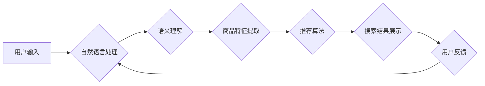

                 

## 电商搜索中的AI驱动长尾效应优化

> 关键词：电商搜索、长尾效应、AI优化、推荐系统、自然语言处理、机器学习、深度学习

## 1. 背景介绍

在当今数字经济时代，电商平台已成为人们获取商品和服务的首选渠道。高效的搜索引擎是电商平台的核心功能之一，它直接影响着用户体验和商业转化率。然而，电商搜索面临着诸多挑战，其中之一便是如何有效地处理长尾效应。

长尾效应是指在商品或服务的搜索词中，少量高频词占据大部分流量，而大量低频词（长尾词）则占据剩余流量，但其总流量不容忽视。电商平台上的长尾词往往代表着用户更精准、更个性化的需求，但由于其搜索量少，传统搜索算法难以有效地识别和推荐相关商品。

传统的电商搜索算法主要依赖于关键词匹配和商品属性分析，难以捕捉长尾词背后的语义和用户意图。随着人工智能技术的快速发展，AI驱动的长尾效应优化成为电商搜索领域的新趋势。

## 2. 核心概念与联系

**2.1 核心概念**

* **长尾效应:** 指在商品或服务的搜索词中，少量高频词占据大部分流量，而大量低频词（长尾词）则占据剩余流量，但其总流量不容忽视。
* **AI优化:** 利用人工智能技术，例如机器学习和深度学习，对搜索算法进行改进，提升搜索结果的准确性和相关性。
* **推荐系统:** 基于用户行为和商品特征，预测用户潜在的兴趣，并推荐相关商品。

**2.2 架构关系**



**2.3 核心联系**

AI驱动的长尾效应优化通过将自然语言处理、语义理解、商品特征提取和推荐算法相结合，实现对长尾词的精准识别和推荐。

## 3. 核心算法原理 & 具体操作步骤

**3.1 算法原理概述**

AI驱动的长尾效应优化主要基于以下核心算法：

* **词嵌入:** 将词语映射到低维向量空间，捕捉词语之间的语义关系。
* **深度学习模型:** 利用深度神经网络，例如循环神经网络（RNN）和Transformer，对长尾词进行语义分析和意图识别。
* **协同过滤:** 基于用户行为数据，预测用户对商品的潜在兴趣。
* **内容过滤:** 基于商品特征数据，推荐与用户搜索词相关的商品。

**3.2 算法步骤详解**

1. **数据预处理:** 收集用户搜索词、商品信息、用户行为数据等，并进行清洗、格式化和特征提取。
2. **词嵌入构建:** 利用词嵌入模型，例如Word2Vec或GloVe，将词语映射到低维向量空间。
3. **语义分析:** 利用深度学习模型，例如RNN或Transformer，对长尾词进行语义分析和意图识别。
4. **商品特征提取:** 利用商品属性、描述、评论等信息，提取商品特征向量。
5. **推荐算法训练:** 利用协同过滤和内容过滤算法，训练推荐模型。
6. **搜索结果排序:** 根据用户搜索词、语义分析结果和推荐模型预测，对商品进行排序，生成搜索结果。
7. **结果展示:** 将排序后的商品展示给用户。
8. **用户反馈收集:** 收集用户点击、购买、评价等反馈数据，用于模型优化和迭代。

**3.3 算法优缺点**

**优点:**

* 能够有效地识别和推荐长尾词相关的商品。
* 能够捕捉用户搜索词背后的语义和意图。
* 能够个性化推荐商品，提升用户体验。

**缺点:**

* 需要大量的训练数据和计算资源。
* 模型训练和优化需要专业技术人员。
* 算法可能会受到数据偏差的影响。

**3.4 算法应用领域**

* 电商搜索
* 内容推荐
* 个性化营销
* 智能客服

## 4. 数学模型和公式 & 详细讲解 & 举例说明

**4.1 数学模型构建**

假设我们有一个电商平台，包含N个商品和M个用户。每个用户对每个商品都有一个评分，表示用户对该商品的兴趣程度。我们可以用一个M×N的评分矩阵来表示用户对商品的评分。

**4.2 公式推导过程**

协同过滤算法的核心是基于用户的相似度和商品的相似度来进行推荐。

* **用户相似度:** 计算两个用户在评分上的相似度，例如余弦相似度。

$$
\text{相似度}(u_i, u_j) = \frac{\sum_{n=1}^{N} r_{i,n} \cdot r_{j,n}}{\sqrt{\sum_{n=1}^{N} r_{i,n}^2} \cdot \sqrt{\sum_{n=1}^{N} r_{j,n}^2}}
$$

* **商品相似度:** 计算两个商品在用户评分上的相似度，例如余弦相似度。

$$
\text{相似度}(p_i, p_j) = \frac{\sum_{u=1}^{M} r_{u,i} \cdot r_{u,j}}{\sqrt{\sum_{u=1}^{M} r_{u,i}^2} \cdot \sqrt{\sum_{u=1}^{M} r_{u,j}^2}}
$$

**4.3 案例分析与讲解**

假设用户A和用户B都对商品1和商品2评分很高，而对商品3评分很低，则用户A和用户B的相似度较高。如果商品1和商品2在用户评分上也比较相似，则商品1和商品2的相似度较高。

## 5. 项目实践：代码实例和详细解释说明

**5.1 开发环境搭建**

* Python 3.x
* TensorFlow 或 PyTorch
* scikit-learn

**5.2 源代码详细实现**

```python
# 导入必要的库
import numpy as np
from sklearn.metrics.pairwise import cosine_similarity

# 定义用户评分矩阵
ratings = np.array([
    [5, 4, 3],
    [4, 5, 2],
    [3, 2, 5]
])

# 计算用户相似度
user_similarity = cosine_similarity(ratings, ratings)

# 计算商品相似度
item_similarity = cosine_similarity(ratings.T, ratings.T)

# 根据用户相似度推荐商品
def recommend_items(user_id, top_n=3):
    # 获取用户相似用户
    similar_users = np.argsort(user_similarity[user_id])[::-1][1:]
    # 获取相似用户喜欢的商品
    recommended_items = np.mean(ratings[similar_users], axis=0)
    # 返回排序后的推荐商品
    return np.argsort(recommended_items)[::-1][:top_n]

# 根据商品相似度推荐商品
def recommend_items_by_item(item_id, top_n=3):
    # 获取相似商品
    similar_items = np.argsort(item_similarity[item_id])[::-1][1:]
    # 获取相似商品的评分
    recommended_ratings = ratings[:, similar_items]
    # 返回排序后的推荐商品
    return np.argsort(np.mean(recommended_ratings, axis=1))[::-1][:top_n]

# 示例
user_id = 0
recommended_items = recommend_items(user_id)
print(f"推荐给用户 {user_id} 的商品：{recommended_items}")

item_id = 0
recommended_items = recommend_items_by_item(item_id)
print(f"推荐与商品 {item_id} 相似的商品：{recommended_items}")
```

**5.3 代码解读与分析**

* 代码首先定义了用户评分矩阵，并使用余弦相似度计算了用户和商品之间的相似度。
* `recommend_items` 函数根据用户相似度推荐商品，它首先获取用户相似用户，然后计算相似用户喜欢的商品，最后返回排序后的推荐商品。
* `recommend_items_by_item` 函数根据商品相似度推荐商品，它首先获取相似商品，然后计算相似商品的评分，最后返回排序后的推荐商品。

**5.4 运行结果展示**

运行代码后，会输出推荐给用户0和商品0的商品列表。

## 6. 实际应用场景

**6.1 电商搜索场景**

* **长尾词推荐:** 当用户输入长尾词时，AI驱动的搜索引擎可以根据语义分析和推荐算法，推荐与用户意图相关的商品。
* **个性化搜索:** 基于用户的搜索历史、购买记录和浏览行为，AI可以个性化推荐商品，提升用户体验。
* **智能补全:** AI可以根据用户的输入，智能地补全搜索词，帮助用户快速找到所需商品。

**6.2 内容推荐场景**

* **个性化内容推荐:** AI可以根据用户的兴趣爱好和阅读习惯，推荐个性化的文章、视频和图片。
* **内容发现:** AI可以帮助用户发现新的内容，例如推荐与用户阅读过的文章相关的主题或作者。

**6.3 个性化营销场景**

* **精准广告投放:** AI可以根据用户的兴趣爱好和行为数据，精准地投放广告，提升广告效果。
* **个性化促销:** AI可以根据用户的购买习惯和偏好，定制个性化的促销活动，提升用户转化率。

**6.4 未来应用展望**

* **多模态搜索:** 将文本、图像、音频等多种数据类型融合，实现更精准的搜索和推荐。
* **实时个性化:** 基于用户的实时行为数据，实现更动态和个性化的推荐。
* **跨平台推荐:** 将用户数据和行为数据整合，实现跨平台的个性化推荐。

## 7. 工具和资源推荐

**7.1 学习资源推荐**

* **书籍:**
    * 《深度学习》
    * 《推荐系统实践》
    * 《自然语言处理入门》
* **在线课程:**
    * Coursera: 深度学习
    * Udacity: 自然语言处理
    * edX: 推荐系统

**7.2 开发工具推荐**

* **Python:** 
    * TensorFlow
    * PyTorch
    * scikit-learn
* **云平台:**
    * AWS
    * Azure
    * Google Cloud

**7.3 相关论文推荐**

* **Word2Vec:** Mikolov et al. (2013)
* **GloVe:** Pennington et al. (2014)
* **Transformer:** Vaswani et al. (2017)

## 8. 总结：未来发展趋势与挑战

**8.1 研究成果总结**

AI驱动的长尾效应优化取得了显著的成果，有效地提升了电商搜索的精准度和用户体验。

**8.2 未来发展趋势**

* **多模态搜索:** 将文本、图像、音频等多种数据类型融合，实现更精准的搜索和推荐。
* **实时个性化:** 基于用户的实时行为数据，实现更动态和个性化的推荐。
* **跨平台推荐:** 将用户数据和行为数据整合，实现跨平台的个性化推荐。

**8.3 面临的挑战**

* **数据质量:** AI算法依赖于高质量的数据，数据偏差会影响算法效果。
* **计算资源:** 训练大型AI模型需要大量的计算资源。
* **模型 interpretability:** AI模型的决策过程往往难以解释，这可能会导致用户信任问题。

**8.4 研究展望**

未来研究将重点关注以下几个方面:

* 开发更鲁棒、更有效的AI算法。
* 探索新的数据来源和数据处理方法。
* 提升AI模型的 interpretability。


## 9. 附录：常见问题与解答

**9.1 如何评估AI驱动的长尾效应优化的效果？**

可以使用以下指标来评估AI驱动的长尾效应优化的效果：

* **点击率 (CTR):** 用户点击推荐商品的比例。
* **转化率 (CVR):** 用户点击推荐商品后购买商品的比例。
* **用户满意度:** 用户对推荐商品的满意度。

**9.2 如何解决数据偏差问题？**

* 使用更全面的数据，覆盖不同的用户群体和商品类别。
* 使用数据清洗和预处理技术，去除数据中的噪声和偏差。
* 使用正则化技术，防止模型过拟合。

**9.3 如何提升AI模型的 interpretability？**

* 使用可解释的AI模型，例如决策树和线性回归。
* 使用可视化技术，展示模型的决策过程。
* 使用反向传播算法，分析模型参数对预测结果的影响。


作者：禅与计算机程序设计艺术 / Zen and the Art of Computer Programming 
<end_of_turn>

