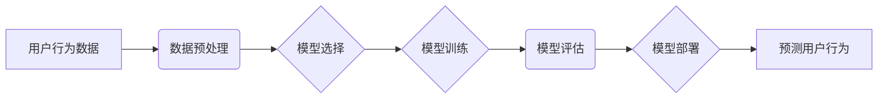

                 

## 电商用户行为序列预测：AI大模型方案

> 关键词：电商用户行为，序列预测，AI大模型，Transformer，BERT，Recurrent Neural Networks，深度学习

## 1. 背景介绍

在当今数据爆炸的时代，电商平台积累了海量用户行为数据，例如浏览历史、购买记录、评价信息等。这些数据蕴含着丰富的用户偏好和购物模式，对其进行有效挖掘和分析，对于电商平台的运营和发展至关重要。用户行为序列预测作为电商数据分析的重要方向之一，旨在预测用户的未来行为，例如下一件商品的购买意向、浏览路径、评价倾向等。

传统的电商用户行为分析方法主要依赖于规则引擎和统计模型，例如基于协同过滤的推荐系统、基于市场 Basket Analysis 的关联规则挖掘等。然而，这些方法往往难以捕捉用户行为的复杂性和动态性，并且对数据特征的依赖性较高。

近年来，随着深度学习技术的快速发展，基于AI大模型的用户行为序列预测方法逐渐成为主流。这些方法能够自动学习用户行为的复杂模式，并对新用户和新场景进行有效预测。

## 2. 核心概念与联系

### 2.1  用户行为序列

用户行为序列是指用户在电商平台上进行的一系列交互行为，例如：

* **浏览行为:** 用户访问商品页面、分类页面、搜索结果页等。
* **购买行为:** 用户添加商品到购物车、下单、支付等。
* **评价行为:** 用户对商品进行评价、晒单等。
* **其他行为:** 用户收藏商品、加入会员、关注店铺等。

这些行为之间存在着一定的关联性和时序性，可以形成一个有序的序列。

### 2.2  序列预测

序列预测是指根据历史序列数据预测未来序列的某一元素或整个序列。在电商领域，序列预测可以应用于以下场景：

* **商品推荐:** 预测用户未来可能感兴趣的商品。
* **浏览路径预测:** 预测用户未来可能浏览的页面。
* **购买意向预测:** 预测用户未来是否会购买某件商品。
* **用户画像构建:** 构建用户行为特征，进行用户细分和个性化服务。

### 2.3  AI大模型

AI大模型是指在海量数据上训练的深度学习模型，具有强大的泛化能力和学习能力。常见的AI大模型包括：

* **Transformer:**  一种基于注意力机制的序列模型，在自然语言处理领域取得了突破性进展。
* **BERT:**  一种基于Transformer的预训练语言模型，能够理解上下文信息，在文本分类、问答等任务中表现出色。

### 2.4  架构图



## 3. 核心算法原理 & 具体操作步骤

### 3.1  算法原理概述

在电商用户行为序列预测中，常用的算法包括Recurrent Neural Networks (RNN) 和 Transformer。

* **RNN:** RNN是一种专门用于处理序列数据的循环神经网络，其内部包含循环单元，能够记忆历史信息，并将其用于预测未来序列元素。

* **Transformer:** Transformer是一种基于注意力机制的序列模型，能够捕捉序列中不同元素之间的长距离依赖关系，并具有并行计算能力，训练速度更快。

### 3.2  算法步骤详解

**RNN:**

1. **数据预处理:** 将用户行为序列数据转换为数字格式，例如使用one-hot编码表示商品类别。
2. **模型构建:** 定义RNN网络结构，包括输入层、隐藏层和输出层。
3. **模型训练:** 使用训练数据训练RNN模型，优化模型参数，使模型能够准确预测未来序列元素。
4. **模型评估:** 使用测试数据评估模型性能，例如使用准确率、召回率等指标。
5. **模型部署:** 将训练好的模型部署到生产环境中，用于预测用户行为。

**Transformer:**

1. **数据预处理:** 与RNN类似，将用户行为序列数据转换为数字格式。
2. **模型构建:** 定义Transformer网络结构，包括编码器和解码器。
3. **模型训练:** 使用训练数据训练Transformer模型，优化模型参数，使模型能够准确预测未来序列元素。
4. **模型评估:** 使用测试数据评估模型性能，例如使用准确率、召回率等指标。
5. **模型部署:** 将训练好的模型部署到生产环境中，用于预测用户行为。

### 3.3  算法优缺点

**RNN:**

* **优点:** 能够捕捉序列中的时间依赖关系。
* **缺点:** 训练速度慢，难以处理长序列数据。

**Transformer:**

* **优点:** 训练速度快，能够处理长序列数据，捕捉长距离依赖关系。
* **缺点:** 参数量大，需要大量的计算资源。

### 3.4  算法应用领域

* **电商推荐:** 预测用户未来可能感兴趣的商品。
* **个性化营销:** 根据用户行为序列，进行个性化广告推送和促销活动。
* **用户画像构建:** 构建用户行为特征，进行用户细分和个性化服务。
* **欺诈检测:** 识别异常用户行为，防止欺诈行为发生。

## 4. 数学模型和公式 & 详细讲解 & 举例说明

### 4.1  数学模型构建

在用户行为序列预测中，常用的数学模型包括：

* **线性回归模型:** 用于预测连续型变量，例如用户购买金额。
* **逻辑回归模型:** 用于预测分类型变量，例如用户是否购买商品。
* **支持向量机 (SVM):** 用于分类和回归问题，能够处理高维数据。
* **深度学习模型:** 例如RNN和Transformer，能够学习复杂的用户行为模式。

### 4.2  公式推导过程

由于篇幅限制，这里只列举一个简单的线性回归模型的公式推导过程：

**目标:** 预测用户购买商品的金额 $y$，根据用户的历史购买记录 $x$。

**模型:** $y = w_0 + w_1x_1 + w_2x_2 + ... + w_nx_n + \epsilon$

其中:

* $y$: 用户购买商品的金额
* $x_1, x_2, ..., x_n$: 用户的历史购买记录，例如购买次数、平均购买金额等
* $w_0, w_1, w_2, ..., w_n$: 模型参数
* $\epsilon$: 误差项

**损失函数:** $L = \frac{1}{2}\sum_{i=1}^{N}(y_i - \hat{y}_i)^2$

其中:

* $N$: 数据样本数量
* $y_i$: 第 $i$ 个样本的真实值
* $\hat{y}_i$: 第 $i$ 个样本的预测值

**优化目标:** 找到最优参数 $w$，使得损失函数最小化。

### 4.3  案例分析与讲解

假设我们想要预测用户的下一个浏览商品的类别。我们可以使用RNN模型，将用户的浏览历史作为输入，预测下一个浏览商品的类别。

例如，用户的浏览历史为：

* 商品A
* 商品B
* 商品C

我们可以将这些商品类别转换为数字格式，例如：

* 商品A: 1
* 商品B: 2
* 商品C: 3

然后将这些数字作为RNN模型的输入，模型会学习用户的浏览模式，并预测下一个浏览商品的类别。

## 5. 项目实践：代码实例和详细解释说明

### 5.1  开发环境搭建

* Python 3.x
* TensorFlow 或 PyTorch 深度学习框架
* Jupyter Notebook 或 VS Code 代码编辑器

### 5.2  源代码详细实现

```python
import tensorflow as tf

# 定义RNN模型
model = tf.keras.Sequential([
    tf.keras.layers.Embedding(input_dim=num_categories, output_dim=embedding_dim),
    tf.keras.layers.LSTM(units=128),
    tf.keras.layers.Dense(units=num_categories, activation='softmax')
])

# 编译模型
model.compile(optimizer='adam',
              loss='sparse_categorical_crossentropy',
              metrics=['accuracy'])

# 训练模型
model.fit(x_train, y_train, epochs=10)

# 预测
predictions = model.predict(x_test)
```

### 5.3  代码解读与分析

* **Embedding层:** 将商品类别转换为稠密的向量表示。
* **LSTM层:** 捕捉序列中的时间依赖关系。
* **Dense层:** 将LSTM层的输出转换为预测概率分布。
* **编译模型:** 选择优化器、损失函数和评价指标。
* **训练模型:** 使用训练数据训练模型。
* **预测:** 使用训练好的模型预测测试数据。

### 5.4  运行结果展示

训练完成后，可以使用测试数据评估模型性能，例如计算准确率、召回率等指标。

## 6. 实际应用场景

### 6.1  电商推荐

基于用户行为序列的推荐系统能够更加精准地推荐用户感兴趣的商品，提高用户体验和转化率。

### 6.2  个性化营销

根据用户的行为序列，电商平台可以进行个性化广告推送和促销活动，提高营销效果。

### 6.3  用户画像构建

通过分析用户的行为序列，可以构建用户画像，了解用户的兴趣爱好、消费习惯等，为用户提供更个性化的服务。

### 6.4  未来应用展望

随着AI技术的不断发展，用户行为序列预测将在电商领域得到更广泛的应用，例如：

* **预测用户流失风险:** 通过分析用户的行为序列，预测用户是否会流失，并采取措施挽留用户。
* **个性化商品设计:** 根据用户的行为序列，预测用户对商品的偏好，为用户设计更符合其需求的商品。
* **智能客服:** 利用用户行为序列，训练智能客服系统，能够更准确地理解用户的需求，并提供更有效的帮助。

## 7. 工具和资源推荐

### 7.1  学习资源推荐

* **书籍:**
    * Deep Learning by Ian Goodfellow, Yoshua Bengio, and Aaron Courville
    * Natural Language Processing with Python by Steven Bird, Ewan Klein, and Edward Loper
* **在线课程:**
    * Coursera: Deep Learning Specialization
    * Udacity: Deep Learning Nanodegree
* **博客和论坛:**
    * Towards Data Science
    * Machine Learning Mastery

### 7.2  开发工具推荐

* **Python:** 
    * TensorFlow
    * PyTorch
    * Keras
* **数据处理工具:**
    * Pandas
    * NumPy
* **可视化工具:**
    * Matplotlib
    * Seaborn

### 7.3  相关论文推荐

* **Attention Is All You Need:** https://arxiv.org/abs/1706.03762
* **BERT: Pre-training of Deep Bidirectional Transformers for Language Understanding:** https://arxiv.org/abs/1810.04805

## 8. 总结：未来发展趋势与挑战

### 8.1  研究成果总结

近年来，基于AI大模型的用户行为序列预测取得了显著进展，例如Transformer模型在自然语言处理领域取得了突破性进展，并被应用于电商用户行为预测。

### 8.2  未来发展趋势

* **模型更深更广:** 探索更深层次、更广范围的用户行为模式，例如跨平台、跨场景的用户行为预测。
* **数据更丰富更精准:** 收集更丰富、更精准的用户行为数据，例如用户画像、行为轨迹等，为模型训练提供更优质的数据。
* **解释性更强:** 研究更具解释性的AI模型，能够更好地理解模型的决策过程，提高用户信任度。

### 8.3  面临的挑战

* **数据隐私保护:** 用户行为数据具有高度敏感性，需要采取有效的措施保护用户隐私。
* **模型可解释性:** AI模型的决策过程往往难以理解，需要提高模型的可解释性，增强用户信任度。
* **计算资源需求:** 大型AI模型训练需要大量的计算资源，需要探索更有效的训练方法，降低计算成本。

### 8.4  研究展望

未来，用户行为序列预测将继续是一个重要的研究方向，随着AI技术的不断发展，我们将看到更多更智能、更精准的用户行为预测模型，为电商平台提供更有效的运营和服务。

## 9. 附录：常见问题与解答

* **Q1: 如何处理用户行为序列中的缺失值？**

* **A1:** 可以使用多种方法处理缺失值，例如平均值填充、线性插值、KNN填充等。

* **Q2: 如何评估用户行为序列预测模型的性能？**

* **A2:** 可以使用多种指标评估模型性能，例如准确率、召回率、F1-score、AUC等。

* **Q3: 如何选择合适的AI模型？**

* **A3:** 需要根据具体应用场景和数据特点选择合适的AI模型，例如RNN适合处理时间序列数据，Transformer适合处理长序列数据。


作者：禅与计算机程序设计艺术 / Zen and the Art of Computer Programming 
<end_of_turn>

