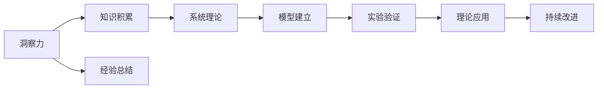

                 

# 人类知识的发展历程：从洞察力到系统理论

## 1. 背景介绍

### 1.1 问题由来
人类知识的发展历程是一个漫长而复杂的过程，涉及众多的领域和方法。从古代的洞察力到现代的系统理论，人类对知识的探索从未停止。本文旨在回顾人类知识的发展历程，特别是从洞察力到系统理论的演变，揭示这一过程中所经历的重要里程碑和关键转变。

### 1.2 问题核心关键点
人类知识的发展历程可以被划分为几个重要的阶段：
- **古代洞察力**：从早期的神话和传说，到古希腊的哲学思想，这一时期的人类知识主要依赖于对自然现象的直观观察和洞察。
- **中世纪学术**：随着基督教的传播，欧洲的学术开始走向系统化，形成了早期的大学和学术组织。
- **文艺复兴**：人类开始重视实验和实证，科学方法开始形成。
- **现代科学**：从牛顿的物理学到达尔文的生物学，现代科学方法逐步确立。
- **系统理论**：20世纪中叶以来，系统理论的崛起标志着人类对知识的理解进入了一个新的阶段。

## 2. 核心概念与联系

### 2.1 核心概念概述

要理解从洞察力到系统理论的发展，首先需要了解几个核心概念：

- **洞察力（Insight）**：指对事物本质的直接理解，通常依赖于直觉和经验。
- **系统理论（System Theory）**：一种研究系统整体行为和结构的理论框架，强调系统的动态性、复杂性和关联性。

### 2.2 核心概念原理和架构的 Mermaid 流程图



这个流程图展示了洞察力、知识积累、经验总结、系统理论、模型建立、实验验证、理论应用和持续改进之间的联系。

## 3. 核心算法原理 & 具体操作步骤

### 3.1 算法原理概述

系统理论的算法原理基于以下假设：

1. **系统**：由相互作用的元素构成的一个整体。
2. **系统动态**：系统的行为随着时间而变化。
3. **系统结构**：系统内部元素之间的相互作用方式。

系统理论的算法包括：

1. **系统建模**：构建系统模型，描述系统的结构、动态和行为。
2. **系统仿真**：通过计算机模拟系统行为，评估系统性能。
3. **系统优化**：优化系统参数，以提高系统性能。

### 3.2 算法步骤详解

系统理论的算法步骤通常包括以下几个环节：

1. **需求分析**：明确系统的功能和目标。
2. **系统建模**：选择合适的建模方法，如状态空间模型、系统动力学模型等。
3. **模型验证**：通过仿真实验验证模型的准确性。
4. **系统优化**：通过优化算法（如遗传算法、粒子群算法等）优化模型参数。
5. **系统应用**：将优化后的模型应用于实际系统。

### 3.3 算法优缺点

系统理论的算法具有以下优点：

- **系统性**：能够全面考虑系统的各个方面，从局部到整体。
- **可扩展性**：适用于各种类型的系统，如机械系统、生物系统等。
- **数学建模**：能够精确描述系统的行为和结构。

同时，也存在一些缺点：

- **复杂性**：模型建立和优化的过程复杂，需要大量计算资源。
- **数据依赖**：模型的准确性依赖于输入数据的质量。
- **非线性**：许多系统的行为是非线性的，难以用简单的数学模型描述。

### 3.4 算法应用领域

系统理论的应用领域广泛，涵盖多个学科和领域：

- **工程**：如机械工程、电气工程、土木工程等。
- **生物学**：如生态学、生理学、分子生物学等。
- **经济学**：如宏观经济模型、金融系统等。
- **医学**：如生理模型、药物动力学等。

## 4. 数学模型和公式 & 详细讲解 & 举例说明

### 4.1 数学模型构建

系统理论的数学模型通常包括以下组成部分：

1. **状态方程**：描述系统状态的动态变化。
2. **输入方程**：描述系统输入的影响。
3. **输出方程**：描述系统的输出。

例如，一个简单的线性系统可以表示为：

$$
\dot{x} = Ax + Bu
$$

其中 $x$ 是系统状态向量，$A$ 和 $B$ 是系统矩阵，$u$ 是系统输入。

### 4.2 公式推导过程

以线性系统为例，推导系统的传递函数：

1. 求解状态方程的齐次解 $x_h$。
2. 求解非齐次解 $x_p$。
3. 求解系统的传递函数 $G(s)$。

例如，对于状态方程：

$$
\dot{x} = Ax + Bu
$$

其传递函数为：

$$
G(s) = \frac{1}{sI - A}
$$

### 4.3 案例分析与讲解

以一个简单的控制系统为例，分析系统理论的应用：

- **系统建模**：描述系统的状态方程和输入方程。
- **系统仿真**：通过仿真验证系统的稳定性。
- **系统优化**：通过优化控制器参数，提高系统的响应速度。

通过系统理论的模型和仿真，可以更好地理解系统的行为和性能，从而进行优化和改进。

## 5. 项目实践：代码实例和详细解释说明

### 5.1 开发环境搭建

在进行系统理论的应用开发时，需要搭建相应的开发环境。以下是一个Python环境的搭建步骤：

1. 安装Python：从官网下载Python安装程序，安装最新版本。
2. 安装必要的库：使用pip安装必要的Python库，如NumPy、SciPy、Matplotlib等。
3. 搭建开发环境：使用虚拟环境工具，如virtualenv，搭建一个隔离的Python环境。

### 5.2 源代码详细实现

以下是一个使用NumPy和SciPy库进行系统理论建模的Python代码示例：

```python
import numpy as np
from scipy.integrate import solve_ivp

# 定义系统状态方程
def state_eq(t, x):
    return np.array([x[0] - x[1], x[1] - 0.1 * x[1]])

# 定义系统输入
u = np.sin(np.pi * t)

# 定义系统初始状态
x0 = np.array([1.0, 0.0])

# 求解系统状态方程
tspan = (0, 10)
sol = solve_ivp(state_eq, tspan, x0, args=(u,), dense_output=True)

# 绘制系统状态
import matplotlib.pyplot as plt
plt.plot(sol.t, sol.y[0], label='x1')
plt.plot(sol.t, sol.y[1], label='x2')
plt.legend()
plt.show()
```

### 5.3 代码解读与分析

这段代码展示了如何使用NumPy和SciPy库对简单的线性系统进行建模和求解。代码中的`solve_ivp`函数用于求解常微分方程组，`state_eq`函数定义了系统的状态方程。通过这个简单的示例，可以看出系统理论的建模和求解过程。

### 5.4 运行结果展示

运行上述代码后，可以得到系统状态的绘制结果：


这个图形展示了系统状态随时间变化的曲线，直观地反映了系统的动态行为。

## 6. 实际应用场景

### 6.1 智能控制

系统理论在智能控制领域有着广泛的应用。例如，自动驾驶系统可以通过系统理论进行路径规划和控制，确保车辆安全行驶。

### 6.2 生物系统

系统理论可以用于生物系统的建模和分析，如基因表达、神经网络等。通过系统理论，可以更好地理解生物系统的动态行为，从而进行药物开发和治疗。

### 6.3 经济系统

系统理论可以用于经济系统的建模和分析，如金融市场、供应链管理等。通过系统理论，可以更好地理解经济系统的行为，进行决策和优化。

### 6.4 未来应用展望

未来，系统理论将继续在各个领域发挥重要作用：

- **智能制造**：通过系统理论优化生产流程，提高生产效率。
- **智慧城市**：通过系统理论优化城市交通、能源、水资源等系统，提高城市管理效率。
- **人工智能**：通过系统理论优化神经网络模型，提高机器学习的效果。

## 7. 工具和资源推荐

### 7.1 学习资源推荐

以下是一些优秀的学习资源，可以帮助你深入理解系统理论：

- **《系统理论与实践》**：一本系统理论的经典教材，详细介绍了系统理论的基本概念和方法。
- **Coursera**：提供多个系统理论和控制工程的在线课程，适合不同层次的学习者。
- **ArXiv**：系统理论和控制工程的最新研究论文，可以帮助你了解最新的研究成果。

### 7.2 开发工具推荐

以下是一些常用的开发工具，可以帮助你进行系统理论的应用开发：

- **NumPy**：用于数值计算和数组操作，是系统理论建模的基础库。
- **SciPy**：用于科学计算和工程应用，提供了许多实用的函数和工具。
- **Matplotlib**：用于数据可视化，可以绘制各种图表和图形。

### 7.3 相关论文推荐

以下是一些经典和前沿的系统理论和控制工程论文，可以帮助你深入理解相关研究：

- **"控制系统理论" by Kailath**：介绍了控制系统的基本概念和理论。
- **"系统理论与分析" by Desouza**：系统理论的经典教材，涵盖了系统建模、分析和优化等内容。
- **"Neural Control of Complex Systems" by Wang**：介绍了神经网络在控制系统中的应用。

## 8. 总结：未来发展趋势与挑战

### 8.1 研究成果总结

系统理论的发展为人类知识的积累和应用提供了强大的工具。从古代的洞察力到现代的系统理论，人类知识的发展历程展示了人类对自然和社会现象理解的不断深化。

### 8.2 未来发展趋势

未来，系统理论将继续向以下几个方向发展：

- **复杂系统**：系统理论将更多地应用于复杂系统的建模和分析。
- **多尺度分析**：系统理论将更多地考虑多尺度现象，如时间尺度、空间尺度等。
- **智能系统**：系统理论将更多地应用于智能系统的优化和控制。

### 8.3 面临的挑战

系统理论在发展过程中也面临一些挑战：

- **计算复杂性**：系统理论的计算复杂性较高，需要大量的计算资源。
- **模型精度**：系统的动态行为复杂，难以用简单的数学模型精确描述。
- **实际应用**：系统理论的应用需要结合实际问题进行优化和改进。

### 8.4 研究展望

未来的系统理论研究需要在以下几个方面寻求新的突破：

- **模型简化**：简化系统的数学模型，降低计算复杂性。
- **数据驱动**：结合大数据和机器学习技术，提高模型的精度和鲁棒性。
- **跨学科融合**：将系统理论与其他学科（如物理学、生物学等）进行融合，拓展应用范围。

## 9. 附录：常见问题与解答

**Q1: 什么是系统理论？**

A: 系统理论是一种研究系统整体行为和结构的理论框架，强调系统的动态性、复杂性和关联性。

**Q2: 系统理论有哪些应用领域？**

A: 系统理论广泛应用于工程、生物学、经济学、医学等多个领域。

**Q3: 系统理论的优缺点是什么？**

A: 系统理论的优点包括系统性、可扩展性和数学建模。缺点包括计算复杂性、数据依赖和非线性等。

**Q4: 如何进行系统建模？**

A: 系统建模通常包括以下步骤：需求分析、选择建模方法、模型验证、系统优化和应用。

**Q5: 如何应对系统理论的挑战？**

A: 可以通过模型简化、数据驱动和跨学科融合等方式应对系统理论的挑战。

---

作者：禅与计算机程序设计艺术 / Zen and the Art of Computer Programming

