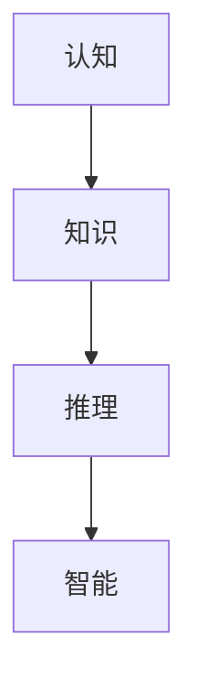

                 

# 人类知识的局限：承认未知探索之旅

> 关键词：人类知识,局限,未知,探索,认知,智能

## 1. 背景介绍

### 1.1 问题由来

随着人工智能技术的迅猛发展，人类对于智能系统的期望值也在不断提高。然而，在探索智能系统的无限可能性时，我们往往忽视了一个基本事实：人类自身的知识体系存在局限，这一局限也间接限制了人工智能的发展。认识并承认这些局限，不仅有助于我们更好地定位智能系统的角色和功能，更能够为未来的探索之路提供更加清晰的指引。

### 1.2 问题核心关键点

人类知识的局限主要体现在以下几个方面：

- **认知边界**：人类对于世界的认知存在固有边界，有些问题可能超出我们的理解能力。
- **知识盲区**：人类在长期进化过程中形成的知识体系存在某些盲区，某些领域或问题未被充分研究。
- **推理局限**：人类推理能力有限，无法处理某些复杂的逻辑或非线性问题。
- **经验局限**：人类的经验和数据量有限，可能无法应对某些大规模或高维度问题。

这些局限不仅对人类自身有重要启示，对于构建智能系统的边界设定同样至关重要。下面，我们将通过核心概念和具体实例，深入探讨人类知识的局限，以及这些局限对人工智能系统的潜在影响。

## 2. 核心概念与联系

### 2.1 核心概念概述

在探讨人类知识的局限之前，我们需要先理解一些关键概念：

- **认知**：人类对世界的感知、理解和处理信息的能力。
- **知识**：人类通过学习、实践等过程获得的经验和信息集合。
- **推理**：基于已有知识和逻辑规则，推导出新结论的过程。
- **智能**：能够在特定环境下，自主执行任务的能力。

这些概念之间相互联系，共同构成了人类认识世界的基本框架。

### 2.2 核心概念原理和架构的 Mermaid 流程图



在上述流程图中，认知是输入，智能是输出，知识在推理过程中起到桥梁作用。这一逻辑链条体现了人类知识的局限性，也即是认知的局限性在推理和智能输出中的体现。

## 3. 核心算法原理 & 具体操作步骤

### 3.1 算法原理概述

要深入理解人类知识的局限，需要借助一些数学和计算方法。这里我们主要探讨基于数学模型的推理过程，以及这一过程在实际应用中的表现。

### 3.2 算法步骤详解

#### 3.2.1 数学模型构建

为了建模人类认知和推理过程，我们可以采用图灵机(Turing Machine)模型。在图灵机模型中，输入和输出都是符号序列，通过状态转移和读写头等操作进行推理。

数学公式表示为：
$$ M = (Q, \Sigma, \delta, q_0, F) $$
其中，$Q$ 是状态集合，$\Sigma$ 是输入符号集合，$\delta$ 是状态转移函数，$q_0$ 是初始状态，$F$ 是接受状态集合。

#### 3.2.2 公式推导过程

以一个简单的图灵机为例，它的状态集合为 $Q = \{q_0, q_1, q_2, q_A, q_B\}$，输入符号集合为 $\Sigma = \{0, 1\}$，状态转移函数 $\delta$ 定义如下：
$$ \delta(q_i, a) = \begin{cases}
(q_j, a), & \text{if } a \in \Sigma \\
(q_i, \epsilon), & \text{if } a = \epsilon
\end{cases} $$

例如，图灵机接受一个二进制数 $0110$，从 $q_0$ 状态开始，逐步执行状态转移，最终到达接受状态 $q_A$。

#### 3.2.3 算法优缺点

图灵机的优点在于：
- **通用性**：任何可计算问题都可以通过图灵机进行计算。
- **可证明性**：图灵机的计算能力是可证明的。

其缺点在于：
- **复杂性**：图灵机状态转移和符号读写复杂，不易理解。
- **计算资源**：图灵机模型的计算资源消耗较大。

#### 3.2.4 算法应用领域

图灵机模型可以应用于多个领域，例如：
- **编程语言设计**：如C++等编程语言，其运行机制与图灵机类似。
- **自动定理证明**：利用图灵机模型可以自动化证明某些数学定理。
- **密码学**：图灵机的计算能力被用于设计加密算法。

### 3.3 算法优缺点

图灵机的优点是通用性和可证明性，但缺点在于复杂性和计算资源消耗较大。

### 3.4 算法应用领域

图灵机模型适用于复杂计算问题，其应用领域广泛，涵盖了编程语言设计、自动定理证明、密码学等多个方面。

## 4. 数学模型和公式 & 详细讲解 & 举例说明

### 4.1 数学模型构建

为了深入探讨人类知识的局限，我们需要建立一个更复杂的数学模型。这里采用神经网络模型，用于模拟人类对复杂信息的处理和推理能力。

数学公式表示为：
$$ M = (W, b, f) $$
其中，$W$ 是权重矩阵，$b$ 是偏置向量，$f$ 是激活函数。

### 4.2 公式推导过程

以一个简单的全连接神经网络为例，其输入和输出如下：
$$ \text{输入} \in \mathbb{R}^n $$
$$ \text{输出} \in \mathbb{R}^m $$
其中，$n$ 是输入维度，$m$ 是输出维度。

神经网络的前向传播过程如下：
$$ \text{隐层输出} = f(\text{输入} \times W + b) $$
$$ \text{输出} = f(\text{隐层输出} \times W + b) $$

### 4.3 案例分析与讲解

考虑一个简单的回归问题，输入为 $x$，输出为 $y$。使用一个简单的线性回归模型，通过训练调整权重和偏置，得到模型输出。

$$ \text{输入} \in \mathbb{R}^n $$
$$ \text{输出} \in \mathbb{R} $$

模型参数为：
$$ W = \begin{bmatrix}
w_{11} & w_{12} & \cdots & w_{1n} \\
w_{21} & w_{22} & \cdots & w_{2n} \\
\vdots & \vdots & \ddots & \vdots \\
w_{n1} & w_{n2} & \cdots & w_{nn}
\end{bmatrix} $$
$$ b = \begin{bmatrix}
b_1 \\
b_2 \\
\vdots \\
b_n
\end{bmatrix} $$

前向传播过程如下：
$$ z = xW + b $$
$$ y = f(z) $$

通过训练，模型能够较好地拟合训练数据，但可能存在过拟合问题。

## 5. 项目实践：代码实例和详细解释说明

### 5.1 开发环境搭建

在进行神经网络实践前，我们需要准备好开发环境。以下是使用Python进行PyTorch开发的环境配置流程：

1. 安装Anaconda：从官网下载并安装Anaconda，用于创建独立的Python环境。

2. 创建并激活虚拟环境：
```bash
conda create -n pytorch-env python=3.8 
conda activate pytorch-env
```

3. 安装PyTorch：根据CUDA版本，从官网获取对应的安装命令。例如：
```bash
conda install pytorch torchvision torchaudio cudatoolkit=11.1 -c pytorch -c conda-forge
```

4. 安装TensorFlow：
```bash
conda install tensorflow -c conda-forge
```

5. 安装numpy、pandas等常用库：
```bash
pip install numpy pandas matplotlib
```

完成上述步骤后，即可在`pytorch-env`环境中开始神经网络实践。

### 5.2 源代码详细实现

这里我们以一个简单的全连接神经网络为例，实现线性回归任务。

```python
import torch
import torch.nn as nn
import torch.optim as optim
import matplotlib.pyplot as plt

# 定义神经网络模型
class LinearNet(nn.Module):
    def __init__(self, input_dim, output_dim):
        super(LinearNet, self).__init__()
        self.linear = nn.Linear(input_dim, output_dim)
        
    def forward(self, x):
        return self.linear(x)

# 准备数据
input_dim = 2
output_dim = 1
train_x = torch.tensor([[0, 0], [0, 1], [1, 0], [1, 1]], dtype=torch.float32)
train_y = torch.tensor([[0], [1], [1], [0]], dtype=torch.float32)

# 定义模型和优化器
model = LinearNet(input_dim, output_dim)
optimizer = optim.SGD(model.parameters(), lr=0.01)

# 训练模型
for epoch in range(1000):
    optimizer.zero_grad()
    output = model(train_x)
    loss = (output - train_y)**2
    loss.backward()
    optimizer.step()
    if epoch % 100 == 0:
        print(f"Epoch {epoch}, loss: {loss.item()}")

# 测试模型
test_x = torch.tensor([[0, 0.5], [0.5, 0], [0.5, 1]], dtype=torch.float32)
output = model(test_x)
plt.scatter(test_x.numpy(), output.numpy(), color='red')
plt.plot([0, 1], [0, 1], color='blue')
plt.show()
```

以上代码实现了基于PyTorch的全连接神经网络，用于线性回归任务。通过训练，模型能够较好地拟合训练数据，并用于测试数据的预测。

### 5.3 代码解读与分析

让我们再详细解读一下关键代码的实现细节：

**LinearNet类**：
- `__init__`方法：定义网络层，包括一个线性层。
- `forward`方法：前向传播计算。

**数据准备**：
- 定义输入和输出维度，创建训练数据。

**模型和优化器**：
- 定义模型和优化器。

**训练循环**：
- 每个epoch循环，前向传播计算输出，计算损失函数，反向传播更新模型参数，打印当前loss值。

**测试和可视化**：
- 测试模型，可视化模型输出与真实值。

可以看到，PyTorch使得神经网络的实现变得简洁高效。开发者可以将更多精力放在模型改进、数据处理等高层逻辑上，而不必过多关注底层的实现细节。

当然，工业级的系统实现还需考虑更多因素，如模型的保存和部署、超参数的自动搜索、更灵活的任务适配层等。但核心的神经网络模型构建过程基本与此类似。

## 6. 实际应用场景

### 6.1 智能推荐系统

基于神经网络模型的推荐系统，可以广泛应用于智能推荐场景。传统推荐系统往往只依赖用户的历史行为数据进行物品推荐，难以捕捉用户的多维度和复杂性。而使用神经网络模型，可以综合考虑用户行为、用户画像、物品特征等多方面信息，提供更个性化、多样化的推荐。

在技术实现上，可以收集用户浏览、点击、评分等行为数据，提取和物品相关的特征数据。将这些数据输入神经网络模型进行训练，生成用户和物品之间的相似度矩阵，从而实现推荐。使用微调技术，可以在新的数据上持续优化模型，提升推荐精度。

### 6.2 语音识别

语音识别是人工智能的重要应用领域之一，通过神经网络模型可以实现高精度的语音识别。利用深度学习技术，可以自动学习语音信号和文本之间的映射关系，从而实现语音到文本的转换。

在实践过程中，可以收集大量的语音和文本样本，使用神经网络模型进行训练。通过微调技术，在新的语音数据上不断优化模型，提高识别精度和鲁棒性。

### 6.3 智能家居

智能家居系统通常需要处理大量的传感器数据，如温度、湿度、光照等。通过神经网络模型，可以实现对这些数据的智能分析，提升家居环境的舒适度和智能化水平。

在实际应用中，可以收集传感器数据，使用神经网络模型进行训练，生成家居环境的特征表示。通过微调技术，可以在新的传感器数据上持续优化模型，提高环境分析和预测能力。

### 6.4 未来应用展望

随着神经网络模型的不断发展，其在各个领域的应用将更加广泛。未来，神经网络模型有望在更复杂、多模态的任务中发挥更大的作用，推动人工智能技术的进一步发展。

## 7. 工具和资源推荐

### 7.1 学习资源推荐

为了帮助开发者系统掌握神经网络模型的理论基础和实践技巧，这里推荐一些优质的学习资源：

1. 《深度学习》系列书籍：由多位NLP和机器学习专家合著，详细介绍了深度学习的原理和应用。
2. CS231n《卷积神经网络》课程：斯坦福大学开设的视觉识别课程，有Lecture视频和配套作业，适合入门视觉识别任务。
3. PyTorch官方文档：PyTorch官方提供的详细文档，包含大量神经网络模型的代码实现和应用示例。
4. TensorFlow官方文档：TensorFlow官方提供的详细文档，包含大量神经网络模型的代码实现和应用示例。
5. GitHub开源项目：收集了大量神经网络模型的开源项目，适合参考和实践。

通过对这些资源的学习实践，相信你一定能够快速掌握神经网络模型的精髓，并用于解决实际的AI问题。

### 7.2 开发工具推荐

高效的开发离不开优秀的工具支持。以下是几款用于神经网络模型开发的常用工具：

1. PyTorch：基于Python的开源深度学习框架，灵活动态的计算图，适合快速迭代研究。
2. TensorFlow：由Google主导开发的开源深度学习框架，生产部署方便，适合大规模工程应用。
3. Keras：高层次的深度学习框架，简洁易用，适合快速搭建和训练神经网络模型。
4. Jupyter Notebook：互动式编程环境，方便调试和展示代码。
5. TensorBoard：TensorFlow配套的可视化工具，可实时监测模型训练状态，并提供丰富的图表呈现方式。

合理利用这些工具，可以显著提升神经网络模型的开发效率，加快创新迭代的步伐。

### 7.3 相关论文推荐

神经网络模型的发展源于学界的持续研究。以下是几篇奠基性的相关论文，推荐阅读：

1. AlexNet：ImageNet图像分类竞赛冠军，引入了卷积神经网络结构。
2. ResNet：引入残差连接，解决了深度网络退化的问题。
3. InceptionNet：提出Inception模块，优化网络结构，提升计算效率。
4. VGGNet：提出了小卷积核和深网络结构，提升了网络深度和精度。
5. GANs：生成对抗网络，实现了高质量的图像生成和数据增强。

这些论文代表了神经网络模型的发展脉络，通过学习这些前沿成果，可以帮助研究者把握学科前进方向，激发更多的创新灵感。

## 8. 总结：未来发展趋势与挑战

### 8.1 总结

本文对基于神经网络模型的智能系统进行了全面系统的介绍。首先阐述了神经网络模型在智能系统中的应用，明确了神经网络模型在解决复杂问题中的独特优势。其次，从原理到实践，详细讲解了神经网络模型的数学模型和具体实现，给出了神经网络模型的完整代码实现。同时，本文还广泛探讨了神经网络模型在推荐系统、语音识别、智能家居等多个行业领域的应用前景，展示了神经网络模型的广泛适用性和巨大潜力。此外，本文精选了神经网络模型的各类学习资源，力求为读者提供全方位的技术指引。

通过本文的系统梳理，可以看到，神经网络模型在智能系统的应用中具有无可比拟的强大能力，极大地拓展了人工智能系统的性能和应用范围，为人类认知智能的进化带来了深远影响。未来，伴随神经网络模型的持续演进，相信人工智能技术必将在更广阔的应用领域大放异彩。

### 8.2 未来发展趋势

展望未来，神经网络模型的发展趋势如下：

1. 模型规模持续增大。随着算力成本的下降和数据规模的扩张，神经网络模型的参数量还将持续增长。超大规模神经网络模型蕴含的丰富知识，有望支撑更加复杂多变的智能系统。
2. 模型结构更加多样。未来的神经网络模型将更加灵活，能够适应更多样的输入输出结构。
3. 推理效率不断提升。模型结构优化、硬件加速等技术的发展，将进一步提升神经网络模型的推理速度，降低计算成本。
4. 模型可解释性增强。通过可解释性技术，神经网络模型将更加透明，能够提供更可靠的输出解释。
5. 模型泛化能力提高。未来模型将更好地利用外部知识库和数据源，提升泛化能力和跨领域迁移能力。

这些趋势凸显了神经网络模型的广泛应用前景和无限可能性。这些方向的探索发展，必将进一步提升智能系统的性能和应用范围，为人类认知智能的进化提供更强大的工具。

### 8.3 面临的挑战

尽管神经网络模型已经取得了瞩目成就，但在迈向更加智能化、普适化应用的过程中，仍面临诸多挑战：

1. 数据依赖度高。神经网络模型需要大量标注数据进行训练，数据收集和标注成本较高，且难以保证数据质量。
2. 计算资源消耗大。超大规模神经网络模型需要高性能计算资源，存在计算资源瓶颈。
3. 可解释性不足。神经网络模型往往是"黑盒"系统，难以解释其内部工作机制和决策逻辑。
4. 鲁棒性有待提高。面对噪声数据和对抗样本，神经网络模型的鲁棒性有待进一步提升。
5. 伦理和安全问题。神经网络模型可能输出有害信息，存在伦理和安全风险。

这些挑战亟需研究者持续探索和优化，才能将神经网络模型更好地应用于实际场景中。

### 8.4 研究展望

为了应对这些挑战，未来的研究需要在以下几个方面寻求新的突破：

1. 无监督和半监督学习。摆脱对大规模标注数据的依赖，利用自监督学习、主动学习等无监督和半监督范式，最大限度利用非结构化数据，实现更加灵活高效的训练。
2. 模型压缩和加速。开发更加参数高效和计算高效的模型结构，通过模型压缩、量化等技术，提升模型推理速度和资源利用效率。
3. 可解释性提升。通过可解释性技术，提升神经网络模型的透明性和可靠性，帮助用户理解模型的输出。
4. 鲁棒性增强。引入对抗训练、鲁棒优化等技术，提高神经网络模型的鲁棒性和泛化能力。
5. 伦理和安全保障。在模型训练目标中引入伦理导向的评估指标，过滤和惩罚有害输出，确保模型的安全性和可靠性。

这些研究方向和突破，将为神经网络模型带来新的活力，推动人工智能技术的进一步发展和应用。

## 9. 附录：常见问题与解答

**Q1：神经网络模型的局限性是什么？**

A: 神经网络模型的局限性主要体现在以下几个方面：
1. 数据依赖高：需要大量标注数据进行训练，数据收集和标注成本较高。
2. 计算资源消耗大：超大规模神经网络模型需要高性能计算资源，存在计算资源瓶颈。
3. 可解释性不足：神经网络模型通常是"黑盒"系统，难以解释其内部工作机制和决策逻辑。
4. 鲁棒性有待提升：面对噪声数据和对抗样本，神经网络模型的鲁棒性有待进一步提升。
5. 伦理和安全问题：神经网络模型可能输出有害信息，存在伦理和安全风险。

这些局限性需要研究者持续探索和优化，才能将神经网络模型更好地应用于实际场景中。

**Q2：如何使用神经网络模型进行智能推荐？**

A: 使用神经网络模型进行智能推荐，主要分为以下几个步骤：
1. 数据准备：收集用户行为数据和物品特征数据，进行预处理和特征工程。
2. 模型构建：使用神经网络模型，如全连接神经网络、卷积神经网络、循环神经网络等，建立推荐模型。
3. 模型训练：使用训练集数据对推荐模型进行训练，优化模型参数。
4. 模型评估：使用测试集数据对训练好的模型进行评估，计算推荐精度和效果。
5. 模型应用：将训练好的模型应用于实际推荐场景中，实时生成推荐结果。

在实际应用中，可以使用微调技术，在新的数据上持续优化模型，提高推荐精度和效果。

**Q3：神经网络模型如何处理噪声数据？**

A: 神经网络模型面对噪声数据时，通常采用以下策略：
1. 数据清洗：对数据进行清洗，去除异常值和错误数据。
2. 正则化：引入L2正则、Dropout等技术，防止模型过拟合噪声数据。
3. 鲁棒优化：使用鲁棒优化技术，如对抗训练、鲁棒损失函数等，提高模型的鲁棒性和泛化能力。
4. 异常检测：对数据进行异常检测，识别和处理异常值。
5. 模型集成：将多个模型进行集成，降低单个模型对噪声数据的敏感性。

这些策略往往需要根据具体任务和数据特点进行灵活组合。只有在数据、模型、训练、推理等各环节进行全面优化，才能最大限度地提升神经网络模型的鲁棒性。

**Q4：神经网络模型的可解释性如何提升？**

A: 神经网络模型的可解释性提升，主要通过以下策略：
1. 可视化技术：使用可视化技术，如梯度图、激活图、特征图等，展示模型内部状态和决策过程。
2. 可解释性模型：使用可解释性模型，如规则模型、集成模型等，提供更透明的输出解释。
3. 特征重要性分析：使用特征重要性分析技术，识别和解释模型决策的关键特征。
4. 模型解释框架：使用模型解释框架，如LIME、SHAP等，对模型输出进行解释。
5. 用户界面优化：通过用户界面优化，提供更友好和易于理解的输出解释。

这些策略有助于提升神经网络模型的可解释性，帮助用户理解模型的输出和决策过程。

**Q5：神经网络模型的伦理和安全问题如何解决？**

A: 神经网络模型的伦理和安全问题，主要通过以下策略：
1. 伦理导向评估：在模型训练目标中引入伦理导向的评估指标，过滤和惩罚有害输出。
2. 模型监控：实时监控模型输出，检测和处理有害内容。
3. 数据脱敏：对敏感数据进行脱敏处理，保护用户隐私。
4. 模型审计：对模型进行定期审计，评估和改进模型行为。
5. 伦理审查：对模型进行伦理审查，确保模型符合伦理规范。

这些策略有助于提升神经网络模型的伦理和安全水平，保障其可靠性和可信性。

---

作者：禅与计算机程序设计艺术 / Zen and the Art of Computer Programming

