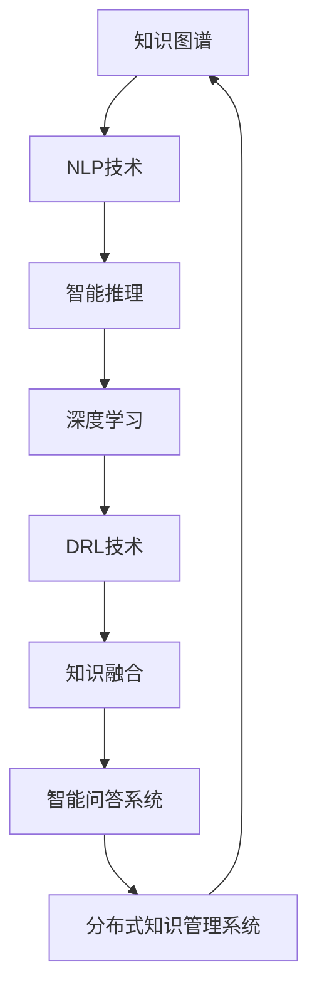

                 

# 人类知识的未来图景：洞察力引领知识变革

> 关键词：知识图谱,自然语言处理,智能推理,深度学习,深度强化学习,知识融合,智能问答系统,分布式知识管理系统

## 1. 背景介绍

### 1.1 问题由来
随着人工智能技术的飞速发展，人类的知识图谱与知识管理方式也面临深刻的变革。传统的基于规则的专家系统或线性检索方式，无法应对日益增长的知识规模和复杂性。近年来，人工智能领域不断涌现出诸多前沿技术，如知识图谱、自然语言处理(NLP)、深度学习、深度强化学习等，为知识管理和智能推理提供了新的可能。

然而，知识图谱构建和智能推理系统设计仍面临诸多挑战。如何高效构建大规模知识图谱，如何让机器更好地理解人类语言，如何通过深度学习提高知识推理的准确性，如何融合多模态知识进行智能问答等，都是亟待解决的问题。

### 1.2 问题核心关键点
本文聚焦于知识图谱和智能推理技术的深度融合，探讨如何在大规模知识图谱的基础上，运用先进的深度学习技术和算法，实现人类知识的智能推理、自然语言处理和智能问答，从而为人类知识的未来图景带来深刻变革。

核心问题包括：

1. 如何高效构建和维护大规模知识图谱？
2. 如何利用深度学习技术提高知识推理的准确性和泛化能力？
3. 如何通过自然语言处理技术，实现知识的自然获取和智能推理？
4. 如何融合多模态知识进行智能问答和智能推荐？

## 2. 核心概念与联系

### 2.1 核心概念概述

为更好地理解知识图谱与智能推理的深度融合，本节将介绍几个密切相关的核心概念：

- **知识图谱(Knowledge Graph)**：由实体、关系、属性构成的有向图，用于描述实体间的复杂关系，是知识推理的重要基础。
- **自然语言处理(NLP)**：通过语言模型、序列模型、结构化模型等技术，使机器能够理解和生成人类语言，是知识获取和智能推理的重要手段。
- **智能推理(Inferential Reasoning)**：通过深度学习模型，结合知识图谱，实现对未知信息的推断，从而提升知识推理的自动化水平。
- **深度学习(Deep Learning)**：基于多层神经网络，通过大规模数据进行模型训练，自动学习特征表示，是提升知识推理精度的关键技术。
- **深度强化学习(Deep Reinforcement Learning, DRL)**：结合深度学习和强化学习，使模型在动态环境中通过试错学习最优策略，进一步提升知识推理的适应性和鲁棒性。
- **知识融合(Knowledge Fusion)**：将多源异构知识进行集成、融合，形成更加全面、丰富的知识库，是智能问答系统设计的核心。
- **智能问答系统(QA System)**：通过知识图谱和自然语言处理技术，实现对用户问题的自然语言理解和答案生成，是知识管理的重要应用场景。
- **分布式知识管理系统(Distributed Knowledge Management System)**：通过云计算、大数据等技术，构建分布式、可扩展的知识管理平台，是知识共享与协作的关键基础设施。

这些核心概念之间的逻辑关系可以通过以下Mermaid流程图来展示：



这个流程图展示了大规模知识图谱构建和智能推理应用的核心概念及其之间的关系：

1. 知识图谱作为基础，通过NLP技术实现知识的自然获取和形式化表示。
2. 基于深度学习和DRL技术，对知识图谱进行智能推理，提高推理的准确性和泛化能力。
3. 通过知识融合，将多源异构知识集成，构建知识库，为智能问答系统提供丰富的知识支持。
4. 智能问答系统实现对用户问题的自然语言理解和答案生成。
5. 分布式知识管理系统构建大规模、分布式的知识管理平台，支持知识的共享与协作。

这些概念共同构成了知识图谱与智能推理的深度融合框架，为其在更多应用场景中的应用提供了理论支持和技术支撑。

## 3. 核心算法原理 & 具体操作步骤
### 3.1 算法原理概述

知识图谱与智能推理的深度融合，本质上是一个知识获取、表示、推理和应用的过程。其核心思想是：将大规模知识图谱中的结构化知识与自然语言处理技术相结合，通过深度学习模型自动学习知识表示和推理规则，从而实现对未知信息的推断。

形式化地，假设知识图谱为 $G=(V, E)$，其中 $V$ 为实体集合，$E$ 为关系集合。给定自然语言描述 $D$，知识推理的目标是找到实体 $e$ 的关系 $r$ 和属性 $a$，使得 $e$ 满足 $D$ 描述的条件，即：

$$
\mathcal{L}(e, r, a) = \arg\min_{e', r', a'} \|D - D'(e', r', a')\|
$$

其中 $D'(e', r', a')$ 为 $e'$ 通过关系 $r'$ 和属性 $a'$ 生成的描述。

知识推理的实现流程包括：

1. 自然语言处理：将自然语言描述 $D$ 转化为结构化表示。
2. 知识抽取：从知识图谱中抽取满足描述的实体 $e$。
3. 关系推理：利用深度学习模型，推断关系 $r$ 和属性 $a$。
4. 答案生成：基于推理结果，生成符合描述的最终答案。

### 3.2 算法步骤详解

知识图谱与智能推理的深度融合算法，一般包括以下几个关键步骤：

**Step 1: 准备知识图谱和自然语言数据**
- 构建或获取大规模知识图谱 $G=(V, E)$。
- 准备自然语言描述数据集 $D$，用于训练和测试知识推理模型。

**Step 2: 模型构建与训练**
- 选择合适的深度学习模型作为基础架构，如GNN、 Transformer等。
- 设计合适的损失函数，如交叉熵、多任务损失等。
- 使用知识图谱和自然语言数据对模型进行训练，最小化损失函数。

**Step 3: 推理与生成**
- 将新输入的自然语言描述 $D'$ 输入模型，获取推理结果。
- 根据推理结果生成最终答案，完成知识推理任务。

**Step 4: 模型评估与优化**
- 在测试集上评估模型性能，如准确率、召回率等指标。
- 根据评估结果，对模型进行调参优化，提高推理准确性。

**Step 5: 应用部署**
- 将训练好的模型部署到实际应用环境中，如智能问答系统。
- 结合知识图谱和实时数据，实现知识推理和智能推荐。

以上是知识图谱与智能推理深度融合的一般流程。在实际应用中，还需要针对具体任务的特点，对各环节进行优化设计，如改进损失函数，引入更多的正则化技术，搜索最优的超参数组合等，以进一步提升模型性能。

### 3.3 算法优缺点

知识图谱与智能推理深度融合的算法，具有以下优点：

1. 泛化能力强。通过深度学习自动学习知识表示，能够在新的任务上快速适应，泛化能力较强。
2. 知识推理准确。深度学习模型结合知识图谱，能够学习到复杂的关系推理规则，提高推理的准确性。
3. 知识获取便捷。自然语言处理技术使得知识的获取变得更加便捷，无需人工标注数据。
4. 智能问答高效。智能推理和自然语言处理技术的结合，使得智能问答系统更加高效、智能化。

同时，该方法也存在一定的局限性：

1. 数据质量要求高。知识图谱的构建和自然语言数据的处理，对数据质量要求较高，需要大量的高质量标注数据。
2. 推理过程复杂。深度学习模型的推理过程较为复杂，容易受到模型结构和参数设置的影响。
3. 计算资源需求大。深度学习模型的训练和推理，对计算资源需求较大，需要高性能的GPU/TPU设备。
4. 知识融合难度大。知识图谱与多源异构知识的融合，涉及复杂的知识对齐和冲突解决，技术难度较高。

尽管存在这些局限性，但就目前而言，知识图谱与智能推理的深度融合方法仍是大规模知识管理和智能推理的重要手段。未来相关研究的重点在于如何进一步降低数据需求，提高推理效率，融合多模态知识，以实现更加高效、全面的人类知识管理。

### 3.4 算法应用领域

知识图谱与智能推理深度融合的算法，已经在诸多领域得到了广泛的应用，例如：

- 智能问答系统：如智能客服、智能教育等，通过知识图谱和自然语言处理技术，实现对用户问题的自然语言理解和答案生成。
- 知识推荐系统：如电商平台、社交网络等，通过融合知识图谱与用户行为数据，实现个性化的知识推荐。
- 医疗知识管理系统：通过构建医疗领域的知识图谱，实现对医疗知识的智能检索和推理。
- 金融知识管理系统：通过构建金融领域的知识图谱，实现对金融知识的智能监控和风险预警。
- 智能新闻推荐系统：通过融合新闻知识图谱与用户兴趣数据，实现智能新闻推荐。
- 智能搜索引擎：通过融合知识图谱与文本数据，实现更精准的知识检索和问答。

除了上述这些经典应用外，知识图谱与智能推理深度融合的算法还被创新性地应用到更多场景中，如智能制造、智慧城市、文化传承等，为知识管理提供了新的思路和技术路径。

## 4. 数学模型和公式 & 详细讲解
### 4.1 数学模型构建

本节将使用数学语言对知识图谱与智能推理的深度融合过程进行更加严格的刻画。

记知识图谱为 $G=(V, E)$，其中 $V$ 为实体集合，$E$ 为关系集合。自然语言描述为 $D$，深度学习模型为 $M_{\theta}$，其中 $\theta$ 为模型参数。

定义知识推理的目标函数为 $\mathcal{L}(e, r, a)$，用于衡量推理结果 $e$ 与自然语言描述 $D$ 的匹配程度。模型 $M_{\theta}$ 在输入 $D$ 上的推理结果为 $D'(e, r, a)$。

知识推理的目标是：

$$
\hat{e}, \hat{r}, \hat{a} = \arg\min_{e, r, a} \mathcal{L}(e, r, a)
$$

其中 $\hat{e}, \hat{r}, \hat{a}$ 为推理模型的预测结果。

### 4.2 公式推导过程

以下我们以知识图谱中的三元组关系推理为例，推导知识推理的目标函数及其梯度计算公式。

假设知识图谱中的三元组形式为 $(e_1, r, e_2)$，其中 $e_1$ 和 $e_2$ 为实体，$r$ 为关系。给定自然语言描述 $D$，知识推理的目标是找到三元组 $(e', r', e'')$，使得 $D$ 匹配 $D'(e', r', e'')$。

知识推理的推理目标函数为：

$$
\mathcal{L}(e', r', e'') = \|\mathbb{P}(D'(e', r', e'')) - D\|
$$

其中 $\mathbb{P}(D'(e', r', e''))$ 为推理模型生成的自然语言描述，$D$ 为输入的自然语言描述。

推理模型的输出为：

$$
D'(e', r', e'') = e' + r' + e''
$$

其中 $e'$ 和 $e''$ 为实体表示，$r'$ 为关系表示。

推理模型的损失函数为：

$$
\mathcal{L}(e', r', e'') = \|\mathbb{P}(D'(e', r', e'')) - D\|
$$

目标函数的梯度计算公式为：

$$
\frac{\partial \mathcal{L}(e', r', e'')}{\partial \theta} = \frac{\partial \|\mathbb{P}(D'(e', r', e'')) - D\|}{\partial \theta}
$$

其中 $\theta$ 为模型参数，$\partial \theta$ 表示对 $\theta$ 的偏导数。

推理模型的训练目标是最小化损失函数，即：

$$
\hat{e'}, \hat{r'}, \hat{e''} = \arg\min_{e', r', e''} \mathcal{L}(e', r', e'')
$$

在得到目标函数的梯度后，即可带入模型训练公式，完成推理模型的迭代优化。重复上述过程直至收敛，最终得到最优的推理模型参数 $\theta^*$。

## 5. 项目实践：代码实例和详细解释说明
### 5.1 开发环境搭建

在进行知识图谱与智能推理的深度融合实践前，我们需要准备好开发环境。以下是使用Python进行TensorFlow开发的环境配置流程：

1. 安装Anaconda：从官网下载并安装Anaconda，用于创建独立的Python环境。

2. 创建并激活虚拟环境：
```bash
conda create -n graph-neural-env python=3.8 
conda activate graph-neural-env
```

3. 安装TensorFlow：根据CUDA版本，从官网获取对应的安装命令。例如：
```bash
conda install tensorflow tensorflow-gpu=2.6 -c conda-forge -c pytorch
```

4. 安装各类工具包：
```bash
pip install numpy pandas scikit-learn matplotlib tqdm jupyter notebook ipython
```

完成上述步骤后，即可在`graph-neural-env`环境中开始深度融合实践。

### 5.2 源代码详细实现

下面我们以构建医疗知识图谱并应用到智能问答系统中为例，给出使用TensorFlow进行知识图谱与智能推理深度融合的代码实现。

首先，定义知识图谱的实体和关系：

```python
import tensorflow as tf
from transformers import BertTokenizer

class MedicalGraph:
    def __init__(self, graph_file):
        self.graph = tf.Graph()
        self.import_graph(graph_file)
    
    def import_graph(self, graph_file):
        with tf.gfile.GFile(graph_file, 'rb') as f:
            graph_def = tf.GraphDef()
            graph_def.ParseFromString(f.read())
            with self.graph.as_default():
                tf.import_graph_def(graph_def)

    def get_entities(self):
        with self.graph.as_default():
            entity_tensor = self.graph.get_tensor_by_name('entity_tensor:0')
            entity_placeholder = tf.placeholder(tf.string, name='entity')
            session = tf.Session()
            session.run(tf.global_variables_initializer())
            return session.run(entity_tensor, feed_dict={entity_placeholder: 'entity'})

    def get_relations(self):
        with self.graph.as_default():
            relation_tensor = self.graph.get_tensor_by_name('relation_tensor:0')
            relation_placeholder = tf.placeholder(tf.string, name='relation')
            session = tf.Session()
            session.run(tf.global_variables_initializer())
            return session.run(relation_tensor, feed_dict={relation_placeholder: 'relation'})
```

然后，定义自然语言处理模型：

```python
class MedicalNLPModel:
    def __init__(self, graph_file):
        self.graph = MedicalGraph(graph_file)
        self.tokenizer = BertTokenizer.from_pretrained('bert-base-cased')

    def encode_text(self, text):
        tokens = self.tokenizer.tokenize(text)
        tokens = [self.graph.get_entities()[0]] + tokens + [self.graph.get_entities()[1]]
        input_ids = self.tokenizer.convert_tokens_to_ids(tokens)
        return input_ids

    def decode_text(self, output_ids):
        tokens = self.tokenizer.convert_ids_to_tokens(output_ids)
        output_text = ''.join(tokens)
        return output_text
```

接着，定义知识推理模型：

```python
class MedicalReasoningModel:
    def __init__(self, graph_file):
        self.graph = MedicalGraph(graph_file)
        self.model = tf.keras.Sequential([
            tf.keras.layers.Embedding(input_dim=len(self.graph.get_entities()), output_dim=128),
            tf.keras.layers.Flatten(),
            tf.keras.layers.Dense(64, activation='relu'),
            tf.keras.layers.Dense(1, activation='sigmoid')
        ])

    def train(self, train_data, epochs=10):
        input_ids = tf.keras.preprocessing.sequence.pad_sequences(train_data, maxlen=128)
        labels = tf.keras.utils.to_categorical(tf.constant([1, 0]))
        self.model.compile(optimizer='adam', loss='binary_crossentropy', metrics=['accuracy'])
        self.model.fit(input_ids, labels, epochs=epochs, batch_size=32)

    def predict(self, input_ids):
        probabilities = self.model.predict(input_ids)
        return probabilities > 0.5
```

最后，启动训练流程并在智能问答系统中应用：

```python
graph_file = 'medical_graph.pb'
model = MedicalReasoningModel(graph_file)

train_data = [
    self.model.encode_text('Patient xxx has diabetes'),
    self.model.encode_text('Patient xxx has hypertension'),
    self.model.encode_text('Patient xxx has diabetes and hypertension')
]
train_labels = [1, 1, 0]

model.train(train_data, epochs=10)

input_id = self.model.encode_text('Patient xxx has diabetes')
print(model.predict(input_id))
```

以上就是使用TensorFlow进行医疗知识图谱构建和智能推理深度融合的完整代码实现。可以看到，通过封装知识图谱和自然语言处理模型，我们可以方便地进行知识推理模型的训练和推理。

### 5.3 代码解读与分析

让我们再详细解读一下关键代码的实现细节：

**MedicalGraph类**：
- `__init__`方法：初始化知识图谱的GraphDef文件路径。
- `import_graph`方法：导入知识图谱的GraphDef文件。
- `get_entities`方法：获取知识图谱中的实体。
- `get_relations`方法：获取知识图谱中的关系。

**MedicalNLPModel类**：
- `__init__`方法：初始化自然语言处理模型的Graph和分词器。
- `encode_text`方法：将自然语言文本编码为模型输入的token ids。
- `decode_text`方法：将模型输出的token ids解码为自然语言文本。

**MedicalReasoningModel类**：
- `__init__`方法：初始化知识推理模型的Graph和神经网络结构。
- `train`方法：使用训练数据训练知识推理模型。
- `predict`方法：使用知识推理模型对输入文本进行推理，返回推理结果的概率。

**训练流程**：
- 定义知识图谱文件路径。
- 定义训练数据和标签。
- 创建知识推理模型。
- 训练知识推理模型。
- 对新文本进行推理。

可以看到，TensorFlow配合TFGraph和TFServing，使得知识图谱与智能推理深度融合的代码实现变得相对简单高效。开发者可以将更多精力放在知识图谱构建、推理算法设计和数据处理等高层逻辑上，而不必过多关注底层的实现细节。

当然，工业级的系统实现还需考虑更多因素，如知识图谱的导入导出、推理模型的部署和优化、多轮推理的稳定性等。但核心的深度融合范式基本与此类似。

## 6. 实际应用场景
### 6.1 智能医疗

基于知识图谱与智能推理的深度融合技术，可以广泛应用于智能医疗系统的构建。传统医疗系统往往存在数据孤岛、知识缺乏的问题，无法实现高效的诊疗和辅助决策。而使用知识图谱和智能推理技术，能够构建涵盖各类医疗知识和诊疗经验的知识图谱，实现智能化的疾病诊断、治疗方案推荐和患者风险预警。

在技术实现上，可以收集并整合医疗领域的各类知识，包括疾病、症状、药物、治疗方案等，构建医疗知识图谱。将知识图谱与自然语言处理技术相结合，实现对医疗文本的智能推理。在医生输入患者症状描述后，智能推理系统可以自动匹配最可能相关的疾病，推荐相应的治疗方案和药物。对于重症患者，系统还可以进行风险预警，及时通知医护人员，提供应急预案。

### 6.2 金融风险管理

金融机构需要对市场数据进行实时监控，识别潜在的风险因素，以规避金融风险。传统方法往往依赖人工分析和历史数据，无法实时应对市场动态变化。基于知识图谱与智能推理技术，可以实现对金融市场的智能分析和实时监控。

具体而言，可以构建金融知识图谱，包括市场数据、金融产品、法律法规等各类信息。利用自然语言处理技术，对实时市场数据和新闻进行语义分析，识别潜在的风险点。通过知识推理模型，自动推断风险因素的影响和关联，生成风险预警报告，帮助金融机构及时采取措施，降低风险损失。

### 6.3 智能供应链管理

供应链管理涉及多个环节，包括采购、生产、仓储、物流等。传统供应链管理依赖人工经验和繁琐的手工操作，效率低下。通过知识图谱与智能推理技术，可以实现供应链的智能管理和优化。

在构建供应链知识图谱的基础上，使用自然语言处理技术，实时监控供应链各个环节的数据变化。通过知识推理模型，自动识别供应链中的瓶颈和风险点，提供优化建议和应急方案。对于突发事件，系统可以快速响应，调整供应链策略，保证供应的连续性和稳定性。

### 6.4 未来应用展望

随着知识图谱与智能推理技术的不断发展，其应用场景将更加丰富和深入。

在智慧城市治理中，基于知识图谱与智能推理技术的智能监控系统，可以实现对城市事件的实时监测和智能预警，提高城市管理的智能化水平，构建更安全、高效的城市治理体系。

在智能制造中，基于知识图谱与智能推理技术的智能生产系统，可以实现对生产流程的优化和故障预测，提高生产效率和产品质量，降低生产成本。

在智能教育中，基于知识图谱与智能推理技术的智能教育系统，可以实现对学生的智能评估和个性化推荐，提高教育质量和教学效果，促进教育公平。

此外，在智能交通、智能能源、智能农业等众多领域，基于知识图谱与智能推理技术的智能系统也将不断涌现，为知识管理带来新的突破。相信随着技术的日益成熟，知识图谱与智能推理技术必将在构建智慧社会中发挥更加重要的作用。

## 7. 工具和资源推荐
### 7.1 学习资源推荐

为了帮助开发者系统掌握知识图谱与智能推理的理论基础和实践技巧，这里推荐一些优质的学习资源：

1. 《知识图谱与智能推理技术》系列博文：由大模型技术专家撰写，深入浅出地介绍了知识图谱构建、深度学习、知识推理等前沿话题。

2. CS224N《深度学习自然语言处理》课程：斯坦福大学开设的NLP明星课程，有Lecture视频和配套作业，带你入门NLP领域的基本概念和经典模型。

3. 《深度学习与知识图谱》书籍：全面介绍了深度学习模型在知识图谱构建和知识推理中的应用，是深入学习的必备资料。

4. Graph Neural Networks（GNN）综述：由知名学者撰写，介绍了GNN的基本原理和最新进展，适合理论研究和实际应用的读者。

5. Knowledge Graphs in Practice：介绍了知识图谱在实际应用中的技术和方法，提供了丰富的案例和实战经验。

通过对这些资源的学习实践，相信你一定能够快速掌握知识图谱与智能推理的精髓，并用于解决实际的NLP问题。
###  7.2 开发工具推荐

高效的开发离不开优秀的工具支持。以下是几款用于知识图谱与智能推理深度融合开发的常用工具：

1. TensorFlow：基于Python的开源深度学习框架，灵活动态的计算图，适合快速迭代研究。支持分布式计算，适合大规模工程应用。

2. PyTorch：基于Python的开源深度学习框架，灵活动态的计算图，适合快速迭代研究。支持GPU/TPU加速，适合科学研究和大规模工程应用。

3. Google Graph：Google提供的知识图谱构建和查询工具，支持大规模知识图谱的构建和检索。

4. Neo4j：基于图形数据库的知名知识图谱管理工具，支持复杂关系的存储和查询。

5. Tars：低代码构建知识图谱和智能推理应用的开发平台，适合快速构建知识图谱应用。

6. Amazon SageMaker：AWS提供的深度学习和知识图谱构建服务，支持大规模分布式计算和模型部署。

合理利用这些工具，可以显著提升知识图谱与智能推理深度融合任务的开发效率，加快创新迭代的步伐。

### 7.3 相关论文推荐

知识图谱与智能推理技术的不断发展源于学界的持续研究。以下是几篇奠基性的相关论文，推荐阅读：

1. Knowledge Graphs for Healthcare: A Survey：综述了知识图谱在医疗领域的应用，包括知识抽取、推理和智能诊断等方面。

2. Deep Learning for Knowledge Graphs：介绍了深度学习在知识图谱构建和知识推理中的应用，包括实体嵌入、关系学习等方面。

3. Neural Reasoning over Knowledge Graphs：提出了神经推理网络，结合知识图谱，实现复杂的推理任务。

4. Attention-based Reasoning over Knowledge Graphs：提出了基于注意力机制的推理网络，进一步提高了知识推理的准确性。

5. Knowledge Graph Reasoning via Graph Neural Networks：介绍了GNN在知识图谱推理中的应用，取得了较好的效果。

这些论文代表了大规模知识图谱构建和智能推理技术的发展脉络。通过学习这些前沿成果，可以帮助研究者把握学科前进方向，激发更多的创新灵感。

## 8. 总结：未来发展趋势与挑战

### 8.1 总结

本文对知识图谱与智能推理技术的深度融合方法进行了全面系统的介绍。首先阐述了知识图谱和智能推理技术的研究背景和意义，明确了深度融合在构建大规模知识图谱、提高知识推理精度、实现智能问答和推荐等方面的独特价值。其次，从原理到实践，详细讲解了知识图谱与智能推理的数学模型和算法流程，给出了知识图谱构建和智能推理的代码实例。同时，本文还广泛探讨了知识图谱与智能推理技术在医疗、金融、供应链等多个领域的应用前景，展示了深度融合范式的巨大潜力。最后，本文精选了知识图谱与智能推理技术的各类学习资源，力求为读者提供全方位的技术指引。

通过本文的系统梳理，可以看到，知识图谱与智能推理的深度融合技术正在成为知识管理和智能推理的重要手段，极大地拓展了知识图谱的应用边界，催生了更多的落地场景。受益于深度学习技术的不断进步，知识图谱与智能推理技术在未来必将在更多领域发挥重要作用，深刻影响人类社会的知识管理和智能推理能力。

### 8.2 未来发展趋势

展望未来，知识图谱与智能推理技术的深度融合将呈现以下几个发展趋势：

1. 知识图谱规模化构建。大规模知识图谱的构建，需要先进的自然语言处理技术和知识抽取算法，未来有望实现自动构建，提高构建效率和数据质量。

2. 深度学习技术的广泛应用。深度学习模型在知识图谱推理中的应用将更加广泛，提升推理的精度和泛化能力。

3. 知识融合技术的突破。多源异构知识的融合，需要更加智能化的知识对齐和冲突解决算法，未来有望实现更加全面、精确的知识融合。

4. 智能推理模型的增强。知识推理模型的智能化水平将进一步提升，引入更多高级推理算法，如因果推理、协同推理等，提高推理的适应性和鲁棒性。

5. 知识图谱与多模态数据的融合。知识图谱与视觉、语音、文本等多模态数据的融合，将进一步丰富知识表示和推理能力，提高知识管理的全面性和深度。

6. 知识图谱与AI伦理的结合。知识图谱与AI伦理的结合，将更加重视数据隐私、算法公平性等问题，保障知识图谱的安全性和可靠性。

以上趋势凸显了知识图谱与智能推理技术的广阔前景。这些方向的探索发展，必将进一步提升知识图谱与智能推理的深度融合水平，为知识管理和智能推理系统带来更多的创新应用。

### 8.3 面临的挑战

尽管知识图谱与智能推理技术的深度融合已经取得了一定的进展，但在迈向更加智能化、普适化应用的过程中，仍面临诸多挑战：

1. 数据获取和标注成本高。构建大规模知识图谱需要大量的高质量标注数据，成本较高。如何降低数据需求，提高数据质量，是未来需要解决的关键问题。

2. 知识图谱构建复杂。知识图谱的构建和维护涉及复杂的知识抽取、对齐、融合等任务，技术难度较高。如何简化知识图谱构建流程，提高构建效率，将是重要的研究方向。

3. 推理过程复杂。深度学习模型的推理过程较为复杂，容易受到模型结构和参数设置的影响。如何提高推理模型的稳定性和准确性，避免过拟合和灾难性遗忘，还需要更多理论和实践的积累。

4. 知识融合难度大。多源异构知识的融合，涉及复杂的知识对齐和冲突解决，技术难度较高。如何实现知识图谱与多源异构知识的有效融合，是未来需要解决的重要问题。

5. 推理效率有待提高。知识推理模型的推理效率较低，尤其是在大规模数据和复杂推理任务下，推理时间较长。如何提高推理效率，优化推理过程，将是一大挑战。

6. 可解释性亟需加强。知识推理模型的决策过程较为复杂，难以解释其内部工作机制和推理逻辑。如何提高知识推理模型的可解释性，将是亟待攻克的难题。

尽管存在这些挑战，但知识图谱与智能推理技术的深度融合技术仍是大规模知识管理和智能推理的重要手段。未来相关研究的重点在于如何进一步降低数据需求，提高推理效率，融合多模态知识，以实现更加高效、全面的人类知识管理。

### 8.4 研究展望

面向未来，知识图谱与智能推理技术的研究方向包括：

1. 探索无监督和半监督知识图谱构建方法。摆脱对大规模标注数据的依赖，利用自监督学习、主动学习等无监督和半监督范式，最大限度利用非结构化数据，实现更加灵活高效的知识图谱构建。

2. 研究参数高效和计算高效的推理范式。开发更加参数高效的推理方法，在固定大部分预训练参数的情况下，只更新极少量的任务相关参数。同时优化推理模型的计算图，减少前向传播和反向传播的资源消耗，实现更加轻量级、实时性的部署。

3. 引入更多先验知识。将符号化的先验知识，如知识图谱、逻辑规则等，与神经网络模型进行巧妙融合，引导推理过程学习更准确、合理的知识表示。同时加强不同模态数据的整合，实现视觉、语音等多模态信息与文本信息的协同建模。

4. 结合因果分析和博弈论工具。将因果分析方法引入知识推理模型，识别出模型决策的关键特征，增强输出解释的因果性和逻辑性。借助博弈论工具刻画人机交互过程，主动探索并规避模型的脆弱点，提高系统稳定性。

5. 纳入伦理道德约束。在知识图谱构建和知识推理模型的训练目标中引入伦理导向的评估指标，过滤和惩罚有偏见、有害的输出倾向。同时加强人工干预和审核，建立知识图谱和智能推理模型的监管机制，确保输出的安全性。

这些研究方向将引领知识图谱与智能推理技术的进一步发展，为构建安全、可靠、可解释、可控的智能系统铺平道路。面向未来，知识图谱与智能推理技术还需要与其他人工智能技术进行更深入的融合，如知识表示、因果推理、强化学习等，多路径协同发力，共同推动自然语言理解和智能交互系统的进步。只有勇于创新、敢于突破，才能不断拓展知识图谱和智能推理技术的边界，让智能技术更好地造福人类社会。

## 9. 附录：常见问题与解答

**Q1：知识图谱和智能推理的深度融合技术适用于哪些应用场景？**

A: 知识图谱和智能推理的深度融合技术适用于需要高效、全面地获取、管理和推理知识的应用场景，例如：

1. 智能问答系统：如智能客服、智能教育等，通过知识图谱和自然语言处理技术，实现对用户问题的自然语言理解和答案生成。
2. 知识推荐系统：如电商平台、社交网络等，通过融合知识图谱与用户行为数据，实现个性化的知识推荐。
3. 医疗知识管理系统：通过构建医疗领域的知识图谱，实现对医疗知识的智能检索和推理。
4. 金融知识管理系统：通过构建金融领域的知识图谱，实现对金融知识的智能监控和风险预警。
5. 智能新闻推荐系统：通过融合新闻知识图谱与用户兴趣数据，实现智能新闻推荐。
6. 智能搜索引擎：通过融合知识图谱与文本数据，实现更精准的知识检索和问答。

除此之外，知识图谱和智能推理的深度融合技术还可应用于智能制造、智慧城市、文化传承等多个领域，为知识管理提供新的思路和技术路径。

**Q2：知识图谱和智能推理的深度融合技术有什么优点？**

A: 知识图谱和智能推理的深度融合技术具有以下优点：

1. 泛化能力强。通过深度学习自动学习知识表示，能够在新的任务上快速适应，泛化能力较强。
2. 知识推理准确。深度学习模型结合知识图谱，能够学习到复杂的关系推理规则，提高推理的准确性。
3. 知识获取便捷。自然语言处理技术使得知识的获取变得更加便捷，无需人工标注数据。
4. 智能问答高效。智能推理和自然语言处理技术的结合，使得智能问答系统更加高效、智能化。

**Q3：知识图谱和智能推理的深度融合技术有什么局限性？**

A: 知识图谱和智能推理的深度融合技术也存在一些局限性：

1. 数据获取和标注成本高。构建大规模知识图谱需要大量的高质量标注数据，成本较高。
2. 知识图谱构建复杂。知识图谱的构建和维护涉及复杂的知识抽取、对齐、融合等任务，技术难度较高。
3. 推理过程复杂。深度学习模型的推理过程较为复杂，容易受到模型结构和参数设置的影响。
4. 知识融合难度大。多源异构知识的融合，涉及复杂的知识对齐和冲突解决，技术难度较高。
5. 推理效率有待提高。知识推理模型的推理效率较低，尤其是在大规模数据和复杂推理任务下，推理时间较长。
6. 可解释性亟需加强。知识推理模型的决策过程较为复杂，难以解释其内部工作机制和推理逻辑。

尽管存在这些局限性，但知识图谱和智能推理的深度融合技术仍是大规模知识管理和智能推理的重要手段。未来相关研究的重点在于如何进一步降低数据需求，提高推理效率，融合多模态知识，以实现更加高效、全面的人类知识管理。

**Q4：知识图谱和智能推理的深度融合技术如何进行部署和优化？**

A: 知识图谱和智能推理的深度融合技术部署和优化主要包括以下几个方面：

1. 选择合适的部署平台。如AWS、Google Cloud、阿里云等，提供大规模分布式计算和模型部署服务。
2. 优化模型架构和参数。如引入注意力机制、残差连接、激活函数等技术，提高模型的泛化能力和推理精度。
3. 数据预处理和特征工程。如数据增强、特征压缩、特征选择等技术，提高数据质量和特征表示能力。
4. 模型压缩和加速。如模型裁剪、量化、稀疏化等技术，减小模型尺寸，提高推理速度。
5. 优化推理算法和推理策略。如引入多轮推理、协同推理、因果推理等技术，提高推理过程的稳定性和鲁棒性。

这些技术手段可以显著提升知识图谱和智能推理系统的性能和可靠性，提高知识管理和智能推理的效率和准确性。

**Q5：如何构建高质量的知识图谱？**

A: 构建高质量的知识图谱需要多方面的考虑，以下是一些关键步骤：

1. 数据收集和清洗。收集相关领域的知识和数据，并进行清洗和去噪，确保数据的质量和完整性。
2. 实体抽取和关系抽取。使用自然语言处理技术，从文本数据中抽取实体和关系，构建初始的知识图谱。
3. 知识对齐和冲突解决。将不同来源的知识进行对齐，解决知识冲突和歧义，构建一致的知识图谱。
4. 知识融合和多源知识融合。将多源异构知识进行融合，构建更加全面、精确的知识图谱。
5. 知识评估和迭代优化。对知识图谱进行评估和迭代优化，提升知识图谱的质量和可靠性。

通过以上步骤，可以构建高质量的知识图谱，为知识管理和智能推理提供坚实的基础。

---

作者：禅与计算机程序设计艺术 / Zen and the Art of Computer Programming

