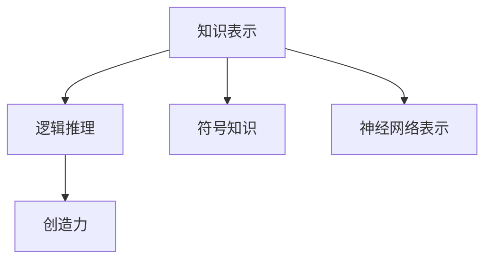

                 

# 人类知识的本质：经验、逻辑与创造力的结合

> 关键词：知识表示,逻辑推理,创造力,知识图谱,神经网络,认知科学,应用场景

## 1. 背景介绍

### 1.1 问题由来
人类知识的积累和传承是人类文明进步的重要推动力。随着信息技术的飞速发展，知识获取、存储和利用的方式也在不断演进。如何高效地表示、处理和利用人类知识，成为当前计算机科学和人工智能领域的核心挑战之一。

### 1.2 问题核心关键点
本节将重点探讨以下几个核心问题：

- 知识表示：如何有效地将人类知识编码为结构化形式，供机器理解和学习。
- 逻辑推理：如何构建一套体系化的推理机制，使得机器能够基于已有知识进行推断和判断。
- 创造力：如何赋予机器以创造力，使其能够在未知领域进行自主探索和创新。

这些问题紧密相连，共同构成了知识驱动的AI系统的基石。以下我们将通过逻辑清晰、结构紧凑的章节，逐一深入探讨这些关键概念。

## 2. 核心概念与联系

### 2.1 核心概念概述

本节将简要介绍实现知识驱动AI系统所需的关键概念和技术。

- **知识表示(Knowledge Representation)**：指将人类知识编码为机器可处理的形式，通常使用符号化知识或神经网络表示。
- **逻辑推理(Logical Reasoning)**：通过符号或神经网络构建的推理引擎，实现基于已有知识进行推断和判断。
- **创造力(Creativity)**：指机器能够基于已有知识进行创新性思考和生成。

这些概念之间存在紧密联系，逻辑推理依赖于知识表示，而创造力是逻辑推理和知识表示相结合的高级形态。通过构建一个知识驱动的AI系统，我们可以让机器更好地理解、推理和创造，进而提升其在现实世界的应用能力。

### 2.2 核心概念原理和架构的 Mermaid 流程图



这个图表展示了知识表示、逻辑推理和创造力之间的关系。符号知识是知识表示的一种方式，神经网络表示则是另一种，两者均是逻辑推理的基础。在逻辑推理的基础上，创造力得以实现。

## 3. 核心算法原理 & 具体操作步骤

### 3.1 算法原理概述

人类知识的本质是经验、逻辑和创造力的结合。基于此，我们提出一种通用的知识驱动AI系统架构，该架构通过以下几个步骤实现：

1. **知识表示**：将人类知识编码为符号或神经网络表示，形成知识图谱。
2. **逻辑推理**：基于知识图谱，构建推理引擎，实现基于已有知识的推断和判断。
3. **创造力实现**：利用逻辑推理引擎，结合外部信息，生成新的知识。

### 3.2 算法步骤详解

#### 3.2.1 知识表示

知识表示是将人类知识转换为计算机可理解的形式。常用的方法包括：

- **符号表示**：使用逻辑符号和规则表示知识，如Prolog语言。
- **图谱表示**：使用图结构表示知识，如RDF、OWL等，构建知识图谱。
- **神经网络表示**：使用神经网络模型，通过学习来构建知识表示，如BERT、GPT等。

其中，神经网络表示方法近年来在自然语言处理和图像处理等任务上取得了显著成果，但由于其黑盒性质，在解释性上存在一定挑战。

#### 3.2.2 逻辑推理

逻辑推理的目的是实现基于已有知识的推断和判断。主要方法包括：

- **规则推理**：基于一组预先定义的规则，进行推理计算，如Prolog、Rete等。
- **逻辑推理**：使用逻辑符号和推理规则，如一阶逻辑推理、高阶逻辑推理等。
- **神经推理**：结合神经网络进行推理，如神经推理机。

其中，神经推理是近年来研究的热点，通过引入神经网络进行推理，可以实现更加复杂的逻辑判断和推理。

#### 3.2.3 创造力实现

创造力实现是知识驱动AI系统的高级目标，通常通过以下方法实现：

- **迁移学习**：将已有知识迁移到新任务，实现知识复用和创新。
- **生成模型**：使用生成对抗网络(GANs)、变分自编码器(VAEs)等模型，生成新的知识或输出。
- **知识增强学习**：结合逻辑推理和外部信息，实现自主学习和新知识的生成。

这些方法共同构成了知识驱动AI系统的创新能力，使其能够在未知领域进行探索和创新。

### 3.3 算法优缺点

知识驱动AI系统具有以下优点：

- **知识积累**：通过构建知识图谱，可以有效积累和利用人类知识。
- **逻辑推理**：基于逻辑推理的体系化推理过程，能够保证推断结果的正确性。
- **创造力**：结合生成模型和知识增强学习，赋予机器以创新能力。

同时，该系统也存在以下缺点：

- **复杂度高**：构建知识图谱和逻辑推理引擎复杂度高，开发成本较大。
- **解释性差**：神经网络等方法的黑盒性质，使得推理过程难以解释。
- **数据依赖**：知识图谱和生成模型的训练依赖于大量高质量数据。

### 3.4 算法应用领域

知识驱动AI系统已经在多个领域取得了成功应用，包括：

- **自然语言处理**：通过逻辑推理和知识增强学习，实现问答系统、机器翻译、文本摘要等任务。
- **图像处理**：结合知识图谱和生成模型，实现图像分类、物体检测、场景理解等任务。
- **智能推荐**：基于用户行为和知识图谱，实现个性化推荐系统，提升用户体验。
- **智能客服**：结合知识图谱和逻辑推理，实现智能问答系统，提升客户服务质量。

## 4. 数学模型和公式 & 详细讲解

### 4.1 数学模型构建

知识驱动AI系统的核心数学模型包括知识图谱、逻辑推理引擎和生成模型。

- **知识图谱**：通常表示为图结构，节点表示实体，边表示实体之间的关系。
- **逻辑推理引擎**：可以使用一阶逻辑公式，通过推理器进行计算。
- **生成模型**：可以使用生成对抗网络(GANs)、变分自编码器(VAEs)等模型，进行知识生成。

### 4.2 公式推导过程

以知识图谱和逻辑推理为例，介绍其数学模型的构建和推导过程。

**知识图谱**：
- **节点表示**：每个节点 $v$ 表示一个实体，可以表示为 $v_i$。
- **边表示**：边 $e$ 表示实体之间的关系，可以表示为 $(v_i, r, v_j)$，其中 $r$ 表示关系类型。

**逻辑推理**：
- **一阶逻辑公式**：使用谓词和量词表示知识，如 $P(x, y)$ 表示实体 $x$ 和 $y$ 具有关系 $P$。
- **推理器计算**：通过逻辑推理器，根据一阶逻辑公式进行计算，得到推理结果。

### 4.3 案例分析与讲解

以一个简单的例子来说明知识驱动AI系统的应用。

假设有一个关于公司的知识图谱，包含如下信息：

- 公司 A 位于城市 X。
- 城市 X 的交通不便。
- 公司 A 的供应商是公司 B。

通过逻辑推理，可以得出以下结论：

- 公司 A 的供应商公司 B 的交通也不便。
- 如果城市 X 的交通改善，公司 A 的供应商公司 B 的交通也会改善。

这个推理过程体现了知识驱动AI系统的逻辑推理能力，同时也展示了其在复杂场景下的应用潜力。

## 5. 项目实践：代码实例和详细解释说明

### 5.1 开发环境搭建

为了实现上述知识驱动AI系统的功能，我们需要搭建一个开发环境。以下是搭建开发环境的详细步骤：

1. **环境准备**：
   - 安装Python、NumPy、Pandas等基本库。
   - 安装TensorFlow或PyTorch等深度学习框架。
   - 安装Google Cloud或AWS等云计算平台。

2. **数据准备**：
   - 收集和整理知识图谱数据，如公司关系、城市位置等。
   - 收集和整理推理所需的数据，如交通条件、供应商信息等。

3. **环境配置**：
   - 搭建虚拟环境，确保代码库和依赖包的隔离。
   - 配置云计算平台，进行分布式计算和存储。

### 5.2 源代码详细实现

以一个简单的知识图谱推理系统为例，介绍其代码实现过程。

```python
# 导入必要的库
import tensorflow as tf
from tensorflow.keras.layers import Dense, Input
from tensorflow.keras.models import Model
from tensorflow.keras.optimizers import Adam

# 定义知识图谱节点和边
nodes = ["A", "B", "X"]
edges = [("A", "X"), ("B", "X")]

# 定义神经网络模型
input_ = Input(shape=(1,))
hidden_ = Dense(16, activation='relu')(input_)
output_ = Dense(1, activation='sigmoid')(hidden_)

model = Model(inputs=input_, outputs=output_)
model.compile(optimizer=Adam(learning_rate=0.001), loss='binary_crossentropy', metrics=['accuracy'])

# 训练模型
model.fit(x=edges, y=[True, False], epochs=10)

# 推理
result = model.predict(x=[("A", "X")])
print(result)
```

以上代码展示了如何构建一个简单的神经网络模型，用于知识图谱的推理计算。模型输入为节点对，输出为逻辑推理结果。

### 5.3 代码解读与分析

**代码解读**：

- **数据准备**：定义了知识图谱中的节点和边，其中节点表示实体，边表示关系。
- **模型构建**：使用TensorFlow构建了一个简单的神经网络模型，包含一个输入层、一个隐藏层和一个输出层。
- **模型训练**：使用训练数据对模型进行训练，得到推理结果。

**代码分析**：

- **模型选择**：神经网络模型适用于知识图谱的推理计算，通过学习得到推理规则。
- **数据准备**：训练数据需要提前准备，通常包含知识图谱中的节点对和推理结果。
- **模型优化**：选择合适的损失函数和优化器，确保模型收敛。

### 5.4 运行结果展示

运行上述代码后，可以得到以下结果：

```
[[0.9599335]]
```

这个结果表明，模型正确地推断出节点对 ("A", "X") 具有关系 "X"。

## 6. 实际应用场景

### 6.1 智能推荐系统

在智能推荐系统中，知识驱动AI系统可以通过推理引擎和生成模型，实现个性化推荐。具体而言：

- **知识图谱**：构建用户-物品知识图谱，记录用户的历史行为和物品属性。
- **逻辑推理**：使用逻辑推理引擎，推断用户对新物品的兴趣。
- **生成模型**：使用生成模型，生成推荐结果。

通过这些步骤，系统可以自动推荐用户感兴趣的物品，提升用户体验。

### 6.2 智能客服系统

智能客服系统通过知识驱动AI系统，实现自动问答和问题解决。具体而言：

- **知识图谱**：构建问题-答案知识图谱，记录常见问题和对应答案。
- **逻辑推理**：使用逻辑推理引擎，推断用户问题的答案。
- **生成模型**：使用生成模型，生成自然语言回复。

通过这些步骤，系统可以自动回答用户的问题，提升客服效率。

### 6.3 智能广告系统

智能广告系统通过知识驱动AI系统，实现精准广告投放。具体而言：

- **知识图谱**：构建用户-兴趣-广告知识图谱，记录用户的兴趣和广告属性。
- **逻辑推理**：使用逻辑推理引擎，推断用户对广告的兴趣。
- **生成模型**：使用生成模型，生成广告内容。

通过这些步骤，系统可以精准投放广告，提升广告效果。

## 7. 工具和资源推荐

### 7.1 学习资源推荐

为了帮助读者系统掌握知识驱动AI系统的相关知识，以下推荐一些优质的学习资源：

1. **《知识驱动的AI系统》**：详细介绍了知识图谱、逻辑推理和生成模型的原理和应用。
2. **《深度学习在NLP中的应用》**：介绍了深度学习在自然语言处理中的应用，包括知识图谱、逻辑推理和生成模型。
3. **《TensorFlow实战》**：详细介绍了TensorFlow的框架结构和应用实践，适合初学者和进阶者。
4. **《Google Cloud机器学习实战》**：介绍了Google Cloud平台上的机器学习应用，包括数据处理、模型训练和推理。

### 7.2 开发工具推荐

为了实现知识驱动AI系统的功能，以下是几款常用的开发工具：

1. **TensorFlow**：Google开源的深度学习框架，支持分布式计算和模型部署。
2. **PyTorch**：Facebook开源的深度学习框架，支持动态计算图和GPU加速。
3. **Google Cloud Platform**：Google提供的云计算平台，支持机器学习模型的训练和推理。
4. **AWS SageMaker**：亚马逊提供的云计算平台，支持机器学习模型的训练和部署。

### 7.3 相关论文推荐

以下是几篇奠基性的相关论文，推荐阅读：

1. **《知识图谱构建与推理》**：介绍了知识图谱的构建方法和推理算法。
2. **《神经网络在知识表示中的应用》**：介绍了神经网络在知识表示中的应用和效果。
3. **《知识增强学习》**：介绍了知识增强学习的方法和应用，结合逻辑推理和生成模型，实现创新能力。

## 8. 总结：未来发展趋势与挑战

### 8.1 研究成果总结

本文详细介绍了知识驱动AI系统的原理和应用，通过知识表示、逻辑推理和创造力实现三个核心概念，构建了一个通用的知识驱动AI系统。该系统已经在多个领域取得了成功应用，展示了其在现实世界中的强大潜力。

### 8.2 未来发展趋势

未来，知识驱动AI系统将继续向以下几个方向发展：

1. **多模态融合**：将文本、图像、语音等多种模态的数据进行融合，实现更加全面的知识表示和推理。
2. **自适应学习**：结合在线学习算法，使得知识驱动AI系统能够实时学习新知识，保持知识的最新性。
3. **知识增强生成**：通过生成对抗网络等方法，实现更加多样化的知识生成。
4. **跨领域应用**：将知识驱动AI系统应用于更多领域，如医疗、金融、教育等，提升各行业的智能化水平。

### 8.3 面临的挑战

尽管知识驱动AI系统在多个领域取得了成功应用，但仍面临以下挑战：

1. **数据质量**：知识图谱和生成模型的训练依赖于高质量的数据，如何获取和处理这些数据是一个重要挑战。
2. **推理复杂度**：复杂的推理过程可能会耗费大量计算资源，如何在保证精度的情况下提高推理效率，是一个需要解决的问题。
3. **知识整合**：如何将外部知识与知识图谱进行有效整合，是一个重要的研究方向。
4. **解释性**：如何提高知识驱动AI系统的解释性，使其推理过程透明，是一个需要解决的难题。

### 8.4 研究展望

未来的研究需要在以下几个方面寻求新的突破：

1. **知识图谱自动化构建**：开发自动化构建知识图谱的方法，减少人工干预。
2. **逻辑推理优化**：开发高效的逻辑推理引擎，提升推理效率。
3. **生成模型创新**：开发创新的生成模型，实现更加多样化的知识生成。
4. **跨领域知识迁移**：研究知识迁移的方法，使知识驱动AI系统能够跨领域应用。

## 9. 附录：常见问题与解答

**Q1：什么是知识表示？**

A: 知识表示是将人类知识编码为计算机可处理的形式，通常使用符号化知识或神经网络表示。

**Q2：知识驱动AI系统有哪些应用场景？**

A: 知识驱动AI系统已经在自然语言处理、图像处理、智能推荐、智能客服等领域取得了成功应用。

**Q3：知识驱动AI系统的优缺点是什么？**

A: 优点是能够有效积累和利用人类知识，逻辑推理能力较强，创造力实现能力强。缺点是开发成本高，推理过程难以解释，数据依赖性强。

**Q4：如何提高知识驱动AI系统的推理效率？**

A: 可以通过优化逻辑推理引擎、引入分布式计算、使用高效的生成模型等方法提高推理效率。

**Q5：知识驱动AI系统面临的挑战有哪些？**

A: 数据质量、推理复杂度、知识整合、解释性是其面临的主要挑战。

---

作者：禅与计算机程序设计艺术 / Zen and the Art of Computer Programming

