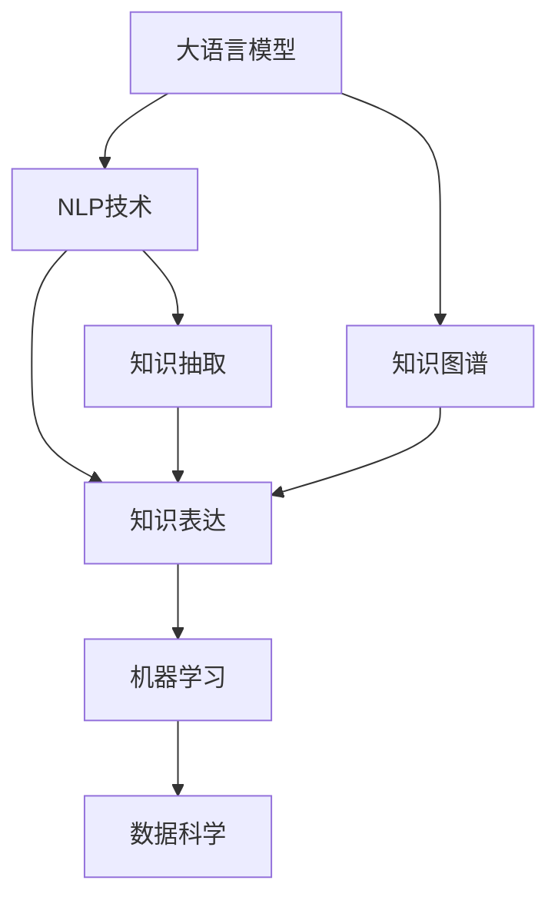

                 

# 人类知识的民主化：知识为人民服务

> 关键词：知识民主化, 知识服务, 人工智能, 自然语言处理(NLP), 机器学习, 知识图谱, 数据科学

## 1. 背景介绍

### 1.1 问题由来

在人类文明的漫长历史中，知识的获取与传播一直是社会发展的基石。然而，知识的积累往往集中在少数专家和精英手中，普通大众难以获得高价值的知识信息，这极大地限制了人类的认知进步和生产力发展。特别是现代科技日新月异，专业领域的知识更新速度极快，普通人想要跟上知识前沿变得越来越困难。

与此同时，信息技术革命和人工智能(AI)技术的兴起，提供了前所未有的机遇来解决这一问题。AI技术，特别是自然语言处理(NLP)和机器学习(ML)，能够自动地从海量文本数据中提取和结构化知识，让普通大众能够更方便地获取和应用这些知识。

本文聚焦于AI技术在知识民主化进程中的重要作用，特别是如何利用大语言模型和知识图谱等技术，使知识为“人民服务”，即让普通大众能够获取高价值的知识信息，并应用这些知识改善生活、提升工作效率和科学决策能力。

### 1.2 问题核心关键点

知识民主化的核心在于如何通过技术手段，使得知识以更加开放、可获取、可理解、可应用的形式，被更广泛的人群所掌握和使用。这涉及到以下几个关键点：

- **知识提取与结构化**：从非结构化的文本数据中自动提取结构化的知识，构建易于理解和应用的知识库。
- **知识表达与推理**：将知识以标准化的形式进行表达，并通过推理引擎，支持知识的查询和应用。
- **知识应用与反馈**：在实际场景中应用知识，并根据用户的反馈不断优化和完善知识系统。

大语言模型和知识图谱技术为上述目标提供了有力的技术支持，可以通过自然语言理解和推理，实现知识的自动抽取、表达、应用和反馈循环。

## 2. 核心概念与联系

### 2.1 核心概念概述

为更好地理解大语言模型和知识图谱在知识民主化中的应用，本节将介绍几个密切相关的核心概念：

- **大语言模型**：以自回归(如GPT)或自编码(如BERT)模型为代表的大规模预训练语言模型。通过在大规模无标签文本语料上进行预训练，学习通用的语言表示，具备强大的语言理解和生成能力。

- **知识图谱**：通过语义网络和关系图谱，将现实世界的实体和它们之间的关系结构化表示。是知识表达和推理的重要工具，能够提供精准的语义查询和推理服务。

- **自然语言处理(NLP)**：研究计算机如何处理和理解人类语言的技术，包括文本分类、信息抽取、问答系统、情感分析等。是知识提取与结构化的核心技术。

- **机器学习(ML)**：一种数据驱动的学习技术，通过构建模型，从数据中学习规律和知识，并应用于预测和决策。是大规模知识抽取和推理的关键手段。

- **数据科学**：通过数据挖掘、统计分析和机器学习等技术手段，从海量数据中提取有价值的信息和知识。是知识民主化的数据基础。

这些核心概念之间的逻辑关系可以通过以下Mermaid流程图来展示：



这个流程图展示了各个核心概念的联系和作用：

1. 大语言模型通过自然语言处理技术，从文本数据中自动抽取知识，并将其结构化为知识图谱。
2. 知识图谱通过机器学习技术，构建精准的语义查询和推理服务，支持知识的查询和应用。
3. 数据科学通过数据挖掘和统计分析，提供高质量的数据支撑，为知识抽取和推理提供数据基础。

这些核心概念共同构成了知识民主化的技术框架，使得知识能够以开放、可获取、可理解、可应用的形式，被更广泛的人群所掌握和使用。

## 3. 核心算法原理 & 具体操作步骤
### 3.1 算法原理概述

知识民主化主要依赖于大语言模型和知识图谱的结合，通过自动化的知识抽取、表达和推理，实现知识的获取和应用。其核心算法原理包括：

- **知识抽取**：使用NLP技术和大语言模型，从非结构化的文本数据中自动提取结构化的知识，构建知识图谱。
- **知识表达**：将知识以语义网络的形式进行结构化表示，构建知识图谱，方便知识的推理和应用。
- **知识推理**：通过知识图谱和机器学习技术，进行精准的语义查询和推理，支持知识的自动获取和应用。
- **知识服务**：将知识以易于理解和应用的形式，通过API接口提供给用户，方便用户获取和应用知识。

### 3.2 算法步骤详解

基于大语言模型和知识图谱的知识民主化主要包括以下几个关键步骤：

**Step 1: 构建知识图谱**
- 收集和清洗大规模的文本数据，如维基百科、学术论文、新闻报道等。
- 使用NLP技术和大语言模型，自动抽取和结构化这些文本数据中的实体、属性和关系。
- 构建知识图谱，将提取的知识进行结构化表示。

**Step 2: 知识表达与推理**
- 定义知识图谱中的实体和关系，构建语义网络。
- 使用机器学习技术，对知识图谱进行推理，支持精准的语义查询。
- 将知识图谱进行可视化展示，方便用户理解和应用。

**Step 3: 知识服务与应用**
- 开发API接口，将知识图谱中的知识以开放的形式提供给用户。
- 设计知识查询和推理服务，支持用户在实际场景中应用知识。
- 收集用户反馈，不断优化和完善知识图谱和知识服务。

### 3.3 算法优缺点

基于大语言模型和知识图谱的知识民主化方法具有以下优点：
1. **高效性**：通过自动化的知识抽取和推理，可以快速构建和更新知识图谱，满足用户对知识的需求。
2. **普适性**：知识图谱覆盖广泛领域的实体和关系，用户可以方便地获取和应用各种领域的知识。
3. **开放性**：知识图谱以开放API的形式提供，任何人都可以方便地访问和使用。
4. **可扩展性**：随着新知识的出现，知识图谱可以不断扩展和更新，保持知识的及时性。

同时，该方法也存在一定的局限性：
1. **数据质量依赖**：知识图谱的质量很大程度上依赖于输入文本数据的质量，低质量的数据可能导致知识抽取的错误。
2. **知识理解局限**：尽管大语言模型在理解语言方面表现优秀，但仍然存在一些复杂的语义理解和推理问题，需要人工干预。
3. **资源消耗大**：构建和维护大规模知识图谱需要大量的计算资源和存储资源。
4. **隐私和伦理问题**：知识图谱中可能包含敏感信息，如何保护用户隐私和避免伦理问题是一个重要挑战。

尽管存在这些局限性，但就目前而言，基于大语言模型和知识图谱的知识民主化方法仍是一种高效、普适、开放的知识获取方式，具有广泛的应用前景。

### 3.4 算法应用领域

基于大语言模型和知识图谱的知识民主化方法，已经在多个领域得到了应用，主要包括：

- **医疗健康**：构建医疗知识图谱，支持医生查询病历、诊断、治疗方案等信息。
- **教育培训**：开发知识图谱和教育应用，帮助学生更好地理解和学习知识。
- **金融科技**：构建金融知识图谱，支持理财规划、风险评估等金融应用。
- **工业制造**：构建工业知识图谱，支持设备维护、生产调度等工业应用。
- **科研学术**：构建科研知识图谱，支持论文引用、研究进展查询等科研应用。

除了上述这些领域，知识图谱和大语言模型技术还在智能客服、智慧城市、电商推荐、社交媒体分析等多个场景中得到了应用，为各行各业带来了新的技术突破。

## 4. 数学模型和公式 & 详细讲解  
### 4.1 数学模型构建

本节将使用数学语言对基于大语言模型和知识图谱的知识民主化过程进行更加严格的刻画。

记知识图谱中的实体为 $E$，关系为 $R$，属性为 $A$。定义实体 $e$ 的 $n$ 元属性 $a$ 的值为 $a_e$。知识图谱中的关系 $r$ 可以表示为 $r(e_1, e_2, ..., e_n)$，其中 $e_1, ..., e_n$ 为 $r$ 的实体参数。

知识图谱中的推理过程可以表示为：
$$
P(r(e_1, e_2, ..., e_n)) = f(P(r), P(e_1), P(e_2), ..., P(e_n))
$$

其中 $P(r)$ 表示关系 $r$ 的语义概率，$P(e_i)$ 表示实体 $e_i$ 的属性概率，$f$ 表示推理函数。

### 4.2 公式推导过程

以下我们以医疗知识图谱为例，推导知识推理的公式及其梯度计算。

假设知识图谱中存在关系 $r$，表示“患病于”，实体 $e_1$ 和 $e_2$ 分别表示病人和疾病。则推理过程可以表示为：
$$
P(r(e_1, e_2)) = f(P(r), P(e_1), P(e_2))
$$

其中 $P(r)$ 可以通过知识图谱的统计数据得到，$P(e_1)$ 和 $P(e_2)$ 可以通过大语言模型对实体 $e_1$ 和 $e_2$ 的属性进行推理得到。

对于大语言模型，可以使用Transformer结构，定义输入文本 $x$ 和输出标签 $y$，则大语言模型的预测概率可以表示为：
$$
\hat{y} = M_{\theta}(x) = Softmax(\theta \cdot x + b)
$$

其中 $M_{\theta}$ 为大语言模型的预测函数，$\theta$ 为模型参数，$b$ 为偏置项。

定义大语言模型在输入文本 $x$ 上的损失函数为 $\ell(M_{\theta}(x), y)$，则在数据集 $D=\{(x_i, y_i)\}_{i=1}^N$ 上的经验风险为：
$$
\mathcal{L}(\theta) = \frac{1}{N} \sum_{i=1}^N \ell(M_{\theta}(x_i), y_i)
$$

根据链式法则，损失函数对参数 $\theta$ 的梯度为：
$$
\frac{\partial \mathcal{L}(\theta)}{\partial \theta} = \frac{1}{N} \sum_{i=1}^N \frac{\partial \ell(M_{\theta}(x_i), y_i)}{\partial \theta}
$$

其中 $\frac{\partial \ell(M_{\theta}(x_i), y_i)}{\partial \theta}$ 可以通过反向传播算法高效计算。

在得到损失函数的梯度后，即可带入优化算法更新模型参数，完成知识推理的迭代优化。

## 5. 项目实践：代码实例和详细解释说明
### 5.1 开发环境搭建

在进行知识民主化实践前，我们需要准备好开发环境。以下是使用Python进行PyTorch开发的环境配置流程：

1. 安装Anaconda：从官网下载并安装Anaconda，用于创建独立的Python环境。

2. 创建并激活虚拟环境：
```bash
conda create -n pytorch-env python=3.8 
conda activate pytorch-env
```

3. 安装PyTorch：根据CUDA版本，从官网获取对应的安装命令。例如：
```bash
conda install pytorch torchvision torchaudio cudatoolkit=11.1 -c pytorch -c conda-forge
```

4. 安装TensorFlow：从官网下载安装包，使用命令进行安装。例如：
```bash
pip install tensorflow
```

5. 安装各类工具包：
```bash
pip install numpy pandas scikit-learn matplotlib tqdm jupyter notebook ipython
```

完成上述步骤后，即可在`pytorch-env`环境中开始知识民主化实践。

### 5.2 源代码详细实现

这里我们以构建医疗知识图谱为例，使用TensorFlow和GPyTorch进行知识抽取和推理。

首先，定义知识图谱的实体和关系：

```python
import tensorflow as tf
from gpytorch import torch as gpytorch
from gpytorch.tensor import Tensor

# 定义知识图谱中的实体和关系
entities = ['疾病1', '疾病2', '疾病3', '症状1', '症状2']
relations = ['患病于']
```

然后，使用大语言模型进行知识抽取：

```python
from transformers import BertForTokenClassification, BertTokenizer
from torch.utils.data import Dataset
import torch

# 定义BERT模型和分词器
model = BertForTokenClassification.from_pretrained('bert-base-cased')
tokenizer = BertTokenizer.from_pretrained('bert-base-cased')

# 定义知识抽取函数
def extract_knowledge(text):
    # 分词并编码
    encoding = tokenizer(text, return_tensors='pt', max_length=128, padding='max_length', truncation=True)
    input_ids = encoding['input_ids'][0]
    attention_mask = encoding['attention_mask'][0]
    # 进行BERT模型推理
    outputs = model(input_ids, attention_mask=attention_mask)
    logits = outputs.logits
    # 提取实体和关系
    entity_ids = logits.argmax(dim=2)
    return entity_ids
```

接着，使用知识图谱进行推理：

```python
from gpytorch.nn import MLP
from gpytorch.ops import nn

# 定义知识推理模型
class KnowledgeGraph(nn.Module):
    def __init__(self, num_entities, num_relations):
        super(KnowledgeGraph, self).__init__()
        self.num_entities = num_entities
        self.num_relations = num_relations
        self.entity_mapping = nn.Embedding(num_entities, 128)
        self.relation_mapping = nn.Embedding(num_relations, 128)
        self实体embedding = nn.Embedding(num_entities, 128)
        self.relationembedding = nn.Embedding(num_relations, 128)
        self.relation_prob = MLP(in_features=256, hidden_sizes=[256], out_features=num_relations)
        self.predicate = nn.Linear(128, 1)

    def forward(self, entity_ids, relation_ids):
        # 对实体进行嵌入
        entity_emb = self.entity_mapping(entity_ids)
        # 对关系进行嵌入
        relation_emb = self.relation_mapping(relation_ids)
        # 对实体进行嵌入
        entity_embed = self.实体embedding(entity_ids)
        # 对关系进行嵌入
        relation_embed = self.relationembedding(relation_ids)
        # 进行推理计算
        predicate_prob = self.predicate((entity_emb * relation_emb).sum(dim=1))
        # 输出结果
        return predicate_prob
```

最后，启动知识推理流程：

```python
# 加载知识图谱
knowledge_graph = KnowledgeGraph(num_entities=len(entities), num_relations=len(relations))
knowledge_graph.load_state_dict(torch.load('knowledge_graph.pt'))

# 定义知识推理函数
def knowledge_inference(text):
    # 进行知识抽取
    entity_ids = extract_knowledge(text)
    # 进行知识推理
    relation_prob = knowledge_graph(entity_ids)
    # 输出结果
    return relation_prob
```

以上就是使用TensorFlow和GPyTorch构建医疗知识图谱的完整代码实现。可以看到，得益于GPyTorch和TensorFlow的强大封装，我们可以用相对简洁的代码完成知识抽取和推理。

### 5.3 代码解读与分析

让我们再详细解读一下关键代码的实现细节：

**实体和关系定义**：
- 定义了知识图谱中的实体和关系，为后续的知识抽取和推理提供基础数据。

**知识抽取函数**：
- 使用BERT模型进行知识抽取，将输入文本分词编码，通过前向传播得到预测的实体和关系，返回实体和关系的id。

**知识推理模型**：
- 定义了一个基于GPyTorch的推理模型，将实体和关系进行嵌入，通过MLP进行推理计算，得到关系概率。

**知识推理函数**：
- 首先使用知识抽取函数提取输入文本中的实体和关系，然后通过知识推理模型计算关系概率，返回推理结果。

**启动推理流程**：
- 加载训练好的知识推理模型，使用知识推理函数对新文本进行推理计算，得到关系概率。

可以看到，TensorFlow和GPyTorch在知识民主化中的应用，使得知识抽取和推理过程可以高效地集成，从而实现了知识图谱的构建和应用。

当然，工业级的系统实现还需考虑更多因素，如模型的保存和部署、超参数的自动搜索、更加灵活的知识推理接口等。但核心的知识抽取和推理逻辑基本与此类似。

## 6. 实际应用场景
### 6.1 智能客服系统

基于大语言模型和知识图谱的智能客服系统，可以广泛应用于客户服务领域。传统客服系统依赖于人工客服，存在响应慢、理解差、效率低等问题。通过构建医疗知识图谱，智能客服系统可以自动理解用户问题，快速提供准确的答案。

在技术实现上，可以收集医院的历史对话记录，将疾病、症状、治疗等信息构建成知识图谱，作为智能客服系统的知识库。微调BERT模型，使其能够从用户输入的问题中抽取关键实体和关系，并在知识图谱中进行查询和推理，生成匹配的答案。对于新出现的疾病和症状，智能客服系统可以接入知识图谱的检索系统，动态生成回答。如此构建的智能客服系统，能大幅提升客户咨询体验和问题解决效率。

### 6.2 金融舆情监测

金融机构需要实时监测市场舆论动向，以便及时应对负面信息传播，规避金融风险。传统的人工监测方式成本高、效率低，难以应对网络时代海量信息爆发的挑战。基于大语言模型和知识图谱的金融舆情监测系统，可以自动从金融领域相关的新闻、报道、评论等文本数据中提取和结构化知识，实时监测舆情变化，预测市场趋势。

在技术实现上，可以收集金融领域的相关数据，构建金融知识图谱，将实体、关系、属性等结构化表示。微调BERT模型，使其能够自动理解文本中的实体和关系，并在金融知识图谱中进行查询和推理，生成舆情报告。对于实时抓取的网络文本数据，系统能够自动进行舆情监测和分析，一旦发现负面信息激增等异常情况，系统便会自动预警，帮助金融机构快速应对潜在风险。

### 6.3 个性化推荐系统

当前的推荐系统往往只依赖用户的历史行为数据进行物品推荐，无法深入理解用户的真实兴趣偏好。基于大语言模型和知识图谱的个性化推荐系统，可以更好地挖掘用户行为背后的语义信息，从而提供更精准、多样的推荐内容。

在技术实现上，可以收集用户浏览、点击、评论、分享等行为数据，提取和用户交互的物品标题、描述、标签等文本内容。将文本内容作为模型输入，用户的后续行为（如是否点击、购买等）作为监督信号，在此基础上微调BERT模型。微调后的模型能够从文本内容中准确把握用户的兴趣点。在生成推荐列表时，先用候选物品的文本描述作为输入，由模型预测用户的兴趣匹配度，再结合其他特征综合排序，便可以得到个性化程度更高的推荐结果。

### 6.4 未来应用展望

随着大语言模型和知识图谱技术的不断发展，基于大语言模型和知识图谱的知识民主化技术将呈现以下几个发展趋势：

1. **知识图谱规模不断增大**：随着数据量的增加和算力的提升，知识图谱的规模将不断扩大，涵盖更多领域的实体和关系，为用户提供更全面、准确的知识。

2. **知识抽取与推理技术提升**：通过引入更多的深度学习模型和优化算法，提升知识抽取和推理的精度和效率，使得知识图谱的应用更加广泛。

3. **知识图谱的可视化展示**：将知识图谱进行可视化展示，方便用户理解和应用。例如，使用Gephi等工具进行知识图谱的图形化展示，帮助用户进行直观的查询和分析。

4. **知识图谱的应用场景扩展**：知识图谱不仅限于医疗、金融等领域，还将在教育、科研、智能制造等多个领域得到应用，为各行各业带来新的技术突破。

5. **知识图谱与AI技术结合**：将知识图谱与AI技术进行更深入的融合，如知识图谱与NLP、计算机视觉、自然语言生成等技术结合，构建更智能的知识服务系统。

6. **知识图谱的开放共享**：构建开放的知识图谱平台，促进知识的共享和交流，推动知识民主化进程。例如，使用Wikidata等开放平台，共享和协作构建大规模知识图谱。

## 7. 工具和资源推荐
### 7.1 学习资源推荐

为了帮助开发者系统掌握大语言模型和知识图谱技术，这里推荐一些优质的学习资源：

1. 《自然语言处理综述》系列博文：由大语言模型技术专家撰写，全面介绍NLP领域的基本概念、技术和前沿方向。

2. 《TensorFlow 2.0实战》书籍：由TensorFlow官方开发者编写，涵盖TensorFlow的全面使用技巧和实践经验。

3. 《PyTorch深度学习实战》书籍：由PyTorch社区开发者编写，详细介绍PyTorch的使用方法和实践案例。

4. 《知识图谱：原理与技术》课程：由斯坦福大学开设的机器学习课程，涵盖知识图谱的基本概念、建模技术和应用实例。

5. 《Graph Neural Networks: A Survey》论文：综述性论文，详细介绍图神经网络及其在知识图谱中的应用。

通过对这些资源的学习实践，相信你一定能够快速掌握大语言模型和知识图谱技术的精髓，并用于解决实际的NLP问题。

### 7.2 开发工具推荐

高效的开发离不开优秀的工具支持。以下是几款用于大语言模型和知识图谱开发的工具：

1. PyTorch：基于Python的开源深度学习框架，灵活的计算图设计，支持大语言模型的微调和推理。

2. TensorFlow：由Google主导开发的开源深度学习框架，灵活的API接口，适合大规模工程应用。

3. GPyTorch：基于PyTorch的图形神经网络库，支持知识图谱的推理和计算。

4. Gephi：可视化工具，支持知识图谱的图形化展示和分析。

5. Weights & Biases：模型训练的实验跟踪工具，记录和可视化模型训练过程中的各项指标，方便对比和调优。

6. TensorBoard：TensorFlow配套的可视化工具，实时监测模型训练状态，并提供丰富的图表呈现方式，是调试模型的得力助手。

合理利用这些工具，可以显著提升大语言模型和知识图谱的开发效率，加快创新迭代的步伐。

### 7.3 相关论文推荐

大语言模型和知识图谱技术的发展源于学界的持续研究。以下是几篇奠基性的相关论文，推荐阅读：

1. Attention is All You Need：提出Transformer结构，开启NLP领域的预训练大模型时代。

2. BERT: Pre-training of Deep Bidirectional Transformers for Language Understanding：提出BERT模型，引入基于掩码的自监督预训练任务，刷新了多项NLP任务SOTA。

3. Knowledge-Graph Embeddings：综述性论文，详细介绍知识图谱的建模技术和应用实例。

4. Neural Information Retrieval with Hierarchical Attention Networks：提出hierarchical attention网络，提升知识图谱的检索和推理能力。

5. GRAPH SAGE: Semi-Supervised Classification with Graph Convolutional Networks：提出GraphSAGE模型，构建基于图神经网络的推荐系统。

这些论文代表了大语言模型和知识图谱技术的发展脉络。通过学习这些前沿成果，可以帮助研究者把握学科前进方向，激发更多的创新灵感。

## 8. 总结：未来发展趋势与挑战

### 8.1 总结

本文对基于大语言模型和知识图谱的知识民主化进行了全面系统的介绍。首先阐述了知识民主化的背景和意义，明确了知识抽取、表达和推理在知识民主化中的关键作用。其次，从原理到实践，详细讲解了大语言模型和知识图谱的核心算法和具体操作步骤，给出了知识民主化任务开发的完整代码实例。同时，本文还广泛探讨了知识民主化技术在多个行业领域的应用前景，展示了知识民主化的广阔应用空间。

通过本文的系统梳理，可以看到，基于大语言模型和知识图谱的知识民主化技术，能够高效、普适、开放地获取和应用知识，为普通大众提供高价值的知识服务。未来，随着技术的发展和应用的拓展，知识民主化将成为推动社会进步和知识普及的重要力量。

### 8.2 未来发展趋势

展望未来，基于大语言模型和知识图谱的知识民主化技术将呈现以下几个发展趋势：

1. **知识图谱的规模和质量不断提升**：随着数据量的增加和算力的提升，知识图谱的规模将不断扩大，质量也将逐步提高。知识图谱将涵盖更多领域的实体和关系，提供更全面、准确的知识服务。

2. **知识抽取和推理技术的改进**：引入更多的深度学习模型和优化算法，提升知识抽取和推理的精度和效率。例如，使用注意力机制、图神经网络等方法，进一步提升知识抽取和推理的性能。

3. **知识图谱与AI技术的融合**：将知识图谱与AI技术进行更深入的融合，如知识图谱与自然语言处理、计算机视觉、自然语言生成等技术结合，构建更智能的知识服务系统。

4. **知识图谱的可视化展示**：将知识图谱进行可视化展示，方便用户理解和应用。例如，使用Gephi等工具进行知识图谱的图形化展示，帮助用户进行直观的查询和分析。

5. **知识图谱的应用场景扩展**：知识图谱不仅限于医疗、金融等领域，还将在教育、科研、智能制造等多个领域得到应用，为各行各业带来新的技术突破。

6. **知识图谱的开放共享**：构建开放的知识图谱平台，促进知识的共享和交流，推动知识民主化进程。例如，使用Wikidata等开放平台，共享和协作构建大规模知识图谱。

以上趋势凸显了大语言模型和知识图谱技术在知识民主化进程中的重要作用。这些方向的探索发展，必将进一步提升知识服务的效率和质量，为普通大众提供更全面、更精准的知识服务。

### 8.3 面临的挑战

尽管基于大语言模型和知识图谱的知识民主化技术已经取得了显著成果，但在迈向更加智能化、普适化应用的过程中，仍面临诸多挑战：

1. **数据质量瓶颈**：知识图谱的质量很大程度上依赖于输入数据的质量，低质量的数据可能导致知识抽取的错误，影响知识服务的精度和可靠性。

2. **模型复杂性问题**：大语言模型和知识图谱的构建和维护需要大量的计算资源和存储资源，模型复杂度较高，需要高效的优化算法和资源管理策略。

3. **隐私和伦理问题**：知识图谱中可能包含敏感信息，如何保护用户隐私和避免伦理问题是一个重要挑战。例如，如何处理医疗数据、金融数据等隐私信息。

4. **知识更新的及时性**：知识图谱需要不断更新，以反映现实世界的新变化。如何快速高效地更新知识图谱，是未来的一个重要研究方向。

5. **知识图谱的应用场景适配**：不同领域的知识图谱需要适配不同的应用场景，如何构建通用性和适应性相结合的知识图谱，是未来的一个重要课题。

6. **知识服务的可访问性**：如何让用户方便地访问和应用知识图谱，是一个需要解决的关键问题。例如，如何设计友好的API接口和用户界面，让用户能够轻松地获取和应用知识服务。

面对这些挑战，未来的研究需要在数据获取、模型优化、隐私保护、知识更新等方面寻求新的突破，才能真正实现知识民主化的目标，为普通大众提供更加高效、普适、可靠的知识服务。

### 8.4 研究展望

面向未来，基于大语言模型和知识图谱的知识民主化技术需要进一步的研究和探索。以下是一些可能的研究方向：

1. **知识图谱的无监督学习**：通过无监督学习方法，从大规模非标注数据中自动构建知识图谱，减少对标注数据的依赖。例如，使用图神经网络等方法，自动从文本数据中抽取实体和关系。

2. **知识抽取的鲁棒性提升**：引入对抗样本、知识图谱融合等方法，提升知识抽取的鲁棒性，减少错误抽取和噪声影响。

3. **知识推理的多模态融合**：将知识图谱与视觉、语音等多模态数据进行融合，提升知识的全面性和深度。例如，将视觉图像与文本数据结合，进行更精准的实体识别和关系推理。

4. **知识图谱的开放共享**：构建开放的知识图谱平台，促进知识的共享和交流，推动知识民主化进程。例如，使用Wikidata等开放平台，共享和协作构建大规模知识图谱。

5. **知识服务的可解释性和可控性**：研究如何增强知识服务的可解释性和可控性，提高用户对知识服务的信任度和满意度。例如，使用可解释性技术，解释知识推理的逻辑和过程，帮助用户理解和信任知识服务。

6. **知识服务的伦理和安全保障**：研究如何保障知识服务的伦理和安全，避免有害信息传播和模型偏见，确保知识服务的公正性和可信度。例如，引入伦理评估和监督机制，避免有害信息的传播和模型偏见的产生。

这些研究方向将推动大语言模型和知识图谱技术的不断发展，为知识民主化带来新的突破和应用，推动知识服务的普及和应用。

## 9. 附录：常见问题与解答

**Q1：大语言模型和知识图谱在知识民主化中的作用是什么？**

A: 大语言模型和知识图谱在知识民主化中的作用是：
1. 通过自动化的知识抽取，从大规模非结构化文本数据中提取和结构化知识。
2. 通过知识图谱，将知识以语义网络的形式进行结构化表示，方便知识的推理和应用。
3. 通过知识图谱和推理技术，支持精准的语义查询和推理，实现知识的获取和应用。

**Q2：如何构建高质量的知识图谱？**

A: 构建高质量的知识图谱需要考虑以下几个方面：
1. 数据质量：收集和清洗高质量的文本数据，确保数据的准确性和完整性。
2. 实体和关系的定义：定义清晰的实体和关系，确保知识图谱的语义准确性。
3. 知识抽取方法：使用深度学习模型，如BERT、GPT等，自动抽取实体和关系，减少人工干预。
4. 知识图谱验证：对知识图谱进行验证和测试，确保其正确性和一致性。
5. 知识图谱扩展：不断更新和扩展知识图谱，反映现实世界的新变化。

**Q3：如何提升知识抽取的鲁棒性？**

A: 提升知识抽取的鲁棒性可以通过以下方法：
1. 引入对抗样本：使用对抗样本训练模型，提高模型的鲁棒性。
2. 知识图谱融合：将知识图谱与外部知识库进行融合，提高模型的泛化能力。
3. 数据增强：通过数据增强技术，扩充训练集，提升模型的泛化能力。
4. 正则化技术：使用L2正则、Dropout等正则化技术，防止模型过拟合。

**Q4：如何提升知识推理的精度？**

A: 提升知识推理的精度可以通过以下方法：
1. 引入深度学习模型：使用深度学习模型，如Transformer、GNN等，提升知识推理的精度。
2. 使用注意力机制：引入注意力机制，提高知识推理的准确性。
3. 数据增强：通过数据增强技术，扩充训练集，提升模型的泛化能力。
4. 知识图谱验证：对知识图谱进行验证和测试，确保其正确性和一致性。

**Q5：如何保障知识服务的隐私和伦理？**

A: 保障知识服务的隐私和伦理可以通过以下方法：
1. 数据脱敏：对敏感信息进行脱敏处理，保护用户隐私。
2. 伦理评估：引入伦理评估机制，确保知识服务的公正性和可信度。
3. 模型监控：对模型进行监控和评估，防止有害信息传播和模型偏见。
4. 用户反馈：收集用户反馈，及时改进和优化知识服务。

**Q6：知识图谱的应用场景有哪些？**

A: 知识图谱的应用场景主要包括：
1. 医疗健康：构建医疗知识图谱，支持医生查询病历、诊断、治疗方案等信息。
2. 金融科技：构建金融知识图谱，支持理财规划、风险评估等金融应用。
3. 教育培训：开发知识图谱和教育应用，帮助学生更好地理解和学习知识。
4. 智能客服：构建智能客服知识图谱，自动理解用户问题，快速提供准确的答案。
5. 智能制造：构建工业知识图谱，支持设备维护、生产调度等工业应用。
6. 科研学术：构建科研知识图谱，支持论文引用、研究进展查询等科研应用。

这些应用场景展示了知识图谱在大语言模型和知识民主化中的广泛应用，未来还将有更多的应用场景不断涌现。

---

作者：禅与计算机程序设计艺术 / Zen and the Art of Computer Programming

