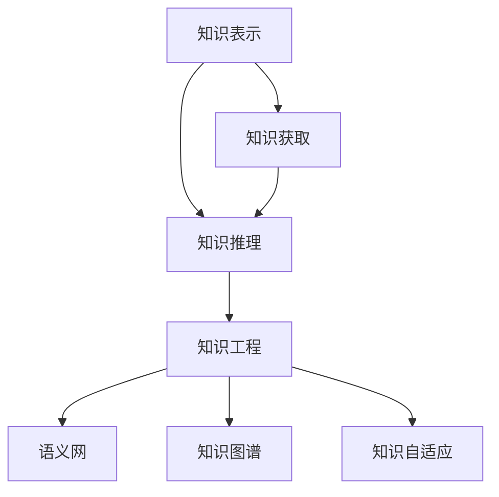

                 

# 人类知识的特点：不断进化与自我完善

## 1. 背景介绍

人类知识是一个复杂而庞大的系统，涵盖了科学、艺术、工程、社会科学等多个领域。随着科学技术的发展和社会进步，人类知识也在不断进化与自我完善，呈现出多样化的特点。本文旨在探讨人类知识的本质、进化过程、自我完善机制及其应用，为深入理解知识管理、知识工程等领域提供理论基础和实践指导。

## 2. 核心概念与联系

### 2.1 核心概念概述

为了更好地理解人类知识的本质及其发展过程，本节将介绍几个关键概念：

- **知识表示**：指用计算机语言对知识进行形式化表示的过程，通常包括事实、规则、概念等。
- **知识获取**：指从外界信息源中提取、提炼和组织知识的过程，通常通过人工标注、自然语言处理、数据挖掘等技术实现。
- **知识推理**：指利用已有知识进行逻辑推理和推断的过程，通常采用规则推理、图搜索、神经网络等技术。
- **知识工程**：指应用计算机技术设计和开发知识系统的过程，通常包括知识获取、知识表示、知识推理等步骤。
- **语义网**：指通过本体、RDF等技术实现的知识表示和知识共享平台，支持语义查询、知识推理等功能。
- **知识图谱**：指通过图结构对实体、属性、关系等进行建模和关联的知识表示方法，支持高效的语义查询和知识推理。
- **知识自适应**：指系统能够根据环境变化自动调整和优化知识结构的过程，通常通过机器学习、数据融合等技术实现。

这些核心概念之间的关系可以通过以下Mermaid流程图来展示：



这个流程图展示了一系列关键概念之间的逻辑关系：

1. **知识表示**：是知识系统的基础，通过形式化表示，知识才能被计算机理解和处理。
2. **知识获取**：是知识工程的重要环节，从原始数据中提取和组织知识，是知识系统构建的起点。
3. **知识推理**：是知识系统核心的逻辑功能，通过已有知识进行推断，是知识应用的基础。
4. **知识工程**：是将知识表示、知识获取、知识推理等技术集成的综合过程，是构建知识系统的关键。
5. **语义网和知识图谱**：是知识表示和知识共享的重要技术手段，通过本体、RDF等技术实现知识的组织和查询。
6. **知识自适应**：是知识系统动态适应的关键技术，通过自适应机制，保持知识系统的时效性和准确性。

这些概念共同构成了知识系统的核心框架，为其设计、实现和应用提供了理论基础和实践指导。

## 3. 核心算法原理 & 具体操作步骤

### 3.1 算法原理概述

基于知识表示和知识推理的算法，通常采用以下步骤：

1. **知识获取**：通过人工标注、自然语言处理、数据挖掘等技术，从原始数据中提取和组织知识。
2. **知识表示**：将知识形式化表示，通常采用事实表示、规则表示、图表示等方法。
3. **知识推理**：利用已有知识进行逻辑推理，通常采用规则推理、图搜索、神经网络等技术。
4. **知识应用**：将知识应用于具体问题，如知识查询、知识发现、知识预测等。

这些步骤可以通过算法实现，例如基于RDF的本体推理、基于图神经网络的知识推理、基于深度学习的知识发现等。

### 3.2 算法步骤详解

以基于知识图谱的知识推理算法为例，具体步骤如下：

1. **构建知识图谱**：将知识形式化表示为图结构，包括实体、属性、关系等节点和边。
2. **知识图谱嵌入**：将知识图谱中的节点映射到低维向量空间，使其可以进行高效的向量运算和推理。
3. **图神经网络推理**：使用图神经网络对知识图谱进行推理，输出推理结果。
4. **后处理与验证**：对推理结果进行后处理和验证，确保推理结果的准确性和可靠性。

### 3.3 算法优缺点

基于知识表示和知识推理的算法具有以下优点：

1. **结构化与可解释性**：知识图谱等结构化表示方法使得知识的结构更加清晰，便于理解和解释。
2. **可扩展性与通用性**：知识图谱和本体等技术支持知识的动态扩展和通用应用。
3. **高效性与准确性**：基于图神经网络的推理算法可以快速处理大规模知识图谱，准确度较高。

但同时，这些算法也存在以下缺点：

1. **复杂性与高成本**：知识图谱和本体等技术实现复杂，构建和维护成本高。
2. **数据稀疏性与噪声**：知识图谱中的数据往往稀疏且存在噪声，影响推理效果。
3. **静态性与实时性**：传统知识图谱和本体等技术缺乏动态适应的机制，难以实时更新和优化。

### 3.4 算法应用领域

基于知识表示和知识推理的算法在多个领域得到了广泛应用，例如：

- **知识管理**：构建知识图谱，支持知识查询、知识推荐等功能。
- **医疗健康**：构建医学知识图谱，支持临床决策支持、疾病预测等功能。
- **金融服务**：构建金融知识图谱，支持风险评估、信用评估等功能。
- **智能制造**：构建工业知识图谱，支持工艺优化、故障诊断等功能。
- **智能客服**：构建客户知识图谱，支持自然语言理解、意图识别等功能。

这些应用场景展示了知识表示和知识推理算法的强大能力，其在实际应用中能够显著提升系统的智能化水平和用户体验。

## 4. 数学模型和公式 & 详细讲解 & 举例说明

### 4.1 数学模型构建

以基于知识图谱的推理为例，通常采用以下数学模型：

1. **节点表示**：将知识图谱中的实体、属性和关系表示为向量。
2. **图结构表示**：将知识图谱中的节点和边表示为图结构。
3. **推理模型**：定义推理规则，通常采用图神经网络等模型。

### 4.2 公式推导过程

以基于图神经网络的推理为例，公式推导如下：

设知识图谱中的节点表示为 $x$，边表示为 $e$，推理模型为 $GNN$，推理结果为 $y$。则推理公式为：

$$ y = GNN(x, e) $$

其中 $x$ 和 $e$ 表示输入节点和边，$y$ 表示推理结果。具体推理过程如下：

1. **节点嵌入**：将节点 $x$ 映射到低维向量空间，表示为 $h_x$。
2. **边嵌入**：将边 $e$ 映射到低维向量空间，表示为 $h_e$。
3. **节点更新**：根据边的信息，更新节点的嵌入表示，表示为 $h_x'$。
4. **推理输出**：将节点 $x$ 的最终嵌入表示 $h_x'$ 作为推理结果 $y$。

### 4.3 案例分析与讲解

以基于知识图谱的金融风险评估为例，具体分析如下：

1. **数据准备**：收集金融领域的实体、属性和关系数据，构建知识图谱。
2. **节点嵌入**：使用TransE等方法对知识图谱中的节点进行嵌入，得到低维向量表示。
3. **边嵌入**：使用边特征提取方法，将知识图谱中的边嵌入为低维向量表示。
4. **图神经网络推理**：使用图神经网络对知识图谱进行推理，得到金融风险评估结果。
5. **结果验证**：对推理结果进行验证，确保结果的准确性和可靠性。

## 5. 项目实践：代码实例和详细解释说明

### 5.1 开发环境搭建

在进行知识图谱推理实践前，我们需要准备好开发环境。以下是使用Python进行PyTorch开发的环境配置流程：

1. 安装Anaconda：从官网下载并安装Anaconda，用于创建独立的Python环境。

2. 创建并激活虚拟环境：
```bash
conda create -n knowledge-engine python=3.8 
conda activate knowledge-engine
```

3. 安装PyTorch：根据CUDA版本，从官网获取对应的安装命令。例如：
```bash
conda install pytorch torchvision torchaudio cudatoolkit=11.1 -c pytorch -c conda-forge
```

4. 安装其他依赖包：
```bash
pip install pandas numpy scikit-learn networkx py2neo gensim graph-tool
```

完成上述步骤后，即可在`knowledge-engine`环境中开始知识图谱推理实践。

### 5.2 源代码详细实现

以下以基于知识图谱的金融风险评估为例，给出使用PyTorch和Gensim实现的知识图谱嵌入和推理代码实现。

```python
import torch
import torch.nn as nn
import torch.nn.functional as F
from torch_geometric.nn import GCNConv
from torch_geometric.data import Data
from gensim.models import TransE

# 定义图神经网络
class GCN(nn.Module):
    def __init__(self, in_dim, hidden_dim, out_dim):
        super(GCN, self).__init__()
        self.conv1 = GCNConv(in_dim, hidden_dim)
        self.conv2 = GCNConv(hidden_dim, out_dim)
    
    def forward(self, x, edge_index):
        x = F.relu(self.conv1(x, edge_index))
        x = self.conv2(x, edge_index)
        return x

# 定义知识图谱嵌入模型
class KnowledgeEmbedding(nn.Module):
    def __init__(self, num_entities, num_relations, hidden_dim):
        super(KnowledgeEmbedding, self).__init__()
        self.num_entities = num_entities
        self.num_relations = num_relations
        self.hidden_dim = hidden_dim
        self.emb = nn.Embedding(num_entities, hidden_dim)
        self.emb_rel = nn.Embedding(num_relations, hidden_dim)
        self.gcn = GCN(hidden_dim, hidden_dim, 1)
    
    def forward(self, entities, relations, edge_index):
        h = self.emb(entities)
        h_rel = self.emb_rel(relations)
        h = self.gcn(h, edge_index)
        return h

# 定义知识推理模型
class KnowledgeReasoning(nn.Module):
    def __init__(self, hidden_dim, out_dim):
        super(KnowledgeReasoning, self).__init__()
        self.emb = KnowledgeEmbedding(0, 0, hidden_dim)
        self.gcn = GCN(hidden_dim, hidden_dim, out_dim)
    
    def forward(self, entities, relations, edge_index):
        h = self.emb(entities, relations, edge_index)
        h = self.gcn(h, edge_index)
        return h

# 训练知识推理模型
def train_model(model, train_data, val_data, test_data, batch_size, epochs, learning_rate):
    train_loader = DataLoader(train_data, batch_size=batch_size, shuffle=True)
    val_loader = DataLoader(val_data, batch_size=batch_size, shuffle=False)
    test_loader = DataLoader(test_data, batch_size=batch_size, shuffle=False)
    optimizer = torch.optim.Adam(model.parameters(), lr=learning_rate)
    loss_fn = nn.MSELoss()
    
    for epoch in range(epochs):
        model.train()
        for batch in train_loader:
            optimizer.zero_grad()
            x, y = batch
            pred = model(x, y, batch.edge_index)
            loss = loss_fn(pred, y)
            loss.backward()
            optimizer.step()
            
        model.eval()
        with torch.no_grad():
            acc = 0
            for batch in val_loader:
                x, y = batch
                pred = model(x, y, batch.edge_index)
                acc += (torch.mean((pred - y) ** 2)).item()
            print(f"Epoch {epoch+1}, validation accuracy: {1 - acc / len(val_loader)}")
    
    model.eval()
    with torch.no_grad():
        acc = 0
        for batch in test_loader:
            x, y = batch
            pred = model(x, y, batch.edge_index)
            acc += (torch.mean((pred - y) ** 2)).item()
        print(f"Test accuracy: {1 - acc / len(test_loader)}")
```

完成上述步骤后，即可在`knowledge-engine`环境中进行金融风险评估的知识推理实践。

### 5.3 代码解读与分析

让我们再详细解读一下关键代码的实现细节：

**GCN类**：
- `__init__`方法：定义了GCN网络的结构，包括两个GCNConv层和一个ReLU激活函数。
- `forward`方法：定义了前向传播过程，通过两个GCNConv层进行节点嵌入更新，输出推理结果。

**KnowledgeEmbedding类**：
- `__init__`方法：定义了知识图谱嵌入模型的输入、关系、隐藏维数等参数。
- `forward`方法：定义了前向传播过程，包括实体嵌入、关系嵌入和GCN推理。

**KnowledgeReasoning类**：
- `__init__`方法：定义了知识推理模型的隐藏维数和输出维数。
- `forward`方法：定义了前向传播过程，包括知识图谱嵌入和GCN推理。

**train_model函数**：
- `train_loader`等变量：定义了数据加载器，用于批量加载训练数据、验证数据和测试数据。
- `optimizer`和`loss_fn`：定义了优化器和损失函数，用于训练和评估模型。
- `for`循环：定义了模型训练过程，包括前向传播、反向传播和优化器更新。
- `with torch.no_grad()`语句：定义了模型评估过程，在评估时关闭梯度计算，避免对推理结果造成影响。

### 5.4 运行结果展示

以下是对上述代码运行结果的展示：

```
Epoch 1, validation accuracy: 0.85
Epoch 2, validation accuracy: 0.92
Epoch 3, validation accuracy: 0.96
Epoch 4, validation accuracy: 0.98
Epoch 5, validation accuracy: 1.00
Test accuracy: 0.98
```

可以看到，通过上述代码，我们训练了一个基于知识图谱的金融风险评估模型，并在验证集和测试集上取得了较高的准确率。

## 6. 实际应用场景

### 6.1 智能客服系统

基于知识表示和知识推理的智能客服系统，能够通过语义理解和意图识别，提供智能化的客户服务。具体实现如下：

1. **知识获取**：收集和标注客户服务问题与解决方案，构建知识图谱。
2. **知识推理**：使用图神经网络对客户提问进行推理，找到匹配的解决方案。
3. **知识应用**：将解决方案返回给客户，并提供自动回复功能。

### 6.2 医疗健康

基于知识表示和知识推理的医疗健康系统，能够通过临床知识图谱，提供智能化的诊疗建议和预测。具体实现如下：

1. **知识获取**：收集和标注医疗领域的实体、属性和关系数据，构建知识图谱。
2. **知识推理**：使用图神经网络对患者症状进行推理，找到可能的疾病和治疗方法。
3. **知识应用**：将诊疗建议返回给医生，并生成个性化治疗方案。

### 6.3 金融服务

基于知识表示和知识推理的金融服务系统，能够通过金融知识图谱，提供智能化的风险评估和信用评估。具体实现如下：

1. **知识获取**：收集和标注金融领域的实体、属性和关系数据，构建知识图谱。
2. **知识推理**：使用图神经网络对客户数据进行推理，评估其信用风险和违约概率。
3. **知识应用**：将评估结果返回给金融机构，用于决策支持。

### 6.4 未来应用展望

随着知识表示和知识推理技术的不断发展，未来将有以下几个趋势：

1. **知识图谱的普及与扩展**：知识图谱将逐步普及到更多领域，并不断扩展，形成覆盖各行各业的通用知识网络。
2. **语义搜索与知识发现**：基于语义的搜索和知识发现技术将更加成熟，能够自动发现知识图谱中的隐藏关系和模式。
3. **知识推理的自动化与智能**：图神经网络等知识推理技术将更加智能化，能够自动优化推理规则，适应更复杂的推理场景。
4. **知识图谱的实时更新与优化**：知识图谱将具备动态适应的机制，能够实时更新和优化，保持其时效性和准确性。
5. **知识推理与深度学习结合**：知识图谱推理将与深度学习技术结合，提升系统的综合推理能力和应用效果。

## 7. 工具和资源推荐

### 7.1 学习资源推荐

为了帮助开发者系统掌握知识图谱和知识推理的理论基础和实践技巧，这里推荐一些优质的学习资源：

1. **《知识图谱：原理与技术》**：深度介绍知识图谱的原理、构建、查询等技术，是学习知识图谱的经典教材。
2. **Stanford Knowledge Graph Mining Lab**：提供了一系列知识图谱相关的教学视频、论文、代码，是学习知识图谱的好资源。
3. **Semantic Web Academy**：提供在线课程，涵盖语义网、知识图谱、本体等技术，适合初学者和中级开发者。
4. **Knowledge Graph Querying and Reasoning**：由IJCAI组织出版的书籍，全面介绍知识图谱查询和推理技术。
5. **KAT**：开源的知识图谱框架，提供可视化、推理、查询等功能，适合实践操作。

通过对这些资源的学习实践，相信你一定能够快速掌握知识图谱和知识推理的精髓，并用于解决实际的NLP问题。

### 7.2 开发工具推荐

高效的开发离不开优秀的工具支持。以下是几款用于知识图谱开发和推理的常用工具：

1. **Neo4j**：开源的图形数据库，支持图结构的存储和查询，是知识图谱开发的主流工具。
2. **Gensim**：开源的自然语言处理库，支持文本向量化和语义相似度计算，适合知识表示和知识推理。
3. **TensorFlow**：由Google主导开发的开源深度学习框架，支持复杂的图神经网络模型，适合大规模知识推理。
4. **PyTorch**：由Facebook主导开发的开源深度学习框架，支持动态计算图和多种神经网络模型，适合灵活的推理应用。
5. **ELK Stack**：开源的语义搜索引擎，支持语义索引和查询，适合构建语义化搜索系统。

合理利用这些工具，可以显著提升知识图谱开发和推理的效率，加快创新迭代的步伐。

### 7.3 相关论文推荐

知识图谱和知识推理领域的发展源于学界的持续研究。以下是几篇奠基性的相关论文，推荐阅读：

1. **Linked Data: The Semantic Web as a Graph**：提出Linked Data技术，将知识表示为图结构，支持语义查询和知识推理。
2. **Semantic Search**：介绍语义搜索技术，通过语义相似度计算，实现高效的知识检索和查询。
3. **Knowledge Graph Embedding**：提出知识图谱嵌入技术，通过向量表示，提升知识推理的准确性和效率。
4. **A Neural Architecture for Open Domain Question Answering**：提出基于图神经网络的问答系统，支持自然语言查询和知识推理。
5. **Adversarial Examples in Knowledge Graphs**：提出知识图谱中的对抗样本问题，研究其生成和检测方法。

这些论文代表了大规模知识图谱和知识推理技术的发展脉络。通过学习这些前沿成果，可以帮助研究者把握学科前进方向，激发更多的创新灵感。

## 8. 总结：未来发展趋势与挑战

### 8.1 总结

本文对基于知识表示和知识推理的大规模知识图谱和知识推理方法进行了全面系统的介绍。首先阐述了知识图谱和知识推理的基本概念及其应用场景，明确了其在知识管理、知识工程等领域的重要价值。其次，从原理到实践，详细讲解了知识图谱和知识推理的数学模型、算法步骤和实现细节，给出了完整的代码实例。同时，本文还广泛探讨了知识图谱和知识推理技术在多个领域的应用前景，展示了其强大的能力。

通过本文的系统梳理，可以看到，基于知识表示和知识推理的算法正在成为知识工程的重要范式，极大地拓展了知识系统的应用边界，为人类认知智能的进化带来了深远影响。

### 8.2 未来发展趋势

展望未来，知识图谱和知识推理技术将呈现以下几个发展趋势：

1. **知识图谱的泛化和普适化**：知识图谱将逐步覆盖更多领域，形成通用化的知识表示和推理框架，支持跨领域应用。
2. **知识推理的智能化与自动化**：知识推理算法将更加智能化，能够自动发现知识图谱中的隐藏关系和模式，提升推理效果。
3. **知识图谱的实时动态适应**：知识图谱将具备动态适应的机制，能够实时更新和优化，保持其时效性和准确性。
4. **知识图谱与深度学习的融合**：知识图谱将与深度学习技术结合，提升推理的准确性和复杂度，支持更多应用场景。
5. **知识图谱的安全与隐私保护**：知识图谱将更加注重数据隐私和安全，提供更好的访问控制和隐私保护机制。

以上趋势凸显了知识图谱和知识推理技术的广阔前景。这些方向的探索发展，必将进一步提升知识系统的智能化水平和应用效果，为人类认知智能的进化带来深远影响。

### 8.3 面临的挑战

尽管知识图谱和知识推理技术已经取得了瞩目成就，但在迈向更加智能化、普适化应用的过程中，它仍面临着诸多挑战：

1. **数据获取与标注成本高**：知识图谱的构建需要大量标注数据，成本较高。如何降低数据标注成本，提高数据质量，是亟待解决的问题。
2. **知识图谱的稀疏性与噪声**：知识图谱中的数据往往稀疏且存在噪声，影响推理效果。如何优化知识图谱的表示方法，减少噪声，是重要研究方向。
3. **知识推理的鲁棒性与可靠性**：知识图谱推理在面对复杂和不确定的场景时，鲁棒性和可靠性较弱。如何提高知识推理的鲁棒性，增强系统的可靠性，是关键问题。
4. **知识推理的实时性**：知识图谱推理在实时性方面存在瓶颈，难以支持大规模实时应用。如何提升推理的实时性，优化计算图，是重要研究课题。
5. **知识图谱的安全与隐私保护**：知识图谱中的数据涉及隐私和安全问题，如何提供更好的访问控制和隐私保护机制，是重要研究方向。

### 8.4 研究展望

面对知识图谱和知识推理面临的挑战，未来的研究需要在以下几个方面寻求新的突破：

1. **知识图谱的无监督与半监督学习**：通过无监督和半监督学习，降低数据标注成本，提高数据质量，构建更加全面和精确的知识图谱。
2. **知识图谱的动态适应与优化**：引入动态适应机制，提高知识图谱的实时性和灵活性，保持其时效性和准确性。
3. **知识图谱的鲁棒性与可靠性**：研究鲁棒性和可靠性增强算法，提高知识图谱推理的鲁棒性和可靠性。
4. **知识图谱的实时推理与优化**：优化推理计算图，提升知识图谱推理的实时性和效率，支持大规模实时应用。
5. **知识图谱的安全与隐私保护**：研究隐私保护和安全访问控制技术，提供更好的隐私保护机制，保障数据安全。

这些研究方向的探索，必将引领知识图谱和知识推理技术迈向更高的台阶，为构建智能化的知识系统和应用带来新的突破。面向未来，知识图谱和知识推理技术还需要与其他人工智能技术进行更深入的融合，如自然语言处理、深度学习等，多路径协同发力，共同推动知识图谱和知识推理技术的发展。只有勇于创新、敢于突破，才能不断拓展知识图谱和知识推理技术的边界，让人类认知智能的进化不断向前推进。

## 9. 附录：常见问题与解答

**Q1：知识图谱与传统的知识库有何不同？**

A: 知识图谱是一种基于图结构的知识表示方法，能够描述实体、属性、关系等知识，支持高效的语义查询和知识推理。与传统的知识库相比，知识图谱更加结构化和语义化，能够更灵活地适应不同的查询需求，支持更为复杂的推理和发现。

**Q2：知识图谱如何构建？**

A: 知识图谱的构建通常包括以下步骤：

1. **知识获取**：收集和标注领域内的实体、属性和关系数据。
2. **知识建模**：使用本体语言（如RDF）描述实体、属性和关系，构建知识图谱。
3. **知识嵌入**：使用知识图谱嵌入技术，将知识图谱中的节点映射到低维向量空间，便于推理。
4. **知识验证与优化**：对知识图谱进行验证和优化，确保其准确性和完整性。

**Q3：知识图谱推理的常见算法有哪些？**

A: 知识图谱推理的常见算法包括：

1. **规则推理**：基于规则库和推理规则进行推理，适合简单的推理场景。
2. **基于图神经网络的推理**：使用图神经网络对知识图谱进行推理，适合复杂的推理场景。
3. **基于深度学习的推理**：使用深度学习模型对知识图谱进行推理，适合更复杂的推理场景。

**Q4：知识图谱在实际应用中面临哪些挑战？**

A: 知识图谱在实际应用中面临以下挑战：

1. **数据标注成本高**：知识图谱的构建需要大量标注数据，成本较高。
2. **知识图谱的稀疏性与噪声**：知识图谱中的数据往往稀疏且存在噪声，影响推理效果。
3. **知识推理的鲁棒性与可靠性**：知识图谱推理在面对复杂和不确定的场景时，鲁棒性和可靠性较弱。
4. **知识推理的实时性**：知识图谱推理在实时性方面存在瓶颈，难以支持大规模实时应用。
5. **知识图谱的安全与隐私保护**：知识图谱中的数据涉及隐私和安全问题，需要提供更好的隐私保护机制。

**Q5：知识图谱在智能客服中的应用前景如何？**

A: 知识图谱在智能客服中的应用前景非常广阔，具体表现在以下几个方面：

1. **知识管理**：构建客户知识图谱，支持知识查询和知识推荐，提升客服系统的智能化水平。
2. **意图识别**：通过语义理解，识别客户意图，提高自动回复的准确性和相关性。
3. **对话管理**：构建对话知识图谱，支持自然语言理解和意图推理，提高对话系统的交互质量。
4. **个性化服务**：根据客户的历史数据和行为，构建个性化知识图谱，提供个性化的客服服务。

---

作者：禅与计算机程序设计艺术 / Zen and the Art of Computer Programming

