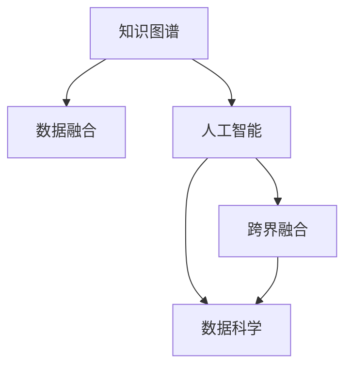

                 

# 人类知识的跨界融合：创新的乐土

> 关键词：知识图谱, 数据融合, 跨界融合, 人工智能, 创新技术, 数据科学

## 1. 背景介绍

### 1.1 问题由来

随着数字化时代的到来，人类社会产生了海量的数据，各种学科之间的交叉融合，尤其是知识图谱与人工智能的结合，成为了新的技术热点。

知识图谱（Knowledge Graphs）作为一种结构化数据的表示方式，通过实体、属性和关系的方式，实现了对复杂知识网络的建模。它在信息检索、问答系统、推荐系统等领域有着广泛的应用。

而人工智能（AI）特别是深度学习和机器学习，则在图像识别、自然语言处理、语音识别等领域取得了重大突破。两者结合，可以极大地提升数据处理和知识推理的能力。

### 1.2 问题核心关键点

如何充分利用知识图谱与人工智能的各自优势，进行跨界融合，成为当前技术发展的关键点。

知识图谱为AI提供了知识表示和推理的支持，使得AI系统能够更好地理解语义信息。而AI则在知识图谱构建、更新和扩展方面，提供自动化的工具和算法。

## 2. 核心概念与联系

### 2.1 核心概念概述

为了更好地理解知识图谱与AI的跨界融合，本节将介绍几个密切相关的核心概念：

- **知识图谱**：一种结构化表示知识的方式，通过实体、属性和关系的方式，对复杂知识网络进行建模。常用的构建方法包括关系抽取、知识补全、实体链接等。

- **数据融合**：将不同来源的数据进行整合，提升数据质量和利用效率。知识图谱与AI结合，可以通过数据融合提高数据准确性和完整性。

- **人工智能**：涵盖机器学习、深度学习、自然语言处理等领域的综合技术，通过算法和模型对数据进行自动化的处理和推理。

- **跨界融合**：指不同领域间的技术和知识的交叉和结合，推动技术创新和应用拓展。

- **数据科学**：通过数据收集、分析、建模等技术，从数据中提取有价值的信息，支持科学决策和业务优化。

这些核心概念之间的逻辑关系可以通过以下Mermaid流程图来展示：



这个流程图展示了一些核心概念之间的关系：

1. 知识图谱通过数据融合获取更完整、准确的数据。
2. 人工智能在知识图谱构建中起到关键作用，如自动化的实体识别和关系抽取。
3. 数据科学则通过模型和算法优化知识图谱的质量和推理效果。
4. 跨界融合是知识图谱与AI结合的最终目标，推动技术的创新和应用拓展。

## 3. 核心算法原理 & 具体操作步骤

### 3.1 算法原理概述

知识图谱与人工智能的跨界融合，本质上是利用人工智能算法和模型，对知识图谱进行构建、更新和推理的过程。

知识图谱的构建通常分为两个步骤：

- **数据预处理**：对原始数据进行清洗、去重、归一化等处理，得到结构化数据。
- **模型训练**：利用深度学习模型或传统机器学习算法，对结构化数据进行建模和推理，构建知识图谱。

构建好的知识图谱，可以用于支撑各种人工智能应用，如图像识别、自然语言处理、推荐系统等。

### 3.2 算法步骤详解

知识图谱与AI的跨界融合，通常包括以下几个关键步骤：

**Step 1: 数据收集与预处理**
- 收集不同来源的数据，如网页、图片、文本等，进行清洗、去重和归一化处理。
- 将数据映射到知识图谱的实体和关系中，构建知识网络。

**Step 2: 实体识别与关系抽取**
- 使用自然语言处理技术，从文本数据中识别实体和关系。
- 通过标注数据集训练模型，提高实体和关系识别的准确性。

**Step 3: 知识补全与实体链接**
- 利用深度学习模型或传统机器学习算法，对知识图谱进行补全，填充缺失的信息。
- 使用链接预测算法，将孤立的实体和关系进行链接，形成完整的知识网络。

**Step 4: 推理与预测**
- 构建知识图谱的推理算法，支持事实推理、逻辑推理、归纳推理等。
- 使用AI模型进行预测，如基于知识图谱的推荐系统、问答系统等。

**Step 5: 数据融合与系统集成**
- 将不同来源的数据进行融合，提升数据质量和利用效率。
- 将知识图谱与AI系统集成，形成一体化的知识驱动系统。

以上是知识图谱与AI跨界融合的一般流程。在实际应用中，还需要针对具体任务的特点，对融合过程的各个环节进行优化设计，如改进推理算法，引入更多的正则化技术，搜索最优的模型组合等，以进一步提升融合效果。

### 3.3 算法优缺点

知识图谱与AI的跨界融合方法具有以下优点：
1. 结构化知识表示：通过结构化的方式表示知识，便于存储和查询。
2. 自动化知识抽取：利用AI算法自动识别实体和关系，提高数据处理效率。
3. 事实推理与预测：结合知识图谱的推理能力，进行事实推理和预测，提升数据利用价值。
4. 数据融合能力：将不同来源的数据进行整合，提升数据准确性和完整性。

同时，该方法也存在一定的局限性：
1. 数据质量依赖：知识图谱的质量和完整性依赖于原始数据的质量，需要大量标注数据进行训练。
2. 模型复杂度高：知识图谱的构建和推理模型通常比较复杂，训练和推理开销较大。
3. 隐私与安全问题：知识图谱中包含大量个人和敏感信息，隐私与安全问题亟需关注。
4. 跨界融合难度大：知识图谱与AI的融合需要不同领域的专业知识，跨界融合难度大。

尽管存在这些局限性，但就目前而言，知识图谱与AI的跨界融合方法已经成为跨领域知识应用的重要手段。未来相关研究的重点在于如何进一步降低融合对数据质量的需求，提高模型的可解释性和可控性，同时兼顾隐私和安全等伦理问题。

### 3.4 算法应用领域

知识图谱与AI的跨界融合方法，在多个领域已经得到了广泛的应用，例如：

- 医疗信息管理：通过知识图谱构建医生、药品、病症等实体关系，支持临床决策和智能诊断。
- 金融风险管理：利用知识图谱进行金融机构的信用评级、欺诈检测等。
- 智能推荐系统：基于用户行为和商品信息，构建知识图谱进行个性化推荐。
- 智能客服系统：通过构建知识图谱，提升客服系统的响应速度和准确性。
- 图像识别：结合知识图谱中的语义信息，提升图像识别的准确性和鲁棒性。

除了上述这些经典应用外，知识图谱与AI的融合还在更多领域中得到创新性应用，如智能交通、智慧城市、智能制造等，为各行各业带来新的应用场景和增长点。

## 4. 数学模型和公式 & 详细讲解 & 举例说明

### 4.1 数学模型构建

本节将使用数学语言对知识图谱与AI的跨界融合过程进行更加严格的刻画。

假设知识图谱中的实体为 $E=\{e_1, e_2, \cdots, e_n\}$，属性为 $A=\{a_1, a_2, \cdots, a_m\}$，关系为 $R=\{r_1, r_2, \cdots, r_k\}$。设实体 $e_i$ 的属性为 $A_i=\{a_{i,1}, a_{i,2}, \cdots, a_{i,m}\}$，关系为 $R_i=\{r_{i,1}, r_{i,2}, \cdots, r_{i,k}\}$。

定义知识图谱 $G=(E, A, R)$，其中 $e_i$ 的邻居集合为 $N(e_i)=\{e_j|r_{i,j}\in R\}$。

假设实体 $e_i$ 的属性 $a_{i,j}$ 对应的特征向量为 $\mathbf{v}_{a_{i,j}}$，关系 $r_{i,j}$ 对应的特征向量为 $\mathbf{v}_{r_{i,j}}$。则知识图谱的表示可以用图神经网络（Graph Neural Networks, GNNs）来建模：

$$
H^t = \mathbf{X}^\top \mathbf{D}^{-\frac{1}{2}} \mathbf{A} \mathbf{D}^{-\frac{1}{2}} \mathbf{X}
$$

其中 $\mathbf{X}=[\mathbf{v}_{e_1}, \mathbf{v}_{e_2}, \cdots, \mathbf{v}_{e_n}]$，$\mathbf{A}=[\mathbf{A}_i]$，$\mathbf{D}=\mathrm{diag}(\mathbf{A}_i^\top \mathbf{A}_i)$。

### 4.2 公式推导过程

以下我们以知识图谱的实体补全任务为例，推导图神经网络的结构。

假设目标实体 $e_i$ 缺失关系 $r_{i,j}$，需要通过知识图谱推理得到缺失关系。定义节点嵌入矩阵 $H=[h_e, h_a, h_r]$，其中 $h_e$ 为实体嵌入，$h_a$ 为属性嵌入，$h_r$ 为关系嵌入。

设 $\mathbf{W}_e$ 为实体嵌入的线性变换矩阵，$\mathbf{W}_a$ 为属性嵌入的线性变换矩阵，$\mathbf{W}_r$ 为关系嵌入的线性变换矩阵。则节点嵌入矩阵的计算公式为：

$$
H = [\mathbf{W}_e \mathbf{X}, \mathbf{W}_a \mathbf{X}, \mathbf{W}_r \mathbf{X}]
$$

其中 $\mathbf{X}=[\mathbf{v}_{e_1}, \mathbf{v}_{e_2}, \cdots, \mathbf{v}_{e_n}]$，$\mathbf{A}=[\mathbf{A}_i]$，$\mathbf{D}=\mathrm{diag}(\mathbf{A}_i^\top \mathbf{A}_i)$。

节点嵌入矩阵 $H$ 的更新公式为：

$$
H_{t+1} = \sigma(\mathbf{W}_e \mathbf{X}_t \mathbf{D}^{-\frac{1}{2}} \mathbf{A} \mathbf{D}^{-\frac{1}{2}} \mathbf{X}_t + \mathbf{W}_a \mathbf{A}_t \mathbf{D}^{-\frac{1}{2}} \mathbf{A} \mathbf{D}^{-\frac{1}{2}} \mathbf{X}_t + \mathbf{W}_r \mathbf{R}_t)
$$

其中 $\sigma$ 为激活函数，$\mathbf{A}_t$ 为节点嵌入矩阵的激活函数，$\mathbf{R}_t$ 为关系嵌入矩阵的激活函数。

知识图谱推理模型的输出为：

$$
\hat{r}_{i,j} = \mathbf{W}_r^\top H_{t+1} \mathbf{v}_{r_{i,j}}
$$

其中 $\hat{r}_{i,j}$ 为预测的缺失关系，$\mathbf{v}_{r_{i,j}}$ 为关系向量。

通过上述过程，知识图谱推理模型可以自动学习实体之间的关系，预测缺失的关系，从而构建完整的知识网络。

## 5. 项目实践：代码实例和详细解释说明

### 5.1 开发环境搭建

在进行知识图谱与AI的融合实践前，我们需要准备好开发环境。以下是使用Python进行PyTorch开发的环境配置流程：

1. 安装Anaconda：从官网下载并安装Anaconda，用于创建独立的Python环境。

2. 创建并激活虚拟环境：
```bash
conda create -n graph-env python=3.8 
conda activate graph-env
```

3. 安装PyTorch：根据CUDA版本，从官网获取对应的安装命令。例如：
```bash
conda install pytorch torchvision torchaudio cudatoolkit=11.1 -c pytorch -c conda-forge
```

4. 安装Graph Neural Networks库：
```bash
pip install graph-neural-networks
```

5. 安装各类工具包：
```bash
pip install numpy pandas scikit-learn matplotlib tqdm jupyter notebook ipython
```

完成上述步骤后，即可在`graph-env`环境中开始融合实践。

### 5.2 源代码详细实现

下面我们以知识图谱的实体补全任务为例，给出使用PyTorch进行知识图谱与AI融合的PyTorch代码实现。

首先，定义知识图谱的节点嵌入矩阵：

```python
import torch
import torch.nn as nn
import torch.nn.functional as F

class GNN(nn.Module):
    def __init__(self, num_entities, num_relations):
        super(GNN, self).__init__()
        self.num_entities = num_entities
        self.num_relations = num_relations
        
        self.emb_e = nn.Embedding(num_entities, 100)
        self.emb_a = nn.Embedding(num_entities, 100)
        self.emb_r = nn.Embedding(num_relations, 100)
        self.fc_e = nn.Linear(100, 100)
        self.fc_a = nn.Linear(100, 100)
        self.fc_r = nn.Linear(100, 1)
        
    def forward(self, x, adj):
        h_e = self.emb_e(x) * self.emb_a + self.emb_r
        h_e = torch.tanh(h_e)
        h_e = self.fc_e(h_e)
        h_a = self.emb_a(adj) * self.emb_a + self.emb_r
        h_a = torch.tanh(h_a)
        h_a = self.fc_a(h_a)
        h_r = self.emb_r(adj) * self.emb_a + self.emb_r
        h_r = torch.tanh(h_r)
        h_r = self.fc_r(h_r)
        
        h = h_e + h_a + h_r
        h = torch.sigmoid(h)
        return h
```

然后，定义数据集：

```python
class GraphDataset(torch.utils.data.Dataset):
    def __init__(self, entities, adjacency_matrix, labels):
        self.entities = entities
        self.adjacency_matrix = adjacency_matrix
        self.labels = labels
        
    def __len__(self):
        return len(self.entities)
        
    def __getitem__(self, item):
        entity = self.entities[item]
        adjacency_matrix = self.adjacency_matrix[item]
        label = self.labels[item]
        return entity, adjacency_matrix, label
```

最后，定义训练和评估函数：

```python
def train_epoch(model, optimizer, dataset, device):
    model.train()
    loss = 0
    for entity, adjacency_matrix, label in dataset:
        entity = torch.tensor(entity, dtype=torch.long, device=device)
        adjacency_matrix = torch.tensor(adjacency_matrix, dtype=torch.float, device=device)
        label = torch.tensor(label, dtype=torch.float, device=device)
        
        optimizer.zero_grad()
        output = model(entity, adjacency_matrix)
        loss += F.binary_cross_entropy(output, label)
        loss.backward()
        optimizer.step()
        
    return loss / len(dataset)

def evaluate(model, dataset, device):
    model.eval()
    loss = 0
    correct = 0
    with torch.no_grad():
        for entity, adjacency_matrix, label in dataset:
            entity = torch.tensor(entity, dtype=torch.long, device=device)
            adjacency_matrix = torch.tensor(adjacency_matrix, dtype=torch.float, device=device)
            label = torch.tensor(label, dtype=torch.float, device=device)
            
            output = model(entity, adjacency_matrix)
            loss += F.binary_cross_entropy(output, label)
            correct += torch.sum(torch.round(output) == label).item()
    
    return loss / len(dataset), correct / len(dataset)
```

在上述代码中，我们定义了一个基于图神经网络的模型，用于预测知识图谱中实体的缺失关系。具体而言，模型包括实体嵌入层、属性嵌入层和关系嵌入层，通过多跳图卷积的方式更新节点嵌入，并输出预测关系。在训练时，使用二分类交叉熵损失函数，优化器使用AdamW。在评估时，计算预测准确率。

### 5.3 代码解读与分析

让我们再详细解读一下关键代码的实现细节：

**GNN类**：
- `__init__`方法：初始化模型参数，包括实体嵌入层、属性嵌入层、关系嵌入层、全连接层等。
- `forward`方法：定义前向传播过程，通过多跳图卷积更新节点嵌入，并输出预测关系。

**GraphDataset类**：
- `__init__`方法：初始化数据集，包括实体、邻接矩阵和标签。
- `__len__`方法：返回数据集的大小。
- `__getitem__`方法：返回单个数据样本的实体、邻接矩阵和标签。

**训练和评估函数**：
- `train_epoch`函数：定义训练过程，使用二分类交叉熵损失函数，优化器AdamW，更新模型参数。
- `evaluate`函数：定义评估过程，计算预测准确率，输出评估结果。

**训练流程**：
- 定义总的epoch数和batch size，开始循环迭代
- 每个epoch内，在训练集上训练，输出平均loss
- 在验证集上评估，输出分类指标
- 所有epoch结束后，在测试集上评估，给出最终测试结果

可以看到，PyTorch配合Graph Neural Networks库使得知识图谱的融合代码实现变得简洁高效。开发者可以将更多精力放在数据处理、模型改进等高层逻辑上，而不必过多关注底层的实现细节。

当然，工业级的系统实现还需考虑更多因素，如模型的保存和部署、超参数的自动搜索、更灵活的任务适配层等。但核心的融合范式基本与此类似。

## 6. 实际应用场景
### 6.1 智能医疗系统

基于知识图谱与AI的融合，智能医疗系统能够实现医生知识图谱的构建与推理，辅助医生诊断和治疗。例如，通过构建疾病知识图谱，可以查询到与患者症状相关的疾病和治疗方案，提高诊疗效率和精准度。

在技术实现上，可以收集医疗机构的历史病历和知识库，将其映射为知识图谱的实体和关系，构建疾病知识图谱。微调预训练语言模型，自动识别和标注新病历中的症状和诊断信息，更新知识图谱。最终，基于知识图谱的推荐系统，能够根据患者症状，推荐合适的治疗方案和药品，辅助医生做出科学决策。

### 6.2 智能金融系统

智能金融系统可以通过知识图谱与AI的融合，构建金融机构的信用评估、风险管理等应用。例如，利用知识图谱中的企业信息、财务数据等，构建企业信用评估图谱。通过微调预训练语言模型，自动识别企业的新动向和财务数据，动态更新企业信用评估。最终，基于知识图谱的推荐系统，能够根据企业的财务数据和信用记录，预测其未来信用风险，辅助金融机构做出科学决策。

### 6.3 智能制造系统

智能制造系统可以利用知识图谱与AI的融合，构建生产设备的知识图谱，实现智能维护和优化。例如，通过构建设备知识图谱，可以查询到设备的历史维修记录和维护计划，预测设备故障并提前维护。微调预训练语言模型，自动识别设备的运行状态和异常信息，更新知识图谱。最终，基于知识图谱的推荐系统，能够根据设备的运行状态，推荐合适的维护方案，提高生产设备的稳定性和效率。

### 6.4 未来应用展望

随着知识图谱与AI的融合技术的不断发展，未来将在更多领域得到应用，为各行各业带来新的应用场景和增长点。

在智慧城市治理中，基于知识图谱与AI的融合，可以实现城市事件监测、舆情分析、应急指挥等环节的智能化。通过构建城市事件知识图谱，可以实时监测城市事件的发生和发展，辅助城市管理部门做出快速响应。

在智能交通系统，利用知识图谱与AI的融合，可以实现交通事件的实时监测和预测。通过构建交通事件知识图谱，可以实时监测交通事故、道路拥堵等事件，预测未来交通情况，辅助交通管理部门进行调度优化。

在教育系统，基于知识图谱与AI的融合，可以实现个性化推荐和智能辅导。通过构建知识图谱，可以推荐符合学生兴趣和能力的学习资源，提供个性化的学习建议。

此外，在电商、物流、供应链等众多领域，基于知识图谱与AI的融合的人工智能应用也将不断涌现，为各行各业带来新的应用场景和增长点。相信随着技术的日益成熟，知识图谱与AI的融合必将成为跨领域知识应用的重要手段，推动各行各业智能化转型升级。

## 7. 工具和资源推荐
### 7.1 学习资源推荐

为了帮助开发者系统掌握知识图谱与AI的融合技术，这里推荐一些优质的学习资源：

1. 《知识图谱与深度学习》书籍：详细介绍了知识图谱的基本概念和深度学习模型的应用，适合初学者入门。

2. 《Graph Neural Networks: A Review of Methods and Applications》论文：对图神经网络进行全面综述，介绍了各种图神经网络的结构和应用。

3 CS224W《深度学习与自然语言处理》课程：斯坦福大学开设的高级课程，涉及知识图谱和自然语言处理技术。

4 KDD'19论文《Graph Attention Networks》：介绍了基于注意力机制的图神经网络，在知识图谱构建和推理中的应用。

5 AAAI'20论文《Presto: A Dataflow System for Knowledge Graph Inference》：介绍了一种高效的知识图谱推理系统，具有高效、可扩展的特点。

通过对这些资源的学习实践，相信你一定能够快速掌握知识图谱与AI的融合技术的精髓，并用于解决实际的NLP问题。
###  7.2 开发工具推荐

高效的开发离不开优秀的工具支持。以下是几款用于知识图谱与AI融合开发的常用工具：

1. PyTorch：基于Python的开源深度学习框架，灵活动态的计算图，适合快速迭代研究。大部分知识图谱模型都有PyTorch版本的实现。

2. TensorFlow：由Google主导开发的开源深度学习框架，生产部署方便，适合大规模工程应用。同样有丰富的知识图谱模型资源。

3. Graph Neural Networks库：HuggingFace开发的NLP工具库，集成了各类知识图谱模型，支持PyTorch和TensorFlow，是进行融合任务开发的利器。

4. Weights & Biases：模型训练的实验跟踪工具，可以记录和可视化模型训练过程中的各项指标，方便对比和调优。与主流深度学习框架无缝集成。

5. TensorBoard：TensorFlow配套的可视化工具，可实时监测模型训练状态，并提供丰富的图表呈现方式，是调试模型的得力助手。

6. Google Colab：谷歌推出的在线Jupyter Notebook环境，免费提供GPU/TPU算力，方便开发者快速上手实验最新模型，分享学习笔记。

合理利用这些工具，可以显著提升知识图谱与AI融合任务的开发效率，加快创新迭代的步伐。

### 7.3 相关论文推荐

知识图谱与AI的融合技术的发展源于学界的持续研究。以下是几篇奠基性的相关论文，推荐阅读：

1. TransE: Learning Entity and Relation Embeddings for Knowledge Graphs：提出TransE模型，用于实体关系抽取和知识图谱构建。

2. 知识图谱补全：介绍知识图谱补全的任务定义和常用算法。

3 知识图谱推理：介绍知识图谱推理的任务定义和常用算法。

4 知识图谱和深度学习的结合：介绍知识图谱和深度学习的结合方法，如基于深度学习的实体关系抽取和知识图谱补全。

5 知识图谱的应用：介绍知识图谱在医疗、金融、电商等领域的应用。

这些论文代表了这个领域的研究进展。通过学习这些前沿成果，可以帮助研究者把握学科前进方向，激发更多的创新灵感。

## 8. 总结：未来发展趋势与挑战

### 8.1 总结

本文对知识图谱与AI的跨界融合方法进行了全面系统的介绍。首先阐述了知识图谱与AI融合的背景和意义，明确了融合技术在知识获取和推理中的重要作用。其次，从原理到实践，详细讲解了知识图谱与AI的融合过程，给出了融合任务开发的完整代码实例。同时，本文还广泛探讨了融合方法在智能医疗、智能金融、智能制造等多个行业领域的应用前景，展示了融合技术的广阔前景。

通过本文的系统梳理，可以看到，知识图谱与AI的跨界融合技术正在成为跨领域知识应用的重要手段，极大地拓展了知识图谱的应用边界，催生了更多的落地场景。得益于知识图谱的精细化表示和AI的强大推理能力，融合技术将在各行各业中发挥越来越重要的作用。未来，伴随技术的不断成熟，知识图谱与AI的融合必将成为跨领域知识应用的重要范式，推动人工智能技术在垂直行业的规模化落地。

### 8.2 未来发展趋势

展望未来，知识图谱与AI的融合技术将呈现以下几个发展趋势：

1. 知识图谱的自动化构建：随着AI技术的发展，知识图谱的构建将逐渐自动化，不再依赖人工标注，提升知识图谱的构建效率和准确性。

2. 跨领域知识的融合：知识图谱与AI的融合将不仅限于单一领域，而是涵盖多个领域，形成更加全面的知识网络。

3. 多模态知识的融合：知识图谱与AI的融合将扩展到多种数据类型，如图像、视频、音频等，提升知识图谱的多模态表示能力。

4. 知识推理能力的提升：知识图谱与AI的融合将通过引入先进推理算法，提升知识图谱的推理能力，支持更复杂的推理任务。

5. 实时知识图谱的构建：知识图谱与AI的融合将通过引入实时数据流处理技术，实现实时知识图谱的构建和更新。

6. 知识图谱的安全性：知识图谱与AI的融合将引入数据隐私和安全保护技术，保障知识图谱的安全性和隐私性。

这些趋势凸显了知识图谱与AI融合技术的广阔前景。这些方向的探索发展，必将进一步提升知识图谱的构建和推理能力，为人工智能技术在各行业中的广泛应用提供坚实基础。

### 8.3 面临的挑战

尽管知识图谱与AI的融合技术已经取得了显著进展，但在迈向更加智能化、普适化应用的过程中，它仍面临着诸多挑战：

1. 知识图谱的构建难度大：知识图谱的构建需要大量人工标注，时间和成本高昂，且数据质量和多样性难以保证。

2. 知识图谱的推理复杂：知识图谱的推理通常涉及复杂的逻辑和规则，需要高效的算法和模型支持。

3. 知识图谱的可解释性：知识图谱中包含大量复杂的推理过程，难以解释其内部工作机制，影响系统的可解释性和可控性。

4. 知识图谱的隐私和安全问题：知识图谱中包含大量个人和敏感信息，隐私和安全问题亟需关注。

5. 跨领域知识的融合难度大：知识图谱与AI的融合需要不同领域的专业知识，跨界融合难度大。

尽管存在这些挑战，但随着技术的不断进步，知识图谱与AI的融合技术必将得到进一步的突破和发展。未来的研究需要在以下几个方面寻求新的突破：

1. 引入先进的自动化知识构建方法，降低知识图谱构建的难度和成本。

2. 引入高效的知识图谱推理算法，提高知识图谱的推理能力。

3. 引入可解释性技术，提高知识图谱的可解释性和可控性。

4. 引入数据隐私和安全保护技术，保障知识图谱的安全性和隐私性。

5. 引入跨领域知识的融合方法，提升知识图谱的跨领域迁移能力。

这些研究方向的探索，必将引领知识图谱与AI融合技术迈向更高的台阶，为构建安全、可靠、可解释、可控的智能系统铺平道路。面向未来，知识图谱与AI的融合技术还需要与其他人工智能技术进行更深入的融合，如知识表示、因果推理、强化学习等，多路径协同发力，共同推动自然语言理解和智能交互系统的进步。只有勇于创新、敢于突破，才能不断拓展知识图谱与AI的融合边界，让智能技术更好地造福人类社会。

### 8.4 研究展望

随着知识图谱与AI的融合技术的不断发展，未来的研究需要在以下几个方面寻求新的突破：

1. 引入先进的自动化知识构建方法，降低知识图谱构建的难度和成本。

2. 引入高效的知识图谱推理算法，提高知识图谱的推理能力。

3. 引入可解释性技术，提高知识图谱的可解释性和可控性。

4. 引入数据隐私和安全保护技术，保障知识图谱的安全性和隐私性。

5. 引入跨领域知识的融合方法，提升知识图谱的跨领域迁移能力。

这些研究方向的探索，必将引领知识图谱与AI融合技术迈向更高的台阶，为构建安全、可靠、可解释、可控的智能系统铺平道路。面向未来，知识图谱与AI的融合技术还需要与其他人工智能技术进行更深入的融合，如知识表示、因果推理、强化学习等，多路径协同发力，共同推动自然语言理解和智能交互系统的进步。只有勇于创新、敢于突破，才能不断拓展知识图谱与AI的融合边界，让智能技术更好地造福人类社会。

## 9. 附录：常见问题与解答

**Q1：知识图谱与AI的融合是否适用于所有领域？**

A: 知识图谱与AI的融合方法在大部分领域中都能取得显著效果，尤其是在数据结构化程度较高的领域，如金融、医疗等。但对于一些非结构化数据较多的领域，如新闻、社交媒体等，知识图谱的构建和推理可能面临挑战。

**Q2：如何降低知识图谱构建的难度和成本？**

A: 知识图谱的构建需要大量人工标注，时间和成本高昂。未来的研究需要引入先进的自动化知识构建方法，如基于机器学习的实体抽取、关系抽取等，降低知识图谱构建的难度和成本。

**Q3：如何提高知识图谱的推理能力？**

A: 知识图谱的推理通常涉及复杂的逻辑和规则，需要高效的算法和模型支持。未来的研究需要引入先进的推理算法，如基于图神经网络的推理算法、基于深度学习的推理算法等，提高知识图谱的推理能力。

**Q4：如何提高知识图谱的可解释性和可控性？**

A: 知识图谱中包含大量复杂的推理过程，难以解释其内部工作机制，影响系统的可解释性和可控性。未来的研究需要引入可解释性技术，如基于可解释神经网络、符号推理等，提高知识图谱的可解释性和可控性。

**Q5：如何保障知识图谱的安全性和隐私性？**

A: 知识图谱中包含大量个人和敏感信息，隐私和安全问题亟需关注。未来的研究需要引入数据隐私和安全保护技术，如数据匿名化、差分隐私等，保障知识图谱的安全性和隐私性。

**Q6：如何提升知识图谱的跨领域迁移能力？**

A: 知识图谱与AI的融合需要不同领域的专业知识，跨界融合难度大。未来的研究需要引入跨领域知识的融合方法，如跨领域知识表示、跨领域知识推理等，提升知识图谱的跨领域迁移能力。

这些问题的回答，展示了知识图谱与AI融合技术在各领域中的应用前景，以及面临的挑战和未来研究的方向。通过不断突破技术瓶颈，提升知识图谱的构建和推理能力，未来的知识图谱与AI融合技术必将在更多领域中得到应用，为各行各业带来新的应用场景和增长点。

---

作者：禅与计算机程序设计艺术 / Zen and the Art of Computer Programming

