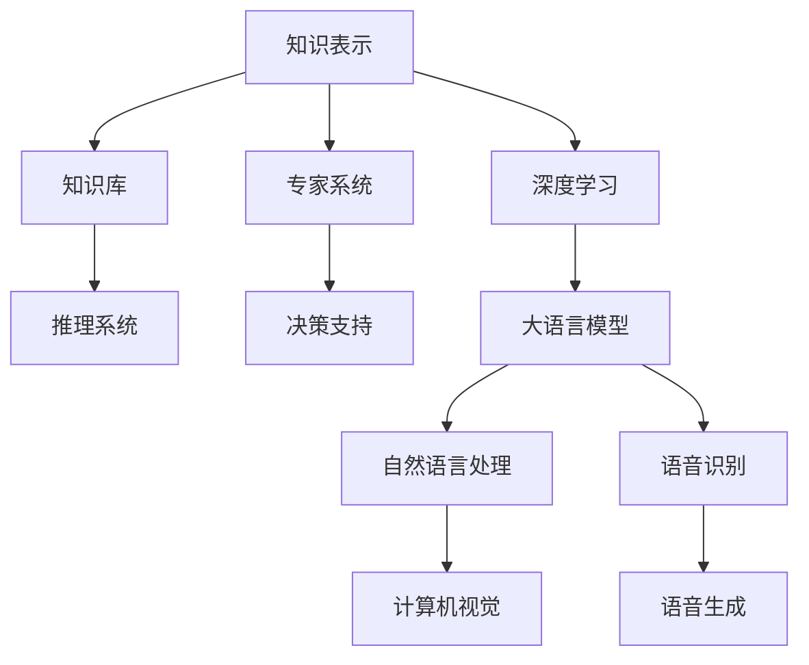

                 

## 1. 背景介绍

在人类文明的长河中，知识是不断演进和进步的动力源泉。从古至今，知识的积累与传播一直是以信息处理为核心任务。而计算机科学的诞生，特别是人工智能技术的飞速发展，让这场跨越时空的对话成为可能。

### 1.1 知识的时代变迁

- **古典时代**：知识和信息主要以手抄和口传的方式进行传播，知识和理解的传播范围和速度受到极大限制。
- **工业革命时代**：蒸汽机和印刷术的发明极大地加快了知识的传播速度，但信息的可访问性和普及性仍受物理条件限制。
- **信息时代**：随着互联网和数字技术的普及，信息的可访问性和处理能力达到了前所未有的高度。
- **人工智能时代**：数据与计算的爆炸性增长，使得知识获取和理解的方式又有了革命性的变化。

### 1.2 计算机科学和人工智能的崛起

- **1950年代**：计算机科学作为一门独立的学科正式成立。
- **1980年代**：人工智能进入实用化阶段，专家系统和机器学习开始用于解决特定问题。
- **2000年代**：深度学习和大数据技术的兴起，推动了人工智能从规则驱动转向数据驱动。
- **2020年代**：大语言模型的出现，推动了自然语言处理和人工智能应用的飞跃，使得人类与知识的对话进入了一个全新的阶段。

## 2. 核心概念与联系

### 2.1 核心概念概述

- **知识表示**：知识表示是计算机科学领域中极为重要的概念，它指如何将知识转化为计算机能够理解和处理的形式。
- **知识工程**：知识工程是创建知识库和推理系统的过程，旨在让计算机能够理解和利用人类的知识。
- **人工智能**：人工智能是使计算机具有智能行为的技术，包括机器学习、自然语言处理、计算机视觉等多个领域。
- **深度学习**：深度学习是利用多层神经网络进行模式识别和决策的机器学习方法，是实现人工智能的重要手段。
- **大语言模型**：大语言模型是利用深度学习技术训练的强大语言理解与生成模型，能够模拟人类的语言处理能力。

### 2.2 核心概念原理和架构的 Mermaid 流程图



## 3. 核心算法原理 & 具体操作步骤

### 3.1 算法原理概述

大语言模型的核心算法基于深度学习和自监督学习，通过在庞大的无标签数据集上进行预训练，学习到丰富的语言表示。在此基础上，利用监督学习对特定任务进行微调，使其具备解决具体问题的能力。

### 3.2 算法步骤详解

#### 3.2.1 预训练步骤

1. **数据收集**：收集庞大的无标签文本数据，如维基百科、新闻、书籍等。
2. **数据处理**：对数据进行清洗、分词、标记化等预处理操作。
3. **模型训练**：使用大型的Transformer网络结构，通过自监督任务（如掩码语言模型）进行训练，学习语言的上下文关系和语义信息。

#### 3.2.2 微调步骤

1. **任务定义**：根据具体应用场景定义任务，如命名实体识别、情感分析、机器翻译等。
2. **数据准备**：收集和准备有标签的任务数据，进行标注和预处理。
3. **模型加载**：使用预训练的模型架构，加载模型权重。
4. **任务适配**：根据任务定义，添加或修改模型的输出层和损失函数。
5. **训练与验证**：使用标注数据对模型进行训练，周期性在验证集上评估性能，调整超参数。
6. **测试与部署**：在测试集上评估模型性能，部署到实际应用环境中。

### 3.3 算法优缺点

#### 3.3.1 优点

1. **泛化能力强**：通过预训练获得通用语言表示，微调可以提升模型在特定任务上的性能。
2. **数据需求低**：相较于从头训练模型，微调需要的标注数据量较少。
3. **开发周期短**：微调技术可以快速将预训练模型应用于新的任务，缩短开发周期。
4. **可解释性强**：微调模型具有可解释性，能够追溯模型的推理过程。

#### 3.3.2 缺点

1. **依赖标注数据**：微调依赖标注数据，获取高质量标注数据成本较高。
2. **泛化能力有限**：微调模型在特定任务上的泛化能力可能受限于数据集质量。
3. **负迁移风险**：预训练模型中存在的偏见和错误信息可能传递到微调模型。
4. **计算资源消耗大**：微调过程涉及大量计算，需要高性能的硬件支持。

### 3.4 算法应用领域

大语言模型微调技术已经广泛应用于多个领域，包括但不限于：

1. **自然语言处理**：命名实体识别、情感分析、文本分类、机器翻译等。
2. **语音识别与处理**：语音识别、语音合成、语音命令等。
3. **计算机视觉**：图像分类、目标检测、人脸识别等。
4. **智能推荐**：个性化推荐、广告推荐、内容推荐等。
5. **医疗健康**：疾病诊断、健康管理、医学研究等。
6. **金融风控**：信用评分、风险评估、欺诈检测等。
7. **教育培训**：智能辅导、自动评估、学习路径规划等。

## 4. 数学模型和公式 & 详细讲解

### 4.1 数学模型构建

大语言模型通常基于Transformer架构，其数学模型可以表示为：

$$
\mathbf{y} = \mathbf{W}^{out} \sigma(\mathbf{W}^{in} \mathbf{x} + \mathbf{b}^{in} + \mathbf{W}^{attn} \mathbf{z} + \mathbf{b}^{attn})
$$

其中：
- $\mathbf{x}$：输入序列的编码向量。
- $\mathbf{z}$：注意力机制的输出向量。
- $\mathbf{W}^{in}$、$\mathbf{W}^{out}$：线性变换矩阵。
- $\sigma$：非线性激活函数。
- $\mathbf{b}^{in}$、$\mathbf{b}^{attn}$：偏置项。

### 4.2 公式推导过程

以微调模型用于文本分类任务为例，目标函数可以表示为：

$$
\mathcal{L}(\theta) = -\frac{1}{N} \sum_{i=1}^N \sum_{j=1}^K y_i^j \log \hat{y}_i^j
$$

其中，$y_i^j$ 表示第 $i$ 个样本的第 $j$ 个类别，$\hat{y}_i^j$ 表示模型对第 $i$ 个样本的第 $j$ 个类别的预测概率。

通过反向传播算法，可以求得参数 $\theta$ 的梯度，更新模型的权重：

$$
\theta \leftarrow \theta - \eta \nabla_{\theta}\mathcal{L}(\theta)
$$

其中，$\eta$ 为学习率，$\nabla_{\theta}\mathcal{L}(\theta)$ 为损失函数对参数 $\theta$ 的梯度。

### 4.3 案例分析与讲解

以微调BERT模型用于情感分析为例：

1. **数据准备**：收集情感标注的评论数据集，进行分词和标记。
2. **模型加载**：使用BERT预训练模型，加载模型权重。
3. **任务适配**：将BERT输出层替换为全连接层，添加softmax激活函数作为输出层。
4. **训练过程**：使用标注数据集进行微调，周期性在验证集上评估性能。
5. **结果评估**：在测试集上评估微调后模型的性能，如精确度、召回率、F1值等。

## 5. 项目实践：代码实例和详细解释说明

### 5.1 开发环境搭建

- **Python**：安装Python 3.8及以上版本，配置开发环境。
- **TensorFlow**：安装TensorFlow 2.x版本，配置GPU支持。
- **Transformers库**：安装Hugging Face的Transformers库，用于模型加载和微调。
- **TensorBoard**：安装TensorFlow配套的TensorBoard，用于可视化模型训练过程。

### 5.2 源代码详细实现

以下是使用TensorFlow和Transformers库对BERT模型进行情感分析微调的示例代码：

```python
import tensorflow as tf
from transformers import BertTokenizer, BertForSequenceClassification
import numpy as np
import pandas as pd

# 加载数据集
train_df = pd.read_csv('train.csv')
test_df = pd.read_csv('test.csv')

# 分词和标记化
tokenizer = BertTokenizer.from_pretrained('bert-base-uncased')
train_texts = train_df['text'].tolist()
train_labels = train_df['label'].tolist()

# 构建模型
model = BertForSequenceClassification.from_pretrained('bert-base-uncased', num_labels=2)
model.compile(optimizer=tf.keras.optimizers.Adam(learning_rate=2e-5),
              loss=tf.keras.losses.SparseCategoricalCrossentropy(from_logits=True),
              metrics=[tf.keras.metrics.SparseCategoricalAccuracy()])

# 数据预处理
train_encodings = tokenizer(train_texts, truncation=True, padding=True)
train_labels = tf.keras.utils.to_categorical(train_labels)
train_dataset = tf.data.Dataset.from_tensor_slices((np.array(train_encodings.input_ids), np.array(train_encodings.attention_mask), np.array(train_labels)))
train_dataset = train_dataset.shuffle(buffer_size=1024).batch(32)

test_encodings = tokenizer(test_df['text'].tolist(), truncation=True, padding=True)
test_labels = tf.keras.utils.to_categorical(test_df['label'].tolist())
test_dataset = tf.data.Dataset.from_tensor_slices((np.array(test_encodings.input_ids), np.array(test_encodings.attention_mask), np.array(test_labels)))
test_dataset = test_dataset.batch(32)

# 模型训练
model.fit(train_dataset, epochs=5, validation_data=test_dataset)

# 模型评估
test_loss, test_acc = model.evaluate(test_dataset)
print(f'Test accuracy: {test_acc}')
```

### 5.3 代码解读与分析

**数据预处理**：
- 使用BertTokenizer对输入文本进行分词和标记化。
- 将分词后的文本序列转化为模型所需的输入格式。

**模型构建**：
- 使用BertForSequenceClassification加载预训练模型。
- 使用Adam优化器，设置适当的学习率。
- 定义损失函数和评价指标。

**模型训练**：
- 构建训练集和验证集的数据集。
- 使用训练集对模型进行训练。
- 周期性在验证集上评估模型性能，调整超参数。

**模型评估**：
- 在测试集上评估模型的性能。

## 6. 实际应用场景

### 6.1 智能客服

智能客服系统可以借助大语言模型微调技术，实现自动化回复和用户意图理解。通过微调，系统可以学习通用的客服对话模式，结合上下文进行智能回答，提升用户体验。

### 6.2 医疗健康

在医疗领域，大语言模型微调技术可用于疾病诊断、健康管理等。通过微调，模型能够学习医生的诊断经验和知识，辅助医生进行决策。

### 6.3 金融风控

金融风控系统中，大语言模型微调技术可用于信用评分、风险评估等。通过微调，模型能够学习各类金融数据之间的关联性，提升风险识别和预测的准确性。

### 6.4 教育培训

在教育领域，大语言模型微调技术可用于智能辅导、自动评估等。通过微调，模型能够理解学生的学习行为和知识掌握情况，提供个性化的学习建议和评估。

## 7. 工具和资源推荐

### 7.1 学习资源推荐

- **《深度学习》（Ian Goodfellow等）**：深度学习领域经典的教材，涵盖深度学习的基本概念和算法。
- **Coursera深度学习课程**：由Andrew Ng教授主讲，介绍深度学习的基本概念、算法和实践。
- **Transformers官方文档**：Hugging Face的Transformers库官方文档，提供了丰富的模型和微调样例代码。
- **Kaggle竞赛平台**：提供丰富的NLP数据集和竞赛，是学习和实践微调技术的绝佳平台。

### 7.2 开发工具推荐

- **Jupyter Notebook**：用于编写和执行Python代码，支持交互式数据分析和可视化。
- **TensorBoard**：可视化工具，用于监测模型训练过程，生成训练日志。
- **PyCharm**：Python开发环境，提供了丰富的插件和调试功能。
- **Google Colab**：在线Jupyter Notebook环境，提供免费的GPU/TPU算力。

### 7.3 相关论文推荐

- **Attention is All You Need**（NeurIPS 2017）：Transformer的开创性论文，引入了自注意力机制，显著提升了语言模型性能。
- **BERT: Pre-training of Deep Bidirectional Transformers for Language Understanding**（NIPS 2018）：提出BERT模型，通过预训练和微调提升了自然语言理解能力。
- **T5: Exploring the Limits of Transfer Learning with a Unified Text-to-Text Transformer**（EMNLP 2019）：提出T5模型，通过统一的任务适配层，实现了多种NLP任务的微调。
- **GPT-3: Language Models are Unsupervised Multitask Learners**（NIPS 2020）：推出GPT-3模型，展示了超大语言模型的强大零样本学习能力。

## 8. 总结：未来发展趋势与挑战

### 8.1 研究成果总结

大语言模型微调技术已经在多个领域取得了显著的成果，推动了NLP应用的普及和深化。未来，随着计算能力的提升和数据量的增加，大语言模型将变得更加强大和通用。

### 8.2 未来发展趋势

1. **模型的规模和性能**：随着计算资源的增加，模型规模和性能将进一步提升，支持更加复杂和多样化的应用场景。
2. **模型的可解释性**：研究将更加注重模型的可解释性，帮助用户理解模型的决策过程。
3. **模型的跨领域迁移能力**：大语言模型将具备更强的跨领域迁移能力，能够在不同的任务和领域中实现知识共享。
4. **模型的泛化能力**：通过引入更多的数据和任务，模型将能够更好地泛化，提升在不同数据集上的性能。
5. **模型的伦理和安全性**：研究将更加注重模型的伦理和安全性，确保模型的输出不会产生负面影响。

### 8.3 面临的挑战

1. **数据质量和多样性**：获取高质量和多样化的标注数据是一个巨大的挑战，需要更多的数据收集和处理技术。
2. **模型的泛化能力**：模型在特定任务上的泛化能力有待提升，需要在模型设计和训练过程中更加注重泛化性能。
3. **模型的伦理和安全性**：大语言模型可能带有偏见和有害信息，需要研究如何过滤和控制这些问题。
4. **模型的计算资源需求**：模型规模和性能的提升需要更高的计算资源，需要在硬件和软件层面进行优化。
5. **模型的可解释性**：大语言模型通常被视为“黑盒”，需要研究如何提升模型的可解释性和可理解性。

### 8.4 研究展望

未来，大语言模型微调技术需要在以下几个方面进行深入研究：

1. **无监督学习和半监督学习**：探索如何在无监督或半监督条件下进行微调，减少对标注数据的依赖。
2. **跨领域知识整合**：研究如何将知识图谱、逻辑规则等专家知识与模型结合，提升模型的知识整合能力。
3. **多模态信息融合**：研究如何将视觉、语音等多模态信息与文本信息进行融合，提升模型的综合理解和推理能力。
4. **模型的伦理和安全**：研究如何设计伦理导向的模型评估指标，确保模型的输出符合人类价值观和伦理道德。
5. **模型的可解释性**：研究如何提升模型的可解释性，增强用户对模型决策过程的理解和信任。

## 9. 附录：常见问题与解答

**Q1：大语言模型微调是否适用于所有NLP任务？**

A: 大语言模型微调在大多数NLP任务上都能取得不错的效果，特别是对于数据量较小的任务。但对于一些特定领域的任务，如医学、法律等，仅仅依靠通用语料预训练的模型可能难以很好地适应。此时需要在特定领域语料上进一步预训练，再进行微调，才能获得理想效果。

**Q2：微调过程中如何选择合适的学习率？**

A: 微调的学习率一般要比预训练时小1-2个数量级，如果使用过大的学习率，容易破坏预训练权重，导致过拟合。一般建议从1e-5开始调参，逐步减小学习率，直至收敛。也可以使用warmup策略，在开始阶段使用较小的学习率，再逐渐过渡到预设值。需要注意的是，不同的优化器(如AdamW、Adafactor等)以及不同的学习率调度策略，可能需要设置不同的学习率阈值。

**Q3：采用大模型微调时会面临哪些资源瓶颈？**

A: 目前主流的预训练大模型动辄以亿计的参数规模，对算力、内存、存储都提出了很高的要求。GPU/TPU等高性能设备是必不可少的，但即便如此，超大批次的训练和推理也可能遇到显存不足的问题。因此需要采用一些资源优化技术，如梯度积累、混合精度训练、模型并行等，来突破硬件瓶颈。同时，模型的存储和读取也可能占用大量时间和空间，需要采用模型压缩、稀疏化存储等方法进行优化。

**Q4：如何缓解微调过程中的过拟合问题？**

A: 过拟合是微调面临的主要挑战，尤其是在标注数据不足的情况下。常见的缓解策略包括：
1. 数据增强：通过回译、近义替换等方式扩充训练集
2. 正则化：使用L2正则、Dropout、Early Stopping等避免过拟合
3. 对抗训练：引入对抗样本，提高模型鲁棒性
4. 参数高效微调：只调整少量参数(如Adapter、Prefix等)，减小过拟合风险
5. 多模型集成：训练多个微调模型，取平均输出，抑制过拟合

这些策略往往需要根据具体任务和数据特点进行灵活组合。只有在数据、模型、训练、推理等各环节进行全面优化，才能最大限度地发挥大模型微调的威力。

**Q5：微调模型在落地部署时需要注意哪些问题？**

A: 将微调模型转化为实际应用，还需要考虑以下因素：
1. 模型裁剪：去除不必要的层和参数，减小模型尺寸，加快推理速度
2. 量化加速：将浮点模型转为定点模型，压缩存储空间，提高计算效率
3. 服务化封装：将模型封装为标准化服务接口，便于集成调用
4. 弹性伸缩：根据请求流量动态调整资源配置，平衡服务质量和成本
5. 监控告警：实时采集系统指标，设置异常告警阈值，确保服务稳定性
6. 安全防护：采用访问鉴权、数据脱敏等措施，保障数据和模型安全

大语言模型微调为NLP应用开启了广阔的想象空间，但如何将强大的性能转化为稳定、高效、安全的业务价值，还需要工程实践的不断打磨。总之，微调需要开发者根据具体任务，不断迭代和优化模型、数据和算法，方能得到理想的效果。

---

作者：禅与计算机程序设计艺术 / Zen and the Art of Computer Programming

