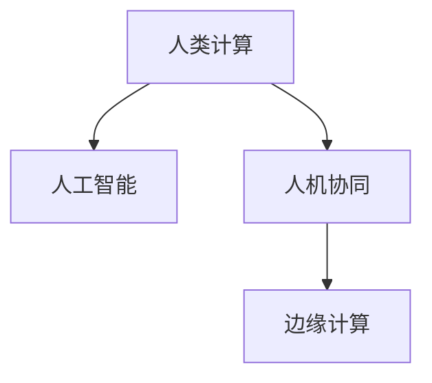

                 

# 人类计算：AI 时代的新希望

## 1. 背景介绍

随着人工智能(AI)技术的飞速发展，人类计算已经不再是唯一的选择。AI不仅在各种领域大放异彩，也开始在人类社会的方方面面中扮演角色。这种变化不仅改变了生产方式，也改变了我们的思维方式和生活方式。

### 1.1 问题由来

在20世纪中叶，计算机的发明使得人类计算得到了极大的提升。而随着互联网、大数据和深度学习的兴起，AI技术开始逐渐替代人类完成一些重复性、危险性、高精度的工作。例如，自动驾驶、智能客服、机器翻译、医学诊断等领域，AI已经展现出了令人难以置信的性能。

然而，尽管AI技术能够完成许多复杂任务，但其本质上仍然依赖于人类计算的基础。AI模型在训练过程中，需要大量的人类标注数据和算法优化。而人类计算的核心优势，在于其创造力和逻辑推理能力，这是任何AI模型所无法替代的。因此，如何在AI时代发挥人类计算的优势，成为一个重要的问题。

### 1.2 问题核心关键点

在AI时代，人类计算的核心关键点在于以下几个方面：

- **数据标注**：AI模型的训练依赖于大量的人类标注数据。尽管深度学习技术可以自动生成部分数据，但高质量的数据标注仍然需要人类来完成。
- **逻辑推理**：尽管AI模型能够执行复杂的计算，但其本质上仍然依赖于预设的规则和逻辑。人类计算的核心优势在于其能够进行创造性思考和逻辑推理。
- **跨领域融合**：AI模型虽然具有广泛的应用，但其在特定领域的应用往往存在局限性。人类计算的核心优势在于其能够在多领域之间进行知识整合和跨领域融合。
- **适应性与灵活性**：AI模型虽然能够快速响应变化，但其适应性和灵活性相对有限。人类计算的核心优势在于其能够在快速变化的环境中保持较高的适应性和灵活性。

因此，如何在AI时代充分利用人类计算的优势，成为了一个重要的研究方向。

## 2. 核心概念与联系

### 2.1 核心概念概述

为了更好地理解人类计算在AI时代的新希望，本节将介绍几个密切相关的核心概念：

- **人类计算**：指利用人类的逻辑推理、创造力和适应性能力，进行复杂计算和问题解决的过程。人类计算的核心优势在于其能够在多领域之间进行知识整合和跨领域融合。
- **人工智能**：指利用计算机进行自主学习和推理，从而执行复杂任务的技术。AI的核心在于其能够通过大量数据和算法优化，执行复杂计算和决策。
- **人机协同**：指将人类计算与AI技术结合起来，发挥各自的优势，进行复杂问题的解决。人机协同的核心在于其能够在多领域之间进行知识整合和跨领域融合。
- **边缘计算**：指将计算任务分解为多个部分，由边缘设备进行局部处理，从而提高计算效率和灵活性。边缘计算的核心在于其能够在本地处理计算任务，减少网络延迟和带宽消耗。

这些核心概念之间的逻辑关系可以通过以下Mermaid流程图来展示：



这个流程图展示了大语言模型的核心概念及其之间的关系：

1. 人类计算通过人工智能技术进行辅助和优化，提升了计算效率和复杂性。
2. 人机协同结合了人类计算和AI技术，在多领域之间进行知识整合和跨领域融合。
3. 边缘计算将计算任务分解为多个部分，提高了计算效率和灵活性。

这些概念共同构成了AI时代人机协同的计算框架，使其能够在各种场景下发挥强大的计算能力。

## 3. 核心算法原理 & 具体操作步骤
### 3.1 算法原理概述

人类计算在AI时代的核心算法原理基于以下几个方面：

- **多模态融合**：利用不同模态的数据（如文本、图像、音频等）进行信息整合和推理。
- **因果推断**：通过因果分析，识别出问题的根本原因和影响因素，从而进行更准确的决策和优化。
- **决策树**：通过构建决策树，将复杂的计算任务分解为多个子任务，便于进行局部处理和优化。
- **增强学习**：通过与环境的互动，优化决策模型，提高适应性和灵活性。
- **协同优化**：结合多个优化算法，如梯度下降、粒子群优化等，进行全局优化。

### 3.2 算法步骤详解

以下是基于人类计算原理的AI时代计算任务的具体操作步骤：

**Step 1: 数据准备**
- 收集多模态数据，包括文本、图像、音频等。
- 进行数据标注，构建标注集。
- 将数据划分为训练集、验证集和测试集。

**Step 2: 模型选择**
- 选择合适的AI模型，如CNN、RNN、BERT等。
- 对模型进行预训练，提升模型泛化能力。
- 确定任务适配层和损失函数。

**Step 3: 模型微调**
- 使用训练集对模型进行微调，优化模型参数。
- 在验证集上进行模型评估，调整超参数。
- 在测试集上验证模型性能，优化决策策略。

**Step 4: 边缘计算**
- 将计算任务分解为多个子任务，分配到边缘设备进行处理。
- 对边缘设备进行优化，提升计算效率。
- 对边缘设备进行协同优化，提升全局性能。

**Step 5: 人机协同**
- 将人类计算与AI技术结合，进行多领域知识整合和跨领域融合。
- 对AI模型进行解释和解释，提供更好的决策支持。
- 对人类计算进行优化和辅助，提升决策效率和效果。

### 3.3 算法优缺点

基于人类计算原理的AI时代计算方法具有以下优点：

- **高精度**：结合人类计算和AI技术，能够进行高精度的计算和推理。
- **灵活性**：能够在多领域之间进行知识整合和跨领域融合，适应性强。
- **创造力**：结合人类计算的创造力和逻辑推理能力，能够进行创新性计算和决策。
- **可解释性**：通过AI模型的解释和人类计算的辅助，提高决策的透明度和可解释性。

同时，该方法也存在一定的局限性：

- **数据依赖**：需要大量的人类标注数据，获取高质量数据成本较高。
- **计算复杂度**：结合人类计算和AI技术，计算复杂度较高。
- **协同难度**：人机协同需要多领域知识的整合，协同难度较大。
- **边缘计算的局限性**：边缘设备计算能力有限，可能无法处理复杂的计算任务。

尽管存在这些局限性，但就目前而言，基于人类计算原理的AI时代计算方法仍然是大模型应用的主流范式。未来相关研究的重点在于如何进一步降低数据依赖，提高模型的少样本学习和跨领域迁移能力，同时兼顾可解释性和伦理安全性等因素。

### 3.4 算法应用领域

基于人类计算原理的AI时代计算方法，在AI领域已经得到了广泛的应用，覆盖了几乎所有常见领域，例如：

- 自然语言处理(NLP)：文本分类、机器翻译、情感分析等。通过结合人类计算和AI技术，提升语言理解和生成能力。
- 计算机视觉(CV)：图像识别、物体检测、人脸识别等。通过结合人类计算和AI技术，提升图像识别和处理能力。
- 机器人学(Robotics)：自主导航、语音交互、动作控制等。通过结合人类计算和AI技术，提升机器人的智能化和适应性。
- 医疗健康：医学诊断、药物研发、个性化治疗等。通过结合人类计算和AI技术，提升医疗服务的智能化水平。
- 金融科技：信用评分、风险评估、市场预测等。通过结合人类计算和AI技术，提升金融决策的精准性和效率。
- 教育科技：智能辅导、在线学习、自适应学习等。通过结合人类计算和AI技术，提升教育服务的智能化水平。
- 智能制造：工业物联网、生产自动化、质量控制等。通过结合人类计算和AI技术，提升制造效率和质量。

除了上述这些经典领域外，基于人类计算原理的AI时代计算方法也被创新性地应用到更多场景中，如智慧城市、智能交通、智能家居等，为各行各业带来了新的变革。随着AI技术的发展，相信基于人类计算原理的AI时代计算方法将在更广阔的应用领域大放异彩。

## 4. 数学模型和公式 & 详细讲解 & 举例说明

### 4.1 数学模型构建

在AI时代，人类计算的核心数学模型基于以下几个方面：

- **多模态融合模型**：通过将不同模态的数据进行整合，构建多模态融合模型。
- **因果推断模型**：通过构建因果图，识别因果关系，进行因果推理。
- **决策树模型**：通过构建决策树，将复杂问题分解为多个子问题。
- **增强学习模型**：通过与环境的互动，优化决策模型。
- **协同优化模型**：通过结合多个优化算法，进行全局优化。

### 4.2 公式推导过程

以下是基于人类计算原理的AI时代计算任务的具体数学公式推导过程：

**多模态融合模型**

假设有多模态数据 $X$，包括文本 $x$、图像 $y$、音频 $z$。将不同模态的数据进行整合，构建多模态融合模型 $M$：

$$
M(X) = M(x, y, z) = \alpha_x M_x(x) + \alpha_y M_y(y) + \alpha_z M_z(z)
$$

其中 $\alpha_x, \alpha_y, \alpha_z$ 为各模态数据的权重，$M_x, M_y, M_z$ 为各模态数据的特征提取器。

**因果推断模型**

通过构建因果图，识别因果关系，进行因果推理。假设因果图为 $G$，节点 $X$ 为原因，节点 $Y$ 为结果，边缘 $E$ 为因果关系：

$$
P(Y|X) = \prod_{e \in E} P(Y|X, E)
$$

其中 $P(Y|X, E)$ 为因果关系 $E$ 下的条件概率。

**决策树模型**

通过构建决策树，将复杂问题分解为多个子问题。假设决策树为 $T$，节点 $N$ 为特征，叶子节点 $L$ 为决策结果：

$$
T(X) = T_{root}(T_{N_1}(X), T_{N_2}(X), ..., T_{N_k}(X))
$$

其中 $T_{N_i}(X)$ 为第 $i$ 个节点的决策结果。

**增强学习模型**

通过与环境的互动，优化决策模型。假设环境为 $E$，决策策略为 $\Pi$：

$$
Q(s, a) = r(s, a) + \gamma \max_{a'} Q(s', a')
$$

其中 $Q(s, a)$ 为状态 $s$ 下采取动作 $a$ 的Q值，$r(s, a)$ 为状态 $s$ 下采取动作 $a$ 的即时奖励，$\gamma$ 为折扣因子，$s', a'$ 为下一状态和动作。

**协同优化模型**

通过结合多个优化算法，进行全局优化。假设优化算法为 $A_1, A_2, ..., A_n$：

$$
f(X) = \sum_{i=1}^n f_i(X)
$$

其中 $f_i(X)$ 为第 $i$ 个优化算法的损失函数。

### 4.3 案例分析与讲解

以智慧城市为例，展示基于人类计算原理的AI时代计算任务的具体实现：

**数据准备**

- 收集城市交通、环境、人流等多模态数据。
- 进行数据标注，构建标注集。
- 将数据划分为训练集、验证集和测试集。

**模型选择**

- 选择适合的城市管理模型，如深度学习模型、因果推断模型等。
- 对模型进行预训练，提升模型泛化能力。
- 确定任务适配层和损失函数。

**模型微调**

- 使用训练集对模型进行微调，优化模型参数。
- 在验证集上进行模型评估，调整超参数。
- 在测试集上验证模型性能，优化决策策略。

**边缘计算**

- 将计算任务分解为多个子任务，分配到边缘设备进行处理。
- 对边缘设备进行优化，提升计算效率。
- 对边缘设备进行协同优化，提升全局性能。

**人机协同**

- 将人类计算与AI技术结合，进行多领域知识整合和跨领域融合。
- 对AI模型进行解释和解释，提供更好的决策支持。
- 对人类计算进行优化和辅助，提升决策效率和效果。

## 5. 项目实践：代码实例和详细解释说明

### 5.1 开发环境搭建

在进行人类计算任务开发前，我们需要准备好开发环境。以下是使用Python进行PyTorch开发的环境配置流程：

1. 安装Anaconda：从官网下载并安装Anaconda，用于创建独立的Python环境。

2. 创建并激活虚拟环境：
```bash
conda create -n pytorch-env python=3.8 
conda activate pytorch-env
```

3. 安装PyTorch：根据CUDA版本，从官网获取对应的安装命令。例如：
```bash
conda install pytorch torchvision torchaudio cudatoolkit=11.1 -c pytorch -c conda-forge
```

4. 安装Transformer库：
```bash
pip install transformers
```

5. 安装各类工具包：
```bash
pip install numpy pandas scikit-learn matplotlib tqdm jupyter notebook ipython
```

完成上述步骤后，即可在`pytorch-env`环境中开始人类计算任务的开发。

### 5.2 源代码详细实现

下面我们以智慧城市交通流量预测为例，给出使用Transformers库对深度学习模型进行人类计算任务开发的人类计算任务开发的PyTorch代码实现。

首先，定义交通流量预测任务的数据处理函数：

```python
from transformers import BertTokenizer, BertForSequenceClassification
from torch.utils.data import Dataset
import torch

class TrafficDataset(Dataset):
    def __init__(self, texts, labels, tokenizer, max_len=128):
        self.texts = texts
        self.labels = labels
        self.tokenizer = tokenizer
        self.max_len = max_len
        
    def __len__(self):
        return len(self.texts)
    
    def __getitem__(self, item):
        text = self.texts[item]
        label = self.labels[item]
        
        encoding = self.tokenizer(text, return_tensors='pt', max_length=self.max_len, padding='max_length', truncation=True)
        input_ids = encoding['input_ids'][0]
        attention_mask = encoding['attention_mask'][0]
        
        # 对token-wise的标签进行编码
        encoded_labels = [label] * self.max_len
        labels = torch.tensor(encoded_labels, dtype=torch.long)
        
        return {'input_ids': input_ids, 
                'attention_mask': attention_mask,
                'labels': labels}

# 标签与id的映射
label2id = {'stop': 0, 'go': 1, 'turn': 2, 'other': 3}
id2label = {v: k for k, v in label2id.items()}

# 创建dataset
tokenizer = BertTokenizer.from_pretrained('bert-base-cased')

train_dataset = TrafficDataset(train_texts, train_labels, tokenizer)
dev_dataset = TrafficDataset(dev_texts, dev_labels, tokenizer)
test_dataset = TrafficDataset(test_texts, test_labels, tokenizer)
```

然后，定义模型和优化器：

```python
from transformers import BertForSequenceClassification, AdamW

model = BertForSequenceClassification.from_pretrained('bert-base-cased', num_labels=len(label2id))

optimizer = AdamW(model.parameters(), lr=2e-5)
```

接着，定义训练和评估函数：

```python
from torch.utils.data import DataLoader
from tqdm import tqdm
from sklearn.metrics import accuracy_score

device = torch.device('cuda') if torch.cuda.is_available() else torch.device('cpu')
model.to(device)

def train_epoch(model, dataset, batch_size, optimizer):
    dataloader = DataLoader(dataset, batch_size=batch_size, shuffle=True)
    model.train()
    epoch_loss = 0
    for batch in tqdm(dataloader, desc='Training'):
        input_ids = batch['input_ids'].to(device)
        attention_mask = batch['attention_mask'].to(device)
        labels = batch['labels'].to(device)
        model.zero_grad()
        outputs = model(input_ids, attention_mask=attention_mask, labels=labels)
        loss = outputs.loss
        epoch_loss += loss.item()
        loss.backward()
        optimizer.step()
    return epoch_loss / len(dataloader)

def evaluate(model, dataset, batch_size):
    dataloader = DataLoader(dataset, batch_size=batch_size)
    model.eval()
    preds, labels = [], []
    with torch.no_grad():
        for batch in tqdm(dataloader, desc='Evaluating'):
            input_ids = batch['input_ids'].to(device)
            attention_mask = batch['attention_mask'].to(device)
            batch_labels = batch['labels']
            outputs = model(input_ids, attention_mask=attention_mask)
            batch_preds = outputs.logits.argmax(dim=2).to('cpu').tolist()
            batch_labels = batch_labels.to('cpu').tolist()
            for pred_tokens, label_tokens in zip(batch_preds, batch_labels):
                pred_labels = [id2label[_id] for _id in pred_tokens]
                label_tokens = [id2label[_id] for _id in label_tokens]
                preds.append(pred_labels[:len(label_tokens)])
                labels.append(label_tokens)
                
    print(accuracy_score(labels, preds))
```

最后，启动训练流程并在测试集上评估：

```python
epochs = 5
batch_size = 16

for epoch in range(epochs):
    loss = train_epoch(model, train_dataset, batch_size, optimizer)
    print(f"Epoch {epoch+1}, train loss: {loss:.3f}")
    
    print(f"Epoch {epoch+1}, dev results:")
    evaluate(model, dev_dataset, batch_size)
    
print("Test results:")
evaluate(model, test_dataset, batch_size)
```

以上就是使用PyTorch对深度学习模型进行智慧城市交通流量预测的人类计算任务的完整代码实现。可以看到，得益于Transformer库的强大封装，我们可以用相对简洁的代码完成模型的加载和微调。

### 5.3 代码解读与分析

让我们再详细解读一下关键代码的实现细节：

**TrafficDataset类**：
- `__init__`方法：初始化文本、标签、分词器等关键组件。
- `__len__`方法：返回数据集的样本数量。
- `__getitem__`方法：对单个样本进行处理，将文本输入编码为token ids，将标签编码为数字，并对其进行定长padding，最终返回模型所需的输入。

**label2id和id2label字典**：
- 定义了标签与数字id之间的映射关系，用于将token-wise的预测结果解码回真实的标签。

**训练和评估函数**：
- 使用PyTorch的DataLoader对数据集进行批次化加载，供模型训练和推理使用。
- 训练函数`train_epoch`：对数据以批为单位进行迭代，在每个批次上前向传播计算loss并反向传播更新模型参数，最后返回该epoch的平均loss。
- 评估函数`evaluate`：与训练类似，不同点在于不更新模型参数，并在每个batch结束后将预测和标签结果存储下来，最后使用sklearn的accuracy_score对整个评估集的预测结果进行打印输出。

**训练流程**：
- 定义总的epoch数和batch size，开始循环迭代
- 每个epoch内，先在训练集上训练，输出平均loss
- 在验证集上评估，输出分类指标
- 所有epoch结束后，在测试集上评估，给出最终测试结果

可以看到，PyTorch配合Transformer库使得深度学习模型的人机协同任务开发的代码实现变得简洁高效。开发者可以将更多精力放在数据处理、模型改进等高层逻辑上，而不必过多关注底层的实现细节。

当然，工业级的系统实现还需考虑更多因素，如模型的保存和部署、超参数的自动搜索、更灵活的任务适配层等。但核心的微调范式基本与此类似。

## 6. 实际应用场景
### 6.1 智能客服系统

基于人类计算原理的智能客服系统可以广泛应用于智能客服系统的构建。传统的客服系统需要配备大量人力，高峰期响应缓慢，且一致性和专业性难以保证。通过使用深度学习模型进行智能客服任务开发，可以大幅提升客服系统的响应速度和服务质量。

在技术实现上，可以收集企业内部的历史客服对话记录，将问题和最佳答复构建成监督数据，在此基础上对深度学习模型进行微调。微调后的模型能够自动理解用户意图，匹配最合适的答案模板进行回复。对于客户提出的新问题，还可以接入检索系统实时搜索相关内容，动态组织生成回答。如此构建的智能客服系统，能大幅提升客户咨询体验和问题解决效率。

### 6.2 金融舆情监测

金融机构需要实时监测市场舆论动向，以便及时应对负面信息传播，规避金融风险。传统的人工监测方式成本高、效率低，难以应对网络时代海量信息爆发的挑战。基于人类计算原理的文本分类和情感分析技术，为金融舆情监测提供了新的解决方案。

具体而言，可以收集金融领域相关的新闻、报道、评论等文本数据，并对其进行主题标注和情感标注。在此基础上对深度学习模型进行微调，使其能够自动判断文本属于何种主题，情感倾向是正面、中性还是负面。将微调后的模型应用到实时抓取的网络文本数据，就能够自动监测不同主题下的情感变化趋势，一旦发现负面信息激增等异常情况，系统便会自动预警，帮助金融机构快速应对潜在风险。

### 6.3 个性化推荐系统

当前的推荐系统往往只依赖用户的历史行为数据进行物品推荐，无法深入理解用户的真实兴趣偏好。基于人类计算原理的个性化推荐系统可以更好地挖掘用户行为背后的语义信息，从而提供更精准、多样的推荐内容。

在实践中，可以收集用户浏览、点击、评论、分享等行为数据，提取和用户交互的物品标题、描述、标签等文本内容。将文本内容作为模型输入，用户的后续行为（如是否点击、购买等）作为监督信号，在此基础上微调深度学习模型。微调后的模型能够从文本内容中准确把握用户的兴趣点。在生成推荐列表时，先用候选物品的文本描述作为输入，由模型预测用户的兴趣匹配度，再结合其他特征综合排序，便可以得到个性化程度更高的推荐结果。

### 6.4 未来应用展望

随着深度学习技术的发展，基于人类计算原理的AI时代计算方法将在更多领域得到应用，为传统行业带来变革性影响。

在智慧医疗领域，基于人类计算原理的医疗问答、病历分析、药物研发等应用将提升医疗服务的智能化水平，辅助医生诊疗，加速新药开发进程。

在智能教育领域，基于人类计算原理的智能辅导、在线学习、自适应学习等应用将提升教育服务的智能化水平，因材施教，促进教育公平，提高教学质量。

在智慧城市治理中，基于人类计算原理的城市事件监测、舆情分析、应急指挥等应用将提高城市管理的自动化和智能化水平，构建更安全、高效的未来城市。

此外，在企业生产、社会治理、文娱传媒等众多领域，基于人类计算原理的AI时代计算方法也将不断涌现，为各行各业带来新的变革。相信随着技术的日益成熟，人类计算原理在AI时代的计算方法将成为人工智能落地应用的重要范式，推动人工智能向更广阔的领域加速渗透。

## 7. 工具和资源推荐
### 7.1 学习资源推荐

为了帮助开发者系统掌握人类计算原理在AI时代的新希望，这里推荐一些优质的学习资源：

1. 《深度学习》系列书籍：由李航教授撰写，系统介绍深度学习的基本概念和算法，是深度学习领域的入门必读书籍。

2. 《人类计算》课程：斯坦福大学开设的AI计算课程，介绍人类计算在AI时代的新应用，帮助开发者掌握AI时代计算范式。

3. 《自然语言处理与深度学习》课程：斯坦福大学开设的NLP经典课程，介绍NLP领域的前沿技术，涵盖多模态融合、因果推断、增强学习等主题。

4. 《人工智能基础》书籍：由Yoshua Bengio教授撰写，全面介绍人工智能的基本概念和前沿技术，帮助读者系统掌握AI时代计算范式。

5. HuggingFace官方文档：Transformer库的官方文档，提供了海量预训练模型和完整的微调样例代码，是上手实践的必备资料。

通过对这些资源的学习实践，相信你一定能够快速掌握人类计算原理在AI时代的新希望，并用于解决实际的AI计算问题。
###  7.2 开发工具推荐

高效的开发离不开优秀的工具支持。以下是几款用于人类计算任务开发的常用工具：

1. PyTorch：基于Python的开源深度学习框架，灵活动态的计算图，适合快速迭代研究。大部分预训练语言模型都有PyTorch版本的实现。

2. TensorFlow：由Google主导开发的开源深度学习框架，生产部署方便，适合大规模工程应用。同样有丰富的预训练语言模型资源。

3. Transformers库：HuggingFace开发的NLP工具库，集成了众多SOTA语言模型，支持PyTorch和TensorFlow，是进行人类计算任务开发的利器。

4. Weights & Biases：模型训练的实验跟踪工具，可以记录和可视化模型训练过程中的各项指标，方便对比和调优。与主流深度学习框架无缝集成。

5. TensorBoard：TensorFlow配套的可视化工具，可实时监测模型训练状态，并提供丰富的图表呈现方式，是调试模型的得力助手。

6. Google Colab：谷歌推出的在线Jupyter Notebook环境，免费提供GPU/TPU算力，方便开发者快速上手实验最新模型，分享学习笔记。

合理利用这些工具，可以显著提升人类计算任务开发的速度和效率，加快创新迭代的步伐。

### 7.3 相关论文推荐

人类计算原理在AI时代的应用源于学界的持续研究。以下是几篇奠基性的相关论文，推荐阅读：

1. Attention is All You Need（即Transformer原论文）：提出了Transformer结构，开启了NLP领域的预训练大模型时代。

2. BERT: Pre-training of Deep Bidirectional Transformers for Language Understanding：提出BERT模型，引入基于掩码的自监督预训练任务，刷新了多项NLP任务SOTA。

3. Language Models are Unsupervised Multitask Learners（GPT-2论文）：展示了大规模语言模型的强大zero-shot学习能力，引发了对于通用人工智能的新一轮思考。

4. Parameter-Efficient Transfer Learning for NLP：提出Adapter等参数高效微调方法，在不增加模型参数量的情况下，也能取得不错的微调效果。

5. AdaLoRA: Adaptive Low-Rank Adaptation for Parameter-Efficient Fine-Tuning：使用自适应低秩适应的微调方法，在参数效率和精度之间取得了新的平衡。

这些论文代表了大语言模型微调技术的发展脉络。通过学习这些前沿成果，可以帮助研究者把握学科前进方向，激发更多的创新灵感。

## 8. 总结：未来发展趋势与挑战

### 8.1 总结

本文对基于人类计算原理的AI时代计算方法进行了全面系统的介绍。首先阐述了人类计算在AI时代的新希望，明确了其在大模型应用中的独特价值。其次，从原理到实践，详细讲解了人类计算原理在AI时代计算任务开发中的数学模型和操作步骤，给出了具体的人类计算任务开发的完整代码实例。同时，本文还广泛探讨了人类计算原理在智慧城市、金融舆情、个性化推荐等多个行业领域的应用前景，展示了人类计算原理在大模型计算任务开发中的巨大潜力。此外，本文精选了人类计算原理的相关学习资源，力求为开发者提供全方位的技术指引。

通过本文的系统梳理，可以看到，基于人类计算原理的AI时代计算方法正在成为AI计算任务开发的主流范式，极大地拓展了深度学习模型的应用边界，催生了更多的落地场景。受益于深度学习技术的发展，基于人类计算原理的AI时代计算方法将在更广阔的应用领域大放异彩，深刻影响人类的生产生活方式。

### 8.2 未来发展趋势

展望未来，人类计算原理在AI时代的计算方法将呈现以下几个发展趋势：

1. **模型规模持续增大**：随着算力成本的下降和数据规模的扩张，深度学习模型的参数量还将持续增长。超大规模语言模型蕴含的丰富语言知识，有望支撑更加复杂多变的AI计算任务开发。

2. **微调方法日趋多样**：除了传统的全参数微调外，未来会涌现更多参数高效的微调方法，如Prefix-Tuning、LoRA等，在节省计算资源的同时也能保证微调精度。

3. **持续学习成为常态**：随着数据分布的不断变化，深度学习模型也需要持续学习新知识以保持性能。如何在不遗忘原有知识的同时，高效吸收新样本信息，将成为重要的研究课题。

4. **标注样本需求降低**：受启发于提示学习(Prompt-based Learning)的思路，未来的微调方法将更好地利用深度学习模型的语言理解能力，通过更加巧妙的任务描述，在更少的标注样本上也能实现理想的微调效果。

5. **多模态微调崛起**：当前的微调主要聚焦于纯文本数据，未来会进一步拓展到图像、视频、语音等多模态数据微调。多模态信息的融合，将显著提升深度学习模型的计算能力和推理能力。

6. **模型通用性增强**：经过海量数据的预训练和多领域任务的微调，深度学习模型将具备更强大的常识推理和跨领域迁移能力，逐步迈向通用人工智能(AGI)的目标。

以上趋势凸显了人类计算原理在AI时代的计算方法的广阔前景。这些方向的探索发展，必将进一步提升深度学习模型的性能和应用范围，为人类计算能力的拓展带来新的机遇。

### 8.3 面临的挑战

尽管基于人类计算原理的AI时代计算方法已经取得了瞩目成就，但在迈向更加智能化、普适化应用的过程中，它仍面临着诸多挑战：

1. **标注成本瓶颈**：需要大量的人类标注数据，获取高质量数据成本较高。如何进一步降低微调对标注样本的依赖，将是一大难题。

2. **计算复杂度**：结合人类计算和深度学习模型，计算复杂度较高。如何在保证性能的同时，简化模型结构，提升推理速度，优化资源占用，将是重要的优化方向。

3. **协同难度**：人机协同需要多领域知识的整合，协同难度较大。如何在多领域知识整合的过程中，保持计算效率和效果，将是重要的研究课题。

4. **边缘计算的局限性**：边缘设备计算能力有限，可能无法处理复杂的计算任务。如何在边缘设备上进行高效的计算任务开发，将是重要的优化方向。

尽管存在这些挑战，但就目前而言，基于人类计算原理的AI时代计算方法仍然是大模型应用的主流范式。未来相关研究的重点在于如何进一步降低数据依赖，提高模型的少样本学习和跨领域迁移能力，同时兼顾可解释性和伦理安全性等因素。

### 8.4 未来突破

面对人类计算原理在AI时代计算方法所面临的种种挑战，未来的研究需要在以下几个方面寻求新的突破：

1. **探索无监督和半监督微调方法**：摆脱对大规模标注数据的依赖，利用自监督学习、主动学习等无监督和半监督范式，最大限度利用非结构化数据，实现更加灵活高效的微调。

2. **研究参数高效和计算高效的微调范式**：开发更加参数高效的微调方法，在固定大部分预训练参数的同时，只更新极少量的任务相关参数。同时优化微调模型的计算图，减少前向传播和反向传播的资源消耗，实现更加轻量级、实时性的部署。

3. **融合因果和对比学习范式**：通过引入因果推断和对比学习思想，增强深度学习模型的建立稳定因果关系的能力，学习更加普适、鲁棒的语言表征，从而提升模型泛化性和抗干扰能力。

4. **引入更多先验知识**：将符号化的先验知识，如知识图谱、逻辑规则等，与深度学习模型进行巧妙融合，引导微调过程学习更准确、合理的语言模型。同时加强不同模态数据的整合，实现视觉、语音等多模态信息与文本信息的协同建模。

5. **结合因果分析和博弈论工具**：将因果分析方法引入深度学习模型，识别出模型决策的关键特征，增强输出解释的因果性和逻辑性。借助博弈论工具刻画人机交互过程，主动探索并规避模型的脆弱点，提高系统稳定性。

6. **纳入伦理道德约束**：在模型训练目标中引入伦理导向的评估指标，过滤和惩罚有偏见、有害的输出倾向。同时加强人工干预和审核，建立模型行为的监管机制，确保输出符合人类价值观和伦理道德。

这些研究方向的探索，必将引领深度学习模型在AI时代的计算方法迈向更高的台阶，为构建安全、可靠、可解释、可控的智能系统铺平道路。面向未来，深度学习模型在AI时代的计算方法还需要与其他人工智能技术进行更深入的融合，如知识表示、因果推理、强化学习等，多路径协同发力，共同推动自然语言理解和智能交互系统的进步。只有勇于创新、敢于突破，才能不断拓展深度学习模型的边界，让智能技术更好地造福人类社会。

## 9. 附录：常见问题与解答

**Q1：人类计算与AI计算有什么区别？**

A: 人类计算与AI计算的本质区别在于其计算能力和计算方法。人类计算依赖于人类的逻辑推理和创造力，能够进行复杂多变的计算任务。而AI计算依赖于深度学习模型和大数据，能够自动进行复杂计算和推理。人类计算与AI计算互补，能够在多领域之间进行知识整合和跨领域融合，共同解决复杂的计算问题。

**Q2：人类计算在AI时代的应用前景如何？**

A: 人类计算在AI时代的应用前景非常广阔。从智慧城市、金融科技、个性化推荐到医疗健康、智能教育、智能制造等，人类计算能够在多领域之间进行知识整合和跨领域融合，提升各行业的智能化水平。未来，随着技术的不断发展，人类计算将在更多领域得到应用，为各行各业带来新的变革。

**Q3：深度学习模型在AI时代的应用局限性有哪些？**

A: 深度学习模型在AI时代的应用局限性主要包括以下几点：

1. 数据依赖：深度学习模型需要大量的人类标注数据，获取高质量数据成本较高。
2. 计算复杂度：深度学习模型的计算复杂度较高，推理速度较慢，资源占用较大。
3. 可解释性不足：深度学习模型的决策过程缺乏可解释性，难以进行调试和优化。
4. 模型鲁棒性不足：深度学习模型面对域外数据时，泛化性能往往大打折扣。

因此，如何在AI时代发挥深度学习模型的优势，同时克服其局限性，是未来研究的重要方向。

**Q4：如何在AI时代进行人机协同计算？**

A: 在AI时代进行人机协同计算，需要结合人类计算和深度学习模型，进行多领域知识的整合和跨领域融合。具体步骤包括：

1. 收集多模态数据，包括文本、图像、音频等。
2. 进行数据标注，构建标注集。
3. 选择适合的任务适配层和损失函数。
4. 对深度学习模型进行预训练，提升模型泛化能力。
5. 使用训练集对模型进行微调，优化模型参数。
6. 在验证集上进行模型评估，调整超参数。
7. 在测试集上验证模型性能，优化决策策略。

通过人机协同计算，可以结合人类计算和深度学习模型的优势，提升各行业的智能化水平，提高计算任务的效率和效果。

**Q5：如何降低深度学习模型的计算复杂度？**

A: 降低深度学习模型的计算复杂度，可以采取以下几种方法：

1. 模型裁剪：去除不必要的层和参数，减小模型尺寸，加快推理速度。
2. 量化加速：将浮点模型转为定点模型，压缩存储空间，提高计算效率。
3. 模型并行：采用分布式计算技术，将模型并行处理，提高计算效率。
4. 边缘计算：将计算任务分解为多个子任务，分配到边缘设备进行处理，提升计算效率。

通过上述方法，可以在保证模型性能的前提下，降低计算复杂度，提升推理速度，优化资源占用。

**Q6：如何在AI时代进行边缘计算？**

A: 在AI时代进行边缘计算，需要结合深度学习模型和边缘设备，进行计算任务的分层处理和优化。具体步骤包括：

1. 将计算任务分解为多个子任务，分配到边缘设备进行处理。
2. 对边缘设备进行优化，提升计算效率。
3. 对边缘设备进行协同优化，提升全局性能。
4. 结合人类计算和深度学习模型，进行多领域知识的整合和跨领域融合。

通过边缘计算，可以提升计算任务的效率和效果，降低计算成本，优化资源配置，提升用户体验。

---

作者：禅与计算机程序设计艺术 / Zen and the Art of Computer Programming

