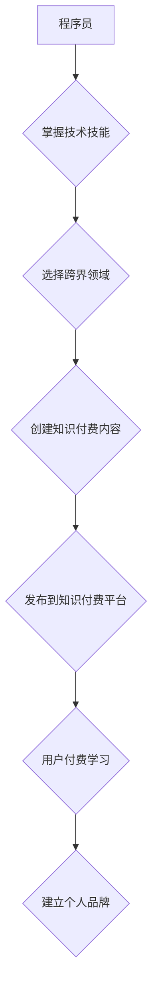

                 

## 知识付费与程序员跨界发展的机会

> 关键词：知识付费、程序员、跨界发展、技术技能、在线教育、内容创作、个人品牌、副业、职业转型

### 1. 背景介绍

近年来，随着互联网技术的飞速发展和数字经济的蓬勃兴起，知识付费行业呈现出爆发式增长。程序员作为科技领域的核心人才，拥有扎实的技术技能和解决问题的能力，在知识付费领域拥有巨大的发展潜力。

**1.1. 知识付费行业的现状**

知识付费是指以知识、技能、经验等为核心内容，通过线上平台向用户提供付费学习服务的商业模式。该模式的兴起，得益于以下几个因素：

* **信息爆炸时代的需求:**  信息量激增，人们对专业知识和技能的需求日益迫切。
* **互联网技术的普及:**  互联网平台为知识传播和付费交易提供了便捷的渠道。
* **个人学习需求的提升:**  人们更加重视个人成长和技能提升，愿意为高质量的学习内容付费。

**1.2. 程序员的优势与机遇**

程序员具备以下优势，使其在知识付费领域拥有广阔的发展空间：

* **技术技能:**  程序员拥有扎实的编程知识和解决问题的能力，能够将专业知识转化为有价值的学习内容。
* **实践经验:**  程序员积累了丰富的项目经验，能够分享实战技巧和经验教训。
* **沟通能力:**  程序员需要与团队成员和用户进行沟通，具备良好的表达能力和沟通技巧。

**1.3. 跨界发展趋势**

随着知识付费行业的快速发展，越来越多的程序员开始尝试跨界发展，将技术技能与其他领域相结合，创造新的价值。例如，程序员可以利用其技术优势，从事以下领域：

* **技术博客写作:**  分享技术经验和见解，建立个人品牌。
* **在线课程制作:**  录制视频课程，教授编程语言、软件开发等知识。
* **技术咨询服务:**  为企业提供技术咨询和解决方案。
* **技术产品开发:**  开发基于技术技能的软件产品或工具。

### 2. 核心概念与联系

知识付费与程序员跨界发展之间存在着密切的联系。程序员可以通过知识付费平台，将其技术技能和经验转化为有价值的学习内容，并通过付费的方式与用户建立连接。

**2.1. 知识付费平台**

知识付费平台是指提供知识付费服务的线上平台，例如：

* **慕课网:**  提供在线课程、直播课程、付费咨询等服务。
* **Udemy:**  全球最大的在线学习平台，提供各种主题的付费课程。
* **Coursera:**  由知名大学和机构合作提供的在线课程平台。

**2.2. 程序员的跨界发展路径**

程序员可以通过以下路径进行跨界发展：

* **技术博客写作:**  选择一个技术领域，定期发布高质量的技术文章，建立个人品牌。
* **在线课程制作:**  录制视频课程，教授编程语言、软件开发等知识，并上传到知识付费平台。
* **技术咨询服务:**  利用其技术经验，为企业提供技术咨询和解决方案。
* **技术产品开发:**  开发基于技术技能的软件产品或工具，并通过知识付费平台进行推广。

**2.3. Mermaid 流程图**



### 3. 核心算法原理 & 具体操作步骤

**3.1. 算法原理概述**

知识付费平台的运营需要涉及多种算法，例如推荐算法、内容审核算法、用户画像算法等。这些算法的目的是为了提高用户体验，提升平台的商业价值。

**3.2. 算法步骤详解**

* **推荐算法:**  根据用户的学习历史、兴趣偏好等信息，推荐相关的学习内容。
* **内容审核算法:**  对上传的内容进行审核，确保内容质量和合法性。
* **用户画像算法:**  通过分析用户的学习行为、社交行为等数据，构建用户的画像，以便更好地进行个性化推荐和营销。

**3.3. 算法优缺点**

* **优点:**  能够提高用户体验，提升平台的商业价值。
* **缺点:**  算法的准确性需要不断优化，算法的透明度和可解释性需要提升。

**3.4. 算法应用领域**

* **在线教育平台:**  推荐课程、个性化学习路径。
* **电商平台:**  推荐商品、个性化商品展示。
* **社交媒体平台:**  推荐好友、个性化内容推送。

### 4. 数学模型和公式 & 详细讲解 & 举例说明

**4.1. 数学模型构建**

推荐算法通常使用协同过滤算法，该算法基于用户的历史行为数据，预测用户对特定内容的兴趣。

**4.2. 公式推导过程**

协同过滤算法的核心是计算用户之间和物品之间的相似度。

* **用户-用户协同过滤:**  计算用户之间的相似度，例如余弦相似度。

$$
\text{相似度} = \frac{\mathbf{u_i} \cdot \mathbf{u_j}}{||\mathbf{u_i}|| ||\mathbf{u_j}||}
$$

其中，$\mathbf{u_i}$ 和 $\mathbf{u_j}$ 表示两个用户的特征向量，$||\mathbf{u_i}||$ 和 $||\mathbf{u_j}||$ 表示特征向量的模长。

* **物品-物品协同过滤:**  计算物品之间的相似度，例如余弦相似度。

$$
\text{相似度} = \frac{\mathbf{i_a} \cdot \mathbf{i_b}}{||\mathbf{i_a}|| ||\mathbf{i_b}||}
$$

其中，$\mathbf{i_a}$ 和 $\mathbf{i_b}$ 表示两个物品的特征向量，$||\mathbf{i_a}||$ 和 $||\mathbf{i_b}||$ 表示特征向量的模长。

**4.3. 案例分析与讲解**

假设有一个用户购买了电影A和电影B，而另一个用户购买了电影B和电影C。根据用户-用户协同过滤算法，可以计算这两个用户之间的相似度。如果相似度较高，则可以推荐用户A喜欢的电影C给用户B。

### 5. 项目实践：代码实例和详细解释说明

**5.1. 开发环境搭建**

* Python 3.x
* Flask 或 Django 框架
* 数据库 (例如 MySQL 或 PostgreSQL)

**5.2. 源代码详细实现**

```python
from flask import Flask, render_template

app = Flask(__name__)

@app.route('/')
def index():
    return render_template('index.html')

if __name__ == '__main__':
    app.run(debug=True)
```

**5.3. 代码解读与分析**

* 该代码是一个简单的Flask web应用，用于展示一个首页。
* `app = Flask(__name__)` 创建了一个Flask应用实例。
* `@app.route('/')` 定义了路由规则，当访问根路径时，会执行`index()`函数。
* `index()`函数渲染一个名为`index.html`的模板文件。

**5.4. 运行结果展示**

运行该代码后，访问`http://127.0.0.1:5000/`，将会看到一个简单的网页。

### 6. 实际应用场景

**6.1. 技术博客写作**

程序员可以通过技术博客分享其技术经验和见解，建立个人品牌，并通过知识付费平台 monetize 博客内容。

**6.2. 在线课程制作**

程序员可以录制视频课程，教授编程语言、软件开发等知识，并上传到知识付费平台，例如慕课网、Udemy等。

**6.3. 技术咨询服务**

程序员可以利用其技术经验，为企业提供技术咨询和解决方案，例如软件架构设计、性能优化等。

**6.4. 未来应用展望**

随着人工智能、大数据等技术的不断发展，知识付费行业将更加智能化、个性化。程序员可以利用这些技术，开发更智能的学习工具和服务，为用户提供更优质的学习体验。

### 7. 工具和资源推荐

**7.1. 学习资源推荐**

* **慕课网:**  https://www.imooc.com/
* **Udemy:**  https://www.udemy.com/
* **Coursera:**  https://www.coursera.org/

**7.2. 开发工具推荐**

* **Python:**  https://www.python.org/
* **Flask:**  https://flask.palletsprojects.com/en/2.2.x/
* **Django:**  https://www.djangoproject.com/

**7.3. 相关论文推荐**

* **Collaborative Filtering for Implicit Feedback Datasets**
* **Matrix Factorization Techniques for Recommender Systems**

### 8. 总结：未来发展趋势与挑战

**8.1. 研究成果总结**

知识付费行业与程序员跨界发展呈现出巨大的潜力，程序员可以通过其技术技能和经验，在知识付费领域创造新的价值。

**8.2. 未来发展趋势**

* **个性化学习:**  基于用户画像和学习行为，提供个性化的学习内容和学习路径。
* **人工智能驱动:**  利用人工智能技术，提高推荐算法的准确性，开发更智能的学习工具。
* **沉浸式学习:**  利用虚拟现实、增强现实等技术，提供更沉浸式的学习体验。

**8.3. 面临的挑战**

* **内容质量控制:**  确保知识付费内容的质量和真实性。
* **用户信任问题:**  建立用户对知识付费平台的信任。
* **商业模式创新:**  探索新的知识付费商业模式。

**8.4. 研究展望**

未来，需要进一步研究知识付费平台的算法模型、用户行为分析、内容推荐机制等方面，以提升用户体验和平台的商业价值。

### 9. 附录：常见问题与解答

**9.1. 如何选择合适的知识付费平台？**

* 考虑平台的用户规模、内容质量、收费模式等因素。
* 可以参考其他用户的评价和推荐。

**9.2. 如何制作高质量的知识付费内容？**

* 确定目标用户和学习内容。
* 采用清晰易懂的语言和教学方法。
* 提供丰富的学习资源和互动环节。

**9.3. 如何推广自己的知识付费内容？**

* 利用社交媒体平台进行推广。
* 与其他创作者合作。
* 参加行业活动和论坛。


作者：禅与计算机程序设计艺术 / Zen and the Art of Computer Programming 
<end_of_turn>

