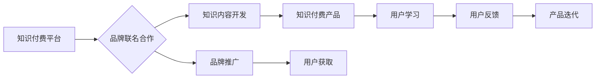

                 

## 知识付费赚钱的品牌联名产品设计与开发

> 关键词：知识付费、品牌联名、产品设计、开发、市场营销、用户体验、商业模式

### 1. 背景介绍

知识付费已成为近年来互联网经济发展的重要趋势，其核心在于将知识、技能和经验等有价值的信息以付费的形式提供给用户。随着互联网技术的不断发展和用户对知识的需求日益增长，知识付费市场呈现出蓬勃发展的态势。

品牌联名，是指两个或多个品牌联合合作，共同推出产品或服务，以达到扩大品牌影响力、提升品牌价值和开拓新市场的目的。品牌联名营销模式在传统零售领域已取得成功，近年来也逐渐应用于知识付费领域。

品牌联名知识付费产品，是指由两个或多个品牌联合合作，共同设计、开发和推广的知识付费产品。这种模式能够充分发挥各品牌在知识、资源和用户群体方面的优势，为用户提供更优质、更全面的知识服务，同时也能为品牌带来更大的商业价值。

### 2. 核心概念与联系

#### 2.1 知识付费的核心概念

知识付费的核心概念是将知识、技能和经验等有价值的信息以付费的形式提供给用户。其主要特点包括：

* **价值导向:** 知识付费产品以知识和技能为核心价值，旨在帮助用户提升自身能力和解决实际问题。
* **付费模式:** 用户需要支付一定的费用才能获取知识付费产品，这确保了知识付费产品的可持续性。
* **在线交付:** 知识付费产品主要通过线上平台进行交付，例如网站、APP等，方便用户随时随地学习。

#### 2.2 品牌联名的核心概念

品牌联名的核心概念是两个或多个品牌联合合作，共同推出产品或服务，以达到扩大品牌影响力、提升品牌价值和开拓新市场的目的。其主要特点包括：

* **资源整合:** 品牌联名能够整合各品牌的资源，例如知识、技术、渠道等，形成合力。
* **互惠互利:** 品牌联名双方能够互相借力，扩大各自的市场份额和品牌影响力。
* **创新合作:** 品牌联名能够促进创新合作，共同开发新的产品和服务，满足用户不断变化的需求。

#### 2.3 品牌联名知识付费的联系

品牌联名知识付费产品将知识付费和品牌联名的优势结合起来，能够实现以下目标：

* **提升知识付费产品的价值:** 通过品牌联名，知识付费产品能够获得更广泛的认可度和用户群体，提升其价值。
* **扩大品牌影响力:** 品牌联名能够扩大品牌的影响力，提升品牌知名度和美誉度。
* **开拓新市场:** 品牌联名能够帮助品牌进入新的市场，拓展新的用户群体。

**Mermaid 流程图**



### 3. 核心算法原理 & 具体操作步骤

#### 3.1 算法原理概述

品牌联名知识付费产品的开发需要结合多种算法原理，例如推荐算法、用户画像算法、内容分发算法等。这些算法能够帮助平台更好地理解用户需求，推荐合适的知识付费产品，提高用户体验。

#### 3.2 算法步骤详解

1. **用户画像构建:** 通过用户行为数据、兴趣偏好、学习记录等信息，构建用户画像，了解用户的学习需求和兴趣方向。
2. **知识内容推荐:** 基于用户画像，利用推荐算法，推荐与用户兴趣相符的知识付费产品。
3. **内容分发优化:** 根据用户行为数据和产品受欢迎程度，优化内容分发策略，提高用户获取优质知识付费产品的概率。
4. **用户反馈收集:** 收集用户对知识付费产品的评价和反馈，用于产品迭代和改进。

#### 3.3 算法优缺点

**优点:**

* **个性化推荐:** 能够根据用户的兴趣和需求，推荐个性化的知识付费产品。
* **提高用户体验:** 通过算法优化，提高用户获取优质知识付费产品的效率和体验。
* **数据驱动决策:** 基于数据分析，优化产品开发和运营策略。

**缺点:**

* **数据依赖:** 算法的准确性依赖于数据的质量和丰富程度。
* **算法偏差:** 算法本身可能存在偏差，导致推荐结果不准确或不公平。
* **用户隐私保护:** 需要妥善处理用户数据，保护用户隐私安全。

#### 3.4 算法应用领域

推荐算法、用户画像算法、内容分发算法等在知识付费领域有着广泛的应用，例如：

* **知识付费平台:** 用于推荐知识付费产品、个性化学习路径、用户画像分析等。
* **在线教育平台:** 用于推荐课程、学习资源、个性化学习计划等。
* **内容创作平台:** 用于推荐优质内容、用户兴趣分析、内容分发优化等。

### 4. 数学模型和公式 & 详细讲解 & 举例说明

#### 4.1 数学模型构建

知识付费产品的推荐系统通常采用基于用户的协同过滤算法，其核心数学模型是用户-物品评分矩阵。

**用户-物品评分矩阵:**

* 行表示用户，列表示知识付费产品。
* 每个单元格表示用户对该产品的评分，评分可以是数值型或类别型。

**公式:**

$$
R_{ui} = f(u, i, H)
$$

其中:

* $R_{ui}$ 表示用户 $u$ 对产品 $i$ 的评分。
* $u$ 表示用户ID。
* $i$ 表示产品ID。
* $H$ 表示用户和产品之间的隐含特征向量。
* $f$ 表示评分函数。

#### 4.2 公式推导过程

协同过滤算法的核心思想是：

* **基于用户的相似性:** 如果用户 $u$ 和用户 $v$ 对相似的产品有相似的评分，那么用户 $u$ 也可能喜欢用户 $v$ 喜欢的产品。
* **基于物品的相似性:** 如果产品 $i$ 和产品 $j$ 在某些方面相似，那么用户如果喜欢产品 $i$，也可能喜欢产品 $j$。

基于上述思想，协同过滤算法可以推导出以下评分预测公式:

$$
\hat{R}_{ui} = \frac{\sum_{v \in N(u)} \frac{sim(u, v) * R_{v i}}{\sum_{w \in N(u)} sim(u, w)}}{\sum_{j \in N(i)} \frac{sim(i, j) * R_{u j}}{\sum_{k \in N(i)} sim(i, k)}}
$$

其中:

* $\hat{R}_{ui}$ 表示对用户 $u$ 对产品 $i$ 的评分预测值。
* $N(u)$ 表示与用户 $u$ 相似的用户集合。
* $N(i)$ 表示与产品 $i$ 相似的产品集合。
* $sim(u, v)$ 表示用户 $u$ 和用户 $v$ 的相似度。
* $sim(i, j)$ 表示产品 $i$ 和产品 $j$ 的相似度。

#### 4.3 案例分析与讲解

假设有一个知识付费平台，用户 $A$ 和用户 $B$ 都对编程相关的知识付费产品感兴趣，用户 $A$ 对产品 $X$ 的评分为 5，用户 $B$ 对产品 $X$ 的评分为 4，用户 $A$ 对产品 $Y$ 的评分为 3，用户 $B$ 对产品 $Y$ 的评分为 5。

根据协同过滤算法，我们可以计算出用户 $A$ 对产品 $Y$ 的评分预测值，以及用户 $B$ 对产品 $X$ 的评分预测值。

### 5. 项目实践：代码实例和详细解释说明

#### 5.1 开发环境搭建

* **操作系统:** Linux/macOS/Windows
* **编程语言:** Python
* **框架:** Django/Flask
* **数据库:** MySQL/PostgreSQL
* **工具:** Git、Docker

#### 5.2 源代码详细实现

```python
# 用户-物品评分矩阵
ratings = {
    'user1': {'product1': 5, 'product2': 3, 'product3': 4},
    'user2': {'product1': 4, 'product2': 5, 'product3': 2},
    'user3': {'product1': 3, 'product2': 4, 'product3': 5},
}

# 计算用户相似度
def calculate_user_similarity(user1, user2):
    # ...

# 计算产品相似度
def calculate_item_similarity(item1, item2):
    # ...

# 预测用户对产品的评分
def predict_rating(user, item):
    # ...
```

#### 5.3 代码解读与分析

* **用户-物品评分矩阵:** 存储用户对产品的评分信息。
* **计算用户相似度:** 根据用户的评分历史，计算用户之间的相似度。
* **计算产品相似度:** 根据产品的评分历史，计算产品的相似度。
* **预测用户对产品的评分:** 基于用户相似度和产品相似度，预测用户对产品的评分。

#### 5.4 运行结果展示

运行上述代码，可以得到用户对产品的评分预测结果，例如预测用户 $A$ 对产品 $Y$ 的评分。

### 6. 实际应用场景

#### 6.1 在线教育平台

* **个性化学习推荐:** 根据用户的学习记录和兴趣偏好，推荐个性化的课程和学习资源。
* **学习路径规划:** 根据用户的学习目标和进度，规划个性化的学习路径。
* **知识付费产品推荐:** 推荐与用户学习内容相关的知识付费产品。

#### 6.2 内容创作平台

* **优质内容推荐:** 根据用户的阅读历史和兴趣偏好，推荐优质的内容。
* **内容分发优化:** 根据用户的阅读习惯和内容受欢迎程度，优化内容分发策略。
* **知识付费产品推广:** 推广与内容相关的知识付费产品。

#### 6.3 品牌联名营销

* **联合开发知识付费产品:** 品牌可以联合开发知识付费产品，共享资源和用户群体。
* **跨界营销推广:** 品牌可以利用知识付费产品进行跨界营销推广，扩大品牌影响力。
* **用户互动体验:** 品牌可以利用知识付费产品进行用户互动体验，提升用户粘性。

#### 6.4 未来应用展望

随着人工智能技术的不断发展，知识付费领域的应用场景将更加广泛，例如：

* **智能化学习助手:** 基于人工智能，提供智能化的学习助手，帮助用户更高效地学习。
* **个性化学习内容生成:** 基于人工智能，生成个性化的学习内容，满足用户的个性化需求。
* **虚拟现实/增强现实学习体验:** 基于虚拟现实/增强现实技术，提供沉浸式的学习体验。

### 7. 工具和资源推荐

#### 7.1 学习资源推荐

* **书籍:**
    * 《推荐系统实践》
    * 《机器学习》
    * 《深度学习》
* **在线课程:**
    * Coursera
    * edX
    * Udemy

#### 7.2 开发工具推荐

* **Python:** 
    * Scikit-learn
    * TensorFlow
    * PyTorch
* **框架:**
    * Django
    * Flask
* **数据库:**
    * MySQL
    * PostgreSQL

#### 7.3 相关论文推荐

* **协同过滤算法:**
    * "Collaborative Filtering: A User-Based Approach"
    * "Memory-Based Collaborative Filtering"
* **推荐系统:**
    * "Recommender Systems: The Textbook"
    * "Survey of Recommender Systems"

### 8. 总结：未来发展趋势与挑战

#### 8.1 研究成果总结

知识付费与品牌联名结合，为用户提供更优质、更全面的知识服务，同时为品牌带来更大的商业价值。

#### 8.2 未来发展趋势

* **人工智能驱动:** 人工智能技术将进一步推动知识付费产品的个性化推荐、智能化学习助手和个性化学习内容生成。
* **多元化内容形式:** 知识付费产品将更加多元化，包括视频、音频、直播、游戏等多种形式。
* **沉浸式学习体验:** 基于虚拟现实/增强现实技术，提供更加沉浸式的学习体验。

#### 8.3 面临的挑战

* **数据安全与隐私保护:** 需要妥善处理用户数据，保护用户隐私安全。
* **算法偏差与公平性:** 算法本身可能存在偏差，导致推荐结果不准确或不公平。
* **知识付费模式的创新:** 需要不断探索新的知识付费模式，满足用户不断变化的需求。

#### 8.4 研究展望

未来，需要进一步研究以下问题:

* 如何更好地利用人工智能技术，提升知识付费产品的个性化推荐和智能化学习体验。
* 如何构建更加公平、透明的知识付费算法，避免算法偏差带来的负面影响。
* 如何探索新的知识付费模式，满足用户多元化的需求。


### 9. 附录：常见问题与解答

**Q1: 如何选择合适的知识付费平台?**

**A1:** 选择知识付费平台时，需要考虑以下因素:

* 平台的用户群体
* 平台的知识付费产品种类
* 平台的收费模式
* 平台的口碑和信誉

**Q2: 如何提高知识付费产品的质量?**

**A2:** 提高知识付费产品的质量，需要:

* 邀请专业领域专家进行授课
* 内容更新及时，符合用户需求
* 提供优质的学习体验

**Q3: 如何推广知识付费产品?**

**A3:** 推广知识付费产品，可以采用以下方法:

* 社交媒体营销
* 内容营销
* 合作推广
* 线下活动

**作者：禅与计算机程序设计艺术 / Zen and the Art of Computer Programming**<end_of_turn>

