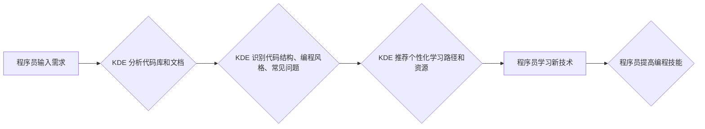

                 

## 知识发现引擎如何帮助程序员快速成长

> 关键词：知识发现引擎、程序员成长、代码分析、学习路径、智能推荐、代码复用、编程效率、软件开发

## 1. 背景介绍

在当今软件开发领域，程序员面临着日益增长的学习压力和工作强度。新技术层出不穷，代码库规模不断膨胀，想要保持竞争力，程序员需要不断学习和提升自身技能。传统的学习方式，例如阅读书籍、参加培训课程，虽然有效，但效率相对较低，难以满足程序员快速成长的需求。

知识发现引擎 (Knowledge Discovery Engine，简称 KDE) 作为一种新兴的智能技术，能够从海量数据中挖掘出隐藏的知识和模式，为程序员提供个性化学习建议、代码复用方案和开发效率提升策略。

## 2. 核心概念与联系

### 2.1  知识发现引擎 (KDE)

知识发现引擎是一种利用机器学习、数据挖掘等技术，从海量数据中自动发现、提取和解释有价值的知识的系统。它可以分析代码、文档、论坛讨论等各种数据源，识别出代码结构、编程风格、常见问题、最佳实践等信息。

### 2.2  KDE 与 程序员成长的联系

KDE 可以帮助程序员快速成长，主要体现在以下几个方面：

* **个性化学习路径推荐:** KDE 可以根据程序员的编程经验、技能水平、学习目标等信息，推荐个性化的学习路径和资源，帮助程序员更高效地学习新技术。
* **代码复用和优化建议:** KDE 可以分析程序员的代码，识别出重复代码片段，并提供代码复用和优化的建议，提高程序员的开发效率。
* **问题解决和最佳实践指导:** KDE 可以根据程序员遇到的问题，从海量代码库和文档中查找解决方案，并提供最佳实践指导，帮助程序员更快地解决问题。
* **编程风格和规范建议:** KDE 可以分析程序员的编程风格，并提供改进建议，帮助程序员养成良好的编程习惯，提高代码质量。

**Mermaid 流程图:**



## 3. 核心算法原理 & 具体操作步骤

### 3.1  算法原理概述

KDE 的核心算法主要包括：

* **自然语言处理 (NLP):** 用于分析代码注释、文档和论坛讨论等文本数据，提取关键信息和语义关系。
* **机器学习 (ML):** 用于训练模型，识别代码结构、编程风格、常见问题等模式。
* **数据挖掘 (DM):** 用于从海量数据中挖掘出隐藏的知识和关系。

### 3.2  算法步骤详解

1. **数据收集:** 收集代码、文档、论坛讨论等各种数据源。
2. **数据预处理:** 清洗、格式化和转换数据，使其适合算法处理。
3. **特征提取:** 使用 NLP 和 DM 技术，从数据中提取代码结构、编程风格、常见问题等特征。
4. **模型训练:** 使用 ML 技术，训练模型，识别代码结构、编程风格、常见问题等模式。
5. **知识发现:** 使用训练好的模型，从新数据中发现隐藏的知识和关系。
6. **知识表示:** 将发现的知识以可理解的形式表示出来，例如知识图谱、规则等。
7. **知识应用:** 将发现的知识应用于程序员的学习、开发等场景。

### 3.3  算法优缺点

**优点:**

* **自动化:** KDE 可以自动分析数据，发现隐藏的知识，无需人工干预。
* **效率:** KDE 可以快速处理海量数据，提高知识发现效率。
* **个性化:** KDE 可以根据程序员的个体需求，提供个性化的学习建议和代码复用方案。

**缺点:**

* **数据依赖:** KDE 的性能取决于数据质量和数量。
* **算法复杂度:** KDE 的算法复杂度较高，需要强大的计算资源。
* **解释性:** KDE 的知识发现过程相对复杂，难以解释其背后的逻辑。

### 3.4  算法应用领域

KDE 的应用领域非常广泛，包括：

* **程序员学习和成长:** 提供个性化学习路径、代码复用方案和问题解决指导。
* **代码质量提升:** 识别代码缺陷、建议代码优化方案，提高代码质量。
* **软件开发效率提升:** 自动生成代码模板、推荐最佳实践，提高开发效率。
* **软件维护和更新:** 分析代码依赖关系、识别潜在问题，帮助软件维护和更新。

## 4. 数学模型和公式 & 详细讲解 & 举例说明

### 4.1  数学模型构建

KDE 的核心算法通常基于统计学习和机器学习模型，例如：

* **朴素贝叶斯分类:** 用于识别代码结构、编程风格等类别。
* **支持向量机 (SVM):** 用于识别代码缺陷、预测代码质量等。
* **深度学习 (DL):** 用于更复杂的任务，例如代码生成、代码翻译等。

### 4.2  公式推导过程

例如，朴素贝叶斯分类的公式如下：

$$P(C|X) = \frac{P(X|C)P(C)}{P(X)}$$

其中：

* $P(C|X)$ 是给定特征 $X$ 的条件下类别 $C$ 的概率。
* $P(X|C)$ 是给定类别 $C$ 的条件下特征 $X$ 的概率。
* $P(C)$ 是类别 $C$ 的先验概率。
* $P(X)$ 是特征 $X$ 的边缘概率。

### 4.3  案例分析与讲解

假设我们想要使用朴素贝叶斯分类器识别代码中的函数调用类型。我们可以收集大量的代码数据，并标记每个函数调用的类型。然后，我们可以使用朴素贝叶斯公式计算每个函数调用类型出现的概率，以及给定特定特征 (例如函数名、参数类型) 的条件下，每个函数调用类型的概率。最后，我们可以根据这些概率，对新的函数调用进行分类。

## 5. 项目实践：代码实例和详细解释说明

### 5.1  开发环境搭建

KDE 的开发环境通常包括：

* **编程语言:** Python, Java, C++ 等
* **机器学习库:** scikit-learn, TensorFlow, PyTorch 等
* **数据存储库:** MySQL, MongoDB 等
* **代码分析工具:** SonarQube, CodeQL 等

### 5.2  源代码详细实现

由于篇幅限制，这里只提供一个简单的代码示例，用于演示如何使用 Python 和 scikit-learn 库，训练一个朴素贝叶斯分类器识别代码中的函数调用类型。

```python
from sklearn.naive_bayes import MultinomialNB
from sklearn.model_selection import train_test_split
from sklearn.metrics import accuracy_score

# 假设我们已经收集了代码数据，并将其存储在数据集中
data = ...

# 将数据分成训练集和测试集
X_train, X_test, y_train, y_test = train_test_split(data['features'], data['labels'], test_size=0.2)

# 训练朴素贝叶斯分类器
model = MultinomialNB()
model.fit(X_train, y_train)

# 对测试集进行预测
y_pred = model.predict(X_test)

# 计算准确率
accuracy = accuracy_score(y_test, y_pred)
print(f"Accuracy: {accuracy}")
```

### 5.3  代码解读与分析

* 首先，我们导入必要的库，包括 scikit-learn 库中的朴素贝叶斯分类器和数据分割函数，以及 sklearn.metrics 库中的准确率计算函数。
* 然后，我们假设已经收集了代码数据，并将其存储在数据集中。
* 接下来，我们将数据分成训练集和测试集，用于训练和评估模型。
* 然后，我们创建了一个朴素贝叶斯分类器对象，并使用训练集进行训练。
* 最后，我们使用训练好的模型对测试集进行预测，并计算准确率。

### 5.4  运行结果展示

运行上述代码后，会输出模型的准确率。准确率越高，说明模型的性能越好。

## 6. 实际应用场景

### 6.1  个性化学习路径推荐

KDE 可以根据程序员的编程经验、技能水平、学习目标等信息，推荐个性化的学习路径和资源。例如，对于初学者，KDE 可以推荐一些基础编程课程和教程；对于经验丰富的程序员，KDE 可以推荐一些高级技术和框架的学习资料。

### 6.2  代码复用和优化建议

KDE 可以分析程序员的代码，识别出重复代码片段，并提供代码复用和优化的建议。例如，KDE 可以识别出两个函数执行相同的逻辑，并建议将它们合并成一个函数。

### 6.3  问题解决和最佳实践指导

KDE 可以根据程序员遇到的问题，从海量代码库和文档中查找解决方案，并提供最佳实践指导。例如，程序员遇到一个编译错误，KDE 可以从代码库中找到类似问题的解决方案，并提供相应的代码修改建议。

### 6.4  未来应用展望

KDE 的应用场景还在不断扩展，未来可能应用于：

* **代码生成:** KDE 可以根据程序员的自然语言描述，自动生成代码。
* **代码翻译:** KDE 可以将代码从一种编程语言翻译成另一种编程语言。
* **代码安全分析:** KDE 可以识别代码中的安全漏洞，并提供修复建议。

## 7. 工具和资源推荐

### 7.1  学习资源推荐

* **书籍:**
    * "Programming Pearls" by Jon Bentley
    * "Code Complete" by Steve McConnell
    * "Clean Code" by Robert C. Martin
* **在线课程:**
    * Coursera: https://www.coursera.org/
    * edX: https://www.edx.org/
    * Udemy: https://www.udemy.com/

### 7.2  开发工具推荐

* **代码编辑器:**
    * Visual Studio Code: https://code.visualstudio.com/
    * Atom: https://atom.io/
    * Sublime Text: https://www.sublimetext.com/
* **版本控制系统:**
    * Git: https://git-scm.com/
* **机器学习库:**
    * scikit-learn: https://scikit-learn.org/
    * TensorFlow: https://www.tensorflow.org/
    * PyTorch: https://pytorch.org/

### 7.3  相关论文推荐

* "A Survey of Knowledge Discovery in Software Engineering" by Y. Wang et al.
* "Knowledge Discovery in Software Engineering: A Review" by S. H. Lee et al.
* "Towards Automated Code Generation with Deep Learning" by J. Chen et al.

## 8. 总结：未来发展趋势与挑战

### 8.1  研究成果总结

KDE 在程序员学习和成长、代码质量提升、软件开发效率提升等方面取得了显著成果。

### 8.2  未来发展趋势

KDE 的未来发展趋势包括：

* **更强大的算法模型:** 使用更先进的机器学习和深度学习算法，提高 KDE 的准确性和效率。
* **更丰富的知识表示:** 使用更灵活和更具表达力的知识表示形式，例如知识图谱和语义网络。
* **更个性化的服务:** 基于用户行为和偏好，提供更个性化的学习建议和代码复用方案。

### 8.3  面临的挑战

KDE 还面临着一些挑战，例如：

* **数据质量和数量:** KDE 的性能取决于数据质量和数量，收集高质量的代码数据仍然是一个难题。
* **算法解释性:** KDE 的算法相对复杂，难以解释其背后的逻辑，这可能会影响程序员的信任度。
* **伦理问题:** KDE 的应用可能会引发一些伦理问题，例如代码自动生成可能会导致程序员失业。

### 8.4  研究展望

未来，KDE 研究将继续探索更强大的算法模型、更丰富的知识表示和更个性化的服务，以帮助程序员更快、更有效地学习和成长。同时，也将关注 KDE 的伦理问题，确保其安全、可靠和可持续发展。

## 9. 附录：常见问题与解答

### 9.1  Q1: KDE 是否会取代程序员？

A1: KDE 不会取代程序员，而是会成为程序员的强大助手。KDE 可以帮助程序员提高效率、解决问题、学习新技术，但最终的决策和创造仍然需要程序员的智慧和经验。

### 9.2  Q2: 如何使用 KDE？

A2: 使用 KDE 的方法取决于具体的应用场景。例如，想要使用 KDE 进行个性化学习路径推荐，可以注册 KDE 平台，填写自己的编程经验、技能水平和学习目标。KDE 会根据您的信息，推荐相应的学习资源。

### 9.3  Q3: KDE 的数据安全如何保障？

A3: KDE 平台会采取严格的安全措施，保护用户的个人信息和代码数据。例如，用户的数据会加密存储，只有授权用户才能访问。


作者：禅与计算机程序设计艺术 / Zen and the Art of Computer Programming 
<end_of_turn>

