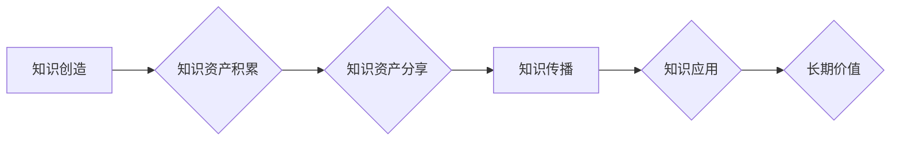

                 

## 知识资产分享知识创造的长期价值

> 关键词：知识资产、知识共享、知识创造、知识经济、知识管理、知识传播、长期价值

## 1. 背景介绍

在当今知识经济时代，知识已成为最宝贵的资源。知识的积累、创造和传播是推动社会进步和经济发展的关键驱动力。然而，知识的价值往往体现在其应用和传播中，而知识的孤立和封闭会阻碍其价值的实现。因此，知识资产的分享和传播至关重要。

知识资产是指企业或个人积累和掌握的各种知识，包括经验、技能、技术、信息、创意等。这些知识资产是企业或个人竞争力的基础，也是推动创新和发展的源泉。然而，知识资产的价值往往难以量化，并且容易流失。

知识共享是指个人或组织之间公开、免费分享知识的行为。知识共享的理念是，知识是人类共同的财富，应该被广泛传播和利用。知识共享的模式多种多样，包括开源软件、开放教育资源、知识库、在线社区等。

## 2. 核心概念与联系

### 2.1 知识资产与知识创造

知识资产是知识创造的结果，而知识创造则是知识资产的源泉。知识创造是一个复杂的过程，需要不断地学习、思考、创新和实践。知识资产的积累和共享可以促进知识创造，因为共享的知识可以为创新的灵感提供参考，并加速知识的传播和应用。

### 2.2 知识共享与知识经济

知识经济是基于知识生产、传播和应用的经济模式。知识共享是知识经济的重要基础，因为它可以促进知识的流动和利用，从而推动经济增长和社会进步。

### 2.3 知识资产分享与长期价值

知识资产的分享可以创造长期价值，因为它可以：

* **促进知识积累和创新：** 通过共享知识，可以加速知识的传播和应用，促进知识的积累和创新。
* **增强竞争力：** 知识共享可以帮助企业或个人获得新的知识和技能，增强其竞争力。
* **促进社会进步：** 知识共享可以促进知识的普及和应用，从而推动社会进步。

**Mermaid 流程图**



## 3. 核心算法原理 & 具体操作步骤

### 3.1 算法原理概述

知识资产分享的算法原理主要基于信息论和网络科学。信息论提供了一种量化知识价值的方法，而网络科学则研究了知识传播的网络结构和规律。

### 3.2 算法步骤详解

1. **知识资产识别和量化：** 首先需要识别和量化企业的知识资产，包括知识类型、知识价值、知识相关性等。可以使用知识图谱、机器学习等技术进行知识识别和量化。
2. **知识资产分类和组织：** 将知识资产按照类型、主题、领域等进行分类和组织，以便于知识的检索和共享。可以使用知识库、分类系统等工具进行知识分类和组织。
3. **知识资产分享平台建设：** 建立一个知识资产分享平台，提供知识存储、检索、分享、协作等功能。平台可以采用云计算、大数据等技术进行建设。
4. **知识传播机制设计：** 设计有效的知识传播机制，例如推荐算法、社区互动、知识竞赛等，促进知识的传播和应用。
5. **知识价值评估和反馈机制：** 建立知识价值评估和反馈机制，例如知识引用次数、用户评价等，以便于评估知识的价值和改进知识分享平台。

### 3.3 算法优缺点

**优点：**

* 可以促进知识的积累和创新。
* 可以增强企业的竞争力。
* 可以促进社会进步。

**缺点：**

* 知识资产的识别和量化存在一定的难度。
* 知识资产的分享需要建立有效的平台和机制。
* 知识价值的评估和反馈机制需要不断完善。

### 3.4 算法应用领域

知识资产分享算法可以应用于各种领域，例如：

* 企业内部知识管理
* 教育和培训
* 科学研究
* 政府信息公开

## 4. 数学模型和公式 & 详细讲解 & 举例说明

### 4.1 数学模型构建

知识资产的价值可以被量化，并可以用数学模型来表示。一个简单的模型可以是：

$$
V = f(K, A, U)
$$

其中：

* $V$ 表示知识资产的价值
* $K$ 表示知识资产的数量
* $A$ 表示知识资产的质量
* $U$ 表示知识资产的利用率

### 4.2 公式推导过程

这个模型的推导过程基于以下假设：

* 知识资产的价值与数量成正比
* 知识资产的价值与质量成正比
* 知识资产的价值与利用率成正比

### 4.3 案例分析与讲解

假设一家公司拥有100个知识资产，每个知识资产的质量为5分，利用率为80%。根据上述模型，我们可以计算出该公司的知识资产价值：

$$
V = f(100, 5, 0.8)
$$

具体的计算方法取决于$f$函数的定义。

## 5. 项目实践：代码实例和详细解释说明

### 5.1 开发环境搭建

为了实现知识资产分享平台，需要搭建一个开发环境。常用的开发环境包括：

* 操作系统：Linux、Windows、macOS
* 编程语言：Python、Java、C++
* 数据库：MySQL、PostgreSQL、MongoDB
* Web服务器：Apache、Nginx
* 云平台：AWS、Azure、GCP

### 5.2 源代码详细实现

以下是一个使用Python和Flask框架实现知识资产分享平台的简单代码示例：

```python
from flask import Flask, render_template

app = Flask(__name__)

@app.route('/')
def index():
    return render_template('index.html')

if __name__ == '__main__':
    app.run(debug=True)
```

这个代码示例只是一个简单的启动页面，需要进一步开发知识资产的存储、检索、分享等功能。

### 5.3 代码解读与分析

* `from flask import Flask, render_template`: 导入Flask框架的必要模块。
* `app = Flask(__name__)`: 创建一个Flask应用实例。
* `@app.route('/')`: 定义一个路由规则，当访问根路径时，执行`index()`函数。
* `def index()`: 定义一个函数，返回一个HTML模板文件`index.html`。
* `if __name__ == '__main__':`: 确保代码只在脚本被直接执行时运行。
* `app.run(debug=True)`: 启动Flask应用，并开启调试模式。

### 5.4 运行结果展示

运行上述代码后，访问`http://127.0.0.1:5000/`，将会看到一个简单的启动页面。

## 6. 实际应用场景

知识资产分享平台可以应用于各种实际场景，例如：

* **企业内部知识管理：** 企业可以利用知识资产分享平台，建立一个内部知识库，方便员工共享经验、技能和技术。
* **教育和培训：** 教育机构可以利用知识资产分享平台，创建在线课程和学习资源，方便学生学习和交流。
* **科学研究：** 科学研究人员可以利用知识资产分享平台，共享研究成果、数据和方法，促进科学研究的合作和发展。
* **政府信息公开：** 政府可以利用知识资产分享平台，公开政府信息和政策，提高政府透明度和公众参与度。

### 6.4 未来应用展望

未来，知识资产分享平台将更加智能化、个性化和协作化。例如：

* **人工智能驱动的知识推荐：** 利用人工智能技术，对用户的知识需求进行分析，并推荐相关的知识资源。
* **个性化知识学习路径：** 根据用户的学习目标和进度，定制个性化的知识学习路径。
* **协作式知识创作：** 利用在线协作工具，方便用户共同创作和完善知识资源。

## 7. 工具和资源推荐

### 7.1 学习资源推荐

* **书籍：**
    * 《知识管理》
    * 《知识经济》
    * 《知识共享》
* **在线课程：**
    * Coursera: Knowledge Management
    * edX: The Knowledge Economy
    * Udemy: Knowledge Sharing

### 7.2 开发工具推荐

* **知识图谱工具：**
    * Neo4j
    * GraphDB
* **知识库工具：**
    * Confluence
    * Notion
* **开源知识共享平台：**
    * GitHub
    * GitLab

### 7.3 相关论文推荐

* **知识资产管理：**
    * Nonaka, I., & Takeuchi, H. (1995). The knowledge-creating company. Oxford University Press.
* **知识共享：**
    * Ostrom, E. (2009). A general framework for analyzing sustainability of social-ecological systems. Science, 325(5939), 419-422.
* **知识经济：**
    * Drucker, P. F. (1993). Post-capitalist society. HarperBusiness.

## 8. 总结：未来发展趋势与挑战

### 8.1 研究成果总结

知识资产分享的研究成果表明，知识共享可以促进知识的积累、创新和应用，从而创造长期价值。

### 8.2 未来发展趋势

未来，知识资产分享的研究将更加注重以下几个方面：

* **人工智能驱动的知识分享：** 利用人工智能技术，实现更智能、更个性化的知识推荐和学习路径定制。
* **区块链技术的应用：** 利用区块链技术，保障知识产权和知识共享的透明度和安全性。
* **跨领域知识融合：** 促进不同领域知识的融合和创新，构建更完整的知识体系。

### 8.3 面临的挑战

知识资产分享也面临一些挑战，例如：

* **知识资产的识别和量化：** 如何准确识别和量化知识资产的价值是一个难题。
* **知识共享的激励机制：** 如何激励用户积极参与知识共享是一个关键问题。
* **知识共享的伦理问题：** 如何保障知识共享的公平性和伦理性是一个需要关注的问题。

### 8.4 研究展望

未来，需要进一步研究知识资产分享的算法、机制和伦理问题，推动知识资产分享的健康发展，为构建知识经济社会贡献力量。

## 9. 附录：常见问题与解答

### 9.1 如何识别和量化知识资产？

知识资产的识别和量化可以采用多种方法，例如：

* **专家评估：** 由专家根据知识的价值、重要性和稀缺性进行评估。
* **文献计量分析：** 通过分析文献引用次数、影响因子等指标，量化知识的价值。
* **机器学习：** 利用机器学习算法，从文本、数据等中识别和量化知识资产。

### 9.2 如何激励用户参与知识共享？

可以采用以下方法激励用户参与知识共享：

* **奖励机制：** 对贡献知识的用户给予奖励，例如积分、优惠券、荣誉称号等。
* **社区建设：** 建立一个活跃的知识共享社区，鼓励用户交流和合作。
* **知识传播的影响力：** 让用户感受到知识共享带来的影响力，例如帮助他人解决问题、促进创新等。


作者：禅与计算机程序设计艺术 / Zen and the Art of Computer Programming 
<end_of_turn>

