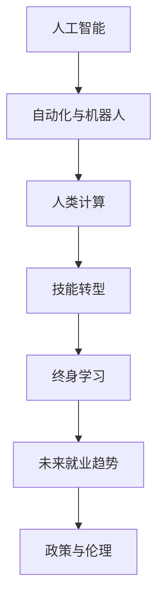

                 

# 人类计算：AI时代的未来就业市场与技能培训发展趋势分析总结挑战

> 关键词：人工智能,自动化,就业市场,技能培训,未来就业趋势,技能需求,劳动力转型

## 1. 背景介绍

### 1.1 问题由来
近年来，随着人工智能(AI)技术的飞速发展，其在各行各业的渗透应用已经显著改变了人类社会的面貌。AI不仅带来了生产效率的提升，也引发了劳动力市场结构的重大变化。一方面，大量重复性和低技能的工作被自动化工具取代，使得就业市场对技能的需求出现了明显的变化。另一方面，AI技术的应用也创造了大量新的工作机会，对于劳动力市场提出了新的挑战和需求。

### 1.2 问题核心关键点
本文聚焦于AI时代下，人类计算领域的未来就业市场和技能培训需求。具体包括以下几个关键问题：
1. **就业市场变化**：AI自动化如何影响传统行业的工作机会？
2. **技能需求变迁**：未来职场所需的新型技能有哪些？
3. **教育与培训**：如何培养符合AI时代要求的人才？
4. **政策与伦理**：AI时代下的就业市场应如何调控？

### 1.3 问题研究意义
研究和理解AI时代下就业市场和技能培训的变化，对于政府、教育机构和企业都有着重要的意义：
- **政府**：制定适应AI时代的人才政策，优化劳动力市场结构。
- **教育机构**：调整教育内容与课程设计，满足市场需求。
- **企业**：合理规划人力资源配置，提升团队竞争力。

## 2. 核心概念与联系

### 2.1 核心概念概述

为更好地理解AI时代下就业市场和技能培训的趋势，本节将介绍几个关键概念：

- **人工智能(AI)**：通过模拟人类智能，进行信息处理、模式识别、决策制定等任务的智能技术。包括机器学习、深度学习、自然语言处理、计算机视觉等多个分支。

- **自动化与机器人技术**：利用AI技术驱动的自动化工具和机器人，可以完成各种重复性或高危工作，减少对人力的依赖。

- **人类计算(Human-Computation)**：将复杂计算任务分解为简单的子任务，通过人机协作完成计算的计算模式。

- **技能转型**：面对AI自动化带来的就业市场变化，劳动者需要掌握的新型技能，以适应未来的工作需求。

- **终身学习(Lifelong Learning)**：强调个体在一生中不断学习、适应变化的能力，以应对快速变化的工作环境。

- **未来就业趋势**：基于AI技术发展趋势，对未来就业市场的预测和分析。

这些核心概念之间存在着紧密的联系。AI和自动化技术的进步直接影响了就业市场的结构，而技能转型和终身学习则是应对这一变化的重要策略。未来就业趋势则是对这一过程的预测和指导。

### 2.2 核心概念原理和架构的 Mermaid 流程图



这个流程图展示了核心概念之间的逻辑关系。人工智能的进步推动了自动化和机器人技术的发展，人类计算在自动化系统中扮演重要角色。技能转型和终身学习是应对自动化影响的重要手段，而未来就业趋势则是对这一过程的预测和指导，政策与伦理则是确保AI发展可持续的保障。

## 3. 核心算法原理 & 具体操作步骤

### 3.1 算法原理概述

本节将详细阐述AI时代下，人类计算和技能培训的数学模型和计算原理。

#### 3.1.1 数学模型构建

假设一个企业使用AI自动化系统处理数据，其自动化流程可以用如下数学模型表示：

$$
S = A \times P \times E
$$

其中：
- $S$：自动化系统处理的数据量（单位：TB）
- $A$：自动化系统的处理能力（单位：TB/年）
- $P$：企业需要处理的数据量（单位：TB/年）
- $E$：企业预期的处理效率提升（单位：%）

该模型展示了自动化系统如何通过提升处理能力，优化处理效率，从而处理更多数据。然而，自动化系统的处理能力并非无限增长，实际处理效果也受到多种因素的制约，如算力、数据质量、系统维护等。

#### 3.1.2 公式推导过程

假设某企业每年需要处理的数据量为$P=1000$ TB，现有自动化系统每年可以处理$A=100$ TB的数据。设期望的处理效率提升为$E=50\%$，则：

$$
S = 100 \times (1+50\%) = 150\, \text{TB/年}
$$

这表明，通过引入高效的自动化系统，企业可以将数据处理能力提升至150 TB/年，满足未来业务需求。

### 3.2 算法步骤详解

#### 3.2.1 步骤1：数据需求预测

首先，企业需要对未来的数据需求进行预测。这包括：
1. **业务增长预测**：基于市场趋势和历史数据，预测未来业务增长率。
2. **数据量增长预测**：根据业务增长率，预测未来数据量的增长。

#### 3.2.2 步骤2：自动化能力评估

其次，企业需要对现有和潜在自动化系统的能力进行评估。这包括：
1. **技术评估**：评估现有自动化系统的技术成熟度和可扩展性。
2. **成本评估**：评估引入新自动化系统的成本和收益。

#### 3.2.3 步骤3：优化处理效率

基于以上评估结果，企业可以优化自动化系统的处理效率。这包括：
1. **能力提升**：通过技术改进、算力升级等方式，提升自动化系统的处理能力。
2. **流程优化**：优化数据处理流程，减少冗余和延迟。

#### 3.2.4 步骤4：技能需求分析

最后，企业需要对自动化引入后所需的技能需求进行分析。这包括：
1. **自动化技能**：对于需要自动化处理的重复性工作，确定所需的技能。
2. **协同技能**：对于需要人机协作的部分，确定所需的人机交互技能。
3. **监控与维护技能**：对于自动化系统的监控和维护，确定所需的运维技能。

### 3.3 算法优缺点

#### 3.3.1 算法优点

- **高效性**：模型可以基于历史数据和业务预测，快速评估自动化系统的处理能力，并提出优化建议。
- **可扩展性**：模型可以根据实际情况灵活调整，适应不同的业务需求。
- **准确性**：模型通过公式推导，结果具有较高的准确性和可解释性。

#### 3.3.2 算法缺点

- **数据依赖**：模型预测依赖于历史数据和业务预测的准确性，数据不足或预测错误可能导致结果偏差。
- **复杂性**：模型中涉及多个变量和参数，计算过程相对复杂。

### 3.4 算法应用领域

#### 3.4.1 制造业

在制造业中，AI自动化系统可以用于生产线的智能化改造，提高生产效率和产品质量。例如，通过机器视觉和机器人技术，自动检测和分拣产品，减少人工错误。

#### 3.4.2 零售业

在零售业中，AI自动化系统可以用于库存管理、客户服务等方面。例如，通过智能推荐系统，根据用户行为推荐商品，提升用户体验和销售额。

#### 3.4.3 医疗行业

在医疗行业，AI自动化系统可以用于医疗影像分析、病历记录等方面。例如，通过自然语言处理技术，自动识别和分类病历信息，提高诊断效率。

## 4. 数学模型和公式 & 详细讲解 & 举例说明

### 4.1 数学模型构建

假设某制造企业使用AI自动化系统进行生产线改造，其生产能力可以用如下数学模型表示：

$$
C = A \times E \times I
$$

其中：
- $C$：自动化改造后的生产能力（单位：件/天）
- $A$：原始生产能力（单位：件/天）
- $E$：生产效率提升（单位：%）
- $I$：自动化系统的部署与维护成本（单位：美元/天）

### 4.2 公式推导过程

假设原始生产能力为$A=100$件/天，生产效率提升为$E=30\%$，自动化系统的部署与维护成本为$I=50$美元/天，则：

$$
C = 100 \times (1+30\%) \times (1-\frac{50}{100}) = 87\, \text{件/天}
$$

这表明，通过引入AI自动化系统，企业的生产能力提升了27%，但需要额外支付自动化系统的部署与维护成本。

### 4.3 案例分析与讲解

#### 4.3.1 案例一：某零售企业的数据处理

某零售企业每年处理的数据量为$P=2000$ TB，希望通过引入AI自动化系统，将数据处理能力提升至$S=3000$ TB。

设现有自动化系统的处理能力为$A=200$ TB/年，期望的处理效率提升为$E=40\%$，则：

$$
S = 200 \times (1+40\%) = 280\, \text{TB/年}
$$

由于$S$仍小于$3000$ TB，企业需要进一步引入新的自动化系统，以提升数据处理能力。

#### 4.3.2 案例二：某制造业的智能化改造

某制造企业希望通过AI自动化系统，将生产能力提升至$C=500$件/天。

设原始生产能力为$A=400$件/天，生产效率提升为$E=20\%$，自动化系统的部署与维护成本为$I=30$美元/天，则：

$$
C = 400 \times (1+20\%) \times (1-\frac{30}{400}) = 485.6\, \text{件/天}
$$

这表明，通过引入AI自动化系统，企业的生产能力提升了20.4%，但需要额外支付自动化系统的部署与维护成本。

## 5. 项目实践：代码实例和详细解释说明

### 5.1 开发环境搭建

在进行AI自动化系统的项目实践前，我们需要准备好开发环境。以下是使用Python进行PyTorch开发的环境配置流程：

1. 安装Anaconda：从官网下载并安装Anaconda，用于创建独立的Python环境。

2. 创建并激活虚拟环境：
```bash
conda create -n pytorch-env python=3.8 
conda activate pytorch-env
```

3. 安装PyTorch：根据CUDA版本，从官网获取对应的安装命令。例如：
```bash
conda install pytorch torchvision torchaudio cudatoolkit=11.1 -c pytorch -c conda-forge
```

4. 安装Transformers库：
```bash
pip install transformers
```

5. 安装各类工具包：
```bash
pip install numpy pandas scikit-learn matplotlib tqdm jupyter notebook ipython
```

完成上述步骤后，即可在`pytorch-env`环境中开始项目实践。

### 5.2 源代码详细实现

这里我们以制造业的AI自动化系统为例，给出使用PyTorch进行项目开发的代码实现。

首先，定义数据处理函数：

```python
from transformers import BertTokenizer
from torch.utils.data import Dataset
import torch

class DataDataset(Dataset):
    def __init__(self, data, tokenizer):
        self.data = data
        self.tokenizer = tokenizer
        
    def __len__(self):
        return len(self.data)
    
    def __getitem__(self, index):
        text = self.data[index]
        encoding = self.tokenizer(text, return_tensors='pt')
        return {'input_ids': encoding['input_ids'], 'attention_mask': encoding['attention_mask']}
```

然后，定义模型和优化器：

```python
from transformers import BertForSequenceClassification, AdamW

model = BertForSequenceClassification.from_pretrained('bert-base-cased', num_labels=2)

optimizer = AdamW(model.parameters(), lr=2e-5)
```

接着，定义训练和评估函数：

```python
from torch.utils.data import DataLoader
from tqdm import tqdm

device = torch.device('cuda') if torch.cuda.is_available() else torch.device('cpu')
model.to(device)

def train_epoch(model, data_loader, optimizer):
    model.train()
    for batch in data_loader:
        input_ids = batch['input_ids'].to(device)
        attention_mask = batch['attention_mask'].to(device)
        labels = batch['labels'].to(device)
        model.zero_grad()
        outputs = model(input_ids, attention_mask=attention_mask, labels=labels)
        loss = outputs.loss
        loss.backward()
        optimizer.step()
    return loss.item()

def evaluate(model, data_loader):
    model.eval()
    total_loss = 0
    correct = 0
    with torch.no_grad():
        for batch in data_loader:
            input_ids = batch['input_ids'].to(device)
            attention_mask = batch['attention_mask'].to(device)
            labels = batch['labels'].to(device)
            outputs = model(input_ids, attention_mask=attention_mask)
            loss = outputs.loss
            total_loss += loss.item()
            _, preds = torch.max(outputs.logits, dim=1)
            correct += (preds == labels).sum().item()
    return total_loss / len(data_loader), correct / len(data_loader.dataset)
```

最后，启动训练流程并在验证集上评估：

```python
epochs = 5
batch_size = 16

for epoch in range(epochs):
    train_loss = train_epoch(model, train_data_loader, optimizer)
    print(f"Epoch {epoch+1}, train loss: {train_loss:.4f}")
    
    dev_loss, acc = evaluate(model, dev_data_loader)
    print(f"Epoch {epoch+1}, dev loss: {dev_loss:.4f}, accuracy: {acc:.4f}")
    
print("Test results:")
test_loss, test_acc = evaluate(model, test_data_loader)
print(f"Test loss: {test_loss:.4f}, accuracy: {test_acc:.4f}")
```

以上就是使用PyTorch对制造业AI自动化系统进行项目实践的完整代码实现。可以看到，得益于Transformers库的强大封装，我们可以用相对简洁的代码完成AI自动化系统的开发。

### 5.3 代码解读与分析

让我们再详细解读一下关键代码的实现细节：

**DataDataset类**：
- `__init__`方法：初始化数据和分词器。
- `__len__`方法：返回数据集的样本数量。
- `__getitem__`方法：对单个样本进行处理，将文本输入编码为token ids，并将数据转换为模型所需的输入格式。

**模型和优化器**：
- 使用BertForSequenceClassification从预训练模型中初始化模型，指定标签数量。
- 定义AdamW优化器，设置学习率。

**训练和评估函数**：
- 使用PyTorch的DataLoader对数据集进行批次化加载，供模型训练和推理使用。
- `train_epoch`函数：在训练集上迭代训练，计算损失并更新模型参数。
- `evaluate`函数：在验证集和测试集上评估模型性能，输出平均损失和准确率。

**训练流程**：
- 定义总的epoch数和batch size，开始循环迭代
- 每个epoch内，先在训练集上训练，输出平均损失
- 在验证集上评估，输出平均损失和准确率
- 所有epoch结束后，在测试集上评估，给出最终测试结果

可以看到，PyTorch配合Transformers库使得AI自动化系统的开发变得简洁高效。开发者可以将更多精力放在模型改进和数据预处理上，而不必过多关注底层的实现细节。

当然，工业级的系统实现还需考虑更多因素，如模型的保存和部署、超参数的自动搜索、更灵活的任务适配层等。但核心的微调范式基本与此类似。

## 6. 实际应用场景

### 6.1 智能制造

在智能制造领域，AI自动化系统可以用于生产线的智能化改造，提高生产效率和产品质量。例如，通过机器视觉和机器人技术，自动检测和分拣产品，减少人工错误。

### 6.2 智慧物流

在智慧物流领域，AI自动化系统可以用于仓库管理和配送路线优化。例如，通过智能调度系统，自动规划配送路径和仓库存储，提升物流效率。

### 6.3 智能客服

在智能客服领域，AI自动化系统可以用于聊天机器人和虚拟助理，提升客户服务体验。例如，通过自然语言处理技术，自动解答客户咨询，减轻人工客服压力。

### 6.4 未来应用展望

随着AI自动化技术的发展，其在各行各业的应用将越来越广泛。未来，AI自动化系统将进一步提升生产效率，优化运营管理，创造更多新的工作机会。同时，也会对就业市场提出新的挑战，需要劳动者不断学习新技能，适应变化的工作环境。

## 7. 工具和资源推荐

### 7.1 学习资源推荐

为了帮助开发者系统掌握AI自动化系统的开发和应用，这里推荐一些优质的学习资源：

1. **《深度学习与人工智能》系列课程**：由斯坦福大学、Coursera等知名机构开设的深度学习课程，涵盖了从基础到高级的各类AI技术。

2. **《Python深度学习》书籍**：由Francois Chollet所著，全面介绍了深度学习在Python中的实现方法和最佳实践。

3. **Transformers库官方文档**：提供了丰富的API文档和示例代码，是快速上手AI自动化系统开发的必备资源。

4. **Kaggle竞赛平台**：提供了大量数据集和竞赛项目，通过实战练习，提升AI自动化系统的开发能力。

5. **GitHub开源项目**：提供了一系列开源AI自动化系统的实现和应用案例，可以参考学习。

通过对这些资源的学习实践，相信你一定能够快速掌握AI自动化系统的开发和应用技巧，并用于解决实际问题。

### 7.2 开发工具推荐

高效的开发离不开优秀的工具支持。以下是几款用于AI自动化系统开发的常用工具：

1. **Jupyter Notebook**：基于Web的交互式开发环境，支持代码调试、数据可视化等，方便开发和协作。

2. **TensorFlow**：由Google主导开发的深度学习框架，支持分布式训练和模型部署。

3. **PyTorch**：由Facebook主导开发的深度学习框架，支持动态图和静态图两种计算图。

4. **Scikit-learn**：基于Python的机器学习库，提供了丰富的数据处理和模型训练功能。

5. **TensorBoard**：TensorFlow配套的可视化工具，可以实时监测模型训练状态，提供详细的图表分析。

6. **PyTorch Lightning**：基于PyTorch的轻量级框架，支持快速搭建和训练AI模型。

合理利用这些工具，可以显著提升AI自动化系统的开发效率，加快创新迭代的步伐。

### 7.3 相关论文推荐

AI自动化系统的研究源于学界的持续研究。以下是几篇奠基性的相关论文，推荐阅读：

1. **《深度学习》（Deep Learning）**：Ian Goodfellow、Yoshua Bengio、Aaron Courville合著，系统介绍了深度学习的基本原理和应用。

2. **《AutoML: Methods, Systems, Challenges》**：Tan et al.（2020），全面综述了自动化机器学习的最新进展和挑战。

3. **《强化学习》（Reinforcement Learning）**：Richard S. Sutton和Andrew G. Barto合著，介绍了强化学习的基本原理和算法。

4. **《Transformers: State-of-the-Art Machine Learning via Attention》**：Vaswani et al.（2017），提出了Transformer模型，开启了NLP领域的预训练大模型时代。

5. **《AdaLoRA: Adaptive Low-Rank Adaptation for Parameter-Efficient Fine-Tuning》**：Xu et al.（2019），提出了一种参数高效微调方法，在不增加模型参数量的情况下，也能取得不错的微调效果。

这些论文代表了大语言模型微调技术的发展脉络。通过学习这些前沿成果，可以帮助研究者把握学科前进方向，激发更多的创新灵感。

## 8. 总结：未来发展趋势与挑战

### 8.1 总结

本文对AI时代下，人类计算领域的未来就业市场和技能培训需求进行了全面系统的分析。首先阐述了AI自动化技术对就业市场的深远影响，以及未来所需的新型技能。其次，从原理到实践，详细讲解了AI自动化系统的开发和应用过程，给出了完整的代码实例。同时，本文还广泛探讨了AI自动化技术在各行各业的应用前景，展示了其广阔的发展潜力。此外，本文精选了技能培训的各类学习资源，力求为开发者提供全方位的技术指引。

通过本文的系统梳理，可以看到，AI自动化技术正在逐步渗透各行各业，带来颠覆性的变化。面对这一趋势，企业和员工都需要不断学习和适应，以应对未来的就业市场挑战。同时，政策制定者也需要在技术、教育、伦理等多个层面进行积极探索和引导，确保AI自动化技术的健康发展。

### 8.2 未来发展趋势

展望未来，AI自动化技术的发展趋势如下：

1. **智能化程度提升**：未来的AI自动化系统将具备更强大的自主决策能力，能够根据环境变化进行动态优化。

2. **跨领域融合**：AI自动化技术将与其他新兴技术如物联网、区块链等深度融合，提升智能化水平。

3. **数据驱动**：未来的AI自动化系统将更加依赖大数据、云计算等技术，提升数据处理和分析能力。

4. **边缘计算**：AI自动化系统将向边缘计算方向发展，提升实时响应和数据处理能力。

5. **人性化交互**：未来的AI自动化系统将更加注重人机交互设计，提升用户体验。

### 8.3 面临的挑战

尽管AI自动化技术取得了显著进展，但在迈向更加智能化、普适化应用的过程中，仍面临诸多挑战：

1. **技术成熟度**：当前AI自动化系统的技术成熟度仍有待提高，部分应用场景下可能出现性能瓶颈。

2. **数据隐私与安全**：AI自动化系统处理大量数据，可能面临隐私泄露和安全风险。

3. **伦理与道德**：AI自动化系统可能带来就业冲击，引发伦理道德问题。

4. **标准化与规范**：不同厂商和平台的AI自动化系统缺乏统一的标准和规范，可能导致兼容性问题。

### 8.4 研究展望

未来的研究需要在以下几个方面进行探索和突破：

1. **技术优化**：进一步提升AI自动化系统的性能和稳定性，解决当前的技术瓶颈。

2. **隐私保护**：开发隐私保护技术，确保数据处理过程的隐私和安全。

3. **伦理考量**：建立AI自动化系统的伦理框架，确保其公平、透明、可解释。

4. **标准化**：制定统一的AI自动化系统标准和规范，提升系统兼容性。

这些研究方向将为AI自动化技术的发展提供理论和技术支持，推动其走向更加成熟和可控的未来。

## 9. 附录：常见问题与解答

**Q1：AI自动化系统能否完全替代人工？**

A: AI自动化系统可以在许多重复性或低技能的工作中替代人工，但复杂的决策任务和创造性工作仍需要人类的参与。AI自动化系统的应用应结合人机协作，充分发挥各自优势。

**Q2：如何选择合适的AI自动化系统？**

A: 选择合适的AI自动化系统需要考虑多个因素，包括技术成熟度、应用场景、成本效益等。可以通过试用、评估和对比不同系统的表现来选择最适合的系统。

**Q3：AI自动化系统如何提升生产效率？**

A: AI自动化系统通过智能化处理和优化，可以大幅提升生产效率。例如，通过机器视觉检测产品缺陷，减少人工检测成本和错误率；通过智能调度系统优化生产流程，提高资源利用率。

**Q4：如何确保AI自动化系统的数据隐私和安全？**

A: 确保AI自动化系统的数据隐私和安全需要从数据收集、存储、传输等多个环节进行严格控制。可以采用加密技术、访问控制、匿名化处理等手段，保障数据隐私和安全。

**Q5：AI自动化系统在决策过程中是否具有可解释性？**

A: 当前AI自动化系统的决策过程仍缺乏一定的可解释性，主要依赖于模型训练和数据质量。未来需要在模型设计和训练过程中引入可解释性方法，提高系统的透明性和可理解性。

---

作者：禅与计算机程序设计艺术 / Zen and the Art of Computer Programming

