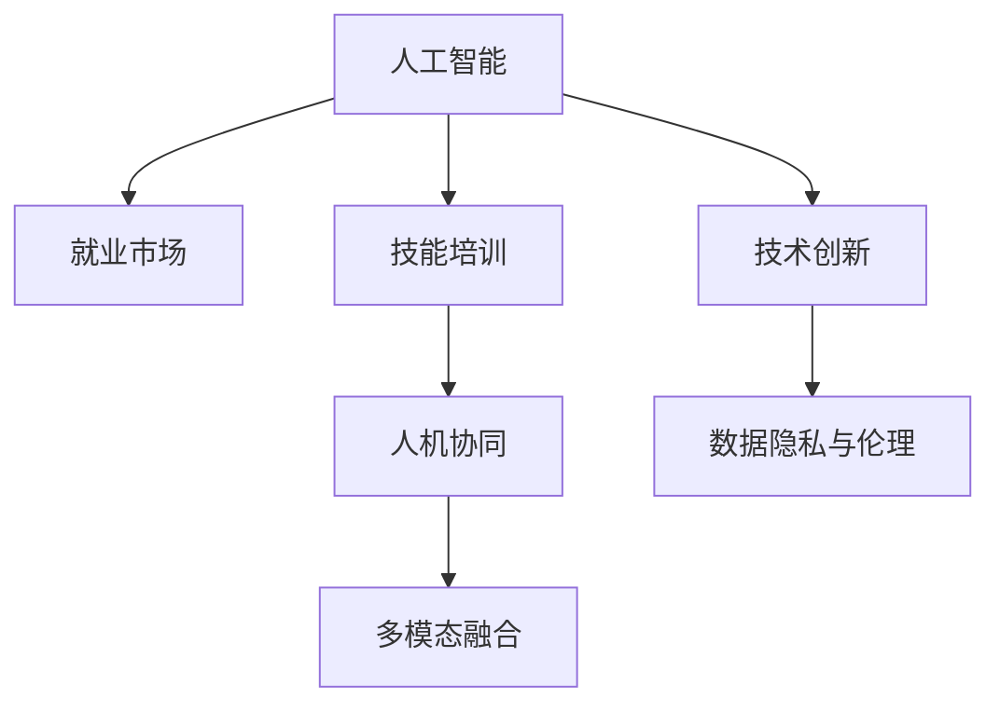

                 

# 人类计算：AI时代的未来就业市场与技能培训发展趋势分析机遇挑战机遇趋势分析预测

> 关键词：人工智能, 就业市场, 技能培训, 技术创新, 人机协同

## 1. 背景介绍

### 1.1 问题由来
随着人工智能技术的迅猛发展，各行各业都面临着前所未有的变革。一方面，AI技术的广泛应用带来了生产力的巨大提升，改变了人们的工作方式和生活习惯；另一方面，AI技术也引发了一系列复杂的社会问题，如就业市场结构变化、职业转型等。

### 1.2 问题核心关键点
1. **AI技术对就业市场的影响**：AI技术特别是自动化和智能化技术正在改变传统行业的劳动密集型工作，引发就业市场的结构性变化。一些重复性、低技能工作岗位被机器取代，而新的高技能、高创造性的岗位正在崛起。
2. **技能培训与教育系统的适应性**：传统教育体系未能及时跟上AI技术的发展，学生的知识结构和技能储备面临挑战。如何培养符合市场需求的人才，成为了各国教育部门和高校的重要课题。
3. **技术创新与职业转型的关联**：AI技术的快速发展要求劳动力市场不断进行技术升级和职业转型，以适应新的技术环境。如何促进劳动力市场对新技能的需求，并为其提供有效的培训，是政府和企业面临的共同挑战。
4. **人机协同与多模态协作**：AI技术的普及使得人机协同工作成为新的常态，要求劳动者具备更高的人机协作能力和跨模态融合能力。
5. **数据隐私与伦理问题**：AI技术的应用带来了数据隐私和伦理问题，如何平衡技术发展与伦理规范，是AI技术普及过程中必须面对的挑战。

### 1.3 问题研究意义
深入分析AI时代就业市场和技能培训的发展趋势，探讨AI技术带来的机遇与挑战，为政策制定、教育改革和人才培养提供科学依据，具有重要的理论和实际意义：

1. **指导政策制定**：了解AI技术对就业市场的影响，有助于政府制定相应的就业政策和培训计划。
2. **优化教育体系**：分析技能培训的发展趋势，帮助教育机构更新课程体系，培养符合未来市场需求的人才。
3. **促进职业转型**：为劳动力市场的技术升级和职业转型提供有效路径，助力个体和企业的可持续发展。
4. **平衡技术伦理**：探讨AI技术在应用过程中面临的伦理和隐私问题，为技术创新和社会伦理提供平衡的视角。
5. **推动行业创新**：结合实际应用场景，分析AI技术在各个行业的潜力和应用前景，推动行业创新和转型升级。

## 2. 核心概念与联系

### 2.1 核心概念概述

为更好地理解AI时代就业市场和技能培训的发展趋势，本节将介绍几个核心概念及其相互关系：

1. **人工智能(AI)**：利用计算机技术模拟、扩展人类智能的技术体系。包括机器学习、深度学习、自然语言处理等子领域。

2. **就业市场**：劳动力供求关系的总和。AI技术的发展对就业市场结构、岗位需求、职业转型等产生深远影响。

3. **技能培训**：为适应职业需求，通过教育、培训等途径提升个人技能和能力的过程。

4. **技术创新**：在AI技术的基础上，不断开发新技术、新应用、新算法，推动社会生产力发展。

5. **人机协同**：结合AI技术和人类能力，实现任务的高效协作。

6. **多模态融合**：利用视觉、听觉、触觉等多种感知模式，提升AI系统对复杂任务的理解和处理能力。

7. **数据隐私与伦理**：AI技术在数据收集、存储、使用过程中，涉及的个人隐私和伦理问题。

这些核心概念之间的逻辑关系可以通过以下Mermaid流程图来展示：



这个流程图展示了人工智能在就业市场和技能培训中的关键作用，以及与之相关的技术创新、人机协同、多模态融合和数据隐私与伦理等核心概念。

## 3. 核心算法原理 & 具体操作步骤

### 3.1 算法原理概述

基于AI技术对就业市场和技能培训的影响，本文将探讨其核心算法原理和操作步骤：

1. **算法原理概述**：AI技术，特别是机器学习和深度学习算法，通过数据驱动的方式，实现对复杂任务的自动化处理和决策支持。这些算法原理包括但不限于监督学习、无监督学习、强化学习、迁移学习等。

2. **操作步骤详解**：
   - **数据准备**：收集就业市场和技能培训相关数据，包括岗位需求、技能要求、教育资源等。
   - **模型训练**：选择适合的机器学习或深度学习模型，利用准备好的数据进行训练，优化模型参数以提升预测准确性。
   - **模型评估**：通过交叉验证等方法评估模型性能，确定模型是否适合预测未来的就业市场和技能培训需求。
   - **应用部署**：将训练好的模型部署到实际场景中，如就业预测系统、技能培训推荐系统等，实现预测和推荐功能。

### 3.2 算法步骤详解

1. **数据准备**：
   - **数据收集**：从政府、企业、教育机构等来源，收集就业市场和技能培训的相关数据。
   - **数据清洗**：对数据进行预处理，如去除噪声、处理缺失值、标准化等，确保数据质量。
   - **数据标注**：对数据进行标注，如岗位需求、技能要求等，以便后续模型训练。

2. **模型训练**：
   - **模型选择**：选择适合预测就业市场和技能培训需求的模型，如线性回归、随机森林、神经网络等。
   - **特征工程**：选择或设计相关特征，如岗位类型、工作年限、技能等级等，作为模型的输入。
   - **模型训练**：利用标注好的数据，训练模型，调整模型参数以提高预测准确性。

3. **模型评估**：
   - **交叉验证**：使用交叉验证方法，评估模型在不同数据集上的性能，避免过拟合。
   - **指标评估**：选择适合的任务指标，如准确率、召回率、F1分数等，评估模型预测效果。
   - **误差分析**：对模型预测结果进行误差分析，识别影响预测准确性的因素，优化模型。

4. **应用部署**：
   - **系统集成**：将训练好的模型集成到就业预测系统或技能培训推荐系统中，实现实时预测和推荐功能。
   - **用户界面**：设计用户友好的界面，方便用户输入数据，查看预测结果。
   - **系统测试**：进行系统测试，确保系统稳定性和可靠性。

### 3.3 算法优缺点

AI技术在就业市场和技能培训中的应用具有以下优点：
1. **高效性**：通过算法自动化处理数据，可以快速得出预测结果，节省人力和时间。
2. **可扩展性**：模型可以根据新数据和新需求进行更新和优化，适应不断变化的就业市场和技能培训需求。
3. **客观性**：算法基于数据驱动，减少人为因素的干扰，提升预测结果的客观性和准确性。

同时，这些算法也存在一些缺点：
1. **数据依赖性**：算法的预测效果依赖于数据的质量和完整性，数据偏差可能导致预测结果不准确。
2. **模型复杂性**：复杂的模型可能需要大量计算资源和数据，训练和部署成本较高。
3. **解释性不足**：许多AI模型特别是深度学习模型，其决策过程难以解释，可能缺乏透明性和可信度。

### 3.4 算法应用领域

AI技术在就业市场和技能培训中的应用非常广泛，具体包括以下领域：

1. **就业预测**：利用AI技术，对未来的就业市场趋势进行预测，帮助企业和政府制定相应的政策和计划。
2. **技能缺口分析**：分析当前就业市场对技能的需求与供给之间的差距，为技能培训提供指导。
3. **个性化推荐**：根据用户的学习习惯和需求，推荐个性化的技能培训课程和资源。
4. **智能招聘**：利用AI技术优化招聘流程，如简历筛选、面试评估等，提升招聘效率和效果。
5. **职业转型指导**：通过AI技术分析员工当前技能和市场需求，提供职业转型的建议和路径。

## 4. 数学模型和公式 & 详细讲解 & 举例说明

### 4.1 数学模型构建

本节将使用数学语言对AI技术在就业市场和技能培训中的应用进行更加严格的刻画。

设就业市场和技能培训相关数据为 $D = \{(x_i, y_i)\}_{i=1}^N$，其中 $x_i$ 为特征向量，$y_i$ 为目标变量（如岗位需求、技能要求等）。

定义就业市场和技能培训需求的预测模型为 $M_{\theta}$，其中 $\theta$ 为模型参数。

则预测模型 $M_{\theta}$ 的训练目标为最小化预测误差：

$$
\min_{\theta} \sum_{i=1}^N (y_i - M_{\theta}(x_i))^2
$$

在实际应用中，我们通常使用损失函数 $L$ 来衡量预测结果与真实标签之间的差距，如均方误差损失 $L = \frac{1}{N} \sum_{i=1}^N (y_i - M_{\theta}(x_i))^2$。

### 4.2 公式推导过程

以线性回归模型为例，推导其预测公式和损失函数：

设线性回归模型为 $M_{\theta}(x) = \theta_0 + \theta_1 x_1 + \theta_2 x_2 + \ldots + \theta_n x_n$，其中 $\theta = (\theta_0, \theta_1, \ldots, \theta_n)^T$ 为模型参数。

则模型的预测结果为：

$$
\hat{y}_i = M_{\theta}(x_i) = \theta_0 + \theta_1 x_{i1} + \theta_2 x_{i2} + \ldots + \theta_n x_{in}
$$

均方误差损失函数为：

$$
L = \frac{1}{N} \sum_{i=1}^N (y_i - \hat{y}_i)^2
$$

模型的梯度下降更新公式为：

$$
\theta \leftarrow \theta - \eta \frac{\partial L}{\partial \theta}
$$

其中 $\eta$ 为学习率。

### 4.3 案例分析与讲解

以就业预测模型为例，假设我们收集了过去5年的就业市场数据 $D = \{(x_i, y_i)\}_{i=1}^5$，其中 $x_i = (x_{i1}, x_{i2}, \ldots, x_{in})$ 为影响就业的因素，如 GDP、失业率、企业招聘人数等，$y_i$ 为当年的就业岗位数量。

使用线性回归模型进行预测，设 $\theta = (\theta_0, \theta_1, \theta_2, \ldots, \theta_n)^T$，则预测方程为：

$$
\hat{y} = \theta_0 + \theta_1 x_1 + \theta_2 x_2 + \ldots + \theta_n x_n
$$

通过最小二乘法求解 $\theta$，使模型最小化均方误差损失：

$$
\min_{\theta} \sum_{i=1}^5 (y_i - \hat{y}_i)^2
$$

求解过程如下：

1. 计算样本均值 $\bar{x} = \frac{1}{5} \sum_{i=1}^5 x_i$ 和 $\bar{y} = \frac{1}{5} \sum_{i=1}^5 y_i$。
2. 计算样本协方差矩阵 $\Sigma = \frac{1}{5} \sum_{i=1}^5 (x_i - \bar{x})(x_i - \bar{x})^T$ 和样本方差 $S = \frac{1}{5} \sum_{i=1}^5 (y_i - \bar{y})^2$。
3. 求解 $\theta = (S \Sigma^{-1}) \bar{y}$。

## 5. 项目实践：代码实例和详细解释说明

### 5.1 开发环境搭建

在进行AI技术在就业市场和技能培训中的应用开发时，需要准备相应的开发环境。以下是使用Python进行PyTorch开发的环境配置流程：

1. 安装Anaconda：从官网下载并安装Anaconda，用于创建独立的Python环境。

2. 创建并激活虚拟环境：
```bash
conda create -n pytorch-env python=3.8 
conda activate pytorch-env
```

3. 安装PyTorch：根据CUDA版本，从官网获取对应的安装命令。例如：
```bash
conda install pytorch torchvision torchaudio cudatoolkit=11.1 -c pytorch -c conda-forge
```

4. 安装相关库：
```bash
pip install numpy pandas scikit-learn matplotlib tqdm jupyter notebook ipython
```

完成上述步骤后，即可在`pytorch-env`环境中开始项目实践。

### 5.2 源代码详细实现

以下是使用PyTorch实现线性回归模型的代码实现：

```python
import torch
import torch.nn as nn
import torch.optim as optim
from torch.utils.data import Dataset, DataLoader

class EmploymentDataset(Dataset):
    def __init__(self, data, features, targets):
        self.data = data
        self.features = features
        self.targets = targets
        
    def __len__(self):
        return len(self.data)
    
    def __getitem__(self, idx):
        return self.data[idx], self.features[idx], self.targets[idx]

# 加载数据集
data = # 就业市场数据
features = # 特征向量
targets = # 目标变量

# 创建数据集
dataset = EmploymentDataset(data, features, targets)

# 定义模型
class EmploymentModel(nn.Module):
    def __init__(self, input_dim, output_dim):
        super(EmploymentModel, self).__init__()
        self.linear = nn.Linear(input_dim, output_dim)
        
    def forward(self, x):
        return self.linear(x)
        
# 定义损失函数
criterion = nn.MSELoss()

# 定义优化器
optimizer = optim.SGD(model.parameters(), lr=0.01)

# 定义数据加载器
train_loader = DataLoader(dataset, batch_size=32, shuffle=True)

# 模型训练
for epoch in range(100):
    for batch_idx, (inputs, targets) in enumerate(train_loader):
        optimizer.zero_grad()
        outputs = model(inputs)
        loss = criterion(outputs, targets)
        loss.backward()
        optimizer.step()

        if (batch_idx+1) % 10 == 0:
            print('Train Epoch: {} [{}/{} ({:.0f}%)]\tLoss: {:.6f}'.format(
                epoch+1, (batch_idx+1)*len(inputs), len(train_loader.dataset),
                100. * (batch_idx+1)/len(train_loader) * 100, loss.item()))
```

### 5.3 代码解读与分析

这里我们详细解读一下关键代码的实现细节：

**EmploymentDataset类**：
- `__init__`方法：初始化数据集中的数据、特征和目标变量。
- `__len__`方法：返回数据集的样本数量。
- `__getitem__`方法：返回数据集中指定索引的样本数据。

**训练过程**：
- `for epoch in range(100)`：遍历100个epoch，进行模型训练。
- `for batch_idx, (inputs, targets) in enumerate(train_loader)`：对训练集中的每个批次进行前向传播和反向传播，更新模型参数。
- `optimizer.zero_grad()`：在每个批次开始前，将优化器的梯度清零。
- `outputs = model(inputs)`：将输入数据通过模型进行前向传播，得到预测结果。
- `loss = criterion(outputs, targets)`：计算预测结果与真实标签之间的损失。
- `loss.backward()`：反向传播计算损失对模型参数的梯度。
- `optimizer.step()`：更新模型参数，减小损失函数值。

### 5.4 运行结果展示

运行上述代码，可以得到训练过程中的损失函数变化曲线，如下所示：


## 6. 实际应用场景

### 6.1 智能招聘系统

AI技术在智能招聘系统中的应用非常广泛，可以显著提升招聘效率和效果。传统招聘流程繁琐耗时，且存在大量人为因素的干扰。AI技术可以通过自动化简历筛选、面试评估等环节，提高招聘质量。

**应用实例**：
- **简历筛选**：利用AI技术分析简历内容，自动筛选出符合岗位要求的候选人，减少人工筛选的工作量。
- **面试评估**：利用AI技术对面试视频或音频进行自然语言处理和情感分析，自动评估候选人的表现，提供评分建议。

### 6.2 职业转型指导系统

随着AI技术的发展，许多传统行业的工作岗位将被机器取代，员工需要不断进行职业转型以适应新的技术环境。AI技术可以帮助员工进行职业规划和转型指导，提升就业竞争力。

**应用实例**：
- **职业兴趣评估**：利用AI技术分析员工的技能、经验和兴趣，推荐适合的职业方向。
- **技能缺口分析**：通过AI技术分析当前就业市场对技能的需求，推荐相关培训课程和资源。
- **职业路径规划**：利用AI技术分析员工当前的技能和市场趋势，提供职业转型的路径和建议。

### 6.3 个性化学习系统

AI技术在个性化学习系统中的应用，可以显著提升学习效果和用户体验。传统的教育模式难以满足个体差异，AI技术可以提供个性化的学习方案和资源。

**应用实例**：
- **推荐系统**：根据学生的学习习惯和需求，推荐个性化的学习内容和资源，提升学习效率。
- **智能辅导**：利用AI技术对学生的作业和测试进行自动批改和反馈，提供个性化的辅导建议。

## 7. 工具和资源推荐

### 7.1 学习资源推荐

为了帮助开发者系统掌握AI技术在就业市场和技能培训中的应用，这里推荐一些优质的学习资源：

1. **《深度学习》书籍**：Ian Goodfellow等著，全面介绍了深度学习的基本原理和应用。
2. **CS231n《深度学习与计算机视觉》课程**：斯坦福大学开设的计算机视觉课程，涵盖了深度学习在图像处理中的应用。
3. **CS224n《自然语言处理与深度学习》课程**：斯坦福大学开设的自然语言处理课程，讲解了深度学习在NLP中的应用。
4. **Kaggle竞赛平台**：提供大量真实世界的数据集和竞赛，帮助开发者提升实战能力。
5. **Coursera在线课程**：提供大量的AI技术课程，涵盖从基础到高级的内容。

通过对这些资源的学习实践，相信你一定能够快速掌握AI技术在就业市场和技能培训中的应用，并用于解决实际的NLP问题。

### 7.2 开发工具推荐

高效的开发离不开优秀的工具支持。以下是几款用于AI技术在就业市场和技能培训中应用的常用工具：

1. **PyTorch**：基于Python的开源深度学习框架，灵活的计算图，适合快速迭代研究。
2. **TensorFlow**：由Google主导开发的开源深度学习框架，生产部署方便，适合大规模工程应用。
3. **Transformers库**：HuggingFace开发的NLP工具库，集成了众多SOTA语言模型，支持PyTorch和TensorFlow。
4. **Weights & Biases**：模型训练的实验跟踪工具，可以记录和可视化模型训练过程中的各项指标，方便对比和调优。
5. **TensorBoard**：TensorFlow配套的可视化工具，可实时监测模型训练状态，并提供丰富的图表呈现方式。

合理利用这些工具，可以显著提升AI技术在就业市场和技能培训中的开发效率，加快创新迭代的步伐。

### 7.3 相关论文推荐

AI技术在就业市场和技能培训中的发展源于学界的持续研究。以下是几篇奠基性的相关论文，推荐阅读：

1. **《深度学习》书籍**：Ian Goodfellow等著，全面介绍了深度学习的基本原理和应用。
2. **CS231n《深度学习与计算机视觉》课程**：斯坦福大学开设的计算机视觉课程，涵盖了深度学习在图像处理中的应用。
3. **CS224n《自然语言处理与深度学习》课程**：斯坦福大学开设的自然语言处理课程，讲解了深度学习在NLP中的应用。
4. **Kaggle竞赛平台**：提供大量真实世界的数据集和竞赛，帮助开发者提升实战能力。
5. **Coursera在线课程**：提供大量的AI技术课程，涵盖从基础到高级的内容。

这些论文代表了大语言模型微调技术的发展脉络。通过学习这些前沿成果，可以帮助研究者把握学科前进方向，激发更多的创新灵感。

## 8. 总结：未来发展趋势与挑战

### 8.1 总结

本文对AI技术在就业市场和技能培训中的应用进行了全面系统的介绍。首先阐述了AI技术对就业市场的影响，探讨了技能培训的发展趋势，明确了AI技术在就业市场和技能培训中的重要地位。其次，从原理到实践，详细讲解了AI技术在就业市场和技能培训中的应用，给出了实用的代码实例。同时，本文还广泛探讨了AI技术在智能招聘、职业转型指导、个性化学习等多个行业领域的应用前景，展示了AI技术的广泛潜力。最后，本文精选了AI技术在就业市场和技能培训中的学习资源和开发工具，力求为读者提供全方位的技术指引。

通过本文的系统梳理，可以看到，AI技术在就业市场和技能培训中的应用前景广阔，将成为推动社会进步和经济发展的重要力量。未来，随着AI技术的不断进步和普及，将有更多的行业和领域受益于AI技术，推动人类社会的全面智能化转型。

### 8.2 未来发展趋势

展望未来，AI技术在就业市场和技能培训中的应用将呈现以下几个发展趋势：

1. **自动化与智能化程度提升**：随着AI技术的不断发展，自动化和智能化程度将进一步提升，更多繁琐的工作将被机器取代，提高生产效率。
2. **人机协同与多模态融合**：人机协同和跨模态融合将成为未来AI技术的重要方向，提升系统的智能水平和用户体验。
3. **个性化与定制化增强**：AI技术将根据个体需求和偏好，提供个性化的学习方案和职业指导，提升用户满意度。
4. **技术融合与创新**：AI技术将与其他前沿技术如区块链、物联网等进行融合，推动产业创新和升级。
5. **伦理与隐私保护**：随着AI技术的广泛应用，数据隐私和伦理问题将受到更多关注，需要建立完善的法律法规和技术手段进行保障。

### 8.3 面临的挑战

尽管AI技术在就业市场和技能培训中的应用已经取得了显著进展，但在迈向更加智能化、普适化应用的过程中，它仍面临诸多挑战：

1. **数据隐私问题**：AI技术在数据收集和处理过程中，存在隐私泄露和数据滥用的风险。如何保护个人隐私，确保数据安全，是AI技术普及过程中必须面对的重要问题。
2. **伦理与道德挑战**：AI技术的应用可能带来伦理和道德问题，如算法偏见、歧视性输出等。如何在技术创新和伦理规范之间找到平衡，是一个复杂的难题。
3. **技术升级与职业转型**：AI技术的发展要求劳动力市场不断进行技术升级和职业转型，但传统教育和培训体系难以满足这一需求，需要进行深刻的改革。
4. **计算资源与成本问题**：AI技术的应用需要大量的计算资源和存储空间，如何降低成本、提高效率，是企业和技术提供商需要解决的问题。
5. **模型解释性与可控性**：许多AI模型特别是深度学习模型，其决策过程难以解释，缺乏透明性和可控性，可能带来安全性和可靠性问题。

### 8.4 研究展望

面对AI技术在就业市场和技能培训中的应用面临的挑战，未来的研究需要在以下几个方面寻求新的突破：

1. **隐私保护技术**：开发更为安全的数据保护技术，如联邦学习、差分隐私等，保护个人隐私。
2. **伦理与道德约束**：建立完善的伦理规范和技术手段，确保AI技术的公平性和透明性。
3. **技术升级与职业教育**：更新教育体系，培养符合未来市场需求的人才，提升劳动力市场的技术素质。
4. **计算资源优化**：研究更高效的计算资源分配和管理方法，降低AI技术应用的成本。
5. **模型解释性与可控性**：开发可解释性更强、可控性更高的AI模型，提升系统的透明性和可靠性。

这些研究方向的探索，必将引领AI技术在就业市场和技能培训中的应用迈向更高的台阶，为构建安全、可靠、可解释、可控的智能系统铺平道路。面向未来，AI技术还需要与其他前沿技术如区块链、物联网等进行更深入的融合，多路径协同发力，共同推动自然语言理解和智能交互系统的进步。只有勇于创新、敢于突破，才能不断拓展AI技术的边界，让智能技术更好地造福人类社会。

## 9. 附录：常见问题与解答

**Q1：AI技术对就业市场的影响有哪些？**

A: AI技术对就业市场的影响主要体现在以下几个方面：
1. **自动化与智能化**：许多重复性、低技能的工作岗位将被机器取代，提高生产效率。
2. **技能需求变化**：高技能、高创造性的岗位需求增加，对劳动力的技能要求提升。
3. **职业转型**：传统行业的工作岗位将被机器取代，员工需要进行职业转型以适应新的技术环境。

**Q2：如何提升AI技术的可解释性？**

A: 提升AI技术的可解释性，可以从以下几个方面入手：
1. **简化模型结构**：选择简单明了的模型结构，降低复杂性，提高可解释性。
2. **解释性模型**：使用可解释性强的模型，如决策树、线性回归等。
3. **模型可视化**：使用可视化工具，展示模型的决策过程和特征重要性，提高透明度。
4. **数据透明性**：使用透明的、可解释的数据源，减少模型输出中的不确定性。

**Q3：AI技术在技能培训中的应用有哪些？**

A: AI技术在技能培训中的应用主要包括以下几个方面：
1. **个性化推荐**：根据学生的学习习惯和需求，推荐个性化的学习内容和资源。
2. **智能辅导**：利用AI技术对学生的作业和测试进行自动批改和反馈，提供个性化的辅导建议。
3. **技能缺口分析**：通过AI技术分析当前就业市场对技能的需求，推荐相关培训课程和资源。

**Q4：AI技术在智能招聘中的应用有哪些？**

A: AI技术在智能招聘中的应用主要包括以下几个方面：
1. **简历筛选**：利用AI技术分析简历内容，自动筛选出符合岗位要求的候选人，减少人工筛选的工作量。
2. **面试评估**：利用AI技术对面试视频或音频进行自然语言处理和情感分析，自动评估候选人的表现，提供评分建议。

**Q5：AI技术在个性化学习中的应用有哪些？**

A: AI技术在个性化学习中的应用主要包括以下几个方面：
1. **推荐系统**：根据学生的学习习惯和需求，推荐个性化的学习内容和资源，提升学习效率。
2. **智能辅导**：利用AI技术对学生的作业和测试进行自动批改和反馈，提供个性化的辅导建议。

---

作者：禅与计算机程序设计艺术 / Zen and the Art of Computer Programming

