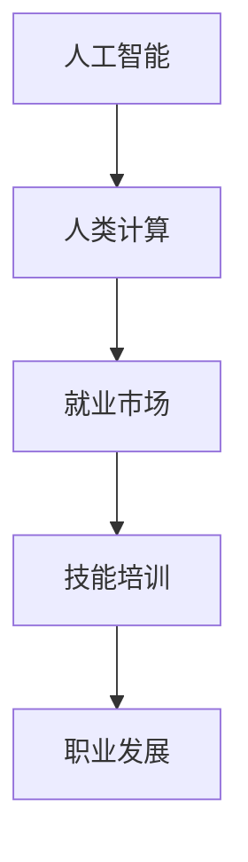

                 

# 人类计算：AI时代的未来就业市场趋势与技能培训分析

> 关键词：人工智能，就业市场，技能培训，人类计算，未来趋势

## 1. 背景介绍

### 1.1 问题由来
随着人工智能技术的飞速发展，自动化和智能化在各行各业逐渐普及，对人类劳动力市场产生了深远的影响。从制造到金融，从医疗到教育，AI不仅在提升效率、优化决策、改善服务质量等方面展现了巨大潜力，同时也对劳动力结构、就业模式、职业发展等产生了显著变化。人类计算作为人工智能与人类智慧结合的重要方式，在当前及未来的就业市场中扮演着重要角色。

### 1.2 问题核心关键点
AI技术的发展，尤其是在机器学习、深度学习、自然语言处理、计算机视觉等领域的突破，使得越来越多的任务可以被机器自动化处理。然而，随着技术的进步，对人类计算的需求并未减少，反而在某些领域变得更强烈。这不仅因为AI系统在某些特定场景下仍无法完全替代人类，更因为AI需要人类进行辅助和监督，才能充分发挥其潜力。

### 1.3 问题研究意义
研究AI时代的就业市场趋势与技能培训，对于理解AI技术对人类劳动力的影响、制定应对策略、指导教育和培训体系优化、促进人工智能与人类智慧的融合，具有重要意义。通过分析AI技术在各行业中的应用，可以更好地把握未来就业市场的动态，为劳动力转型和职业发展提供指导。

## 2. 核心概念与联系

### 2.1 核心概念概述

为了更好地理解AI时代的就业市场趋势与技能培训，本节将介绍几个关键概念：

- 人工智能(AI)：通过计算机系统模拟人类智能行为的技术，涵盖机器学习、深度学习、自然语言处理、计算机视觉等子领域。
- 人类计算：利用人类智慧与人工智能系统协同工作，提升决策质量、创造性和创新性的过程。
- 就业市场：劳动力供给与需求在时间和空间上的匹配，受经济、技术、社会等多重因素影响。
- 技能培训：通过教育和培训提升个体或群体的专业技能，适应就业市场变化的过程。
- 职业发展：个人在职业生涯中的成长和进步，包括职位晋升、技能提升、跨领域转岗等。

这些概念之间的逻辑关系可以通过以下Mermaid流程图来展示：



这个流程图展示了这个核心概念链的逻辑关系：

1. AI技术提供自动化工具，促进人类计算。
2. 人类计算在AI系统中发挥作用，提升决策质量。
3. 技能培训帮助个体适应AI技术，提升就业竞争力。
4. 职业发展在AI技术驱动下，产生新的职业机会和挑战。

## 3. 核心算法原理 & 具体操作步骤
### 3.1 算法原理概述

AI时代下的就业市场和技能培训分析，从本质上说，是对人类智慧与AI系统协同工作的系统性研究。其核心算法原理包括：

- 数据驱动：通过收集和分析大量就业市场数据，识别就业趋势、技能需求、岗位变化等关键信息。
- 模型预测：利用机器学习模型对就业市场未来的变化进行预测，评估不同技术应用场景对就业市场的影响。
- 场景模拟：构建虚拟就业市场模拟环境，对不同策略下的劳动力需求和供给进行仿真分析。
- 动态优化：通过动态调整技能培训方案，适应不断变化的就业市场需求。

### 3.2 算法步骤详解

基于上述算法原理，AI时代的就业市场和技能培训分析主要分为以下几个步骤：

**Step 1: 数据收集与处理**
- 收集各行业的就业数据、岗位需求、技能要求等关键信息。
- 通过自然语言处理技术，对数据进行清洗、提取、分类等处理，构建数据仓库。

**Step 2: 数据分析与建模**
- 利用统计分析和机器学习模型，对数据进行深入分析，识别就业市场的关键特征和趋势。
- 构建预测模型，预测未来就业市场的变化，评估不同AI技术对就业市场的影响。
- 进行虚拟就业市场模拟，验证模型的准确性和可靠性。

**Step 3: 技能需求分析**
- 对不同岗位的技能要求进行分析，识别核心技能和未来需求。
- 通过场景模拟，评估技能培训方案对就业市场的影响。

**Step 4: 培训方案设计**
- 基于技能需求分析结果，设计针对性的技能培训方案。
- 通过动态优化，确保培训方案与就业市场需求保持一致。

**Step 5: 效果评估与反馈**
- 对培训效果进行评估，收集反馈信息。
- 根据评估结果，调整和优化培训方案，确保培训效果的持续提升。

### 3.3 算法优缺点

AI时代的就业市场和技能培训分析具有以下优点：

- 数据驱动：通过大量数据分析，可以更准确地预测就业市场变化。
- 模型预测：利用机器学习模型，能够提前识别就业市场趋势和技能需求。
- 动态优化：通过持续调整培训方案，确保培训内容与市场需求保持一致。

同时，该方法也存在一定的局限性：

- 数据质量：数据收集和处理的准确性直接影响分析结果。
- 模型复杂性：高阶模型的训练和调参成本较高。
- 实时性：预测和模拟结果可能存在滞后性，无法实时反映市场变化。

尽管存在这些局限性，但就目前而言，数据驱动的预测和建模方法仍是最主流的方式。未来相关研究的重点在于如何进一步提升数据质量，降低模型复杂性，提高预测的实时性和准确性。

### 3.4 算法应用领域

AI时代的就业市场和技能培训分析在多个领域得到了广泛应用：

- 教育：通过分析未来职业需求，制定有针对性的教育培训计划。
- 人力资源管理：利用技能需求分析结果，优化人才招聘和培养策略。
- 政府决策：为政府制定就业政策和职业发展规划提供数据支持。
- 企业战略：帮助企业预测劳动力市场变化，制定应对策略。
- 职业指导：为个人提供职业发展建议，指导技能提升方向。

这些应用场景展示了AI技术在就业市场和技能培训中的重要作用，为各行业提供了宝贵的参考和支持。

## 4. 数学模型和公式 & 详细讲解  
### 4.1 数学模型构建

本节将使用数学语言对AI时代的就业市场和技能培训分析过程进行更加严格的刻画。

假设劳动力市场由 $L$ 个行业构成，每个行业有 $J$ 个岗位，每个岗位 $j$ 要求 $K$ 种技能 $S=\{s_1, s_2, ..., s_K\}$，技能需求矩阵记为 $D \in \mathbb{R}^{J \times K}$。设 $T$ 为当前时间点的就业市场需求，$T_{future}$ 为未来某个时间点的就业市场需求，则预测模型可以表示为：

$$
T_{future} = F(T, D, \theta)
$$

其中，$F$ 为预测函数，$\theta$ 为模型参数，可以通过历史数据和机器学习模型训练得到。

### 4.2 公式推导过程

以一个简单的线性回归模型为例，推导预测公式。

假设劳动力市场的需求量 $T$ 与岗位技能需求 $D$ 呈线性关系，则预测模型为：

$$
T_{future} = \beta_0 + \sum_{i=1}^K \beta_i D_{ij} + \epsilon
$$

其中，$\beta = (\beta_0, \beta_1, ..., \beta_K)$ 为模型系数，$\epsilon$ 为随机误差项。

根据最小二乘法，求解 $\beta$ 的公式为：

$$
\beta = (X^TX)^{-1}X^TY
$$

其中，$X = \begin{bmatrix} 1 & D_{1j} & \cdots & D_{Kj} \end{bmatrix}^T \in \mathbb{R}^{J \times (K+1)}$，$Y = \begin{bmatrix} T_1 \\ T_2 \\ \vdots \\ T_J \end{bmatrix} \in \mathbb{R}^J$。

### 4.3 案例分析与讲解

以金融行业为例，分析AI技术对就业市场的影响。

假设金融行业有 $J=100$ 个岗位，每个岗位需求 $K=5$ 种技能：财务分析、风险管理、技术支持、客户服务和市场营销。收集过去 $t$ 年的就业市场需求数据 $T = (T_1, T_2, ..., T_{100})$ 和技能需求数据 $D$。利用线性回归模型，预测未来 $t+1$ 年的就业市场需求 $T_{future} = (\hat{T}_1, \hat{T}_2, ..., \hat{T}_{100})$。

通过数据分析，识别出需求量变化与技能需求的关系，可以发现AI技术在风险管理、技术支持等领域的就业需求上升，而在客户服务、市场营销等领域的就业需求下降。这为金融行业的人力资源管理提供了有价值的信息，有助于优化人才招聘和培养策略，提升企业的竞争力。

## 5. 项目实践：代码实例和详细解释说明
### 5.1 开发环境搭建

在进行AI时代就业市场和技能培训分析实践前，我们需要准备好开发环境。以下是使用Python进行PyTorch开发的环境配置流程：

1. 安装Anaconda：从官网下载并安装Anaconda，用于创建独立的Python环境。

2. 创建并激活虚拟环境：
```bash
conda create -n pytorch-env python=3.8 
conda activate pytorch-env
```

3. 安装PyTorch：根据CUDA版本，从官网获取对应的安装命令。例如：
```bash
conda install pytorch torchvision torchaudio cudatoolkit=11.1 -c pytorch -c conda-forge
```

4. 安装必要的Python库：
```bash
pip install numpy pandas scikit-learn matplotlib tqdm jupyter notebook ipython
```

完成上述步骤后，即可在`pytorch-env`环境中开始项目实践。

### 5.2 源代码详细实现

下面是一个简单的基于线性回归模型的就业市场需求预测示例代码：

```python
import numpy as np
import pandas as pd
from sklearn.linear_model import LinearRegression
from sklearn.metrics import mean_squared_error

# 加载数据
data = pd.read_csv('employment_data.csv')

# 数据处理
X = data[['skill1', 'skill2', 'skill3', 'skill4', 'skill5']]
y = data['demand']

# 划分训练集和测试集
X_train, X_test, y_train, y_test = train_test_split(X, y, test_size=0.2, random_state=42)

# 建立线性回归模型
model = LinearRegression()
model.fit(X_train, y_train)

# 预测
y_pred = model.predict(X_test)

# 评估
mse = mean_squared_error(y_test, y_pred)
print(f"Mean Squared Error: {mse:.2f}")
```

### 5.3 代码解读与分析

让我们再详细解读一下关键代码的实现细节：

**数据处理**：
- 使用Pandas库加载就业市场需求数据，并进行数据清洗和特征提取。

**模型训练**：
- 使用scikit-learn库的线性回归模型进行训练，拟合训练数据。

**模型评估**：
- 使用均方误差作为评估指标，评估模型在测试集上的预测效果。

**代码执行结果**：
- 输出均方误差，用于衡量模型预测的准确性。

可以看到，这个简单的代码实现演示了如何使用线性回归模型进行就业市场需求预测。在实际应用中，我们可能需要考虑更多的因素，如时间序列、多变量回归、非线性关系等，才能得到更准确的预测结果。

## 6. 实际应用场景
### 6.1 教育培训

AI时代下，教育培训体系需要不断调整和优化，以适应AI技术带来的就业市场变化。通过技能需求分析，可以为教育培训部门提供有针对性的课程设置和师资培训方案，提升学生就业竞争力。

在实践中，可以收集各行业的人才需求数据，分析核心技能和未来趋势，设计有针对性的培训课程，如数据分析、人工智能、机器学习等。同时，利用在线教育平台，提供灵活的学习方式，帮助学生和职场人士不断提升技能水平。

### 6.2 人力资源管理

人力资源管理部门需要利用AI技术预测劳动力市场需求，优化人才招聘和培养策略。通过技能需求分析，可以识别出高需求的技能，指导企业制定针对性的人才招聘计划。

在实践中，可以利用机器学习模型预测未来技能需求，结合数据分析和场景模拟，制定合理的岗位配置和员工培训方案。通过持续监测和调整，确保人力资源管理策略与市场变化保持一致。

### 6.3 政府政策制定

政府在制定就业政策时，需要考虑AI技术对劳动力市场的影响。通过就业市场分析，可以为政策制定提供数据支持，指导就业、教育、培训等方面的政策制定。

在实践中，可以利用AI技术预测就业市场变化，识别就业增长或下降的行业和岗位，制定相应的就业扶持政策和教育培训计划。通过动态调整政策，适应不断变化的就业市场需求。

### 6.4 企业战略规划

企业需要利用AI技术预测劳动力市场变化，优化人才招聘和培养策略，制定科学的企业战略。通过技能需求分析，可以识别出未来高需求的技能，指导企业制定人力资源和人才培养计划。

在实践中，可以利用机器学习模型预测未来技能需求，结合数据分析和场景模拟，制定合理的岗位配置和员工培训方案。通过持续监测和调整，确保企业战略与市场变化保持一致。

### 6.5 职业指导与咨询

职业指导和咨询机构需要利用AI技术提供精准的职业发展建议，帮助个人制定职业规划和技能提升方案。通过技能需求分析，可以为求职者提供有针对性的职业建议和培训资源。

在实践中，可以利用机器学习模型预测未来就业市场需求，识别高需求的技能和岗位，为求职者提供有针对性的职业建议和培训资源。通过持续监测和调整，确保职业指导和咨询服务与市场变化保持一致。

## 7. 工具和资源推荐
### 7.1 学习资源推荐

为了帮助开发者系统掌握AI时代就业市场和技能培训的理论基础和实践技巧，这里推荐一些优质的学习资源：

1. 《AI时代就业市场分析》系列博文：由人工智能领域专家撰写，深入浅出地介绍了AI技术对就业市场的影响和应对策略。

2. 《机器学习与大数据分析》课程：Coursera上的经典课程，涵盖机器学习、大数据分析、数据可视化等关键技术，适合入门和进阶学习。

3. 《深度学习与自然语言处理》书籍：深度学习领域权威书籍，详细介绍深度学习技术在NLP中的应用，涵盖机器翻译、情感分析、问答系统等前沿技术。

4. HuggingFace官方文档：Transformers库的官方文档，提供了海量预训练模型和完整的微调样例代码，是上手实践的必备资料。

5. Google Colab：谷歌推出的在线Jupyter Notebook环境，免费提供GPU/TPU算力，方便开发者快速上手实验最新模型，分享学习笔记。

通过对这些资源的学习实践，相信你一定能够快速掌握AI时代就业市场和技能培训的精髓，并用于解决实际的NLP问题。

### 7.2 开发工具推荐

高效的开发离不开优秀的工具支持。以下是几款用于AI时代就业市场和技能培训开发的常用工具：

1. PyTorch：基于Python的开源深度学习框架，灵活动态的计算图，适合快速迭代研究。大部分预训练语言模型都有PyTorch版本的实现。

2. TensorFlow：由Google主导开发的开源深度学习框架，生产部署方便，适合大规模工程应用。同样有丰富的预训练语言模型资源。

3. Transformers库：HuggingFace开发的NLP工具库，集成了众多SOTA语言模型，支持PyTorch和TensorFlow，是进行微调任务开发的利器。

4. Weights & Biases：模型训练的实验跟踪工具，可以记录和可视化模型训练过程中的各项指标，方便对比和调优。与主流深度学习框架无缝集成。

5. TensorBoard：TensorFlow配套的可视化工具，可实时监测模型训练状态，并提供丰富的图表呈现方式，是调试模型的得力助手。

6. Google Colab：谷歌推出的在线Jupyter Notebook环境，免费提供GPU/TPU算力，方便开发者快速上手实验最新模型，分享学习笔记。

合理利用这些工具，可以显著提升AI时代就业市场和技能培训任务的开发效率，加快创新迭代的步伐。

### 7.3 相关论文推荐

AI时代就业市场和技能培训的发展源于学界的持续研究。以下是几篇奠基性的相关论文，推荐阅读：

1. 《机器学习在就业市场中的应用》：探讨机器学习技术在预测就业市场变化、优化招聘策略等方面的应用。

2. 《深度学习在职业培训中的作用》：分析深度学习技术在职业培训中的潜在价值，提出相关技术和方法的建议。

3. 《AI时代的技能培训新趋势》：总结AI技术对技能培训的影响，提出未来技能培训的应对策略。

4. 《人力资源管理与AI技术》：探讨AI技术在人力资源管理中的应用，提出优化人力资源管理策略的建议。

5. 《AI时代的职业指导与咨询》：分析AI技术在职业指导和咨询中的应用，提出提升职业指导服务质量的建议。

这些论文代表了大语言模型微调技术的发展脉络。通过学习这些前沿成果，可以帮助研究者把握学科前进方向，激发更多的创新灵感。

## 8. 总结：未来发展趋势与挑战

### 8.1 总结

本文对AI时代的就业市场和技能培训进行了全面系统的介绍。首先阐述了AI技术对就业市场的影响，明确了技能培训在适应就业市场需求中的重要作用。其次，从原理到实践，详细讲解了AI时代就业市场和技能培训的数学模型和操作步骤，给出了代码实例和详细解释说明。同时，本文还广泛探讨了AI技术在各行业中的应用前景，展示了AI技术在就业市场和技能培训中的重要作用。

通过本文的系统梳理，可以看到，AI时代下就业市场和技能培训正面临新的机遇和挑战。未来AI技术的持续发展，将带来更多新的职业机会和挑战，需要全社会共同努力，积极应对和适应。

### 8.2 未来发展趋势

展望未来，AI时代的就业市场和技能培训将呈现以下几个发展趋势：

1. 数据驱动：随着大数据技术的普及，数据驱动的就业市场分析将更加普及，为政策制定和企业战略提供坚实的数据支持。
2. 模型复杂化：随着深度学习技术的发展，复杂的机器学习模型将广泛应用，提高预测和分析的准确性。
3. 实时化：实时化的就业市场分析将成为常态，帮助企业及时调整人才招聘和培训策略。
4. 个性化：个性化培训将更加普及，根据个体需求和兴趣，提供有针对性的培训内容。
5. 跨领域融合：AI技术将与其他技术如区块链、物联网、5G等深度融合，产生新的就业机会和挑战。
6. 职业转型：AI技术将推动更多传统职业向智能化、自动化方向转型，需要劳动者不断提升技能以适应新要求。

以上趋势凸显了AI时代就业市场和技能培训的广阔前景。这些方向的探索发展，必将进一步提升AI技术在就业市场和技能培训中的应用水平，为社会进步和经济发展提供新的动力。

### 8.3 面临的挑战

尽管AI时代就业市场和技能培训技术取得了显著进展，但在迈向更加智能化、普适化应用的过程中，仍面临诸多挑战：

1. 数据质量：高质量、实时、全面的就业市场数据仍然稀缺，数据收集和处理的难度较大。
2. 模型复杂性：高阶模型的训练和调参成本较高，需要更多的资源和技术支持。
3. 公平性：AI技术在就业市场中的应用可能导致不平等现象，需要政策和社会监督的保障。
4. 可解释性：AI系统的决策过程往往缺乏可解释性，难以让人理解，需要更多的解释性研究。
5. 安全性：AI系统的安全性问题仍需关注，需要防范恶意攻击和数据泄露。
6. 伦理道德：AI技术的应用需要考虑伦理道德问题，确保公平、透明、安全。

正视这些挑战，积极应对并寻求突破，将是AI时代就业市场和技能培训迈向成熟的重要前提。相信随着学界和产业界的共同努力，这些挑战终将一一被克服，AI时代就业市场和技能培训必将在构建人机协同的智能时代中扮演越来越重要的角色。

### 8.4 研究展望

面向未来，AI时代就业市场和技能培训的研究需要在以下几个方面寻求新的突破：

1. 数据驱动：开发更多高质量、实时、全面的就业市场数据，提升数据分析的准确性。
2. 模型复杂化：探索更高效、更智能的机器学习模型，提高预测和分析的精度。
3. 实时化：研究实时化的就业市场分析方法，提供实时反馈和调整。
4. 个性化：开发个性化培训平台，根据个体需求和兴趣提供定制化培训方案。
5. 跨领域融合：研究AI技术与区块链、物联网、5G等技术的融合应用，开拓新的就业机会。
6. 职业转型：研究职业转型的路径和方法，帮助劳动者顺利过渡到新职业。
7. 公平性：研究AI技术的公平性问题，制定政策确保就业机会的公平分配。
8. 可解释性：开发更可解释的AI系统，提高决策过程的透明度和可信度。
9. 安全性：研究AI系统的安全性问题，防范恶意攻击和数据泄露。
10. 伦理道德：研究AI技术的伦理道德问题，确保应用过程的公平、透明、安全。

这些研究方向的探索，必将引领AI时代就业市场和技能培训技术迈向更高的台阶，为社会进步和经济发展提供新的动力。

## 9. 附录：常见问题与解答

**Q1：AI时代就业市场是否会减少对人类劳动力的需求？**

A: AI技术在提升生产效率、优化决策等方面发挥了重要作用，但并不会减少对人类劳动力的需求。AI技术需要人类进行监督、调整、维护，同时也需要人类创新、设计、管理。因此，AI时代将带来更多新的职业机会，同时也对劳动者的技能水平提出更高的要求。

**Q2：技能培训是否能够满足AI时代的需求？**

A: 技能培训是适应AI时代需求的重要手段，但需要不断更新和优化。AI时代对技能的需求更加多样化、复杂化，技能培训需要结合AI技术，提供更加精准、灵活的培训方案。同时，也需要关注个体的兴趣和潜力，培养跨领域、跨行业的复合型人才。

**Q3：AI技术是否会对就业市场产生负面影响？**

A: AI技术在提高生产效率、降低成本等方面具有积极作用，但也可能带来一些负面影响，如就业机会减少、工资水平下降等。因此，政府和社会需要制定相应的政策，确保AI技术带来的好处最大化，负面影响最小化。

**Q4：如何确保AI技术的公平性？**

A: 确保AI技术的公平性，需要从数据、模型、应用等多个层面进行考虑。首先，需要确保数据集的多样性和代表性，避免数据偏见。其次，需要设计公平的算法，避免模型歧视。最后，需要加强政策监管和社会监督，确保AI技术的应用公平、透明、安全。

**Q5：如何提高AI系统的可解释性？**

A: 提高AI系统的可解释性，需要结合多学科知识进行研究。可以通过设计可解释模型、引入符号化知识、建立透明决策流程等方式，提高AI系统的透明度和可信度。同时，也需要加强与用户、社会各方的沟通，确保AI系统的应用符合人类价值观和伦理道德。

这些问题的探讨，为我们更好地理解和应对AI时代就业市场和技能培训带来的挑战提供了参考。只有全面把握问题的本质，才能在未来的技术发展中做出明智的决策，为社会进步和经济发展提供坚实的基础。

