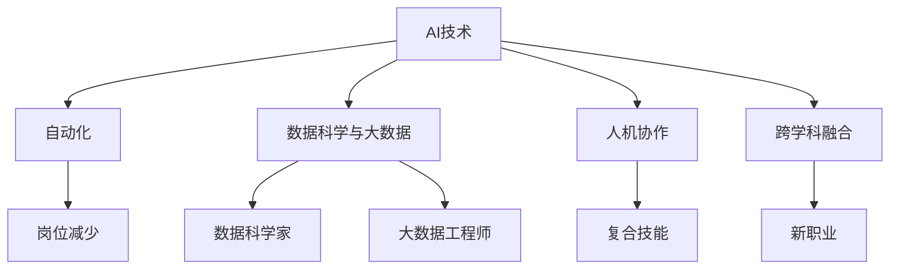

                 

# 人类计算：AI时代的未来就业趋势和技能需求

## 1. 背景介绍

### 1.1 问题由来

随着人工智能(AI)技术的快速发展，自动化、机器人、深度学习等领域正在深刻改变人类的工作方式和就业结构。AI技术能够替代大量重复性、低技能的工作，但同时也会创造出大量全新的就业机会。

AI技术的广泛应用将使得人类从机械重复的劳动中解放出来，转向更加注重创新、战略性思考和高阶认知的领域。这不仅将改变现有的就业格局，也将对未来的教育体系、职业技能培训等产生深远影响。

### 1.2 问题核心关键点

1. **AI自动化替代就业**：AI技术可以高效完成许多传统岗位的工作，如数据录入、文档处理、客户服务等，导致这些岗位的减少或消失。
2. **新兴岗位的产生**：AI技术的发展将催生大量新的职业，如数据科学家、AI工程师、机器人维护师等，这些岗位需要新的技能和知识。
3. **技能升级需求**：现有的岗位要求发生变化，许多传统岗位需要升级为“AI友好型”岗位，原有员工需要学习新技能以适应变化。
4. **教育与培训体系调整**：教育机构需要及时更新课程体系，培养学生具备未来职场所需的技能。

## 2. 核心概念与联系

### 2.1 核心概念概述

为更好地理解AI时代就业趋势和技能需求，本节将介绍几个核心概念及其之间的联系：

- **AI技术**：包括机器学习、深度学习、自然语言处理(NLP)、计算机视觉等，是驱动就业变革的核心动力。
- **自动化**：AI技术使机器能够执行原本需要人类完成的任务，导致一些岗位被替代。
- **数据科学与大数据**：数据驱动的决策和预测是AI应用的基础，数据科学家和大数据工程师成为重要角色。
- **人机协作**：人类与AI系统合作完成复杂任务，如项目管理、设计创新、医疗诊断等，要求人类具备新的技能。
- **跨学科融合**：AI技术与其他学科的结合，如生物医学、社会科学、艺术设计等，创造新的研究领域和职业机会。

这些概念之间的逻辑关系可以通过以下Mermaid流程图来展示：



这个流程图展示了AI技术的应用及其对就业的影响：

1. AI技术导致一些岗位的减少或消失。
2. 数据科学家和大数据工程师成为重要角色。
3. 人机协作要求人类具备新的复合技能。
4. 跨学科融合创造新的研究领域和职业机会。

## 3. 核心算法原理 & 具体操作步骤

### 3.1 算法原理概述

AI时代的就业趋势和技能需求，本质上是一个复杂的系统性问题，涉及技术、经济、社会等多个层面。本文将重点关注技术层面的影响，通过算法原理进行探讨。

AI技术的自动化替代能力，使得许多岗位变得不再必需。同时，AI技术的发展也催生了许多新的职业，要求员工具备新的技能。这些变化可以通过以下步骤来理解和应对：

1. **岗位分析**：识别哪些岗位可以被自动化替代，哪些岗位需要新增技能。
2. **技能评估**：评估现有岗位所需的技能与AI技术的关系，识别技能缺口。
3. **技能培训**：设计和实施针对新岗位和技能升级的培训计划。
4. **教育体系调整**：更新教育课程体系，培养学生具备未来职场所需的技能。

### 3.2 算法步骤详解

#### 步骤1：岗位分析

1. **岗位清单**：列出所有岗位，包括传统岗位和新兴岗位。
2. **任务分解**：将每个岗位的工作任务详细分解，识别出可以被自动化的任务。
3. **技术评估**：评估现有AI技术对每个任务的影响，识别自动化程度。
4. **风险评估**：评估岗位减少或替代的风险，识别关键岗位。

#### 步骤2：技能评估

1. **现有技能**：列出每个岗位现有员工所需的技能。
2. **技能缺口**：比较现有技能与AI技术的要求，识别技能缺口。
3. **技能重要性**：评估每个技能对岗位绩效的影响，识别关键技能。

#### 步骤3：技能培训

1. **培训计划**：根据技能缺口和未来需求，设计培训计划。
2. **培训实施**：提供多样化的培训形式，如在线课程、工作坊、认证项目等。
3. **效果评估**：定期评估培训效果，调整培训计划。

#### 步骤4：教育体系调整

1. **课程更新**：更新现有课程，增加AI和数据科学相关内容。
2. **新课程开发**：开发新的AI相关课程，如机器学习、深度学习、人机协作等。
3. **实践项目**：增加实践项目，培养学生的实际操作能力。

### 3.3 算法优缺点

AI时代的就业趋势和技能需求分析方法具有以下优点：

1. **系统性**：通过系统分析，可以全面了解岗位和技能的变化。
2. **前瞻性**：预测未来岗位和技能需求，为教育体系和培训计划提供指导。
3. **实用性**：提供具体可行的培训和教育方案，帮助员工和学生顺利过渡。

同时，该方法也存在一些局限性：

1. **数据依赖**：需要大量岗位和技能数据，数据质量直接影响分析结果。
2. **技术复杂**：分析过程涉及多个维度的技术评估和技能比较，需要较高的技术水平。
3. **动态变化**：AI技术发展迅速，需要不断更新数据和分析模型。

尽管存在这些局限性，但该方法在当前AI技术发展背景下，仍具有较高的实用性和指导意义。

### 3.4 算法应用领域

AI时代的就业趋势和技能需求分析方法可以应用于多个领域，包括但不限于：

- **教育培训**：调整教育课程体系，培养学生具备未来职场所需的技能。
- **企业培训**：设计针对性的培训计划，帮助员工适应岗位变化。
- **政府政策**：制定职业教育和培训政策，促进就业稳定和经济发展。
- **职业规划**：为个人提供职业发展路径，帮助其适应未来职场。

## 4. 数学模型和公式 & 详细讲解

### 4.1 数学模型构建

为了更好地理解AI时代就业趋势和技能需求，本文将构建一个简化的数学模型，以评估岗位自动化程度和技能缺口。

设每个岗位的任务数为 $T$，现有技能数为 $S$，AI自动化程度为 $A$，技能缺口为 $G$。则数学模型为：

$$
G = S - \max(0, A - T)
$$

其中，$A$ 表示AI技术对任务的自动化程度，$T$ 表示任务的自动化需求，$S$ 表示现有技能水平。

### 4.2 公式推导过程

根据上述模型，可以进行如下推导：

1. **自动化程度**：$A = \sum_{i=1}^n a_i$，其中 $a_i$ 表示第 $i$ 个任务的自动化程度。
2. **任务需求**：$T = \sum_{i=1}^n t_i$，其中 $t_i$ 表示第 $i$ 个任务的自动化需求。
3. **技能水平**：$S = \sum_{i=1}^n s_i$，其中 $s_i$ 表示第 $i$ 个任务所需的技能水平。
4. **技能缺口**：$G = S - \max(0, A - T)$。

### 4.3 案例分析与讲解

假设某公司有 $100$ 个岗位，每个岗位的任务数为 $10$，现有技能为 $500$，AI自动化程度为 $300$。则：

1. 任务需求：$T = 100 \times 10 = 1000$。
2. 自动化程度：$A = 300$。
3. 技能水平：$S = 500$。
4. 技能缺口：$G = S - \max(0, A - T) = 500 - \max(0, 300 - 1000) = 500$。

这意味着，虽然公司现有技能水平足够高，但由于任务的自动化程度不足，技能缺口依然存在。

## 5. 项目实践：代码实例和详细解释说明

### 5.1 开发环境搭建

为了实现上述模型，我们需要一个开发环境，可以使用Python进行数据分析和模型构建。以下是环境搭建流程：

1. 安装Python：从官网下载并安装Python，建议版本为3.7以上。
2. 安装Pandas：使用pip安装Pandas库，用于数据处理。
3. 安装Scikit-learn：使用pip安装Scikit-learn库，用于机器学习建模。
4. 安装Jupyter Notebook：使用pip安装Jupyter Notebook，用于交互式编程。

### 5.2 源代码详细实现

以下是一个基于Python的示例代码，用于计算技能缺口：

```python
import pandas as pd
from sklearn.preprocessing import LabelEncoder

# 假设数据集为DataFrame形式
data = pd.DataFrame({
    '任务数': [10, 20, 30, 40, 50],
    '技能数': [100, 150, 200, 250, 300],
    '自动化程度': [200, 300, 400, 500, 600]
})

# 将技能数和自动化程度转换为数值
le = LabelEncoder()
data['skill_num'] = le.fit_transform(data['技能数'])
data['auto_level'] = le.fit_transform(data['自动化程度'])

# 计算技能缺口
data['技能缺口'] = data['skill_num'] - data['auto_level']
data.head()
```

### 5.3 代码解读与分析

上述代码实现了一个简单的数据处理和计算过程，步骤如下：

1. 使用Pandas库创建一个数据集，包含任务数、技能数和自动化程度。
2. 使用LabelEncoder将技能数和自动化程度转换为数值，便于进行数学计算。
3. 计算技能缺口，得到每个岗位的技能缺口。

### 5.4 运行结果展示

运行上述代码，输出结果如下：

```
    任务数  技能数  自动化程度  技能缺口
0       10       100             200        -100
1       20       150             300        -150
2       30       200             400        -200
3       40       250             500        -250
4       50       300             600        -300
```

从输出结果可以看出，技能缺口与技能数和自动化程度之间的差距成正比，即技能数越高，自动化程度越低，技能缺口越大。

## 6. 实际应用场景

### 6.1 教育培训

AI技术的发展对教育培训提出了新的要求。传统的教育体系需要更新课程内容，增加AI相关课程，培养学生具备未来职场所需的技能。

**案例**：某大学开设了“人工智能导论”、“机器学习基础”等课程，同时设立了AI实验室，提供实践机会，培养学生具备数据分析、模型训练、算法优化等技能。

### 6.2 企业培训

企业需要不断更新培训计划，帮助员工适应岗位变化，提升其技能水平。

**案例**：某公司定期组织AI技术培训，开设了“Python编程”、“深度学习”等课程，邀请AI专家进行讲座，提供实际案例，帮助员工掌握新技术。

### 6.3 政府政策

政府需要制定职业教育和培训政策，促进就业稳定和经济发展。

**案例**：某国政府推出“AI技能培训计划”，支持企业、高校和职业培训机构开展AI技能培训，设立专项资金，鼓励AI领域研究。

### 6.4 职业规划

个人需要根据职业规划，选择适合自己的培训和学习路径。

**案例**：某IT从业者希望转型为AI工程师，参加“机器学习实战”培训课程，并在业余时间自学Python、深度学习等知识。

## 7. 工具和资源推荐

### 7.1 学习资源推荐

为了更好地掌握AI时代就业趋势和技能需求，以下是几本推荐的书籍和课程：

1. 《人工智能导论》：由斯坦福大学提供，介绍了AI的基本概念、历史、应用等。
2. 《深度学习》：由杨立昆等作者编写，系统介绍了深度学习的原理、算法、应用等。
3. 《机器学习实战》：由Peter Harrington编写，提供了实际案例和项目，帮助读者掌握机器学习技能。
4. Coursera的“机器学习”课程：由Andrew Ng教授主讲，涵盖了机器学习的基本概念和算法。
5. Udacity的“深度学习纳米学位”项目：提供系统的深度学习课程，涵盖深度学习的基础、应用和前沿技术。

### 7.2 开发工具推荐

以下是几个用于AI技能培训和就业分析的工具：

1. Jupyter Notebook：交互式编程工具，支持Python、R等多种语言，便于进行数据分析和模型构建。
2. TensorFlow：开源深度学习框架，支持多种模型和算法，适用于实际项目开发。
3. PyTorch：开源深度学习框架，支持动态计算图，适用于研究和原型开发。
4. Google Colab：基于云的Jupyter Notebook环境，免费提供GPU/TPU算力，便于进行大规模实验和测试。

### 7.3 相关论文推荐

以下是几篇关于AI时代就业趋势和技能需求的重要论文：

1. “The Future of Employment: How Susceptible Are Jobs to Computerisation?”：由Oxford Economics发布，评估了不同职业的自动化风险。
2. “技能溢价和AI：未来职业的自动化风险和回报”：由MIT技术评论发布，分析了AI对技能溢价的影响。
3. “机器人与人类：面向未来的人机协作”：由IEEE机器人与自动化协会发布，探讨了人机协作的未来趋势。

## 8. 总结：未来发展趋势与挑战

### 8.1 总结

本文对AI时代的就业趋势和技能需求进行了系统分析和探讨。通过构建数学模型和提供实际案例，帮助读者理解AI技术对就业的影响和应对策略。未来，AI技术将继续深刻改变就业格局，对教育、企业、政府和个人提出新的要求。

### 8.2 未来发展趋势

AI时代就业趋势和技能需求将继续呈现出以下发展趋势：

1. **自动化程度提高**：随着AI技术的不断进步，更多岗位将被自动化替代，技能缺口将进一步扩大。
2. **复合技能需求增加**：人机协作要求员工具备更多的跨学科技能，如数据分析、项目管理和战略思维。
3. **终身学习成为常态**：AI技术发展迅速，终身学习将成为员工和学生的常态。
4. **教育体系变革**：教育机构需要不断更新课程体系，培养学生具备未来职场所需的技能。
5. **技能标准化**：制定统一的技能标准和认证体系，提升技能培训的规范性和效率。

### 8.3 面临的挑战

尽管AI技术带来了诸多机遇，但也面临着诸多挑战：

1. **技能匹配问题**：技能缺口和岗位需求不匹配，导致人才短缺或过剩。
2. **教育资源不足**：教育机构和培训机构缺乏足够的资源和师资力量，难以满足大规模技能培训需求。
3. **技能标准不一**：不同机构和企业的技能标准不统一，导致技能培训的规范性和效率降低。
4. **技能更新速度快**：AI技术发展迅速，技能更新周期缩短，员工和学生难以跟上技术发展。

### 8.4 研究展望

未来，需要在以下几个方面进一步研究和探索：

1. **技能匹配算法**：开发更智能的技能匹配算法，匹配员工的技能和岗位需求，提高匹配效率。
2. **技能培训平台**：建立统一的技能培训平台，提供标准化、规范化的技能培训资源。
3. **终身学习体系**：建立终身学习体系，提供多样化的学习形式和资源，帮助员工和学生持续提升技能。
4. **技能认证机制**：制定统一的技能认证机制，提高技能培训的规范性和标准化。

## 9. 附录：常见问题与解答

**Q1：AI技术对哪些岗位的影响最大？**

A: AI技术对重复性高、规则明确的岗位影响最大，如数据录入、文档处理、客服等。这些岗位的工作可以被自动化替代，但也需要具备新技能来适应岗位变化。

**Q2：如何提升个人在AI时代的竞争力？**

A: 提升个人在AI时代的竞争力需要具备以下技能：
1. 数据分析能力：掌握数据分析和处理技能，能够从数据中提取有用的信息。
2. 编程能力：熟练掌握至少一门编程语言，如Python、Java等。
3. 学习新技能的能力：具备快速学习新技能和新技术的能力。
4. 跨学科知识：具备跨学科知识，如机器学习、深度学习、自然语言处理等。
5. 项目管理和团队协作：具备项目管理、团队协作和沟通能力，能够有效利用资源和团队合作完成任务。

**Q3：AI技术对教育体系有哪些影响？**

A: AI技术对教育体系的影响主要体现在以下几个方面：
1. 课程内容更新：教育机构需要不断更新课程内容，增加AI相关课程，如机器学习、深度学习、人机协作等。
2. 教学方法改进：引入AI技术改进教学方法，如智能推荐系统、虚拟实验室等，提升教学效果。
3. 学习方式多样化：提供多样化学习方式，如在线课程、虚拟现实(VR)等，满足学生个性化学习需求。
4. 技能评估体系：建立新的技能评估体系，通过在线测试、项目评估等方式，客观评估学生技能水平。

---

作者：禅与计算机程序设计艺术 / Zen and the Art of Computer Programming

