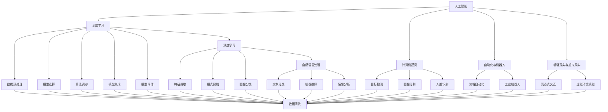

                 

## 1. 背景介绍

### 1.1 问题由来
随着人工智能（AI）技术的飞速发展，其在各行各业中的应用已经初见成效。人们逐渐意识到，AI不仅仅是工具，更是改变未来工作方式的重大力量。从自动化、智能化到自适应，AI技术正在重新定义工作技能，乃至整个人类社会的结构。在AI时代，传统的技能已经不足以满足新需求，急需新的知识体系和技能框架。

### 1.2 问题核心关键点
AI时代的工作技能升级，核心关键点在于理解AI技术原理和运作方式，并掌握与其结合的新型技能。具体包括以下几个方面：
1. **数据处理和清洗**：AI系统依赖大量数据，如何高效获取、处理和清洗数据，是基础技能之一。
2. **模型选择与优化**：理解不同AI模型的原理和适用场景，并在实际问题中进行选择和优化。
3. **算法调参与优化**：掌握调参技巧，使用优化算法提高模型性能。
4. **模型集成与评估**：学习如何将不同模型组合使用，并进行合理的性能评估。
5. **代码实现与部署**：能够编写高效、可扩展的代码，并进行模型部署和运维。
6. **持续学习和创新**：保持对AI领域的持续关注和深入学习，紧跟技术前沿。

### 1.3 问题研究意义
研究AI时代的工作技能，对于适应和引领AI技术的发展，提升个人和组织的竞争力，具有重要意义：
1. **提升工作效率**：通过掌握AI技术，大幅提升处理复杂任务的速度和精度，缩短工作周期。
2. **拓宽应用场景**：了解AI技术的广泛应用领域，开拓新的业务方向和应用场景。
3. **降低成本与风险**：利用AI自动化流程，减少人力和时间成本，降低工作错误率。
4. **推动技术创新**：通过深入学习和实践，推动企业技术创新，保持市场领先地位。
5. **增强决策能力**：利用AI技术进行数据分析和预测，提升决策的科学性和准确性。
6. **促进社会进步**：AI技术在社会治理、医疗健康、环境保护等领域的应用，将大幅提升社会福利。

## 2. 核心概念与联系

### 2.1 核心概念概述

为更好地理解AI时代的工作技能升级，本节将介绍几个密切相关的核心概念：

- **人工智能（Artificial Intelligence, AI）**：使用计算机系统和软件模拟人类智能过程，实现语音识别、图像处理、自然语言理解等任务。
- **机器学习（Machine Learning, ML）**：通过数据训练算法模型，使模型能够对新数据进行预测或决策。
- **深度学习（Deep Learning, DL）**：使用多层神经网络进行特征提取和模式识别，处理大规模数据集，实现图像识别、语音识别等复杂任务。
- **自然语言处理（Natural Language Processing, NLP）**：让计算机理解和生成自然语言，实现文本分类、机器翻译、情感分析等应用。
- **计算机视觉（Computer Vision, CV）**：使计算机能够“看”懂图像和视频，进行目标检测、图像分割、人脸识别等。
- **自动化与机器人**：使用机器人执行重复性高的任务，提高生产效率和工作自动化程度。
- **增强现实与虚拟现实（AR/VR）**：结合现实和虚拟环境，提供沉浸式交互体验。

这些核心概念之间通过协作和互动，形成了一个完整的AI技术框架，支持各个应用领域的智能化需求。

### 2.2 核心概念原理和架构的 Mermaid 流程图



这个图表展示了AI各个子领域之间的联系和互动，以及核心技术如何相互支撑。理解这些概念和原理，是掌握AI时代工作技能的基础。

## 3. 核心算法原理 & 具体操作步骤

### 3.1 算法原理概述

AI时代的工作技能升级，核心在于理解和应用机器学习算法，特别是深度学习算法。以下是对几种核心算法的概述：

- **监督学习（Supervised Learning）**：使用已标注的数据集训练模型，使其能够对新数据进行分类或回归预测。
- **无监督学习（Unsupervised Learning）**：不依赖标注数据，通过数据的内在结构进行聚类、降维等。
- **强化学习（Reinforcement Learning）**：通过与环境的互动，训练模型最大化某个奖励函数。
- **生成对抗网络（Generative Adversarial Networks, GAN）**：包含生成器和判别器两个网络，通过对抗训练生成逼真数据或图像。
- **迁移学习（Transfer Learning）**：使用已预训练的模型，在新任务上进行微调，以快速获得良好性能。
- **迁移学习（Fine-tuning）**：在大规模数据上预训练模型，在特定任务上进行微调，以进一步提升性能。

### 3.2 算法步骤详解

AI时代的工作技能升级，核心在于掌握上述算法的原理和操作步骤，并在实际应用中灵活运用。

**步骤1: 数据预处理**
- 数据清洗：去除噪声和异常值，处理缺失数据。
- 数据增强：增加数据多样性，提升模型的泛化能力。
- 数据划分：将数据划分为训练集、验证集和测试集。

**步骤2: 模型选择与优化**
- 模型选择：根据问题类型选择适合的模型，如线性回归、决策树、深度神经网络等。
- 模型优化：调整模型超参数，如学习率、批大小、正则化等，提高模型性能。

**步骤3: 算法调参与优化**
- 算法调参：使用网格搜索、随机搜索等方法，调整模型参数。
- 算法优化：引入更高效的优化算法，如Adam、RMSprop等，加速模型收敛。

**步骤4: 模型集成与评估**
- 模型集成：将多个模型进行组合，通过投票或加权平均提高性能。
- 模型评估：使用指标如准确率、召回率、F1分数等评估模型性能。

**步骤5: 代码实现与部署**
- 代码实现：编写高效、可扩展的代码，使用框架如TensorFlow、PyTorch等。
- 模型部署：将模型封装为API或微服务，进行分布式部署和运维。

**步骤6: 持续学习和创新**
- 持续学习：不断学习新算法、新工具，紧跟技术前沿。
- 技术创新：应用新技术和新算法，提升产品竞争力。

### 3.3 算法优缺点

AI时代的工作技能升级，核心在于掌握算法的优缺点，并根据具体问题进行合理选择。

- **监督学习**：需要大量标注数据，计算复杂度高，泛化能力有限。
- **无监督学习**：不需要标注数据，计算复杂度低，但可能存在噪声。
- **强化学习**：适合动态环境，但训练时间较长，需要大量试错。
- **生成对抗网络**：生成的结果逼真度高，但训练复杂度高，容易过拟合。
- **迁移学习**：数据需求低，训练时间短，但性能提升有限。
- **迁移学习（Fine-tuning）**：数据需求低，训练时间短，性能提升显著。

### 3.4 算法应用领域

AI时代的工作技能升级，核心在于理解算法在不同领域的应用。以下列举几个典型应用领域：

- **医疗健康**：使用深度学习进行医学影像分析、病历诊断、药物研发等。
- **金融行业**：使用机器学习进行信用评分、风险评估、算法交易等。
- **制造业**：使用自动化与机器人进行智能制造、质量控制、预测性维护等。
- **教育培训**：使用自然语言处理进行智能辅导、个性化推荐、学习分析等。
- **交通物流**：使用计算机视觉进行车辆识别、路线规划、物流管理等。
- **农业生产**：使用深度学习进行病虫害识别、产量预测、智能灌溉等。

## 4. 数学模型和公式 & 详细讲解 & 举例说明

### 4.1 数学模型构建

AI时代的工作技能升级，核心在于理解和应用数学模型。以下是对几种核心模型的构建。

- **线性回归模型**：用于预测连续值，公式为 $y = wx + b$。
- **决策树模型**：用于分类，公式为 $T(x) = \begin{cases} T_0(x) & x_0 < T_0 \\ T_1(x) & x_0 \geq T_0 \end{cases}$。
- **卷积神经网络（CNN）**：用于图像分类，公式为 $h^{(l)}(x) = \sigma(W^{(l)} h^{(l-1)}(x) + b^{(l)})$。
- **递归神经网络（RNN）**：用于时间序列预测，公式为 $h^{(l)}(x) = \sigma(W^{(l)} h^{(l-1)}(x) + b^{(l)})$。
- **生成对抗网络（GAN）**：包含生成器和判别器，公式为 $G(z) = \mu W^{(1)}z + \sigma W^{(2)}z + b$，$D(x) = \sigma(W^{(1)}x + b)$。

### 4.2 公式推导过程

以下以线性回归模型为例，推导其公式和梯度更新公式。

设训练集为 $D=\{(x_i,y_i)\}_{i=1}^N$，其中 $x_i \in \mathbb{R}^n, y_i \in \mathbb{R}$。

**最小二乘法（Ordinary Least Squares, OLS）**
- 目标函数：$\min \frac{1}{2} \sum_{i=1}^N (y_i - wx_i - b)^2$
- 求解过程：令梯度为零，即 $\frac{\partial}{\partial w} \frac{1}{2} \sum_{i=1}^N (y_i - wx_i - b)^2 = 0$，求解得 $w = (\sum_{i=1}^N x_i x_i^T)^{-1} \sum_{i=1}^N x_i y_i$，$b = \bar{y} - w\bar{x}$。

**梯度下降算法**
- 更新公式：$w \leftarrow w - \eta \frac{\partial}{\partial w} \frac{1}{2} \sum_{i=1}^N (y_i - wx_i - b)^2$
- 具体实现：在每次迭代中，计算梯度，并按一定步长更新 $w$ 和 $b$。

### 4.3 案例分析与讲解

**案例1: 图像分类**
- 问题描述：使用卷积神经网络对图像进行分类。
- 数据准备：收集图像数据，并对其进行预处理和增强。
- 模型选择：选择卷积神经网络（CNN）。
- 模型优化：调整超参数，如卷积核大小、滤波器数量、学习率等。
- 算法调参：使用随机搜索和交叉验证，寻找最佳参数组合。
- 模型集成：将多个CNN模型进行组合，提高分类准确率。
- 模型评估：使用准确率、召回率和F1分数评估模型性能。
- 代码实现：使用TensorFlow或PyTorch框架实现模型。
- 模型部署：将模型封装为API，进行分布式部署。

**案例2: 自然语言处理**
- 问题描述：使用循环神经网络（RNN）进行文本分类。
- 数据准备：收集文本数据，并进行分词、编码等预处理。
- 模型选择：选择循环神经网络（RNN）。
- 模型优化：调整超参数，如学习率、批大小、正则化等。
- 算法调参：使用梯度下降和Adam优化算法。
- 模型集成：将多个RNN模型进行组合，提高分类准确率。
- 模型评估：使用准确率、召回率和F1分数评估模型性能。
- 代码实现：使用TensorFlow或PyTorch框架实现模型。
- 模型部署：将模型封装为API，进行分布式部署。

## 5. 项目实践：代码实例和详细解释说明

### 5.1 开发环境搭建

在进行项目实践前，我们需要准备好开发环境。以下是使用Python进行TensorFlow开发的环境配置流程：

1. 安装Anaconda：从官网下载并安装Anaconda，用于创建独立的Python环境。

2. 创建并激活虚拟环境：
```bash
conda create -n tf-env python=3.8 
conda activate tf-env
```

3. 安装TensorFlow：根据CUDA版本，从官网获取对应的安装命令。例如：
```bash
conda install tensorflow tensorflow-gpu -c conda-forge
```

4. 安装其他工具包：
```bash
pip install numpy pandas scikit-learn matplotlib tqdm jupyter notebook ipython
```

完成上述步骤后，即可在`tf-env`环境中开始项目实践。

### 5.2 源代码详细实现

下面我们以图像分类任务为例，给出使用TensorFlow实现卷积神经网络（CNN）的代码实现。

首先，定义CNN模型：

```python
import tensorflow as tf
from tensorflow.keras import layers, models

def create_model(input_shape):
    model = models.Sequential([
        layers.Conv2D(32, (3,3), activation='relu', input_shape=input_shape),
        layers.MaxPooling2D((2,2)),
        layers.Conv2D(64, (3,3), activation='relu'),
        layers.MaxPooling2D((2,2)),
        layers.Flatten(),
        layers.Dense(64, activation='relu'),
        layers.Dense(10, activation='softmax')
    ])
    return model
```

然后，加载数据集并进行预处理：

```python
(train_images, train_labels), (test_images, test_labels) = tf.keras.datasets.mnist.load_data()
train_images = train_images.reshape(train_images.shape[0], 28, 28, 1)
train_images = train_images / 255.0
test_images = test_images.reshape(test_images.shape[0], 28, 28, 1)
test_images = test_images / 255.0
```

接着，定义训练和评估函数：

```python
batch_size = 32
epochs = 10

model = create_model(input_shape=(28,28,1))
model.compile(optimizer='adam', loss='sparse_categorical_crossentropy', metrics=['accuracy'])

def train(model, data, labels, batch_size, epochs):
    model.fit(data, labels, batch_size=batch_size, epochs=epochs, validation_split=0.2)

def evaluate(model, data, labels):
    test_loss, test_acc = model.evaluate(data, labels)
    print('Test accuracy:', test_acc)

train(model, train_images, train_labels, batch_size, epochs)
evaluate(model, test_images, test_labels)
```

以上就是使用TensorFlow对图像分类任务进行CNN模型微调的完整代码实现。可以看到，TensorFlow的高级API使得模型构建和训练过程非常简单高效。

### 5.3 代码解读与分析

让我们再详细解读一下关键代码的实现细节：

**create_model函数**：
- 定义了包含卷积层、池化层、全连接层的CNN模型。
- 使用Sequential模型，按顺序堆叠各层。
- 卷积层使用32和64个3x3大小的滤波器，激活函数为ReLU。
- 池化层使用2x2大小的窗口进行最大池化。
- 全连接层和输出层分别有64和10个神经元，激活函数为ReLU和Softmax。

**数据预处理**：
- 将图像数据进行reshape和归一化，使其符合模型输入格式。
- 使用L2归一化处理图像数据，使其具有更好的收敛性。

**训练函数train**：
- 定义训练函数，使用Adam优化器。
- 在每个epoch中，将训练数据和标签输入模型进行前向传播和反向传播，计算损失和梯度。
- 使用validation_split参数，将部分数据用作验证集，进行模型评估。

**评估函数evaluate**：
- 定义评估函数，使用evaluate方法评估模型在测试集上的性能。
- 输出测试集的准确率，供后续调参使用。

**训练流程**：
- 定义总的epoch数和batch size，开始循环迭代
- 每个epoch内，在训练集上进行训练，输出训练集和验证集的准确率
- 所有epoch结束后，在测试集上评估，给出最终测试结果

可以看到，TensorFlow使得CNN模型的构建和训练过程变得非常简单高效。开发者可以将更多精力放在数据处理、模型改进等高层逻辑上，而不必过多关注底层的实现细节。

当然，工业级的系统实现还需考虑更多因素，如模型的保存和部署、超参数的自动搜索、更灵活的任务适配层等。但核心的微调范式基本与此类似。

## 6. 实际应用场景

### 6.1 智能制造

在智能制造领域，基于AI技术的工作技能升级可以大幅提升生产效率和质量。通过图像识别和自动化，可以实现产品的自动化检测、组装和质量控制，大幅降低人工成本和错误率。

具体而言，可以使用计算机视觉技术对生产线上的产品进行实时监控和检测，识别出不合格品或潜在问题。通过图像分类和目标检测算法，可以快速定位问题区域，并自动进行分类和报警。同时，自动化机器人可以根据检测结果进行相应的处理，如剔除不合格品、修正缺陷等，实现高质量的生产。

### 6.2 智慧医疗

在智慧医疗领域，基于AI技术的工作技能升级可以提升诊断准确率和医疗服务效率。通过自然语言处理和机器学习，可以实现病历分析、诊断支持、个性化治疗等。

具体而言，可以使用自然语言处理技术对电子病历进行自动标注和分析，提取关键信息，如病史、症状、检查结果等。通过深度学习算法，可以从大量病历中挖掘出疾病特征，进行病因分析和预测。同时，可以使用图像识别技术对医学影像进行自动标注和分析，提高诊断的准确性和效率。

### 6.3 智能交通

在智能交通领域，基于AI技术的工作技能升级可以实现交通管理和智能驾驶。通过计算机视觉和传感器数据处理，可以实现交通流量监测、车辆识别、自动驾驶等。

具体而言，可以使用计算机视觉技术对交通摄像头拍摄的图像进行实时分析，识别出车辆、行人、交通标志等。通过目标检测和跟踪算法，可以实现车辆和行人的自动跟踪和计数。同时，可以使用自动驾驶技术对车辆进行路径规划和避障，实现无人驾驶和智能交通管理。

### 6.4 未来应用展望

随着AI技术的不断发展和普及，未来AI时代的工作技能升级将呈现以下几个趋势：

1. **多模态融合**：AI系统将更多地融合语音、视觉、触觉等多模态数据，实现更全面的智能感知和交互。
2. **联邦学习**：通过分布式计算和数据隐私保护技术，实现多个设备之间的协同学习和知识共享。
3. **自适应学习**：AI系统将具备自学习、自适应的能力，根据环境和任务的变化进行动态调整。
4. **人机协作**：AI系统将更多地与人类进行协作，提升任务完成效率和质量。
5. **跨领域应用**：AI技术将在更多领域实现落地应用，如教育、娱乐、农业等。
6. **伦理和社会责任**：AI系统将更多地考虑伦理和社会责任，确保其决策和行为的公平性和透明性。

## 7. 工具和资源推荐

### 7.1 学习资源推荐

为了帮助开发者系统掌握AI时代的工作技能，这里推荐一些优质的学习资源：

1. **Deep Learning Specialization by Andrew Ng**：斯坦福大学教授Andrew Ng的深度学习课程，涵盖深度学习的基础理论、模型设计和算法优化等内容。
2. **TensorFlow官方文档**：TensorFlow的官方文档，提供了丰富的教程和示例代码，是学习TensorFlow的必备资源。
3. **PyTorch官方文档**：PyTorch的官方文档，提供了详细的API文档和示例代码，是学习PyTorch的必备资源。
4. **Fast.ai**：Fast.ai提供的深度学习课程，注重实践和应用，适合快速上手深度学习。
5. **Kaggle**：数据科学竞赛平台，提供了大量的数据集和竞赛题目，适合进行实战练习。
6. **Coursera**：提供各类数据科学和机器学习课程，适合系统学习。

通过对这些资源的学习实践，相信你一定能够快速掌握AI时代的工作技能，并用于解决实际的AI问题。

### 7.2 开发工具推荐

高效的开发离不开优秀的工具支持。以下是几款用于AI技术开发的工具：

1. **TensorFlow**：谷歌推出的深度学习框架，支持分布式计算和GPU加速。
2. **PyTorch**：Facebook开发的深度学习框架，灵活易用，支持动态图和静态图。
3. **Keras**：高层次的深度学习框架，提供了简单易用的API，适合初学者和快速开发。
4. **Jupyter Notebook**：交互式编程环境，支持Python、R等多种语言，适合进行实验和调试。
5. **JupyterLab**：Jupyter Notebook的下一代版本，提供了更加丰富的开发工具和扩展功能。
6. **GitHub**：代码托管平台，支持版本控制和团队协作，适合进行代码管理和共享。

合理利用这些工具，可以显著提升AI技术开发和研究的效率，加快创新迭代的步伐。

### 7.3 相关论文推荐

AI时代的工作技能升级离不开对前沿研究的深入了解。以下是几篇奠基性的相关论文，推荐阅读：

1. **ImageNet Classification with Deep Convolutional Neural Networks**：AlexNet论文，提出了卷积神经网络，标志着深度学习时代的到来。
2. **Learning Deep Architectures for AI**：Yann LeCun的综述论文，介绍了深度学习的基本理论和模型设计。
3. **Attention is All You Need**：Transformer论文，提出了自注意力机制，实现了Transformer模型。
4. **AlphaGo Zero**：AlphaGo Zero论文，展示了强化学习在围棋游戏中的应用。
5. **Human-Personalized Few-shot Learning**：几样本学习论文，展示了利用少样本数据进行个性化学习的方法。
6. **Safe and Interpretable AI**：伦理和社会责任论文，探讨了AI系统的伦理和社会责任问题。

这些论文代表了AI技术的最新进展，通过学习这些前沿成果，可以帮助研究者把握学科前进方向，激发更多的创新灵感。

## 8. 总结：未来发展趋势与挑战

### 8.1 总结

本文对AI时代的工作技能升级进行了全面系统的介绍。首先阐述了AI技术在各行各业中的应用，明确了AI技术对未来工作技能的要求。其次，从原理到实践，详细讲解了AI技术的关键算法和操作步骤，给出了AI技术开发的全流程示例。同时，本文还广泛探讨了AI技术在多个领域的应用前景，展示了AI技术的广阔前景。最后，本文精选了AI技术的各类学习资源，力求为读者提供全方位的技术指引。

通过本文的系统梳理，可以看到，AI技术已经全面渗透到各行各业，成为未来工作技能的重要组成部分。掌握AI技术，理解AI原理，将使个人和组织在竞争激烈的市场中保持领先地位。

### 8.2 未来发展趋势

展望未来，AI技术的发展趋势将呈现出以下几个方向：

1. **智能协同**：AI系统将更多地与人类进行协作，提升任务完成效率和质量。
2. **泛化能力**：AI系统将具备更强的泛化能力，能够在不同领域和环境中表现出色。
3. **实时处理**：AI系统将更多地进行实时处理，实现更快速的决策和响应。
4. **跨领域应用**：AI技术将在更多领域实现落地应用，如教育、娱乐、农业等。
5. **伦理和社会责任**：AI系统将更多地考虑伦理和社会责任，确保其决策和行为的公平性和透明性。
6. **多模态融合**：AI系统将更多地融合语音、视觉、触觉等多模态数据，实现更全面的智能感知和交互。
7. **联邦学习**：通过分布式计算和数据隐私保护技术，实现多个设备之间的协同学习和知识共享。
8. **自适应学习**：AI系统将具备自学习、自适应的能力，根据环境和任务的变化进行动态调整。

这些趋势凸显了AI技术的广阔前景，为未来工作技能的升级提供了新的方向。

### 8.3 面临的挑战

尽管AI技术已经取得了瞩目成就，但在迈向更加智能化、普适化应用的过程中，它仍面临着诸多挑战：

1. **数据隐私和安全**：AI系统需要大量数据进行训练和优化，如何保护用户隐私和数据安全是一个重要问题。
2. **算法透明度和可解释性**：AI系统的决策过程往往缺乏透明度，难以解释其内部工作机制和决策逻辑。
3. **伦理和社会责任**：AI系统可能带来偏见和不公平，需要考虑其伦理和社会责任问题。
4. **计算资源限制**：AI系统需要大量计算资源，如何提高计算效率和资源利用率是一个重要问题。
5. **跨领域应用难度**：不同领域的AI应用需要跨学科知识，如何实现跨领域的知识融合是一个挑战。
6. **技术壁垒**：AI技术的学习和应用需要较高的门槛，如何降低技术壁垒是一个重要问题。
7. **模型鲁棒性**：AI系统在面对新数据和新场景时，可能出现鲁棒性不足的问题，如何提升模型鲁棒性是一个重要问题。

### 8.4 研究展望

面对AI技术面临的挑战，未来的研究需要在以下几个方面寻求新的突破：

1. **数据隐私保护**：开发隐私保护算法和加密技术，保护用户隐私和数据安全。
2. **算法透明度**：开发可解释性算法和可视化工具，提高AI系统的透明度和可解释性。
3. **伦理和社会责任**：引入伦理导向的评估指标，过滤和惩罚有偏见、有害的输出倾向。
4. **计算资源优化**：开发更高效的计算算法和硬件架构，提高计算效率和资源利用率。
5. **跨领域知识融合**：开发跨领域知识融合技术，实现不同领域之间的知识共享和协同。
6. **技术普及**：开发简单易用的AI工具和平台，降低技术壁垒，促进AI技术的普及应用。
7. **模型鲁棒性提升**：开发鲁棒性强的算法和模型，提高AI系统在新数据和新场景中的表现。

这些研究方向将引领AI技术的发展方向，推动AI技术的广泛应用和普及，为未来工作技能的升级提供新的动力。

## 9. 附录：常见问题与解答

**Q1：AI时代的工作技能升级是否需要重新学习编程技能？**

A: 是的，AI时代的工作技能升级需要重新学习编程技能，特别是Python、TensorFlow、PyTorch等深度学习框架的使用。掌握编程技能，才能更好地进行模型设计和优化，实现高效开发和应用。

**Q2：AI技术的开发和应用是否需要高昂的计算资源？**

A: 是的，AI技术的开发和应用需要高昂的计算资源，特别是深度学习模型的训练和推理。可以通过使用GPU、TPU等高性能硬件设备，或者使用云计算平台进行分布式计算，以降低计算成本。

**Q3：AI技术是否容易过拟合？**

A: 是的，AI技术在面对复杂任务和噪声数据时，容易过拟合。可以采用正则化、数据增强、早停等方法，避免过拟合问题，提高模型的泛化能力。

**Q4：AI技术的开发和应用是否需要高昂的数据成本？**

A: 是的，AI技术的开发和应用需要高昂的数据成本，特别是在数据标注和处理方面。可以通过数据生成、数据合成等方法，降低数据成本，提高数据质量和多样性。

**Q5：AI技术的开发和应用是否需要高昂的开发成本？**

A: 是的，AI技术的开发和应用需要高昂的开发成本，特别是在模型设计、调参、优化等方面。可以通过团队合作、开源共享等方法，降低开发成本，促进技术普及和应用。

**Q6：AI技术的开发和应用是否需要高昂的维护成本？**

A: 是的，AI技术的开发和应用需要高昂的维护成本，特别是在模型更新、数据迁移、系统优化等方面。可以通过自动化工具和平台，降低维护成本，提高系统稳定性和可靠性。

**Q7：AI技术的开发和应用是否需要高昂的学习成本？**

A: 是的，AI技术的开发和应用需要高昂的学习成本，特别是在算法选择、模型优化、知识整合等方面。可以通过系统学习、项目实践、知识共享等方法，降低学习成本，提升技术水平。

通过以上问题的回答，可以看到，AI技术的应用和发展需要投入大量的时间、精力和资源。但是，面对这些挑战，只要我们不断学习和创新，掌握AI时代的工作技能，就一定能够克服困难，实现AI技术的广泛应用和普及，推动未来工作技能的升级。

