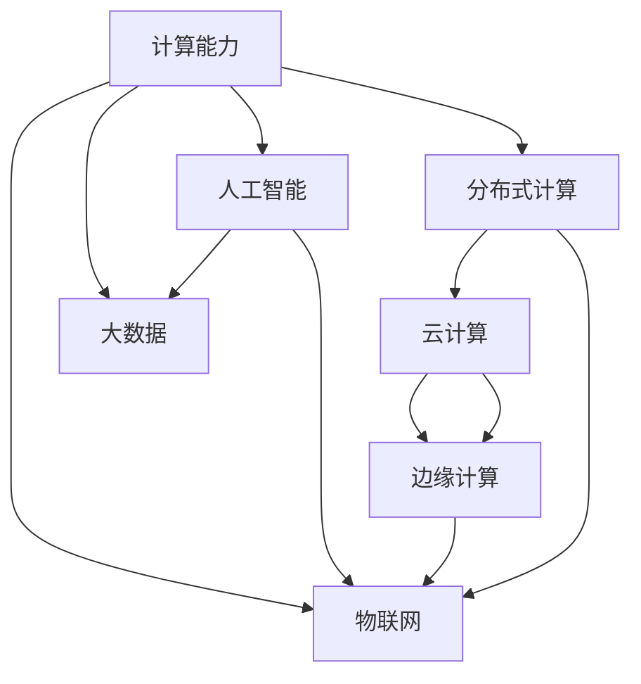

                 

# 人类计算：创造更美好未来的关键

## 1. 背景介绍

### 1.1 问题由来

在数字化时代的浪潮中，人类社会的方方面面都在发生深刻的变化。从通信、娱乐、教育到金融、医疗、物流，计算技术的无处不在正重新定义人类生活的每一个角落。但与此同时，我们也不得不面对一个严峻的问题：计算能力的发展与人类社会的需求并不总是同步的。随着计算量的爆炸式增长，传统的计算模式和计算资源已经无法满足日益复杂的计算任务。

当前，计算技术正处于一个新的历史转折点。在这个节点，我们需要重新审视计算的本质，探索更高效、更智能的计算模式。而“人类计算”，这一全新的计算范式，为我们提供了一个全新的视角，打开了通往更美好未来的窗口。

### 1.2 问题核心关键点

人类计算的核心在于将人类的智慧和计算能力相结合，实现计算任务的高效、精确和智能化。其主要特点包括：

- **分布式协作**：利用网络技术，将计算任务分配给多个地理位置的用户或计算设备，形成分布式协作网络。
- **以人为本**：将人类的智能和判断能力融入计算过程中，增强系统的可靠性和适应性。
- **动态优化**：根据实时反馈和任务需求，动态调整计算策略和资源分配，实现计算效率的优化。

这些特点使人类计算在处理复杂、非结构化、高维度数据时具备独特的优势。

### 1.3 问题研究意义

人类计算不仅仅是计算技术的一次创新，更是人类智慧的一次升华。研究人类计算，对于拓展计算能力的应用边界，推动社会向智能化、精准化、可持续化方向发展，具有重要意义：

1. **提升计算效率**：通过分布式协作和动态优化，人类计算能够实现更高的计算效率和资源利用率。
2. **增强系统可靠性**：将人类智能融入计算过程，增强系统的鲁棒性和适应性。
3. **促进跨领域融合**：人类计算能够跨越不同领域的界限，实现跨学科、跨行业的协同创新。
4. **赋能决策支持**：通过智能分析和实时反馈，人类计算能够为决策提供更为科学、准确的依据。
5. **驱动社会进步**：人类计算将推动社会治理、环境保护、公共健康等方面的进步，带来更美好的生活。

## 2. 核心概念与联系

### 2.1 核心概念概述

为更好地理解人类计算的原理和应用，本节将介绍几个关键概念：

- **计算能力**：指硬件和软件系统执行特定任务的能力。包括计算速度、数据处理能力、并行处理能力等。
- **分布式计算**：将计算任务分配到多个计算设备上并行处理，以提升计算效率。
- **云计算**：基于互联网的计算服务模式，提供按需使用的计算资源。
- **边缘计算**：在靠近数据源的本地设备上进行计算，减少网络延迟和带宽消耗。
- **人工智能**：通过机器学习和深度学习等技术，使计算机具备智能化的决策和推理能力。
- **大数据**：指海量、多源、复杂的数据集合，通常需要分布式计算才能处理。
- **物联网**：将各种设备、传感器、用户等通过网络互联，实现数据共享和协同计算。

这些概念之间通过网络技术、分布式系统、数据管理等技术手段相互连接，形成了一个复杂而强大的计算体系。

### 2.2 核心概念联系

这些概念通过一系列技术手段联系在一起，形成了一个有机整体。如下图所示，我们可以清晰地看到各概念之间的相互依赖和支持关系：



这个流程图展示了计算能力如何通过分布式计算、云计算、边缘计算、人工智能、大数据、物联网等技术手段，形成了一个高度协同的计算体系。

## 3. 核心算法原理 & 具体操作步骤

### 3.1 算法原理概述

人类计算的核心算法原理基于分布式协作和动态优化的思想。通过将计算任务分解为多个子任务，并分配给多个地理位置的用户或设备进行处理，然后通过实时反馈和动态优化，不断调整计算策略和资源分配，实现计算效率的提升和计算效果的优化。

### 3.2 算法步骤详解

人类计算的实现过程一般包括以下几个关键步骤：

**Step 1: 任务分解与分配**

- 将复杂的计算任务分解为多个子任务，并评估每个子任务的计算需求和处理难度。
- 根据计算资源的可用性和负载情况，将子任务分配给不同的计算设备或用户。

**Step 2: 分布式处理**

- 将分配好的子任务并行处理，利用多台计算机或用户的计算能力，加速计算过程。
- 通过网络技术实现数据的共享和通信，确保计算结果的准确性和一致性。

**Step 3: 实时反馈与优化**

- 实时收集计算过程中的性能指标和错误信息，如计算速度、网络延迟、资源占用等。
- 根据反馈信息，动态调整计算策略和资源分配，优化计算效率。

**Step 4: 结果汇总与反馈**

- 将各计算设备或用户处理的结果汇总，进行最终的处理和计算。
- 将计算结果反馈给任务发起方，并进行后续的分析和决策支持。

### 3.3 算法优缺点

人类计算具有以下优点：

1. **高效性**：通过分布式协作和并行处理，人类计算能够显著提升计算效率。
2. **灵活性**：动态优化和实时反馈机制，使系统能够灵活适应各种计算环境和任务需求。
3. **可靠性**：分布式系统具备高可靠性，单点故障对整体计算影响较小。
4. **可扩展性**：随着计算资源和设备数量的增加，系统可以不断扩展，满足日益增长的计算需求。

但同时也存在一些局限：

1. **复杂性**：系统设计和实现复杂，需要高度协同的技术手段。
2. **通信开销**：分布式处理增加了网络通信的开销，可能影响整体性能。
3. **隐私和安全**：分布式系统需要考虑数据隐私和安全问题，如数据泄露和恶意攻击。

### 3.4 算法应用领域

人类计算在多个领域都有广泛的应用，包括但不限于：

- **科学研究**：如天气预报、生物医药、天文学等领域，利用大规模计算模型进行模拟和预测。
- **工业制造**：如智能制造、机器人自动化等领域，通过实时数据监控和计算优化生产流程。
- **金融服务**：如高频交易、风险评估等领域，利用分布式计算和大数据技术进行实时分析和决策。
- **能源管理**：如智能电网、可再生能源等领域，通过分布式计算和实时反馈优化能源利用效率。
- **公共服务**：如智慧城市、灾害预警等领域，利用物联网和分布式计算提供实时服务和决策支持。

## 4. 数学模型和公式 & 详细讲解 & 举例说明

### 4.1 数学模型构建

人类计算的数学模型主要基于分布式系统和优化理论。

假设有一个复杂的计算任务 $T$，需要分解为 $N$ 个子任务 $T_1, T_2, ..., T_N$。每个子任务的计算需求为 $C_i$，处理难度为 $D_i$，计算时间为 $T_i$。设系统共有 $M$ 个计算资源，每个资源的处理能力为 $P_j$，可用时间为 $T_j$。

定义系统的计算效率函数为 $E = \sum_{i=1}^N \frac{1}{T_i}$，即计算效率与子任务处理时间的倒数成正比。

系统优化目标是最大化计算效率 $E$，即：

$$
\max_{C_i, D_i, T_i, P_j, T_j} E
$$

### 4.2 公式推导过程

根据上述目标函数，我们可以通过以下步骤进行优化：

1. **任务分解**：将任务 $T$ 分解为 $N$ 个子任务 $T_1, T_2, ..., T_N$，并计算每个子任务的计算需求 $C_i$ 和处理难度 $D_i$。
2. **资源分配**：根据每个子任务的计算需求和处理难度，以及计算资源的处理能力和可用时间，进行资源分配。
3. **并行处理**：将分配好的子任务并行处理，利用多台计算机或用户的计算能力，加速计算过程。
4. **实时反馈**：实时收集计算过程中的性能指标和错误信息，如计算速度、网络延迟、资源占用等。
5. **动态优化**：根据反馈信息，动态调整计算策略和资源分配，优化计算效率。

### 4.3 案例分析与讲解

以下以天气预报为例，展示人类计算的应用过程：

假设某气象站需要预测未来24小时内的天气情况。任务 $T$ 被分解为 $N$ 个子任务，包括温度预测、湿度预测、气压预测等。每个子任务的处理难度和计算需求各不相同。气象站共有 $M$ 个计算资源，每个资源的处理能力和可用时间已知。

首先，将任务 $T$ 分解为 $N$ 个子任务 $T_1, T_2, ..., T_N$，并计算每个子任务的计算需求 $C_i$ 和处理难度 $D_i$。然后，根据每个子任务的计算需求和处理难度，以及计算资源的处理能力和可用时间，进行资源分配。接着，将分配好的子任务并行处理，利用多台计算机或用户的计算能力，加速计算过程。最后，实时收集计算过程中的性能指标和错误信息，并根据反馈信息，动态调整计算策略和资源分配，优化计算效率。

## 5. 项目实践：代码实例和详细解释说明

### 5.1 开发环境搭建

在进行人类计算实践前，我们需要准备好开发环境。以下是使用Python进行Dask开发的环境配置流程：

1. 安装Anaconda：从官网下载并安装Anaconda，用于创建独立的Python环境。

2. 创建并激活虚拟环境：
```bash
conda create -n dask-env python=3.8 
conda activate dask-env
```

3. 安装Dask：
```bash
conda install dask[complete]
```

4. 安装各类工具包：
```bash
pip install pandas numpy matplotlib tqdm jupyter notebook ipython
```

完成上述步骤后，即可在`dask-env`环境中开始人类计算的实践。

### 5.2 源代码详细实现

下面我们以多变量线性回归为例，给出使用Dask进行分布式计算的PyTorch代码实现。

首先，定义数据处理函数：

```python
import numpy as np
from dask import dataframe as dd
import dask.distributed as dist

def data_loader(batch_size):
    data = dd.from_pandas(pd.read_csv('data.csv'), npartitions=10)
    features = data['features']
    labels = data['labels']
    return features, labels

# 创建分布式集群
client = dist.Client(scheduler_addr='scheduler:8786', n_workers=4)
client
```

然后，定义模型和优化器：

```python
from dask.distributed import progress
from sklearn.linear_model import LinearRegression
from sklearn.metrics import mean_squared_error

model = LinearRegression()
optimizer = AdamW(model.parameters(), lr=0.01)

# 训练过程
def train_epoch(features, labels, batch_size, optimizer):
    for epoch in range(10):
        data = [(x, y) for x, y in zip(features, labels)]
        data = dist.batch(data, batch_size)
        loss = 0
        for batch in progress(data):
            features, labels = batch
            predictions = model.predict(features)
            loss += np.mean((predictions - labels) ** 2)
            optimizer.zero_grad()
            loss.backward()
            optimizer.step()
    return loss / 10

# 评估过程
def evaluate(features, labels, batch_size):
    data = [(x, y) for x, y in zip(features, labels)]
    data = dist.batch(data, batch_size)
    loss = 0
    for batch in progress(data):
        features, labels = batch
        predictions = model.predict(features)
        loss += np.mean((predictions - labels) ** 2)
    return mean_squared_error(labels, predictions)
```

最后，启动训练流程并在测试集上评估：

```python
batch_size = 100
features, labels = data_loader(batch_size)

loss = train_epoch(features, labels, batch_size, optimizer)
evaluate(features, labels, batch_size)
```

以上就是使用Dask进行分布式计算的完整代码实现。可以看到，Dask使得大规模数据处理和并行计算变得简单高效，开发者可以将更多精力放在模型设计和优化上。

### 5.3 代码解读与分析

让我们再详细解读一下关键代码的实现细节：

**data_loader函数**：
- `data_loader`方法：定义数据读取和分割函数，将数据集划分为多个分区并返回。

**train_epoch函数**：
- `train_epoch`方法：定义训练过程，通过并行处理加快训练速度，并计算损失函数。

**evaluate函数**：
- `evaluate`方法：定义评估过程，通过并行处理加快评估速度，并计算评估指标。

**启动训练流程**：
- `train_epoch`和`evaluate`方法：通过并行处理加快训练和评估速度，计算损失函数和评估指标。

通过Dask进行分布式计算，可以显著提高大规模数据处理的效率。开发者可以将更多精力放在模型设计和优化上，而不必过多关注底层的实现细节。

当然，工业级的系统实现还需考虑更多因素，如模型裁剪、量化加速、服务化封装、弹性伸缩、监控告警、安全防护等。但核心的分布式计算范式基本与此类似。

## 6. 实际应用场景

### 6.1 智能制造

人类计算在智能制造领域的应用，可以将生产过程中的实时数据转化为计算任务，并利用分布式计算进行优化。例如，利用传感器和监控系统采集的生产数据，实时进行质量检测、故障诊断和生产调度优化。

在技术实现上，可以将生产数据进行处理和分析，形成多个计算任务，并利用分布式计算加速任务执行。通过实时反馈和动态优化，系统可以根据生产情况和需求，动态调整计算策略和资源分配，实现生产流程的智能化和高效化。

### 6.2 智慧城市

智慧城市建设需要处理海量、多样化的数据，包括交通、气象、能源、公共安全等。利用人类计算，可以将这些数据转化为计算任务，并利用分布式计算进行实时处理和分析。

例如，在智慧交通系统中，可以通过传感器采集交通流量、车辆位置等信息，实时进行交通预测和优化。在智慧气象系统中，可以利用卫星数据和传感器数据，实时进行天气预测和灾害预警。

### 6.3 金融科技

金融科技领域需要处理大量的实时数据和复杂计算任务，如高频交易、风险评估等。利用人类计算，可以将这些任务转化为分布式计算任务，并利用实时反馈和动态优化，进行高效计算和决策支持。

例如，在高频交易系统中，可以利用实时市场数据，进行高频交易策略的实时分析和优化。在风险评估系统中，可以利用历史交易数据，进行风险分析和预测。

### 6.4 未来应用展望

未来，人类计算将在更多领域得到应用，为各行各业带来变革性影响：

1. **医疗健康**：利用实时监测数据和计算任务，进行疾病预测和诊断优化，提升医疗服务的智能化水平。
2. **环境保护**：利用传感器和监控数据，进行环境监测和污染预测，实现可持续发展和环境保护。
3. **教育培训**：利用分布式计算和实时反馈，提供个性化学习推荐和智能辅导，提升教育质量。
4. **金融服务**：利用高频交易和实时分析，进行风险评估和智能投资，提升金融服务效率和质量。
5. **智能家居**：利用智能设备和传感器数据，进行家庭自动化和智能决策，提升生活品质。
6. **农业生产**：利用传感器和监测数据，进行农业生产优化和资源管理，实现智能化和高效化。

随着技术的发展，人类计算将进一步推动社会的智能化进程，带来更美好的生活体验。

## 7. 工具和资源推荐

### 7.1 学习资源推荐

为了帮助开发者系统掌握人类计算的理论基础和实践技巧，这里推荐一些优质的学习资源：

1. **《分布式系统：概念与设计》**：详细介绍了分布式系统的基本概念和设计原理，是学习人类计算的必读之作。
2. **《大规模并行化编程》**：介绍了大规模并行化编程的技术和工具，如MapReduce、Spark、Dask等。
3. **《分布式计算实战》**：通过具体案例，展示了分布式计算的实现和应用。
4. **《人工智能与人类智能》**：探讨了人工智能与人类智能的结合，展示了人类计算的潜力。
5. **《人类计算：互联网时代的未来》**：通过案例和访谈，展示了人类计算在实际应用中的成功经验。

通过对这些资源的学习实践，相信你一定能够快速掌握人类计算的精髓，并用于解决实际的计算问题。

### 7.2 开发工具推荐

高效的开发离不开优秀的工具支持。以下是几款用于人类计算开发的常用工具：

1. **Dask**：基于Python的分布式计算框架，支持大规模数据处理和并行计算。
2. **TensorFlow**：基于Python的深度学习框架，支持分布式训练和实时推理。
3. **Apache Spark**：基于Scala和Python的分布式计算框架，支持大规模数据处理和机器学习。
4. **Hadoop**：基于Java的分布式计算框架，支持大规模数据存储和处理。
5. **Mesos**：基于C++的分布式系统调度器，支持大规模资源管理和任务调度。

合理利用这些工具，可以显著提升人类计算的开发效率，加快创新迭代的步伐。

### 7.3 相关论文推荐

人类计算的发展源于学界的持续研究。以下是几篇奠基性的相关论文，推荐阅读：

1. **《分布式系统：概念与设计》**：详细介绍了分布式系统的基本概念和设计原理，是学习人类计算的必读之作。
2. **《大规模并行化编程》**：介绍了大规模并行化编程的技术和工具，如MapReduce、Spark、Dask等。
3. **《分布式计算实战》**：通过具体案例，展示了分布式计算的实现和应用。
4. **《人工智能与人类智能》**：探讨了人工智能与人类智能的结合，展示了人类计算的潜力。
5. **《人类计算：互联网时代的未来》**：通过案例和访谈，展示了人类计算在实际应用中的成功经验。

这些论文代表了大规模计算的发展脉络。通过学习这些前沿成果，可以帮助研究者把握学科前进方向，激发更多的创新灵感。

## 8. 总结：未来发展趋势与挑战

### 8.1 总结

本文对人类计算这一全新的计算范式进行了全面系统的介绍。首先阐述了人类计算的背景、核心概念和应用意义，明确了人类计算在提高计算效率、增强系统可靠性和推动跨领域融合方面的独特价值。其次，从原理到实践，详细讲解了人类计算的数学模型和实现步骤，给出了人类计算任务开发的完整代码实例。同时，本文还广泛探讨了人类计算在智能制造、智慧城市、金融科技等众多领域的应用前景，展示了人类计算的巨大潜力。

通过本文的系统梳理，可以看到，人类计算不仅仅是一种新的计算技术，更是一种全新的计算范式。它将人类的智慧与计算能力相结合，带来更高的效率和更强的适应性。未来，人类计算必将在更多领域得到应用，为社会的发展和进步提供新的动力。

### 8.2 未来发展趋势

展望未来，人类计算将呈现以下几个发展趋势：

1. **计算能力的提升**：随着硬件技术的进步和网络带宽的增加，人类计算的效率将进一步提升。
2. **分布式协作的深化**：人类计算将更加注重用户和设备之间的协作，提升系统的协同能力和智能水平。
3. **数据驱动的决策**：人类计算将更多地利用实时数据和计算结果，进行智能决策和优化。
4. **跨领域的融合**：人类计算将打破不同领域的界限，实现跨学科、跨行业的协同创新。
5. **人机协作的增强**：人类计算将更加注重人机协作，提升系统的智能性和用户体验。
6. **伦理和安全性的保障**：人类计算将更加注重数据隐私和系统安全性，保障用户权益。

这些趋势展示了人类计算的广阔前景，预示着未来计算技术将迎来新的飞跃。

### 8.3 面临的挑战

尽管人类计算有着广阔的应用前景，但在实际应用过程中，仍面临一些挑战：

1. **计算资源的分配和管理**：如何高效分配和管理计算资源，实现资源的动态优化和负载均衡，将是人类计算的一大挑战。
2. **数据隐私和安全**：分布式计算环境下，数据隐私和安全问题尤为突出，如何保障数据的机密性和完整性，将是重要研究方向。
3. **跨领域的协同**：不同领域的数据和计算任务存在较大差异，如何实现跨领域的协同和融合，将是人类计算面临的重要难题。
4. **系统的可扩展性**：人类计算需要处理大规模、高维度的数据，如何实现系统的可扩展性，提升系统的处理能力，将是关键问题。
5. **人机协作的实现**：如何实现人机协作，提升系统的智能水平和用户体验，将是重要的研究方向。
6. **算法的可解释性**：如何赋予人类计算算法更强的可解释性，增强系统的透明性和可理解性，将是亟待攻克的难题。

这些挑战需要研究者不断探索和突破，以实现人类计算的可持续发展。

### 8.4 研究展望

未来的研究需要在以下几个方面寻求新的突破：

1. **优化资源分配算法**：开发更加高效、动态的资源分配算法，实现资源的优化分配和动态调整。
2. **增强跨领域协同**：研究跨领域的协同计算模型和方法，实现不同领域数据的有效融合和计算任务的协同优化。
3. **提升系统可扩展性**：开发高效的大规模分布式计算框架，提升系统的可扩展性和处理能力。
4. **增强人机协作**：研究人机协作的机制和方法，提升系统的智能水平和用户体验。
5. **提升算法可解释性**：开发可解释的计算模型和方法，增强系统的透明性和可理解性。
6. **保障数据隐私和安全**：研究数据隐私和安全保护技术，保障用户数据的机密性和完整性。

这些研究方向将推动人类计算技术的进一步发展和应用，为构建智能社会奠定坚实基础。

## 9. 附录：常见问题与解答

**Q1：人类计算与传统计算有什么不同？**

A: 人类计算将人类的智慧和计算能力相结合，实现了计算任务的高效、精确和智能化。与传统计算相比，人类计算具有以下几个不同点：
1. 分布式协作：人类计算利用网络技术，将计算任务分配给多个地理位置的用户或设备，实现分布式协作。
2. 以人为本：人类计算将人类的智能和判断能力融入计算过程中，增强系统的可靠性和适应性。
3. 动态优化：人类计算通过实时反馈和动态优化，不断调整计算策略和资源分配，实现计算效率的优化。

**Q2：人类计算如何处理大规模数据？**

A: 人类计算通过分布式协作和并行处理，能够高效地处理大规模数据。具体来说，通过将数据分割为多个分区，并分配给不同的计算设备或用户进行处理，利用多台计算机或用户的计算能力，加速计算过程。同时，通过实时反馈和动态优化，不断调整计算策略和资源分配，实现计算效率的优化。

**Q3：人类计算在实际应用中面临哪些挑战？**

A: 人类计算在实际应用中面临以下几个挑战：
1. 计算资源的分配和管理：如何高效分配和管理计算资源，实现资源的动态优化和负载均衡，将是人类计算的一大挑战。
2. 数据隐私和安全：分布式计算环境下，数据隐私和安全问题尤为突出，如何保障数据的机密性和完整性，将是重要研究方向。
3. 跨领域的协同：不同领域的数据和计算任务存在较大差异，如何实现跨领域的协同和融合，将是人类计算面临的重要难题。
4. 系统的可扩展性：人类计算需要处理大规模、高维度的数据，如何实现系统的可扩展性，提升系统的处理能力，将是关键问题。
5. 人机协作的实现：如何实现人机协作，提升系统的智能水平和用户体验，将是重要的研究方向。
6. 算法的可解释性：如何赋予人类计算算法更强的可解释性，增强系统的透明性和可理解性，将是亟待攻克的难题。

这些挑战需要研究者不断探索和突破，以实现人类计算的可持续发展。

**Q4：如何实现人类计算的高效性？**

A: 实现人类计算的高效性，主要依赖于以下几个方面：
1. 分布式协作：通过将计算任务分配给多个地理位置的用户或设备，实现分布式协作，加速计算过程。
2. 并行处理：利用多台计算机或用户的计算能力，加速计算过程。
3. 实时反馈：实时收集计算过程中的性能指标和错误信息，如计算速度、网络延迟、资源占用等。
4. 动态优化：根据反馈信息，动态调整计算策略和资源分配，优化计算效率。

通过以上措施，可以实现高效、精确和智能化的计算，提高计算效率和资源利用率。

**Q5：人类计算的应用前景如何？**

A: 人类计算的应用前景非常广阔，涵盖众多领域：
1. 科学研究：如天气预报、生物医药、天文学等领域，利用大规模计算模型进行模拟和预测。
2. 工业制造：如智能制造、机器人自动化等领域，通过实时数据监控和计算优化生产流程。
3. 金融服务：如高频交易、风险评估等领域，利用分布式计算和大数据技术进行实时分析和决策。
4. 能源管理：如智能电网、可再生能源等领域，通过分布式计算和实时反馈优化能源利用效率。
5. 公共服务：如智慧城市、灾害预警等领域，利用物联网和分布式计算提供实时服务和决策支持。
6. 医疗健康：利用实时监测数据和计算任务，进行疾病预测和诊断优化，提升医疗服务的智能化水平。
7. 环境保护：利用传感器和监控数据，进行环境监测和污染预测，实现可持续发展和环境保护。
8. 教育培训：利用分布式计算和实时反馈，提供个性化学习推荐和智能辅导，提升教育质量。
9. 金融服务：利用高频交易和实时分析，进行风险评估和智能投资，提升金融服务效率和质量。
10. 智能家居：利用智能设备和传感器数据，进行家庭自动化和智能决策，提升生活品质。
11. 农业生产：利用传感器和监测数据，进行农业生产优化和资源管理，实现智能化和高效化。

未来，人类计算将在更多领域得到应用，为各行各业带来变革性影响。

**Q6：人类计算的优势和局限性分别是什么？**

A: 人类计算具有以下优势：
1. 高效性：通过分布式协作和并行处理，人类计算能够显著提升计算效率。
2. 灵活性：动态优化和实时反馈机制，使系统能够灵活适应各种计算环境和任务需求。
3. 可靠性：分布式系统具备高可靠性，单点故障对整体计算影响较小。
4. 可扩展性：随着计算资源和设备数量的增加，系统可以不断扩展，满足日益增长的计算需求。

但同时也存在一些局限：
1. 复杂性：系统设计和实现复杂，需要高度协同的技术手段。
2. 通信开销：分布式处理增加了网络通信的开销，可能影响整体性能。
3. 隐私和安全：分布式系统需要考虑数据隐私和安全问题，如数据泄露和恶意攻击。

这些局限需要在实际应用中加以克服，以充分发挥人类计算的优势。

