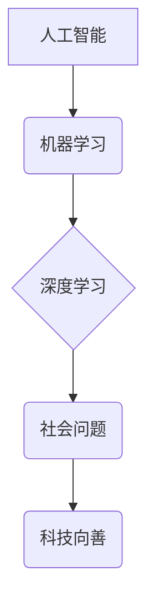

                 

## 科技向善：用科技的力量解决社会难题

> 关键词：人工智能、机器学习、深度学习、社会问题、可持续发展、伦理

### 1. 背景介绍

人类社会正处于前所未有的变革时期，科技发展日新月异，人工智能、机器学习、深度学习等新兴技术蓬勃发展，为解决社会难题提供了前所未有的机遇。然而，科技发展也带来了新的挑战，例如数据隐私、算法偏见、就业失衡等。如何在科技发展与社会进步之间找到平衡点，让科技真正为人类福祉服务，是摆在我们面前的重大课题。

本文将探讨如何利用科技的力量解决社会难题，并分析相关技术原理、应用场景以及未来发展趋势。

### 2. 核心概念与联系

**2.1  人工智能 (AI)**

人工智能是指模拟人类智能行为的计算机系统。它涵盖了广泛的领域，包括机器学习、自然语言处理、计算机视觉等。

**2.2  机器学习 (ML)**

机器学习是人工智能的一个子领域，它使计算机能够从数据中学习，并根据学习到的知识进行预测或决策。机器学习算法可以分为监督学习、无监督学习和强化学习三大类。

**2.3  深度学习 (DL)**

深度学习是机器学习的一个子领域，它使用多层神经网络来模拟人类大脑的学习过程。深度学习算法能够处理海量数据，并提取出复杂的特征，在图像识别、语音识别、自然语言处理等领域取得了突破性进展。

**2.4  社会问题**

社会问题是指影响社会稳定、发展和福祉的各种问题，例如贫困、疾病、环境污染、教育不平等等。

**2.5  科技向善**

科技向善是指利用科技的力量解决社会问题，促进人类社会进步和福祉。

**2.6  核心概念联系**

人工智能、机器学习和深度学习等新兴技术为解决社会问题提供了强大的工具。通过收集和分析海量数据，这些技术能够识别社会问题的根源，并提出有效的解决方案。



### 3. 核心算法原理 & 具体操作步骤

**3.1  算法原理概述**

本文将重点介绍机器学习算法中的**支持向量机 (SVM)**，它是一种用于分类和回归的监督学习算法。SVM的目标是找到一个最佳的分隔超平面，将数据点分成不同的类别。

**3.2  算法步骤详解**

1. **数据预处理:** 将原始数据进行清洗、转换和特征工程，使其适合SVM算法的训练。

2. **核函数选择:** 选择合适的核函数，将数据映射到高维空间，以便找到更优的分隔超平面。常见的核函数包括线性核、多项式核、径向基函数核等。

3. **参数优化:** 通过优化算法，例如SMO算法，找到最佳的超平面参数，使得分类效果最佳。

4. **模型训练:** 使用训练数据训练SVM模型，学习数据中的模式和规律。

5. **模型评估:** 使用测试数据评估模型的性能，例如准确率、召回率、F1-score等。

6. **模型预测:** 将训练好的模型应用于新的数据，进行分类或回归预测。

**3.3  算法优缺点**

**优点:**

* 能够处理高维数据。
* 对非线性数据具有较好的分类能力。
* 具有较好的泛化能力。

**缺点:**

* 训练时间较长，尤其是在数据量较大时。
* 参数选择较为复杂，需要经验和技巧。
* 对数据噪声较为敏感。

**3.4  算法应用领域**

SVM算法广泛应用于图像识别、文本分类、语音识别、生物信息学等领域。

### 4. 数学模型和公式 & 详细讲解 & 举例说明

**4.1  数学模型构建**

SVM的目标是找到一个最佳的分隔超平面，将数据点分成不同的类别。假设数据集中有两种类别，分别为正类和负类，每个数据点可以用一个向量表示，例如：

* 正类数据点：x1, x2, ..., xn
* 负类数据点：y1, y2, ..., yn

其中，xi和yi分别代表第i个正类和负类数据点的特征向量。

**4.2  公式推导过程**

SVM的目标函数是：

$$
min_{w,b} \frac{1}{2} ||w||^2 + C \sum_{i=1}^{m} \xi_i
$$

其中：

* w是超平面的法向量。
* b是超平面的截距。
* C是惩罚参数，用于控制模型的复杂度。
* $\xi_i$是松弛变量，用于容忍分类错误。

**4.3  案例分析与讲解**

假设我们有一个二分类问题，需要将数据点分成“猫”和“狗”两类。我们可以使用SVM算法训练一个模型，将数据点分成不同的类别。

**举例说明:**

* 数据集：包含猫和狗的图像数据。
* 特征向量：图像像素值。
* 核函数：径向基函数核。
* 参数优化：使用SMO算法优化超平面参数。

经过训练，SVM模型能够将新的图像数据分类为“猫”或“狗”。

### 5. 项目实践：代码实例和详细解释说明

**5.1  开发环境搭建**

* Python 3.x
* scikit-learn库

**5.2  源代码详细实现**

```python
from sklearn import svm
from sklearn.model_selection import train_test_split
from sklearn.metrics import accuracy_score

# 加载数据
X = ... # 特征数据
y = ... # 标签数据

# 将数据分成训练集和测试集
X_train, X_test, y_train, y_test = train_test_split(X, y, test_size=0.2, random_state=42)

# 创建SVM模型
clf = svm.SVC(kernel='rbf')

# 训练模型
clf.fit(X_train, y_train)

# 预测测试集数据
y_pred = clf.predict(X_test)

# 计算模型准确率
accuracy = accuracy_score(y_test, y_pred)
print('模型准确率:', accuracy)
```

**5.3  代码解读与分析**

* `train_test_split()`函数将数据分成训练集和测试集。
* `SVC()`函数创建SVM模型，`kernel='rbf'`指定使用径向基函数核。
* `fit()`函数训练模型。
* `predict()`函数预测测试集数据。
* `accuracy_score()`函数计算模型准确率。

**5.4  运行结果展示**

运行代码后，会输出模型的准确率。

### 6. 实际应用场景

**6.1  医疗诊断**

SVM算法可以用于分析医学图像，例如X光片、CT扫描、MRI扫描等，辅助医生诊断疾病。

**6.2  金融风险评估**

SVM算法可以用于分析金融数据，例如股票价格、交易量、市场指数等，评估金融风险。

**6.3  精准营销**

SVM算法可以用于分析客户数据，例如购买历史、浏览记录、兴趣爱好等，进行精准营销。

**6.4  未来应用展望**

随着人工智能技术的不断发展，SVM算法将在更多领域得到应用，例如自动驾驶、机器人、个性化教育等。

### 7. 工具和资源推荐

**7.1  学习资源推荐**

* **书籍:**
    * 《机器学习》 - 周志华
    * 《深入理解机器学习》 -  李航
* **在线课程:**
    * Coursera: Machine Learning
    * edX: Artificial Intelligence

**7.2  开发工具推荐**

* **Python:** 
    * scikit-learn
    * TensorFlow
    * PyTorch

**7.3  相关论文推荐**

* **Support Vector Machines** - Vapnik, V. N. (1995)
* **A Tutorial on Support Vector Machines for Pattern Recognition** - Cristianini, N., & Shawe-Taylor, J. (2000)

### 8. 总结：未来发展趋势与挑战

**8.1  研究成果总结**

本文探讨了如何利用科技力量解决社会难题，并介绍了SVM算法的原理、应用场景以及未来发展趋势。

**8.2  未来发展趋势**

* **算法效率提升:** 研究更有效的机器学习算法，提高算法训练速度和预测精度。
* **数据安全保障:** 加强数据隐私保护，确保数据安全和可信。
* **伦理规范建设:** 制定人工智能伦理规范，避免算法偏见和歧视。

**8.3  面临的挑战**

* **数据获取和标注:** 高质量的数据是机器学习算法训练的基础，获取和标注海量数据是一个挑战。
* **算法解释性:** 许多机器学习算法是黑箱模型，难以解释其决策过程，这限制了算法的应用和信任度。
* **社会影响评估:** 需要评估人工智能技术的社会影响，并制定相应的政策和措施。

**8.4  研究展望**

未来，人工智能技术将继续发展，为解决社会难题提供更强大的工具。我们需要加强基础研究，提升算法效率和解释性，并关注人工智能技术的伦理和社会影响，确保科技向善，造福人类。

### 9. 附录：常见问题与解答

**9.1  SVM算法为什么能够处理高维数据？**

SVM算法使用核函数将数据映射到高维空间，即使数据维度很高，也能找到一个有效的分隔超平面。

**9.2  如何选择合适的核函数？**

核函数的选择取决于数据的特性和任务类型。常见的核函数包括线性核、多项式核、径向基函数核等。

**9.3  SVM算法对数据噪声敏感吗？**

是的，SVM算法对数据噪声较为敏感。可以使用正则化技术来缓解这个问题。


作者：禅与计算机程序设计艺术 / Zen and the Art of Computer Programming 
<end_of_turn>

