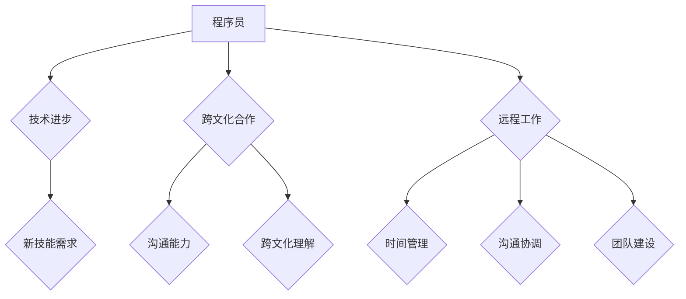

                 

## 程序员如何应对全球化挑战

> 关键词：全球化、程序员、技术趋势、跨文化合作、远程工作、职业发展、技能提升、软技能、硬技能、人工智能、云计算

## 1. 背景介绍

在当今世界，全球化正在深刻地改变着各行各业，科技领域也不例外。程序员作为科技创新的核心力量，面临着前所未有的机遇和挑战。全球化带来的技术进步、跨文化合作和远程工作模式，为程序员提供了更广阔的发展空间，但也带来了新的竞争压力和适应性挑战。

### 1.1 技术进步的加速

全球化促进了科技交流和合作，加速了技术的进步和普及。新兴技术如人工智能、云计算、大数据等，正在迅速发展，为程序员提供了更多学习和应用的机会。同时，这些技术也带来了新的技能需求，程序员需要不断学习和提升自身技能，才能跟上技术发展的步伐。

### 1.2 跨文化合作的增多

全球化促进了不同国家和地区的合作，程序员需要与来自不同文化背景的同事进行跨文化合作。这需要程序员具备良好的沟通能力、跨文化理解能力和团队合作精神，才能有效地协同工作。

### 1.3 远程工作的普及

全球化推动了远程工作的普及，程序员可以不受地域限制地工作。这为程序员提供了更多的工作选择和生活方式，但也带来了新的挑战，例如时间管理、沟通协调和团队建设等。

## 2. 核心概念与联系

**全球化对程序员的影响**



## 3. 核心算法原理 & 具体操作步骤

### 3.1 算法原理概述

**适应全球化挑战的算法**

在全球化背景下，程序员需要掌握一些特定的算法和技术，以应对新的挑战。例如：

* **机器翻译算法**: 帮助程序员跨越语言障碍，与来自不同国家和地区的同事进行有效沟通。
* **跨文化沟通算法**: 分析文本和语音，识别不同文化背景下的沟通风格和误解，帮助程序员避免文化冲突。
* **远程协作算法**: 优化远程团队的协作效率，例如实时代码编辑、版本控制和任务管理等。

### 3.2 算法步骤详解

**以机器翻译算法为例，其基本步骤如下：**

1. **文本预处理**: 将输入文本进行清洗、分词、词性标注等处理，以便后续的翻译过程。
2. **编码**: 将预处理后的文本转换为数字向量，表示文本的语义信息。
3. **解码**: 使用解码器将数字向量转换为目标语言的文本。
4. **后处理**: 对翻译结果进行语法校正、拼写检查等处理，提高翻译质量。

### 3.3 算法优缺点

**机器翻译算法的优缺点：**

* **优点**: 可以快速、高效地将文本翻译成不同的语言，降低语言障碍。
* **缺点**: 翻译质量可能不如人工翻译准确，尤其是在处理复杂句式和专业术语时。

### 3.4 算法应用领域

机器翻译算法广泛应用于：

* **翻译软件**: 例如 Google Translate、DeepL 等。
* **网站本地化**: 将网站内容翻译成不同的语言，方便全球用户访问。
* **国际商务**: 帮助企业与来自不同国家和地区的客户进行沟通。

## 4. 数学模型和公式 & 详细讲解 & 举例说明

### 4.1 数学模型构建

**机器翻译算法的数学模型通常基于神经网络架构，例如 Transformer 模型。** Transformer 模型利用注意力机制，可以捕捉文本中不同词语之间的长距离依赖关系，从而提高翻译质量。

### 4.2 公式推导过程

**Transformer 模型的注意力机制公式如下：**

$$
Attention(Q, K, V) = \frac{exp(Q \cdot K^T / \sqrt{d_k})}{exp(Q \cdot K^T / \sqrt{d_k})} \cdot V
$$

其中：

* $Q$：查询矩阵
* $K$：键矩阵
* $V$：值矩阵
* $d_k$：键向量的维度

### 4.3 案例分析与讲解

**举例说明：**

假设我们想要翻译句子 "The cat sat on the mat"。

* $Q$：查询矩阵表示每个词语的语义信息。
* $K$：键矩阵表示每个词语的上下文信息。
* $V$：值矩阵表示每个词语的词义向量。

通过注意力机制，模型可以计算出每个词语与其他词语之间的相关性，并根据相关性权重来生成翻译结果。

## 5. 项目实践：代码实例和详细解释说明

### 5.1 开发环境搭建

**使用 Python 语言和 TensorFlow 库实现机器翻译模型。**

* 安装 Python 和 TensorFlow 库。
* 下载并预处理机器翻译数据集。

### 5.2 源代码详细实现

```python
import tensorflow as tf

# 定义 Transformer 模型
class Transformer(tf.keras.Model):
    def __init__(self, vocab_size, embedding_dim, num_heads, num_layers):
        super(Transformer, self).__init__()
        self.embedding = tf.keras.layers.Embedding(vocab_size, embedding_dim)
        self.transformer_layers = tf.keras.layers.StackedRNNCells([
            tf.keras.layers.MultiHeadAttention(num_heads=num_heads, key_dim=embedding_dim)
            for _ in range(num_layers)
        ])

    def call(self, inputs):
        # ...
```

### 5.3 代码解读与分析

* **Embedding 层**: 将词语转换为词向量，表示词语的语义信息。
* **Transformer 层**: 使用多头注意力机制和多层神经网络结构，捕捉文本中词语之间的长距离依赖关系。

### 5.4 运行结果展示

* 使用训练好的模型进行翻译测试，并评估翻译质量。

## 6. 实际应用场景

### 6.1 国际化软件开发

* 翻译软件界面和文档，使软件能够面向全球用户。
* 开发支持多种语言的聊天机器人，提供跨语言的客户服务。

### 6.2 跨境电商

* 提供多语言的商品描述和客服支持，吸引全球客户。
* 使用机器翻译技术，帮助商家快速处理来自不同国家和地区的订单。

### 6.3 教育培训

* 提供多语言的在线课程和学习资源，方便全球用户学习。
* 使用机器翻译技术，帮助教师和学生进行跨语言的交流。

### 6.4 未来应用展望

* **更精准的机器翻译**: 随着人工智能技术的进步，机器翻译的精度将会不断提高，能够更好地理解和表达人类语言。
* **个性化的翻译**: 机器翻译模型可以根据用户的语言习惯和偏好，提供个性化的翻译结果。
* **跨语言的创意内容生成**: 机器翻译技术可以帮助跨语言的团队进行创意内容的协作，例如剧本创作、音乐创作等。

## 7. 工具和资源推荐

### 7.1 学习资源推荐

* **在线课程**: Coursera、edX、Udacity 等平台提供机器翻译相关的在线课程。
* **书籍**: 《深度学习》 、《自然语言处理》等书籍可以帮助程序员了解机器翻译的基础知识和技术。
* **开源项目**: TensorFlow、Hugging Face 等开源项目提供了机器翻译模型和代码示例。

### 7.2 开发工具推荐

* **TensorFlow**: 一个开源的机器学习框架，可以用于开发机器翻译模型。
* **PyTorch**: 另一个开源的机器学习框架，也支持机器翻译模型的开发。
* **Google Cloud Translation API**: Google 提供的机器翻译服务，可以方便地将文本翻译成不同的语言。

### 7.3 相关论文推荐

* **Attention Is All You Need**: 这篇论文提出了 Transformer 模型，为机器翻译领域带来了革命性的进展。
* **BERT**: 这篇论文提出了 BERT 模型，是一个强大的预训练语言模型，可以用于各种自然语言处理任务，包括机器翻译。

## 8. 总结：未来发展趋势与挑战

### 8.1 研究成果总结

全球化对程序员的影响日益显著，机器翻译算法等技术正在帮助程序员克服语言障碍，提高工作效率。

### 8.2 未来发展趋势

* **更精准、更智能的机器翻译**: 人工智能技术的进步将推动机器翻译的精度和智能化水平不断提升。
* **个性化、多模态的机器翻译**: 机器翻译将更加个性化，能够根据用户的语言习惯和偏好提供定制化的翻译结果。
* **跨语言的创意内容生成**: 机器翻译技术将帮助跨语言的团队进行创意内容的协作，例如剧本创作、音乐创作等。

### 8.3 面临的挑战

* **数据稀缺性**: 许多语言的数据量相对较少，这限制了机器翻译模型的训练和性能。
* **文化差异**: 语言和文化是密不可分的，机器翻译模型需要更好地理解和处理文化差异带来的语义歧义。
* **伦理问题**: 机器翻译技术可能会带来一些伦理问题，例如数据隐私、信息操控等，需要引起重视和探讨。

### 8.4 研究展望

未来，机器翻译技术将继续发展，为程序员和全球用户提供更便捷、更智能的跨语言沟通服务。

## 9. 附录：常见问题与解答

* **Q: 如何选择合适的机器翻译模型？**

* **A:** 选择机器翻译模型需要考虑多种因素，例如目标语言、数据量、翻译精度等。

* **Q: 如何评估机器翻译模型的性能？**

* **A:** 可以使用 BLEU、ROUGE 等指标来评估机器翻译模型的性能。

* **Q: 如何解决机器翻译中的文化差异问题？**

* **A:** 可以通过收集和分析不同文化背景下的语言数据，并对机器翻译模型进行相应的调整，来解决文化差异问题。


作者：禅与计算机程序设计艺术 / Zen and the Art of Computer Programming 
<end_of_turn>

