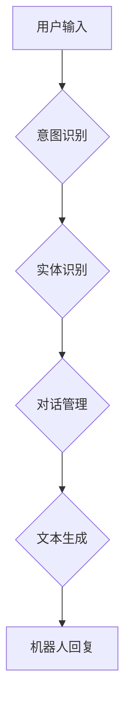

                 

## 聊天机器人开发：对话AI 入门

> 关键词：聊天机器人、对话AI、自然语言处理、深度学习、Transformer、BERT、GPT、对话流、意图识别、实体识别、文本生成

### 1. 背景介绍

近年来，人工智能技术取得了飞速发展，其中对话AI作为人工智能的重要分支，备受关注。聊天机器人作为对话AI的典型应用，已广泛应用于客服、教育、娱乐等领域，为人们的生活带来了便利。

随着人们对智能交互的需求不断增长，聊天机器人的发展也日益成熟。从早期的基于规则的聊天机器人到如今的基于深度学习的对话AI，技术不断迭代升级，性能不断提升。

### 2. 核心概念与联系

#### 2.1 自然语言处理 (NLP)

自然语言处理 (NLP) 是人工智能领域的一个重要分支，旨在使计算机能够理解、处理和生成人类语言。

#### 2.2 对话系统

对话系统是指能够与人类进行自然语言交互的计算机系统。它通常由以下几个核心模块组成：

* **意图识别:** 识别用户表达的意图，例如查询信息、预订服务、进行投诉等。
* **实体识别:** 从用户输入中识别出关键信息，例如日期、时间、地点、产品名称等。
* **对话管理:** 控制对话流程，根据用户意图和上下文进行相应的回复。
* **文本生成:** 生成自然流畅的文本回复，满足用户需求。

#### 2.3 深度学习

深度学习是一种机器学习的子领域，利用多层神经网络来学习数据特征。在对话AI领域，深度学习被广泛应用于意图识别、实体识别和文本生成等任务。

**Mermaid 流程图**



### 3. 核心算法原理 & 具体操作步骤

#### 3.1 算法原理概述

在聊天机器人开发中，常用的算法包括：

* **机器学习算法:** 

例如支持向量机 (SVM)、决策树、随机森林等，用于意图识别和实体识别。

* **深度学习算法:** 

例如循环神经网络 (RNN)、长短期记忆网络 (LSTM)、Transformer等，用于文本生成和对话管理。

#### 3.2 算法步骤详解

**以意图识别为例，详细说明其算法步骤:**

1. **数据预处理:** 将用户输入文本进行清洗、分词、词性标注等预处理操作，以便模型能够理解和处理文本信息。
2. **特征提取:** 从预处理后的文本中提取特征，例如词频、词向量、语法结构等，这些特征能够反映文本的语义信息。
3. **模型训练:** 使用机器学习或深度学习算法对训练数据进行训练，学习文本特征与意图之间的映射关系。
4. **模型评估:** 使用测试数据对训练好的模型进行评估，例如计算准确率、召回率等指标，评估模型的性能。
5. **模型部署:** 将训练好的模型部署到聊天机器人系统中，用于识别用户输入的意图。

#### 3.3 算法优缺点

**机器学习算法:**

* **优点:** 

易于理解和实现，对数据要求不高。

* **缺点:** 

难以捕捉文本的复杂语义关系，泛化能力较弱。

**深度学习算法:**

* **优点:** 

能够捕捉文本的复杂语义关系，泛化能力强。
* **缺点:** 

训练数据量大，计算资源消耗高，模型解释性较差。

#### 3.4 算法应用领域

* **意图识别:** 识别用户表达的意图，例如查询信息、预订服务、进行投诉等。
* **实体识别:** 从用户输入中识别出关键信息，例如日期、时间、地点、产品名称等。
* **文本生成:** 生成自然流畅的文本回复，满足用户需求。
* **对话管理:** 控制对话流程，根据用户意图和上下文进行相应的回复。

### 4. 数学模型和公式 & 详细讲解 & 举例说明

#### 4.1 数学模型构建

在深度学习模型中，常用的数学模型包括：

* **神经网络:** 由多个层级的神经元组成，每个神经元接收输入信号，进行计算，并输出信号。
* **激活函数:** 用于引入非线性，使神经网络能够学习复杂的映射关系。常见的激活函数包括 sigmoid、tanh、ReLU等。
* **损失函数:** 用于衡量模型预测结果与真实值的差距，引导模型学习。常见的损失函数包括交叉熵损失、均方误差等。

#### 4.2 公式推导过程

**以交叉熵损失函数为例，详细说明其推导过程:**

假设模型预测的概率分布为 $p(y|x)$, 真实标签为 $y$, 则交叉熵损失函数定义为:

$$
L(p(y|x), y) = - \sum_{y} y \log p(y|x)
$$

其中，$y$ 代表真实标签，$p(y|x)$ 代表模型预测的概率。

#### 4.3 案例分析与讲解

**以BERT模型为例，分析其数学模型和公式:**

BERT (Bidirectional Encoder Representations from Transformers) 是一种基于Transformer架构的预训练语言模型。其数学模型包括：

* **Transformer编码器:** 由多个编码器层组成，每个编码器层包含多头自注意力机制和前馈神经网络。
* **多头自注意力机制:** 用于捕捉文本序列中词语之间的依赖关系。
* **前馈神经网络:** 用于对编码器输出进行非线性变换。

BERT模型通过在大量的文本数据上进行预训练，学习到丰富的语言表示，可以用于各种自然语言处理任务，例如意图识别、实体识别、文本生成等。

### 5. 项目实践：代码实例和详细解释说明

#### 5.1 开发环境搭建

* **操作系统:** Linux、macOS 或 Windows
* **编程语言:** Python
* **深度学习框架:** TensorFlow 或 PyTorch
* **其他工具:** Git、虚拟环境管理工具

#### 5.2 源代码详细实现

以下是一个简单的基于规则的聊天机器人代码示例，使用Python语言实现:

```python
# 聊天机器人示例代码

# 定义对话规则
rules = {
    "你好": ["你好！", "嗨！"],
    "今天天气怎么样": ["今天天气很好！", "今天天气不错！"],
    "再见": ["再见！", "下次再见！"],
}

# 获取用户输入
user_input = input("您想说什么？: ")

# 根据规则匹配用户输入
for pattern, responses in rules.items():
    if pattern in user_input:
        # 选择一个随机回复
        response = random.choice(responses)
        print(response)
        break
else:
    # 如果没有匹配的规则，则给出默认回复
    print("对不起，我不明白您的意思。")
```

#### 5.3 代码解读与分析

* **定义对话规则:** 使用字典 `rules` 来存储对话规则，其中键为用户输入的模式，值是一个包含可能的回复的列表。
* **获取用户输入:** 使用 `input()` 函数获取用户的输入。
* **匹配规则:** 遍历 `rules` 字典，检查用户输入是否包含规则中的模式。
* **选择回复:** 如果匹配到规则，则随机选择一个回复并打印出来。
* **默认回复:** 如果没有匹配到规则，则给出默认回复。

#### 5.4 运行结果展示

```
您想说什么？: 你好
嗨！

您想说什么？: 今天天气怎么样
今天天气很好！

您想说什么？: 再见
下次再见！

您想说什么？: 我想吃苹果
对不起，我不明白您的意思。
```

### 6. 实际应用场景

#### 6.1 客服机器人

聊天机器人可以用于处理客户咨询、订单查询、售后服务等，提高客服效率，降低人工成本。

#### 6.2 教育机器人

聊天机器人可以用于提供个性化学习辅导、答疑解惑、模拟考试等，帮助学生提高学习效率。

#### 6.3 娱乐机器人

聊天机器人可以用于进行聊天、游戏、 storytelling 等，为用户提供娱乐体验。

#### 6.4 其他应用场景

* 医疗保健
* 金融服务
* 人力资源
* 政府服务

### 7. 工具和资源推荐

#### 7.1 学习资源推荐

* **书籍:**

《深度学习》 (Ian Goodfellow, Yoshua Bengio, Aaron Courville)
《自然语言处理》 (Jurafsky, Martin)

* **在线课程:**

Coursera、edX、Udacity 等平台提供丰富的自然语言处理和深度学习课程。

#### 7.2 开发工具推荐

* **深度学习框架:** TensorFlow、PyTorch、Keras 等
* **NLP 工具库:** NLTK、spaCy、Gensim 等
* **对话平台:** Dialogflow、Rasa、Botpress 等

#### 7.3 相关论文推荐

* **BERT:** Devlin, J., Chang, M. W., Lee, K., & Toutanova, K. (2018). BERT: Pre-training of deep bidirectional transformers for language understanding. arXiv preprint arXiv:1810.04805.
* **GPT:** Radford, A., Wu, J., Child, R., Luan, D., Amodei, D., & Sutskever, I. (2019). Language models are few-shot learners. OpenAI blog.
* **Transformer:** Vaswani, A., Shazeer, N., Parmar, N., Uszkoreit, J., Jones, L., Gomez, A. N., ... & Polosukhin, I. (2017). Attention is all you need. In Advances in neural information processing systems (pp. 5998-6008).

### 8. 总结：未来发展趋势与挑战

#### 8.1 研究成果总结

近年来，对话AI技术取得了显著进展，特别是深度学习技术的应用，使得聊天机器人能够更好地理解和生成自然语言。

#### 8.2 未来发展趋势

* **更自然流畅的对话:** 未来聊天机器人将更加注重对话的自然流畅性，能够更好地理解用户的意图和上下文，提供更人性化的交互体验。
* **更智能的知识推理:** 聊天机器人将具备更强的知识推理能力，能够理解用户的复杂问题，并提供更准确、更全面的答案。
* **更个性化的服务:** 聊天机器人将能够根据用户的个人喜好和需求，提供更个性化的服务。
* **多模态交互:** 未来聊天机器人将支持多模态交互，例如文本、语音、图像等，提供更丰富的交互体验。

#### 8.3 面临的挑战

* **数据标注:** 训练高质量的对话AI模型需要大量的标注数据，数据标注成本高，效率低。
* **模型解释性:** 深度学习模型的内部机制复杂，难以解释模型的决策过程，这使得模型的可信度和安全性受到质疑。
* **伦理问题:** 聊天机器人可能会被用于传播虚假信息、进行欺诈等恶意活动，需要考虑其伦理问题。

#### 8.4 研究展望

未来对话AI研究将继续探索以下方向:

* **无监督学习:** 探索无需人工标注数据即可训练对话AI模型的方法。
* **可解释性:** 研究如何提高深度学习模型的解释性，使得模型的决策过程更加透明。
* **伦理规范:** 制定对话AI的伦理规范，确保其安全、可靠、可信的使用。

### 9. 附录：常见问题与解答

#### 9.1 如何选择合适的深度学习框架?

TensorFlow 和 PyTorch 是目前最流行的深度学习框架，选择哪个框架取决于个人喜好和项目需求。

* **TensorFlow:** 

更适合于生产环境部署，拥有更完善的生态系统和工具支持。

* **PyTorch:** 

更灵活易用，更适合于科研和快速原型开发。

#### 9.2 如何训练一个高质量的对话AI模型?

训练高质量的对话AI模型需要以下步骤:

* **数据收集:** 收集大量高质量的对话数据。
* **数据预处理:** 对对话数据进行清洗、分词、词性标注等预处理操作。
* **模型选择:** 选择合适的深度学习模型架构。
* **模型训练:** 使用训练数据训练模型，并进行调参优化。
* **模型评估:** 使用测试数据评估模型性能，并进行迭代改进。

#### 9.3 如何部署对话AI模型?

对话AI模型可以部署到各种平台，例如云服务器、移动设备、嵌入式设备等。

* **云服务器:** 使用云平台提供的服务，例如AWS Lambda、Google Cloud Functions 等，部署对话AI模型。
* **移动设备:** 将对话AI模型打包成应用程序，安装到移动设备上。
* **嵌入式设备:** 将对话AI模型压缩到嵌入式设备上，实现离线对话。


作者：禅与计算机程序设计艺术 / Zen and the Art of Computer Programming 
<end_of_turn>

