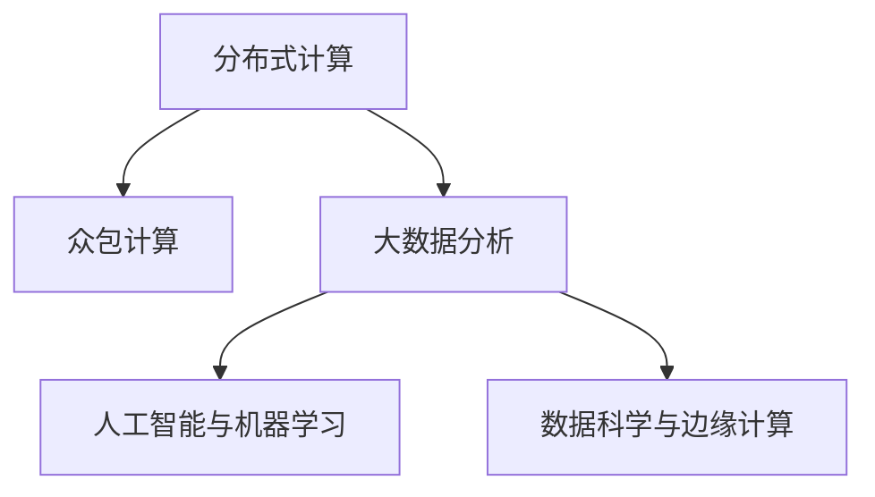

                 

# 人类计算：释放集体智慧的力量

> 关键词：人类计算, 集体智慧, 分布式系统, 众包, 大数据, 人工智能, 机器学习, 数据科学, 边缘计算

## 1. 背景介绍

### 1.1 问题由来

随着计算技术的飞速发展，人类计算的概念日渐深入人心。从个人计算机的普及，到云计算和云服务的广泛应用，再到区块链、边缘计算等前沿技术的兴起，计算能力已经深深融入了我们的日常生活和工作。然而，单靠个人计算机的力量显然已无法满足复杂计算的需求，尤其是涉及大规模数据处理和智能分析的任务。

与此同时，全球范围内正面临着各种复杂挑战，如气候变化、能源危机、疾病防治等，这些问题需要跨学科、跨领域的集体智慧来共同应对。在这一背景下，如何充分发挥计算技术的潜力，释放集体智慧的力量，成为了当前研究的热点和趋势。

### 1.2 问题核心关键点

人类计算的核心在于利用全球的计算资源和智慧，通过分布式系统、众包计算、大数据分析等手段，实现大规模计算任务的高效处理和智能决策。其关键点包括：

1. **分布式计算**：通过网络将多个计算机或计算资源联结起来，形成分布式计算系统，协同完成复杂计算任务。
2. **众包计算**：利用大量的非专业劳动力，通过众包平台进行计算和数据标注，以低成本高效完成大规模计算任务。
3. **大数据分析**：通过分析海量数据，提取有价值的信息和知识，为决策提供依据。
4. **人工智能与机器学习**：利用机器学习算法，进行模式识别、图像处理、自然语言处理等智能任务。
5. **数据科学与边缘计算**：在数据科学的基础上，利用边缘计算技术，将计算任务分布到边缘节点，减少数据传输和网络延迟。

### 1.3 问题研究意义

研究人类计算的原理与实践，对于推动计算技术的发展，提升决策效率和智能化水平，具有重要意义：

1. **提升计算能力**：通过分布式系统和众包计算，大幅提升计算资源的使用效率，降低计算成本。
2. **促进数据共享**：大数据分析需要海量数据支持，而人类计算可以将全球数据资源高效整合，促进数据共享和知识传播。
3. **加速创新应用**：人工智能和机器学习技术可以快速处理和分析大量数据，加速新应用的开发和部署。
4. **增强决策支持**：通过智能分析和数据挖掘，提供高质量的决策支持，提升决策的科学性和准确性。
5. **优化资源配置**：利用边缘计算技术，优化资源配置，提高系统的响应速度和可靠性。

## 2. 核心概念与联系

### 2.1 核心概念概述

为更好地理解人类计算的原理，本节将介绍几个关键概念：

- **分布式计算**：指将大规模计算任务分解成若干子任务，分配给多个计算机或节点并行计算。典型的分布式计算系统包括Apache Hadoop、Spark等。
- **众包计算**：通过众包平台，将计算任务分配给全球范围内的非专业劳动力，降低计算成本，提高计算效率。代表平台有Amazon Mechanical Turk、CrowdFlower等。
- **大数据分析**：涉及数据的收集、存储、处理和分析，旨在从大量数据中提取有价值的信息和知识。经典的大数据处理框架包括Hadoop、Spark、Flink等。
- **人工智能与机器学习**：通过训练数据模型，使计算机具备理解和处理复杂问题的能力。包括监督学习、无监督学习、强化学习等方法。
- **数据科学与边缘计算**：结合数据科学和计算技术，优化资源配置，提高系统的实时性和可靠性。边缘计算技术能够将计算任务分配到靠近数据源的设备上，减少延迟和带宽需求。

这些核心概念之间的逻辑关系可以通过以下Mermaid流程图来展示：



这个流程图展示了人类计算的关键组件和其相互关系：

1. 分布式计算是大规模任务的基础设施。
2. 众包计算提供低成本高效的任务分发渠道。
3. 大数据分析是提取知识的核心工具。
4. 人工智能与机器学习提供智能决策的能力。
5. 数据科学与边缘计算优化资源配置。

这些概念共同构成了人类计算的完整体系，使得我们可以高效、智能地处理大规模计算任务。

## 3. 核心算法原理 & 具体操作步骤
### 3.1 算法原理概述

人类计算的核心算法原理可以概括为以下几个方面：

1. **任务分解与调度**：将大规模计算任务分解为若干子任务，并根据任务的优先级和资源需求进行调度。
2. **任务分发与执行**：通过网络将任务分发给多个节点执行，每个节点独立处理其分配的任务。
3. **数据采集与整合**：从不同的数据源采集数据，并利用大数据分析技术进行整合和处理。
4. **模型训练与优化**：利用人工智能和机器学习算法，训练模型并进行优化，提升模型性能。
5. **实时计算与反馈**：通过边缘计算技术，将计算任务分布在靠近数据源的节点上，实现实时计算和反馈。

### 3.2 算法步骤详解

以下是人类计算的主要操作步骤：

**Step 1: 任务分解与调度**
- 定义计算任务的目标和要求，如数据处理、图像识别、自然语言处理等。
- 将任务分解为若干子任务，根据任务复杂度和资源需求进行调度。
- 选择合适的计算资源，如分布式系统、众包平台等。

**Step 2: 任务分发与执行**
- 将任务分发到多个节点执行，确保每个节点独立处理其分配的任务。
- 实时监控节点执行情况，根据资源和任务状态进行调整。
- 合并各节点的计算结果，形成最终输出。

**Step 3: 数据采集与整合**
- 从不同来源采集数据，如传感器数据、互联网数据、公共数据集等。
- 利用大数据分析技术进行数据清洗、归一化和处理。
- 整合处理后的数据，进行特征提取和模型训练。

**Step 4: 模型训练与优化**
- 选择合适的机器学习算法，进行模型训练和优化。
- 利用大规模数据集进行模型训练，提升模型的准确性和泛化能力。
- 通过交叉验证、超参数调整等方法，优化模型性能。

**Step 5: 实时计算与反馈**
- 利用边缘计算技术，将计算任务分配到靠近数据源的节点上，减少延迟和带宽需求。
- 实时监控计算过程，及时调整计算资源和任务分配。
- 根据计算结果进行反馈，调整后续计算任务。

### 3.3 算法优缺点

人类计算具有以下优点：

1. **高效性**：通过分布式系统和众包计算，大幅提升计算资源的使用效率，降低计算成本。
2. **灵活性**：可以根据任务需求动态调整资源配置，灵活应对各种计算任务。
3. **可扩展性**：系统具有高度的可扩展性，可以根据计算任务需求进行弹性扩展。
4. **数据共享**：通过大数据分析技术，可以高效整合全球数据资源，促进数据共享和知识传播。
5. **智能决策**：利用人工智能和机器学习技术，进行智能决策和分析，提升决策的科学性和准确性。

同时，该方法也存在一些缺点：

1. **复杂性**：系统设计和实现复杂，需要跨学科的合作和知识。
2. **安全性**：数据和计算任务分散在多个节点上，容易受到攻击和破坏。
3. **可靠性**：节点故障或网络延迟可能导致计算结果不准确或延迟。
4. **隐私问题**：数据隐私和安全保护需要特别关注，避免数据泄露和滥用。

尽管存在这些局限性，但人类计算以其高效、智能和灵活的特点，正在成为解决大规模计算问题的有效手段。

### 3.4 算法应用领域

人类计算在众多领域得到了广泛的应用，例如：

- **科学研究**：利用人类计算技术，进行大规模科学数据处理和分析，加速科学发现。
- **医疗健康**：通过分布式计算和机器学习算法，处理和分析医疗数据，支持疾病诊断和治疗。
- **金融分析**：利用大数据和人工智能技术，进行金融市场分析和预测，优化投资策略。
- **交通运输**：通过实时计算和数据分析，优化交通流量管理，提高道路通行效率。
- **环境保护**：利用传感器数据和计算技术，监测和分析环境变化，支持生态保护和气候变化研究。

除了上述这些经典应用外，人类计算还被创新性地应用到更多场景中，如智能城市、智慧农业、智能制造等，为各行各业带来了新的机遇和挑战。

## 4. 数学模型和公式 & 详细讲解 & 举例说明

### 4.1 数学模型构建

为了更好地理解人类计算的数学模型，本节将介绍几个关键数学模型：

1. **分布式计算模型**：通过MapReduce模型，将大规模计算任务分解为Map和Reduce两个阶段，并行计算。
2. **众包计算模型**：利用任务分配和结果汇总的模型，实现任务分发和执行。
3. **大数据分析模型**：利用数据挖掘和机器学习模型，从海量数据中提取知识。
4. **人工智能与机器学习模型**：通过监督学习、无监督学习和强化学习模型，进行模式识别和决策。

### 4.2 公式推导过程

以下我们以分布式计算中的MapReduce模型为例，推导其计算过程。

MapReduce模型由两个主要阶段组成：Map阶段和Reduce阶段。

在Map阶段，将输入数据分割成若干块，并在各个节点上独立处理。假设输入数据为$D=\{d_1, d_2, \ldots, d_n\}$，则Map阶段的具体操作为：

1. 在每个节点上，将数据$d_i$进行分割，得到若干子数据块$d_{i,j}$。
2. 对每个子数据块$d_{i,j}$进行Map操作，生成中间结果$M_{i,j}$。
3. 将所有的中间结果$M_{i,j}$汇总，得到初步聚合结果$M$。

在Reduce阶段，对初步聚合结果$M$进行进一步的聚合和处理。假设初步聚合结果为$M=\{M_1, M_2, \ldots, M_k\}$，则Reduce阶段的具体操作为：

1. 在每个节点上，对初步聚合结果$M_i$进行Reduce操作，生成最终结果$R_i$。
2. 将所有最终结果$R_i$汇总，得到最终的计算结果$R$。

MapReduce模型的计算过程可以用以下伪代码表示：

```python
def map_function(d):
    # 对输入数据d进行处理，生成中间结果m
    m = process_data(d)
    return m

def reduce_function(m):
    # 对中间结果m进行处理，生成最终结果r
    r = process_m(m)
    return r

def mapreduce(D):
    # Map阶段
    m = map(map_function, D)
    # Reduce阶段
    R = reduce(reduce_function, m)
    return R
```

在MapReduce模型中，每个节点独立处理其分配的任务，通过并行计算和数据聚合，实现了大规模计算任务的分布式处理。

### 4.3 案例分析与讲解

下面以一个具体的案例来说明人类计算的应用：

**案例：大规模科学数据处理**

在科学研究中，处理大规模数据集是一项常见的任务。例如，天文学家需要处理大量的天文观测数据，进行天体运动和星体分布的研究。传统的单计算机处理方式效率低下，难以满足需求。利用人类计算技术，可以将数据处理任务分解成多个子任务，分配给多个计算机节点并行处理。

具体步骤如下：

1. **任务分解**：将天文学观测数据分割成若干块，分配给多个节点进行初步处理。
2. **任务分发**：将分割后的数据块分配给不同的节点，独立进行Map操作。
3. **数据整合**：将各节点的初步处理结果进行汇总，得到中间结果。
4. **进一步处理**：对中间结果进行Reduce操作，进行数据聚合和处理。
5. **最终结果**：生成最终的科学数据处理结果，用于支持天体运动和星体分布的研究。

通过利用分布式计算和人类计算技术，天文学家可以高效、灵活地处理大规模天文数据，提升科研效率和成果质量。

## 5. 项目实践：代码实例和详细解释说明

### 5.1 开发环境搭建

在进行人类计算的实践前，我们需要准备好开发环境。以下是使用Python进行PySpark开发的环境配置流程：

1. 安装Anaconda：从官网下载并安装Anaconda，用于创建独立的Python环境。

2. 创建并激活虚拟环境：
```bash
conda create -n pyspark-env python=3.8 
conda activate pyspark-env
```

3. 安装PySpark：根据CUDA版本，从官网获取对应的安装命令。例如：
```bash
conda install pyspark=3.1.1
```

4. 安装各类工具包：
```bash
pip install numpy pandas scikit-learn matplotlib tqdm jupyter notebook ipython
```

完成上述步骤后，即可在`pyspark-env`环境中开始人类计算的实践。

### 5.2 源代码详细实现

这里我们以处理大规模天文学数据为例，给出使用PySpark进行分布式计算的PyTorch代码实现。

首先，定义数据处理函数：

```python
from pyspark.sql import SparkSession
from pyspark.sql.functions import split, map

spark = SparkSession.builder.getOrCreate()

def process_data(df):
    # 将数据分割成若干块，并进行初步处理
    data = df.select("d")
    parts = data.rdd.map(lambda d: (d, map(lambda x: x, d.split(","))))
    return parts
```

然后，定义任务分发与执行函数：

```python
def distribute_data(parts):
    # 将数据块分配给不同的节点进行Map操作
    m = parts.map(map(map_function))
    # 将中间结果汇总，并进行Reduce操作
    r = m.reduce(reduce_function)
    return r
```

最后，启动分布式计算流程：

```python
# 加载数据
df = spark.read.csv("data.csv")

# 分割数据并初步处理
data_parts = process_data(df)

# 分发数据块并执行任务
final_result = distribute_data(data_parts)

# 显示结果
final_result.show()
```

以上就是使用PySpark进行大规模数据处理的完整代码实现。可以看到，利用PySpark的分布式计算框架，我们可以轻松地实现大规模数据的分割和并行处理。

### 5.3 代码解读与分析

让我们再详细解读一下关键代码的实现细节：

**process_data函数**：
- 定义了数据处理函数，接收一个DataFrame作为输入，将其分割成若干块，并进行初步处理。
- 使用`select`方法选择数据列，使用`map`方法进行数据分割和初步处理，返回分割后的数据块。

**distribute_data函数**：
- 定义了任务分发与执行函数，接收分割后的数据块，并将数据块分配给不同的节点进行Map操作。
- 使用`map`方法将数据块并行处理，使用`reduce`方法对中间结果进行Reduce操作，返回最终结果。

**启动分布式计算**：
- 加载数据集，调用`process_data`函数进行数据分割和初步处理。
- 调用`distribute_data`函数分发数据块并执行任务，返回最终结果。
- 使用`show`方法显示最终结果。

可以看到，利用PySpark的分布式计算框架，我们可以高效、灵活地处理大规模数据，实现分布式计算任务。

## 6. 实际应用场景

### 6.1 智能医疗

在医疗领域，人类计算可以用于大规模医疗数据处理和分析，支持疾病诊断和治疗。例如，利用分布式计算和机器学习技术，对全球范围内的医疗数据进行分析和整合，支持流行病学研究、药物开发和个性化治疗。

具体而言，可以收集全球范围内的医疗数据，利用人类计算技术进行数据清洗、归一化和特征提取，构建大规模医疗数据集。然后，利用机器学习算法，训练模型进行疾病预测、治疗方案优化和疗效评估。这些模型可以帮助医生进行疾病诊断和治疗决策，提升医疗服务的智能化水平。

### 6.2 智能交通

在交通领域，人类计算可以用于实时交通流量监测和优化。例如，利用分布式计算和数据挖掘技术，对全球范围内的交通流量数据进行分析和处理，支持智能交通管理和优化。

具体而言，可以收集全球范围内的交通流量数据，利用分布式计算技术进行数据清洗和聚合，构建大规模交通流量数据集。然后，利用数据挖掘算法，挖掘交通流量规律和趋势，预测交通拥堵情况，优化交通流量管理。这些算法可以帮助交通管理部门进行实时交通流量监测和优化，提升道路通行效率和安全性。

### 6.3 智慧城市

在智慧城市领域，人类计算可以用于城市事件监测和应急管理。例如，利用分布式计算和人工智能技术，对全球范围内的城市事件数据进行分析和处理，支持城市应急管理和决策支持。

具体而言，可以收集全球范围内的城市事件数据，利用分布式计算技术进行数据清洗和聚合，构建大规模城市事件数据集。然后，利用人工智能算法，进行城市事件监测和分析，预测城市事件趋势，支持城市应急管理。这些算法可以帮助城市应急管理部门进行实时城市事件监测和应急决策，提升城市管理的智能化水平。

### 6.4 未来应用展望

随着人类计算技术的发展，其在各个领域的应用前景广阔。未来，人类计算技术有望在以下几个方面取得突破：

1. **跨领域集成**：未来人类计算技术将更多地与物联网、边缘计算、区块链等技术结合，构建跨领域的智能系统。
2. **数据融合与共享**：未来人类计算技术将更加注重数据融合和共享，实现全球范围内的数据高效整合。
3. **智能决策支持**：未来人类计算技术将更加注重智能决策支持，提供高质量的决策依据。
4. **实时计算与反馈**：未来人类计算技术将更加注重实时计算和反馈，提升系统的响应速度和可靠性。
5. **安全性与隐私保护**：未来人类计算技术将更加注重数据隐私和安全保护，避免数据泄露和滥用。

## 7. 工具和资源推荐

### 7.1 学习资源推荐

为了帮助开发者系统掌握人类计算的理论基础和实践技巧，这里推荐一些优质的学习资源：

1. 《分布式系统设计与实现》系列书籍：由计算机体系结构专家撰写，详细讲解了分布式系统的设计原理和实现方法。
2. 《大数据技术与应用》课程：国内顶尖高校开设的大数据技术与应用课程，涵盖大数据的基本概念和处理技术。
3. 《人工智能导论》课程：斯坦福大学开设的人工智能导论课程，涵盖机器学习、深度学习等基本概念和算法。
4. 《众包计算：众包与分布式计算》书籍：详细讲解了众包计算和分布式计算的基本原理和应用场景。
5. 《边缘计算与智能系统》书籍：讲解了边缘计算的基本概念和智能系统设计方法。

通过对这些资源的学习实践，相信你一定能够快速掌握人类计算的精髓，并用于解决实际的计算问题。

### 7.2 开发工具推荐

高效的开发离不开优秀的工具支持。以下是几款用于人类计算开发的常用工具：

1. Apache Hadoop：基于MapReduce的分布式计算框架，支持大规模数据处理和分析。
2. Apache Spark：支持分布式计算和流式计算，具有高效的内存计算能力。
3. Apache Flink：支持实时流式计算，具有高吞吐量和低延迟的特点。
4. Apache Storm：支持实时流式计算，具有高可扩展性和高可靠性。
5. Amazon Mechanical Turk：众包计算平台，支持大规模数据标注和计算任务分发。

合理利用这些工具，可以显著提升人类计算任务的开发效率，加快创新迭代的步伐。

### 7.3 相关论文推荐

人类计算的研究源于学界的持续研究。以下是几篇奠基性的相关论文，推荐阅读：

1. "MapReduce: Simplified Data Processing on Large Clusters"（MapReduce：简单的大规模集群数据处理）：MapReduce模型的经典论文，详细讲解了分布式计算的基本原理和实现方法。
2. "BigQuery: A Fault-tolerant Serving Infrastructure"（BigQuery：容错的服务基础设施）：Google推出的云存储平台，支持大规模数据处理和分析。
3. "The Big Data Revolution: Turning Information Into a Strategic Asset"（大数据革命：将信息转化为战略资产）：详细讲解了大数据在商业和科学中的应用。
4. "Human Computation: A Survey"（人类计算：综述）：全面综述了人类计算的基本概念、方法和应用场景。
5. "Human and Machine Collaboration in Crowdsourcing and Social Media"（人类和机器在众包和社交媒体上的协作）：详细讲解了人类计算和社交媒体在数据处理和分析中的应用。

这些论文代表了大数据和人类计算技术的发展脉络。通过学习这些前沿成果，可以帮助研究者把握学科前进方向，激发更多的创新灵感。

## 8. 总结：未来发展趋势与挑战

### 8.1 总结

本文对人类计算的原理与实践进行了全面系统的介绍。首先阐述了人类计算的背景和意义，明确了其在解决大规模计算问题中的独特价值。其次，从原理到实践，详细讲解了人类计算的数学模型和操作步骤，给出了人类计算任务开发的完整代码实例。同时，本文还广泛探讨了人类计算在智能医疗、智能交通、智慧城市等多个领域的应用前景，展示了人类计算技术的巨大潜力。此外，本文精选了人类计算技术的各类学习资源，力求为读者提供全方位的技术指引。

通过本文的系统梳理，可以看到，人类计算技术正在成为解决大规模计算问题的有效手段，其高效、智能和灵活的特点，使得其在各个领域得到了广泛的应用。未来，伴随技术的不断进步和优化，人类计算必将在构建智能系统、提升决策效率和智能化水平方面发挥更大的作用。

### 8.2 未来发展趋势

展望未来，人类计算技术将呈现以下几个发展趋势：

1. **分布式计算的进一步发展**：分布式计算将更加注重跨领域集成和资源共享，构建更为高效的分布式计算系统。
2. **边缘计算的广泛应用**：边缘计算技术将广泛应用于物联网、智能城市等领域，提升系统的实时性和可靠性。
3. **数据融合与共享**：全球范围内的数据融合与共享将更加普及，构建更为全面、准确的数据集。
4. **智能决策支持**：人工智能与人类计算的结合将更加紧密，提升智能决策的科学性和准确性。
5. **实时计算与反馈**：实时计算和反馈技术将得到广泛应用，支持智能系统的实时决策和优化。
6. **安全性与隐私保护**：数据隐私和安全保护将更加注重，确保数据和计算任务的安全性。

以上趋势凸显了人类计算技术的广阔前景。这些方向的探索发展，必将进一步提升计算资源的使用效率，释放全球智慧的潜力，为社会的可持续发展提供新的动力。

### 8.3 面临的挑战

尽管人类计算技术已经取得了瞩目成就，但在迈向更加智能化、普适化应用的过程中，它仍面临着诸多挑战：

1. **计算资源瓶颈**：大规模计算任务对计算资源的需求巨大，如何高效利用全球计算资源，仍然是当前的一个难题。
2. **数据质量问题**：全球数据的质量参差不齐，数据清洗和整合仍然是一个复杂且耗时的过程。
3. **安全性和隐私保护**：数据和计算任务的分散增加了安全性风险，数据隐私和安全保护需要特别关注。
4. **计算成本问题**：大规模计算任务对计算资源的需求巨大，如何降低计算成本，提高资源利用效率，仍然是一个重要的研究方向。

尽管存在这些挑战，但人类计算技术的潜力巨大，相信通过技术创新和协同合作，这些挑战终将得到克服，人类计算必将在构建智能系统、提升决策效率和智能化水平方面发挥更大的作用。

### 8.4 研究展望

面向未来，人类计算技术的研究方向主要集中在以下几个方面：

1. **跨领域集成与融合**：探索人类计算技术与物联网、边缘计算、区块链等技术的结合，构建跨领域的智能系统。
2. **数据融合与共享**：注重数据融合与共享，实现全球范围内的数据高效整合，提升数据质量和利用效率。
3. **智能决策支持**：探索人工智能与人类计算的结合，提升智能决策的科学性和准确性。
4. **实时计算与反馈**：注重实时计算和反馈技术的应用，支持智能系统的实时决策和优化。
5. **安全性与隐私保护**：注重数据隐私和安全保护，确保数据和计算任务的安全性。

这些研究方向将引领人类计算技术迈向更高的台阶，为构建安全、可靠、可解释、可控的智能系统铺平道路。面向未来，人类计算技术还需要与其他人工智能技术进行更深入的融合，如知识表示、因果推理、强化学习等，多路径协同发力，共同推动计算技术的发展和应用。只有勇于创新、敢于突破，才能不断拓展人类计算的边界，让计算技术更好地造福人类社会。

## 9. 附录：常见问题与解答

**Q1：人类计算是否适用于所有计算任务？**

A: 人类计算适用于大规模、分布式的计算任务，但对于小规模、集中式任务，分布式计算的优势并不明显。因此，需要根据具体任务的特点选择合适的计算范式。

**Q2：人类计算如何处理大规模数据？**

A: 人类计算可以通过分布式计算和众包计算技术，将大规模数据分割成若干块，并行计算和处理。具体步骤包括数据分割、任务分发、数据整合和结果汇总。

**Q3：人类计算如何提高计算资源利用率？**

A: 人类计算可以通过分布式计算和众包计算技术，提高计算资源的使用效率。具体措施包括任务分割、节点调度、数据缓存和结果汇总等。

**Q4：人类计算面临哪些安全性和隐私保护问题？**

A: 数据隐私和安全保护是当前人类计算面临的一个重大挑战。具体措施包括数据加密、访问控制、数据匿名化等，确保数据和计算任务的安全性。

**Q5：人类计算如何实现实时计算与反馈？**

A: 人类计算可以通过边缘计算技术，将计算任务分配到靠近数据源的节点上，减少延迟和带宽需求，实现实时计算和反馈。具体措施包括数据采集、实时处理和反馈机制等。

通过本文的系统梳理，可以看到，人类计算技术正在成为解决大规模计算问题的有效手段，其高效、智能和灵活的特点，使得其在各个领域得到了广泛的应用。未来，伴随技术的不断进步和优化，人类计算必将在构建智能系统、提升决策效率和智能化水平方面发挥更大的作用。

