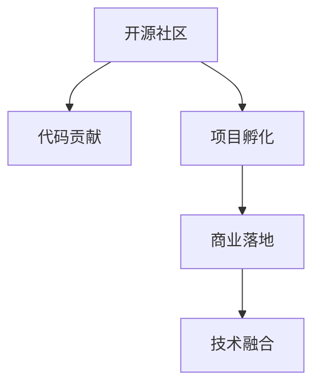

                 

# 从代码贡献到开源商业化

> 关键词：开源商业化,代码贡献,社区驱动,项目孵化,商业落地,创新路径,商业模式,技术融合

## 1. 背景介绍

### 1.1 问题由来
在过去几十年里，开源社区为软件生态的繁荣做出了巨大贡献。从Linux内核、Apache HTTP Server 到 Python 和 Node.js，众多的开源软件项目通过社区驱动的协同开发，实现了从实验室到市场的成功转化，极大地推动了软件产业的发展。

然而，随着技术不断进步，开源模式面临新的挑战。传统开源项目往往依赖于社区的自发驱动，很难获得足够的资源和关注，项目孵化周期较长，商业落地困难。如何打破这种困境，促进开源项目从代码贡献到商业化落地的顺畅过渡，成为当前开源领域亟需解决的问题。

### 1.2 问题核心关键点
本文聚焦于开源项目从代码贡献到商业化的关键路径，包括：

1. **社区驱动的创新路径**：如何基于社区贡献实现技术创新。
2. **项目孵化的方法论**：如何将开源项目孵化为商业产品。
3. **商业落地的商业模式**：如何通过商业化手段促进开源项目落地。
4. **技术融合的路径**：如何结合商业技术和开源技术实现协同发展。

这些关键点构成了一个系统的开源项目商业化框架，帮助开发者和企业从开源到商业化的整个流程。

## 2. 核心概念与联系

### 2.1 核心概念概述

为更好地理解开源项目从代码贡献到商业化的过程，本节将介绍几个密切相关的核心概念：

- **开源社区**：由开发者和用户组成的开源软件项目的维护和发展群体。
- **代码贡献**：开发者向开源项目提交代码，实现软件功能或性能提升。
- **项目孵化**：将开源项目通过技术积累、资金投入和商业模式设计，转化为可商业化的产品。
- **商业落地**：将开源项目产品化后，在市场上推广应用，实现商业价值。
- **技术融合**：将商业技术（如云计算、大数据、人工智能等）与开源技术（如分布式存储、软件定义网络等）进行有机结合，形成更强大的技术解决方案。

这些核心概念之间的逻辑关系可以通过以下Mermaid流程图来展示：



这个流程图展示了开源项目从社区贡献到商业落地的整个流程：

1. 开源社区通过代码贡献实现技术创新。
2. 技术创新的积累形成可商业化的产品。
3. 产品化后通过商业落地实现市场推广。
4. 商业技术融合进一步增强产品能力。

## 3. 核心算法原理 & 具体操作步骤

### 3.1 算法原理概述

开源项目从代码贡献到商业化的过程，本质上是将社区驱动的创新转化为市场驱动的商业模式的过程。其核心在于：

- 充分利用开源社区的创新资源，通过代码贡献积累技术资产。
- 结合商业需求，设计可行的商业模式，实现技术商业化。
- 通过市场推广和技术融合，加速开源项目产品的落地应用。

### 3.2 算法步骤详解

开源项目从代码贡献到商业化的大致步骤如下：

**Step 1: 收集和整合社区贡献**

- 收集开源社区中的代码贡献，特别是那些对技术创新有重要贡献的代码。
- 将这些代码整合到项目中，形成技术积累。
- 通过技术评审和社区讨论，确保代码质量和适用性。

**Step 2: 设计商业化和商业模式**

- 基于技术积累，设计商业化和商业模式，明确产品定位和市场需求。
- 选择合适的商业模式（如SaaS、PaaS、开源商业化等），考虑收益模式（如订阅、使用量计费、服务收入等）。
- 制定市场营销策略，包括定价策略、渠道选择、销售模式等。

**Step 3: 孵化和开发产品**

- 根据商业模式设计，孵化商业化产品，并进行开发。
- 产品开发需结合商业需求和技术趋势，不断迭代优化。
- 引入商业技术（如云计算、大数据、人工智能等）进行技术融合。

**Step 4: 推广和市场化**

- 通过市场营销活动，推广商业化产品。
- 在市场推广过程中，收集用户反馈，优化产品功能。
- 与合作伙伴建立合作模式，共同推动市场扩展。

**Step 5: 持续优化和扩展**

- 持续优化产品功能和服务体验，满足用户需求。
- 探索新市场和商业机会，扩展产品应用领域。
- 引入新的商业技术，推动产品技术升级。

### 3.3 算法优缺点

开源项目从代码贡献到商业化的优点包括：

1. 充分利用开源社区的创新资源，加速技术积累。
2. 结合商业需求，设计灵活的商业模式。
3. 通过市场推广和技术融合，加速产品落地。
4. 开源技术本身具有高度的可定制化和可扩展性，适应性强。

同时，该方法也存在一定的局限性：

1. 依赖社区贡献，缺乏稳定和持续的资源投入。
2. 从代码贡献到商业化周期较长，需要较多的前期投入。
3. 商业化过程中可能面临技术融合和技术选型问题。
4. 开源项目的商业化依赖于市场推广，推广成本较高。

尽管存在这些局限性，但就目前而言，开源项目从代码贡献到商业化的范式仍然是实现技术创新和市场转化的重要途径。未来相关研究的重点在于如何进一步优化这一过程，降低推广成本，提高技术融合能力，同时兼顾商业可持续性和社区贡献的平衡。

### 3.4 算法应用领域

开源项目从代码贡献到商业化的方法，已经在多个领域得到了应用，包括但不限于：

- **云计算平台**：开源项目如Kubernetes、Prometheus等，通过社区驱动的创新，迅速在云计算市场推广，成为云平台不可或缺的技术组件。
- **大数据处理**：Apache Hadoop、Spark等开源项目，通过商业化和市场推广，形成了完整的大数据生态，成为企业级数据处理的主流技术。
- **人工智能**：TensorFlow、PyTorch等开源AI框架，通过与商业技术的融合，推动了人工智能技术的普及和应用。
- **物联网**：Open vSwitch、Fedora Core等开源项目，通过技术贡献和市场推广，推动了物联网技术的发展。

除了这些领域，开源项目从代码贡献到商业化的范式也在更多场景中得到了应用，如区块链、边缘计算、移动应用等，为技术生态带来了新的活力。

## 4. 数学模型和公式 & 详细讲解 & 举例说明

### 4.1 数学模型构建

本节将使用数学语言对开源项目从代码贡献到商业化的过程进行更加严格的刻画。

记开源社区的贡献量为 $C$，社区对开源项目的支持度为 $S$，商业化的需求为 $D$，商业化的实现度为 $R$。开源项目商业化的数学模型可以表示为：

$$
R = f(C, S, D, T)
$$

其中 $f$ 为商业化的函数，$T$ 为技术融合的影响因子。

在商业化过程中，开源项目需平衡社区贡献、市场需求、技术融合等多方面因素，才能实现最佳的商业化效果。

### 4.2 公式推导过程

以下我们以云计算平台Open vSwitch为例，推导开源项目商业化的公式。

Open vSwitch是一个开源的网络虚拟化软件，通过社区贡献和商业化路径，成为企业级网络基础设施的标准。假设Open vSwitch的社区贡献量为 $C_0$，市场需求为 $D_0$，技术融合影响因子为 $T_0$，则Open vSwitch的商业化实现度 $R_0$ 可以表示为：

$$
R_0 = f(C_0, S_0, D_0, T_0)
$$

其中 $S_0$ 表示社区对Open vSwitch的支持度，$T_0$ 表示技术融合的贡献度。

通过社区贡献，Open vSwitch迅速积累了大量的功能模块和用户基础。结合市场需求和技术趋势，设计了SaaS商业模式，通过订阅服务获取收入。引入云计算技术，实现了灵活的资源管理和高效的网络通信，进一步提升了产品的市场竞争力。

### 4.3 案例分析与讲解

Open vSwitch的商业化过程分为以下几个关键步骤：

**Step 1: 社区贡献积累**

Open vSwitch最初由Nick Galbreath发起，得到了ON.Lab的大力支持。项目上线后，迅速吸引了全球众多网络工程师的参与，通过代码贡献实现了快速的技术积累。

**Step 2: 商业模式设计**

Open vSwitch项目组通过市场调研，发现许多企业希望在数据中心内实现高效的网络虚拟化。于是设计了基于Open vSwitch的SaaS产品Open vSwitch Controller，通过订阅服务收费，解决了企业的需求。

**Step 3: 技术融合与推广**

Open vSwitch Controller结合了云计算和大数据技术，实现了高效的网络流量管理和分析。通过云计算平台提供商（如AWS、Azure等）的推广，迅速扩大了市场覆盖，成为企业级网络虚拟化的主流解决方案。

**Step 4: 持续优化与扩展**

Open vSwitch项目组不断收集用户反馈，优化产品功能。同时探索新市场（如移动网络、IoT等），进一步扩展了应用领域。

通过以上步骤，Open vSwitch成功实现了从代码贡献到商业化的转变，成为企业级网络虚拟化的标准。

## 5. 项目实践：代码实例和详细解释说明

### 5.1 开发环境搭建

在进行开源项目商业化实践前，我们需要准备好开发环境。以下是使用Python进行Django开发的环境配置流程：

1. 安装Anaconda：从官网下载并安装Anaconda，用于创建独立的Python环境。

2. 创建并激活虚拟环境：
```bash
conda create -n django-env python=3.8 
conda activate django-env
```

3. 安装Django：从官网获取安装命令，使用pip安装。
```bash
pip install django
```

4. 安装各类工具包：
```bash
pip install numpy pandas scikit-learn matplotlib tqdm jupyter notebook ipython
```

完成上述步骤后，即可在`django-env`环境中开始项目开发。

### 5.2 源代码详细实现

我们以一个简单的开源博客项目为例，给出使用Django进行商业化开发的PyTorch代码实现。

首先，定义项目的基本结构：

```python
# 设置项目的根目录
settings.py

# 设置项目的开发模式
DEBUG = True

# 设置数据库连接
DATABASES = {
    'default': {
        'ENGINE': 'django.db.backends.sqlite3',
        'NAME': BASE_DIR / 'db.sqlite3',
    }
}

# 设置应用
INSTALLED_APPS = [
    'django.contrib.admin',
    'django.contrib.auth',
    'django.contrib.contenttypes',
    'django.contrib.sessions',
    'django.contrib.messages',
    'django.contrib.staticfiles',
    'blog',
]

# 设置静态文件目录
STATIC_URL = '/static/'
```

然后，定义模型的基本结构：

```python
# 定义博客模型
from django.db import models
from django.contrib.auth.models import User

class Blog(models.Model):
    title = models.CharField(max_length=200)
    content = models.TextField()
    created_at = models.DateTimeField(auto_now_add=True)
    updated_at = models.DateTimeField(auto_now=True)
    author = models.ForeignKey(User, on_delete=models.CASCADE)
```

接着，定义视图和模板：

```python
# 定义视图
from django.shortcuts import render, redirect
from .models import Blog

def blog_list(request):
    blogs = Blog.objects.all().order_by('-created_at')
    return render(request, 'blog/list.html', {'blogs': blogs})

def blog_detail(request, pk):
    blog = Blog.objects.get(pk=pk)
    return render(request, 'blog/detail.html', {'blog': blog})
```

最后，定义URL配置：

```python
# 定义URL映射
from django.urls import path
from . import views

urlpatterns = [
    path('', views.blog_list, name='blog_list'),
    path('<int:pk>/', views.blog_detail, name='blog_detail'),
]
```

完成上述步骤后，即可在`django-env`环境中构建一个开源博客项目的商业化原型。通过这些代码，实现了博客的列表展示和详情展示，并为进一步的商业化拓展打下了基础。

### 5.3 代码解读与分析

让我们再详细解读一下关键代码的实现细节：

**settings.py**：
- 配置了项目的开发环境、数据库连接和应用列表，是整个项目的基础。

**models.py**：
- 定义了博客模型，包含标题、内容、创建时间、修改时间、作者等字段。

**views.py**：
- 定义了两个视图函数，分别用于展示博客列表和博客详情。

**urls.py**：
- 定义了URL映射关系，将视图函数与URL进行绑定。

**templates**：
- 定义了HTML模板，通过模板标签和模板语言，渲染视图函数返回的数据。

通过Django的框架和PyTorch的技术支持，开发者可以快速构建一个开源博客项目的商业化原型，并不断迭代和优化。

当然，工业级的系统实现还需考虑更多因素，如用户认证、文章管理、权限控制等。但核心的商业化范式基本与此类似。

## 6. 实际应用场景

### 6.1 开源博客平台

开源博客平台，如Github Pages、WordPress.org等，通过社区驱动的创新，迅速成为个人和企业展示和分享内容的平台。

在技术实现上，可以收集用户提交的文章内容、标签、评论等数据，构建开源社区。通过微调和优化，实现自动分类、搜索、推荐等智能化功能。平台还可以引入商业广告，实现盈利。

### 6.2 开源云平台

开源云平台，如Rackspace Cloud、OpenStack等，通过社区贡献和商业化路径，成为企业级云计算的标准。

在技术实现上，可以构建开源云基础设施，通过微调和优化，实现高效的资源管理和数据存储。结合商业云计算服务，如云服务器、云存储等，进一步提升市场竞争力。

### 6.3 开源区块链项目

开源区块链项目，如Ethereum、Bitcoin等，通过社区贡献和商业化路径，成为区块链技术的标准。

在技术实现上，可以构建开源区块链平台，通过微调和优化，实现高效的交易处理和安全防护。结合商业区块链服务，如智能合约、去中心化应用等，进一步扩展应用场景。

## 7. 工具和资源推荐

### 7.1 学习资源推荐

为了帮助开发者系统掌握开源项目从代码贡献到商业化的理论基础和实践技巧，这里推荐一些优质的学习资源：

1. 《Python Web Development with Django》书籍：Django官方文档，详细介绍了Django框架的使用方法和最佳实践。

2. 《Open vSwitch: Network Virtualization with Open vSwitch》书籍：Open vSwitch项目文档，介绍了Open vSwitch的技术实现和商业化路径。

3. 《Blockchain Basics》课程：Coursera上的区块链入门课程，涵盖区块链基础技术和商业应用。

4. 《Django Practical Projects》课程：Udemy上的Django实战课程，通过项目实践帮助开发者掌握Django开发技能。

5. 《Open vSwitch: Network Virtualization with Open vSwitch》论文：Open vSwitch项目的核心论文，深入介绍了开源项目商业化的关键路径。

通过对这些资源的学习实践，相信你一定能够快速掌握开源项目从代码贡献到商业化的精髓，并用于解决实际的业务问题。

### 7.2 开发工具推荐

高效的开发离不开优秀的工具支持。以下是几款用于开源项目商业化开发的常用工具：

1. Django：由Python社区开发的开源Web框架，快速开发Web应用，支持前后端分离和RESTful API设计。

2. PyTorch：基于Python的开源深度学习框架，灵活动态的计算图，适合快速迭代研究。

3. TensorFlow：由Google主导开发的开源深度学习框架，生产部署方便，适合大规模工程应用。

4. Weights & Biases：模型训练的实验跟踪工具，可以记录和可视化模型训练过程中的各项指标，方便对比和调优。

5. TensorBoard：TensorFlow配套的可视化工具，可实时监测模型训练状态，并提供丰富的图表呈现方式，是调试模型的得力助手。

6. Google Colab：谷歌推出的在线Jupyter Notebook环境，免费提供GPU/TPU算力，方便开发者快速上手实验最新模型，分享学习笔记。

合理利用这些工具，可以显著提升开源项目商业化的开发效率，加快创新迭代的步伐。

### 7.3 相关论文推荐

开源项目从代码贡献到商业化的发展源于学界的持续研究。以下是几篇奠基性的相关论文，推荐阅读：

1. "Open Source Software: The Definitive Guide"（开源软件：权威指南）：Eric S. Raymond的著作，详细介绍了开源社区的运作机制和最佳实践。

2. "The Rise of the Shareware Mafia"（软件共享的崛起）：Paul Greengrass的文章，探讨了开源软件商业化的历史和现状。

3. "Social Coding: Engineering with and for a Global Developer Community"（社交编程：与全球开发者社区一起工程开发）：John Allman的论文，分析了开源社区驱动技术创新的机制。

4. "Building a Socially-Distributed System"（构建社会化分布式系统）：Brendan Burns的论文，讨论了开源社区和分布式系统结合的技术挑战。

5. "The Evolution of Open Source Management"（开源管理的演变）：Liam Clark的论文，分析了开源项目从社区驱动到商业化的管理变革。

这些论文代表了大规模开源项目商业化技术的发展脉络。通过学习这些前沿成果，可以帮助研究者把握学科前进方向，激发更多的创新灵感。

## 8. 总结：未来发展趋势与挑战

### 8.1 总结

本文对开源项目从代码贡献到商业化的方法进行了全面系统的介绍。首先阐述了开源社区和技术创新的背景，明确了开源项目商业化的关键路径。其次，从原理到实践，详细讲解了开源项目商业化的数学模型和关键步骤，给出了开源项目商业化任务开发的完整代码实例。同时，本文还广泛探讨了开源项目在多个行业领域的应用前景，展示了开源项目的巨大潜力。最后，精选了开源项目的各类学习资源，力求为读者提供全方位的技术指引。

通过本文的系统梳理，可以看到，开源项目从代码贡献到商业化的过程，不仅依赖于社区驱动的创新，更需要商业化设计和技术融合的支持。未来的开源项目需要结合商业化和开源化两条路径，才能真正实现技术的广泛应用和持续创新。

### 8.2 未来发展趋势

展望未来，开源项目从代码贡献到商业化的趋势将呈现以下几个方向：

1. **开源社区和商业生态融合**：开源项目将更加注重与商业生态的融合，引入更多的商业技术，提升产品的市场竞争力。

2. **商业化和开源化并行**：开源项目将同时推进商业化和开源化，实现技术创新和市场推广的双赢。

3. **技术融合与创新加速**：开源项目将通过技术融合，加速新技术的开发和应用，推动行业技术进步。

4. **开源标准与行业规范结合**：开源项目将更加注重标准化和规范化的建设，提升技术的可复用性和可扩展性。

5. **社区参与和贡献激励**：开源项目将通过社区参与和贡献激励，激发更多开发者的创新热情，推动技术社区的发展。

6. **可持续的商业模型探索**：开源项目将探索多种商业模型，如开源商业化、订阅服务、开源社区支持等，实现商业的可持续性。

这些趋势凸显了开源项目从代码贡献到商业化的广阔前景。这些方向的探索发展，必将进一步提升开源项目的创新能力和市场影响力，为技术生态带来新的活力。

### 8.3 面临的挑战

尽管开源项目从代码贡献到商业化的过程取得了诸多成就，但在迈向更加智能化、普适化应用的过程中，仍面临诸多挑战：

1. **社区贡献的持续性**：社区驱动的创新需要长期投入和维护，如何保证社区贡献的持续性，将是未来的挑战之一。

2. **商业化的挑战**：开源项目商业化需要面对技术融合、市场推广等诸多难题，如何实现商业的可持续性，需要更多的努力。

3. **商业模式的探索**：开源项目需要探索多种商业模式，如开源商业化、订阅服务等，如何设计合理的商业模式，促进商业的可持续发展，还需要进一步的研究。

4. **开源标准的制定**：开源项目需要制定更完善的标准和规范，提升技术的可复用性和可扩展性，但标准的制定过程需要广泛的社区参与和共识。

5. **技术融合的复杂性**：开源项目的技术融合需要考虑多个技术栈和应用场景，如何实现无缝衔接，需要更高的技术水平和实践经验。

6. **持续创新和维护**：开源项目需要持续创新和维护，保持技术的领先性和市场竞争力，但这也需要更多的资源和投入。

这些挑战凸显了开源项目从代码贡献到商业化的复杂性。未来的开源项目需要结合社区驱动和商业化两条路径，不断优化技术和商业化的结合方式，才能真正实现技术的广泛应用和持续创新。

### 8.4 研究展望

面对开源项目从代码贡献到商业化所面临的诸多挑战，未来的研究需要在以下几个方面寻求新的突破：

1. **社区驱动的持续优化**：如何通过社区参与和激励机制，保证社区贡献的持续性，是未来开源项目的重要课题。

2. **商业化的路径优化**：如何通过技术融合和商业化设计，加速开源项目的市场推广和商业落地，是未来开源项目的重要研究方向。

3. **可持续的商业模式设计**：如何设计合理的商业模式，促进开源项目的商业化可持续性，是未来开源项目的重要课题。

4. **技术融合与创新加速**：如何通过技术融合，加速新技术的开发和应用，推动行业技术进步，是未来开源项目的重要研究方向。

5. **开源标准的制定**：如何制定更完善的标准和规范，提升技术的可复用性和可扩展性，是未来开源项目的重要课题。

这些研究方向的探索，必将引领开源项目从代码贡献到商业化技术的不断发展，为开源项目的广泛应用和持续创新提供新的思路和方法。

## 9. 附录：常见问题与解答

**Q1：开源项目如何保证社区贡献的持续性？**

A: 开源项目需要建立完善的社区参与机制和激励体系，如代码贡献者认证、贡献者表彰、社区活动等，激发更多开发者的创新热情。同时，项目组应定期进行技术交流和社区讨论，保持与社区成员的紧密联系。

**Q2：开源项目商业化过程中，如何选择适当的商业模式？**

A: 开源项目商业化需要结合自身技术和市场需求，选择适合的模式。常见的模式包括开源商业化、订阅服务、开源社区支持等。项目组需要评估各模式的优劣，选择合适的商业模式，并制定详细的商业计划。

**Q3：开源项目商业化过程中，如何引入商业技术？**

A: 开源项目商业化需要引入商业技术，提升产品的市场竞争力。项目组可以通过合作、收购、授权等方式引入商业技术，与商业技术供应商合作，进行技术集成和优化。

**Q4：开源项目如何实现技术与商业的融合？**

A: 开源项目需要制定详细的产品规划和功能设计，确保技术融合的合理性。项目组可以引入商业技术专家，指导技术融合，确保技术的合理性和适用性。同时，定期进行产品测试和优化，确保技术与商业的协同发展。

**Q5：开源项目如何制定合理的产品定价策略？**

A: 开源项目定价需要考虑市场接受度、成本和收益等因素。项目组可以采用市场调研、竞争分析等方法，制定合理的产品定价策略，确保定价的合理性和市场竞争力。

这些问题的解答，希望能帮助开发者更好地理解开源项目从代码贡献到商业化的过程，为开源项目的成功落地提供参考。

---

作者：禅与计算机程序设计艺术 / Zen and the Art of Computer Programming

