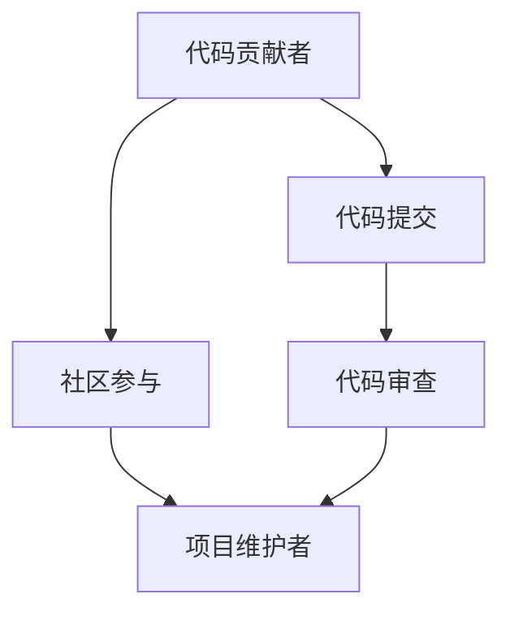

                 

# 从代码贡献者到开源项目维护者

> 关键词：开源项目, 代码贡献, 项目维护, GitHub, 社区参与, 代码审查, 贡献指南, 代码管理

## 1. 背景介绍

在软件开发的世界里，成为一名优秀的代码贡献者是一项光荣的任务。他们用自己的代码和知识，帮助项目变得更加完善和强大。但随着时间的推移，一些贡献者逐渐成长为开源项目的重要维护者。本文将探讨从代码贡献者到开源项目维护者的转变，帮助那些有志于此的开发者明确道路，并深入了解这一角色的挑战和机遇。

## 2. 核心概念与联系

为了更好地理解这一转变，我们先定义几个关键概念：

- **开源项目**：指的是软件开发者共同协作、分享代码和资源的项目，通常托管在如GitHub这样的代码托管平台上。

- **代码贡献者**：为开源项目编写代码、优化现有代码或提交新功能的开发者。

- **项目维护者**：负责确保代码质量、管理项目资源、协调团队工作、解决技术问题等职责，并常常会参与到项目治理中。

- **社区参与**：指在开源项目中积极与社区成员互动，包括回答问题、编写文档、组织活动等。

- **代码审查**：由其他开发者对新提交的代码进行评审，确保其符合代码标准、质量高且易于维护。

这些概念之间的关系可以通过以下Mermaid流程图来展示：



这个流程图展示了代码贡献者如何通过提交代码、参与社区以及经历代码审查等过程，最终转变为项目维护者。

## 3. 核心算法原理 & 具体操作步骤

### 3.1 算法原理概述

从一个代码贡献者成长为项目维护者的过程，本质上是一个知识积累和技能提升的过程。贡献者通过不断学习和实践，逐渐掌握了更多的软件开发和项目管理技巧，从而能够承担更多的责任和角色。

### 3.2 算法步骤详解

1. **了解项目**：阅读项目的文档、代码库、贡献指南，了解项目的结构、规范和社区规则。

2. **参与讨论**：在项目的讨论区（如GitHub的Issue跟踪、邮件列表等）中积极参与，提出问题、提供解答和分享见解。

3. **提交贡献**：根据项目的贡献指南，编写代码、优化功能或提交新特性。遵循项目的代码风格和命名规范。

4. **代码审查**：在提交代码前，仔细阅读项目的代码审查指南，确保代码符合项目标准。参与其他贡献者的代码审查，学习如何提出建设性反馈。

5. **贡献多样性**：不仅仅局限于编写代码，还可以参与文档编写、活动组织、会议演讲等，为项目贡献多样化的价值。

6. **接受反馈**：在贡献过程中，接受和反馈其他开发者的意见和建议，不断改进自己的贡献。

7. **逐步承担更多责任**：随着贡献量的增加和社区的认可，逐步承担更多的责任，如管理问题、指导新贡献者等。

8. **成为核心开发者**：经过一段时间的积极参与和贡献，如果获得了项目的认可，就有可能被邀请成为核心开发者。

### 3.3 算法优缺点

**优点**：
- **提升技能**：通过不断学习和实践，贡献者能够提升编程、项目管理、沟通协作等技能。
- **扩大影响力**：成为项目维护者后，可以影响项目的方向和社区的发展。
- **丰富的经验**：维护者通常有更丰富的实战经验，能更有效地解决问题和指导他人。

**缺点**：
- **时间投入**：维护者需要投入大量时间在项目上，可能会与日常工作发生冲突。
- **责任重大**：维护者不仅要保证代码质量，还要管理社区和资源。
- **社区压力**：维护者会面临来自社区的各种压力和期望，需要较强的心理素质和沟通能力。

### 3.4 算法应用领域

从代码贡献者到项目维护者的转变，不仅限于软件开发领域。以下是一些常见应用领域：

- **开源软件**：如Linux内核、Apache HTTP Server等。
- **科学计算**：如SciPy、NumPy等。
- **数据处理**：如Pandas、Spark等。
- **人工智能**：如TensorFlow、PyTorch等。

## 4. 数学模型和公式 & 详细讲解 & 举例说明

### 4.1 数学模型构建

尽管成为项目维护者的过程不涉及复杂的数学模型，但我们可以用简单的数学模型来描述贡献者的成长轨迹。假设贡献者的技能水平为 $x$，项目需求为 $y$，贡献者的知识增长率为 $\gamma$，时间因素为 $t$。则贡献者的技能水平 $x$ 随时间 $t$ 增长的数学模型为：

$$ x(t) = x_0 e^{\gamma t} $$

其中，$x_0$ 是初始技能水平。

### 4.2 公式推导过程

对于任意贡献者 $i$，假设其在项目 $j$ 上的贡献时间为 $t_i^j$，则该贡献者在项目 $j$ 上的技能提升 $x_i^j(t_i^j)$ 可以表示为：

$$ x_i^j(t_i^j) = x_0^j e^{\gamma t_i^j} $$

贡献者 $i$ 在项目 $j$ 上的总贡献 $S_i^j$ 可以表示为：

$$ S_i^j = \sum_{t_i^j} x_i^j(t_i^j) $$

假设项目 $j$ 需要 $y_j$ 的技能水平，则成为项目维护者的条件可以表示为：

$$ S_i^j \geq y_j $$

### 4.3 案例分析与讲解

假设某贡献者 $i$ 在项目 $j$ 上的贡献时间为 1 年，初始技能水平为 $x_0^j = 5$，增长率为 $\gamma = 0.2$，而项目 $j$ 需要的技能水平为 $y_j = 10$。则在 1 年后，该贡献者在该项目上的技能提升为：

$$ x_i^j(1) = 5 e^{0.2 \times 1} = 6 $$

总贡献为：

$$ S_i^j = 6 $$

显然，$S_i^j < y_j$，因此该贡献者在 1 年后还不能成为项目维护者。但若该贡献者再贡献 1 年，则技能提升为：

$$ x_i^j(2) = 6 e^{0.2 \times 1} = 7.2 $$

总贡献为：

$$ S_i^j = 7.2 + 6 = 13.2 $$

此时 $S_i^j > y_j$，即该贡献者在 2 年后成为项目维护者。

## 5. 项目实践：代码实例和详细解释说明

### 5.1 开发环境搭建

为了实践这一转变，需要准备开发环境。以下是一些常用工具和步骤：

1. 安装Git：使用以下命令安装Git：

```bash
sudo apt-get update
sudo apt-get install git
```

2. 安装GitHub Desktop：下载并安装GitHub Desktop，方便管理GitHub上的项目。

3. 安装代码编辑器：如Visual Studio Code、Sublime Text等。

4. 配置SSH密钥：使用以下命令生成SSH密钥：

```bash
ssh-keygen -t rsa -b 4096 -C "your_email@example.com"
```

将生成的公钥添加到GitHub账户设置中。

### 5.2 源代码详细实现

以下是一个简单的示例，展示如何为GitHub项目贡献代码。

1. 克隆项目：使用以下命令克隆项目：

```bash
git clone https://github.com/example-project/example.git
```

2. 创建新分支：

```bash
git checkout -b new-feature
```

3. 编写代码：在新分支上进行编码。

4. 提交代码：使用以下命令提交代码：

```bash
git add .
git commit -m "Add new feature"
```

5. 推送代码：使用以下命令推送代码到GitHub：

```bash
git push origin new-feature
```

6. 代码审查：在GitHub上，其他开发者可以对其进行代码审查。

### 5.3 代码解读与分析

以下是代码提交和审查的详细解读：

**代码提交**：
- 使用 `git add .` 将工作目录中的所有文件添加到暂存区。
- 使用 `git commit` 提交修改，并添加提交信息。
- 使用 `git push` 将提交推送到GitHub远程仓库。

**代码审查**：
- 其他开发者可以通过评论功能提出建议和问题。
- 贡献者需及时回复并改进代码。

**贡献多样性**：
- 可以通过编写文档、创建示例代码等方式为项目贡献多样化的价值。

### 5.4 运行结果展示

贡献者提交代码后，可以通过以下方式查看运行结果：

1. 在本地机器上运行代码。
2. 使用代码托管平台提供的运行环境。
3. 在测试环境中验证代码的准确性。

## 6. 实际应用场景

### 6.4 未来应用展望

随着开源社区的不断壮大和新技术的不断涌现，开源项目维护者的角色将变得越来越重要。以下是一些未来应用展望：

- **多语言支持**：越来越多的开源项目将支持多种语言，维护者需要具备多语言编程能力。
- **云原生技术**：云原生技术如Kubernetes、Docker等在开源项目中广泛应用，维护者需要熟悉这些技术。
- **DevOps文化**：DevOps文化在开源项目中逐步普及，维护者需要掌握持续集成、自动化测试等工具和技术。
- **人工智能和机器学习**：开源项目越来越多地结合AI和ML技术，维护者需要了解这些技术并参与相关开发。
- **社区建设**：维护者需要参与社区建设，组织活动、推广项目、维护社区健康发展。

## 7. 工具和资源推荐

### 7.1 学习资源推荐

以下是一些推荐的资源，帮助开发者更好地成长为项目维护者：

1. **GitHub官方文档**：提供关于Git、GitHub和GitHub Desktop的详细指南和教程。
2. **《开源项目管理》（开源项目管理之道）**：介绍开源项目的管理和维护技巧。
3. **《软件工程师如何成为管理者》**：指导软件开发人员如何在职业生涯中成长为技术管理者。
4. **《开源项目维护指南》**：提供关于开源项目维护的详细指南和最佳实践。
5. **《代码审查的艺术》**：讲解如何进行有效的代码审查。

### 7.2 开发工具推荐

以下是一些推荐的开发工具，帮助开发者在项目维护中提高效率：

1. **GitHub Desktop**：简化GitHub项目的克隆、分支、提交、推送等操作。
2. **Visual Studio Code**：强大的代码编辑器，支持Git、GitHub等扩展。
3. **Git**：版本控制系统，用于管理代码变更。
4. **GitHub Actions**：自动化测试、部署等任务的工具。
5. **Jenkins**：自动化持续集成工具，支持多种构建和部署环境。

### 7.3 相关论文推荐

以下是一些关于开源项目维护的论文，供有兴趣的读者深入研究：

1. **《开源社区维护者：角色、实践和挑战》**：研究开源社区维护者的角色和实践。
2. **《开源项目的演化和管理》**：探讨开源项目的演化和项目管理。
3. **《开源项目的可持续性》**：研究开源项目的可持续性和贡献者行为。

## 8. 总结：未来发展趋势与挑战

### 8.1 研究成果总结

从代码贡献者到项目维护者的转变，不仅是技能和知识的提升，更是责任和角色的转变。这一过程需要不断学习和实践，逐渐适应项目的需求和管理挑战。

### 8.2 未来发展趋势

开源项目的未来趋势将是更加多样化、智能化和生态化。维护者需要适应这些变化，掌握新的技术和方法。

### 8.3 面临的挑战

随着开源社区的不断发展，项目维护者将面临更多的挑战，如技术栈更新、社区管理、多语言支持等。

### 8.4 研究展望

未来的研究应关注如何帮助更多的开发者成长为项目维护者，探索更高效的项目管理和维护方法。

## 9. 附录：常见问题与解答

**Q1：如何成为一名优秀的开源项目维护者？**

A: 成为优秀的开源项目维护者需要不断学习和实践，了解项目需求、参与社区活动、积极贡献代码、接受和反馈反馈。同时，需要具备较强的沟通能力和技术积累。

**Q2：开源项目维护者如何平衡日常工作和项目维护？**

A: 开源项目维护者需要合理分配时间和精力，明确优先级。可以设置固定的时间段专注于项目维护，其余时间处理日常工作。

**Q3：代码审查过程中需要注意什么？**

A: 代码审查需要注意代码风格、逻辑结构、代码注释、安全性、可维护性等方面。提出建设性意见，避免过度批评。

**Q4：如何处理项目中的技术债务？**

A: 技术债务是指项目中积累的未解决的问题和代码冗余。维护者可以通过重构、自动化测试等方式逐步解决。

**Q5：如何管理开源项目的社区？**

A: 管理开源项目的社区需要明确社区规则，促进积极讨论，处理争议问题，组织活动和培训等。

---

作者：禅与计算机程序设计艺术 / Zen and the Art of Computer Programming

