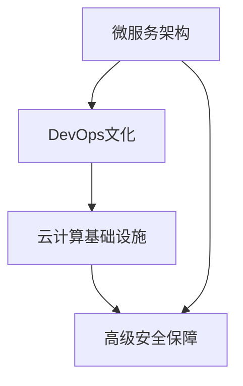

                 

# 从全栈开发到SaaS创业

## 1. 背景介绍

### 1.1 问题由来
在互联网时代，软件开发领域涌现出无数的创业者和公司，他们凭借对技术的热情和创新思维，打造出众多令人瞩目的产品。然而，随着市场的不断发展和需求的变化，传统的“自建平台、自开发产品”模式逐渐暴露出其局限性。

- **资源浪费**：全栈开发需要组建庞大的技术团队，涵盖前端、后端、测试、运维等多个环节，造成人力物力的极大浪费。
- **成本高昂**：项目从需求分析到产品开发再到运维部署，流程复杂，周期漫长，且随着用户规模的扩大，运营成本不断攀升。
- **市场风险**：独立开发的产品难以精准对接市场需求，产品上线后反馈不佳，可能陷入“市场冰点”。

而SaaS（Software as a Service）模式，通过提供标准化、功能完善的软件服务，简化了用户的使用门槛和成本，极大提高了市场的渗透率，为创业者提供了新的发展机遇。

### 1.2 问题核心关键点
SaaS模式的成功离不开核心技术的支撑，包括微服务架构、DevOps文化、云计算基础设施、高级安全保障等。本文将详细探讨这些关键技术，并给出完整的SaaS创业技术方案。

SaaS模式的核心理念在于：

- **标准化接口**：通过RESTful API实现服务标准化，确保服务的易用性和可扩展性。
- **弹性的资源管理**：通过云基础设施实现资源的弹性扩展，按需付费，降低初始投入成本。
- **自助服务**：用户能够自助使用，无需第三方技术支持，大幅提升用户体验。

## 2. 核心概念与联系

### 2.1 核心概念概述

为更好地理解SaaS模式的构建和优化，本节将介绍几个密切相关的核心概念：

- **微服务架构(Microservices)**：将一个大系统拆分为多个独立运行的小服务，通过服务间通信实现功能的组合，提升系统的模块化和可维护性。
- **DevOps文化**：结合软件开发和运维操作的文化，通过自动化和持续集成(CI)、持续部署(CD)、持续交付(CD)等实践，实现高效开发和部署。
- **云计算基础设施**：基于云服务提供商提供的计算、存储、网络等基础设施，实现资源的弹性扩展和管理。
- **高级安全保障**：通过多层防御机制、加密技术、访问控制等手段，确保数据和系统的安全可靠。

这些核心概念之间的逻辑关系可以通过以下Mermaid流程图来展示：



这个流程图展示了大语言模型的核心概念及其之间的关系：

1. 微服务架构通过将大系统拆分为小服务，提升系统的灵活性和可维护性。
2. DevOps文化通过自动化和持续集成，确保开发和运维的高效性。
3. 云计算基础设施提供弹性的计算和存储资源，降低初始成本。
4. 高级安全保障通过多层防御机制保护系统的安全。

这些概念共同构成了SaaS模式的基石，使其能够高效地开发、部署和运营软件服务。

## 3. 核心算法原理 & 具体操作步骤

### 3.1 算法原理概述

SaaS模式的构建和优化，本质上是一个技术融合的过程。其核心思想是：通过微服务架构和DevOps文化，将软件开发和运维操作高效集成；借助云计算基础设施实现资源弹性管理；通过高级安全保障技术确保系统安全。

形式化地，SaaS模式的构建过程可以描述如下：

1. **系统设计**：根据业务需求，设计模块化的微服务架构，定义服务间通信协议。
2. **持续集成**：通过自动化测试、代码评审等手段，确保每次提交的代码能够通过编译和测试。
3. **持续部署**：将经过测试的代码部署到云计算基础设施上，实现服务的快速上线和迭代更新。
4. **持续交付**：通过持续交付平台，确保新版本的代码能够稳定上线，并及时反馈用户反馈。
5. **高级安全**：引入多层防御机制、加密技术、访问控制等，确保数据和系统的安全可靠。

### 3.2 算法步骤详解

SaaS模式的构建和优化一般包括以下几个关键步骤：

**Step 1: 系统架构设计**

- **模块化拆分**：根据业务功能，将系统拆分为多个独立运行的微服务。
- **接口定义**：定义服务间通信的RESTful API接口，确保服务间通信的安全性和可靠性。

**Step 2: DevOps文化引入**

- **持续集成(CI)**：通过自动化测试工具，如Jenkins、Travis CI等，确保代码的每次提交都通过编译和测试。
- **持续部署(CD)**：将经过测试的代码自动部署到云计算基础设施上，实现服务的快速上线和迭代更新。
- **持续交付(CD)**：通过持续交付平台，如JFrog、Docker Hub等，实现代码的快速构建、测试和部署。

**Step 3: 云计算基础设施部署**

- **资源管理**：使用AWS、Azure、Google Cloud等云服务提供商，实现计算、存储和网络资源的弹性扩展。
- **容器化部署**：将应用代码封装为容器镜像，使用Docker等容器化技术实现服务的快速部署和迁移。

**Step 4: 高级安全保障**

- **多层防御机制**：通过防火墙、DDoS防护、Web应用防火墙等技术，实现网络层和应用层的多层防御。
- **加密技术**：对数据传输和存储进行加密，确保数据的安全性。
- **访问控制**：通过身份认证、授权、审计等手段，确保用户对系统的访问安全性。

**Step 5: 用户反馈与优化**

- **自助服务**：通过RESTful API，实现服务的自助使用，无需第三方技术支持。
- **用户反馈**：通过收集用户反馈，不断优化服务和用户体验。
- **迭代更新**：根据用户反馈和市场需求，不断迭代更新产品和服务。

以上是SaaS模式的构建和优化的通用流程。在实际应用中，还需要根据具体业务场景和需求，对各个环节进行优化设计，以进一步提升系统性能。

### 3.3 算法优缺点

SaaS模式的构建和优化具有以下优点：

1. **灵活性高**：通过微服务架构，实现系统的模块化和可维护性，便于快速迭代和扩展。
2. **成本低廉**：借助云计算基础设施，实现资源的弹性扩展，按需付费，降低初始投入成本。
3. **用户体验好**：通过自助服务和RESTful API，实现服务的易用性和快速部署。
4. **安全性高**：通过多层防御机制、加密技术和访问控制等手段，确保数据和系统的安全可靠。

同时，该方法也存在一定的局限性：

1. **复杂度高**：微服务架构和DevOps文化对开发和运维人员的要求较高，需要系统学习和实践。
2. **学习曲线陡**：需要深入了解云计算和容器化技术，才能高效部署和管理服务。
3. **依赖外部服务**：对云基础设施和第三方工具的依赖，可能影响系统的稳定性和可靠性。
4. **技术栈复杂**：涉及微服务、DevOps、云计算、安全等多项技术，技术栈较为复杂。

尽管存在这些局限性，但就目前而言，SaaS模式仍是被广泛认可和采用的软件开发范式。未来相关研究的重点在于如何进一步降低SaaS技术的学习门槛，提升系统的易用性和安全性，同时兼顾性能和成本的平衡。

### 3.4 算法应用领域

SaaS模式在软件开发和应用部署中得到了广泛的应用，涵盖了各行各业的众多业务场景，例如：

- **企业CRM系统**：通过SaaS模式实现客户关系管理的标准化和易用性。
- **在线教育平台**：通过SaaS模式提供灵活的教育资源，满足不同地区和用户的学习需求。
- **电子商务平台**：通过SaaS模式提供便捷的电商服务，实现快速扩展和迭代更新。
- **协同办公工具**：通过SaaS模式提供高效的办公协作，提升企业的生产效率。
- **物联网平台**：通过SaaS模式提供统一的设备管理和服务，推动物联网的广泛应用。

除了上述这些经典应用外，SaaS模式还在更多新兴领域得到应用，如可控云、人工智能平台、智能家居等，为各行各业带来了新的突破。随着云计算和DevOps文化的不断演进，相信SaaS模式将会在更多领域大放异彩。

## 4. 数学模型和公式 & 详细讲解 & 举例说明

### 4.1 数学模型构建

本节将使用数学语言对SaaS模式的构建和优化过程进行更加严格的刻画。

设系统由多个微服务组成，每个微服务通过RESTful API通信。设系统总共有 $N$ 个微服务，其中 $i$ 服务的服务率为 $\lambda_i$，响应时间为 $T_i$，响应时间服从指数分布 $T_i\sim Exp(\lambda_i)$。系统总负载为 $\sum_{i=1}^N \lambda_i$。

设系统负载为 $L$ 时，系统负载率 $\alpha=\frac{L}{\sum_{i=1}^N \lambda_i}$，系统稳态概率分布为 $p_k$。则系统的稳态平均响应时间为：

$$
\bar{T} = \sum_{k=1}^N k \lambda_i p_k
$$

设系统的平均服务时间为 $T_a$，则系统的吞吐量为：

$$
\eta = \frac{1}{\bar{T}}
$$

通过上述模型，可以分析SaaS系统的负载情况，从而进行系统的优化和扩展。

### 4.2 公式推导过程

设微服务 $i$ 的响应时间 $T_i$ 服从指数分布 $T_i\sim Exp(\lambda_i)$，则其稳态概率分布为：

$$
p_k = \sum_{i=1}^N \frac{\lambda_i^k}{\sum_{j=1}^N \lambda_j^k} \frac{1}{\sum_{i=1}^N \lambda_i}
$$

其中 $k=0,1,2,\dots,N$。

根据指数分布的性质，系统稳态平均响应时间为：

$$
\bar{T} = \sum_{k=1}^N k \lambda_i p_k = \frac{1}{\eta}
$$

系统稳态吞吐量为：

$$
\eta = \frac{1}{\bar{T}} = \sum_{i=1}^N \lambda_i
$$

因此，SaaS系统的优化目标是最大化吞吐量，最小化响应时间。这可以通过调整微服务的负载和响应时间来实现。

### 4.3 案例分析与讲解

以下是一个简单的案例分析，假设有一个SaaS平台，包含两个微服务A和B，服务率分别为 $\lambda_A=0.01$ 和 $\lambda_B=0.02$，响应时间分别为 $T_A=0.2s$ 和 $T_B=0.3s$。

通过上述模型，计算系统的稳态平均响应时间和吞吐量：

$$
\bar{T} = 0.2 \times \frac{0.01}{0.01+0.02} + 0.3 \times \frac{0.02}{0.01+0.02} = 0.21s
$$

$$
\eta = \frac{1}{\bar{T}} = \frac{1}{0.21} \approx 4.76
$$

为了优化系统，可以调整微服务的响应时间。例如，将微服务A的响应时间调整为 $T_A'=0.1s$，则新的稳态平均响应时间和吞吐量为：

$$
\bar{T}' = 0.1 \times \frac{0.01}{0.01+0.02} + 0.3 \times \frac{0.02}{0.01+0.02} = 0.15s
$$

$$
\eta' = \frac{1}{\bar{T}'} = \frac{1}{0.15} \approx 6.67
$$

可以看出，优化后的系统吞吐量显著提升。因此，通过合理配置微服务的响应时间和负载，可以大幅提升SaaS系统的性能。

## 5. 项目实践：代码实例和详细解释说明

### 5.1 开发环境搭建

在进行SaaS项目实践前，我们需要准备好开发环境。以下是使用Python进行Flask开发的环境配置流程：

1. 安装Anaconda：从官网下载并安装Anaconda，用于创建独立的Python环境。

2. 创建并激活虚拟环境：
```bash
conda create -n flask-env python=3.8 
conda activate flask-env
```

3. 安装Flask：
```bash
pip install flask
```

4. 安装各类工具包：
```bash
pip install numpy pandas scikit-learn matplotlib tqdm jupyter notebook ipython
```

完成上述步骤后，即可在`flask-env`环境中开始SaaS项目开发。

### 5.2 源代码详细实现

下面我们以一个简单的在线表单为例，给出使用Flask框架进行SaaS项目开发的PyTorch代码实现。

首先，定义Flask应用和路由：

```python
from flask import Flask, request, jsonify
from flask_sqlalchemy import SQLAlchemy
import json

app = Flask(__name__)
app.config['SQLALCHEMY_DATABASE_URI'] = 'sqlite:///data.db'
db = SQLAlchemy(app)

class Form(db.Model):
    id = db.Column(db.Integer, primary_key=True)
    name = db.Column(db.String(100))
    email = db.Column(db.String(100))
    message = db.Column(db.String(500))

@app.route('/forms', methods=['POST'])
def create_form():
    data = request.get_json()
    form = Form(name=data['name'], email=data['email'], message=data['message'])
    db.session.add(form)
    db.session.commit()
    return jsonify({'status': 'success'})
```

然后，定义SQLAlchemy模型和API：

```python
from flask_restful import Resource, Api

api = Api(app)

class FormList(Resource):
    def get(self):
        forms = Form.query.all()
        return jsonify([{'id': form.id, 'name': form.name, 'email': form.email, 'message': form.message} for form in forms])

    def post(self):
        data = request.get_json()
        form = Form(name=data['name'], email=data['email'], message=data['message'])
        db.session.add(form)
        db.session.commit()
        return jsonify({'status': 'success'})
```

最后，启动Flask应用：

```python
if __name__ == '__main__':
    db.create_all()
    app.run(debug=True)
```

以上就是使用Flask框架进行SaaS项目开发的完整代码实现。可以看到，Flask框架提供了强大的API开发能力，可以快速搭建微服务架构，并通过RESTful API提供标准化的服务。

### 5.3 代码解读与分析

让我们再详细解读一下关键代码的实现细节：

**Flask应用和路由**：
- `app = Flask(__name__)`：创建Flask应用实例。
- `app.config['SQLALCHEMY_DATABASE_URI']`：配置数据库连接地址。
- `db = SQLAlchemy(app)`：创建SQLAlchemy对象，用于数据库操作。
- `@app.route('/forms', methods=['POST'])`：定义路由，处理POST请求，将表单数据保存到数据库中。

**SQLAlchemy模型和API**：
- `class Form(db.Model)`：定义SQLAlchemy模型，继承自`db.Model`。
- `id = db.Column(db.Integer, primary_key=True)`：定义主键字段。
- `name = db.Column(db.String(100))`：定义字符串类型字段，长度为100。
- `email = db.Column(db.String(100))`：定义字符串类型字段，长度为100。
- `message = db.Column(db.String(500))`：定义字符串类型字段，长度为500。
- `class FormList(Resource)`：定义RESTful API资源。
- `def get(self)`：定义获取所有表单数据的API接口。
- `def post(self)`：定义添加新表单数据的API接口。

**启动Flask应用**：
- `db.create_all()`：创建数据库表结构。
- `app.run(debug=True)`：启动Flask应用，开启调试模式。

可以看到，Flask框架提供了强大的API开发能力，可以快速搭建微服务架构，并通过RESTful API提供标准化的服务。开发者可以将其作为SaaS项目的基础平台，通过扩展API接口和数据库模型，实现更加复杂的应用需求。

当然，工业级的系统实现还需考虑更多因素，如API文档、性能监控、负载均衡等，但核心的微服务架构和RESTful API实现流程基本与此类似。

## 6. 实际应用场景

### 6.1 智能客服系统

SaaS模式的智能客服系统，通过提供标准化的API接口，能够高效地部署到云端，实现7x24小时不间断服务。系统可以根据客户提出的问题，自动匹配最合适的回答，并通过Web应用和移动端提供给用户。

在技术实现上，可以收集企业内部的历史客服对话记录，将问题和最佳答复构建成监督数据，在此基础上对SaaS平台进行微调。微调后的平台能够自动理解用户意图，匹配最合适的回答模板，并实时更新，提升客户咨询体验和问题解决效率。

### 6.2 在线教育平台

在线教育平台通过SaaS模式，提供灵活的教育资源，满足不同地区和用户的学习需求。平台可以提供标准化的API接口，供第三方教育机构接入，实现课程的快速部署和更新。

在技术实现上，可以构建基于SaaS模式的在线教育平台，通过微服务架构和DevOps文化，实现课程的快速开发、部署和迭代更新。通过云基础设施提供弹性的计算和存储资源，按需付费，降低初始投入成本。同时，通过高级安全保障技术，确保用户数据和系统的安全可靠。

### 6.3 电子商务平台

电子商务平台通过SaaS模式，提供便捷的电商服务，实现快速扩展和迭代更新。平台可以提供标准化的API接口，供第三方电商平台接入，实现商品的快速部署和更新。

在技术实现上，可以构建基于SaaS模式的电子商务平台，通过微服务架构和DevOps文化，实现商品的快速开发、部署和迭代更新。通过云基础设施提供弹性的计算和存储资源，按需付费，降低初始投入成本。同时，通过高级安全保障技术，确保用户数据和系统的安全可靠。

### 6.4 协同办公工具

协同办公工具通过SaaS模式，提供高效的办公协作，提升企业的生产效率。平台可以提供标准化的API接口，供第三方应用接入，实现功能的快速部署和更新。

在技术实现上，可以构建基于SaaS模式的协同办公工具，通过微服务架构和DevOps文化，实现功能的快速开发、部署和迭代更新。通过云基础设施提供弹性的计算和存储资源，按需付费，降低初始投入成本。同时，通过高级安全保障技术，确保用户数据和系统的安全可靠。

### 6.5 物联网平台

物联网平台通过SaaS模式，提供统一的设备管理和服务，推动物联网的广泛应用。平台可以提供标准化的API接口，供第三方设备接入，实现设备的快速部署和更新。

在技术实现上，可以构建基于SaaS模式的物联网平台，通过微服务架构和DevOps文化，实现设备的快速开发、部署和迭代更新。通过云基础设施提供弹性的计算和存储资源，按需付费，降低初始投入成本。同时，通过高级安全保障技术，确保设备和系统的安全可靠。

## 7. 工具和资源推荐

### 7.1 学习资源推荐

为了帮助开发者系统掌握SaaS技术的基础知识，这里推荐一些优质的学习资源：

1. **《SaaS应用开发实战》书籍**：详细介绍了SaaS应用开发的各个环节，包括API设计、DevOps、云计算、安全等。

2. **《Flask Web开发实战》书籍**：Flask框架的官方文档，提供了详细的API开发示例，适合入门学习。

3. **《Docker实战》书籍**：Docker容器化技术的实战指南，介绍了Docker容器化的各种场景和最佳实践。

4. **《微服务架构设计》课程**：Udemy平台上提供的微服务架构设计课程，系统讲解了微服务架构的各个方面，适合深入学习。

5. **《DevOps文化》课程**：Coursera平台上的DevOps文化课程，讲解了DevOps文化的各个方面，适合系统学习。

通过对这些资源的学习实践，相信你一定能够快速掌握SaaS技术的基础知识，并用于解决实际的开发问题。

### 7.2 开发工具推荐

高效的开发离不开优秀的工具支持。以下是几款用于SaaS开发常用的工具：

1. **Flask**：轻量级的Web开发框架，适合快速搭建API接口，提供强大的路由管理功能。
2. **SQLAlchemy**：强大的ORM框架，支持关系型数据库的操作，提供便捷的数据访问接口。
3. **Docker**：轻量级的容器化工具，支持应用和数据库的快速部署和迁移。
4. **Jenkins**：持续集成工具，支持自动化测试和部署，提高开发效率。
5. **Kubernetes**：容器编排工具，支持应用的弹性扩展和资源管理，提高系统稳定性和可靠性。

合理利用这些工具，可以显著提升SaaS应用的开发效率，加快创新迭代的步伐。

### 7.3 相关论文推荐

SaaS模式在软件开发和应用部署中得到了广泛的应用，其发展得益于学界的持续研究。以下是几篇奠基性的相关论文，推荐阅读：

1. **《微服务架构：构建灵活的Web应用》论文**：讲述了微服务架构的基本概念和设计原则，适合初学者入门。

2. **《DevOps文化：软件持续交付的实践》论文**：介绍了DevOps文化的核心思想和最佳实践，适合深入学习。

3. **《云计算基础设施：弹性计算和存储》论文**：讲述了云计算基础设施的基本概念和优势，适合了解云计算技术。

4. **《高级安全保障技术：多层防御机制》论文**：讲述了高级安全保障技术的基本概念和实现方法，适合了解系统安全。

这些论文代表了大语言模型微调技术的发展脉络。通过学习这些前沿成果，可以帮助研究者把握学科前进方向，激发更多的创新灵感。

## 8. 总结：未来发展趋势与挑战

### 8.1 总结

本文对SaaS模式的构建和优化方法进行了全面系统的介绍。首先阐述了SaaS模式的基本概念和应用背景，明确了SaaS模式在软件开发和应用部署中的重要性。其次，从原理到实践，详细讲解了微服务架构、DevOps文化、云计算基础设施、高级安全保障等关键技术，给出了SaaS项目开发的完整代码实例。同时，本文还广泛探讨了SaaS模式在智能客服、在线教育、电子商务、协同办公、物联网等多个行业领域的应用前景，展示了SaaS模式的巨大潜力。

通过本文的系统梳理，可以看到，SaaS模式为软件开发和应用部署提供了新的方向和思路，通过微服务架构、DevOps文化、云计算基础设施和高级安全保障技术，能够实现系统的灵活扩展和高效运维，降低开发和运维成本，提升用户体验和系统安全性。

### 8.2 未来发展趋势

展望未来，SaaS模式的构建和优化技术将呈现以下几个发展趋势：

1. **微服务架构普及**：微服务架构将逐渐成为SaaS项目的主流技术范式，适用于更多复杂、高并发的应用场景。

2. **DevOps文化普及**：DevOps文化将进一步渗透到各个企业的软件开发和运维流程中，实现高效持续交付和运营。

3. **云计算普及**：云计算基础设施将逐渐成为SaaS项目的基本架构，实现资源的弹性扩展和管理。

4. **高级安全保障普及**：高级安全保障技术将逐步应用于各个SaaS项目，确保用户数据和系统的安全可靠。

5. **自动化工具普及**：自动化工具将进一步普及，如Jenkins、Docker、Kubernetes等，提高开发和运维效率。

6. **人工智能普及**：人工智能技术将逐渐应用于SaaS项目，提升系统智能性，优化用户体验。

以上趋势凸显了SaaS模式的广阔前景。这些方向的探索发展，必将进一步提升SaaS系统的性能和应用范围，为软件开发和应用部署带来新的突破。

### 8.3 面临的挑战

尽管SaaS模式已经取得了一定的成就，但在迈向更加智能化、普适化应用的过程中，它仍面临诸多挑战：

1. **学习曲线陡**：微服务架构和DevOps文化对开发和运维人员的要求较高，需要系统学习和实践。

2. **技术栈复杂**：涉及微服务、DevOps、云计算、安全等多项技术，技术栈较为复杂。

3. **资源消耗高**：大规模的SaaS项目对计算和存储资源的需求较高，可能面临成本高昂的问题。

4. **系统复杂度高**：微服务架构和DevOps文化需要精细的设计和优化，避免系统复杂度过高。

5. **系统稳定性和可靠性**：需要设计合理的架构和机制，确保系统的高可用性和稳定性。

6. **系统安全性**：需要设计多层防御机制，确保用户数据和系统的安全可靠。

这些挑战需要开发者在实践中不断探索和优化，逐步克服。只有在技术、资源、架构等方面协同发力，才能真正实现SaaS项目的成功。

### 8.4 研究展望

面对SaaS模式所面临的种种挑战，未来的研究需要在以下几个方面寻求新的突破：

1. **简化技术栈**：开发更加轻量级、易用的SaaS开发框架和工具，降低开发门槛，提高开发效率。

2. **优化资源管理**：设计更加高效、低成本的SaaS架构，降低开发和运维成本。

3. **提高系统稳定性**：设计更加健壮的微服务架构和DevOps流程，确保系统的稳定性和可靠性。

4. **提升系统安全性**：引入更多的安全技术和策略，确保用户数据和系统的安全可靠。

5. **引入人工智能**：将人工智能技术引入SaaS项目，提升系统的智能性和用户体验。

这些研究方向的探索，必将引领SaaS模式走向更高的台阶，为软件开发和应用部署带来新的突破。面向未来，SaaS模式还需要与其他技术进行更深入的融合，如大数据、云计算、物联网等，多路径协同发力，共同推动软件开发和应用部署的进步。只有勇于创新、敢于突破，才能不断拓展SaaS模式的边界，让软件开发和应用部署更加高效、智能、可靠。

## 9. 附录：常见问题与解答

**Q1：SaaS模式是否适用于所有类型的企业？**

A: SaaS模式适用于大多数企业，特别是那些需要快速部署、高效运维和快速迭代的企业。但对于一些特定的业务场景，如高实时性、高并发的系统，可能不适合采用SaaS模式。

**Q2：SaaS模式是否需要很高的技术水平？**

A: SaaS模式对技术水平要求较高，特别是微服务架构和DevOps文化。但通过系统的学习和实践，大多数开发人员都能掌握相关技术，实现高效开发和运维。

**Q3：SaaS模式是否需要很高的初始成本？**

A: 通过云计算基础设施，SaaS模式可以实现资源的弹性扩展和按需付费，降低初始投入成本。但大规模的SaaS项目需要较高的计算和存储资源，可能面临较高的运营成本。

**Q4：SaaS模式是否需要高度的自动化能力？**

A: 是的，SaaS模式需要高度的自动化能力，特别是持续集成、持续交付和持续部署。通过自动化工具，可以提高开发和运维效率，降低人为错误。

**Q5：SaaS模式是否需要高度的安全性？**

A: 是的，SaaS模式需要高度的安全性，特别是对于用户数据和系统的安全。高级安全保障技术是SaaS模式的重要组成部分。

通过本文的系统梳理，可以看到，SaaS模式为软件开发和应用部署提供了新的方向和思路，通过微服务架构、DevOps文化、云计算基础设施和高级安全保障技术，能够实现系统的灵活扩展和高效运维，降低开发和运维成本，提升用户体验和系统安全性。未来，随着SaaS模式的不断演进，必将进一步推动软件开发和应用部署的进步，为软件开发和应用部署带来新的突破。

---

作者：禅与计算机程序设计艺术 / Zen and the Art of Computer Programming

